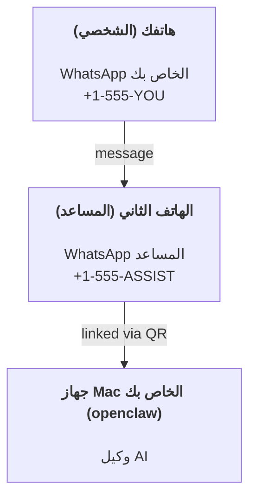

---
read_when:
    - إعداد مثيل مساعد جديد لأول مرة
    - مراجعة تبعات السلامة والأذونات
summary: دليل شامل من البداية إلى النهاية لتشغيل OpenClaw كمساعد شخصي مع تنبيهات السلامة
title: إعداد المساعد الشخصي
x-i18n:
    generated_at: "2026-04-24T08:05:36Z"
    model: gpt-5.4
    provider: openai
    source_hash: 3048f2faae826fc33d962f1fac92da3c0ce464d2de803fee381c897eb6c76436
    source_path: start/openclaw.md
    workflow: 15
---

# بناء مساعد شخصي باستخدام OpenClaw

OpenClaw هو Gateway مستضاف ذاتيًا يربط Discord وGoogle Chat وiMessage وMatrix وMicrosoft Teams وSignal وSlack وTelegram وWhatsApp وZalo وغير ذلك بوكلاء الذكاء الاصطناعي. يغطي هذا الدليل إعداد "المساعد الشخصي": رقم WhatsApp مخصص يتصرف كمساعدك الذكي الدائم التشغيل.

## ⚠️ السلامة أولًا

أنت تضع وكيلاً في موضع يتيح له:

- تشغيل أوامر على جهازك (بحسب سياسة الأدوات لديك)
- قراءة/كتابة الملفات في مساحة العمل الخاصة بك
- إرسال الرسائل مرة أخرى عبر WhatsApp/Telegram/Discord/Mattermost وغيرها من القنوات المضمنة

ابدأ بتحفظ:

- اضبط دائمًا `channels.whatsapp.allowFrom` (ولا تشغّله أبدًا مفتوحًا للعالم على جهاز Mac الشخصي لديك).
- استخدم رقم WhatsApp مخصصًا للمساعد.
- تعمل Heartbeat الآن افتراضيًا كل 30 دقيقة. عطّلها حتى تثق في الإعداد عبر تعيين `agents.defaults.heartbeat.every: "0m"`.

## المتطلبات المسبقة

- تثبيت OpenClaw وتشغيل الإعداد الأولي له — راجع [Getting Started](/ar/start/getting-started) إذا لم تفعل ذلك بعد
- رقم هاتف ثانٍ (SIM/eSIM/مدفوع مسبقًا) للمساعد

## إعداد الهاتفين (موصى به)

هذا ما تريده:



إذا ربطت WhatsApp الشخصي الخاص بك بـ OpenClaw، فستصبح كل رسالة تصلك "إدخالًا للوكيل". وهذا نادرًا ما يكون ما تريده.

## بدء سريع خلال 5 دقائق

1. اقترن مع WhatsApp Web ‏(يعرض QR؛ امسحه باستخدام هاتف المساعد):

```bash
openclaw channels login
```

2. ابدأ Gateway ‏(واتركه يعمل):

```bash
openclaw gateway --port 18789
```

3. ضع حدًا أدنى من التهيئة في `~/.openclaw/openclaw.json`:

```json5
{
  gateway: { mode: "local" },
  channels: { whatsapp: { allowFrom: ["+15555550123"] } },
}
```

أرسل الآن رسالة إلى رقم المساعد من هاتفك المدرج في قائمة السماح.

عند انتهاء الإعداد الأولي، يفتح OpenClaw لوحة المعلومات تلقائيًا ويطبع رابطًا نظيفًا (من دون token). إذا طلبت لوحة المعلومات المصادقة، فألصق السر المشترك المهيأ في إعدادات Control UI. يستخدم الإعداد الأولي token افتراضيًا (`gateway.auth.token`)، لكن مصادقة كلمة المرور تعمل أيضًا إذا بدّلت `gateway.auth.mode` إلى `password`. لإعادة الفتح لاحقًا: `openclaw dashboard`.

## امنح الوكيل مساحة عمل (AGENTS)

يقرأ OpenClaw تعليمات التشغيل و"الذاكرة" من دليل مساحة العمل الخاص به.

افتراضيًا، يستخدم OpenClaw المسار `~/.openclaw/workspace` كمساحة عمل للوكيل، وسيقوم بإنشائه (مع ملفات البداية `AGENTS.md` و`SOUL.md` و`TOOLS.md` و`IDENTITY.md` و`USER.md` و`HEARTBEAT.md`) تلقائيًا عند الإعداد/أول تشغيل للوكيل. لا يُنشأ `BOOTSTRAP.md` إلا عندما تكون مساحة العمل جديدة تمامًا (ويجب ألا يعود بعد حذفه). أما `MEMORY.md` فهو اختياري (ولا يُنشأ تلقائيًا)؛ وعند وجوده يتم تحميله للجلسات العادية. أما جلسات الوكيل الفرعي فلا تحقن إلا `AGENTS.md` و`TOOLS.md`.

نصيحة: تعامل مع هذا المجلد بوصفه "ذاكرة" OpenClaw واجعله مستودع git (ويُفضل أن يكون خاصًا) حتى تُنسخ ملفات `AGENTS.md` + ملفات الذاكرة احتياطيًا. وإذا كان git مثبتًا، فستُهيَّأ مساحات العمل الجديدة تمامًا تلقائيًا.

```bash
openclaw setup
```

تخطيط مساحة العمل الكامل + دليل النسخ الاحتياطي: [Agent workspace](/ar/concepts/agent-workspace)
سير عمل الذاكرة: [Memory](/ar/concepts/memory)

اختياري: اختر مساحة عمل مختلفة باستخدام `agents.defaults.workspace` ‏(يدعم `~`).

```json5
{
  agent: {
    workspace: "~/.openclaw/workspace",
  },
}
```

إذا كنت تشحن بالفعل ملفات مساحة العمل الخاصة بك من مستودع، فيمكنك تعطيل إنشاء ملفات bootstrap بالكامل:

```json5
{
  agent: {
    skipBootstrap: true,
  },
}
```

## التهيئة التي تحول ذلك إلى "مساعد"

يضبط OpenClaw افتراضيًا إعدادًا جيدًا للمساعد، لكنك غالبًا سترغب في ضبط:

- الشخصية/التعليمات في [`SOUL.md`](/ar/concepts/soul)
- الإعدادات الافتراضية للتفكير (إذا رغبت)
- Heartbeats ‏(بعد أن تثق في الإعداد)

مثال:

```json5
{
  logging: { level: "info" },
  agent: {
    model: "anthropic/claude-opus-4-6",
    workspace: "~/.openclaw/workspace",
    thinkingDefault: "high",
    timeoutSeconds: 1800,
    // ابدأ بـ 0؛ وفعّلها لاحقًا.
    heartbeat: { every: "0m" },
  },
  channels: {
    whatsapp: {
      allowFrom: ["+15555550123"],
      groups: {
        "*": { requireMention: true },
      },
    },
  },
  routing: {
    groupChat: {
      mentionPatterns: ["@openclaw", "openclaw"],
    },
  },
  session: {
    scope: "per-sender",
    resetTriggers: ["/new", "/reset"],
    reset: {
      mode: "daily",
      atHour: 4,
      idleMinutes: 10080,
    },
  },
}
```

## الجلسات والذاكرة

- ملفات الجلسات: `~/.openclaw/agents/<agentId>/sessions/{{SessionId}}.jsonl`
- البيانات الوصفية للجلسات (استخدام token، وآخر route، وغير ذلك): `~/.openclaw/agents/<agentId>/sessions/sessions.json` ‏(القديم: `~/.openclaw/sessions/sessions.json`)
- يبدأ `/new` أو `/reset` جلسة جديدة لتلك الدردشة (قابل للتهيئة عبر `resetTriggers`). وإذا أُرسل بمفرده، يرد الوكيل بتحية قصيرة لتأكيد إعادة الضبط.
- يقوم `/compact [instructions]` بضغط سياق الجلسة ويعرض ميزانية السياق المتبقية.

## Heartbeats ‏(الوضع الاستباقي)

يشغّل OpenClaw افتراضيًا Heartbeat كل 30 دقيقة مع المطالبة التالية:
`Read HEARTBEAT.md if it exists (workspace context). Follow it strictly. Do not infer or repeat old tasks from prior chats. If nothing needs attention, reply HEARTBEAT_OK.`
اضبط `agents.defaults.heartbeat.every: "0m"` للتعطيل.

- إذا كان `HEARTBEAT.md` موجودًا لكنه فارغ فعليًا (فقط أسطر فارغة وعناوين markdown مثل `# Heading`)، يتخطى OpenClaw تشغيل Heartbeat لتوفير استدعاءات API.
- إذا كان الملف مفقودًا، فإن Heartbeat يستمر في العمل ويقرر النموذج ما الذي ينبغي فعله.
- إذا رد الوكيل بـ `HEARTBEAT_OK` ‏(اختياريًا مع حشو قصير؛ راجع `agents.defaults.heartbeat.ackMaxChars`)، فإن OpenClaw يمنع التسليم الصادر لذلك Heartbeat.
- افتراضيًا، يُسمح بتسليم Heartbeat إلى الأهداف من نمط DM مثل `user:<id>`. اضبط `agents.defaults.heartbeat.directPolicy: "block"` لمنع التسليم إلى الأهداف المباشرة مع إبقاء تشغيل Heartbeat مفعّلًا.
- تشغّل Heartbeats أدوار وكيل كاملة — والفواصل الأقصر تحرق مزيدًا من tokens.

```json5
{
  agent: {
    heartbeat: { every: "30m" },
  },
}
```

## الوسائط الواردة والصادرة

يمكن إظهار المرفقات الواردة (صور/صوت/مستندات) إلى أمرك عبر قوالب:

- `{{MediaPath}}` ‏(مسار ملف temp محلي)
- `{{MediaUrl}}` ‏(رابط pseudo-URL)
- `{{Transcript}}` ‏(إذا كان نسخ الصوت مفعّلًا)

المرفقات الصادرة من الوكيل: ضمّن `MEDIA:<path-or-url>` في سطر مستقل (من دون مسافات). مثال:

```text
إليك لقطة الشاشة.
MEDIA:https://example.com/screenshot.png
```

يستخرج OpenClaw هذه الأسطر ويرسلها كوسائط إلى جانب النص.

يتبع سلوك المسار المحلي نفس نموذج الثقة الخاص بقراءة الملفات لدى الوكيل:

- إذا كانت `tools.fs.workspaceOnly` تساوي `true`، تبقى المسارات المحلية الصادرة لـ `MEDIA:` مقيدة بجذر temp الخاص بـ OpenClaw، وذاكرة التخزين المؤقت للوسائط، ومسارات مساحة عمل الوكيل، والملفات المولدة بواسطة sandbox.
- إذا كانت `tools.fs.workspaceOnly` تساوي `false`، يمكن لـ `MEDIA:` الصادرة استخدام ملفات محلية على المضيف مسموح للوكيل بقراءتها أصلًا.
- لا تزال عمليات الإرسال المحلية على المضيف تسمح فقط بالوسائط وأنواع المستندات الآمنة (الصور، والصوت، والفيديو، وPDF، ومستندات Office). ولا تُعامل الملفات النصية العادية أو الملفات الشبيهة بالأسرار على أنها وسائط قابلة للإرسال.

وهذا يعني أن الصور/الملفات المولدة خارج مساحة العمل يمكن الآن إرسالها عندما تسمح سياسة fs لديك بهذه القراءات أصلًا، من دون إعادة فتح باب تسريب مرفقات نصية عشوائية من المضيف.

## قائمة التحقق التشغيلية

```bash
openclaw status          # الحالة المحلية (بيانات الاعتماد، الجلسات، الأحداث الموضوعة في الطابور)
openclaw status --all    # تشخيص كامل (للقراءة فقط، وقابل للّصق)
openclaw status --deep   # يطلب من gateway فحص صحة مباشر مع فحوصات القنوات عند الدعم
openclaw health --json   # لقطة صحة gateway (WS؛ يمكن أن يعيد الافتراضي لقطة مخزنة مؤقتًا وحديثة)
```

توجد السجلات تحت `/tmp/openclaw/` ‏(الافتراضي: `openclaw-YYYY-MM-DD.log`).

## الخطوات التالية

- WebChat: ‏[WebChat](/ar/web/webchat)
- عمليات Gateway: ‏[Gateway runbook](/ar/gateway)
- Cron + wakeups: ‏[Cron jobs](/ar/automation/cron-jobs)
- تطبيق macOS المصاحب في شريط القوائم: ‏[OpenClaw macOS app](/ar/platforms/macos)
- تطبيق Node على iOS: ‏[iOS app](/ar/platforms/ios)
- تطبيق Node على Android: ‏[Android app](/ar/platforms/android)
- حالة Windows: ‏[Windows (WSL2)](/ar/platforms/windows)
- حالة Linux: ‏[Linux app](/ar/platforms/linux)
- الأمان: ‏[Security](/ar/gateway/security)

## ذو صلة

- [Getting started](/ar/start/getting-started)
- [Setup](/ar/start/setup)
- [Channels overview](/ar/channels)
