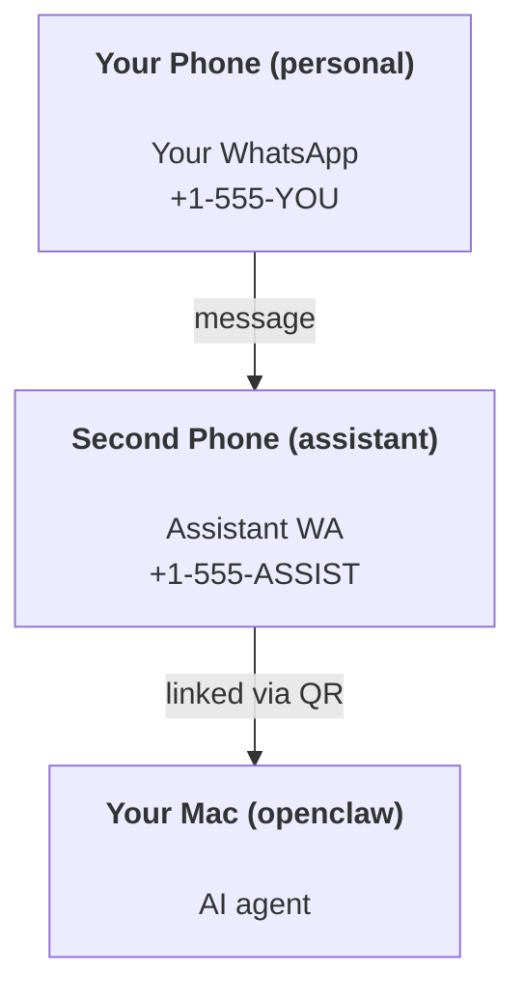

---
read_when:
    - إعداد نسخة مساعد جديدة
    - مراجعة تبعات السلامة والأذونات
summary: دليل شامل لتشغيل OpenClaw كمساعد شخصي مع تنبيهات السلامة
title: إعداد المساعد الشخصي
x-i18n:
    generated_at: "2026-06-27T18:37:17Z"
    model: gpt-5.5
    postprocess_version: locale-links-v1
    provider: openai
    source_hash: b0cd640872a2a60fd88d2dc3df6d038ef8574163430d8683ef9b67921b0c87f4
    source_path: start/openclaw.md
    workflow: 16
---

OpenClaw هو Gateway مستضاف ذاتيًا يربط Discord وGoogle Chat وiMessage وMatrix وMicrosoft Teams وSignal وSlack وTelegram وWhatsApp وZalo وغيرها بوكلاء الذكاء الاصطناعي. يغطي هذا الدليل إعداد "المساعد الشخصي": رقم WhatsApp مخصص يتصرف مثل مساعدك الدائم التشغيل المدعوم بالذكاء الاصطناعي.

## ⚠️ السلامة أولًا

أنت تضع وكيلًا في موضع يمكنه:

- تشغيل أوامر على جهازك (بحسب سياسة الأدوات لديك)
- قراءة/كتابة الملفات في مساحة عملك
- إرسال الرسائل مجددًا عبر WhatsApp/Telegram/Discord/Mattermost وقنوات مضمّنة أخرى

ابدأ بحذر:

- اضبط دائمًا `channels.whatsapp.allowFrom` (لا تشغّله مفتوحًا للعالم على جهاز Mac الشخصي).
- استخدم رقم WhatsApp مخصصًا للمساعد.
- أصبحت Heartbeats افتراضيًا كل 30 دقيقة. عطّلها إلى أن تثق بالإعداد عبر ضبط `agents.defaults.heartbeat.every: "0m"`.

## المتطلبات الأساسية

- تثبيت OpenClaw وإكمال تهيئته - راجع [بدء الاستخدام](/ar/start/getting-started) إذا لم تفعل ذلك بعد
- رقم هاتف ثانٍ (SIM/eSIM/مسبق الدفع) للمساعد

## إعداد الهاتفين (موصى به)

هذا ما تريده:



إذا ربطت WhatsApp الشخصي لديك بـ OpenClaw، فستصبح كل رسالة تصل إليك "مدخلًا للوكيل". وهذا نادرًا ما يكون ما تريده.

## بدء سريع في 5 دقائق

1. اربط WhatsApp Web (يعرض رمز QR؛ امسحه بهاتف المساعد):

```bash
openclaw channels login
```

2. شغّل Gateway (اتركه قيد التشغيل):

```bash
openclaw gateway --port 18789
```

3. ضع إعدادًا بسيطًا في `~/.openclaw/openclaw.json`:

```json5
{
  gateway: { mode: "local" },
  channels: { whatsapp: { allowFrom: ["+15555550123"] } },
}
```

الآن أرسل رسالة إلى رقم المساعد من الهاتف الموجود في قائمة السماح.

عند انتهاء التهيئة، يفتح OpenClaw لوحة التحكم تلقائيًا ويطبع رابطًا نظيفًا (غير مضمّن برمز). إذا طلبت لوحة التحكم المصادقة، فالصق السر المشترك المضبوط في إعدادات Control UI. تستخدم التهيئة رمزًا افتراضيًا (`gateway.auth.token`)، لكن مصادقة كلمة المرور تعمل أيضًا إذا غيّرت `gateway.auth.mode` إلى `password`. لإعادة الفتح لاحقًا: `openclaw dashboard`.

## امنح الوكيل مساحة عمل (AGENTS)

يقرأ OpenClaw تعليمات التشغيل و"الذاكرة" من دليل مساحة العمل الخاص به.

افتراضيًا، يستخدم OpenClaw `~/.openclaw/workspace` بوصفه مساحة عمل الوكيل، وسيُنشئها (مع ملفات البدء `AGENTS.md` و`SOUL.md` و`TOOLS.md` و`IDENTITY.md` و`USER.md` و`HEARTBEAT.md`) تلقائيًا عند الإعداد/أول تشغيل للوكيل. لا يُنشأ `BOOTSTRAP.md` إلا عندما تكون مساحة العمل جديدة تمامًا (ولا ينبغي أن يعود بعد حذفه). `MEMORY.md` اختياري (لا يُنشأ تلقائيًا)؛ وعند وجوده، يُحمّل للجلسات العادية. جلسات الوكلاء الفرعيين لا تحقن إلا `AGENTS.md` و`TOOLS.md`.

<Tip>
عامل هذا المجلد مثل ذاكرة OpenClaw واجعله مستودع git (ويُفضّل أن يكون خاصًا) حتى تُنسخ ملفات `AGENTS.md` والذاكرة احتياطيًا. إذا كان git مثبتًا، فستُهيّأ مساحات العمل الجديدة تلقائيًا.
</Tip>

```bash
openclaw setup
```

تخطيط مساحة العمل الكامل + دليل النسخ الاحتياطي: [مساحة عمل الوكيل](/ar/concepts/agent-workspace)
سير عمل الذاكرة: [الذاكرة](/ar/concepts/memory)

اختياري: اختر مساحة عمل مختلفة باستخدام `agents.defaults.workspace` (يدعم `~`).

```json5
{
  agents: {
    defaults: {
      workspace: "~/.openclaw/workspace",
    },
  },
}
```

إذا كنت تشحن ملفات مساحة العمل الخاصة بك من مستودع، يمكنك تعطيل إنشاء ملفات التمهيد بالكامل:

```json5
{
  agents: {
    defaults: {
      skipBootstrap: true,
    },
  },
}
```

## الإعداد الذي يحوّله إلى "مساعد"

يعتمد OpenClaw افتراضيًا إعدادًا جيدًا للمساعد، لكنك غالبًا سترغب في ضبط:

- الشخصية/التعليمات في [`SOUL.md`](/ar/concepts/soul)
- افتراضيات التفكير (إن رغبت)
- Heartbeats (بعد أن تثق به)

مثال:

```json5
{
  logging: { level: "info" },
  agents: {
    defaults: {
      model: { primary: "anthropic/claude-opus-4-6" },
      workspace: "~/.openclaw/workspace",
      thinkingDefault: "high",
      timeoutSeconds: 1800,
      // Start with 0; enable later.
      heartbeat: { every: "0m" },
    },
    list: [
      {
        id: "main",
        default: true,
        groupChat: {
          mentionPatterns: ["@openclaw", "openclaw"],
        },
      },
    ],
  },
  channels: {
    whatsapp: {
      allowFrom: ["+15555550123"],
      groups: {
        "*": { requireMention: true },
      },
    },
  },
  session: {
    scope: "per-sender",
    resetTriggers: ["/new", "/reset"],
    reset: {
      mode: "daily",
      atHour: 4,
      idleMinutes: 10080,
    },
  },
}
```

## الجلسات والذاكرة

- ملفات الجلسات: `~/.openclaw/agents/<agentId>/sessions/{{SessionId}}.jsonl`
- بيانات الجلسات الوصفية (استهلاك الرموز، آخر مسار، وما إلى ذلك): `~/.openclaw/agents/<agentId>/sessions/sessions.json` (قديم: `~/.openclaw/sessions/sessions.json`)
- يبدأ `/new` أو `/reset` جلسة جديدة لتلك المحادثة (قابل للضبط عبر `resetTriggers`). إذا أُرسل وحده، يقر OpenClaw بإعادة الضبط من دون استدعاء النموذج.
- يضغط `/compact [instructions]` سياق الجلسة ويعرض ميزانية السياق المتبقية.

## Heartbeats (الوضع الاستباقي)

افتراضيًا، يشغّل OpenClaw Heartbeat كل 30 دقيقة بالموجه:
`Read HEARTBEAT.md if it exists (workspace context). Follow it strictly. Do not infer or repeat old tasks from prior chats. If nothing needs attention, reply HEARTBEAT_OK.`
اضبط `agents.defaults.heartbeat.every: "0m"` للتعطيل.

- إذا كان `HEARTBEAT.md` موجودًا لكنه فارغ فعليًا (أسطر فارغة فقط، تعليقات Markdown/HTML، عناوين Markdown مثل `# Heading`، علامات الأسوار، أو عناصر قوائم مهام فارغة)، يتجاوز OpenClaw تشغيل Heartbeat لتوفير استدعاءات API.
- إذا كان الملف مفقودًا، يستمر تشغيل Heartbeat ويقرر النموذج ما يجب فعله.
- إذا رد الوكيل بـ `HEARTBEAT_OK` (اختياريًا مع حشو قصير؛ راجع `agents.defaults.heartbeat.ackMaxChars`)، يحجب OpenClaw التسليم الصادر لذلك Heartbeat.
- افتراضيًا، يُسمح بتسليم Heartbeat إلى أهداف `user:<id>` ذات نمط الرسائل المباشرة. اضبط `agents.defaults.heartbeat.directPolicy: "block"` لحجب التسليم إلى الأهداف المباشرة مع إبقاء تشغيل Heartbeat نشطًا.
- تشغّل Heartbeats دورات وكيل كاملة - الفواصل الأقصر تستهلك رموزًا أكثر.

```json5
{
  agents: {
    defaults: {
      heartbeat: { every: "30m" },
    },
  },
}
```

## الوسائط دخولًا وخروجًا

يمكن عرض المرفقات الواردة (صور/صوت/مستندات) لأمرك عبر القوالب:

- `{{MediaPath}}` (مسار ملف مؤقت محلي)
- `{{MediaUrl}}` (رابط شبه URL)
- `{{Transcript}}` (إذا كان تفريغ الصوت مفعّلًا)

تستخدم المرفقات الصادرة من الوكيل حقول وسائط منظّمة في أداة الرسائل أو حمولة الرد، مثل `media` أو `mediaUrl` أو `mediaUrls` أو `path` أو `filePath`. مثال على وسيطات أداة الرسائل:

```json
{
  "message": "Here's the screenshot.",
  "mediaUrl": "https://example.com/screenshot.png"
}
```

يرسل OpenClaw الوسائط المنظمة إلى جانب النص. قد تظل ردود المساعد النهائية القديمة تُطبّع للتوافق، لكن مخرجات الأدوات ومخرجات المتصفح وكتل البث وإجراءات الرسائل لا تحلل النص كأوامر مرفقات.

يتبع سلوك المسارات المحلية نموذج الثقة نفسه لقراءة الملفات مثل الوكيل:

- إذا كان `tools.fs.workspaceOnly` هو `true`، تبقى مسارات الوسائط المحلية الصادرة مقيّدة بجذر OpenClaw المؤقت، وذاكرة الوسائط المؤقتة، ومسارات مساحة عمل الوكيل، والملفات التي أنشأها صندوق العزل.
- إذا كان `tools.fs.workspaceOnly` هو `false`، يمكن للوسائط المحلية الصادرة استخدام ملفات محلية على المضيف يُسمح للوكيل أصلًا بقراءتها.
- يمكن أن تكون المسارات المحلية مطلقة، أو نسبية إلى مساحة العمل، أو نسبية إلى المنزل باستخدام `~/`.
- لا تزال الإرسالات المحلية على المضيف تسمح فقط بالوسائط وأنواع المستندات الآمنة (الصور، الصوت، الفيديو، PDF، مستندات Office، والمستندات النصية التي تم التحقق منها مثل Markdown/MD وTXT وJSON وYAML وYML). هذا امتداد لحد الثقة الحالي لقراءة المضيف، وليس ماسح أسرار: إذا كان الوكيل يستطيع قراءة `secret.txt` أو `config.json` محليًا على المضيف، فيمكنه إرفاق ذلك الملف عندما يتطابق الامتداد والتحقق من المحتوى.

يعني ذلك أن الصور/الملفات المُنشأة خارج مساحة العمل يمكن إرسالها الآن عندما تسمح سياسة fs لديك أصلًا بتلك القراءات، بينما تظل امتدادات النص المحلية العشوائية على المضيف محجوبة. أبقِ الملفات الحساسة خارج نظام الملفات القابل للقراءة من الوكيل، أو أبقِ `tools.fs.workspaceOnly=true` لإرسالات المسارات المحلية الأكثر صرامة.

## قائمة تحقق العمليات

```bash
openclaw status          # local status (creds, sessions, queued events)
openclaw status --all    # full diagnosis (read-only, pasteable)
openclaw status --deep   # asks the gateway for a live health probe with channel probes when supported
openclaw health --json   # gateway health snapshot (WS; default can return a fresh cached snapshot)
```

توجد السجلات تحت `/tmp/openclaw/` (افتراضيًا: `openclaw-YYYY-MM-DD.log`).

## الخطوات التالية

- WebChat: [WebChat](/ar/web/webchat)
- عمليات Gateway: [دليل تشغيل Gateway](/ar/gateway)
- Cron + الإيقاظات: [مهام Cron](/ar/automation/cron-jobs)
- رفيق شريط قوائم macOS: [تطبيق OpenClaw لنظام macOS](/ar/platforms/macos)
- تطبيق عقدة iOS: [تطبيق iOS](/ar/platforms/ios)
- تطبيق عقدة Android: [تطبيق Android](/ar/platforms/android)
- Windows Hub: [Windows](/ar/platforms/windows)
- حالة Linux: [تطبيق Linux](/ar/platforms/linux)
- الأمان: [الأمان](/ar/gateway/security)

## ذات صلة

- [بدء الاستخدام](/ar/start/getting-started)
- [الإعداد](/ar/start/setup)
- [نظرة عامة على القنوات](/ar/channels)
