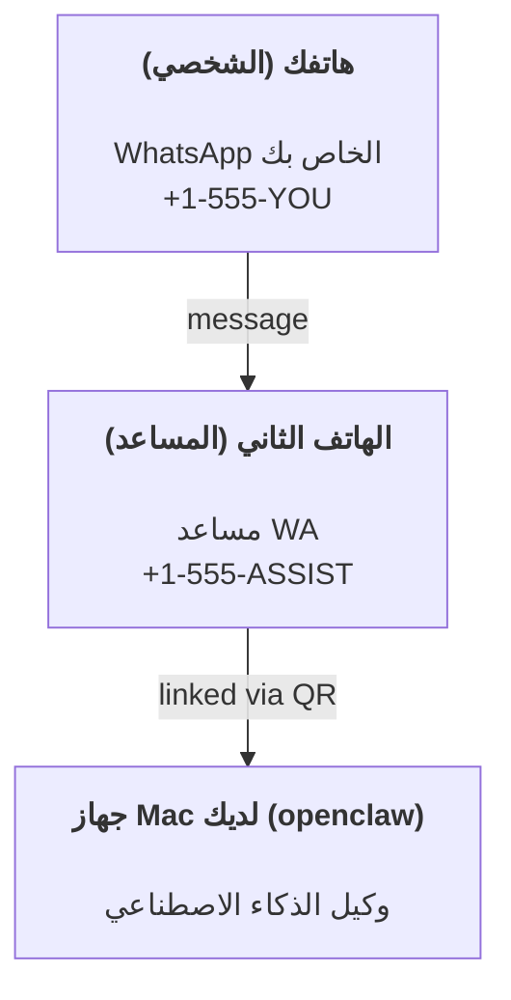

---
read_when:
    - إعداد مثيل مساعد جديد
    - مراجعة آثار السلامة/الأذونات
summary: دليل شامل لتشغيل OpenClaw كمساعد شخصي مع احتياطات السلامة
title: إعداد المساعد الشخصي
x-i18n:
    generated_at: "2026-05-11T20:40:57Z"
    model: gpt-5.5
    provider: openai
    source_hash: 74dd13c4b43faa8e29e1fd56a355f36c6cf7c3fa8193bb62c1056211933f4df9
    source_path: start/openclaw.md
    workflow: 16
---

OpenClaw هو Gateway مستضاف ذاتيًا يربط Discord وGoogle Chat وiMessage وMatrix وMicrosoft Teams وSignal وSlack وTelegram وWhatsApp وZalo وغيرها بوكلاء الذكاء الاصطناعي. يغطي هذا الدليل إعداد "المساعد الشخصي": رقم WhatsApp مخصص يتصرف كمساعد ذكاء اصطناعي دائم التشغيل لديك.

## ⚠️ السلامة أولًا

أنت تضع وكيلًا في موقع يمكنه:

- تشغيل أوامر على جهازك (بحسب سياسة الأدوات لديك)
- قراءة/كتابة الملفات في مساحة عملك
- إرسال رسائل إلى الخارج عبر WhatsApp/Telegram/Discord/Mattermost وقنوات مضمّنة أخرى

ابدأ بتحفظ:

- اضبط دائمًا `channels.whatsapp.allowFrom` (لا تشغّله مفتوحًا للعالم على جهاز Mac الشخصي).
- استخدم رقم WhatsApp مخصصًا للمساعد.
- أصبحت Heartbeats الآن افتراضيًا كل 30 دقيقة. عطّلها حتى تثق بالإعداد عبر ضبط `agents.defaults.heartbeat.every: "0m"`.

## المتطلبات الأساسية

- تثبيت OpenClaw وإكمال التهيئة الأولية - راجع [بدء الاستخدام](/ar/start/getting-started) إذا لم تفعل ذلك بعد
- رقم هاتف ثانٍ (SIM/eSIM/مسبق الدفع) للمساعد

## إعداد الهاتفين (موصى به)

هذا ما تريده:



إذا ربطت WhatsApp الشخصي لديك بـ OpenClaw، فستصبح كل رسالة تصلك "مدخلات للوكيل". وهذا نادرًا ما يكون ما تريده.

## البدء السريع خلال 5 دقائق

1. اربط WhatsApp Web (يعرض رمز QR؛ امسحه بهاتف المساعد):

```bash
openclaw channels login
```

2. ابدأ تشغيل Gateway (اتركه يعمل):

```bash
openclaw gateway --port 18789
```

3. ضع تكوينًا بسيطًا في `~/.openclaw/openclaw.json`:

```json5
{
  gateway: { mode: "local" },
  channels: { whatsapp: { allowFrom: ["+15555550123"] } },
}
```

الآن أرسل رسالة إلى رقم المساعد من هاتفك المدرج في قائمة السماح.

عند انتهاء التهيئة الأولية، يفتح OpenClaw لوحة المعلومات تلقائيًا ويطبع رابطًا نظيفًا (غير مضمّن برمز). إذا طلبت لوحة المعلومات المصادقة، فالصق السر المشترك المكوّن في إعدادات واجهة التحكم. تستخدم التهيئة الأولية رمزًا افتراضيًا (`gateway.auth.token`)، لكن مصادقة كلمة المرور تعمل أيضًا إذا بدّلت `gateway.auth.mode` إلى `password`. لإعادة الفتح لاحقًا: `openclaw dashboard`.

## امنح الوكيل مساحة عمل (AGENTS)

يقرأ OpenClaw تعليمات التشغيل و"الذاكرة" من دليل مساحة العمل الخاص به.

افتراضيًا، يستخدم OpenClaw `~/.openclaw/workspace` كمساحة عمل للوكيل، وسينشئها (إضافة إلى ملفات البداية `AGENTS.md` و`SOUL.md` و`TOOLS.md` و`IDENTITY.md` و`USER.md` و`HEARTBEAT.md`) تلقائيًا عند الإعداد/أول تشغيل للوكيل. يُنشأ `BOOTSTRAP.md` فقط عندما تكون مساحة العمل جديدة تمامًا (ولا ينبغي أن يعود بعد حذفه). `MEMORY.md` اختياري (لا يُنشأ تلقائيًا)؛ وعند وجوده، يُحمّل للجلسات العادية. جلسات الوكلاء الفرعيين لا تحقن إلا `AGENTS.md` و`TOOLS.md`.

<Tip>
تعامل مع هذا المجلد كذاكرة OpenClaw واجعله مستودع git (ويُفضل أن يكون خاصًا) حتى تُنسخ ملفات `AGENTS.md` وملفات الذاكرة احتياطيًا. إذا كان git مثبتًا، فستتم تهيئة مساحات العمل الجديدة تمامًا تلقائيًا.
</Tip>

```bash
openclaw setup
```

تخطيط مساحة العمل الكامل + دليل النسخ الاحتياطي: [مساحة عمل الوكيل](/ar/concepts/agent-workspace)
سير عمل الذاكرة: [الذاكرة](/ar/concepts/memory)

اختياري: اختر مساحة عمل مختلفة باستخدام `agents.defaults.workspace` (يدعم `~`).

```json5
{
  agents: {
    defaults: {
      workspace: "~/.openclaw/workspace",
    },
  },
}
```

إذا كنت توزع ملفات مساحة العمل الخاصة بك من مستودع، يمكنك تعطيل إنشاء ملفات bootstrap بالكامل:

```json5
{
  agents: {
    defaults: {
      skipBootstrap: true,
    },
  },
}
```

## التكوين الذي يحوله إلى "مساعد"

يضبط OpenClaw افتراضيًا إعدادًا جيدًا للمساعد، لكنك سترغب عادةً في ضبط:

- الشخصية/التعليمات في [`SOUL.md`](/ar/concepts/soul)
- افتراضيات التفكير (إذا رغبت)
- Heartbeats (بعد أن تثق به)

مثال:

```json5
{
  logging: { level: "info" },
  agents: {
    defaults: {
      model: { primary: "anthropic/claude-opus-4-6" },
      workspace: "~/.openclaw/workspace",
      thinkingDefault: "high",
      timeoutSeconds: 1800,
      // Start with 0; enable later.
      heartbeat: { every: "0m" },
    },
    list: [
      {
        id: "main",
        default: true,
        groupChat: {
          mentionPatterns: ["@openclaw", "openclaw"],
        },
      },
    ],
  },
  channels: {
    whatsapp: {
      allowFrom: ["+15555550123"],
      groups: {
        "*": { requireMention: true },
      },
    },
  },
  session: {
    scope: "per-sender",
    resetTriggers: ["/new", "/reset"],
    reset: {
      mode: "daily",
      atHour: 4,
      idleMinutes: 10080,
    },
  },
}
```

## الجلسات والذاكرة

- ملفات الجلسات: `~/.openclaw/agents/<agentId>/sessions/{{SessionId}}.jsonl`
- بيانات تعريف الجلسة (استخدام الرموز، آخر مسار، وما إلى ذلك): `~/.openclaw/agents/<agentId>/sessions/sessions.json` (قديم: `~/.openclaw/sessions/sessions.json`)
- يبدأ `/new` أو `/reset` جلسة جديدة لتلك الدردشة (قابل للتكوين عبر `resetTriggers`). إذا أُرسل وحده، يقر OpenClaw بإعادة الضبط دون استدعاء النموذج.
- يضغط `/compact [instructions]` سياق الجلسة ويبلغ عن ميزانية السياق المتبقية.

## Heartbeats (الوضع الاستباقي)

افتراضيًا، يشغّل OpenClaw Heartbeat كل 30 دقيقة مع الموجّه:
`Read HEARTBEAT.md if it exists (workspace context). Follow it strictly. Do not infer or repeat old tasks from prior chats. If nothing needs attention, reply HEARTBEAT_OK.`
اضبط `agents.defaults.heartbeat.every: "0m"` للتعطيل.

- إذا كان `HEARTBEAT.md` موجودًا لكنه فارغ فعليًا (لا يحتوي إلا على أسطر فارغة وعناوين markdown مثل `# Heading`)، يتخطى OpenClaw تشغيل Heartbeat لتوفير استدعاءات API.
- إذا كان الملف مفقودًا، فستظل Heartbeat تعمل ويقرر النموذج ما يجب فعله.
- إذا رد الوكيل بـ `HEARTBEAT_OK` (اختياريًا مع حشو قصير؛ راجع `agents.defaults.heartbeat.ackMaxChars`)، يمنع OpenClaw التسليم الصادر لتلك Heartbeat.
- افتراضيًا، يُسمح بتسليم Heartbeat إلى أهداف DM بنمط `user:<id>`. اضبط `agents.defaults.heartbeat.directPolicy: "block"` لمنع التسليم إلى الأهداف المباشرة مع إبقاء تشغيل Heartbeats نشطًا.
- تشغّل Heartbeats دورات وكيل كاملة - الفواصل الأقصر تستهلك رموزًا أكثر.

```json5
{
  agents: {
    defaults: {
      heartbeat: { every: "30m" },
    },
  },
}
```

## الوسائط دخولًا وخروجًا

يمكن إظهار المرفقات الواردة (صور/صوت/مستندات) لأمرك عبر القوالب:

- `{{MediaPath}}` (مسار ملف محلي مؤقت)
- `{{MediaUrl}}` (عنوان URL زائف)
- `{{Transcript}}` (إذا كان نسخ الصوت مفعّلًا)

المرفقات الصادرة من الوكيل: أدرج `MEDIA:<path-or-url>` في سطر مستقل (بلا مسافات). مثال:

```
إليك لقطة الشاشة.
MEDIA:https://example.com/screenshot.png
```

يستخرج OpenClaw هذه ويرسلها كوسائط إلى جانب النص.

يتبع سلوك المسارات المحلية نموذج الثقة نفسه لقراءة الملفات مثل الوكيل:

- إذا كان `tools.fs.workspaceOnly` يساوي `true`، تبقى مسارات `MEDIA:` المحلية الصادرة مقيدة بجذر OpenClaw المؤقت، وذاكرة الوسائط المؤقتة، ومسارات مساحة عمل الوكيل، والملفات المولدة داخل sandbox.
- إذا كان `tools.fs.workspaceOnly` يساوي `false`، فيمكن لـ `MEDIA:` الصادرة استخدام ملفات محلية على المضيف يُسمح للوكيل أصلًا بقراءتها.
- يمكن أن تكون المسارات المحلية مطلقة، أو نسبية إلى مساحة العمل، أو نسبية إلى الدليل الرئيسي باستخدام `~/`.
- لا تزال الإرسالات المحلية من المضيف تسمح فقط بالوسائط وأنواع المستندات الآمنة (الصور، والصوت، والفيديو، وPDF، ومستندات Office). لا تُعامل الملفات النصية العادية والملفات التي تبدو كأسرار كوسائط قابلة للإرسال.

هذا يعني أن الصور/الملفات المولدة خارج مساحة العمل يمكن الآن إرسالها عندما تسمح سياسة fs لديك أصلًا بهذه القراءات، دون إعادة فتح باب تسريب مرفقات نصية عشوائية من المضيف.

## قائمة تحقق العمليات

```bash
openclaw status          # local status (creds, sessions, queued events)
openclaw status --all    # full diagnosis (read-only, pasteable)
openclaw status --deep   # asks the gateway for a live health probe with channel probes when supported
openclaw health --json   # gateway health snapshot (WS; default can return a fresh cached snapshot)
```

توجد السجلات ضمن `/tmp/openclaw/` (افتراضيًا: `openclaw-YYYY-MM-DD.log`).

## الخطوات التالية

- WebChat: [WebChat](/ar/web/webchat)
- عمليات Gateway: [دليل تشغيل Gateway](/ar/gateway)
- Cron + التنبيهات: [مهام Cron](/ar/automation/cron-jobs)
- رفيق شريط قوائم macOS: [تطبيق OpenClaw macOS](/ar/platforms/macos)
- تطبيق عقدة iOS: [تطبيق iOS](/ar/platforms/ios)
- تطبيق عقدة Android: [تطبيق Android](/ar/platforms/android)
- حالة Windows: [Windows (WSL2)](/ar/platforms/windows)
- حالة Linux: [تطبيق Linux](/ar/platforms/linux)
- الأمان: [الأمان](/ar/gateway/security)

## ذات صلة

- [بدء الاستخدام](/ar/start/getting-started)
- [الإعداد](/ar/start/setup)
- [نظرة عامة على القنوات](/ar/channels)
