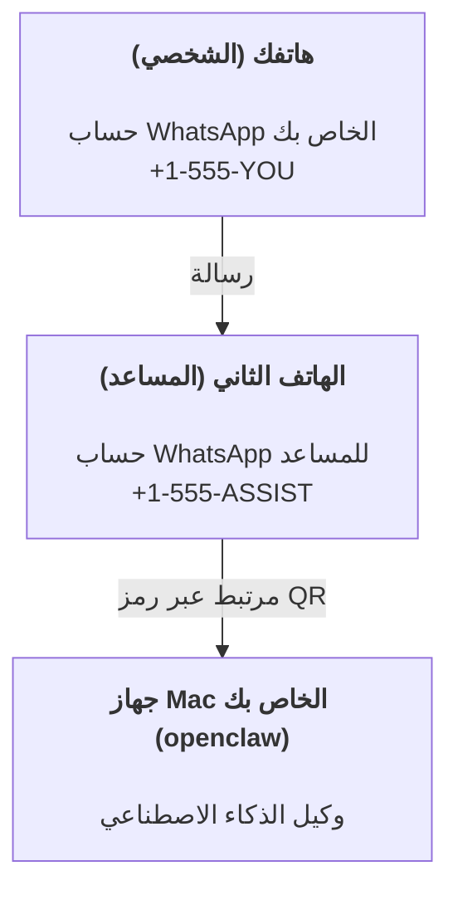

---
read_when:
    - إعداد مثيل جديد للمساعد لأول مرة
    - مراجعة الآثار المترتبة على السلامة والأذونات
summary: دليل شامل لتشغيل OpenClaw كمساعد شخصي مع تنبيهات السلامة
title: إعداد المساعد الشخصي
x-i18n:
    generated_at: "2026-07-16T15:08:10Z"
    model: gpt-5.6
    postprocess_version: locale-links-v1
    prompt_version: 32
    provider: openai
    source_hash: e8c34e31314f55647059fd600935330110add27b338a675bc0ce1529bebb207d
    source_path: start/openclaw.md
    workflow: 16
---

OpenClaw هو Gateway مستضاف ذاتيًا يربط Discord وGoogle Chat وiMessage وMatrix وMicrosoft Teams وSignal وSlack وTelegram وWhatsApp وZalo وغيرها بوكلاء الذكاء الاصطناعي. يتناول هذا الدليل إعداد «المساعد الشخصي»: رقم WhatsApp مخصص يعمل كمساعد ذكاء اصطناعي متاح دائمًا.

## السلامة أولًا

يؤدي منح وكيلٍ قناةً إلى تمكينه من تشغيل أوامر على جهازك (بحسب سياسة أدواتك)، وقراءة الملفات وكتابتها في مساحة عملك، وإرسال الرسائل عبر أي قناة متصلة. ابدأ بإعدادات متحفظة:

- اضبط دائمًا `channels.whatsapp.allowFrom` (ولا تشغّله أبدًا بحيث يكون متاحًا للعالم كله على جهاز Mac الشخصي).
- استخدم رقم WhatsApp مخصصًا للمساعد.
- تعمل Heartbeats افتراضيًا كل 30 دقيقة. عطّلها إلى أن تثق بالإعداد، وذلك بضبط `agents.defaults.heartbeat.every: "0m"`.

## المتطلبات الأساسية

- تثبيت OpenClaw وإكمال الإعداد الأولي له - راجع [بدء الاستخدام](/ar/start/getting-started) إذا لم تكن قد فعلت ذلك بعد
- رقم هاتف ثانٍ (SIM/eSIM/مدفوع مسبقًا) للمساعد

## إعداد الهاتفين (موصى به)

الهدف هو هذا:



إذا ربطت حساب WhatsApp الشخصي بـ OpenClaw، فستصبح كل رسالة تصلك «إدخالًا للوكيل». ونادرًا ما يكون هذا ما تريده.

## بدء سريع خلال 5 دقائق

1. اقرن WhatsApp Web (يعرض رمز QR؛ امسحه بهاتف المساعد):

```bash
openclaw channels login
```

2. شغّل Gateway (واتركه قيد التشغيل):

```bash
openclaw gateway --port 18789
```

3. ضع إعدادًا بسيطًا في `~/.openclaw/openclaw.json`:

```json5
{
  gateway: { mode: "local" },
  channels: { whatsapp: { allowFrom: ["+15555550123"] } },
}
```

أرسل الآن رسالة إلى رقم المساعد من هاتفك المدرج في قائمة السماح.

عند اكتمال الإعداد الأولي، يفتح OpenClaw لوحة المعلومات تلقائيًا ويطبع رابطًا واضحًا (غير مضمّن فيه رمز مميز). إذا طلبت لوحة المعلومات المصادقة، فألصق السر المشترك المضبوط في إعدادات واجهة التحكم. يستخدم الإعداد الأولي رمزًا مميزًا افتراضيًا (`gateway.auth.token`)، لكن مصادقة كلمة المرور تعمل أيضًا إذا غيّرت `gateway.auth.mode` إلى `password`. لإعادة فتحها لاحقًا: `openclaw dashboard`.

## منح الوكيل مساحة عمل (AGENTS)

يقرأ OpenClaw تعليمات التشغيل و«الذاكرة» من دليل مساحة عمله.

يستخدم OpenClaw افتراضيًا `~/.openclaw/workspace` بوصفه مساحة عمل الوكيل، وينشئه (إضافة إلى ملفات البدء `AGENTS.md` و`SOUL.md` و`TOOLS.md` و`IDENTITY.md` و`USER.md` و`HEARTBEAT.md`) تلقائيًا أثناء الإعداد الأولي أو أول تشغيل للوكيل. لا يُنشأ `BOOTSTRAP.md` إلا لمساحة عمل جديدة تمامًا، ويجب ألا يظهر مجددًا بعد حذفه. أما `MEMORY.md` فهو اختياري ولا يُنشأ تلقائيًا أبدًا؛ وعند وجوده، يُحمّل للجلسات العادية. لا تحقن جلسات الوكلاء الفرعيين سوى `AGENTS.md` و`TOOLS.md`.

<Tip>
تعامل مع هذا المجلد بوصفه ذاكرة OpenClaw، واجعله مستودع git (ويُفضّل أن يكون خاصًا) للاحتفاظ بنسخ احتياطية من `AGENTS.md` وملفات الذاكرة. إذا كان git مثبتًا، فتُهيّأ مساحات العمل الجديدة تمامًا تلقائيًا باستخدام `git init`.
</Tip>

لإنشاء مجلدي مساحة العمل والإعدادات دون تشغيل معالج الإعداد الأولي الكامل:

```bash
openclaw setup --baseline
```

(الأمر المجرد `openclaw setup` هو اسم مستعار لـ `openclaw onboard` ويشغّل المعالج التفاعلي الكامل.)

التخطيط الكامل لمساحة العمل + دليل النسخ الاحتياطي: [مساحة عمل الوكيل](/ar/concepts/agent-workspace)
سير عمل الذاكرة: [الذاكرة](/ar/concepts/memory)

اختياري: اختر مساحة عمل مختلفة باستخدام `agents.defaults.workspace` (يدعم `~`).

```json5
{
  agents: {
    defaults: {
      workspace: "~/.openclaw/workspace",
    },
  },
}
```

إذا كنت توفر بالفعل ملفات مساحة عملك الخاصة من مستودع، فيمكنك تعطيل إنشاء ملفات التمهيد بالكامل:

```json5
{
  agents: {
    defaults: {
      skipBootstrap: true,
    },
  },
}
```

## الإعداد الذي يحوّله إلى «مساعد»

يستخدم OpenClaw افتراضيًا إعدادًا جيدًا للمساعد، لكنك سترغب عادةً في ضبط:

- الشخصية/التعليمات في [`SOUL.md`](/ar/concepts/soul)
- إعدادات التفكير الافتراضية (عند الرغبة)
- Heartbeats (بعد أن تثق به)

مثال:

```json5
{
  logging: { level: "info" },
  agents: {
    defaults: {
      model: { primary: "anthropic/claude-opus-4-8" },
      workspace: "~/.openclaw/workspace",
      thinkingDefault: "high",
      timeoutSeconds: 1800,
      // ابدأ بالقيمة 0؛ وفعّلها لاحقًا.
      heartbeat: { every: "0m" },
    },
    list: [
      {
        id: "main",
        default: true,
        groupChat: {
          mentionPatterns: ["@openclaw", "openclaw"],
        },
      },
    ],
  },
  channels: {
    whatsapp: {
      allowFrom: ["+15555550123"],
      groups: {
        "*": { requireMention: true },
      },
    },
  },
  session: {
    scope: "per-sender",
    resetTriggers: ["/new", "/reset"],
    reset: {
      mode: "daily",
      atHour: 4,
      idleMinutes: 10080,
    },
  },
}
```

## الجلسات والذاكرة

- صفوف الجلسات وصفوف النصوص المنسوخة والبيانات الوصفية (استخدام الرموز المميزة، وآخر مسار توجيه، وما إلى ذلك): `~/.openclaw/agents/<agentId>/agent/openclaw-agent.sqlite`
- عناصر النصوص المنسوخة القديمة/المؤرشفة: `~/.openclaw/agents/<agentId>/sessions/`
- مصدر ترحيل الصفوف القديمة: `~/.openclaw/agents/<agentId>/sessions/sessions.json`
- يبدأ `/new` أو `/reset` جلسة جديدة لتلك المحادثة (يمكن ضبط ذلك عبر `session.resetTriggers`). إذا أُرسل منفردًا، يؤكد OpenClaw إعادة التعيين دون استدعاء النموذج.
- يجري `/compact [instructions]` عملية Compaction لسياق الجلسة ويعرض ميزانية السياق المتبقية.

## Heartbeats (الوضع الاستباقي)

يشغّل OpenClaw افتراضيًا Heartbeat كل 30 دقيقة باستخدام الموجّه:
`Read HEARTBEAT.md if it exists (workspace context). Follow it strictly. Do not infer or repeat old tasks from prior chats. If nothing needs attention, reply HEARTBEAT_OK.`
اضبط `agents.defaults.heartbeat.every: "0m"` للتعطيل.

- إذا كان `HEARTBEAT.md` موجودًا لكنه فارغ فعليًا (لا يحتوي إلا على أسطر فارغة، أو تعليقات Markdown/HTML، أو عناوين Markdown مثل `# Heading`، أو علامات أسوار، أو هياكل قوائم تحقق فارغة)، يتخطى OpenClaw تشغيل Heartbeat لتوفير استدعاءات API.
- إذا كان الملف مفقودًا، تظل Heartbeat قيد التشغيل ويقرر النموذج ما ينبغي فعله.
- إذا رد الوكيل بـ `HEARTBEAT_OK` (مع حشو قصير اختياري؛ راجع `agents.defaults.heartbeat.ackMaxChars`) فإن OpenClaw يمنع التسليم الصادر لتلك Heartbeat.
- يُسمح افتراضيًا بتسليم Heartbeat إلى أهداف `user:<id>` ذات نمط الرسائل المباشرة. اضبط `agents.defaults.heartbeat.directPolicy: "block"` لمنع التسليم إلى الأهداف المباشرة مع إبقاء تشغيل Heartbeats نشطًا.
- تشغّل Heartbeats دورات كاملة للوكيل - وتستهلك الفواصل الزمنية الأقصر مزيدًا من الرموز المميزة.

```json5
{
  agents: {
    defaults: {
      heartbeat: { every: "30m" },
    },
  },
}
```

## الوسائط الواردة والصادرة

يمكن إظهار المرفقات الواردة (الصور/الصوت/المستندات) لأمرك عبر القوالب:

- `{{MediaPath}}` (مسار ملف مؤقت محلي)
- `{{MediaUrl}}` (عنوان URL زائف)
- `{{Transcript}}` (إذا كان النسخ النصي للصوت مفعّلًا)

تستخدم المرفقات الصادرة من الوكيل حقول وسائط منظّمة في أداة الرسائل أو حمولة الرد، مثل `media` أو `mediaUrl` أو `mediaUrls` أو `path` أو `filePath`. مثال على معاملات أداة الرسائل:

```json
{
  "message": "إليك لقطة الشاشة.",
  "mediaUrl": "https://example.com/screenshot.png"
}
```

يرسل OpenClaw الوسائط المنظّمة إلى جانب النص. قد تظل ردود المساعد النهائية القديمة خاضعة للتسوية لأغراض التوافق، لكن مخرجات الأدوات ومخرجات المتصفح وكتل البث وإجراءات الرسائل لا تفسّر النص بوصفه أوامر مرفقات.

يتبع سلوك المسارات المحلية نموذج الثقة نفسه المتعلق بقراءة الملفات لدى الوكيل:

- إذا كانت `tools.fs.workspaceOnly` هي `true`، تظل مسارات الوسائط المحلية الصادرة مقيدة بجذر OpenClaw المؤقت، وذاكرة الوسائط المؤقتة، ومسارات مساحة عمل الوكيل، والملفات التي أنشأها صندوق العزل.
- إذا كانت `tools.fs.workspaceOnly` هي `false`، فيمكن للوسائط المحلية الصادرة استخدام الملفات المحلية على المضيف التي يُسمح للوكيل أصلًا بقراءتها.
- يمكن أن تكون المسارات المحلية مطلقة، أو نسبية إلى مساحة العمل، أو نسبية إلى الدليل الرئيسي باستخدام `~/`.
- لا يزال الإرسال من المضيف المحلي يسمح فقط بالوسائط وأنواع المستندات الآمنة (الصور والصوت والفيديو وPDF ومستندات Office والمستندات النصية المتحقق منها مثل Markdown/MD وTXT وJSON وYAML وYML). وهذا امتداد لحدود الثقة الحالية لقراءة المضيف، وليس ماسحًا للأسرار: إذا كان بإمكان الوكيل قراءة `secret.txt` أو `config.json` محلي على المضيف، فيمكنه إرفاق ذلك الملف عندما يتطابق الامتداد والتحقق من المحتوى.

احتفظ بالملفات الحساسة خارج نظام الملفات الذي يستطيع الوكيل قراءته، أو أبقِ `tools.fs.workspaceOnly: true` لإرسال المسارات المحلية بقيود أشد.

## قائمة التحقق التشغيلية

```bash
openclaw status          # الحالة المحلية (بيانات الاعتماد، الجلسات، الأحداث الموجودة في قائمة الانتظار)
openclaw status --all    # تشخيص كامل (للقراءة فقط، وقابل للصق)
openclaw status --deep   # فحص القنوات (WhatsApp Web + Telegram + Discord + Slack + Signal)
openclaw health --json   # لقطة لحالة Gateway عبر اتصال WS
```

توجد السجلات ضمن `/tmp/openclaw/` (الافتراضي: `openclaw-YYYY-MM-DD.log`).

## الخطوات التالية

- WebChat: [WebChat](/ar/web/webchat)
- عمليات Gateway: [دليل تشغيل Gateway](/ar/gateway)
- Cron + عمليات الإيقاظ: [مهام Cron](/ar/automation/cron-jobs)
- التطبيق المصاحب لشريط قوائم macOS: [تطبيق OpenClaw لنظام macOS](/ar/platforms/macos)
- تطبيق Node لنظام iOS: [تطبيق iOS](/ar/platforms/ios)
- تطبيق Node لنظام Android: [تطبيق Android](/ar/platforms/android)
- مركز Windows: [Windows](/ar/platforms/windows)
- حالة Linux: [تطبيق Linux](/ar/platforms/linux)
- الأمان: [الأمان](/ar/gateway/security)

## ذو صلة

- [بدء الاستخدام](/ar/start/getting-started)
- [الإعداد](/ar/start/setup)
- [نظرة عامة على القنوات](/ar/channels)
