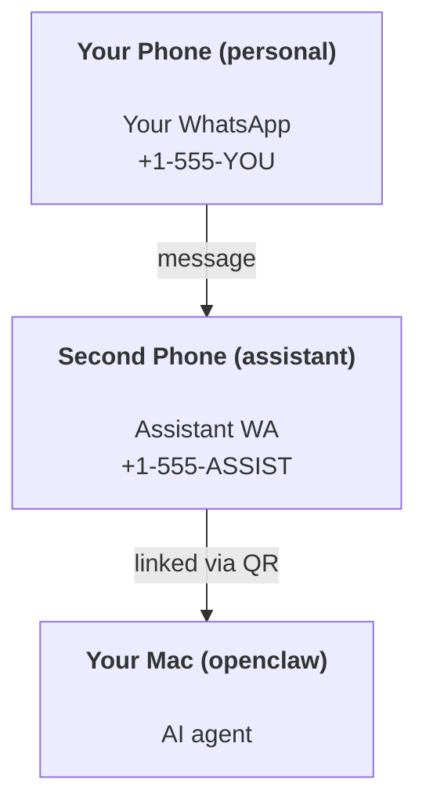

---
read_when:
    - تهيئة مثيل مساعد جديد
    - مراجعة تداعيات السلامة/الأذونات
summary: دليل شامل من البداية إلى النهاية لتشغيل OpenClaw كمساعد شخصي مع تنبيهات السلامة
title: إعداد المساعد الشخصي
x-i18n:
    generated_at: "2026-05-02T22:24:34Z"
    model: gpt-5.5
    provider: openai
    source_hash: 9f6087d0756c98741166135df8b915eb5a0803b23e68e486d2d25ec98d4dca79
    source_path: start/openclaw.md
    workflow: 16
---

# بناء مساعد شخصي باستخدام OpenClaw

OpenClaw هو Gateway ذاتي الاستضافة يربط Discord وGoogle Chat وiMessage وMatrix وMicrosoft Teams وSignal وSlack وTelegram وWhatsApp وZalo وغيرها بوكلاء الذكاء الاصطناعي. يغطي هذا الدليل إعداد "المساعد الشخصي": رقم WhatsApp مخصص يتصرف مثل مساعد ذكاء اصطناعي متاح دائما.

## ⚠️ السلامة أولا

أنت تضع وكيلا في موضع يمكنه:

- تشغيل أوامر على جهازك (حسب سياسة الأدوات لديك)
- قراءة/كتابة ملفات في مساحة عملك
- إرسال رسائل إلى الخارج عبر WhatsApp/Telegram/Discord/Mattermost والقنوات المضمنة الأخرى

ابدأ بحذر:

- اضبط دائما `channels.whatsapp.allowFrom` (لا تشغل إعدادك مفتوحا للعالم على جهاز Mac الشخصي).
- استخدم رقم WhatsApp مخصصا للمساعد.
- أصبحت Heartbeats افتراضيا كل 30 دقيقة. عطّلها إلى أن تثق بالإعداد عبر ضبط `agents.defaults.heartbeat.every: "0m"`.

## المتطلبات المسبقة

- تثبيت OpenClaw وإكمال الإعداد الأولي — راجع [بدء الاستخدام](/ar/start/getting-started) إذا لم تفعل ذلك بعد
- رقم هاتف ثان (SIM/eSIM/مسبق الدفع) للمساعد

## إعداد الهاتفين (موصى به)

تريد هذا:



إذا ربطت WhatsApp الشخصي لديك بـ OpenClaw، فستصبح كل رسالة تصلك "إدخال وكيل". وهذا نادرا ما يكون ما تريده.

## بدء سريع خلال 5 دقائق

1. اربط WhatsApp Web (يعرض QR؛ امسحه بهاتف المساعد):

```bash
openclaw channels login
```

2. شغّل Gateway (اتركه يعمل):

```bash
openclaw gateway --port 18789
```

3. ضع إعدادا بسيطا في `~/.openclaw/openclaw.json`:

```json5
{
  gateway: { mode: "local" },
  channels: { whatsapp: { allowFrom: ["+15555550123"] } },
}
```

الآن أرسل رسالة إلى رقم المساعد من هاتفك المدرج في قائمة السماح.

عند انتهاء الإعداد الأولي، يفتح OpenClaw لوحة التحكم تلقائيا ويطبع رابطا نظيفا (غير محتو على رمز). إذا طلبت لوحة التحكم المصادقة، فألصق السر المشترك المكوّن في إعدادات Control UI. يستخدم الإعداد الأولي رمزا افتراضيا (`gateway.auth.token`)، لكن مصادقة كلمة المرور تعمل أيضا إذا بدلت `gateway.auth.mode` إلى `password`. لإعادة الفتح لاحقا: `openclaw dashboard`.

## منح الوكيل مساحة عمل (AGENTS)

يقرأ OpenClaw تعليمات التشغيل و"الذاكرة" من مجلد مساحة العمل الخاص به.

افتراضيا، يستخدم OpenClaw المسار `~/.openclaw/workspace` كمساحة عمل للوكيل، وسينشئها (مع ملفات البداية `AGENTS.md` و`SOUL.md` و`TOOLS.md` و`IDENTITY.md` و`USER.md` و`HEARTBEAT.md`) تلقائيا عند الإعداد/أول تشغيل للوكيل. لا يُنشأ `BOOTSTRAP.md` إلا عندما تكون مساحة العمل جديدة تماما (وينبغي ألا يعود بعد حذفه). ملف `MEMORY.md` اختياري (لا يُنشأ تلقائيا)؛ وعند وجوده، يُحمّل للجلسات العادية. لا تحقن جلسات الوكلاء الفرعيين إلا `AGENTS.md` و`TOOLS.md`.

<Tip>
عامل هذا المجلد مثل ذاكرة OpenClaw واجعله مستودع git (ويفضل أن يكون خاصا) حتى تُنسخ ملفات `AGENTS.md` وملفات الذاكرة احتياطيا. إذا كان git مثبتا، فستتم تهيئة مساحات العمل الجديدة تلقائيا.
</Tip>

```bash
openclaw setup
```

تخطيط مساحة العمل الكامل + دليل النسخ الاحتياطي: [مساحة عمل الوكيل](/ar/concepts/agent-workspace)
سير عمل الذاكرة: [الذاكرة](/ar/concepts/memory)

اختياري: اختر مساحة عمل مختلفة باستخدام `agents.defaults.workspace` (يدعم `~`).

```json5
{
  agents: {
    defaults: {
      workspace: "~/.openclaw/workspace",
    },
  },
}
```

إذا كنت تشحن ملفات مساحة العمل الخاصة بك من مستودع بالفعل، فيمكنك تعطيل إنشاء ملفات التمهيد بالكامل:

```json5
{
  agents: {
    defaults: {
      skipBootstrap: true,
    },
  },
}
```

## الإعداد الذي يحوله إلى "مساعد"

تأتي إعدادات OpenClaw الافتراضية مناسبة لمساعد جيد، لكنك سترغب عادة في ضبط:

- الشخصية/التعليمات في [`SOUL.md`](/ar/concepts/soul)
- افتراضيات التفكير (إذا رغبت)
- heartbeats (بعد أن تثق بها)

مثال:

```json5
{
  logging: { level: "info" },
  agent: {
    model: "anthropic/claude-opus-4-6",
    workspace: "~/.openclaw/workspace",
    thinkingDefault: "high",
    timeoutSeconds: 1800,
    // Start with 0; enable later.
    heartbeat: { every: "0m" },
  },
  channels: {
    whatsapp: {
      allowFrom: ["+15555550123"],
      groups: {
        "*": { requireMention: true },
      },
    },
  },
  routing: {
    groupChat: {
      mentionPatterns: ["@openclaw", "openclaw"],
    },
  },
  session: {
    scope: "per-sender",
    resetTriggers: ["/new", "/reset"],
    reset: {
      mode: "daily",
      atHour: 4,
      idleMinutes: 10080,
    },
  },
}
```

## الجلسات والذاكرة

- ملفات الجلسات: `~/.openclaw/agents/<agentId>/sessions/{{SessionId}}.jsonl`
- بيانات الجلسات الوصفية (استخدام الرموز، آخر مسار، إلخ): `~/.openclaw/agents/<agentId>/sessions/sessions.json` (قديم: `~/.openclaw/sessions/sessions.json`)
- يبدأ `/new` أو `/reset` جلسة جديدة لذلك الدردشة (قابل للتكوين عبر `resetTriggers`). إذا أُرسل وحده، يؤكد OpenClaw إعادة الضبط دون استدعاء النموذج.
- يقوم `/compact [instructions]` بعمل Compaction لسياق الجلسة ويبلغ عن ميزانية السياق المتبقية.

## Heartbeats (الوضع الاستباقي)

افتراضيا، يشغل OpenClaw heartbeat كل 30 دقيقة بالموجه:
`Read HEARTBEAT.md if it exists (workspace context). Follow it strictly. Do not infer or repeat old tasks from prior chats. If nothing needs attention, reply HEARTBEAT_OK.`
اضبط `agents.defaults.heartbeat.every: "0m"` للتعطيل.

- إذا كان `HEARTBEAT.md` موجودا لكنه فارغ فعليا (يحتوي فقط على أسطر فارغة وعناوين markdown مثل `# Heading`)، يتخطى OpenClaw تشغيل heartbeat لتوفير استدعاءات API.
- إذا كان الملف مفقودا، يستمر تشغيل heartbeat ويقرر النموذج ما يجب فعله.
- إذا رد الوكيل بـ `HEARTBEAT_OK` (اختياريا مع حشو قصير؛ راجع `agents.defaults.heartbeat.ackMaxChars`)، يمنع OpenClaw التسليم الصادر لذلك heartbeat.
- افتراضيا، يُسمح بتسليم heartbeat إلى أهداف `user:<id>` بنمط الرسائل المباشرة. اضبط `agents.defaults.heartbeat.directPolicy: "block"` لمنع التسليم إلى الأهداف المباشرة مع إبقاء تشغيل heartbeat نشطا.
- تعمل Heartbeats كدورات وكيل كاملة — الفواصل الأقصر تستهلك رموزا أكثر.

```json5
{
  agent: {
    heartbeat: { every: "30m" },
  },
}
```

## الوسائط دخولا وخروجا

يمكن إظهار المرفقات الواردة (صور/صوت/مستندات) لأمرك عبر القوالب:

- `{{MediaPath}}` (مسار ملف محلي مؤقت)
- `{{MediaUrl}}` (URL زائف)
- `{{Transcript}}` (إذا كان نسخ الصوت مفعلا)

المرفقات الصادرة من الوكيل: أدرج `MEDIA:<path-or-url>` في سطر مستقل (دون مسافات). مثال:

```
Here’s the screenshot.
MEDIA:https://example.com/screenshot.png
```

يستخرج OpenClaw هذه ويرسلها كوسائط إلى جانب النص.

يتبع سلوك المسار المحلي نموذج الثقة نفسه لقراءة الملفات مثل الوكيل:

- إذا كان `tools.fs.workspaceOnly` يساوي `true`، تبقى مسارات `MEDIA:` المحلية الصادرة مقيدة بجذر OpenClaw المؤقت، وذاكرة الوسائط المؤقتة، ومسارات مساحة عمل الوكيل، والملفات التي أنشأها sandbox.
- إذا كان `tools.fs.workspaceOnly` يساوي `false`، فيمكن أن تستخدم `MEDIA:` الصادرة ملفات محلية على المضيف مسموحا للوكيل بقراءتها بالفعل.
- يمكن أن تكون المسارات المحلية مطلقة، أو نسبية إلى مساحة العمل، أو نسبية إلى المجلد الرئيسي باستخدام `~/`.
- لا تزال عمليات الإرسال من المضيف المحلي تسمح فقط بالوسائط وأنواع المستندات الآمنة (الصور، الصوت، الفيديو، PDF، ومستندات Office). لا تُعامل الملفات النصية العادية والملفات الشبيهة بالأسرار كوسائط قابلة للإرسال.

يعني ذلك أن الصور/الملفات المولدة خارج مساحة العمل يمكن إرسالها الآن عندما تسمح سياسة fs لديك أصلا بهذه القراءات، دون إعادة فتح تسريب مرفقات نصية عشوائية من المضيف.

## قائمة تحقق العمليات

```bash
openclaw status          # local status (creds, sessions, queued events)
openclaw status --all    # full diagnosis (read-only, pasteable)
openclaw status --deep   # asks the gateway for a live health probe with channel probes when supported
openclaw health --json   # gateway health snapshot (WS; default can return a fresh cached snapshot)
```

توجد السجلات ضمن `/tmp/openclaw/` (افتراضيا: `openclaw-YYYY-MM-DD.log`).

## الخطوات التالية

- WebChat: [WebChat](/ar/web/webchat)
- عمليات Gateway: [دليل تشغيل Gateway](/ar/gateway)
- Cron + التنبيهات: [مهام Cron](/ar/automation/cron-jobs)
- رفيق شريط قوائم macOS: [تطبيق OpenClaw macOS](/ar/platforms/macos)
- تطبيق عقدة iOS: [تطبيق iOS](/ar/platforms/ios)
- تطبيق عقدة Android: [تطبيق Android](/ar/platforms/android)
- حالة Windows: [Windows (WSL2)](/ar/platforms/windows)
- حالة Linux: [تطبيق Linux](/ar/platforms/linux)
- الأمان: [الأمان](/ar/gateway/security)

## ذات صلة

- [بدء الاستخدام](/ar/start/getting-started)
- [الإعداد](/ar/start/setup)
- [نظرة عامة على القنوات](/ar/channels)
