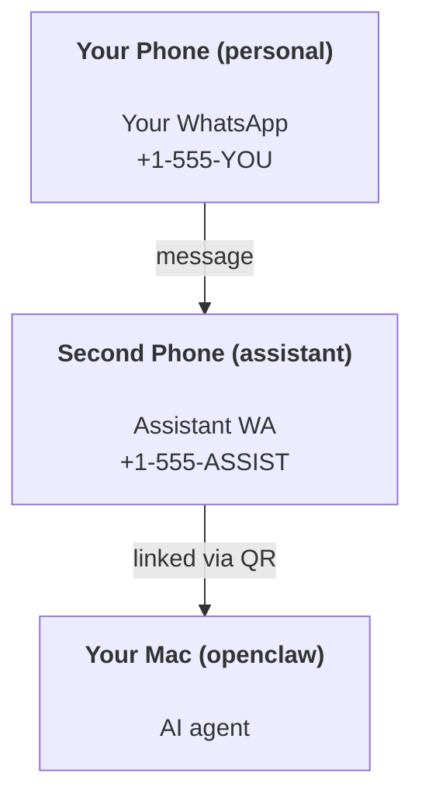

---
read_when:
    - إعداد مثيل مساعد جديد
    - مراجعة تبعات السلامة والأذونات
summary: دليل شامل من البداية إلى النهاية لتشغيل OpenClaw كمساعد شخصي مع تحذيرات السلامة
title: إعداد المساعد الشخصي
x-i18n:
    generated_at: "2026-05-06T08:14:18Z"
    model: gpt-5.5
    provider: openai
    source_hash: 6fea1194e6b9e8d8816cc712296940487b38faaabea463bd45ba1f37ff52d44d
    source_path: start/openclaw.md
    workflow: 16
---

OpenClaw هو Gateway مستضاف ذاتيًا يربط Discord وGoogle Chat وiMessage وMatrix وMicrosoft Teams وSignal وSlack وTelegram وWhatsApp وZalo والمزيد بوكلاء الذكاء الاصطناعي. يغطي هذا الدليل إعداد "المساعد الشخصي": رقم WhatsApp مخصص يتصرف مثل مساعدك الذكي المتاح دائمًا.

## ⚠️ السلامة أولًا

أنت تضع وكيلًا في موقع يمكنه:

- تشغيل أوامر على جهازك (حسب سياسة أدواتك)
- قراءة/كتابة الملفات في مساحة عملك
- إرسال رسائل مرة أخرى عبر WhatsApp/Telegram/Discord/Mattermost وقنوات مضمّنة أخرى

ابدأ بحذر:

- اضبط دائمًا `channels.whatsapp.allowFrom` (لا تشغّله مفتوحًا للعالم على جهاز Mac الشخصي).
- استخدم رقم WhatsApp مخصصًا للمساعد.
- أصبحت عمليات Heartbeat افتراضيًا كل 30 دقيقة. عطّلها حتى تثق بالإعداد عبر ضبط `agents.defaults.heartbeat.every: "0m"`.

## المتطلبات الأساسية

- OpenClaw مثبت ومهيأ - راجع [بدء الاستخدام](/ar/start/getting-started) إذا لم تفعل ذلك بعد
- رقم هاتف ثانٍ (SIM/eSIM/مسبق الدفع) للمساعد

## إعداد الهاتفين (موصى به)

هذا ما تريده:



إذا ربطت WhatsApp الشخصي الخاص بك بـ OpenClaw، فستصبح كل رسالة تصل إليك "إدخالًا للوكيل". وهذا نادرًا ما يكون ما تريده.

## بدء سريع خلال 5 دقائق

1. إقران WhatsApp Web (يعرض رمز QR؛ امسحه بهاتف المساعد):

```bash
openclaw channels login
```

2. ابدأ Gateway (اتركه يعمل):

```bash
openclaw gateway --port 18789
```

3. ضع إعدادًا بسيطًا في `~/.openclaw/openclaw.json`:

```json5
{
  gateway: { mode: "local" },
  channels: { whatsapp: { allowFrom: ["+15555550123"] } },
}
```

الآن أرسل رسالة إلى رقم المساعد من هاتفك الموجود في قائمة السماح.

عند اكتمال التهيئة، يفتح OpenClaw لوحة التحكم تلقائيًا ويطبع رابطًا واضحًا (غير مرمّز برمز). إذا طلبت لوحة التحكم المصادقة، فألصق السر المشترك المكوّن في إعدادات Control UI. تستخدم التهيئة رمزًا افتراضيًا (`gateway.auth.token`)، لكن مصادقة كلمة المرور تعمل أيضًا إذا غيّرت `gateway.auth.mode` إلى `password`. لإعادة الفتح لاحقًا: `openclaw dashboard`.

## امنح الوكيل مساحة عمل (AGENTS)

يقرأ OpenClaw تعليمات التشغيل و"الذاكرة" من دليل مساحة العمل الخاص به.

افتراضيًا، يستخدم OpenClaw `~/.openclaw/workspace` كمساحة عمل للوكيل، وسيُنشئها (بالإضافة إلى ملفات البداية `AGENTS.md` و`SOUL.md` و`TOOLS.md` و`IDENTITY.md` و`USER.md` و`HEARTBEAT.md`) تلقائيًا عند الإعداد/أول تشغيل للوكيل. لا يُنشأ `BOOTSTRAP.md` إلا عندما تكون مساحة العمل جديدة تمامًا (ولا ينبغي أن يعود بعد حذفه). `MEMORY.md` اختياري (لا يُنشأ تلقائيًا)؛ عند وجوده، يُحمّل للجلسات العادية. جلسات الوكيل الفرعي لا تحقن إلا `AGENTS.md` و`TOOLS.md`.

<Tip>
عامل هذا المجلد مثل ذاكرة OpenClaw واجعله مستودع git (ويُفضّل أن يكون خاصًا) حتى تُنسخ ملفات `AGENTS.md` والذاكرة احتياطيًا. إذا كان git مثبتًا، تتم تهيئة مساحات العمل الجديدة تمامًا تلقائيًا.
</Tip>

```bash
openclaw setup
```

تخطيط مساحة العمل الكامل + دليل النسخ الاحتياطي: [مساحة عمل الوكيل](/ar/concepts/agent-workspace)
سير عمل الذاكرة: [الذاكرة](/ar/concepts/memory)

اختياري: اختر مساحة عمل مختلفة باستخدام `agents.defaults.workspace` (يدعم `~`).

```json5
{
  agents: {
    defaults: {
      workspace: "~/.openclaw/workspace",
    },
  },
}
```

إذا كنت تشحن بالفعل ملفات مساحة العمل الخاصة بك من مستودع، يمكنك تعطيل إنشاء ملفات التمهيد بالكامل:

```json5
{
  agents: {
    defaults: {
      skipBootstrap: true,
    },
  },
}
```

## الإعداد الذي يحوّله إلى "مساعد"

تأتي الإعدادات الافتراضية في OpenClaw ملائمة لإعداد مساعد جيد، لكنك سترغب عادةً في ضبط:

- الشخصية/التعليمات في [`SOUL.md`](/ar/concepts/soul)
- افتراضيات التفكير (إذا رغبت)
- عمليات Heartbeat (بعد أن تثق به)

مثال:

```json5
{
  logging: { level: "info" },
  agent: {
    model: "anthropic/claude-opus-4-6",
    workspace: "~/.openclaw/workspace",
    thinkingDefault: "high",
    timeoutSeconds: 1800,
    // Start with 0; enable later.
    heartbeat: { every: "0m" },
  },
  channels: {
    whatsapp: {
      allowFrom: ["+15555550123"],
      groups: {
        "*": { requireMention: true },
      },
    },
  },
  routing: {
    groupChat: {
      mentionPatterns: ["@openclaw", "openclaw"],
    },
  },
  session: {
    scope: "per-sender",
    resetTriggers: ["/new", "/reset"],
    reset: {
      mode: "daily",
      atHour: 4,
      idleMinutes: 10080,
    },
  },
}
```

## الجلسات والذاكرة

- ملفات الجلسات: `~/.openclaw/agents/<agentId>/sessions/{{SessionId}}.jsonl`
- بيانات تعريف الجلسة (استخدام الرموز، آخر مسار، وما إلى ذلك): `~/.openclaw/agents/<agentId>/sessions/sessions.json` (قديم: `~/.openclaw/sessions/sessions.json`)
- يبدأ `/new` أو `/reset` جلسة جديدة لذلك الدردشة (قابل للتكوين عبر `resetTriggers`). إذا أُرسل وحده، يؤكد OpenClaw إعادة الضبط دون استدعاء النموذج.
- يضغط `/compact [instructions]` سياق الجلسة ويبلغ عن ميزانية السياق المتبقية.

## Heartbeats (الوضع الاستباقي)

افتراضيًا، يشغّل OpenClaw عملية Heartbeat كل 30 دقيقة بالموجه:
`Read HEARTBEAT.md if it exists (workspace context). Follow it strictly. Do not infer or repeat old tasks from prior chats. If nothing needs attention, reply HEARTBEAT_OK.`
اضبط `agents.defaults.heartbeat.every: "0m"` للتعطيل.

- إذا كان `HEARTBEAT.md` موجودًا لكنه فارغ فعليًا (فقط أسطر فارغة وعناوين markdown مثل `# Heading`)، يتخطى OpenClaw تشغيل Heartbeat لتوفير استدعاءات API.
- إذا كان الملف مفقودًا، تظل Heartbeat تعمل ويقرر النموذج ما يجب فعله.
- إذا رد الوكيل بـ `HEARTBEAT_OK` (اختياريًا مع حشو قصير؛ راجع `agents.defaults.heartbeat.ackMaxChars`)، يمنع OpenClaw التسليم الصادر لتلك Heartbeat.
- افتراضيًا، يُسمح بتسليم Heartbeat إلى أهداف نمط الرسائل المباشرة `user:<id>`. اضبط `agents.defaults.heartbeat.directPolicy: "block"` لمنع التسليم إلى الأهداف المباشرة مع إبقاء تشغيل Heartbeat نشطًا.
- تعمل عمليات Heartbeat كدورات وكيل كاملة - الفواصل الأقصر تستهلك رموزًا أكثر.

```json5
{
  agent: {
    heartbeat: { every: "30m" },
  },
}
```

## الوسائط الداخلة والخارجة

يمكن عرض المرفقات الواردة (صور/صوت/مستندات) على أمرك عبر القوالب:

- `{{MediaPath}}` (مسار ملف مؤقت محلي)
- `{{MediaUrl}}` (عنوان URL زائف)
- `{{Transcript}}` (إذا كان تفريغ الصوت مفعّلًا)

المرفقات الصادرة من الوكيل: ضمّن `MEDIA:<path-or-url>` في سطر مستقل (بدون مسافات). مثال:

```
Here's the screenshot.
MEDIA:https://example.com/screenshot.png
```

يستخرج OpenClaw هذه ويرسلها كوسائط إلى جانب النص.

يتبع سلوك المسارات المحلية نموذج ثقة قراءة الملفات نفسه الذي يتبعه الوكيل:

- إذا كان `tools.fs.workspaceOnly` هو `true`، تبقى مسارات `MEDIA:` المحلية الصادرة مقيدة بجذر OpenClaw المؤقت، وذاكرة تخزين الوسائط، ومسارات مساحة عمل الوكيل، والملفات التي أنشأها sandbox.
- إذا كان `tools.fs.workspaceOnly` هو `false`، يمكن لـ `MEDIA:` الصادرة استخدام ملفات محلية على المضيف يُسمح للوكيل بالفعل بقراءتها.
- يمكن أن تكون المسارات المحلية مطلقة، أو نسبية إلى مساحة العمل، أو نسبية إلى المنزل باستخدام `~/`.
- لا تزال الإرسالات المحلية من المضيف تسمح فقط بالوسائط وأنواع المستندات الآمنة (الصور، الصوت، الفيديو، PDF، ومستندات Office). لا تُعامل الملفات النصية العادية أو الشبيهة بالأسرار كوسائط قابلة للإرسال.

هذا يعني أن الصور/الملفات المولدة خارج مساحة العمل يمكن الآن إرسالها عندما تسمح سياسة نظام الملفات لديك بالفعل بقراءتها، دون إعادة فتح تسريب مرفقات نصوص المضيف العشوائية.

## قائمة تحقق العمليات

```bash
openclaw status          # local status (creds, sessions, queued events)
openclaw status --all    # full diagnosis (read-only, pasteable)
openclaw status --deep   # asks the gateway for a live health probe with channel probes when supported
openclaw health --json   # gateway health snapshot (WS; default can return a fresh cached snapshot)
```

توجد السجلات تحت `/tmp/openclaw/` (الافتراضي: `openclaw-YYYY-MM-DD.log`).

## الخطوات التالية

- WebChat: [WebChat](/ar/web/webchat)
- عمليات Gateway: [دليل تشغيل Gateway](/ar/gateway)
- Cron + التنبيهات: [مهام Cron](/ar/automation/cron-jobs)
- مرافق شريط قوائم macOS: [تطبيق OpenClaw macOS](/ar/platforms/macos)
- تطبيق عقدة iOS: [تطبيق iOS](/ar/platforms/ios)
- تطبيق عقدة Android: [تطبيق Android](/ar/platforms/android)
- حالة Windows: [Windows (WSL2)](/ar/platforms/windows)
- حالة Linux: [تطبيق Linux](/ar/platforms/linux)
- الأمان: [الأمان](/ar/gateway/security)

## ذو صلة

- [بدء الاستخدام](/ar/start/getting-started)
- [الإعداد](/ar/start/setup)
- [نظرة عامة على القنوات](/ar/channels)
