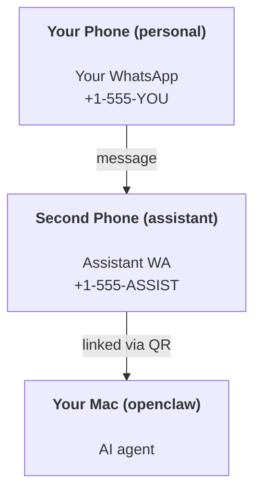

---
read_when:
    - تهيئة مثيل مساعد جديد
    - مراجعة الآثار المترتبة على السلامة والأذونات
summary: دليل شامل من البداية إلى النهاية لتشغيل OpenClaw كمساعد شخصي مع تنبيهات السلامة
title: إعداد المساعد الشخصي
x-i18n:
    generated_at: "2026-04-30T08:26:54Z"
    model: gpt-5.5
    provider: openai
    source_hash: b0614272f9a2b30e0900c55b39a8bd6a2b71b9f5d5fbf0fe00c534b91193e6a0
    source_path: start/openclaw.md
    workflow: 16
---

# بناء مساعد شخصي باستخدام OpenClaw

OpenClaw هو Gateway مستضاف ذاتيًا يربط Discord وGoogle Chat وiMessage وMatrix وMicrosoft Teams وSignal وSlack وTelegram وWhatsApp وZalo وغيرها بوكلاء الذكاء الاصطناعي. يغطي هذا الدليل إعداد "المساعد الشخصي": رقم WhatsApp مخصص يتصرف كمساعد ذكاء اصطناعي دائم التشغيل لديك.

## ⚠️ السلامة أولًا

أنت تضع وكيلًا في موضع يمكنه:

- تشغيل أوامر على جهازك (حسب سياسة الأدوات لديك)
- قراءة/كتابة الملفات في مساحة عملك
- إرسال الرسائل مجددًا عبر WhatsApp/Telegram/Discord/Mattermost والقنوات المضمنة الأخرى

ابدأ بحذر:

- اضبط دائمًا `channels.whatsapp.allowFrom` (لا تشغله مفتوحًا للعالم على جهاز Mac الشخصي لديك).
- استخدم رقم WhatsApp مخصصًا للمساعد.
- أصبحت Heartbeats الآن تعمل افتراضيًا كل 30 دقيقة. عطّلها إلى أن تثق بالإعداد عبر ضبط `agents.defaults.heartbeat.every: "0m"`.

## المتطلبات المسبقة

- تثبيت OpenClaw وإكمال الإعداد الأولي — راجع [بدء الاستخدام](/ar/start/getting-started) إذا لم تكن قد فعلت ذلك بعد
- رقم هاتف ثانٍ (SIM/eSIM/مسبق الدفع) للمساعد

## إعداد الهاتفين (موصى به)

هذا ما تريده:



إذا ربطت WhatsApp الشخصي لديك بـ OpenClaw، فستصبح كل رسالة تصل إليك "إدخالًا للوكيل". نادرًا ما يكون هذا ما تريده.

## بدء سريع خلال 5 دقائق

1. اربط WhatsApp Web (يعرض رمز QR؛ امسحه بهاتف المساعد):

```bash
openclaw channels login
```

2. شغّل Gateway (اتركه قيد التشغيل):

```bash
openclaw gateway --port 18789
```

3. ضع إعدادًا بسيطًا في `~/.openclaw/openclaw.json`:

```json5
{
  gateway: { mode: "local" },
  channels: { whatsapp: { allowFrom: ["+15555550123"] } },
}
```

الآن أرسل رسالة إلى رقم المساعد من هاتفك الموجود في قائمة السماح.

عند انتهاء الإعداد الأولي، يفتح OpenClaw لوحة التحكم تلقائيًا ويطبع رابطًا نظيفًا (غير مرمّز بتوكن). إذا طلبت لوحة التحكم المصادقة، فالصق السر المشترك المضبوط في إعدادات Control UI. يستخدم الإعداد الأولي توكن افتراضيًا (`gateway.auth.token`)، لكن مصادقة كلمة المرور تعمل أيضًا إذا بدّلت `gateway.auth.mode` إلى `password`. لإعادة الفتح لاحقًا: `openclaw dashboard`.

## امنح الوكيل مساحة عمل (AGENTS)

يقرأ OpenClaw تعليمات التشغيل و"الذاكرة" من دليل مساحة العمل الخاص به.

افتراضيًا، يستخدم OpenClaw `~/.openclaw/workspace` كمساحة عمل للوكيل، وسينشئها (إضافة إلى ملفات البداية `AGENTS.md` و`SOUL.md` و`TOOLS.md` و`IDENTITY.md` و`USER.md` و`HEARTBEAT.md`) تلقائيًا عند الإعداد/أول تشغيل للوكيل. لا يُنشأ `BOOTSTRAP.md` إلا عندما تكون مساحة العمل جديدة تمامًا (ولا ينبغي أن يعود بعد حذفه). `MEMORY.md` اختياري (لا يُنشأ تلقائيًا)؛ وعند وجوده، يُحمّل للجلسات العادية. جلسات الوكلاء الفرعيين لا تحقن إلا `AGENTS.md` و`TOOLS.md`.

<Tip>
تعامل مع هذا المجلد كذاكرة OpenClaw واجعله مستودع git (ويُفضّل أن يكون خاصًا) حتى تكون ملفات `AGENTS.md` والذاكرة لديك منسوخة احتياطيًا. إذا كان git مثبتًا، تُهيّأ مساحات العمل الجديدة تمامًا تلقائيًا.
</Tip>

```bash
openclaw setup
```

تخطيط مساحة العمل الكامل + دليل النسخ الاحتياطي: [مساحة عمل الوكيل](/ar/concepts/agent-workspace)
سير عمل الذاكرة: [الذاكرة](/ar/concepts/memory)

اختياري: اختر مساحة عمل مختلفة باستخدام `agents.defaults.workspace` (يدعم `~`).

```json5
{
  agents: {
    defaults: {
      workspace: "~/.openclaw/workspace",
    },
  },
}
```

إذا كنت تشحن ملفات مساحة العمل الخاصة بك من مستودع، يمكنك تعطيل إنشاء ملفات التمهيد بالكامل:

```json5
{
  agents: {
    defaults: {
      skipBootstrap: true,
    },
  },
}
```

## الإعداد الذي يحوله إلى "مساعد"

يضبط OpenClaw إعدادًا افتراضيًا جيدًا للمساعد، لكنك سترغب غالبًا في ضبط:

- الشخصية/التعليمات في [`SOUL.md`](/ar/concepts/soul)
- افتراضيات التفكير (إن رغبت)
- Heartbeats (بعد أن تثق به)

مثال:

```json5
{
  logging: { level: "info" },
  agent: {
    model: "anthropic/claude-opus-4-6",
    workspace: "~/.openclaw/workspace",
    thinkingDefault: "high",
    timeoutSeconds: 1800,
    // Start with 0; enable later.
    heartbeat: { every: "0m" },
  },
  channels: {
    whatsapp: {
      allowFrom: ["+15555550123"],
      groups: {
        "*": { requireMention: true },
      },
    },
  },
  routing: {
    groupChat: {
      mentionPatterns: ["@openclaw", "openclaw"],
    },
  },
  session: {
    scope: "per-sender",
    resetTriggers: ["/new", "/reset"],
    reset: {
      mode: "daily",
      atHour: 4,
      idleMinutes: 10080,
    },
  },
}
```

## الجلسات والذاكرة

- ملفات الجلسة: `~/.openclaw/agents/<agentId>/sessions/{{SessionId}}.jsonl`
- بيانات الجلسة الوصفية (استخدام التوكنات، آخر مسار، إلخ): `~/.openclaw/agents/<agentId>/sessions/sessions.json` (قديم: `~/.openclaw/sessions/sessions.json`)
- يبدأ `/new` أو `/reset` جلسة جديدة لذلك الدردشة (قابل للضبط عبر `resetTriggers`). إذا أُرسل بمفرده، يؤكد OpenClaw إعادة الضبط دون استدعاء النموذج.
- يقوم `/compact [instructions]` بإجراء Compaction لسياق الجلسة ويبلغ عن ميزانية السياق المتبقية.

## Heartbeats (الوضع الاستباقي)

افتراضيًا، يشغّل OpenClaw Heartbeat كل 30 دقيقة مع الموجه:
`Read HEARTBEAT.md if it exists (workspace context). Follow it strictly. Do not infer or repeat old tasks from prior chats. If nothing needs attention, reply HEARTBEAT_OK.`
اضبط `agents.defaults.heartbeat.every: "0m"` للتعطيل.

- إذا كان `HEARTBEAT.md` موجودًا لكنه فارغ فعليًا (أسطر فارغة فقط ورؤوس Markdown مثل `# Heading`)، يتخطى OpenClaw تشغيل Heartbeat لتوفير استدعاءات API.
- إذا كان الملف مفقودًا، تظل Heartbeat تعمل ويقرر النموذج ما يجب فعله.
- إذا رد الوكيل بـ `HEARTBEAT_OK` (اختياريًا مع حشو قصير؛ راجع `agents.defaults.heartbeat.ackMaxChars`)، يمنع OpenClaw التسليم الصادر لتلك Heartbeat.
- افتراضيًا، يُسمح بتسليم Heartbeat إلى أهداف `user:<id>` الشبيهة بالرسائل المباشرة. اضبط `agents.defaults.heartbeat.directPolicy: "block"` لمنع التسليم إلى الأهداف المباشرة مع إبقاء تشغيل Heartbeat نشطًا.
- تشغّل Heartbeats دورات وكيل كاملة — الفواصل الأقصر تستهلك توكنات أكثر.

```json5
{
  agent: {
    heartbeat: { every: "30m" },
  },
}
```

## الوسائط الواردة والصادرة

يمكن إظهار المرفقات الواردة (صور/صوت/مستندات) لأمرك عبر القوالب:

- `{{MediaPath}}` (مسار ملف مؤقت محلي)
- `{{MediaUrl}}` (عنوان URL زائف)
- `{{Transcript}}` (إذا كان نسخ الصوت مفعّلًا)

المرفقات الصادرة من الوكيل: أدرج `MEDIA:<path-or-url>` في سطر مستقل (دون مسافات). مثال:

```
Here’s the screenshot.
MEDIA:https://example.com/screenshot.png
```

يستخرج OpenClaw هذه ويرسلها كوسائط إلى جانب النص.

يتبع سلوك المسار المحلي نموذج الثقة نفسه لقراءة الملفات مثل الوكيل:

- إذا كان `tools.fs.workspaceOnly` هو `true`، تبقى مسارات `MEDIA:` المحلية الصادرة مقيدة بجذر OpenClaw المؤقت، وذاكرة الوسائط المؤقتة، ومسارات مساحة عمل الوكيل، والملفات المولدة داخل sandbox.
- إذا كان `tools.fs.workspaceOnly` هو `false`، يمكن لـ `MEDIA:` الصادرة استخدام ملفات محلية على المضيف يُسمح للوكيل بقراءتها بالفعل.
- لا تزال الإرسالات المحلية من المضيف تسمح فقط بالوسائط وأنواع المستندات الآمنة (الصور، الصوت، الفيديو، PDF، ومستندات Office). لا تُعامل الملفات النصية الصرفة والملفات الشبيهة بالأسرار كوسائط قابلة للإرسال.

هذا يعني أن الصور/الملفات المولدة خارج مساحة العمل يمكن إرسالها الآن عندما تسمح سياسة fs لديك بالفعل بتلك القراءات، دون إعادة فتح تسريب مرفقات نصية عشوائية من المضيف.

## قائمة تحقق العمليات

```bash
openclaw status          # local status (creds, sessions, queued events)
openclaw status --all    # full diagnosis (read-only, pasteable)
openclaw status --deep   # asks the gateway for a live health probe with channel probes when supported
openclaw health --json   # gateway health snapshot (WS; default can return a fresh cached snapshot)
```

توجد السجلات تحت `/tmp/openclaw/` (افتراضيًا: `openclaw-YYYY-MM-DD.log`).

## الخطوات التالية

- WebChat: [WebChat](/ar/web/webchat)
- عمليات Gateway: [دليل تشغيل Gateway](/ar/gateway)
- Cron + إيقاظات: [مهام Cron](/ar/automation/cron-jobs)
- رفيق شريط قوائم macOS: [تطبيق OpenClaw على macOS](/ar/platforms/macos)
- تطبيق عقدة iOS: [تطبيق iOS](/ar/platforms/ios)
- تطبيق عقدة Android: [تطبيق Android](/ar/platforms/android)
- حالة Windows: [Windows (WSL2)](/ar/platforms/windows)
- حالة Linux: [تطبيق Linux](/ar/platforms/linux)
- الأمان: [الأمان](/ar/gateway/security)

## ذات صلة

- [بدء الاستخدام](/ar/start/getting-started)
- [الإعداد](/ar/start/setup)
- [نظرة عامة على القنوات](/ar/channels)
