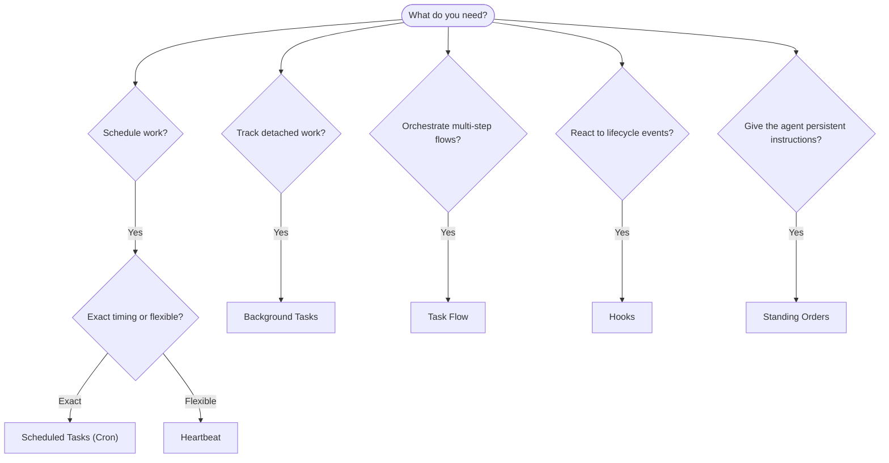

---
read_when:
    - Entscheiden, wie Arbeit mit OpenClaw automatisiert werden kann
    - Auswahl zwischen Heartbeat, Cron, Hooks und Daueranweisungen
    - Suche nach dem richtigen Einstiegspunkt für die Automatisierung
summary: 'Überblick über Automatisierungsmechanismen: Aufgaben, Cron, Hooks, Daueranweisungen und TaskFlow'
title: Automatisierung und Aufgaben
x-i18n:
    generated_at: "2026-04-26T11:22:58Z"
    model: gpt-5.4
    provider: openai
    source_hash: 6d2a2d3ef58830133e07b34f33c611664fc1032247e9dd81005adf7fc0c43cdb
    source_path: automation/index.md
    workflow: 15
---

OpenClaw führt Arbeit im Hintergrund über Aufgaben, geplante Jobs, Event-Hooks und dauerhafte Anweisungen aus. Diese Seite hilft Ihnen dabei, den richtigen Mechanismus auszuwählen und zu verstehen, wie sie zusammenwirken.

## Kurze Entscheidungshilfe

| Anwendungsfall                          | Empfehlung            | Warum                                            |
| --------------------------------------- | --------------------- | ------------------------------------------------ |
| Täglichen Bericht punktgenau um 9 Uhr senden | Scheduled Tasks (Cron) | Exaktes Timing, isolierte Ausführung             |
| Mich in 20 Minuten erinnern             | Scheduled Tasks (Cron) | Einmalig mit präzisem Timing (`--at`)            |
| Wöchentliche tiefgehende Analyse ausführen | Scheduled Tasks (Cron) | Eigenständige Aufgabe, kann ein anderes Modell verwenden |
| Posteingang alle 30 Minuten prüfen      | Heartbeat             | Bündelt sich mit anderen Prüfungen, kontextbewusst |
| Kalender auf bevorstehende Ereignisse überwachen | Heartbeat             | Natürliche Eignung für regelmäßige Aufmerksamkeit |
| Status eines Subagenten- oder ACP-Laufs prüfen | Background Tasks      | Das Aufgabenprotokoll verfolgt alle losgelösten Arbeiten |
| Prüfen, was wann ausgeführt wurde       | Background Tasks      | `openclaw tasks list` und `openclaw tasks audit` |
| Mehrstufig recherchieren und dann zusammenfassen | TaskFlow             | Dauerhafte Orchestrierung mit Revisionsverfolgung |
| Ein Skript bei Sitzungsrücksetzung ausführen | Hooks                 | Ereignisgesteuert, wird bei Lifecycle-Ereignissen ausgelöst |
| Bei jedem Tool-Aufruf Code ausführen    | Plugin hooks          | In-Process-Hooks können Tool-Aufrufe abfangen    |
| Vor dem Antworten immer Compliance prüfen | Standing Orders       | Werden automatisch in jede Sitzung eingefügt     |

### Scheduled Tasks (Cron) vs Heartbeat

| Dimension       | Scheduled Tasks (Cron)             | Heartbeat                             |
| --------------- | ---------------------------------- | ------------------------------------- |
| Timing          | Exakt (Cron-Ausdrücke, einmalig)   | Ungefähr (standardmäßig alle 30 Min.) |
| Sitzungskontext | Frisch (isoliert) oder gemeinsam   | Vollständiger Kontext der Hauptsitzung |
| Aufgabenprotokolle | Werden immer erstellt           | Werden nie erstellt                   |
| Zustellung      | Kanal, Webhook oder still          | Inline in der Hauptsitzung            |
| Am besten für   | Berichte, Erinnerungen, Hintergrundjobs | Posteingangsprüfungen, Kalender, Benachrichtigungen |

Verwenden Sie Scheduled Tasks (Cron), wenn Sie präzises Timing oder isolierte Ausführung benötigen. Verwenden Sie Heartbeat, wenn die Arbeit vom vollständigen Sitzungskontext profitiert und ungefähres Timing ausreicht.

## Grundkonzepte

### Scheduled tasks (cron)

Cron ist der integrierte Scheduler des Gateway für präzises Timing. Er speichert Jobs dauerhaft, weckt den Agenten zum richtigen Zeitpunkt und kann Ausgaben an einen Chat-Kanal oder einen Webhook-Endpunkt zustellen. Unterstützt einmalige Erinnerungen, wiederkehrende Ausdrücke und eingehende Webhook-Trigger.

Siehe [Scheduled Tasks](/de/automation/cron-jobs).

### Tasks

Das Hintergrund-Aufgabenprotokoll verfolgt alle losgelösten Arbeiten: ACP-Läufe, Starts von Subagenten, isolierte Cron-Ausführungen und CLI-Operationen. Tasks sind Datensätze, keine Scheduler. Verwenden Sie `openclaw tasks list` und `openclaw tasks audit`, um sie zu prüfen.

Siehe [Background Tasks](/de/automation/tasks).

### Task Flow

TaskFlow ist das Orchestrierungssubstrat für Flows oberhalb von Hintergrundaufgaben. Es verwaltet dauerhafte mehrstufige Flows mit verwalteten und gespiegelten Synchronisierungsmodi, Revisionsverfolgung und `openclaw tasks flow list|show|cancel` zur Prüfung.

Siehe [Task Flow](/de/automation/taskflow).

### Standing orders

Daueranweisungen geben dem Agenten permanente operative Autorität für definierte Programme. Sie befinden sich in Workspace-Dateien (typischerweise `AGENTS.md`) und werden in jede Sitzung eingefügt. In Kombination mit Cron eignen sie sich für zeitbasierte Durchsetzung.

Siehe [Standing Orders](/de/automation/standing-orders).

### Hooks

Interne Hooks sind ereignisgesteuerte Skripte, die durch Lifecycle-Ereignisse des Agenten
(`/new`, `/reset`, `/stop`), Session-Compaction, Gateway-Start und den Nachrichtenfluss
ausgelöst werden. Sie werden automatisch aus Verzeichnissen erkannt und können mit
`openclaw hooks` verwaltet werden. Für die In-Process-Abfangung von Tool-Aufrufen verwenden Sie
[Plugin hooks](/de/plugins/hooks).

Siehe [Hooks](/de/automation/hooks).

### Heartbeat

Heartbeat ist ein periodischer Zug der Hauptsitzung (standardmäßig alle 30 Minuten). Es bündelt mehrere Prüfungen (Posteingang, Kalender, Benachrichtigungen) in einem Agenten-Zug mit vollem Sitzungskontext. Heartbeat-Züge erstellen keine Aufgabendatensätze und verlängern nicht die Frische täglicher/inaktiver Sitzungsrücksetzungen. Verwenden Sie `HEARTBEAT.md` für eine kleine Checkliste oder einen `tasks:`-Block, wenn Sie ausschließlich fällige periodische Prüfungen innerhalb des Heartbeat selbst möchten. Leere Heartbeat-Dateien werden als `empty-heartbeat-file` übersprungen; der Nur-fällige-Aufgaben-Modus wird als `no-tasks-due` übersprungen.

Siehe [Heartbeat](/de/gateway/heartbeat).

## Wie sie zusammenwirken

- **Cron** übernimmt präzise Zeitpläne (tägliche Berichte, wöchentliche Reviews) und einmalige Erinnerungen. Alle Cron-Ausführungen erstellen Aufgabendatensätze.
- **Heartbeat** übernimmt routinemäßige Überwachung (Posteingang, Kalender, Benachrichtigungen) in einem gebündelten Zug alle 30 Minuten.
- **Hooks** reagieren auf bestimmte Ereignisse (Sitzungsrücksetzungen, Compaction, Nachrichtenfluss) mit benutzerdefinierten Skripten. Plugin hooks decken Tool-Aufrufe ab.
- **Standing Orders** geben dem Agenten dauerhaften Kontext und Autoritätsgrenzen.
- **TaskFlow** koordiniert mehrstufige Flows oberhalb einzelner Aufgaben.
- **Tasks** verfolgen automatisch alle losgelösten Arbeiten, damit Sie sie prüfen und auditieren können.

## Verwandt

- [Scheduled Tasks](/de/automation/cron-jobs) — präzise Planung und einmalige Erinnerungen
- [Background Tasks](/de/automation/tasks) — Aufgabenprotokoll für alle losgelösten Arbeiten
- [Task Flow](/de/automation/taskflow) — dauerhafte Orchestrierung mehrstufiger Flows
- [Hooks](/de/automation/hooks) — ereignisgesteuerte Lifecycle-Skripte
- [Plugin hooks](/de/plugins/hooks) — In-Process-Hooks für Tools, Prompts, Nachrichten und Lifecycle
- [Standing Orders](/de/automation/standing-orders) — dauerhafte Anweisungen für den Agenten
- [Heartbeat](/de/gateway/heartbeat) — periodische Züge der Hauptsitzung
- [Configuration Reference](/de/gateway/configuration-reference) — alle Konfigurationsschlüssel
