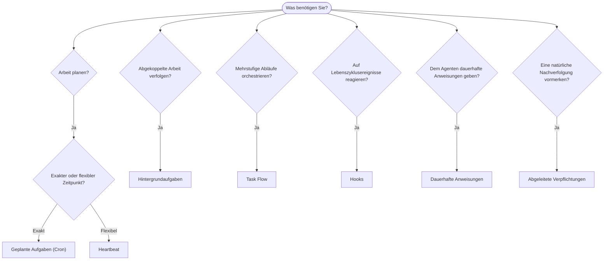

OpenClaw führt Arbeiten über Aufgaben, geplante Jobs, abgeleitete
Verpflichtungen, Ereignis-Hooks und dauerhafte Anweisungen im Hintergrund aus. Auf dieser Seite erfahren Sie, wie Sie den
richtigen Mechanismus auswählen.

## Kurzübersicht zur Auswahl

| Anwendungsfall                                      | Empfehlung                    | Warum                                                    |
| --------------------------------------------------- | ----------------------------- | -------------------------------------------------------- |
| Täglichen Bericht genau um 9 Uhr senden             | Geplante Aufgaben (Cron)      | Exakter Zeitpunkt, isolierte Ausführung                  |
| Mich in 20 Minuten erinnern                         | Geplante Aufgaben (Cron)      | Einmalige Ausführung mit präzisem Zeitpunkt (`--at`)     |
| Wöchentlich eine tiefgehende Analyse ausführen      | Geplante Aufgaben (Cron)      | Eigenständige Aufgabe, kann ein anderes Modell verwenden |
| Posteingang alle 30 Minuten prüfen                  | Heartbeat                     | Gebündelt mit anderen Prüfungen, kontextbezogen          |
| Kalender auf bevorstehende Termine überwachen       | Heartbeat                     | Eignet sich auf natürliche Weise für regelmäßige Prüfung |
| Nach einem erwähnten Vorstellungsgespräch nachfragen | Abgeleitete Verpflichtungen   | Erinnerungsähnliche Nachverfolgung ohne exakte Anfrage   |
| Nach Benutzerkontext behutsam nach dem Befinden fragen | Abgeleitete Verpflichtungen | Auf denselben Agenten und Kanal begrenzt                 |
| Status eines Subagenten- oder ACP-Laufs prüfen      | Hintergrundaufgaben           | Das Aufgabenprotokoll erfasst alle abgekoppelten Arbeiten |
| Prüfen, was wann ausgeführt wurde                   | Hintergrundaufgaben           | `openclaw tasks list` und `openclaw tasks audit`         |
| Mehrstufig recherchieren und anschließend zusammenfassen | Task Flow                 | Dauerhafte Orchestrierung mit Revisionsverfolgung        |
| Bei Sitzungszurücksetzung ein Skript ausführen      | Hooks                         | Ereignisgesteuert, wird bei Lebenszyklusereignissen ausgelöst |
| Bei jedem Tool-Aufruf Code ausführen                | Plugin-Hooks                  | Prozessinterne Hooks können Tool-Aufrufe abfangen        |
| Vor jeder Antwort stets die Compliance prüfen       | Dauerhafte Anweisungen        | Wird automatisch in jede Sitzung eingefügt              |

### Geplante Aufgaben (Cron) im Vergleich zu Heartbeat

| Dimension        | Geplante Aufgaben (Cron)                | Heartbeat                                  |
| ---------------- | --------------------------------------- | ------------------------------------------ |
| Zeitpunkt        | Exakt (Cron-Ausdrücke, einmalig)        | Ungefähr (standardmäßig alle 30 Minuten)   |
| Sitzungskontext  | Neu (isoliert) oder gemeinsam verwendet | Vollständiger Kontext der Hauptsitzung     |
| Aufgabeneinträge | Werden immer erstellt                   | Werden nie erstellt                        |
| Zustellung       | Kanal, Webhook oder lautlos             | Direkt in der Hauptsitzung                 |
| Am besten für    | Berichte, Erinnerungen, Hintergrundjobs | Posteingangsprüfungen, Kalender, Benachrichtigungen |

Verwenden Sie geplante Aufgaben (Cron), wenn Sie einen präzisen Zeitpunkt oder eine isolierte Ausführung benötigen. Verwenden Sie Heartbeat, wenn die Arbeit vom vollständigen Sitzungskontext profitiert und ein ungefährer Zeitpunkt ausreicht.

## Grundkonzepte

### Geplante Aufgaben (Cron)

Cron ist der integrierte Scheduler des Gateway für präzise Zeitplanung. Er speichert Jobs dauerhaft, aktiviert den Agenten zum richtigen Zeitpunkt und kann Ausgaben an einen Chatkanal oder Webhook-Endpunkt zustellen. Unterstützt einmalige Erinnerungen, wiederkehrende Ausdrücke und eingehende Webhook-Auslöser.

Siehe [Geplante Aufgaben](/de/automation/cron-jobs).

### Aufgaben

Das Hintergrundaufgabenprotokoll erfasst alle abgekoppelten Arbeiten: ACP-Läufe, gestartete Subagenten, isolierte Cron-Ausführungen und CLI-Vorgänge. Aufgaben sind Einträge, keine Scheduler. Verwenden Sie `openclaw tasks list` und `openclaw tasks audit`, um sie zu prüfen.

Siehe [Hintergrundaufgaben](/de/automation/tasks).

### Abgeleitete Verpflichtungen

Verpflichtungen sind optionale, kurzlebige Erinnerungen für spätere Nachfragen. OpenClaw leitet sie
aus normalen Unterhaltungen ab, begrenzt sie auf denselben Agenten und Kanal und
stellt fällige Nachfragen über Heartbeat zu. Ausdrücklich vom Benutzer angeforderte Erinnerungen mit exaktem Zeitpunkt
gehören weiterhin zu Cron.

Siehe [Abgeleitete Verpflichtungen](/de/concepts/commitments).

### Task Flow

Task Flow ist die Ablauf-Orchestrierungsebene oberhalb von Hintergrundaufgaben. Sie verwaltet dauerhafte mehrstufige Abläufe mit verwalteten und gespiegelten Synchronisierungsmodi, Revisionsverfolgung sowie `openclaw tasks flow list|show|cancel` zur Prüfung.

Siehe [Task Flow](/de/automation/taskflow).

### Dauerhafte Anweisungen

Dauerhafte Anweisungen erteilen dem Agenten permanente Betriebsbefugnisse für definierte Programme. Sie befinden sich in Arbeitsbereichsdateien (üblicherweise `AGENTS.md`) und werden in jede Sitzung eingefügt. Kombinieren Sie sie mit Cron für zeitbasierte Durchsetzung.

Siehe [Dauerhafte Anweisungen](/de/automation/standing-orders).

### Hooks

Interne Hooks sind ereignisgesteuerte Skripte, die durch Lebenszyklusereignisse des Agenten
(`/new`, `/reset`, `/stop`), Sitzungs-Compaction, den Start des Gateway und den Nachrichtenfluss
ausgelöst werden. Sie werden in Hook-Verzeichnissen erkannt und mit
`openclaw hooks` verwaltet. Verwenden Sie zum prozessinternen Abfangen von Tool-Aufrufen
[Plugin-Hooks](/de/plugins/hooks).

Siehe [Hooks](/de/automation/hooks).

### Heartbeat

Heartbeat ist ein regelmäßiger Durchlauf der Hauptsitzung (standardmäßig alle 30 Minuten). Dabei werden mehrere Prüfungen (Posteingang, Kalender, Benachrichtigungen) in einem Agentendurchlauf mit vollständigem Sitzungskontext gebündelt. Heartbeat-Durchläufe erstellen keine Aufgabeneinträge und verlängern nicht die Aktualitätsfrist für tägliche oder inaktivitätsbedingte Sitzungszurücksetzungen. Verwenden Sie `HEARTBEAT.md` für eine kurze Prüfliste oder einen `tasks:`-Block, wenn Sie innerhalb von Heartbeat selbst nur fällige regelmäßige Prüfungen ausführen möchten. Leere Heartbeat-Dateien werden mit `empty-heartbeat-file` übersprungen; der Aufgabenmodus nur für fällige Aufgaben wird mit `no-tasks-due` übersprungen. Heartbeats werden zurückgestellt, während Cron-Arbeit aktiv ist oder sich in der Warteschlange befindet. `heartbeat.skipWhenBusy` kann einen Agenten außerdem zurückstellen, während sitzungsschlüsselgebundene Subagenten- oder verschachtelte Ausführungsspuren desselben Agenten ausgelastet sind.

Siehe [Heartbeat](/de/gateway/heartbeat).

## Zusammenspiel der Mechanismen

- **Cron** übernimmt präzise Zeitpläne (tägliche Berichte, wöchentliche Überprüfungen) und einmalige Erinnerungen. Alle Cron-Ausführungen erstellen Aufgabeneinträge.
- **Heartbeat** übernimmt routinemäßige Überwachung (Posteingang, Kalender, Benachrichtigungen) in einem gebündelten Durchlauf alle 30 Minuten.
- **Hooks** reagieren mit benutzerdefinierten Skripten auf bestimmte Ereignisse (Sitzungszurücksetzungen, Compaction, Nachrichtenfluss). Plugin-Hooks decken Tool-Aufrufe ab.
- **Dauerhafte Anweisungen** geben dem Agenten beständigen Kontext und Befugnisgrenzen.
- **Task Flow** koordiniert mehrstufige Abläufe oberhalb einzelner Aufgaben.
- **Aufgaben** erfassen automatisch alle abgekoppelten Arbeiten, damit Sie diese prüfen und auditieren können.

## Verwandte Themen

- [Geplante Aufgaben](/de/automation/cron-jobs) — präzise Zeitplanung und einmalige Erinnerungen
- [Abgeleitete Verpflichtungen](/de/concepts/commitments) — erinnerungsähnliche Nachfragen
- [Hintergrundaufgaben](/de/automation/tasks) — Aufgabenprotokoll für alle abgekoppelten Arbeiten
- [Task Flow](/de/automation/taskflow) — dauerhafte Orchestrierung mehrstufiger Abläufe
- [Hooks](/de/automation/hooks) — ereignisgesteuerte Lebenszyklusskripte
- [Plugin-Hooks](/de/plugins/hooks) — prozessinterne Hooks für Tools, Prompts, Nachrichten und den Lebenszyklus
- [Dauerhafte Anweisungen](/de/automation/standing-orders) — dauerhafte Agentenanweisungen
- [Heartbeat](/de/gateway/heartbeat) — regelmäßige Durchläufe der Hauptsitzung
- [Konfigurationsreferenz](/de/gateway/configuration-reference) — alle Konfigurationsschlüssel
