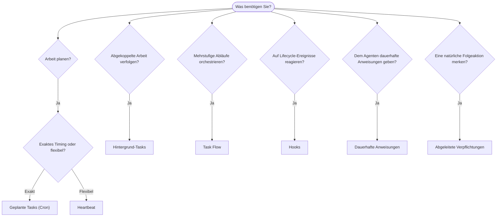

---
read_when:
    - Entscheiden, wie Sie Arbeit mit OpenClaw automatisieren
    - Auswahl zwischen Heartbeat, Cron, Verpflichtungen, Hooks und dauerhaften Anweisungen
    - Den richtigen Einstiegspunkt für Automatisierung finden
summary: 'Übersicht über Automatisierungsmechanismen: Aufgaben, Cron, Hooks, ständige Anweisungen und Task Flow'
title: Automatisierung & Aufgaben
x-i18n:
    generated_at: "2026-04-30T06:38:23Z"
    model: gpt-5.5
    provider: openai
    source_hash: a2465c39f21db8bcb98f980a2c4b2c03018dddd5f43de59d8bf6ce0d6e97d9ef
    source_path: automation/index.md
    workflow: 16
---

OpenClaw führt Arbeit im Hintergrund über Tasks, geplante Aufträge, abgeleitete Verpflichtungen, Event-Hooks und dauerhafte Anweisungen aus. Diese Seite hilft Ihnen, den richtigen Mechanismus auszuwählen und zu verstehen, wie sie zusammenpassen.

## Schneller Entscheidungsleitfaden

| Anwendungsfall                                    | Empfehlung                  | Warum                                                        |
| ------------------------------------------------- | --------------------------- | ------------------------------------------------------------ |
| Täglichen Bericht pünktlich um 9 Uhr senden       | Geplante Tasks (Cron)       | Exaktes Timing, isolierte Ausführung                         |
| Erinnern Sie mich in 20 Minuten                   | Geplante Tasks (Cron)       | Einmalige Ausführung mit präzisem Timing (`--at`)            |
| Wöchentliche Tiefenanalyse ausführen              | Geplante Tasks (Cron)       | Eigenständiger Task, kann ein anderes Modell verwenden       |
| Posteingang alle 30 Minuten prüfen                | Heartbeat                   | Bündelt mit anderen Prüfungen, kontextbewusst                |
| Kalender auf anstehende Ereignisse überwachen     | Heartbeat                   | Natürliche Passung für periodische Aufmerksamkeit            |
| Nach einem erwähnten Interview nachfassen         | Abgeleitete Verpflichtungen | Gedächtnisartige Folgeaktion, keine exakte Erinnerungsanfrage |
| Behutsamer Fürsorge-Check-in nach Nutzerkontext   | Abgeleitete Verpflichtungen | Auf denselben Agenten und Kanal begrenzt                     |
| Status eines Subagenten oder ACP-Laufs prüfen     | Hintergrund-Tasks           | Task-Ledger verfolgt alle abgekoppelten Arbeiten             |
| Prüfen, was wann ausgeführt wurde                 | Hintergrund-Tasks           | `openclaw tasks list` und `openclaw tasks audit`             |
| Mehrstufige Recherche und dann Zusammenfassung    | Task Flow                   | Dauerhafte Orchestrierung mit Revisionsverfolgung            |
| Skript beim Zurücksetzen einer Sitzung ausführen  | Hooks                       | Event-gesteuert, wird bei Lifecycle-Ereignissen ausgelöst    |
| Code bei jedem Tool-Aufruf ausführen              | Plugin-Hooks                | In-Process-Hooks können Tool-Aufrufe abfangen                |
| Vor Antworten immer Compliance prüfen             | Dauerhafte Anweisungen      | Wird automatisch in jede Sitzung injiziert                   |

### Geplante Tasks (Cron) vs. Heartbeat

| Dimension       | Geplante Tasks (Cron)              | Heartbeat                                      |
| --------------- | ---------------------------------- | ---------------------------------------------- |
| Timing          | Exakt (Cron-Ausdrücke, einmalig)   | Ungefähr (standardmäßig alle 30 Minuten)       |
| Sitzungskontext | Frisch (isoliert) oder geteilt     | Vollständiger Hauptsitzungskontext             |
| Task-Datensätze | Immer erstellt                     | Nie erstellt                                   |
| Zustellung      | Kanal, Webhook oder still          | Inline in der Hauptsitzung                     |
| Am besten für   | Berichte, Erinnerungen, Hintergrundaufträge | Posteingangsprüfungen, Kalender, Benachrichtigungen |

Verwenden Sie Geplante Tasks (Cron), wenn Sie präzises Timing oder isolierte Ausführung benötigen. Verwenden Sie Heartbeat, wenn die Arbeit vom vollständigen Sitzungskontext profitiert und ungefähres Timing ausreicht.

## Kernkonzepte

### Geplante Tasks (Cron)

Cron ist der integrierte Scheduler des Gateways für präzises Timing. Er persistiert Aufträge, weckt den Agenten zur richtigen Zeit und kann Ausgaben an einen Chat-Kanal oder Webhook-Endpunkt zustellen. Unterstützt einmalige Erinnerungen, wiederkehrende Ausdrücke und eingehende Webhook-Trigger.

Siehe [Geplante Tasks](/de/automation/cron-jobs).

### Tasks

Das Hintergrund-Task-Ledger verfolgt alle abgekoppelten Arbeiten: ACP-Läufe, Subagent-Starts, isolierte Cron-Ausführungen und CLI-Operationen. Tasks sind Datensätze, keine Scheduler. Verwenden Sie `openclaw tasks list` und `openclaw tasks audit`, um sie zu prüfen.

Siehe [Hintergrund-Tasks](/de/automation/tasks).

### Abgeleitete Verpflichtungen

Verpflichtungen sind opt-in, kurzlebige Erinnerungen für Folgeaktionen. OpenClaw leitet sie aus normalen Gesprächen ab, begrenzt sie auf denselben Agenten und Kanal und stellt fällige Check-ins über Heartbeat zu. Exakte, vom Nutzer angeforderte Erinnerungen gehören weiterhin zu Cron.

Siehe [Abgeleitete Verpflichtungen](/de/concepts/commitments).

### Task Flow

Task Flow ist das Flow-Orchestrierungssubstrat oberhalb von Hintergrund-Tasks. Es verwaltet dauerhafte mehrstufige Flows mit verwalteten und gespiegelten Sync-Modi, Revisionsverfolgung und `openclaw tasks flow list|show|cancel` zur Prüfung.

Siehe [Task Flow](/de/automation/taskflow).

### Dauerhafte Anweisungen

Dauerhafte Anweisungen geben dem Agenten permanente operative Befugnis für definierte Programme. Sie liegen in Workspace-Dateien (typischerweise `AGENTS.md`) und werden in jede Sitzung injiziert. Kombinieren Sie sie mit Cron für zeitbasierte Durchsetzung.

Siehe [Dauerhafte Anweisungen](/de/automation/standing-orders).

### Hooks

Interne Hooks sind event-gesteuerte Skripte, die durch Agent-Lifecycle-Ereignisse (`/new`, `/reset`, `/stop`), Sitzungs-Compaction, Gateway-Start und Nachrichtenfluss ausgelöst werden. Sie werden automatisch aus Verzeichnissen erkannt und können mit `openclaw hooks` verwaltet werden. Für In-Process-Abfangen von Tool-Aufrufen verwenden Sie [Plugin-Hooks](/de/plugins/hooks).

Siehe [Hooks](/de/automation/hooks).

### Heartbeat

Heartbeat ist ein periodischer Turn in der Hauptsitzung (standardmäßig alle 30 Minuten). Er bündelt mehrere Prüfungen (Posteingang, Kalender, Benachrichtigungen) in einem Agent-Turn mit vollständigem Sitzungskontext. Heartbeat-Turns erstellen keine Task-Datensätze und verlängern nicht die Frische für tägliche oder inaktive Sitzungsresets. Verwenden Sie `HEARTBEAT.md` für eine kleine Checkliste oder einen `tasks:`-Block, wenn Sie nur fällige periodische Prüfungen innerhalb von Heartbeat selbst wünschen. Leere Heartbeat-Dateien werden als `empty-heartbeat-file` übersprungen; der Nur-fällig-Task-Modus wird als `no-tasks-due` übersprungen. Heartbeats werden zurückgestellt, während Cron-Arbeit aktiv ist oder in der Warteschlange steht, und `heartbeat.skipWhenBusy` kann sie auch zurückstellen, während Subagent- oder verschachtelte Lanes beschäftigt sind.

Siehe [Heartbeat](/de/gateway/heartbeat).

## Wie sie zusammenarbeiten

- **Cron** verarbeitet präzise Zeitpläne (tägliche Berichte, wöchentliche Reviews) und einmalige Erinnerungen. Alle Cron-Ausführungen erstellen Task-Datensätze.
- **Heartbeat** verarbeitet Routineüberwachung (Posteingang, Kalender, Benachrichtigungen) in einem gebündelten Turn alle 30 Minuten.
- **Hooks** reagieren mit benutzerdefinierten Skripten auf bestimmte Ereignisse (Sitzungsresets, Compaction, Nachrichtenfluss). Plugin-Hooks decken Tool-Aufrufe ab.
- **Dauerhafte Anweisungen** geben dem Agenten dauerhaften Kontext und Befugnisgrenzen.
- **Task Flow** koordiniert mehrstufige Flows oberhalb einzelner Tasks.
- **Tasks** verfolgen automatisch alle abgekoppelten Arbeiten, damit Sie sie prüfen und auditieren können.

## Verwandte Themen

- [Geplante Tasks](/de/automation/cron-jobs) — präzise Planung und einmalige Erinnerungen
- [Abgeleitete Verpflichtungen](/de/concepts/commitments) — gedächtnisartige Folge-Check-ins
- [Hintergrund-Tasks](/de/automation/tasks) — Task-Ledger für alle abgekoppelten Arbeiten
- [Task Flow](/de/automation/taskflow) — dauerhafte mehrstufige Flow-Orchestrierung
- [Hooks](/de/automation/hooks) — event-gesteuerte Lifecycle-Skripte
- [Plugin-Hooks](/de/plugins/hooks) — In-Process-Tool-, Prompt-, Nachrichten- und Lifecycle-Hooks
- [Dauerhafte Anweisungen](/de/automation/standing-orders) — dauerhafte Agent-Anweisungen
- [Heartbeat](/de/gateway/heartbeat) — periodische Turns in der Hauptsitzung
- [Konfigurationsreferenz](/de/gateway/configuration-reference) — alle Konfigurationsschlüssel
