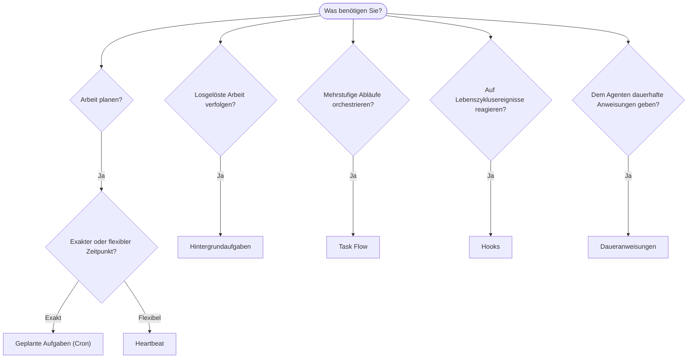

OpenClaw führt Arbeit über Aufgaben, geplante Jobs, Ereignis-Hooks
und Daueranweisungen im Hintergrund aus. Auf dieser Seite können Sie den passenden Mechanismus auswählen.

## Schnelle Entscheidungshilfe

| Anwendungsfall                                  | Empfehlung                 | Warum                                                   |
| ----------------------------------------------- | -------------------------- | ------------------------------------------------------- |
| Täglichen Bericht pünktlich um 9 Uhr senden     | Geplante Aufgaben (Cron)   | Exakter Zeitpunkt, isolierte Ausführung                 |
| In 20 Minuten erinnern                          | Geplante Aufgaben (Cron)   | Einmalige Ausführung mit präzisem Zeitpunkt (`--at`) |
| Wöchentlich eine umfassende Analyse ausführen   | Geplante Aufgaben (Cron)   | Eigenständige Aufgabe, kann ein anderes Modell verwenden |
| Posteingang alle 30 Minuten prüfen              | Heartbeat                  | Mit anderen Prüfungen gebündelt, kontextbezogen         |
| Kalender auf bevorstehende Ereignisse überwachen | Heartbeat                 | Eignet sich ideal für regelmäßige Überwachung           |
| Status eines Subagenten- oder ACP-Laufs prüfen  | Hintergrundaufgaben        | Das Aufgabenregister erfasst alle losgelösten Arbeiten  |
| Prüfen, was wann ausgeführt wurde               | Hintergrundaufgaben        | `openclaw tasks list` und `openclaw tasks audit`               |
| Mehrstufig recherchieren und dann zusammenfassen | Task Flow                 | Dauerhafte Orchestrierung mit Revisionsverfolgung       |
| Bei einer Sitzungszurücksetzung ein Skript ausführen | Hooks                  | Ereignisgesteuert, wird bei Lebenszyklusereignissen ausgelöst |
| Bei jedem Werkzeugaufruf Code ausführen         | Plugin-Hooks               | Prozessinterne Hooks können Werkzeugaufrufe abfangen    |
| Vor jeder Antwort stets die Compliance prüfen   | Daueranweisungen           | Wird automatisch in jede Sitzung eingefügt              |

### Geplante Aufgaben (Cron) im Vergleich zu Heartbeat

| Dimension       | Geplante Aufgaben (Cron)                | Heartbeat                                  |
| --------------- | --------------------------------------- | ------------------------------------------ |
| Zeitpunkt       | Exakt (Cron-Ausdrücke, einmalig)        | Ungefähr (standardmäßig alle 30 Minuten)   |
| Sitzungskontext | Neu (isoliert) oder gemeinsam genutzt   | Vollständiger Kontext der Hauptsitzung     |
| Aufgabeneinträge | Werden immer erstellt                  | Werden nie erstellt                        |
| Zustellung      | Kanal, Webhook oder lautlos             | Direkt in der Hauptsitzung                 |
| Ideal für       | Berichte, Erinnerungen, Hintergrundjobs | Posteingangsprüfungen, Kalender, Benachrichtigungen |

Verwenden Sie geplante Aufgaben (Cron), wenn Sie einen präzisen Zeitpunkt oder eine isolierte Ausführung benötigen. Verwenden Sie Heartbeat, wenn die Arbeit vom vollständigen Sitzungskontext profitiert und ein ungefährer Zeitpunkt ausreicht.

## Grundlegende Konzepte

### Geplante Aufgaben (Cron)

Cron ist der integrierte Scheduler des Gateways für präzise Zeitplanung. Er speichert Jobs dauerhaft, aktiviert den Agenten zum richtigen Zeitpunkt und kann Ausgaben an einen Chatkanal oder einen Webhook-Endpunkt zustellen. Unterstützt einmalige Erinnerungen, wiederkehrende Ausdrücke und eingehende Webhook-Auslöser.

Siehe [Geplante Aufgaben](/de/automation/cron-jobs).

### Aufgaben

Das Hintergrundaufgabenregister erfasst alle losgelösten Arbeiten: ACP-Läufe, gestartete Subagenten, isolierte Cron-Ausführungen und CLI-Vorgänge. Aufgaben sind Einträge, keine Scheduler. Verwenden Sie `openclaw tasks list` und `openclaw tasks audit`, um sie zu prüfen.

Siehe [Hintergrundaufgaben](/de/automation/tasks).

### Task Flow

Task Flow ist die Ablauf-Orchestrierungsebene oberhalb von Hintergrundaufgaben. Sie verwaltet dauerhafte mehrstufige Abläufe mit verwalteten und gespiegelten Synchronisierungsmodi, Revisionsverfolgung und `openclaw tasks flow list|show|cancel` zur Prüfung.

Siehe [Task Flow](/de/automation/taskflow).

### Daueranweisungen

Daueranweisungen erteilen dem Agenten permanente Ausführungsbefugnisse für definierte Programme. Sie befinden sich in Arbeitsbereichsdateien (üblicherweise `AGENTS.md`) und werden in jede Sitzung eingefügt. Kombinieren Sie sie mit Cron für zeitbasierte Durchsetzung.

Siehe [Daueranweisungen](/de/automation/standing-orders).

### Hooks

Interne Hooks sind ereignisgesteuerte Skripte, die durch Lebenszyklusereignisse des Agenten
(`/new`, `/reset`, `/stop`), Sitzungs-Compaction, den Start des Gateways und den Nachrichtenfluss
ausgelöst werden. Sie werden in Hook-Verzeichnissen erkannt und mit
`openclaw hooks` verwaltet. Verwenden Sie für das prozessinterne Abfangen von Werkzeugaufrufen
[Plugin-Hooks](/de/plugins/hooks).

Siehe [Hooks](/de/automation/hooks).

### Heartbeat

Heartbeat ist eine regelmäßige Runde in der Hauptsitzung (standardmäßig alle 30 Minuten). Dabei werden checklistenartige Überwachungen (Posteingang, Kalender, Benachrichtigungen) in einer Agentenrunde mit vollständigem Sitzungskontext gebündelt. Heartbeat-Runden erstellen keine Aufgabeneinträge und verlängern nicht die Aktualität für tägliche oder inaktivitätsbedingte Sitzungszurücksetzungen. Der Heartbeat-Arbeitsspeicher ist ein kleiner Prompt-Kontext; planen Sie wiederkehrende Arbeit als Cron-Jobs. Bei leerem Heartbeat-Arbeitsspeicher wird die Ausführung als `empty-heartbeat-file` übersprungen. Heartbeats werden zurückgestellt, solange Cron-Arbeit aktiv ist oder sich in der Warteschlange befindet. Außerdem kann `heartbeat.skipWhenBusy` einen Agenten zurückstellen, während die sitzungsschlüsselgebundenen Subagenten oder verschachtelten Ausführungspfade desselben Agenten beschäftigt sind.

Siehe [Heartbeat](/de/gateway/heartbeat).

## Zusammenspiel

- **Cron** übernimmt präzise Zeitpläne (tägliche Berichte, wöchentliche Überprüfungen) und einmalige Erinnerungen. Alle Cron-Ausführungen erstellen Aufgabeneinträge.
- **Heartbeat** übernimmt alle 30 Minuten eine gebündelte Überwachungscheckliste; Cron ist für Prüfungen mit unabhängigen Intervallen zuständig.
- **Hooks** reagieren mit benutzerdefinierten Skripten auf bestimmte Ereignisse (Sitzungszurücksetzungen, Compaction, Nachrichtenfluss). Plugin-Hooks decken Werkzeugaufrufe ab.
- **Daueranweisungen** geben dem Agenten dauerhaften Kontext und Befugnisgrenzen.
- **Task Flow** koordiniert mehrstufige Abläufe oberhalb einzelner Aufgaben.
- **Aufgaben** erfassen automatisch alle losgelösten Arbeiten, damit Sie sie prüfen und auditieren können.

## Verwandte Themen

- [Geplante Aufgaben](/de/automation/cron-jobs) — präzise Zeitplanung und einmalige Erinnerungen
- [Hintergrundaufgaben](/de/automation/tasks) — Aufgabenregister für alle losgelösten Arbeiten
- [Task Flow](/de/automation/taskflow) — dauerhafte Orchestrierung mehrstufiger Abläufe
- [Hooks](/de/automation/hooks) — ereignisgesteuerte Lebenszyklusskripte
- [Plugin-Hooks](/de/plugins/hooks) — prozessinterne Hooks für Werkzeuge, Prompts, Nachrichten und den Lebenszyklus
- [Daueranweisungen](/de/automation/standing-orders) — dauerhafte Agentenanweisungen
- [Heartbeat](/de/gateway/heartbeat) — regelmäßige Runden in der Hauptsitzung
- [Konfigurationsreferenz](/de/gateway/configuration-reference) — alle Konfigurationsschlüssel
