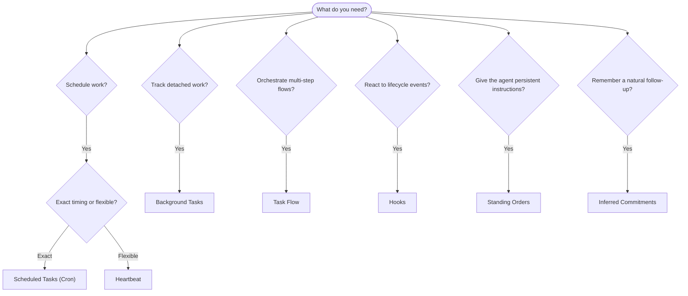

---
read_when:
    - Entscheiden, wie Sie Arbeit mit OpenClaw automatisieren
    - Auswahl zwischen Heartbeat, Cron, Commitments, Hooks und Standing Orders
    - Den richtigen Einstiegspunkt für Automatisierung finden
summary: 'Überblick über Automatisierungsmechanismen: Aufgaben, Cron, Hooks, dauerhafte Anweisungen und Task Flow'
title: Automatisierung und Aufgaben
x-i18n:
    generated_at: "2026-05-06T06:39:35Z"
    model: gpt-5.5
    provider: openai
    source_hash: ee7f34fa4840c0e43e50d09e415b2529ef0c8bc3ccb6e3546b8a873c9458832d
    source_path: automation/index.md
    workflow: 16
---

OpenClaw führt Arbeit im Hintergrund über Aufgaben, geplante Jobs, abgeleitete
Commitments, Event-Hooks und dauerhafte Anweisungen aus. Diese Seite hilft Ihnen,
den richtigen Mechanismus auszuwählen und zu verstehen, wie sie zusammenpassen.

## Schnelle Entscheidungshilfe

| Anwendungsfall                                  | Empfehlung             | Warum                                                   |
| ----------------------------------------------- | ---------------------- | ------------------------------------------------------- |
| Täglichen Bericht genau um 9 Uhr senden         | Geplante Aufgaben (Cron) | Exakter Zeitpunkt, isolierte Ausführung                 |
| Erinnern Sie mich in 20 Minuten                 | Geplante Aufgaben (Cron) | Einmalig mit präzisem Zeitpunkt (`--at`)                |
| Wöchentliche Tiefenanalyse ausführen            | Geplante Aufgaben (Cron) | Eigenständige Aufgabe, kann anderes Modell verwenden    |
| Posteingang alle 30 Minuten prüfen              | Heartbeat              | Wird mit anderen Prüfungen gebündelt, kontextbewusst    |
| Kalender auf bevorstehende Ereignisse überwachen | Heartbeat              | Natürliche Passung für periodische Awareness            |
| Nach einem erwähnten Interview nachfassen       | Abgeleitete Commitments | Gedächtnisähnliches Nachfassen, keine exakte Erinnerung |
| Dezenter Care-Check-in nach Benutzerkontext     | Abgeleitete Commitments | Auf denselben Agenten und Kanal beschränkt              |
| Status eines Subagenten oder ACP-Laufs prüfen   | Hintergrundaufgaben    | Aufgabenbuch zeichnet alle losgelösten Arbeiten auf     |
| Prüfen, was wann ausgeführt wurde               | Hintergrundaufgaben    | `openclaw tasks list` und `openclaw tasks audit`        |
| Mehrstufig recherchieren und dann zusammenfassen | Task Flow              | Dauerhafte Orchestrierung mit Revisionsverfolgung       |
| Skript beim Sitzungs-Reset ausführen            | Hooks                  | Eventgesteuert, wird bei Lebenszyklusereignissen ausgelöst |
| Code bei jedem Tool-Aufruf ausführen            | Plugin-Hooks           | In-Process-Hooks können Tool-Aufrufe abfangen           |
| Vor Antworten immer Compliance prüfen           | Dauerhafte Anweisungen | Wird automatisch in jede Sitzung injiziert              |

### Geplante Aufgaben (Cron) vs. Heartbeat

| Dimension       | Geplante Aufgaben (Cron)             | Heartbeat                             |
| --------------- | ------------------------------------ | ------------------------------------- |
| Zeitpunkt       | Exakt (Cron-Ausdrücke, einmalig)     | Ungefähr (standardmäßig alle 30 Min.) |
| Sitzungskontext | Frisch (isoliert) oder gemeinsam     | Voller Kontext der Hauptsitzung       |
| Aufgabendatensätze | Immer erstellt                    | Nie erstellt                          |
| Zustellung      | Kanal, Webhook oder still            | Inline in der Hauptsitzung            |
| Am besten für   | Berichte, Erinnerungen, Hintergrundjobs | Posteingangsprüfungen, Kalender, Benachrichtigungen |

Verwenden Sie Geplante Aufgaben (Cron), wenn Sie präzises Timing oder isolierte Ausführung benötigen. Verwenden Sie Heartbeat, wenn die Arbeit vom vollständigen Sitzungskontext profitiert und ungefähres Timing ausreicht.

## Kernkonzepte

### Geplante Aufgaben (Cron)

Cron ist der integrierte Scheduler des Gateway für präzises Timing. Er persistiert Jobs, weckt den Agenten zum richtigen Zeitpunkt und kann Ausgaben an einen Chatkanal oder Webhook-Endpunkt zustellen. Unterstützt einmalige Erinnerungen, wiederkehrende Ausdrücke und eingehende Webhook-Auslöser.

Siehe [Geplante Aufgaben](/de/automation/cron-jobs).

### Aufgaben

Das Hintergrundaufgabenbuch verfolgt alle losgelösten Arbeiten: ACP-Läufe, Subagent-Starts, isolierte Cron-Ausführungen und CLI-Operationen. Aufgaben sind Datensätze, keine Scheduler. Verwenden Sie `openclaw tasks list` und `openclaw tasks audit`, um sie zu prüfen.

Siehe [Hintergrundaufgaben](/de/automation/tasks).

### Abgeleitete Commitments

Commitments sind optionale, kurzlebige Nachfass-Erinnerungen. OpenClaw leitet sie
aus normalen Gesprächen ab, beschränkt sie auf denselben Agenten und Kanal und
stellt fällige Check-ins über Heartbeat zu. Exakte, vom Benutzer angeforderte
Erinnerungen gehören weiterhin zu Cron.

Siehe [Abgeleitete Commitments](/de/concepts/commitments).

### Task Flow

Task Flow ist das Substrat für Flow-Orchestrierung oberhalb von Hintergrundaufgaben. Es verwaltet dauerhafte mehrstufige Flows mit verwalteten und gespiegelten Sync-Modi, Revisionsverfolgung und `openclaw tasks flow list|show|cancel` zur Prüfung.

Siehe [Task Flow](/de/automation/taskflow).

### Dauerhafte Anweisungen

Dauerhafte Anweisungen geben dem Agenten permanente Betriebsautorität für definierte Programme. Sie liegen in Workspace-Dateien (typischerweise `AGENTS.md`) und werden in jede Sitzung injiziert. Kombinieren Sie sie mit Cron für zeitbasierte Durchsetzung.

Siehe [Dauerhafte Anweisungen](/de/automation/standing-orders).

### Hooks

Interne Hooks sind eventgesteuerte Skripte, die durch Lebenszyklusereignisse
des Agenten (`/new`, `/reset`, `/stop`), Sitzungs-Compaction, Gateway-Start und
Nachrichtenfluss ausgelöst werden. Sie werden automatisch aus Verzeichnissen
erkannt und können mit `openclaw hooks` verwaltet werden. Für das Abfangen von
Tool-Aufrufen im Prozess verwenden Sie [Plugin-Hooks](/de/plugins/hooks).

Siehe [Hooks](/de/automation/hooks).

### Heartbeat

Heartbeat ist ein periodischer Turn der Hauptsitzung (standardmäßig alle 30 Minuten). Er bündelt mehrere Prüfungen (Posteingang, Kalender, Benachrichtigungen) in einem Agenten-Turn mit vollständigem Sitzungskontext. Heartbeat-Turns erstellen keine Aufgabendatensätze und verlängern nicht die Frische für tägliche oder inaktive Sitzungs-Resets. Verwenden Sie `HEARTBEAT.md` für eine kleine Checkliste oder einen `tasks:`-Block, wenn Sie fälligkeitsbasierte periodische Prüfungen innerhalb von Heartbeat selbst möchten. Leere Heartbeat-Dateien werden als `empty-heartbeat-file` übersprungen; der fälligkeitsbasierte Aufgabenmodus wird als `no-tasks-due` übersprungen. Heartbeats werden aufgeschoben, während Cron-Arbeit aktiv ist oder in der Warteschlange steht, und `heartbeat.skipWhenBusy` kann sie ebenfalls aufschieben, während Subagenten- oder verschachtelte Lanes ausgelastet sind.

Siehe [Heartbeat](/de/gateway/heartbeat).

## Wie sie zusammenarbeiten

- **Cron** verarbeitet präzise Zeitpläne (tägliche Berichte, wöchentliche Reviews) und einmalige Erinnerungen. Alle Cron-Ausführungen erstellen Aufgabendatensätze.
- **Heartbeat** verarbeitet Routineüberwachung (Posteingang, Kalender, Benachrichtigungen) in einem gebündelten Turn alle 30 Minuten.
- **Hooks** reagieren mit benutzerdefinierten Skripten auf bestimmte Ereignisse (Sitzungs-Resets, Compaction, Nachrichtenfluss). Plugin-Hooks decken Tool-Aufrufe ab.
- **Dauerhafte Anweisungen** geben dem Agenten persistenten Kontext und Autoritätsgrenzen.
- **Task Flow** koordiniert mehrstufige Flows oberhalb einzelner Aufgaben.
- **Aufgaben** verfolgen automatisch alle losgelösten Arbeiten, damit Sie sie prüfen und auditieren können.

## Verwandt

- [Geplante Aufgaben](/de/automation/cron-jobs) — präzise Planung und einmalige Erinnerungen
- [Abgeleitete Commitments](/de/concepts/commitments) — gedächtnisähnliche Nachfass-Check-ins
- [Hintergrundaufgaben](/de/automation/tasks) — Aufgabenbuch für alle losgelösten Arbeiten
- [Task Flow](/de/automation/taskflow) — dauerhafte mehrstufige Flow-Orchestrierung
- [Hooks](/de/automation/hooks) — eventgesteuerte Lebenszyklus-Skripte
- [Plugin-Hooks](/de/plugins/hooks) — In-Process-Hooks für Tools, Prompts, Nachrichten und Lebenszyklus
- [Dauerhafte Anweisungen](/de/automation/standing-orders) — persistente Agentenanweisungen
- [Heartbeat](/de/gateway/heartbeat) — periodische Turns der Hauptsitzung
- [Konfigurationsreferenz](/de/gateway/configuration-reference) — alle Konfigurationsschlüssel
