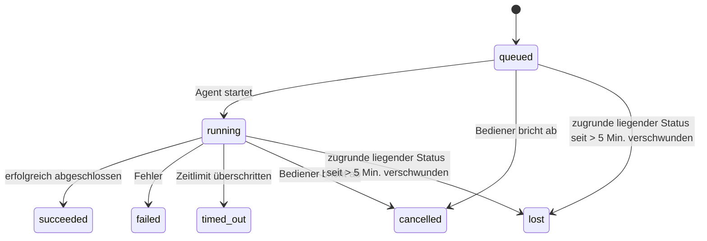

---
read_when:
    - Laufende oder kürzlich abgeschlossene Hintergrundarbeiten prüfen
    - Fehlerbehebung bei Zustellungsfehlern für entkoppelte Agentenläufe
    - Verstehen, wie Hintergrundausführungen mit Sitzungen, Cron und Heartbeat zusammenhängen
sidebarTitle: Background tasks
summary: Nachverfolgung von Hintergrundaufgaben für ACP-Ausführungen, Subagenten, Cron-Ausführungen und CLI-Operationen
title: Hintergrundaufgaben
x-i18n:
    generated_at: "2026-07-24T03:38:22Z"
    model: gpt-5.6
    postprocess_version: locale-links-v1
    prompt_version: 32
    provider: openai
    source_hash: dbdc5ced133764fec0c8b9ae7b1957e24272dc9c1c86099de81f6923955d6b5a
    source_path: automation/tasks.md
    workflow: 16
---

<Note>
Suchen Sie nach einer Zeitplanung? Unter [Automatisierung](/de/automation) erfahren Sie, wie Sie den richtigen Mechanismus auswählen. Diese Seite ist das Aktivitätsprotokoll für Hintergrundarbeit, nicht der Scheduler.
</Note>

Hintergrundaufgaben erfassen Arbeit, die **außerhalb Ihrer Hauptkonversationssitzung** ausgeführt wird: ACP-Ausführungen, gestartete Subagenten, Cron-Job-Ausführungen und über die CLI initiierte Vorgänge.

Aufgaben ersetzen **weder** Sitzungen noch Cron-Jobs oder Heartbeats – sie sind das **Aktivitätsprotokoll**, das aufzeichnet, welche entkoppelte Arbeit wann ausgeführt wurde und ob sie erfolgreich war.

<Note>
Nicht jede Agentenausführung erstellt eine Aufgabe. Heartbeat-Durchläufe und normale interaktive Chats tun dies nicht. Alle Cron-Ausführungen, gestarteten ACP- und Subagenten-Sitzungen, vom Gateway übermittelte CLI-Agentenbefehle sowie vom Agenten gestartete `exec`-Hintergrundbefehle tun dies.
</Note>

## Kurzfassung

- Aufgaben sind **Datensätze**, keine Scheduler – Cron und Heartbeat bestimmen, _wann_ Arbeit ausgeführt wird; Aufgaben erfassen, _was geschehen ist_.
- ACP, Subagenten, alle Cron-Jobs und CLI-Vorgänge erstellen Aufgaben. Heartbeat-Durchläufe tun dies nicht.
- Jede Aufgabe durchläuft `queued → running → terminal` (erfolgreich, fehlgeschlagen, Zeitüberschreitung, abgebrochen oder verloren).
- Cron-Aufgaben bleiben aktiv, solange die Cron-Laufzeit den Job noch verwaltet. Wenn der speicherinterne Laufzeitstatus nicht mehr vorhanden ist, prüft die Aufgabenwartung zunächst den dauerhaften Cron-Ausführungsverlauf, bevor sie eine Aufgabe als verloren markiert.
- Der Abschluss wird per Push übermittelt: Entkoppelte Arbeit kann nach ihrer Fertigstellung direkt benachrichtigen oder die anfordernde Sitzung beziehungsweise den Heartbeat aufwecken. Schleifen zur Statusabfrage sind daher meist der falsche Ansatz.
- Isolierte Cron-Ausführungen und abgeschlossene Subagenten versuchen vor der abschließenden Bereinigung nach Möglichkeit, die für ihre untergeordnete Sitzung erfassten Browser-Tabs und Prozesse zu bereinigen.
- Bei der Zustellung isolierter Cron-Ausführungen werden veraltete vorläufige Antworten des übergeordneten Agenten unterdrückt, solange die Arbeit nachgelagerter Subagenten noch ausläuft. Trifft deren endgültige Ausgabe vor der Zustellung ein, wird diese bevorzugt.
- Abschlussbenachrichtigungen werden direkt an einen Kanal zugestellt oder für den nächsten Heartbeat in die Warteschlange gestellt.
- `openclaw tasks list` zeigt alle Aufgaben an; `openclaw tasks audit` hebt Probleme hervor.
- Abgeschlossene Datensätze werden 7 Tage lang aufbewahrt (`lost`-Datensätze 24 Stunden) und anschließend automatisch bereinigt.

## Schnellstart

<Tabs>
  <Tab title="Auflisten und filtern">
    ```bash
    # Alle Aufgaben auflisten (neueste zuerst)
    openclaw tasks list

    # Nach Laufzeit oder Status filtern
    openclaw tasks list --runtime acp
    openclaw tasks list --status running
    ```

  </Tab>
  <Tab title="Untersuchen">
    ```bash
    # Details zu einer bestimmten Aufgabe anzeigen (nach Aufgaben-ID, Ausführungs-ID oder Sitzungsschlüssel)
    openclaw tasks show <lookup>
    ```
  </Tab>
  <Tab title="Abbrechen und benachrichtigen">
    ```bash
    # Eine laufende Aufgabe abbrechen (beendet die untergeordnete Sitzung)
    openclaw tasks cancel <lookup>

    # Benachrichtigungsrichtlinie einer Aufgabe ändern
    openclaw tasks notify <lookup> state_changes
    ```

  </Tab>
  <Tab title="Prüfung und Wartung">
    ```bash
    # Zustandsprüfung ausführen
    openclaw tasks audit

    # Wartung in der Vorschau anzeigen oder anwenden
    openclaw tasks maintenance
    openclaw tasks maintenance --apply
    ```

  </Tab>
  <Tab title="Aufgabenablauf">
    ```bash
    # TaskFlow-Status untersuchen
    openclaw tasks flow list
    openclaw tasks flow show <lookup>
    openclaw tasks flow cancel <lookup>
    ```
  </Tab>
</Tabs>

## Was eine Aufgabe erstellt

| Quelle                 | Laufzeittyp | Zeitpunkt der Erstellung eines Aufgabendatensatzes                       | Standard-Benachrichtigungsrichtlinie |
| ---------------------- | ------------ | ------------------------------------------------------------------------ | ------------------------------------ |
| ACP-Hintergrundausführungen | `acp`        | Beim Starten einer untergeordneten ACP-Sitzung                           | `done_only`                   |
| Subagenten-Orchestrierung | `subagent`   | Beim Starten eines Subagenten über `sessions_spawn`                    | `done_only`                   |
| Cron-Jobs (alle Typen) | `cron`       | Bei jeder Cron-Ausführung (Hauptsitzung und isoliert)                    | `silent`                   |
| CLI-Vorgänge           | `cli`        | `openclaw agent`-Befehle, die über das Gateway ausgeführt werden       | `silent`                   |
| Agenten-Medienjobs     | `cli`        | Sitzungsgebundene `image_generate`-/`music_generate`-/`video_generate`-Ausführungen | `silent`                   |

<AccordionGroup>
  <Accordion title="Benachrichtigungsvorgaben für Cron und Medien">
    Cron-Aufgaben (Hauptsitzung und isoliert) verwenden die Benachrichtigungsrichtlinie `silent` – sie erstellen Datensätze zur Nachverfolgung, erzeugen jedoch keine eigenen Aufgabenbenachrichtigungen; Cron verwaltet seinen Zustellungsweg selbst.

    Sitzungsgebundene Ausführungen von `image_generate`, `music_generate` und `video_generate` verwenden ebenfalls die Benachrichtigungsrichtlinie `silent`. Sie erstellen weiterhin Aufgabendatensätze, der Abschluss wird jedoch als internes Wecksignal an die ursprüngliche Agentensitzung zurückgegeben, damit der Agent die Folgenachricht verfassen und die fertiggestellten Medien selbst anhängen kann. Der anfordernde Agent folgt seinem normalen Vertrag für sichtbare Antworten: eine automatische abschließende Antwort, sofern konfiguriert, oder `message(action="send")` zusammen mit `NO_REPLY`, wenn die Sitzung Antworten über das Nachrichtenwerkzeug erfordert. Wenn die anfordernde Sitzung nicht mehr aktiv ist oder ihr aktives Wecksignal fehlschlägt und der Abschlussagent einige oder alle erzeugten Medien übersieht, sendet OpenClaw einen idempotenten direkten Fallback ausschließlich mit den fehlenden Medien an das ursprüngliche Kanalziel.

  </Accordion>
  <Accordion title="Schutzvorkehrung für gleichzeitige Medienerzeugung">
    Solange eine sitzungsgebundene Aufgabe zur Medienerzeugung noch aktiv ist, schützen `image_generate`, `music_generate` und `video_generate` vor versehentlichen Wiederholungen: Wird der Aufruf für dieselbe Eingabeaufforderung beziehungsweise Anfrage wiederholt, wird der Status der passenden aktiven Aufgabe zurückgegeben, statt ein Duplikat zu starten. Eine andere Eingabeaufforderung kann hingegen eine eigene Aufgabe starten. Verwenden Sie `action: "status"`, wenn Sie vonseiten des Agenten ausdrücklich den Fortschritt oder Status abfragen möchten.
  </Accordion>
  <Accordion title="Was keine Aufgaben erstellt">
    - Heartbeat-Durchläufe – Hauptsitzung; siehe [Heartbeat](/de/gateway/heartbeat)
    - Normale interaktive Chat-Durchläufe
    - Direkte `/command`-Antworten

  </Accordion>
</AccordionGroup>

## Aufgabenlebenszyklus



| Status      | Bedeutung                                                                    |
| ----------- | ---------------------------------------------------------------------------- |
| `queued`    | Erstellt; wartet auf den Start durch den Agenten                             |
| `running`   | Agentendurchlauf wird aktiv ausgeführt                                       |
| `succeeded` | Erfolgreich abgeschlossen                                                    |
| `failed`    | Mit einem Fehler abgeschlossen                                               |
| `timed_out` | Konfiguriertes Zeitlimit überschritten                                       |
| `cancelled` | Vom Bediener über `openclaw tasks cancel` gestoppt oder Ausführung abgebrochen |
| `lost`      | Die Laufzeit hat den maßgeblichen zugrunde liegenden Status nach einer Kulanzfrist von 5 Minuten verloren |

Übergänge erfolgen automatisch – Lebenszyklusereignisse der Agentenausführung (Start, Ende, Fehler) aktualisieren den Aufgabenstatus; Sie verwalten ihn nicht manuell.

Der Abschluss einer Agentenausführung ist für aktive Aufgabendatensätze maßgeblich. Eine erfolgreiche entkoppelte Ausführung wird als `succeeded` abgeschlossen, gewöhnliche Ausführungsfehler als `failed`, Zeitüberschreitungen als `timed_out` und Abbruchergebnisse als `cancelled`. Sobald eine Aufgabe abgeschlossen ist, können spätere Lebenszyklussignale ihren Status nicht herabstufen – eine vom Bediener abgebrochene oder bereits als `failed`/`timed_out`/`lost` markierte Aufgabe behält diesen Status, selbst wenn danach ein Erfolgssignal eintrifft.

`lost` berücksichtigt die Laufzeit:

- ACP-Aufgaben: Nur ein aktiver prozessinterner ACP-Durchlauf im Gateway belegt, dass die Ausführung noch aktiv ist; dauerhaft gespeicherte Sitzungsmetadaten allein tun dies nicht. Die Offline-CLI-Prüfung bleibt konservativ und gibt ACP-Aufgaben niemals zur Bereinigung frei.
- Subagenten-Aufgaben: Die zugrunde liegende untergeordnete Sitzung ist aus dem Speicher des Zielagenten verschwunden oder enthält einen Tombstone zur Wiederherstellung nach einem Neustart.
- Cron-Aufgaben: Die Cron-Laufzeit verfolgt den Job nicht mehr als aktiv und der dauerhafte Cron-Ausführungsverlauf enthält kein abschließendes Ergebnis für diese Ausführung. Die Offline-CLI-Prüfung betrachtet ihren eigenen leeren prozessinternen Cron-Laufzeitstatus nicht als maßgeblich.
- CLI-Aufgaben: Aufgaben mit einer Ausführungs-ID beziehungsweise Quell-ID verwenden den aktiven Ausführungskontext. Verbleibende Datensätze untergeordneter Sitzungen oder Chatsitzungen halten sie daher nicht aktiv, nachdem die vom Gateway verwaltete Ausführung verschwunden ist. Ältere CLI-Aufgaben ohne Ausführungsidentität greifen weiterhin auf die untergeordnete Sitzung zurück. Gateway-gestützte `openclaw agent`-Ausführungen werden ebenfalls anhand ihres Ausführungsergebnisses abgeschlossen, sodass abgeschlossene Ausführungen nicht aktiv bleiben, bis der Bereinigungsprozess sie als `lost` markiert.

## Zustellung und Benachrichtigungen

Wenn eine Aufgabe einen abschließenden Status erreicht, benachrichtigt OpenClaw Sie. Es gibt zwei Zustellungswege:

**Direkte Zustellung** – wenn die Aufgabe ein Kanalziel (`requesterOrigin`) besitzt, wird die Abschlussnachricht direkt an diesen Kanal gesendet (Discord, Slack, Telegram usw.). Aufgabenabschlüsse für Gruppen und Kanäle werden stattdessen über die anfordernde Sitzung geleitet, damit der übergeordnete Agent die sichtbare Antwort verfassen kann. Bei abgeschlossenen Subagenten erhält OpenClaw außerdem die gebundene Thread-/Themenweiterleitung, sofern verfügbar, und kann ein fehlendes `to` beziehungsweise Konto anhand der in der anfordernden Sitzung gespeicherten Route (`lastChannel` / `lastTo` / `lastAccountId`) ergänzen, bevor die direkte Zustellung aufgegeben wird.

**Über die Sitzung in die Warteschlange gestellte Zustellung** – wenn die direkte Zustellung fehlschlägt oder kein Ursprung festgelegt ist, wird die Aktualisierung als Systemereignis in die Sitzung des Anforderers eingereiht und beim nächsten Heartbeat angezeigt.

<Tip>
Über die Sitzung eingereihte Aufgabenabschlüsse lösen sofort ein Heartbeat-Wecksignal aus, sodass das Ergebnis schnell angezeigt wird – Sie müssen nicht auf den nächsten geplanten Heartbeat-Durchlauf warten.
</Tip>

Der übliche Arbeitsablauf ist daher Push-basiert: Starten Sie die entkoppelte Arbeit einmal und lassen Sie sich anschließend von der Laufzeit nach Abschluss aufwecken oder benachrichtigen. Fragen Sie den Aufgabenstatus nur ab, wenn Sie eine Fehlerdiagnose, einen Eingriff oder eine ausdrückliche Prüfung benötigen.

### Benachrichtigungsrichtlinien

Steuern Sie, wie viele Meldungen Sie zu jeder Aufgabe erhalten:

| Richtlinie            | Zugestellter Inhalt                                      |
| --------------------- | -------------------------------------------------------- |
| `done_only` (Standard) | Nur der abschließende Status (erfolgreich, fehlgeschlagen usw.) |
| `state_changes`       | Jeder Statusübergang und jede Fortschrittsaktualisierung |
| `silent`              | Gar nichts (Standard für Cron-, CLI- und Medienaufgaben) |

Ändern Sie die Richtlinie, während eine Aufgabe ausgeführt wird:

```bash
openclaw tasks notify <lookup> state_changes
```

## CLI-Referenz

<AccordionGroup>
  <Accordion title="tasks list">
    ```bash
    openclaw tasks list [--runtime <acp|subagent|cron|cli>] [--status <status>] [--json]
    ```

    Ausgabespalten: Aufgabe, Art, Status, Zustellung, Ausführung, untergeordnete Sitzung, Zusammenfassung. Ein alleinstehendes `openclaw tasks` verhält sich wie `openclaw tasks list`.

  </Accordion>
  <Accordion title="tasks show">
    ```bash
    openclaw tasks show <lookup> [--json]
    ```

    Das Such-Token akzeptiert eine Aufgaben-ID, Ausführungs-ID oder einen Sitzungsschlüssel. Zeigt den vollständigen Datensatz einschließlich Zeitangaben, Zustellungsstatus, Fehler und abschließender Zusammenfassung an.

  </Accordion>
  <Accordion title="tasks cancel">
    ```bash
    openclaw tasks cancel <lookup>
    ```

    Bei ACP- und Subagent-Aufgaben beendet dies die untergeordnete Sitzung; ACP- und Cron-Abbrüche werden über das laufende Gateway geleitet (`tasks.cancel`). Bei über die CLI nachverfolgten Aufgaben wird der Abbruch im Aufgabenregister vermerkt (es gibt kein separates Handle für die untergeordnete Runtime). Der Status wechselt zu `cancelled`, und gegebenenfalls wird eine Zustellbenachrichtigung gesendet.

  </Accordion>
  <Accordion title="Aufgaben benachrichtigen">
    ```bash
    openclaw tasks notify <lookup> <done_only|state_changes|silent>
    ```
  </Accordion>
  <Accordion title="Aufgaben prüfen">
    ```bash
    openclaw tasks audit [--severity <warn|error>] [--code <name>] [--limit <n>] [--json]
    ```

    Zeigt betriebliche Probleme für Aufgaben **und** TaskFlows in einem Bericht an. Wenn Probleme erkannt werden, erscheinen die Befunde außerdem in `openclaw status`.

    Aufgabenbefunde:

    | Befund                    | Schweregrad | Auslöser                                                                                                                    |
    | ------------------------- | ----------- | --------------------------------------------------------------------------------------------------------------------------- |
    | `stale_queued`        | Warnung     | Seit mehr als 10 Minuten in der Warteschlange                                                                               |
    | `stale_running`        | Fehler      | Seit mehr als 30 Minuten in Ausführung                                                                                       |
    | `lost`        | Warnung/Fehler | Die Eigentümerschaft einer Runtime-gestützten Aufgabe ist verschwunden; beibehaltene verlorene Aufgaben bleiben bis `cleanupAfter` Warnungen und werden danach zu Fehlern |
    | `delivery_failed`        | Warnung     | Zustellung fehlgeschlagen und die Benachrichtigungsrichtlinie ist nicht `silent`                                  |
    | `missing_cleanup`        | Warnung     | Beendete Aufgabe ohne Bereinigungszeitstempel                                                                                |
    | `inconsistent_timestamps`        | Warnung     | Verletzung der zeitlichen Abfolge (zum Beispiel vor dem Start beendet)                                                       |

    TaskFlow-Befunde:

    | Befund                    | Schweregrad | Auslöser                                                                                             |
    | ------------------------- | ----------- | ---------------------------------------------------------------------------------------------------- |
    | `restore_failed`        | Fehler      | Wiederherstellung des Ablaufregisters aus SQLite fehlgeschlagen                                      |
    | `stale_running`        | Fehler      | Laufender Ablauf wurde seit mehr als 30 Minuten nicht fortgesetzt                                    |
    | `stale_waiting`        | Warnung     | Wartender Ablauf wurde seit mehr als 30 Minuten nicht fortgesetzt                                    |
    | `stale_blocked`        | Warnung     | Blockierter Ablauf wurde seit mehr als 30 Minuten nicht fortgesetzt                                  |
    | `cancel_stuck`        | Warnung     | Abbruch vor mehr als 5 Minuten angefordert, keine aktiven untergeordneten Aufgaben, weiterhin nicht beendet |
    | `missing_linked_tasks`        | Warnung/Fehler | Veralteter verwalteter Ablauf ohne verknüpfte Aufgaben oder Wartezustand                          |
    | `blocked_task_missing`        | Warnung     | Blockierter Ablauf verweist auf eine nicht mehr vorhandene Aufgaben-ID                               |

  </Accordion>
  <Accordion title="Aufgabenwartung">
    ```bash
    openclaw tasks maintenance [--json]
    openclaw tasks maintenance --apply [--json]
    ```

    Verwenden Sie dies, um Abgleich, Setzen von Bereinigungszeitstempeln und Bereinigung für Aufgaben, den TaskFlow-Zustand und veraltete Registerzeilen von Cron-Ausführungssitzungen in der Vorschau anzuzeigen oder anzuwenden.

    Der Abgleich berücksichtigt die Runtime:

    - ACP-Aufgaben erfordern einen aktiven prozessinternen Durchlauf im Gateway; Subagent-Aufgaben prüfen ihre zugrunde liegende untergeordnete Sitzung.
    - Subagent-Aufgaben, deren untergeordnete Sitzung einen Tombstone für die Wiederherstellung nach einem Neustart aufweist, werden als verloren markiert, statt als wiederherstellbare zugrunde liegende Sitzungen behandelt zu werden.
    - Cron-Aufgaben prüfen, ob die Cron-Runtime weiterhin Eigentümerin des Jobs ist, und stellen dann den Beendigungsstatus aus persistenten Cron-Ausführungsprotokollen beziehungsweise dem Jobzustand wieder her, bevor sie auf `lost` zurückfallen. Nur der Gateway-Prozess ist für die speicherinterne Menge aktiver Cron-Jobs maßgeblich; die Offline-CLI-Prüfung verwendet den dauerhaften Verlauf, markiert eine Cron-Aufgabe jedoch nicht allein deshalb als verloren, weil diese lokale Menge leer ist.
    - CLI-Aufgaben mit Ausführungsidentität prüfen den zugehörigen aktiven Ausführungskontext, nicht nur Zeilen untergeordneter Sitzungen oder Chatsitzungen.

    Auch die Abschlussbereinigung berücksichtigt die Runtime:

    - Beim Abschluss eines Subagenten werden nach Möglichkeit nachverfolgte Browser-Tabs und -Prozesse für die untergeordnete Sitzung geschlossen, bevor die Bereinigung für die Ankündigung fortgesetzt wird.
    - Beim Abschluss eines isolierten Cron-Laufs werden nach Möglichkeit nachverfolgte Browser-Tabs und -Prozesse für die Cron-Sitzung geschlossen, bevor die Ausführung vollständig beendet wird.
    - Die Zustellung eines isolierten Cron-Laufs wartet bei Bedarf Folgeaktivitäten untergeordneter Subagenten ab und unterdrückt veralteten Bestätigungstext der übergeordneten Sitzung, statt ihn anzukündigen.
    - Die Abschlusszustellung eines Subagenten verwendet ausschließlich den neuesten sichtbaren Assistententext des untergeordneten Elements. Ausgaben von Tool/toolResult werden nicht in den Ergebnistext des untergeordneten Elements übernommen. Fehlgeschlagene beendete Ausführungen melden den Fehlerstatus, ohne erfassten Antworttext erneut wiederzugeben.
    - Bereinigungsfehler verdecken nicht das tatsächliche Aufgabenergebnis.

    Beim Anwenden der Wartung entfernt OpenClaw außerdem veraltete Registerzeilen von `cron:<jobId>:run:<runId>`-Sitzungen, die älter als 7 Tage sind, behält jedoch Zeilen für derzeit laufende Cron-Jobs bei und lässt Zeilen von Nicht-Cron-Sitzungen unverändert.

  </Accordion>
  <Accordion title="Aufgabenabläufe auflisten | anzeigen | abbrechen">
    ```bash
    openclaw tasks flow list [--status <status>] [--json]
    openclaw tasks flow show <lookup> [--json]
    openclaw tasks flow cancel <lookup>
    ```

    Das Suchtoken für Abläufe akzeptiert eine Ablauf-ID oder einen Eigentümerschlüssel. Verwenden Sie diese Befehle, wenn Sie sich für den orchestrierenden [Task Flow](/de/automation/taskflow) statt für einen einzelnen Datensatz einer Hintergrundaufgabe interessieren.

  </Accordion>
</AccordionGroup>

## Chat-Aufgabentafel (`/tasks`)

Verwenden Sie `/tasks` in einer beliebigen Chatsitzung, um die mit dieser Sitzung verknüpften Hintergrundaufgaben anzuzeigen. Die Tafel zeigt bis zu fünf aktive und kürzlich abgeschlossene Aufgaben mit Runtime, Status, Zeitangaben sowie Fortschritts- oder Fehlerdetails an.

Wenn die aktuelle Sitzung keine sichtbaren verknüpften Aufgaben enthält, greift `/tasks` auf agentenlokale Aufgabenzahlen zurück, sodass Sie weiterhin einen Überblick erhalten, ohne Details anderer Sitzungen offenzulegen.

Verwenden Sie für das vollständige Betriebsprotokoll die CLI: `openclaw tasks list`.

### Control UI

Die webbasierte Control UI verfügt in der Seitenleiste über eine Seite **Aufgaben** mit aktiven und kürzlich abgeschlossenen Hintergrundaufgaben in Echtzeit. Verwenden Sie sie, um den Fortschritt zu prüfen, verknüpfte Sitzungen zu öffnen, das Protokoll zu aktualisieren oder Aufgaben in der Warteschlange und laufende Aufgaben abzubrechen.

Chatbereiche verfügen außerdem über eine einklappbare Leiste **Hintergrundaufgaben**, die auf den Agenten des Bereichs beschränkt ist: laufende Aufgaben und Subagenten mit einer Stoppsteuerung, einen Abschnitt mit abgeschlossenen Aufgaben sowie Links zum Anzeigen des Transkripts der jeweiligen untergeordneten Aufgabensitzung. Öffnen Sie sie über den Aktivitätsschalter in der Kopfzeile des Bereichs (oder über die schwebende Aktivitätsschaltfläche im Chat mit nur einem Bereich).

Wählen Sie eine Aufgabe in der Leiste aus, um ihre begrenzte Eingabeaufforderung und die neueste Ausgabe oder Fehlerzusammenfassung zu prüfen. Laufende Arbeiten bleiben von abgeschlossenen Arbeiten getrennt, und abgeschlossene Zeilen zeigen an, ob die Aufgabe erfolgreich abgeschlossen wurde oder fehlgeschlagen ist. Öffnen Sie unter iOS **Chat actions → Background Tasks**; öffnen Sie unter Android das Überlaufmenü des Chats und wählen Sie **Background tasks**. Beide mobilen Ansichten verwenden dieselbe Gruppierung in „Laufend“ und „Abgeschlossen“ und öffnen bei Auswahl die Aufgabendetails.

## Statusintegration (Aufgabendruck)

`openclaw status` enthält eine Aufgabenzeile für den schnellen Überblick:

```
Aufgaben    2 aktiv · 1 in Warteschlange · 1 laufend · 1 Problem · Prüfung ohne Befund · 6 nachverfolgt
```

Die Zusammenfassung zählt aktive Arbeiten (`queued` + `running`), Fehler (`failed` + `timed_out` + `lost`), Prüfungsbefunde und die Gesamtzahl nachverfolgter Datensätze; die JSON-Nutzlast schlüsselt die Zahlen außerdem nach Runtime auf (`acp`, `subagent`, `cron`, `cli`).

Sowohl `/status` als auch das Tool `session_status` verwenden eine bereinigungsbewusste Aufgabenmomentaufnahme: Aktive Aufgaben werden bevorzugt, abgelaufene Zeilen ausgeblendet und beendete Aufgaben nur für ein kurzes aktuelles Zeitfenster (5 Minuten) angezeigt; wenn keine aktive Arbeit verbleibt, liegt der Schwerpunkt auf Fehlern. Dadurch konzentriert sich die Statuskarte auf das, was gerade wichtig ist.

## Speicherung und Wartung

### Speicherort der Aufgaben

Aufgabendatensätze und Zustellstatus bleiben in der gemeinsamen SQLite-Zustandsdatenbank von OpenClaw erhalten:

```
~/.openclaw/state/openclaw.sqlite   (Tabellen: task_runs, task_delivery_state, flow_runs)
```

Setzen Sie `OPENCLAW_STATE_DIR`, um das gesamte Zustandsstammverzeichnis (standardmäßig `~/.openclaw`) an einen anderen Speicherort zu verschieben; der Pfad der gemeinsamen Datenbank wird ebenfalls verschoben.

Das Register wird bei der ersten Verwendung in den Speicher geladen und speichert jeden Schreibvorgang wieder in SQLite, sodass Datensätze Gateway-Neustarts überdauern. Das WAL-Wachstum bleibt durch den standardmäßigen Autocheckpoint-Schwellenwert von SQLite sowie regelmäßige `PASSIVE`-Checkpoints begrenzt; beim Herunterfahren und bei expliziten Wartungs-Checkpoints wird `TRUNCATE` verwendet, damit bei normalen Schließvorgängen WAL-Speicher zurückgewonnen wird, ohne dass der Hintergrundbereiniger auf aktive Leser warten muss.

Veraltete Sidecar-Speicher älterer Installationen (`tasks/runs.sqlite`, `flows/registry.sqlite`) werden durch `openclaw doctor` in die gemeinsame Datenbank importiert.

### Automatische Wartung

Ein Bereiniger wird alle **60 Sekunden** ausgeführt (der erste Durchlauf etwa 5 Sekunden nach dem Start des Gateways) und übernimmt vier Aufgaben:

<Steps>
  <Step title="Abgleich">
    Prüft, ob aktive Aufgaben weiterhin eine maßgebliche Runtime-Grundlage besitzen. ACP-Aufgaben erfordern einen aktiven prozessinternen Durchlauf, Subagent-Aufgaben verwenden den Zustand der untergeordneten Sitzung, Cron-Aufgaben verwenden die Eigentümerschaft aktiver Jobs sowie den dauerhaften Ausführungsverlauf, und CLI-Aufgaben mit Ausführungsidentität verwenden den zugehörigen Ausführungskontext. Wenn der zugrunde liegende Zustand länger als 5 Minuten fehlt (30 Minuten bei nativen Subagent-Aufgaben ohne untergeordnete Sitzung), wird die Aufgabe als `lost` markiert.
  </Step>
  <Step title="Reparatur von ACP-Sitzungen">
    Schließt beendete oder verwaiste übergeordnete einmalige ACP-Sitzungen und schließt veraltete beendete oder verwaiste persistente ACP-Sitzungen nur, wenn keine aktive Gesprächsbindung mehr besteht.
  </Step>
  <Step title="Setzen von Bereinigungszeitstempeln">
    Setzt für beendete Aufgaben einen `cleanupAfter`-Zeitstempel (Beendigungszeitpunkt + Aufbewahrungszeitraum). Während der Aufbewahrung erscheinen verlorene Aufgaben in der Prüfung weiterhin als Warnungen; nach Ablauf von `cleanupAfter` oder bei fehlenden Bereinigungsmetadaten werden sie zu Fehlern.
  </Step>
  <Step title="Bereinigung">
    Löscht Datensätze nach ihrem `cleanupAfter`-Datum.
  </Step>
</Steps>

<Note>
**Aufbewahrung:** Datensätze beendeter Aufgaben werden **7 Tage** lang aufbewahrt (`lost`-Datensätze **24 Stunden**) und anschließend automatisch bereinigt. Keine Konfiguration erforderlich.
</Note>

## Beziehung von Aufgaben zu anderen Systemen

<AccordionGroup>
  <Accordion title="Aufgaben und Task Flow">
    [Task Flow](/de/automation/taskflow) ist die Ebene zur Ablauforchestrierung oberhalb von Hintergrundaufgaben. Ein einzelner Ablauf kann während seiner Lebensdauer mehrere Aufgaben über verwaltete oder gespiegelte Synchronisierungsmodi koordinieren. Verwenden Sie `openclaw tasks`, um einzelne Aufgabendatensätze zu prüfen, und `openclaw tasks flow`, um den orchestrierenden Ablauf zu prüfen.

  </Accordion>
  <Accordion title="Aufgaben und Cron">
    Cron-Jobdefinitionen, Runtime-Ausführungsstatus und Ausführungsverlauf befinden sich in der gemeinsamen SQLite-Zustandsdatenbank von OpenClaw. **Jede** Cron-Ausführung erstellt einen Aufgabendatensatz – sowohl in der Hauptsitzung als auch isoliert – mit der Benachrichtigungsrichtlinie `silent`, sodass Cron-Ausführungen nachverfolgt werden, ohne eigene Aufgabenbenachrichtigungen zu erzeugen.

    Siehe [Cron-Jobs](/de/automation/cron-jobs).

  </Accordion>
  <Accordion title="Aufgaben und Heartbeat">
    Heartbeat-Ausführungen sind Durchläufe der Hauptsitzung – sie erstellen keine Aufgabendatensätze. Wenn eine Aufgabe abgeschlossen wird, kann sie einen Heartbeat-Weckvorgang auslösen, sodass Sie das Ergebnis zeitnah sehen.

    Siehe [Heartbeat](/de/gateway/heartbeat).

  </Accordion>
  <Accordion title="Aufgaben und Sitzungen">
    Eine Aufgabe kann auf eine `childSessionKey` (wo die Arbeit ausgeführt wird) und einen `requesterSessionKey` (wer sie gestartet hat) verweisen. Ihre `agentId` identifiziert den Agenten, der die Arbeit ausführt, während die Felder für Anforderer und Eigentümer den Start- und Steuerungskontext bewahren. Sitzungen bilden den Gesprächskontext; Aufgaben dienen darüber hinaus der Aktivitätsverfolgung.
  </Accordion>
  <Accordion title="Aufgaben und Agentenläufe">
    Die `runId` einer Aufgabe verweist auf den Agentenlauf, der die Arbeit ausführt. Ereignisse im Lebenszyklus des Agenten (Start, Ende, Fehler) aktualisieren den Aufgabenstatus automatisch – Sie müssen den Lebenszyklus nicht manuell verwalten.
  </Accordion>
</AccordionGroup>

## Verwandte Themen

- [Automatisierung](/de/automation) – alle Automatisierungsmechanismen auf einen Blick
- [CLI: Aufgaben](/de/cli/tasks) – Referenz der CLI-Befehle
- [Heartbeat](/de/gateway/heartbeat) – regelmäßige Durchläufe der Hauptsitzung
- [Geplante Aufgaben](/de/automation/cron-jobs) – Planung von Hintergrundarbeiten
- [TaskFlow](/de/automation/taskflow) – Ablaufsteuerung oberhalb von Aufgaben
