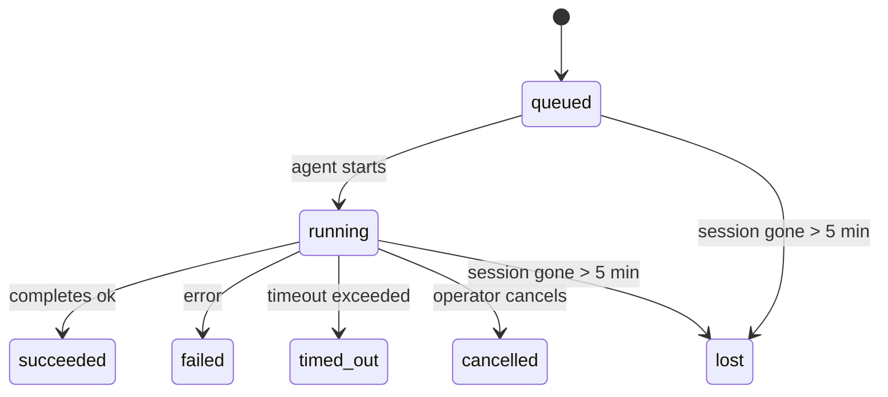

---
read_when:
    - Laufende oder kürzlich abgeschlossene Hintergrundarbeiten prüfen
    - Fehlerbehebung bei Zustellungsfehlern in getrennten Agentenläufen
    - Verstehen, wie Hintergrundausführungen mit Sitzungen, Cron und Heartbeat zusammenhängen
sidebarTitle: Background tasks
summary: Nachverfolgung von Hintergrundaufgaben für ACP-Ausführungen, Subagenten, isolierte Cron-Jobs und CLI-Operationen
title: Hintergrundaufgaben
x-i18n:
    generated_at: "2026-04-30T06:38:43Z"
    model: gpt-5.5
    provider: openai
    source_hash: 4bbf74f3aeea532738b56b83cd2e1a0a3734bfd453da6636b8be985a28ccc027
    source_path: automation/tasks.md
    workflow: 16
---

<Note>
Suchen Sie nach Zeitplanung? Unter [Automatisierung und Aufgaben](/de/automation) erfahren Sie, wie Sie den richtigen Mechanismus wählen. Diese Seite ist das Aktivitätsprotokoll für Hintergrundarbeit, nicht der Scheduler.
</Note>

Hintergrundaufgaben verfolgen Arbeit, die **außerhalb Ihrer Hauptunterhaltungssitzung** läuft: ACP-Ausführungen, Subagent-Starts, isolierte Cron-Job-Ausführungen und per CLI gestartete Vorgänge.

Aufgaben ersetzen **keine** Sitzungen, Cron-Jobs oder Heartbeats – sie sind das **Aktivitätsprotokoll**, das aufzeichnet, welche entkoppelte Arbeit wann stattgefunden hat und ob sie erfolgreich war.

<Note>
Nicht jeder Agentenlauf erstellt eine Aufgabe. Heartbeat-Turns und normaler interaktiver Chat tun dies nicht. Alle Cron-Ausführungen, ACP-Starts, Subagent-Starts und CLI-Agentenbefehle tun dies.
</Note>

## TL;DR

- Aufgaben sind **Datensätze**, keine Scheduler – Cron und Heartbeat entscheiden, _wann_ Arbeit ausgeführt wird; Aufgaben verfolgen, _was passiert ist_.
- ACP, Subagents, alle Cron-Jobs und CLI-Vorgänge erstellen Aufgaben. Heartbeat-Turns tun dies nicht.
- Jede Aufgabe durchläuft `queued → running → terminal` (succeeded, failed, timed_out, cancelled oder lost).
- Cron-Aufgaben bleiben aktiv, solange die Cron-Laufzeit den Job noch besitzt; wenn der
  In-Memory-Laufzeitzustand nicht mehr vorhanden ist, prüft die Aufgabenwartung zuerst den dauerhaften Cron-
  Ausführungsverlauf, bevor eine Aufgabe als verloren markiert wird.
- Abschluss ist Push-gesteuert: Entkoppelte Arbeit kann direkt benachrichtigen oder die
  anfordernde Sitzung/den Heartbeat aufwecken, wenn sie fertig ist, sodass Status-Polling-Schleifen
  normalerweise die falsche Form sind.
- Isolierte Cron-Läufe und Subagent-Abschlüsse bereinigen bestmöglich nachverfolgte Browser-Tabs/Prozesse für ihre untergeordnete Sitzung vor der abschließenden Bereinigungsbuchführung.
- Die isolierte Cron-Zustellung unterdrückt veraltete vorläufige übergeordnete Antworten, während nachgelagerte Subagent-Arbeit noch ausläuft, und bevorzugt die endgültige nachgelagerte Ausgabe, wenn diese vor der Zustellung eintrifft.
- Abschlussbenachrichtigungen werden direkt an einen Kanal zugestellt oder für den nächsten Heartbeat in die Warteschlange gestellt.
- `openclaw tasks list` zeigt alle Aufgaben; `openclaw tasks audit` macht Probleme sichtbar.
- Terminale Datensätze werden 7 Tage aufbewahrt und dann automatisch bereinigt.

## Schnellstart

<Tabs>
  <Tab title="Auflisten und filtern">
    ```bash
    # List all tasks (newest first)
    openclaw tasks list

    # Filter by runtime or status
    openclaw tasks list --runtime acp
    openclaw tasks list --status running
    ```

  </Tab>
  <Tab title="Untersuchen">
    ```bash
    # Show details for a specific task (by ID, run ID, or session key)
    openclaw tasks show <lookup>
    ```
  </Tab>
  <Tab title="Abbrechen und benachrichtigen">
    ```bash
    # Cancel a running task (kills the child session)
    openclaw tasks cancel <lookup>

    # Change notification policy for a task
    openclaw tasks notify <lookup> state_changes
    ```

  </Tab>
  <Tab title="Audit und Wartung">
    ```bash
    # Run a health audit
    openclaw tasks audit

    # Preview or apply maintenance
    openclaw tasks maintenance
    openclaw tasks maintenance --apply
    ```

  </Tab>
  <Tab title="Aufgabenablauf">
    ```bash
    # Inspect TaskFlow state
    openclaw tasks flow list
    openclaw tasks flow show <lookup>
    openclaw tasks flow cancel <lookup>
    ```
  </Tab>
</Tabs>

## Was eine Aufgabe erstellt

| Quelle                 | Laufzeittyp | Wann ein Aufgabendatensatz erstellt wird               | Standard-Benachrichtigungsrichtlinie |
| ---------------------- | ------------ | ------------------------------------------------------ | --------------------- |
| ACP-Hintergrundläufe    | `acp`        | Beim Starten einer untergeordneten ACP-Sitzung         | `done_only`           |
| Subagent-Orchestrierung | `subagent`   | Beim Starten eines Subagents über `sessions_spawn`     | `done_only`           |
| Cron-Jobs (alle Typen)  | `cron`       | Bei jeder Cron-Ausführung (Hauptsitzung und isoliert)  | `silent`              |
| CLI-Vorgänge            | `cli`        | `openclaw agent`-Befehle, die über das Gateway laufen  | `silent`              |
| Agenten-Medienjobs      | `cli`        | Sitzungsbasierte `video_generate`-Läufe                | `silent`              |

<AccordionGroup>
  <Accordion title="Benachrichtigungsstandards für Cron und Medien">
    Cron-Aufgaben in der Hauptsitzung verwenden standardmäßig die Benachrichtigungsrichtlinie `silent` – sie erstellen Datensätze zur Nachverfolgung, erzeugen aber keine Benachrichtigungen. Isolierte Cron-Aufgaben verwenden ebenfalls standardmäßig `silent`, sind aber sichtbarer, weil sie in ihrer eigenen Sitzung laufen.

    Sitzungsbasierte `video_generate`-Läufe verwenden ebenfalls die Benachrichtigungsrichtlinie `silent`. Sie erstellen weiterhin Aufgabendatensätze, aber der Abschluss wird als internes Aufwecken an die ursprüngliche Agentensitzung zurückgegeben, damit der Agent die Folgenachricht schreiben und das fertige Video selbst anhängen kann. Wenn Sie `tools.media.asyncCompletion.directSend` aktivieren, versuchen asynchrone Abschlüsse von `music_generate` und `video_generate` zuerst die direkte Kanalzustellung, bevor sie auf den Aufweckpfad der anfordernden Sitzung zurückfallen.

  </Accordion>
  <Accordion title="Leitplanke für gleichzeitige video_generate-Läufe">
    Solange eine sitzungsbasierte `video_generate`-Aufgabe noch aktiv ist, dient das Tool auch als Leitplanke: Wiederholte `video_generate`-Aufrufe in derselben Sitzung geben den aktiven Aufgabenstatus zurück, statt eine zweite gleichzeitige Generierung zu starten. Verwenden Sie `action: "status"`, wenn Sie eine explizite Fortschritts-/Statusabfrage von der Agentenseite wünschen.
  </Accordion>
  <Accordion title="Was keine Aufgaben erstellt">
    - Heartbeat-Turns – Hauptsitzung; siehe [Heartbeat](/de/gateway/heartbeat)
    - Normale interaktive Chat-Turns
    - Direkte `/command`-Antworten

  </Accordion>
</AccordionGroup>

## Aufgabenlebenszyklus



| Status      | Bedeutung                                                                  |
| ----------- | -------------------------------------------------------------------------- |
| `queued`    | Erstellt, wartet darauf, dass der Agent startet                            |
| `running`   | Agenten-Turn wird aktiv ausgeführt                                         |
| `succeeded` | Erfolgreich abgeschlossen                                                  |
| `failed`    | Mit einem Fehler abgeschlossen                                             |
| `timed_out` | Konfigurierte Zeitüberschreitung überschritten                             |
| `cancelled` | Vom Bediener über `openclaw tasks cancel` gestoppt                         |
| `lost`      | Die Laufzeit hat den maßgeblichen zugrunde liegenden Zustand nach einer Karenzzeit von 5 Minuten verloren |

Übergänge erfolgen automatisch – wenn der zugehörige Agentenlauf endet, wird der Aufgabenstatus entsprechend aktualisiert.

Der Abschluss des Agentenlaufs ist maßgeblich für aktive Aufgabendatensätze. Ein erfolgreicher entkoppelter Lauf wird als `succeeded` finalisiert, gewöhnliche Laufzeitfehler werden als `failed` finalisiert, und Timeout- oder Abbruchergebnisse werden als `timed_out` finalisiert. Wenn ein Bediener die Aufgabe bereits abgebrochen hat oder die Laufzeit bereits einen stärkeren terminalen Zustand wie `failed`, `timed_out` oder `lost` aufgezeichnet hat, stuft ein späteres Erfolgssignal diesen terminalen Status nicht zurück.

`lost` ist laufzeitbewusst:

- ACP-Aufgaben: Die Metadaten der zugrunde liegenden untergeordneten ACP-Sitzung sind verschwunden.
- Subagent-Aufgaben: Die zugrunde liegende untergeordnete Sitzung ist aus dem Ziel-Agentenspeicher verschwunden.
- Cron-Aufgaben: Die Cron-Laufzeit verfolgt den Job nicht mehr als aktiv, und der dauerhafte
  Cron-Ausführungsverlauf zeigt kein terminales Ergebnis für diesen Lauf. Offline-CLI-
  Audits behandeln ihren eigenen leeren In-Process-Cron-Laufzeitzustand nicht als maßgeblich.
- CLI-Aufgaben: Isolierte Aufgaben mit untergeordneter Sitzung verwenden die untergeordnete Sitzung; chatgestützte
  CLI-Aufgaben verwenden stattdessen den Live-Ausführungskontext, sodass verbleibende
  Kanal-/Gruppen-/Direktsitzungszeilen sie nicht aktiv halten. Gateway-gestützte
  `openclaw agent`-Läufe werden ebenfalls anhand ihres Laufergebnisses finalisiert, sodass abgeschlossene Läufe
  nicht aktiv bleiben, bis der Sweeper sie als `lost` markiert.

## Zustellung und Benachrichtigungen

Wenn eine Aufgabe einen terminalen Zustand erreicht, benachrichtigt OpenClaw Sie. Es gibt zwei Zustellpfade:

**Direkte Zustellung** – wenn die Aufgabe ein Kanalziel hat (den `requesterOrigin`), geht die Abschlussnachricht direkt an diesen Kanal (Telegram, Discord, Slack usw.). Bei Subagent-Abschlüssen bewahrt OpenClaw außerdem gebundene Thread-/Topic-Routings, sofern verfügbar, und kann ein fehlendes `to` / Konto aus der gespeicherten Route der anfordernden Sitzung (`lastChannel` / `lastTo` / `lastAccountId`) ergänzen, bevor die direkte Zustellung aufgegeben wird.

**Sitzungsbasierte Warteschlangenzustellung** – wenn die direkte Zustellung fehlschlägt oder kein Ursprung festgelegt ist, wird die Aktualisierung als Systemereignis in die Sitzung des Anforderers eingereiht und beim nächsten Heartbeat angezeigt.

<Tip>
Der Aufgabenabschluss löst ein sofortiges Heartbeat-Aufwecken aus, sodass Sie das Ergebnis schnell sehen – Sie müssen nicht auf den nächsten geplanten Heartbeat-Tick warten.
</Tip>

Das bedeutet: Der übliche Workflow ist Push-basiert. Starten Sie entkoppelte Arbeit einmal und lassen Sie dann die Laufzeit Sie beim Abschluss aufwecken oder benachrichtigen. Fragen Sie den Aufgabenstatus nur ab, wenn Sie Debugging, Eingriffe oder ein explizites Audit benötigen.

### Benachrichtigungsrichtlinien

Steuern Sie, wie viel Sie über jede Aufgabe erfahren:

| Richtlinie            | Was zugestellt wird                                                    |
| --------------------- | ----------------------------------------------------------------------- |
| `done_only` (Standard) | Nur terminaler Zustand (succeeded, failed usw.) – **dies ist der Standard** |
| `state_changes`       | Jeder Zustandsübergang und jede Fortschrittsaktualisierung              |
| `silent`              | Gar nichts                                                              |

Ändern Sie die Richtlinie, während eine Aufgabe läuft:

```bash
openclaw tasks notify <lookup> state_changes
```

## CLI-Referenz

<AccordionGroup>
  <Accordion title="tasks list">
    ```bash
    openclaw tasks list [--runtime <acp|subagent|cron|cli>] [--status <status>] [--json]
    ```

    Ausgabespalten: Aufgaben-ID, Art, Status, Zustellung, Lauf-ID, untergeordnete Sitzung, Zusammenfassung.

  </Accordion>
  <Accordion title="tasks show">
    ```bash
    openclaw tasks show <lookup>
    ```

    Das Such-Token akzeptiert eine Aufgaben-ID, Lauf-ID oder einen Sitzungsschlüssel. Zeigt den vollständigen Datensatz einschließlich Zeitangaben, Zustellzustand, Fehler und terminaler Zusammenfassung.

  </Accordion>
  <Accordion title="tasks cancel">
    ```bash
    openclaw tasks cancel <lookup>
    ```

    Bei ACP- und Subagent-Aufgaben beendet dies die untergeordnete Sitzung. Bei CLI-verfolgten Aufgaben wird der Abbruch in der Aufgabenregistrierung aufgezeichnet (es gibt kein separates Laufzeit-Handle für untergeordnete Sitzungen). Der Status wechselt zu `cancelled`, und eine Zustellbenachrichtigung wird gesendet, sofern zutreffend.

  </Accordion>
  <Accordion title="tasks notify">
    ```bash
    openclaw tasks notify <lookup> <done_only|state_changes|silent>
    ```
  </Accordion>
  <Accordion title="tasks audit">
    ```bash
    openclaw tasks audit [--json]
    ```

    Macht betriebliche Probleme sichtbar. Befunde erscheinen auch in `openclaw status`, wenn Probleme erkannt werden.

    | Ergebnis                  | Schweregrad | Auslöser                                                                                                                          |
    | ------------------------- | ----------- | --------------------------------------------------------------------------------------------------------------------------------- |
    | `stale_queued`            | Warnung     | Seit mehr als 10 Minuten in der Warteschlange                                                                                     |
    | `stale_running`           | Fehler      | Läuft seit mehr als 30 Minuten                                                                                                    |
    | `lost`                    | Warnung/Fehler | Runtime-gestützte Aufgabenverantwortung ist verschwunden; beibehaltene verlorene Aufgaben warnen bis `cleanupAfter` und werden dann zu Fehlern |
    | `delivery_failed`         | Warnung     | Zustellung fehlgeschlagen und Benachrichtigungsrichtlinie ist nicht `silent`                                                      |
    | `missing_cleanup`         | Warnung     | Terminale Aufgabe ohne Cleanup-Zeitstempel                                                                                        |
    | `inconsistent_timestamps` | Warnung     | Zeitachsenverletzung (zum Beispiel beendet, bevor sie gestartet wurde)                                                            |

  </Accordion>
  <Accordion title="tasks-Wartung">
    ```bash
    openclaw tasks maintenance [--json]
    openclaw tasks maintenance --apply [--json]
    ```

    Verwenden Sie dies, um Abgleich, Cleanup-Zeitstempel und Bereinigung für Aufgaben und den TaskFlow-Zustand vorab anzuzeigen oder anzuwenden.

    Der Abgleich ist runtime-bewusst:

    - ACP-/Subagent-Aufgaben prüfen ihre zugrunde liegende Kind-Sitzung.
    - Cron-Aufgaben prüfen, ob die Cron-Runtime den Job noch besitzt, und stellen dann den terminalen Status aus persistenten Cron-Ausführungsprotokollen/Job-Zuständen wieder her, bevor sie auf `lost` zurückfallen. Nur der Gateway-Prozess ist für die aktive Cron-Job-Menge im Arbeitsspeicher autoritativ; ein Offline-CLI-Audit verwendet dauerhafte Historie, markiert eine Cron-Aufgabe aber nicht allein deshalb als verloren, weil dieses lokale Set leer ist.
    - Chat-gestützte CLI-Aufgaben prüfen den besitzenden Live-Ausführungskontext, nicht nur die Chat-Sitzungszeile.

    Abschluss-Cleanup ist ebenfalls runtime-bewusst:

    - Subagent-Abschluss schließt nach bestem Aufwand nachverfolgte Browser-Tabs/Prozesse für die Kind-Sitzung, bevor das Ankündigungs-Cleanup fortgesetzt wird.
    - Isolierter Cron-Abschluss schließt nach bestem Aufwand nachverfolgte Browser-Tabs/Prozesse für die Cron-Sitzung, bevor die Ausführung vollständig abgebaut wird.
    - Isolierte Cron-Zustellung wartet bei Bedarf nachgelagerte Subagent-Nacharbeit ab und unterdrückt veralteten Bestätigungstext des Elternteils, statt ihn anzukündigen.
    - Subagent-Abschlusszustellung bevorzugt den neuesten sichtbaren Assistententext; wenn dieser leer ist, fällt sie auf bereinigten neuesten Tool-/toolResult-Text zurück, und reine Timeout-Tool-Call-Ausführungen können zu einer kurzen Zusammenfassung des Teilfortschritts zusammengefasst werden. Terminal fehlgeschlagene Ausführungen kündigen den Fehlerstatus an, ohne erfassten Antworttext erneut wiederzugeben.
    - Cleanup-Fehler verdecken nicht das tatsächliche Aufgabenergebnis.

  </Accordion>
  <Accordion title="tasks flow list | show | cancel">
    ```bash
    openclaw tasks flow list [--status <status>] [--json]
    openclaw tasks flow show <lookup> [--json]
    openclaw tasks flow cancel <lookup>
    ```

    Verwenden Sie diese Befehle, wenn der orchestrierende TaskFlow das ist, was Sie interessiert, und nicht ein einzelner Hintergrundaufgabeneintrag.

  </Accordion>
</AccordionGroup>

## Chat-Aufgabentafel (`/tasks`)

Verwenden Sie `/tasks` in jeder Chat-Sitzung, um Hintergrundaufgaben zu sehen, die mit dieser Sitzung verknüpft sind. Die Tafel zeigt aktive und kürzlich abgeschlossene Aufgaben mit Runtime, Status, Zeitangaben und Fortschritts- oder Fehlerdetails.

Wenn die aktuelle Sitzung keine sichtbaren verknüpften Aufgaben hat, fällt `/tasks` auf agent-lokale Aufgabenzähler zurück, sodass Sie weiterhin einen Überblick erhalten, ohne Details anderer Sitzungen preiszugeben.

Für das vollständige Betreiber-Ledger verwenden Sie die CLI: `openclaw tasks list`.

## Statusintegration (Aufgabendruck)

`openclaw status` enthält eine Aufgabenübersicht auf einen Blick:

```
Tasks: 3 queued · 2 running · 1 issues
```

Die Übersicht meldet:

- **aktiv** — Anzahl von `queued` + `running`
- **Fehler** — Anzahl von `failed` + `timed_out` + `lost`
- **byRuntime** — Aufschlüsselung nach `acp`, `subagent`, `cron`, `cli`

Sowohl `/status` als auch das Tool `session_status` verwenden einen cleanup-bewussten Aufgaben-Snapshot: Aktive Aufgaben werden bevorzugt, veraltete abgeschlossene Zeilen werden ausgeblendet, und jüngste Fehler erscheinen nur, wenn keine aktive Arbeit mehr verbleibt. So bleibt die Statuskarte auf das fokussiert, was gerade wichtig ist.

## Speicherung und Wartung

### Wo Aufgaben gespeichert werden

Aufgabeneinträge bleiben in SQLite gespeichert unter:

```
$OPENCLAW_STATE_DIR/tasks/runs.sqlite
```

Die Registry wird beim Gateway-Start in den Arbeitsspeicher geladen und synchronisiert Schreibvorgänge zur Dauerhaftigkeit über Neustarts hinweg nach SQLite.
Der Gateway hält das SQLite-Write-Ahead-Log begrenzt, indem er den standardmäßigen Autocheckpoint-Schwellenwert von SQLite sowie regelmäßige und beim Herunterfahren ausgeführte `TRUNCATE`-Checkpoints verwendet.

### Automatische Wartung

Ein Sweeper läuft alle **60 Sekunden** und erledigt vier Dinge:

<Steps>
  <Step title="Abgleich">
    Prüft, ob aktive Aufgaben noch eine autoritative Runtime-Grundlage haben. ACP-/Subagent-Aufgaben verwenden den Kind-Sitzungszustand, Cron-Aufgaben verwenden aktive Job-Verantwortung, und Chat-gestützte CLI-Aufgaben verwenden den besitzenden Ausführungskontext. Wenn diese zugrunde liegende Grundlage länger als 5 Minuten verschwunden ist, wird die Aufgabe als `lost` markiert.
  </Step>
  <Step title="ACP-Sitzungsreparatur">
    Schließt terminale oder verwaiste elternbesessene einmalige ACP-Sitzungen und schließt veraltete terminale oder verwaiste persistente ACP-Sitzungen nur, wenn keine aktive Konversationsbindung verbleibt.
  </Step>
  <Step title="Cleanup-Zeitstempel">
    Setzt einen `cleanupAfter`-Zeitstempel für terminale Aufgaben (endedAt + 7 Tage). Während der Aufbewahrung erscheinen verlorene Aufgaben im Audit weiterhin als Warnungen; nachdem `cleanupAfter` abläuft oder wenn Cleanup-Metadaten fehlen, sind sie Fehler.
  </Step>
  <Step title="Bereinigung">
    Löscht Einträge nach ihrem `cleanupAfter`-Datum.
  </Step>
</Steps>

<Note>
**Aufbewahrung:** Terminale Aufgabeneinträge werden **7 Tage** aufbewahrt und dann automatisch bereinigt. Keine Konfiguration erforderlich.
</Note>

## Wie Aufgaben mit anderen Systemen zusammenhängen

<AccordionGroup>
  <Accordion title="Aufgaben und TaskFlow">
    [TaskFlow](/de/automation/taskflow) ist die Flow-Orchestrierungsschicht über Hintergrundaufgaben. Ein einzelner Flow kann über seine Lebensdauer mehrere Aufgaben koordinieren, indem er verwaltete oder gespiegelte Synchronisationsmodi verwendet. Verwenden Sie `openclaw tasks`, um einzelne Aufgabeneinträge zu prüfen, und `openclaw tasks flow`, um den orchestrierenden Flow zu prüfen.

    Weitere Informationen finden Sie unter [TaskFlow](/de/automation/taskflow).

  </Accordion>
  <Accordion title="Aufgaben und Cron">
    Eine Cron-Job-**Definition** befindet sich in `~/.openclaw/cron/jobs.json`; der Runtime-Ausführungszustand liegt daneben in `~/.openclaw/cron/jobs-state.json`. **Jede** Cron-Ausführung erstellt einen Aufgabeneintrag — sowohl Hauptsitzung als auch isoliert. Cron-Aufgaben in Hauptsitzungen verwenden standardmäßig die Benachrichtigungsrichtlinie `silent`, sodass sie nachverfolgen, ohne Benachrichtigungen zu erzeugen.

    Siehe [Cron-Jobs](/de/automation/cron-jobs).

  </Accordion>
  <Accordion title="Aufgaben und Heartbeat">
    Heartbeat-Ausführungen sind Hauptsitzungs-Turns — sie erstellen keine Aufgabeneinträge. Wenn eine Aufgabe abgeschlossen wird, kann sie einen Heartbeat-Weckruf auslösen, sodass Sie das Ergebnis zeitnah sehen.

    Siehe [Heartbeat](/de/gateway/heartbeat).

  </Accordion>
  <Accordion title="Aufgaben und Sitzungen">
    Eine Aufgabe kann auf einen `childSessionKey` (wo die Arbeit läuft) und einen `requesterSessionKey` (wer sie gestartet hat) verweisen. Sitzungen sind Konversationskontext; Aufgaben sind Aktivitätsnachverfolgung darüber.
  </Accordion>
  <Accordion title="Aufgaben und Agent-Ausführungen">
    Die `runId` einer Aufgabe verweist auf die Agent-Ausführung, die die Arbeit erledigt. Agent-Lifecycle-Ereignisse (Start, Ende, Fehler) aktualisieren den Aufgabenstatus automatisch — Sie müssen den Lifecycle nicht manuell verwalten.
  </Accordion>
</AccordionGroup>

## Verwandt

- [Automatisierung und Aufgaben](/de/automation) — alle Automatisierungsmechanismen auf einen Blick
- [CLI: Aufgaben](/de/cli/tasks) — CLI-Befehlsreferenz
- [Heartbeat](/de/gateway/heartbeat) — regelmäßige Hauptsitzungs-Turns
- [Geplante Aufgaben](/de/automation/cron-jobs) — Hintergrundarbeit planen
- [TaskFlow](/de/automation/taskflow) — Flow-Orchestrierung über Aufgaben
