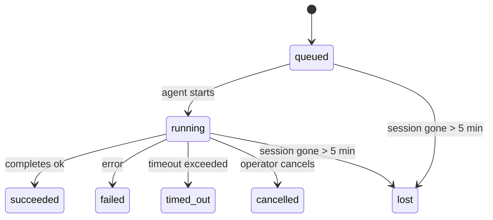

---
read_when:
    - Laufende oder kürzlich abgeschlossene Hintergrundaufgaben prüfen
    - Fehlersuche bei Zustellfehlern für getrennte Agentenläufe
    - Verstehen, wie Hintergrundausführungen mit Sitzungen, Cron und Heartbeat zusammenhängen
sidebarTitle: Background tasks
summary: Nachverfolgung von Hintergrundaufgaben für ACP-Ausführungen, Subagenten, isolierte Cron-Jobs und CLI-Vorgänge
title: Hintergrundaufgaben
x-i18n:
    generated_at: "2026-05-07T13:13:40Z"
    model: gpt-5.5
    provider: openai
    source_hash: a91a04ef6142e488d2fbc459d2c663afb93816a58fe9f52e0a51420703ea2d4d
    source_path: automation/tasks.md
    workflow: 16
---

<Note>
Suchen Sie nach Planung? Unter [Automatisierung und Aufgaben](/de/automation) finden Sie Hilfe zur Wahl des richtigen Mechanismus. Diese Seite ist das Aktivitätsprotokoll für Hintergrundarbeit, nicht der Scheduler.
</Note>

Hintergrundaufgaben verfolgen Arbeit, die **außerhalb Ihrer Hauptunterhaltungssitzung** läuft: ACP-Läufe, Subagent-Spawns, isolierte Cron-Job-Ausführungen und über die CLI gestartete Vorgänge.

Aufgaben ersetzen **keine** Sitzungen, Cron-Jobs oder Heartbeats - sie sind das **Aktivitätsprotokoll**, das aufzeichnet, welche entkoppelte Arbeit wann stattgefunden hat und ob sie erfolgreich war.

<Note>
Nicht jeder Agentenlauf erstellt eine Aufgabe. Heartbeat-Turns und normaler interaktiver Chat tun das nicht. Alle Cron-Ausführungen, ACP-Spawns, Subagent-Spawns und CLI-Agentenbefehle tun es.
</Note>

## TL;DR

- Aufgaben sind **Datensätze**, keine Scheduler - Cron und Heartbeat entscheiden, _wann_ Arbeit läuft, Aufgaben verfolgen, _was passiert ist_.
- ACP, Subagents, alle Cron-Jobs und CLI-Vorgänge erstellen Aufgaben. Heartbeat-Turns tun das nicht.
- Jede Aufgabe durchläuft `queued → running → terminal` (succeeded, failed, timed_out, cancelled oder lost).
- Cron-Aufgaben bleiben aktiv, solange die Cron-Laufzeit den Job noch besitzt; wenn der
  In-Memory-Laufzeitstatus verschwunden ist, prüft die Aufgabenwartung zuerst die dauerhafte Cron-
  Laufhistorie, bevor eine Aufgabe als verloren markiert wird.
- Der Abschluss ist Push-gesteuert: Entkoppelte Arbeit kann direkt benachrichtigen oder die
  anfordernde Sitzung/den Heartbeat wecken, wenn sie fertig ist; Status-Polling-Schleifen sind
  daher normalerweise die falsche Form.
- Isolierte Cron-Läufe und Subagent-Abschlüsse bereinigen nach bestem Aufwand nachverfolgte Browser-Tabs/Prozesse für ihre untergeordnete Sitzung, bevor die finale Bereinigungsbuchhaltung erfolgt.
- Isolierte Cron-Zustellung unterdrückt veraltete vorläufige Elternantworten, solange nachgelagerte Subagent-Arbeit noch ausläuft, und bevorzugt die finale nachgelagerte Ausgabe, wenn diese vor der Zustellung eintrifft.
- Abschlussbenachrichtigungen werden direkt an einen Kanal zugestellt oder für den nächsten Heartbeat in die Warteschlange gestellt.
- `openclaw tasks list` zeigt alle Aufgaben; `openclaw tasks audit` macht Probleme sichtbar.
- Terminale Datensätze werden 7 Tage aufbewahrt und danach automatisch bereinigt.

## Schnellstart

<Tabs>
  <Tab title="Auflisten und filtern">
    ```bash
    # List all tasks (newest first)
    openclaw tasks list

    # Filter by runtime or status
    openclaw tasks list --runtime acp
    openclaw tasks list --status running
    ```

  </Tab>
  <Tab title="Prüfen">
    ```bash
    # Show details for a specific task (by ID, run ID, or session key)
    openclaw tasks show <lookup>
    ```
  </Tab>
  <Tab title="Abbrechen und benachrichtigen">
    ```bash
    # Cancel a running task (kills the child session)
    openclaw tasks cancel <lookup>

    # Change notification policy for a task
    openclaw tasks notify <lookup> state_changes
    ```

  </Tab>
  <Tab title="Audit und Wartung">
    ```bash
    # Run a health audit
    openclaw tasks audit

    # Preview or apply maintenance
    openclaw tasks maintenance
    openclaw tasks maintenance --apply
    ```

  </Tab>
  <Tab title="TaskFlow">
    ```bash
    # Inspect TaskFlow state
    openclaw tasks flow list
    openclaw tasks flow show <lookup>
    openclaw tasks flow cancel <lookup>
    ```
  </Tab>
</Tabs>

## Was eine Aufgabe erstellt

| Quelle                 | Laufzeittyp | Wann ein Aufgabendatensatz erstellt wird               | Standard-Benachrichtigungsrichtlinie |
| ---------------------- | ------------ | ------------------------------------------------------ | ------------------------------------ |
| ACP-Hintergrundläufe   | `acp`        | Beim Starten einer untergeordneten ACP-Sitzung         | `done_only`                          |
| Subagent-Orchestrierung | `subagent`   | Beim Starten eines Subagents über `sessions_spawn`     | `done_only`                          |
| Cron-Jobs (alle Typen) | `cron`       | Jede Cron-Ausführung (Hauptsitzung und isoliert)       | `silent`                             |
| CLI-Vorgänge           | `cli`        | `openclaw agent`-Befehle, die über das Gateway laufen  | `silent`                             |
| Agenten-Medienjobs     | `cli`        | Sitzungsgebundene `music_generate`/`video_generate`-Läufe | `silent`                          |

<AccordionGroup>
  <Accordion title="Benachrichtigungsstandards für Cron und Medien">
    Cron-Aufgaben in der Hauptsitzung verwenden standardmäßig die Benachrichtigungsrichtlinie `silent` - sie erstellen Datensätze zur Nachverfolgung, erzeugen aber keine Benachrichtigungen. Isolierte Cron-Aufgaben verwenden ebenfalls standardmäßig `silent`, sind aber sichtbarer, weil sie in ihrer eigenen Sitzung laufen.

    Sitzungsgebundene `music_generate`- und `video_generate`-Läufe verwenden ebenfalls die Benachrichtigungsrichtlinie `silent`. Sie erstellen trotzdem Aufgabendatensätze, aber der Abschluss wird als internes Wake an die ursprüngliche Agentensitzung zurückgegeben, damit der Agent die Folgenachricht schreiben und die fertigen Medien selbst anhängen kann. Gruppen-/Kanalabschlüsse folgen der normalen Richtlinie für sichtbare Antworten, sodass der Agent das Nachrichten-Tool verwendet, wenn die Quellzustellung es erfordert. Wenn der Abschlussagent in einer reinen Tool-Route keinen Nachweis für die Zustellung per Nachrichten-Tool erzeugt, sendet OpenClaw den Abschluss-Fallback direkt an den ursprünglichen Kanal, statt die Medien privat zu lassen.

  </Accordion>
  <Accordion title="Schutzregel für gleichzeitiges video_generate">
    Solange eine sitzungsgebundene `video_generate`-Aufgabe noch aktiv ist, dient das Tool auch als Schutzregel: Wiederholte `video_generate`-Aufrufe in derselben Sitzung geben den Status der aktiven Aufgabe zurück, statt eine zweite gleichzeitige Generierung zu starten. Verwenden Sie `action: "status"`, wenn Sie agentenseitig eine explizite Fortschritts-/Statusabfrage wünschen.
  </Accordion>
  <Accordion title="Was keine Aufgaben erstellt">
    - Heartbeat-Turns - Hauptsitzung; siehe [Heartbeat](/de/gateway/heartbeat)
    - Normale interaktive Chat-Turns
    - Direkte `/command`-Antworten

  </Accordion>
</AccordionGroup>

## Aufgabenlebenszyklus



| Status      | Bedeutung                                                                  |
| ----------- | -------------------------------------------------------------------------- |
| `queued`    | Erstellt, wartet darauf, dass der Agent startet                            |
| `running`   | Agenten-Turn wird aktiv ausgeführt                                         |
| `succeeded` | Erfolgreich abgeschlossen                                                  |
| `failed`    | Mit einem Fehler abgeschlossen                                             |
| `timed_out` | Das konfigurierte Zeitlimit wurde überschritten                            |
| `cancelled` | Vom Operator über `openclaw tasks cancel` gestoppt                         |
| `lost`      | Die Laufzeit hat den autoritativen Hintergrundstatus nach einer 5-minütigen Karenzzeit verloren |

Übergänge erfolgen automatisch - wenn der zugehörige Agentenlauf endet, wird der Aufgabenstatus entsprechend aktualisiert.

Der Abschluss des Agentenlaufs ist für aktive Aufgabendatensätze autoritativ. Ein erfolgreicher entkoppelter Lauf wird als `succeeded` finalisiert, gewöhnliche Lauffehler als `failed`, und Zeitlimit- oder Abbruchergebnisse als `timed_out`. Wenn ein Operator die Aufgabe bereits abgebrochen hat oder die Laufzeit bereits einen stärkeren terminalen Status wie `failed`, `timed_out` oder `lost` aufgezeichnet hat, stuft ein späteres Erfolgssignal diesen terminalen Status nicht herab.

`lost` ist laufzeitbewusst:

- ACP-Aufgaben: Die Metadaten der zugrunde liegenden untergeordneten ACP-Sitzung sind verschwunden.
- Subagent-Aufgaben: Die zugrunde liegende untergeordnete Sitzung ist aus dem Ziel-Agentenspeicher verschwunden.
- Cron-Aufgaben: Die Cron-Laufzeit verfolgt den Job nicht mehr als aktiv und die dauerhafte
  Cron-Laufhistorie zeigt kein terminales Ergebnis für diesen Lauf. Offline-CLI-
  Audit behandelt seinen eigenen leeren In-Process-Cron-Laufzeitstatus nicht als autoritativ.
- CLI-Aufgaben: Aufgaben mit Lauf-ID/Quell-ID verwenden den Live-Laufkontext, sodass
  verbleibende Zeilen für untergeordnete Sitzungen oder Chat-Sitzungen sie nicht aktiv halten, nachdem der
  Gateway-eigene Lauf verschwunden ist. Legacy-CLI-Aufgaben ohne Laufidentität fallen weiterhin
  auf die untergeordnete Sitzung zurück. Gateway-gestützte `openclaw agent`-Läufe werden ebenfalls
  aus ihrem Laufergebnis finalisiert, sodass abgeschlossene Läufe nicht aktiv bleiben, bis der Sweeper
  sie als `lost` markiert.

## Zustellung und Benachrichtigungen

Wenn eine Aufgabe einen terminalen Status erreicht, benachrichtigt OpenClaw Sie. Es gibt zwei Zustellwege:

**Direkte Zustellung** - wenn die Aufgabe ein Kanalziel hat (den `requesterOrigin`), geht die Abschlussnachricht direkt an diesen Kanal (Telegram, Discord, Slack usw.). Bei Subagent-Abschlüssen behält OpenClaw außerdem die gebundene Thread-/Topic-Routing-Information bei, sofern verfügbar, und kann ein fehlendes `to` / Konto aus der gespeicherten Route der anfordernden Sitzung (`lastChannel` / `lastTo` / `lastAccountId`) ergänzen, bevor die direkte Zustellung aufgegeben wird.

**Sitzungswarteschlangen-Zustellung** - wenn die direkte Zustellung fehlschlägt oder kein Ursprung gesetzt ist, wird die Aktualisierung als Systemereignis in der Sitzung des Anfordernden in die Warteschlange gestellt und erscheint beim nächsten Heartbeat.

<Tip>
Der Aufgabenabschluss löst sofort ein Heartbeat-Wake aus, damit Sie das Ergebnis schnell sehen - Sie müssen nicht bis zum nächsten geplanten Heartbeat-Tick warten.
</Tip>

Das bedeutet, der übliche Workflow ist Push-basiert: Starten Sie entkoppelte Arbeit einmal und lassen Sie die Laufzeit Sie beim Abschluss wecken oder benachrichtigen. Fragen Sie den Aufgabenstatus nur ab, wenn Sie Debugging, Eingriffe oder ein explizites Audit benötigen.

### Benachrichtigungsrichtlinien

Steuern Sie, wie viel Sie über jede Aufgabe hören:

| Richtlinie            | Was zugestellt wird                                                   |
| --------------------- | --------------------------------------------------------------------- |
| `done_only` (Standard) | Nur terminaler Status (succeeded, failed usw.) - **dies ist der Standard** |
| `state_changes`       | Jeder Statusübergang und jede Fortschrittsaktualisierung              |
| `silent`              | Gar nichts                                                            |

Ändern Sie die Richtlinie, während eine Aufgabe läuft:

```bash
openclaw tasks notify <lookup> state_changes
```

## CLI-Referenz

<AccordionGroup>
  <Accordion title="tasks list">
    ```bash
    openclaw tasks list [--runtime <acp|subagent|cron|cli>] [--status <status>] [--json]
    ```

    Ausgabespalten: Aufgaben-ID, Art, Status, Zustellung, Lauf-ID, untergeordnete Sitzung, Zusammenfassung.

  </Accordion>
  <Accordion title="tasks show">
    ```bash
    openclaw tasks show <lookup>
    ```

    Das Suchtoken akzeptiert eine Aufgaben-ID, Lauf-ID oder einen Sitzungsschlüssel. Zeigt den vollständigen Datensatz einschließlich Zeitangaben, Zustellstatus, Fehler und terminaler Zusammenfassung.

  </Accordion>
  <Accordion title="tasks cancel">
    ```bash
    openclaw tasks cancel <lookup>
    ```

    Bei ACP- und Subagent-Aufgaben beendet dies die untergeordnete Sitzung. Bei per CLI verfolgten Aufgaben wird der Abbruch in der Aufgabenregistrierung aufgezeichnet (es gibt kein separates Handle der untergeordneten Laufzeit). Der Status wechselt zu `cancelled`, und eine Zustellbenachrichtigung wird gesendet, sofern zutreffend.

  </Accordion>
  <Accordion title="tasks notify">
    ```bash
    openclaw tasks notify <lookup> <done_only|state_changes|silent>
    ```
  </Accordion>
  <Accordion title="tasks audit">
    ```bash
    openclaw tasks audit [--json]
    ```

    Macht betriebliche Probleme sichtbar. Befunde erscheinen außerdem in `openclaw status`, wenn Probleme erkannt werden.

    | Ergebnis                  | Schweregrad | Auslöser                                                                                                            |
    | ------------------------- | ----------- | ------------------------------------------------------------------------------------------------------------------- |
    | `stale_queued`            | Warnung     | Seit mehr als 10 Minuten in der Warteschlange                                                                       |
    | `stale_running`           | Fehler      | Läuft seit mehr als 30 Minuten                                                                                      |
    | `lost`                    | Warnung/Fehler | Runtime-gestützte Aufgabeninhaberschaft ist verschwunden; beibehaltene verlorene Aufgaben warnen bis `cleanupAfter` und werden dann zu Fehlern |
    | `delivery_failed`         | Warnung     | Zustellung ist fehlgeschlagen und die Benachrichtigungsrichtlinie ist nicht `silent`                                |
    | `missing_cleanup`         | Warnung     | Terminale Aufgabe ohne Cleanup-Zeitstempel                                                                         |
    | `inconsistent_timestamps` | Warnung     | Verletzung der Zeitleiste (zum Beispiel beendet, bevor sie gestartet wurde)                                         |

  </Accordion>
  <Accordion title="tasks maintenance">
    ```bash
    openclaw tasks maintenance [--json]
    openclaw tasks maintenance --apply [--json]
    ```

    Verwenden Sie dies, um Abgleich, Cleanup-Stempelung und Bereinigung für Aufgaben und Task Flow-Zustand in der Vorschau anzuzeigen oder anzuwenden.

    Der Abgleich ist Runtime-bewusst:

    - ACP-/Subagent-Aufgaben prüfen ihre zugrunde liegende untergeordnete Sitzung.
    - Subagent-Aufgaben, deren untergeordnete Sitzung einen Neustart-Wiederherstellungs-Tombstone hat, werden als verloren markiert, statt als wiederherstellbare zugrunde liegende Sitzungen behandelt zu werden.
    - Cron-Aufgaben prüfen, ob die Cron-Runtime den Job noch besitzt, und stellen dann den terminalen Status aus persistierten Cron-Ausführungsprotokollen/Job-Zustand wieder her, bevor sie auf `lost` zurückfallen. Nur der Gateway-Prozess ist maßgeblich für die speicherinterne Menge aktiver Cron-Jobs; die Offline-CLI-Prüfung verwendet dauerhafte Historie, markiert eine Cron-Aufgabe aber nicht allein deshalb als verloren, weil dieses lokale Set leer ist.
    - CLI-Aufgaben mit Ausführungsidentität prüfen den besitzenden Live-Ausführungskontext, nicht nur untergeordnete Sitzungs- oder Chat-Sitzungszeilen.

    Abschluss-Cleanup ist ebenfalls Runtime-bewusst:

    - Subagent-Abschluss schließt nach bestem Aufwand nachverfolgte Browser-Tabs/Prozesse für die untergeordnete Sitzung, bevor das Ankündigungs-Cleanup fortgesetzt wird.
    - Abschluss isolierter Cron-Ausführungen schließt nach bestem Aufwand nachverfolgte Browser-Tabs/Prozesse für die Cron-Sitzung, bevor die Ausführung vollständig beendet wird.
    - Isolierte Cron-Zustellung wartet bei Bedarf auf nachgelagerte Subagent-Folgearbeiten und unterdrückt veralteten übergeordneten Bestätigungstext, statt ihn anzukündigen.
    - Subagent-Abschlusszustellung bevorzugt den neuesten sichtbaren Assistententext; wenn dieser leer ist, fällt sie auf bereinigten neuesten Tool-/toolResult-Text zurück, und reine Timeout-Tool-Call-Ausführungen können zu einer kurzen Teilfortschrittszusammenfassung zusammengefasst werden. Terminal fehlgeschlagene Ausführungen kündigen den Fehlerstatus an, ohne erfassten Antworttext erneut wiederzugeben.
    - Cleanup-Fehler verdecken nicht das eigentliche Aufgabenergebnis.

  </Accordion>
  <Accordion title="tasks flow list | show | cancel">
    ```bash
    openclaw tasks flow list [--status <status>] [--json]
    openclaw tasks flow show <lookup> [--json]
    openclaw tasks flow cancel <lookup>
    ```

    Verwenden Sie diese Befehle, wenn Ihnen der orchestrierende Task Flow wichtiger ist als ein einzelner Hintergrundaufgabendatensatz.

  </Accordion>
</AccordionGroup>

## Chat-Aufgabenboard (`/tasks`)

Verwenden Sie `/tasks` in jeder Chat-Sitzung, um Hintergrundaufgaben zu sehen, die mit dieser Sitzung verknüpft sind. Das Board zeigt aktive und kürzlich abgeschlossene Aufgaben mit Runtime, Status, Zeitangaben sowie Fortschritts- oder Fehlerdetails.

Wenn die aktuelle Sitzung keine sichtbaren verknüpften Aufgaben hat, greift `/tasks` auf agentenlokale Aufgabenzählungen zurück, sodass Sie weiterhin eine Übersicht erhalten, ohne Details anderer Sitzungen offenzulegen.

Für das vollständige Betreiberprotokoll verwenden Sie die CLI: `openclaw tasks list`.

## Statusintegration (Aufgabendruck)

`openclaw status` enthält eine Aufgabenübersicht auf einen Blick:

```
Tasks: 3 queued · 2 running · 1 issues
```

Die Zusammenfassung meldet:

- **active** - Anzahl von `queued` + `running`
- **failures** - Anzahl von `failed` + `timed_out` + `lost`
- **byRuntime** - Aufschlüsselung nach `acp`, `subagent`, `cron`, `cli`

Sowohl `/status` als auch das Tool `session_status` verwenden einen Cleanup-bewussten Aufgaben-Snapshot: Aktive Aufgaben werden bevorzugt, veraltete abgeschlossene Zeilen werden ausgeblendet, und aktuelle Fehler werden nur angezeigt, wenn keine aktive Arbeit mehr verbleibt. Dadurch bleibt die Statuskarte auf das konzentriert, was gerade wichtig ist.

## Speicherung und Wartung

### Wo Aufgaben gespeichert werden

Aufgabendatensätze bleiben in SQLite hier bestehen:

```
$OPENCLAW_STATE_DIR/tasks/runs.sqlite
```

Die Registry wird beim Start des Gateway in den Speicher geladen und synchronisiert Schreibvorgänge zur Dauerhaftigkeit über Neustarts hinweg mit SQLite.
Der Gateway hält das SQLite-Write-Ahead-Log begrenzt, indem er den standardmäßigen Autocheckpoint-Schwellenwert von SQLite plus periodische und Shutdown-`TRUNCATE`-Checkpoints verwendet.

### Automatische Wartung

Ein Sweeper läuft alle **60 Sekunden** und erledigt vier Dinge:

<Steps>
  <Step title="Abgleich">
    Prüft, ob aktive Aufgaben noch maßgebliche Runtime-Unterstützung haben. ACP-/Subagent-Aufgaben verwenden den Zustand der untergeordneten Sitzung, Cron-Aufgaben verwenden Active-Job-Inhaberschaft, und CLI-Aufgaben mit Ausführungsidentität verwenden den besitzenden Ausführungskontext. Wenn dieser zugrunde liegende Zustand länger als 5 Minuten verschwunden ist, wird die Aufgabe als `lost` markiert.
  </Step>
  <Step title="ACP-Sitzungsreparatur">
    Schließt terminale oder verwaiste übergeordnet besessene einmalige ACP-Sitzungen und schließt veraltete terminale oder verwaiste persistente ACP-Sitzungen nur, wenn keine aktive Konversationsbindung verbleibt.
  </Step>
  <Step title="Cleanup-Stempelung">
    Setzt einen `cleanupAfter`-Zeitstempel für terminale Aufgaben (endedAt + 7 Tage). Während der Aufbewahrung erscheinen verlorene Aufgaben weiterhin als Warnungen in der Prüfung; nach Ablauf von `cleanupAfter` oder wenn Cleanup-Metadaten fehlen, sind sie Fehler.
  </Step>
  <Step title="Bereinigung">
    Löscht Datensätze nach ihrem `cleanupAfter`-Datum.
  </Step>
</Steps>

<Note>
**Aufbewahrung:** Terminale Aufgabendatensätze werden **7 Tage** aufbewahrt und dann automatisch bereinigt. Keine Konfiguration erforderlich.
</Note>

## Wie Aufgaben mit anderen Systemen zusammenhängen

<AccordionGroup>
  <Accordion title="Aufgaben und Task Flow">
    [Task Flow](/de/automation/taskflow) ist die Flow-Orchestrierungsschicht über Hintergrundaufgaben. Ein einzelner Flow kann während seiner Lebensdauer mehrere Aufgaben koordinieren, indem er verwaltete oder gespiegelte Synchronisierungsmodi verwendet. Verwenden Sie `openclaw tasks`, um einzelne Aufgabendatensätze zu prüfen, und `openclaw tasks flow`, um den orchestrierenden Flow zu prüfen.

    Weitere Details finden Sie unter [Task Flow](/de/automation/taskflow).

  </Accordion>
  <Accordion title="Aufgaben und Cron">
    Eine Cron-Job-**Definition** liegt in `~/.openclaw/cron/jobs.json`; der Runtime-Ausführungszustand liegt daneben in `~/.openclaw/cron/jobs-state.json`. **Jede** Cron-Ausführung erstellt einen Aufgabendatensatz - sowohl Hauptsitzungs- als auch isolierte Ausführungen. Cron-Aufgaben der Hauptsitzung verwenden standardmäßig die Benachrichtigungsrichtlinie `silent`, sodass sie nachverfolgt werden, ohne Benachrichtigungen zu erzeugen.

    Siehe [Cron-Jobs](/de/automation/cron-jobs).

  </Accordion>
  <Accordion title="Aufgaben und Heartbeat">
    Heartbeat-Ausführungen sind Hauptsitzungs-Turns - sie erstellen keine Aufgabendatensätze. Wenn eine Aufgabe abgeschlossen wird, kann sie ein Heartbeat-Aufwecken auslösen, damit Sie das Ergebnis zeitnah sehen.

    Siehe [Heartbeat](/de/gateway/heartbeat).

  </Accordion>
  <Accordion title="Aufgaben und Sitzungen">
    Eine Aufgabe kann auf einen `childSessionKey` (wo die Arbeit läuft) und einen `requesterSessionKey` (wer sie gestartet hat) verweisen. Sitzungen sind Konversationskontext; Aufgaben sind die Aktivitätsverfolgung darüber.
  </Accordion>
  <Accordion title="Aufgaben und Agentenausführungen">
    Die `runId` einer Aufgabe verweist auf die Agentenausführung, die die Arbeit erledigt. Agenten-Lebenszyklusereignisse (Start, Ende, Fehler) aktualisieren den Aufgabenstatus automatisch - Sie müssen den Lebenszyklus nicht manuell verwalten.
  </Accordion>
</AccordionGroup>

## Verwandt

- [Automatisierung und Aufgaben](/de/automation) - alle Automatisierungsmechanismen auf einen Blick
- [CLI: Aufgaben](/de/cli/tasks) - CLI-Befehlsreferenz
- [Heartbeat](/de/gateway/heartbeat) - periodische Hauptsitzungs-Turns
- [Geplante Aufgaben](/de/automation/cron-jobs) - Hintergrundarbeit planen
- [Task Flow](/de/automation/taskflow) - Flow-Orchestrierung über Aufgaben
