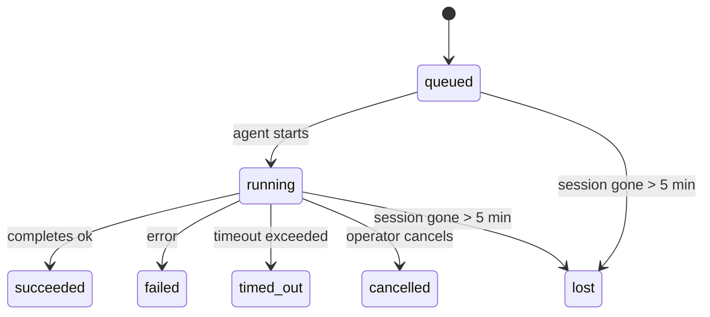

---
read_when:
    - Prüfen von Hintergrundarbeit, die gerade ausgeführt wird oder kürzlich abgeschlossen wurde
    - Debuggen von Zustellungsfehlern bei losgelösten Agent-Ausführungen
    - Verstehen, wie Hintergrundausführungen mit Sitzungen, Cron und Heartbeat zusammenhängen
summary: Nachverfolgung von Hintergrundaufgaben für ACP-Ausführungen, Subagents, isolierte Cronjobs und CLI-Vorgänge
title: Hintergrundaufgaben
x-i18n:
    generated_at: "2026-04-06T03:06:52Z"
    model: gpt-5.4
    provider: openai
    source_hash: 2f56c1ac23237907a090c69c920c09578a2f56f5d8bf750c7f2136c603c8a8ff
    source_path: automation/tasks.md
    workflow: 15
---

# Hintergrundaufgaben

> **Sie suchen nach Planung?** Unter [Automatisierung & Aufgaben](/de/automation) finden Sie Hilfe bei der Auswahl des richtigen Mechanismus. Diese Seite behandelt die **Nachverfolgung** von Hintergrundarbeit, nicht deren Planung.

Hintergrundaufgaben verfolgen Arbeit, die **außerhalb Ihrer Haupt-Konversationssitzung** ausgeführt wird:
ACP-Ausführungen, Subagent-Starts, isolierte Cronjob-Ausführungen und über die CLI gestartete Vorgänge.

Aufgaben **ersetzen** keine Sitzungen, Cronjobs oder Heartbeats — sie sind das **Aktivitätsprotokoll**, das aufzeichnet, welche losgelöste Arbeit stattgefunden hat, wann sie stattgefunden hat und ob sie erfolgreich war.

<Note>
Nicht jede Agent-Ausführung erzeugt eine Aufgabe. Heartbeat-Durchläufe und normaler interaktiver Chat tun das nicht. Alle Cron-Ausführungen, ACP-Starts, Subagent-Starts und CLI-Agent-Befehle tun das.
</Note>

## Kurzfassung

- Aufgaben sind **Einträge**, keine Planer — Cron und Heartbeat entscheiden, _wann_ Arbeit ausgeführt wird, Aufgaben verfolgen, _was passiert ist_.
- ACP, Subagents, alle Cronjobs und CLI-Vorgänge erzeugen Aufgaben. Heartbeat-Durchläufe nicht.
- Jede Aufgabe durchläuft `queued → running → terminal` (succeeded, failed, timed_out, cancelled oder lost).
- Cron-Aufgaben bleiben aktiv, solange die Cron-Laufzeitumgebung den Job noch besitzt; chatgestützte CLI-Aufgaben bleiben nur aktiv, solange ihr besitzender Ausführungskontext noch aktiv ist.
- Der Abschluss ist pushbasiert: Losgelöste Arbeit kann direkt benachrichtigen oder die anfordernde Sitzung/den Heartbeat wecken, wenn sie abgeschlossen ist; Status-Polling-Schleifen sind daher meist die falsche Form.
- Isolierte Cron-Ausführungen und Subagent-Abschlüsse räumen nach bestem Bemühen nachverfolgte Browser-Tabs/Prozesse für ihre untergeordnete Sitzung vor der abschließenden Bereinigung der Buchführung auf.
- Die Zustellung für isolierte Cron-Ausführungen unterdrückt veraltete vorläufige Antworten des übergeordneten Prozesses, während nachgeordnete Subagent-Arbeit noch ausläuft, und bevorzugt die endgültige Ausgabe der Nachfahren, wenn diese vor der Zustellung eintrifft.
- Abschlussbenachrichtigungen werden direkt an einen Kanal zugestellt oder für den nächsten Heartbeat in die Warteschlange gestellt.
- `openclaw tasks list` zeigt alle Aufgaben; `openclaw tasks audit` macht Probleme sichtbar.
- Terminal-Einträge werden 7 Tage aufbewahrt und dann automatisch entfernt.

## Schnellstart

```bash
# Alle Aufgaben auflisten (neueste zuerst)
openclaw tasks list

# Nach Laufzeitumgebung oder Status filtern
openclaw tasks list --runtime acp
openclaw tasks list --status running

# Details für eine bestimmte Aufgabe anzeigen (nach ID, Run-ID oder Sitzungsschlüssel)
openclaw tasks show <lookup>

# Eine laufende Aufgabe abbrechen (beendet die untergeordnete Sitzung)
openclaw tasks cancel <lookup>

# Benachrichtigungsrichtlinie für eine Aufgabe ändern
openclaw tasks notify <lookup> state_changes

# Integritätsprüfung ausführen
openclaw tasks audit

# Wartung in der Vorschau anzeigen oder anwenden
openclaw tasks maintenance
openclaw tasks maintenance --apply

# TaskFlow-Status prüfen
openclaw tasks flow list
openclaw tasks flow show <lookup>
openclaw tasks flow cancel <lookup>
```

## Was eine Aufgabe erzeugt

| Quelle                 | Laufzeittyp | Wann ein Aufgabeneintrag erzeugt wird                 | Standard-Benachrichtigungsrichtlinie |
| ---------------------- | ----------- | ----------------------------------------------------- | ------------------------------------ |
| ACP-Hintergrundläufe   | `acp`       | Beim Starten einer untergeordneten ACP-Sitzung        | `done_only`                          |
| Subagent-Orchestrierung | `subagent` | Beim Starten eines Subagents über `sessions_spawn`    | `done_only`                          |
| Cronjobs (alle Typen)  | `cron`      | Bei jeder Cron-Ausführung (Hauptsitzung und isoliert) | `silent`                             |
| CLI-Vorgänge           | `cli`       | `openclaw agent`-Befehle, die über das Gateway laufen | `silent`                             |
| Agent-Mediajobs        | `cli`       | Sitzungsgebundene `video_generate`-Ausführungen       | `silent`                             |

Cron-Aufgaben in der Hauptsitzung verwenden standardmäßig die Benachrichtigungsrichtlinie `silent` — sie erzeugen Einträge zur Nachverfolgung, aber keine Benachrichtigungen. Isolierte Cron-Aufgaben verwenden ebenfalls standardmäßig `silent`, sind aber sichtbarer, weil sie in ihrer eigenen Sitzung laufen.

Sitzungsgebundene `video_generate`-Ausführungen verwenden ebenfalls die Benachrichtigungsrichtlinie `silent`. Sie erzeugen weiterhin Aufgabeneinträge, aber der Abschluss wird als internes Wecksignal an die ursprüngliche Agent-Sitzung zurückgegeben, damit der Agent die Folgenachricht schreiben und das fertige Video selbst anhängen kann. Wenn Sie `tools.media.asyncCompletion.directSend` aktivieren, versuchen asynchrone `music_generate`- und `video_generate`-Abschlüsse zuerst die direkte Kanalzustellung, bevor sie auf den Weckpfad der anfordernden Sitzung zurückfallen.

Während eine sitzungsgebundene `video_generate`-Aufgabe noch aktiv ist, fungiert das Tool auch als Schutzmechanismus: Wiederholte `video_generate`-Aufrufe in derselben Sitzung geben den Status der aktiven Aufgabe zurück, anstatt eine zweite gleichzeitige Generierung zu starten. Verwenden Sie `action: "status"`, wenn Sie auf Agent-Seite eine explizite Fortschritts-/Statusabfrage möchten.

**Was keine Aufgaben erzeugt:**

- Heartbeat-Durchläufe — Hauptsitzung; siehe [Heartbeat](/de/gateway/heartbeat)
- Normale interaktive Chat-Durchläufe
- Direkte `/command`-Antworten

## Aufgabenlebenszyklus



| Status      | Bedeutung                                                                 |
| ----------- | ------------------------------------------------------------------------- |
| `queued`    | Erzeugt, wartet auf den Start des Agenten                                 |
| `running`   | Der Agent-Durchlauf wird aktiv ausgeführt                                 |
| `succeeded` | Erfolgreich abgeschlossen                                                 |
| `failed`    | Mit einem Fehler abgeschlossen                                            |
| `timed_out` | Das konfigurierte Timeout wurde überschritten                             |
| `cancelled` | Vom Operator über `openclaw tasks cancel` gestoppt                        |
| `lost`      | Die Laufzeitumgebung hat nach einer Kulanzfrist von 5 Minuten den maßgeblichen Hintergrundstatus verloren |

Übergänge erfolgen automatisch — wenn die zugehörige Agent-Ausführung endet, wird der Aufgabenstatus entsprechend aktualisiert.

`lost` ist laufzeitbewusst:

- ACP-Aufgaben: Metadaten der zugehörigen ACP-Kindsitzung sind verschwunden.
- Subagent-Aufgaben: Die zugehörige Kindsitzung ist aus dem Agent-Speicher des Ziels verschwunden.
- Cron-Aufgaben: Die Cron-Laufzeitumgebung führt den Job nicht mehr als aktiv.
- CLI-Aufgaben: Isolierte Kind-Sitzungsaufgaben verwenden die Kind-Sitzung; chatgestützte CLI-Aufgaben verwenden stattdessen den Live-Ausführungskontext, sodass verbleibende Kanal-/Gruppen-/Direktsitzungszeilen sie nicht aktiv halten.

## Zustellung und Benachrichtigungen

Wenn eine Aufgabe einen Terminal-Status erreicht, benachrichtigt OpenClaw Sie. Es gibt zwei Zustellpfade:

**Direkte Zustellung** — wenn die Aufgabe ein Kanalziel hat (`requesterOrigin`), geht die Abschlussnachricht direkt an diesen Kanal (Telegram, Discord, Slack usw.). Bei Subagent-Abschlüssen bewahrt OpenClaw außerdem die gebundene Thread-/Themenweiterleitung, wenn verfügbar, und kann ein fehlendes `to` / Konto aus der gespeicherten Route der anfordernden Sitzung (`lastChannel` / `lastTo` / `lastAccountId`) ergänzen, bevor die direkte Zustellung aufgegeben wird.

**Sitzungsgebundene Warteschlangenzustellung** — wenn die direkte Zustellung fehlschlägt oder kein Ursprung gesetzt ist, wird das Update als Systemereignis in die Warteschlange der anfordernden Sitzung gestellt und beim nächsten Heartbeat angezeigt.

<Tip>
Der Abschluss einer Aufgabe löst ein sofortiges Heartbeat-Wecksignal aus, damit Sie das Ergebnis schnell sehen — Sie müssen nicht bis zum nächsten geplanten Heartbeat-Takt warten.
</Tip>

Das bedeutet, dass der übliche Arbeitsablauf pushbasiert ist: Starten Sie losgelöste Arbeit einmal und lassen Sie dann die Laufzeitumgebung Sie bei Abschluss wecken oder benachrichtigen. Fragen Sie den Aufgabenstatus nur ab, wenn Sie Debugging, Eingriffe oder eine explizite Prüfung benötigen.

### Benachrichtigungsrichtlinien

Steuern Sie, wie viel Sie zu jeder Aufgabe erfahren:

| Richtlinie            | Was zugestellt wird                                                      |
| --------------------- | ------------------------------------------------------------------------ |
| `done_only` (Standard) | Nur Terminal-Status (succeeded, failed usw.) — **das ist der Standard** |
| `state_changes`       | Jeder Statusübergang und jedes Fortschrittsupdate                        |
| `silent`              | Gar nichts                                                               |

Ändern Sie die Richtlinie, während eine Aufgabe läuft:

```bash
openclaw tasks notify <lookup> state_changes
```

## CLI-Referenz

### `tasks list`

```bash
openclaw tasks list [--runtime <acp|subagent|cron|cli>] [--status <status>] [--json]
```

Ausgabespalten: Aufgaben-ID, Typ, Status, Zustellung, Run-ID, Kind-Sitzung, Zusammenfassung.

### `tasks show`

```bash
openclaw tasks show <lookup>
```

Das Lookup-Token akzeptiert eine Aufgaben-ID, Run-ID oder einen Sitzungsschlüssel. Zeigt den vollständigen Eintrag einschließlich Zeitangaben, Zustellstatus, Fehler und Terminal-Zusammenfassung.

### `tasks cancel`

```bash
openclaw tasks cancel <lookup>
```

Bei ACP- und Subagent-Aufgaben beendet dies die Kind-Sitzung. Der Status wechselt zu `cancelled` und es wird eine Zustellbenachrichtigung gesendet.

### `tasks notify`

```bash
openclaw tasks notify <lookup> <done_only|state_changes|silent>
```

### `tasks audit`

```bash
openclaw tasks audit [--json]
```

Macht betriebliche Probleme sichtbar. Erkenntnisse erscheinen auch in `openclaw status`, wenn Probleme erkannt werden.

| Befund                    | Schweregrad | Auslöser                                              |
| ------------------------- | ----------- | ----------------------------------------------------- |
| `stale_queued`            | warn        | Mehr als 10 Minuten in der Warteschlange              |
| `stale_running`           | error       | Mehr als 30 Minuten in Ausführung                     |
| `lost`                    | error       | Laufzeitgestützte Eigentümerschaft der Aufgabe verschwunden |
| `delivery_failed`         | warn        | Zustellung fehlgeschlagen und Benachrichtigungsrichtlinie ist nicht `silent` |
| `missing_cleanup`         | warn        | Terminal-Aufgabe ohne Bereinigungszeitstempel         |
| `inconsistent_timestamps` | warn        | Verletzung der Zeitachse (z. B. beendet vor dem Start)|

### `tasks maintenance`

```bash
openclaw tasks maintenance [--json]
openclaw tasks maintenance --apply [--json]
```

Verwenden Sie dies, um Abgleich, Bereinigungsstempel und Entfernen für Aufgaben und den Task-Flow-Status in der Vorschau anzuzeigen oder anzuwenden.

Der Abgleich ist laufzeitbewusst:

- ACP-/Subagent-Aufgaben prüfen ihre zugehörige Kind-Sitzung.
- Cron-Aufgaben prüfen, ob die Cron-Laufzeitumgebung den Job noch besitzt.
- Chatgestützte CLI-Aufgaben prüfen den besitzenden Live-Ausführungskontext, nicht nur die Chat-Sitzungszeile.

Die Abschlussbereinigung ist ebenfalls laufzeitbewusst:

- Der Abschluss eines Subagents schließt nach bestem Bemühen nachverfolgte Browser-Tabs/Prozesse für die Kind-Sitzung, bevor die angekündigte Bereinigung fortgesetzt wird.
- Der Abschluss eines isolierten Cron-Laufs schließt nach bestem Bemühen nachverfolgte Browser-Tabs/Prozesse für die Cron-Sitzung, bevor der Lauf vollständig heruntergefahren wird.
- Die Zustellung für isolierte Cron-Ausführungen wartet bei Bedarf auf nachgelagerte Subagent-Nacharbeit und unterdrückt veralteten Bestätigungstext des übergeordneten Prozesses, anstatt ihn anzukündigen.
- Die Zustellung bei Subagent-Abschluss bevorzugt den neuesten sichtbaren Assistant-Text; wenn dieser leer ist, greift sie auf bereinigten neuesten Tool-/toolResult-Text zurück, und reine Tool-Aufrufe mit Timeout können zu einer kurzen Zusammenfassung des Teilfortschritts zusammengefasst werden.
- Bereinigungsfehler verdecken nicht das tatsächliche Ergebnis der Aufgabe.

### `tasks flow list|show|cancel`

```bash
openclaw tasks flow list [--status <status>] [--json]
openclaw tasks flow show <lookup> [--json]
openclaw tasks flow cancel <lookup>
```

Verwenden Sie diese Befehle, wenn Sie sich für den orchestrierenden Task Flow interessieren und nicht für einen einzelnen Hintergrundaufgabeneintrag.

## Chat-Aufgabenboard (`/tasks`)

Verwenden Sie `/tasks` in einer beliebigen Chat-Sitzung, um mit dieser Sitzung verknüpfte Hintergrundaufgaben anzuzeigen. Das Board zeigt aktive und kürzlich abgeschlossene Aufgaben mit Laufzeitumgebung, Status, Zeitangaben sowie Fortschritts- oder Fehlerdetails.

Wenn die aktuelle Sitzung keine sichtbaren verknüpften Aufgaben hat, greift `/tasks` auf agentenlokale Aufgabenzahlen zurück, sodass Sie trotzdem einen Überblick erhalten, ohne Details anderer Sitzungen offenzulegen.

Für das vollständige Operator-Protokoll verwenden Sie die CLI: `openclaw tasks list`.

## Statusintegration (Aufgabendruck)

`openclaw status` enthält eine Aufgabenübersicht auf einen Blick:

```
Tasks: 3 queued · 2 running · 1 issues
```

Die Zusammenfassung meldet:

- **active** — Anzahl von `queued` + `running`
- **failures** — Anzahl von `failed` + `timed_out` + `lost`
- **byRuntime** — Aufschlüsselung nach `acp`, `subagent`, `cron`, `cli`

Sowohl `/status` als auch das Tool `session_status` verwenden einen bereinigungsbewussten Aufgaben-Snapshot: Aktive Aufgaben werden bevorzugt, veraltete abgeschlossene Zeilen werden ausgeblendet und aktuelle Fehler werden nur angezeigt, wenn keine aktive Arbeit mehr verbleibt. So bleibt die Statuskarte auf das fokussiert, was gerade wichtig ist.

## Speicherung und Wartung

### Wo Aufgaben gespeichert werden

Aufgabeneinträge werden in SQLite gespeichert unter:

```
$OPENCLAW_STATE_DIR/tasks/runs.sqlite
```

Die Registry wird beim Gateway-Start in den Speicher geladen und synchronisiert Schreibvorgänge zur SQLite-Datenbank, damit sie Neustarts überdauert.

### Automatische Wartung

Ein Sweeper läuft alle **60 Sekunden** und übernimmt drei Aufgaben:

1. **Abgleich** — prüft, ob aktive Aufgaben noch eine maßgebliche laufzeitseitige Grundlage haben. ACP-/Subagent-Aufgaben verwenden den Zustand der Kind-Sitzung, Cron-Aufgaben die Eigentümerschaft aktiver Jobs und chatgestützte CLI-Aufgaben den besitzenden Ausführungskontext. Wenn dieser Hintergrundstatus länger als 5 Minuten fehlt, wird die Aufgabe als `lost` markiert.
2. **Bereinigungsstempel** — setzt einen `cleanupAfter`-Zeitstempel auf Terminal-Aufgaben (`endedAt` + 7 Tage).
3. **Entfernen** — löscht Einträge nach ihrem `cleanupAfter`-Datum.

**Aufbewahrung**: Terminal-Aufgabeneinträge werden **7 Tage** aufbewahrt und dann automatisch entfernt. Keine Konfiguration erforderlich.

## Wie Aufgaben mit anderen Systemen zusammenhängen

### Aufgaben und Task Flow

[Task Flow](/de/automation/taskflow) ist die Flow-Orchestrierungsebene über den Hintergrundaufgaben. Ein einzelner Flow kann im Laufe seiner Lebensdauer mehrere Aufgaben koordinieren, indem er verwaltete oder gespiegelte Synchronisationsmodi verwendet. Verwenden Sie `openclaw tasks`, um einzelne Aufgabeneinträge zu prüfen, und `openclaw tasks flow`, um den orchestrierenden Flow zu prüfen.

Details finden Sie unter [Task Flow](/de/automation/taskflow).

### Aufgaben und Cron

Eine Cronjob-**Definition** liegt in `~/.openclaw/cron/jobs.json`. **Jede** Cron-Ausführung erzeugt einen Aufgabeneintrag — sowohl in der Hauptsitzung als auch isoliert. Cron-Aufgaben in der Hauptsitzung verwenden standardmäßig die Benachrichtigungsrichtlinie `silent`, sodass sie nachverfolgt werden, ohne Benachrichtigungen zu erzeugen.

Siehe [Cronjobs](/de/automation/cron-jobs).

### Aufgaben und Heartbeat

Heartbeat-Ausführungen sind Durchläufe der Hauptsitzung — sie erzeugen keine Aufgabeneinträge. Wenn eine Aufgabe abgeschlossen wird, kann sie ein Heartbeat-Wecksignal auslösen, damit Sie das Ergebnis zeitnah sehen.

Siehe [Heartbeat](/de/gateway/heartbeat).

### Aufgaben und Sitzungen

Eine Aufgabe kann auf einen `childSessionKey` (wo die Arbeit ausgeführt wird) und einen `requesterSessionKey` (wer sie gestartet hat) verweisen. Sitzungen sind der Konversationskontext; Aufgaben sind eine Aktivitätsnachverfolgung darüber.

### Aufgaben und Agent-Ausführungen

Die `runId` einer Aufgabe verweist auf die Agent-Ausführung, die die Arbeit erledigt. Agent-Lebenszyklusereignisse (Start, Ende, Fehler) aktualisieren den Aufgabenstatus automatisch — Sie müssen den Lebenszyklus nicht manuell verwalten.

## Verwandt

- [Automatisierung & Aufgaben](/de/automation) — alle Automatisierungsmechanismen auf einen Blick
- [Task Flow](/de/automation/taskflow) — Flow-Orchestrierung über Aufgaben
- [Geplante Aufgaben](/de/automation/cron-jobs) — Planung von Hintergrundarbeit
- [Heartbeat](/de/gateway/heartbeat) — periodische Durchläufe der Hauptsitzung
- [CLI: Aufgaben](/cli/index#tasks) — CLI-Befehlsreferenz
