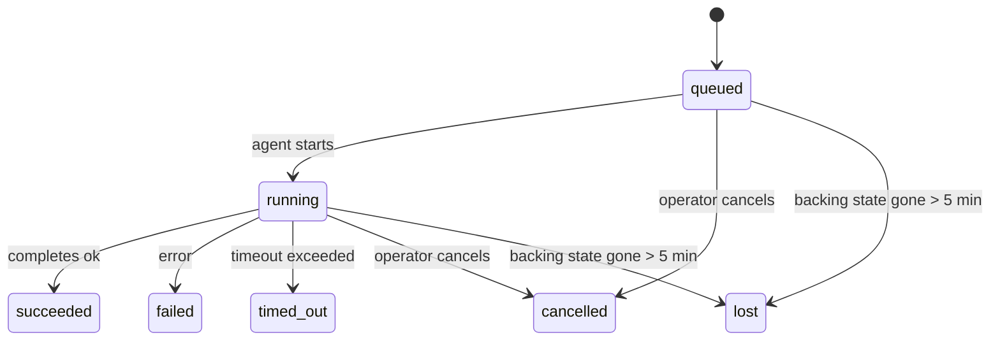

---
read_when:
    - Laufende oder kürzlich abgeschlossene Hintergrundarbeiten prüfen
    - Fehlersuche bei Zustellungsfehlern für entkoppelte Agent-Ausführungen
    - Verstehen, wie Hintergrundausführungen mit Sitzungen, Cron und Heartbeat zusammenhängen
sidebarTitle: Background tasks
summary: Nachverfolgung von Hintergrundaufgaben für ACP-Ausführungen, Subagenten, Cron-Ausführungen und CLI-Vorgänge
title: Hintergrundaufgaben
x-i18n:
    generated_at: "2026-07-12T01:21:22Z"
    model: gpt-5.6
    postprocess_version: locale-links-v1
    provider: openai
    source_hash: 0a945e8103c5df5a64785f326a9d0b08784ac32a2ca6fa3d4c399d75fc54be2b
    source_path: automation/tasks.md
    workflow: 16
---

<Note>
Suchen Sie nach einer Zeitplanung? Unter [Automatisierung](/de/automation) erfahren Sie, wie Sie den richtigen Mechanismus auswählen. Diese Seite ist das Aktivitätsprotokoll für Hintergrundarbeit, nicht der Zeitplaner.
</Note>

Hintergrundaufgaben erfassen Arbeit, die **außerhalb Ihrer Hauptkonversationssitzung** ausgeführt wird: ACP-Ausführungen, gestartete Subagenten, Ausführungen von Cron-Aufträgen und über die CLI initiierte Vorgänge.

Aufgaben ersetzen **keine** Sitzungen, Cron-Aufträge oder Heartbeats – sie sind das **Aktivitätsprotokoll**, das erfasst, welche entkoppelte Arbeit wann ausgeführt wurde und ob sie erfolgreich war.

<Note>
Nicht jede Agentenausführung erstellt eine Aufgabe. Heartbeat-Durchläufe und normale interaktive Chats tun dies nicht. Alle Cron-Ausführungen, gestarteten ACP-Sitzungen und Subagenten sowie vom Gateway weitergeleitete CLI-Agentenbefehle tun es.
</Note>

## Kurzfassung

- Aufgaben sind **Datensätze**, keine Zeitplaner – Cron und Heartbeat bestimmen, _wann_ Arbeit ausgeführt wird; Aufgaben erfassen, _was geschehen ist_.
- ACP, Subagenten, alle Cron-Aufträge und CLI-Vorgänge erstellen Aufgaben. Heartbeat-Durchläufe tun dies nicht.
- Jede Aufgabe durchläuft `queued → running → terminal` (erfolgreich, fehlgeschlagen, Zeitüberschreitung, abgebrochen oder verloren).
- Cron-Aufgaben bleiben aktiv, solange die Cron-Laufzeitumgebung den Auftrag weiterhin verwaltet. Wenn der Laufzeitstatus im Arbeitsspeicher nicht mehr vorhanden ist, prüft die Aufgabenwartung zunächst den dauerhaften Verlauf der Cron-Ausführungen, bevor sie eine Aufgabe als verloren kennzeichnet.
- Der Abschluss wird per Push gemeldet: Entkoppelte Arbeit kann nach ihrer Fertigstellung direkt benachrichtigen oder die anfordernde Sitzung beziehungsweise den Heartbeat aktivieren. Schleifen zur Statusabfrage sind daher normalerweise ungeeignet.
- Isolierte Cron-Ausführungen und abgeschlossene Subagenten versuchen nach Möglichkeit, überwachte Browser-Tabs und Prozesse ihrer untergeordneten Sitzung zu bereinigen, bevor die abschließende Bereinigungsbuchführung erfolgt.
- Bei der Zustellung isolierter Cron-Ausführungen werden veraltete zwischenzeitliche Antworten der übergeordneten Sitzung unterdrückt, solange nachgelagerte Subagentenarbeit noch abgeschlossen wird. Wenn die endgültige Ausgabe eines nachgelagerten Subagenten vor der Zustellung eintrifft, wird diese bevorzugt.
- Abschlussbenachrichtigungen werden direkt an einen Kanal zugestellt oder für den nächsten Heartbeat in die Warteschlange gestellt.
- `openclaw tasks list` zeigt alle Aufgaben an; `openclaw tasks audit` macht Probleme sichtbar.
- Abgeschlossene Datensätze werden 7 Tage lang aufbewahrt (`lost`-Datensätze 24 Stunden) und anschließend automatisch bereinigt.

## Schnellstart

<Tabs>
  <Tab title="List and filter">
    ```bash
    # List all tasks (newest first)
    openclaw tasks list

    # Filter by runtime or status
    openclaw tasks list --runtime acp
    openclaw tasks list --status running
    ```

  </Tab>
  <Tab title="Inspect">
    ```bash
    # Show details for a specific task (by task ID, run ID, or session key)
    openclaw tasks show <lookup>
    ```
  </Tab>
  <Tab title="Cancel and notify">
    ```bash
    # Cancel a running task (kills the child session)
    openclaw tasks cancel <lookup>

    # Change notification policy for a task
    openclaw tasks notify <lookup> state_changes
    ```

  </Tab>
  <Tab title="Audit and maintenance">
    ```bash
    # Run a health audit
    openclaw tasks audit

    # Preview or apply maintenance
    openclaw tasks maintenance
    openclaw tasks maintenance --apply
    ```

  </Tab>
  <Tab title="Task flow">
    ```bash
    # Inspect TaskFlow state
    openclaw tasks flow list
    openclaw tasks flow show <lookup>
    openclaw tasks flow cancel <lookup>
    ```
  </Tab>
</Tabs>

## Wodurch eine Aufgabe erstellt wird

| Quelle                  | Laufzeittyp | Zeitpunkt der Erstellung eines Aufgabendatensatzes                              | Standardbenachrichtigungsrichtlinie |
| ----------------------- | ----------- | -------------------------------------------------------------------------------- | ----------------------------------- |
| ACP-Hintergrundläufe    | `acp`       | Beim Starten einer untergeordneten ACP-Sitzung                                   | `done_only`                         |
| Subagenten-Orchestrierung | `subagent` | Beim Starten eines Subagenten über `sessions_spawn`                              | `done_only`                         |
| Cron-Aufträge (alle Typen) | `cron`    | Bei jeder Cron-Ausführung (in der Hauptsitzung und isoliert)                     | `silent`                            |
| CLI-Vorgänge            | `cli`       | Bei `openclaw agent`-Befehlen, die über das Gateway ausgeführt werden            | `silent`                            |
| Agenten-Medienaufträge  | `cli`       | Bei sitzungsgebundenen `image_generate`-/`music_generate`-/`video_generate`-Ausführungen | `silent`                       |

<AccordionGroup>
  <Accordion title="Notify defaults for cron and media">
    Cron-Aufgaben (in der Hauptsitzung und isoliert) verwenden die Benachrichtigungsrichtlinie `silent`. Sie erstellen Datensätze zur Nachverfolgung, erzeugen jedoch keine eigenen Aufgabenbenachrichtigungen; Cron verwaltet den Zustellungsweg.

    Sitzungsgebundene Ausführungen von `image_generate`, `music_generate` und `video_generate` verwenden ebenfalls die Benachrichtigungsrichtlinie `silent`. Sie erstellen weiterhin Aufgabendatensätze, aber der Abschluss wird als interne Aktivierung an die ursprüngliche Agentensitzung zurückgegeben, damit der Agent die Folgemeldung verfassen und die fertigen Medien selbst anhängen kann. Der anfordernde Agent folgt seinem normalen Vertrag für sichtbare Antworten: eine automatische endgültige Antwort, wenn dies konfiguriert ist, oder `message(action="send")` zusammen mit `NO_REPLY`, wenn die Sitzung Antworten über das Nachrichtenwerkzeug erfordert. Falls die anfordernde Sitzung nicht mehr aktiv ist oder ihre aktive Reaktivierung fehlschlägt und der Abschlussagent einige oder alle erzeugten Medien übersieht, sendet OpenClaw eine idempotente direkte Ausweichzustellung ausschließlich mit den fehlenden Medien an das ursprüngliche Kanalziel.

  </Accordion>
  <Accordion title="Concurrent media-generation guardrail">
    Solange eine sitzungsgebundene Medienerzeugungsaufgabe noch aktiv ist, schützen `image_generate`, `music_generate` und `video_generate` vor versehentlichen Wiederholungsversuchen: Wird der Aufruf für dieselbe Eingabe oder Anforderung wiederholt, wird der Status der entsprechenden aktiven Aufgabe zurückgegeben, anstatt ein Duplikat zu starten. Eine andere Eingabe kann hingegen eine eigene Aufgabe starten. Verwenden Sie `action: "status"`, wenn Sie auf Agentenseite ausdrücklich den Fortschritt oder Status abfragen möchten.
  </Accordion>
  <Accordion title="What does not create tasks">
    - Heartbeat-Durchläufe in der Hauptsitzung; siehe [Heartbeat](/de/gateway/heartbeat)
    - Normale interaktive Chat-Durchläufe
    - Direkte Antworten auf `/command`

  </Accordion>
</AccordionGroup>

## Lebenszyklus einer Aufgabe



| Status      | Bedeutung                                                                                          |
| ----------- | -------------------------------------------------------------------------------------------------- |
| `queued`    | Erstellt und wartet auf den Start des Agenten                                                      |
| `running`   | Der Agentendurchlauf wird aktiv ausgeführt                                                         |
| `succeeded` | Erfolgreich abgeschlossen                                                                          |
| `failed`    | Mit einem Fehler abgeschlossen                                                                     |
| `timed_out` | Die konfigurierte Zeitüberschreitung wurde überschritten                                           |
| `cancelled` | Vom Bediener über `openclaw tasks cancel` beendet oder die Ausführung wurde abgebrochen            |
| `lost`      | Die Laufzeitumgebung hat nach einer Karenzzeit von 5 Minuten den maßgeblichen Hintergrundstatus verloren |

Statusübergänge erfolgen automatisch: Lebenszyklusereignisse der Agentenausführung (Start, Ende, Fehler) aktualisieren den Aufgabenstatus; Sie verwalten ihn nicht manuell.

Der Abschluss einer Agentenausführung ist für aktive Aufgabendatensätze maßgeblich. Eine erfolgreiche entkoppelte Ausführung wird als `succeeded` abgeschlossen, gewöhnliche Ausführungsfehler als `failed`, Zeitüberschreitungen als `timed_out` und Abbruchergebnisse als `cancelled`. Sobald eine Aufgabe einen Endstatus erreicht hat, wird dieser durch spätere Lebenszyklussignale nicht herabgestuft: Eine vom Bediener abgebrochene oder bereits als `failed`, `timed_out` beziehungsweise `lost` gekennzeichnete Aufgabe behält diesen Status, selbst wenn anschließend ein Erfolgssignal eintrifft.

`lost` berücksichtigt die jeweilige Laufzeitumgebung:

- ACP-Aufgaben: Nur ein aktiver prozessinterner ACP-Durchlauf im Gateway belegt, dass die Ausführung noch aktiv ist; dauerhaft gespeicherte Sitzungsmetadaten allein reichen nicht aus. Die Offline-CLI-Prüfung verhält sich zurückhaltend und übernimmt ACP-Aufgaben niemals zurück.
- Subagentenaufgaben: Die zugrunde liegende untergeordnete Sitzung ist aus dem Speicher des Zielagenten verschwunden oder enthält einen Wiederherstellungsmarker für einen Neustart.
- Cron-Aufgaben: Die Cron-Laufzeitumgebung verfolgt den Auftrag nicht mehr als aktiv, und der dauerhafte Verlauf der Cron-Ausführungen enthält kein Endergebnis für diese Ausführung. Die Offline-CLI-Prüfung betrachtet ihren eigenen leeren prozessinternen Cron-Laufzeitstatus nicht als maßgeblich.
- CLI-Aufgaben: Aufgaben mit einer Ausführungs-ID oder Quell-ID verwenden den aktiven Ausführungskontext. Daher halten verbleibende Datensätze untergeordneter Sitzungen oder Chatsitzungen sie nicht aktiv, nachdem die vom Gateway verwaltete Ausführung verschwunden ist. Ältere CLI-Aufgaben ohne Ausführungsidentität greifen weiterhin auf die untergeordnete Sitzung zurück. Vom Gateway gestützte `openclaw agent`-Ausführungen werden ebenfalls anhand ihres Ausführungsergebnisses abgeschlossen, sodass abgeschlossene Ausführungen nicht aktiv bleiben, bis der Bereinigungsprozess sie als `lost` kennzeichnet.

## Zustellung und Benachrichtigungen

Wenn eine Aufgabe einen Endstatus erreicht, benachrichtigt OpenClaw Sie. Es gibt zwei Zustellungswege:

**Direkte Zustellung** – Wenn die Aufgabe ein Kanalziel besitzt (`requesterOrigin`), wird die Abschlussmeldung direkt an diesen Kanal gesendet (Discord, Slack, Telegram usw.). Abschlüsse von Gruppen- und Kanalaufgaben werden stattdessen über die anfordernde Sitzung geleitet, damit der übergeordnete Agent die sichtbare Antwort verfassen kann. Bei Abschlüssen von Subagenten behält OpenClaw außerdem die gebundene Thread- oder Themenweiterleitung bei, sofern diese verfügbar ist. Vor dem Abbruch der direkten Zustellung kann OpenClaw fehlende Angaben für `to` oder das Konto aus der gespeicherten Route der anfordernden Sitzung (`lastChannel` / `lastTo` / `lastAccountId`) ergänzen.

**Über die Sitzung eingereihte Zustellung** – Wenn die direkte Zustellung fehlschlägt oder kein Ursprung festgelegt ist, wird die Aktualisierung als Systemereignis in die Sitzung des Anforderers eingereiht und beim nächsten Heartbeat angezeigt.

<Tip>
Über die Sitzung eingereihte Aufgabenabschlüsse lösen eine sofortige Heartbeat-Aktivierung aus, sodass Sie das Ergebnis schnell sehen und nicht auf den nächsten geplanten Heartbeat-Zeitpunkt warten müssen.
</Tip>

Der übliche Arbeitsablauf ist daher Push-basiert: Starten Sie entkoppelte Arbeit einmalig und lassen Sie sich nach ihrem Abschluss von der Laufzeitumgebung aktivieren oder benachrichtigen. Fragen Sie den Aufgabenstatus nur ab, wenn Sie eine Fehlerdiagnose, einen Eingriff oder eine ausdrückliche Prüfung benötigen.

### Benachrichtigungsrichtlinien

Legen Sie fest, wie ausführlich Sie über jede Aufgabe informiert werden:

| Richtlinie             | Zugestellte Informationen                                      |
| ---------------------- | -------------------------------------------------------------- |
| `done_only` (Standard) | Nur der Endstatus (erfolgreich, fehlgeschlagen usw.)           |
| `state_changes`        | Jeder Statusübergang und jede Fortschrittsaktualisierung       |
| `silent`               | Keine Benachrichtigungen (Standard für Cron-, CLI- und Medienaufgaben) |

Ändern Sie die Richtlinie, während eine Aufgabe ausgeführt wird:

```bash
openclaw tasks notify <lookup> state_changes
```

## CLI-Referenz

<AccordionGroup>
  <Accordion title="tasks list">
    ```bash
    openclaw tasks list [--runtime <acp|subagent|cron|cli>] [--status <status>] [--json]
    ```

    Ausgabespalten: Aufgabe, Art, Status, Zustellung, Ausführung, untergeordnete Sitzung, Zusammenfassung. `openclaw tasks` ohne weitere Argumente verhält sich wie `openclaw tasks list`.

  </Accordion>
  <Accordion title="tasks show">
    ```bash
    openclaw tasks show <lookup> [--json]
    ```

    Das Suchtoken akzeptiert eine Aufgaben-ID, Ausführungs-ID oder einen Sitzungsschlüssel. Der vollständige Datensatz wird einschließlich Zeitangaben, Zustellungsstatus, Fehler und abschließender Zusammenfassung angezeigt.

  </Accordion>
  <Accordion title="tasks cancel">
    ```bash
    openclaw tasks cancel <lookup>
    ```

    Bei ACP- und Subagentenaufgaben wird dadurch die untergeordnete Sitzung beendet; Abbrüche von ACP- und Cron-Aufgaben werden über das laufende Gateway (`tasks.cancel`) geleitet. Bei über die CLI verfolgten Aufgaben wird der Abbruch im Aufgabenregister erfasst, da kein separater Laufzeit-Handle für einen untergeordneten Prozess vorhanden ist. Der Status wechselt zu `cancelled`, und sofern zutreffend, wird eine Zustellungsbenachrichtigung gesendet.

  </Accordion>
  <Accordion title="tasks notify">
    ```bash
    openclaw tasks notify <lookup> <done_only|state_changes|silent>
    ```
  </Accordion>
  <Accordion title="tasks audit">
    ```bash
    openclaw tasks audit [--severity <warn|error>] [--code <name>] [--limit <n>] [--json]
    ```

    Zeigt betriebliche Probleme für Aufgaben **und** TaskFlows in einem einzigen Bericht an. Erkannte Probleme werden außerdem in `openclaw status` angezeigt.

    Aufgabenbefunde:

    | Befund                     | Schweregrad | Auslöser                                                                                                                      |
    | -------------------------- | ----------- | ----------------------------------------------------------------------------------------------------------------------------- |
    | `stale_queued`             | Warnung     | Seit mehr als 10 Minuten in der Warteschlange                                                                                 |
    | `stale_running`            | Fehler      | Seit mehr als 30 Minuten in Ausführung                                                                                        |
    | `lost`                     | Warnung/Fehler | Die laufzeitgestützte Aufgabenzuordnung ist verschwunden; beibehaltene verlorene Aufgaben werden bis `cleanupAfter` als Warnungen und danach als Fehler gemeldet |
    | `delivery_failed`          | Warnung     | Die Zustellung ist fehlgeschlagen und die Benachrichtigungsrichtlinie ist nicht `silent`                                      |
    | `missing_cleanup`          | Warnung     | Abgeschlossene Aufgabe ohne Bereinigungszeitstempel                                                                           |
    | `inconsistent_timestamps`  | Warnung     | Verletzung der zeitlichen Abfolge (zum Beispiel Ende vor Beginn)                                                              |

    TaskFlow-Befunde:

    | Befund                 | Schweregrad | Auslöser                                                                                   |
    | ---------------------- | ----------- | ------------------------------------------------------------------------------------------ |
    | `restore_failed`       | Fehler      | Die Wiederherstellung der Ablaufregistrierung aus SQLite ist fehlgeschlagen                |
    | `stale_running`        | Fehler      | Der laufende Ablauf wurde seit mehr als 30 Minuten nicht fortgesetzt                       |
    | `stale_waiting`        | Warnung     | Der wartende Ablauf wurde seit mehr als 30 Minuten nicht fortgesetzt                       |
    | `stale_blocked`        | Warnung     | Der blockierte Ablauf wurde seit mehr als 30 Minuten nicht fortgesetzt                     |
    | `cancel_stuck`         | Warnung     | Abbruch vor mehr als 5 Minuten angefordert, keine aktiven untergeordneten Aufgaben, weiterhin nicht abgeschlossen |
    | `missing_linked_tasks` | Warnung/Fehler | Veralteter verwalteter Ablauf ohne verknüpfte Aufgaben oder Wartezustand                  |
    | `blocked_task_missing` | Warnung     | Der blockierte Ablauf verweist auf eine nicht mehr vorhandene Aufgaben-ID                  |

  </Accordion>
  <Accordion title="Aufgabenwartung">
    ```bash
    openclaw tasks maintenance [--json]
    openclaw tasks maintenance --apply [--json]
    ```

    Verwenden Sie diesen Befehl, um den Abgleich, das Setzen von Bereinigungszeitstempeln und das Entfernen veralteter Einträge für Aufgaben, den TaskFlow-Zustand und veraltete Sitzungsregistrierungszeilen von Cron-Ausführungen in der Vorschau anzuzeigen oder anzuwenden.

    Der Abgleich berücksichtigt die Laufzeit:

    - ACP-Aufgaben erfordern einen aktiven prozessinternen Durchlauf im Gateway; Subagent-Aufgaben prüfen ihre zugrunde liegende untergeordnete Sitzung.
    - Subagent-Aufgaben, deren untergeordnete Sitzung einen Tombstone zur Neustartwiederherstellung besitzt, werden als verloren markiert, statt als wiederherstellbare zugrunde liegende Sitzungen behandelt zu werden.
    - Cron-Aufgaben prüfen, ob die Cron-Laufzeit den Auftrag noch besitzt, und stellen anschließend den Abschlussstatus aus dauerhaft gespeicherten Cron-Ausführungsprotokollen beziehungsweise dem Auftragszustand wieder her, bevor sie auf `lost` zurückfallen. Nur der Gateway-Prozess ist für die speicherinterne Menge aktiver Cron-Aufträge maßgeblich; eine Offline-CLI-Prüfung verwendet den dauerhaften Verlauf, markiert eine Cron-Aufgabe jedoch nicht allein deshalb als verloren, weil diese lokale Menge leer ist.
    - CLI-Aufgaben mit Ausführungsidentität prüfen den zugehörigen aktiven Ausführungskontext und nicht lediglich Zeilen untergeordneter Sitzungen oder Chatsitzungen.

    Auch die Bereinigung nach Abschluss berücksichtigt die Laufzeit:

    - Beim Abschluss eines Subagents werden nach Möglichkeit die für die untergeordnete Sitzung erfassten Browser-Tabs und Prozesse geschlossen, bevor die Bereinigung für die Ankündigung fortgesetzt wird.
    - Beim Abschluss einer isolierten Cron-Ausführung werden nach Möglichkeit die für die Cron-Sitzung erfassten Browser-Tabs und Prozesse geschlossen, bevor die Ausführung vollständig beendet wird.
    - Die Zustellung isolierter Cron-Ausführungen wartet bei Bedarf auf nachgelagerte Aktionen untergeordneter Subagents und unterdrückt veralteten Bestätigungstext der übergeordneten Aufgabe, statt ihn anzukündigen.
    - Die Zustellung beim Abschluss eines Subagents verwendet ausschließlich den neuesten sichtbaren Assistententext der untergeordneten Sitzung. Ausgaben von `tool`/`toolResult` werden nicht zum Ergebnistext der untergeordneten Sitzung hochgestuft. Fehlgeschlagene abgeschlossene Ausführungen melden den Fehlerstatus, ohne den erfassten Antworttext erneut auszugeben.
    - Fehler bei der Bereinigung verdecken nicht das tatsächliche Aufgabenergebnis.

    Beim Anwenden der Wartung entfernt OpenClaw außerdem veraltete Sitzungsregistrierungszeilen des Typs `cron:<jobId>:run:<runId>`, die älter als 7 Tage sind. Zeilen für aktuell laufende Cron-Aufträge bleiben dabei erhalten, und Sitzungszeilen, die nicht zu Cron gehören, bleiben unverändert.

  </Accordion>
  <Accordion title="Aufgabenabläufe auflisten | anzeigen | abbrechen">
    ```bash
    openclaw tasks flow list [--status <status>] [--json]
    openclaw tasks flow show <lookup> [--json]
    openclaw tasks flow cancel <lookup>
    ```

    Das Such-Token für Abläufe akzeptiert eine Ablauf-ID oder einen Eigentümerschlüssel. Verwenden Sie diese Befehle, wenn Sie sich für den orchestrierenden [TaskFlow](/de/automation/taskflow) statt für einen einzelnen Datensatz einer Hintergrundaufgabe interessieren.

  </Accordion>
</AccordionGroup>

## Aufgabenübersicht im Chat (`/tasks`)

Verwenden Sie `/tasks` in einer beliebigen Chatsitzung, um die mit dieser Sitzung verknüpften Hintergrundaufgaben anzuzeigen. Die Übersicht zeigt bis zu fünf aktive und kürzlich abgeschlossene Aufgaben mit Laufzeit, Status, Zeitangaben sowie Fortschritts- oder Fehlerdetails.

Wenn die aktuelle Sitzung keine sichtbaren verknüpften Aufgaben enthält, greift `/tasks` auf die agentenlokalen Aufgabenzahlen zurück. So erhalten Sie weiterhin einen Überblick, ohne Details aus anderen Sitzungen offenzulegen.

Verwenden Sie für das vollständige Betriebsprotokoll die CLI: `openclaw tasks list`.

### Steuerungsoberfläche

Die webbasierte Steuerungsoberfläche enthält in der Seitenleiste eine Seite **Aufgaben** mit aktiven und kürzlich abgeschlossenen Hintergrundaufgaben in Echtzeit. Verwenden Sie sie, um den Fortschritt zu prüfen, verknüpfte Sitzungen zu öffnen, das Protokoll zu aktualisieren oder Aufgaben in der Warteschlange und laufende Aufgaben abzubrechen.

Chatbereiche verfügen außerdem über eine einklappbare Leiste **Hintergrundaufgaben**, die auf den Agenten des jeweiligen Bereichs beschränkt ist: laufende Aufgaben und Subagents mit einer Stoppsteuerung, einen Abschnitt mit abgeschlossenen Aufgaben und Links zum Anzeigen des Transkripts der untergeordneten Sitzung jeder Aufgabe. Öffnen Sie sie über den Aktivitätsschalter in der Kopfzeile des Bereichs oder über die schwebende Aktivitätsschaltfläche in einem Chat mit nur einem Bereich.

## Statusintegration (Aufgabenauslastung)

`openclaw status` enthält eine kompakte Aufgabenzeile:

```
Aufgaben    2 aktiv · 1 in Warteschlange · 1 läuft · 1 Problem · Prüfung fehlerfrei · 6 erfasst
```

Die Zusammenfassung zählt aktive Arbeit (`queued` + `running`), Fehlschläge (`failed` + `timed_out` + `lost`), Prüfungsbefunde und die Gesamtzahl der erfassten Datensätze; die JSON-Nutzlast schlüsselt die Zahlen außerdem nach Laufzeit auf (`acp`, `subagent`, `cron`, `cli`).

Sowohl `/status` als auch das Werkzeug `session_status` verwenden eine bereinigungsbewusste Aufgabenübersicht: Aktive Aufgaben werden bevorzugt, abgelaufene Zeilen ausgeblendet und abgeschlossene Aufgaben nur für ein kurzes Zeitfenster von 5 Minuten angezeigt. Wenn keine aktive Arbeit mehr vorhanden ist, stehen Fehlschläge im Mittelpunkt. Dadurch konzentriert sich die Statuskarte auf das, was derzeit relevant ist.

## Speicherung und Wartung

### Speicherort der Aufgaben

Aufgabendatensätze und Zustellungsstatus werden dauerhaft in der gemeinsam genutzten SQLite-Zustandsdatenbank von OpenClaw gespeichert:

```
~/.openclaw/state/openclaw.sqlite   (Tabellen: task_runs, task_delivery_state, flow_runs)
```

Setzen Sie `OPENCLAW_STATE_DIR`, um das gesamte Zustandsstammverzeichnis an einen anderen Ort zu verschieben (standardmäßig `~/.openclaw`); der Pfad der gemeinsam genutzten Datenbank wird entsprechend mitverschoben.

Die Registrierung wird bei der ersten Verwendung in den Arbeitsspeicher geladen und schreibt jede Änderung dauerhaft in SQLite zurück, sodass Datensätze Neustarts des Gateway überstehen. Das WAL-Wachstum bleibt durch den standardmäßigen Autocheckpoint-Schwellenwert von SQLite und regelmäßige `PASSIVE`-Checkpoints begrenzt; Checkpoints beim Herunterfahren und bei expliziter Wartung verwenden `TRUNCATE`, sodass bei regulärem Beenden WAL-Speicherplatz freigegeben wird, ohne dass der Hintergrundbereiniger auf aktive Leser warten muss.

Ältere Sidecar-Speicher aus früheren Installationen (`tasks/runs.sqlite`, `flows/registry.sqlite`) werden durch `openclaw doctor` in die gemeinsam genutzte Datenbank importiert.

### Automatische Wartung

Ein Bereiniger wird alle **60 Sekunden** ausgeführt (der erste Durchlauf etwa 5 Sekunden nach dem Start des Gateway) und erledigt vier Aufgaben:

<Steps>
  <Step title="Abgleich">
    Prüft, ob aktive Aufgaben weiterhin eine maßgebliche Laufzeitgrundlage besitzen. ACP-Aufgaben erfordern einen aktiven prozessinternen Durchlauf, Subagent-Aufgaben verwenden den Zustand der untergeordneten Sitzung, Cron-Aufgaben verwenden die Eigentümerschaft aktiver Aufträge zusammen mit dem dauerhaften Ausführungsverlauf und CLI-Aufgaben mit Ausführungsidentität verwenden den zugehörigen Ausführungskontext. Wenn die zugrunde liegende Zustandsinformation länger als 5 Minuten nicht vorhanden ist (30 Minuten bei nativen Subagent-Aufgaben ohne untergeordnete Sitzung), wird die Aufgabe als `lost` markiert.
  </Step>
  <Step title="Reparatur von ACP-Sitzungen">
    Schließt abgeschlossene oder verwaiste, der übergeordneten Aufgabe gehörende einmalige ACP-Sitzungen. Veraltete abgeschlossene oder verwaiste dauerhafte ACP-Sitzungen werden nur geschlossen, wenn keine aktive Gesprächsbindung mehr besteht.
  </Step>
  <Step title="Setzen von Bereinigungszeitstempeln">
    Setzt bei abgeschlossenen Aufgaben einen `cleanupAfter`-Zeitstempel (Abschlusszeitpunkt plus Aufbewahrungszeitraum). Während der Aufbewahrung erscheinen verlorene Aufgaben bei Prüfungen weiterhin als Warnungen; nach Ablauf von `cleanupAfter` oder bei fehlenden Bereinigungsmetadaten werden sie zu Fehlern.
  </Step>
  <Step title="Entfernen">
    Löscht Datensätze, deren `cleanupAfter`-Datum überschritten ist.
  </Step>
</Steps>

<Note>
**Aufbewahrung:** Abgeschlossene Aufgabendatensätze werden **7 Tage** lang aufbewahrt (`lost`-Datensätze **24 Stunden**) und anschließend automatisch entfernt. Es ist keine Konfiguration erforderlich.
</Note>

## Beziehung von Aufgaben zu anderen Systemen

<AccordionGroup>
  <Accordion title="Aufgaben und TaskFlow">
    [TaskFlow](/de/automation/taskflow) ist die Ebene zur Ablauforchestrierung oberhalb der Hintergrundaufgaben. Ein einzelner Ablauf kann während seiner Lebensdauer mithilfe verwalteter oder gespiegelter Synchronisierungsmodi mehrere Aufgaben koordinieren. Verwenden Sie `openclaw tasks`, um einzelne Aufgabendatensätze zu prüfen, und `openclaw tasks flow`, um den orchestrierenden Ablauf zu prüfen.

  </Accordion>
  <Accordion title="Aufgaben und Cron">
    Definitionen von Cron-Aufträgen, der Laufzeitausführungsstatus und der Ausführungsverlauf befinden sich in der gemeinsam genutzten SQLite-Zustandsdatenbank von OpenClaw. **Jede** Cron-Ausführung erstellt einen Aufgabendatensatz – sowohl in der Hauptsitzung als auch isoliert – mit der Benachrichtigungsrichtlinie `silent`. Dadurch werden Cron-Ausführungen erfasst, ohne eigene Aufgabenbenachrichtigungen zu erzeugen.

    Siehe [Cron-Aufträge](/de/automation/cron-jobs).

  </Accordion>
  <Accordion title="Aufgaben und Heartbeat">
    Heartbeat-Ausführungen sind Durchläufe der Hauptsitzung – sie erstellen keine Aufgabendatensätze. Wenn eine Aufgabe abgeschlossen wird, kann sie einen Heartbeat-Weckvorgang auslösen, damit Sie das Ergebnis zeitnah sehen.

    Siehe [Heartbeat](/de/gateway/heartbeat).

  </Accordion>
  <Accordion title="Aufgaben und Sitzungen">
    Eine Aufgabe kann auf einen `childSessionKey` (wo die Arbeit ausgeführt wird) und einen `requesterSessionKey` (wer sie gestartet hat) verweisen. Ihre `agentId` identifiziert den Agenten, der die Arbeit ausführt, während die Felder für Anforderer und Eigentümer den Start- und Steuerungskontext beibehalten. Sitzungen bilden den Gesprächskontext; Aufgaben ergänzen diesen um die Aktivitätsverfolgung.
  </Accordion>
  <Accordion title="Aufgaben und Agentenausführungen">
    Die `runId` einer Aufgabe verweist auf die Agentenausführung, welche die Arbeit erledigt. Lebenszyklusereignisse des Agenten (Start, Ende, Fehler) aktualisieren den Aufgabenstatus automatisch – Sie müssen den Lebenszyklus nicht manuell verwalten.
  </Accordion>
</AccordionGroup>

## Verwandte Themen

- [Automatisierung](/de/automation) – alle Automatisierungsmechanismen auf einen Blick
- [CLI: Aufgaben](/de/cli/tasks) – Referenz der CLI-Befehle
- [Heartbeat](/de/gateway/heartbeat) – regelmäßige Durchläufe der Hauptsitzung
- [Geplante Aufgaben](/de/automation/cron-jobs) – Planung von Hintergrundarbeit
- [TaskFlow](/de/automation/taskflow) – Ablauforchestrierung oberhalb von Aufgaben
