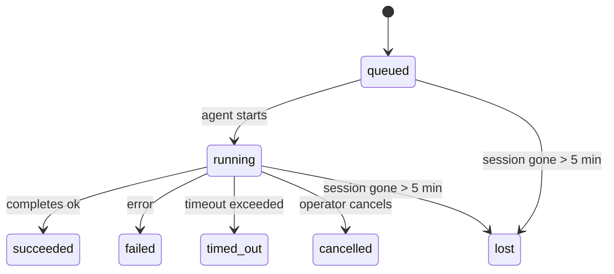

---
read_when:
    - Inspektion laufender oder kürzlich abgeschlossener Hintergrundaufgaben
    - Debuggen von Zustellungsfehlern bei entkoppelten Agent-Läufen
    - Verstehen, wie Hintergrundläufe mit Sitzungen, Cron und Heartbeat zusammenhängen
summary: Hintergrundaufgaben-Verfolgung für ACP-Läufe, Subagents, isolierte Cron-Jobs und CLI-Operationen
title: Hintergrundaufgaben
x-i18n:
    generated_at: "2026-04-21T19:20:42Z"
    model: gpt-5.4
    provider: openai
    source_hash: a4cd666b3eaffde8df0b5e1533eb337e44a0824824af6f8a240f18a89f71b402
    source_path: automation/tasks.md
    workflow: 15
---

# Hintergrundaufgaben

> **Suchen Sie nach Planung?** Unter [Automatisierung & Aufgaben](/de/automation) erfahren Sie, wie Sie den richtigen Mechanismus auswählen. Auf dieser Seite geht es um das **Nachverfolgen** von Hintergrundarbeit, nicht um deren Planung.

Hintergrundaufgaben verfolgen Arbeit, die **außerhalb Ihrer Haupt-Konversationssitzung** läuft:
ACP-Läufe, Subagent-Starts, isolierte Cron-Job-Ausführungen und über die CLI gestartete Operationen.

Aufgaben ersetzen **nicht** Sitzungen, Cron-Jobs oder Heartbeats — sie sind das **Aktivitätsprotokoll**, das festhält, welche entkoppelte Arbeit stattgefunden hat, wann sie stattgefunden hat und ob sie erfolgreich war.

<Note>
Nicht jeder Agent-Lauf erstellt eine Aufgabe. Heartbeat-Turns und normaler interaktiver Chat tun das nicht. Alle Cron-Ausführungen, ACP-Starts, Subagent-Starts und CLI-Agent-Befehle tun es.
</Note>

## Kurzfassung

- Aufgaben sind **Datensätze**, keine Planer — Cron und Heartbeat entscheiden, _wann_ Arbeit ausgeführt wird, Aufgaben verfolgen, _was passiert ist_.
- ACP, Subagents, alle Cron-Jobs und CLI-Operationen erstellen Aufgaben. Heartbeat-Turns tun das nicht.
- Jede Aufgabe durchläuft `queued → running → terminal` (succeeded, failed, timed_out, cancelled oder lost).
- Cron-Aufgaben bleiben aktiv, solange die Cron-Laufzeitumgebung den Job noch besitzt; chatgestützte CLI-Aufgaben bleiben nur aktiv, solange ihr besitzender Laufkontext noch aktiv ist.
- Der Abschluss ist Push-gesteuert: Entkoppelte Arbeit kann direkt benachrichtigen oder die anfordernde Sitzung/den Heartbeat wecken, wenn sie abgeschlossen ist; Status-Polling-Schleifen sind daher in der Regel die falsche Form.
- Isolierte Cron-Läufe und Subagent-Abschlüsse bereinigen nach bestem Bemühen nachverfolgte Browser-Tabs/Prozesse für ihre untergeordnete Sitzung vor der finalen Cleanup-Buchführung.
- Die Auslieferung isolierter Cron-Läufe unterdrückt veraltete Zwischenantworten des Elternteils, während nachgelagerte Subagent-Arbeit noch ausläuft, und bevorzugt finale nachgelagerte Ausgabe, wenn diese vor der Zustellung eintrifft.
- Abschlussbenachrichtigungen werden direkt an einen Kanal zugestellt oder für den nächsten Heartbeat in die Warteschlange gestellt.
- `openclaw tasks list` zeigt alle Aufgaben; `openclaw tasks audit` macht Probleme sichtbar.
- Terminal-Datensätze werden 7 Tage lang aufbewahrt und danach automatisch bereinigt.

## Schnellstart

```bash
# Alle Aufgaben auflisten (neueste zuerst)
openclaw tasks list

# Nach Laufzeit oder Status filtern
openclaw tasks list --runtime acp
openclaw tasks list --status running

# Details für eine bestimmte Aufgabe anzeigen (nach ID, Lauf-ID oder Sitzungsschlüssel)
openclaw tasks show <lookup>

# Eine laufende Aufgabe abbrechen (beendet die untergeordnete Sitzung)
openclaw tasks cancel <lookup>

# Benachrichtigungsrichtlinie für eine Aufgabe ändern
openclaw tasks notify <lookup> state_changes

# Integritätsprüfung ausführen
openclaw tasks audit

# Wartung in der Vorschau anzeigen oder anwenden
openclaw tasks maintenance
openclaw tasks maintenance --apply

# TaskFlow-Status prüfen
openclaw tasks flow list
openclaw tasks flow show <lookup>
openclaw tasks flow cancel <lookup>
```

## Was eine Aufgabe erstellt

| Quelle                 | Laufzeittyp | Wann ein Aufgabendatensatz erstellt wird              | Standard-Benachrichtigungsrichtlinie |
| ---------------------- | ----------- | ----------------------------------------------------- | ------------------------------------ |
| ACP-Hintergrundläufe   | `acp`       | Beim Starten einer untergeordneten ACP-Sitzung        | `done_only`                          |
| Subagent-Orchestrierung | `subagent` | Beim Starten eines Subagents über `sessions_spawn`    | `done_only`                          |
| Cron-Jobs (alle Typen) | `cron`      | Bei jeder Cron-Ausführung (Hauptsitzung und isoliert) | `silent`                             |
| CLI-Operationen        | `cli`       | `openclaw agent`-Befehle, die über das Gateway laufen | `silent`                             |
| Agent-Medienjobs       | `cli`       | Sitzungsgebundene `video_generate`-Läufe              | `silent`                             |

Cron-Aufgaben der Hauptsitzung verwenden standardmäßig die Benachrichtigungsrichtlinie `silent` — sie erstellen Datensätze zum Nachverfolgen, erzeugen aber keine Benachrichtigungen. Isolierte Cron-Aufgaben verwenden ebenfalls standardmäßig `silent`, sind aber sichtbarer, weil sie in ihrer eigenen Sitzung laufen.

Sitzungsgebundene `video_generate`-Läufe verwenden ebenfalls die Benachrichtigungsrichtlinie `silent`. Sie erstellen weiterhin Aufgabendatensätze, aber der Abschluss wird als internes Wake an die ursprüngliche Agent-Sitzung zurückgegeben, damit der Agent selbst die Folgemeldung schreiben und das fertige Video anhängen kann. Wenn Sie `tools.media.asyncCompletion.directSend` aktivieren, versuchen asynchrone `music_generate`- und `video_generate`-Abschlüsse zuerst die direkte Kanalzustellung, bevor sie auf den Wake-Pfad der anfordernden Sitzung zurückfallen.

Während eine sitzungsgebundene `video_generate`-Aufgabe noch aktiv ist, wirkt das Tool auch als Leitplanke: Wiederholte `video_generate`-Aufrufe in derselben Sitzung geben den Status der aktiven Aufgabe zurück, statt eine zweite gleichzeitige Generierung zu starten. Verwenden Sie `action: "status"`, wenn Sie auf Agent-Seite eine explizite Fortschritts-/Statusabfrage möchten.

**Was keine Aufgaben erstellt:**

- Heartbeat-Turns — Hauptsitzung; siehe [Heartbeat](/de/gateway/heartbeat)
- Normale interaktive Chat-Turns
- Direkte `/command`-Antworten

## Aufgabenlebenszyklus



| Status      | Bedeutung                                                                 |
| ----------- | ------------------------------------------------------------------------- |
| `queued`    | Erstellt, wartet auf den Start des Agenten                                |
| `running`   | Der Agent-Turn wird gerade aktiv ausgeführt                               |
| `succeeded` | Erfolgreich abgeschlossen                                                 |
| `failed`    | Mit einem Fehler abgeschlossen                                            |
| `timed_out` | Das konfigurierte Timeout wurde überschritten                             |
| `cancelled` | Vom Operator über `openclaw tasks cancel` gestoppt                        |
| `lost`      | Die Laufzeitumgebung hat nach einer Schonfrist von 5 Minuten den autoritativen Trägerstatus verloren |

Übergänge erfolgen automatisch — wenn der zugehörige Agent-Lauf endet, wird der Aufgabenstatus entsprechend aktualisiert.

`lost` ist laufzeitbewusst:

- ACP-Aufgaben: Metadaten der untergeordneten ACP-Sitzung sind verschwunden.
- Subagent-Aufgaben: Untergeordnete Sitzung ist aus dem Ziel-Agent-Store verschwunden.
- Cron-Aufgaben: Die Cron-Laufzeitumgebung verfolgt den Job nicht mehr als aktiv.
- CLI-Aufgaben: Isolierte untergeordnete Sitzungsaufgaben verwenden die untergeordnete Sitzung; chatgestützte CLI-Aufgaben verwenden stattdessen den Live-Laufkontext, sodass verbleibende Kanal-/Gruppen-/Direktsitzungszeilen sie nicht aktiv halten.

## Zustellung und Benachrichtigungen

Wenn eine Aufgabe einen Terminal-Status erreicht, benachrichtigt OpenClaw Sie. Es gibt zwei Zustellpfade:

**Direkte Zustellung** — wenn die Aufgabe ein Kanalziel hat (den `requesterOrigin`), geht die Abschlussmeldung direkt an diesen Kanal (Telegram, Discord, Slack usw.). Bei Subagent-Abschlüssen bewahrt OpenClaw außerdem die gebundene Thread-/Topic-Weiterleitung, wenn verfügbar, und kann ein fehlendes `to` / Konto aus der gespeicherten Route der anfordernden Sitzung (`lastChannel` / `lastTo` / `lastAccountId`) ergänzen, bevor die direkte Zustellung aufgegeben wird.

**Sitzungswarteschlangen-Zustellung** — wenn die direkte Zustellung fehlschlägt oder kein Ursprung gesetzt ist, wird das Update als Systemereignis in die Warteschlange der anfordernden Sitzung gestellt und beim nächsten Heartbeat angezeigt.

<Tip>
Der Abschluss einer Aufgabe löst ein sofortiges Heartbeat-Wake aus, damit Sie das Ergebnis schnell sehen — Sie müssen nicht auf den nächsten geplanten Heartbeat-Tick warten.
</Tip>

Das bedeutet, dass der übliche Ablauf Push-basiert ist: Starten Sie entkoppelte Arbeit einmal und lassen Sie sich dann von der Laufzeitumgebung bei Abschluss wecken oder benachrichtigen. Fragen Sie den Aufgabenstatus nur ab, wenn Sie Debugging, Eingriffe oder eine explizite Prüfung benötigen.

### Benachrichtigungsrichtlinien

Steuern Sie, wie viel Sie über jede Aufgabe erfahren:

| Richtlinie            | Was zugestellt wird                                                      |
| --------------------- | ------------------------------------------------------------------------ |
| `done_only` (Standard) | Nur der Terminal-Status (succeeded, failed usw.) — **das ist der Standard** |
| `state_changes`       | Jeder Statusübergang und jedes Fortschritts-Update                       |
| `silent`              | Überhaupt nichts                                                         |

Ändern Sie die Richtlinie, während eine Aufgabe läuft:

```bash
openclaw tasks notify <lookup> state_changes
```

## CLI-Referenz

### `tasks list`

```bash
openclaw tasks list [--runtime <acp|subagent|cron|cli>] [--status <status>] [--json]
```

Ausgabespalten: Aufgaben-ID, Typ, Status, Zustellung, Lauf-ID, untergeordnete Sitzung, Zusammenfassung.

### `tasks show`

```bash
openclaw tasks show <lookup>
```

Das Lookup-Token akzeptiert eine Aufgaben-ID, Lauf-ID oder einen Sitzungsschlüssel. Zeigt den vollständigen Datensatz einschließlich Timing, Zustellstatus, Fehler und Terminal-Zusammenfassung.

### `tasks cancel`

```bash
openclaw tasks cancel <lookup>
```

Bei ACP- und Subagent-Aufgaben beendet dies die untergeordnete Sitzung. Bei CLI-nachverfolgten Aufgaben wird der Abbruch in der Aufgabenregistrierung vermerkt (es gibt keinen separaten Handle der untergeordneten Laufzeitumgebung). Der Status wechselt zu `cancelled`, und wenn zutreffend wird eine Zustellbenachrichtigung gesendet.

### `tasks notify`

```bash
openclaw tasks notify <lookup> <done_only|state_changes|silent>
```

### `tasks audit`

```bash
openclaw tasks audit [--json]
```

Macht betriebliche Probleme sichtbar. Erkenntnisse erscheinen bei erkannten Problemen auch in `openclaw status`.

| Ergebnis                  | Schweregrad | Auslöser                                              |
| ------------------------- | ----------- | ----------------------------------------------------- |
| `stale_queued`            | warn        | Mehr als 10 Minuten in der Warteschlange              |
| `stale_running`           | error       | Mehr als 30 Minuten laufend                           |
| `lost`                    | error       | Laufzeitgestützte Aufgabeninhaberschaft ist verschwunden |
| `delivery_failed`         | warn        | Zustellung fehlgeschlagen und Benachrichtigungsrichtlinie ist nicht `silent` |
| `missing_cleanup`         | warn        | Terminal-Aufgabe ohne Cleanup-Zeitstempel             |
| `inconsistent_timestamps` | warn        | Verletzung der Zeitachse (zum Beispiel Ende vor Start) |

### `tasks maintenance`

```bash
openclaw tasks maintenance [--json]
openclaw tasks maintenance --apply [--json]
```

Verwenden Sie dies, um Abgleich, Cleanup-Markierung und Bereinigung für Aufgaben- und Task Flow-Status in der Vorschau anzuzeigen oder anzuwenden.

Der Abgleich ist laufzeitbewusst:

- ACP-/Subagent-Aufgaben prüfen ihre untergeordnete Sitzung.
- Cron-Aufgaben prüfen, ob die Cron-Laufzeitumgebung den Job noch besitzt.
- Chatgestützte CLI-Aufgaben prüfen den besitzenden Live-Laufkontext, nicht nur die Chat-Sitzungszeile.

Das Abschluss-Cleanup ist ebenfalls laufzeitbewusst:

- Der Subagent-Abschluss schließt nach bestem Bemühen nachverfolgte Browser-Tabs/Prozesse für die untergeordnete Sitzung, bevor das Ankündigungs-Cleanup fortgesetzt wird.
- Der Abschluss eines isolierten Cron-Laufs schließt nach bestem Bemühen nachverfolgte Browser-Tabs/Prozesse für die Cron-Sitzung, bevor der Lauf vollständig heruntergefahren wird.
- Die Zustellung isolierter Cron-Läufe wartet bei Bedarf nachgelagerte Subagent-Nacharbeit ab und unterdrückt veralteten Bestätigungstext des Elternteils, statt ihn anzukündigen.
- Die Zustellung von Subagent-Abschlüssen bevorzugt den neuesten sichtbaren Assistant-Text; ist dieser leer, greift sie auf bereinigten neuesten tool-/toolResult-Text zurück, und reine Timeout-Tool-Call-Läufe können auf eine kurze Teilfortschritts-Zusammenfassung reduziert werden. Terminal fehlgeschlagene Läufe melden den Fehlerstatus, ohne erfassten Antworttext erneut wiederzugeben.
- Cleanup-Fehler verschleiern nicht das tatsächliche Aufgabenergebnis.

### `tasks flow list|show|cancel`

```bash
openclaw tasks flow list [--status <status>] [--json]
openclaw tasks flow show <lookup> [--json]
openclaw tasks flow cancel <lookup>
```

Verwenden Sie diese Befehle, wenn Sie sich eher für den orchestrierenden Task Flow interessieren als für einen einzelnen Datensatz einer Hintergrundaufgabe.

## Chat-Aufgabenboard (`/tasks`)

Verwenden Sie `/tasks` in einer beliebigen Chat-Sitzung, um mit dieser Sitzung verknüpfte Hintergrundaufgaben zu sehen. Das Board zeigt aktive und kürzlich abgeschlossene Aufgaben mit Laufzeit, Status, Timing sowie Fortschritts- oder Fehlerdetails.

Wenn die aktuelle Sitzung keine sichtbar verknüpften Aufgaben hat, greift `/tasks` auf agentlokale Aufgabenzahlen zurück,
damit Sie weiterhin einen Überblick erhalten, ohne Details anderer Sitzungen offenzulegen.

Für das vollständige Operator-Protokoll verwenden Sie die CLI: `openclaw tasks list`.

## Statusintegration (Aufgabendruck)

`openclaw status` enthält eine Aufgabenübersicht auf einen Blick:

```
Tasks: 3 queued · 2 running · 1 issues
```

Die Zusammenfassung meldet:

- **active** — Anzahl von `queued` + `running`
- **failures** — Anzahl von `failed` + `timed_out` + `lost`
- **byRuntime** — Aufschlüsselung nach `acp`, `subagent`, `cron`, `cli`

Sowohl `/status` als auch das Tool `session_status` verwenden einen cleanupbewussten Aufgaben-Snapshot: Aktive Aufgaben werden bevorzugt,
veraltete abgeschlossene Zeilen werden ausgeblendet, und aktuelle Fehler werden nur angezeigt, wenn keine aktive Arbeit
mehr verbleibt. Dadurch bleibt die Statuskarte auf das fokussiert, was gerade wichtig ist.

## Speicherung und Wartung

### Wo Aufgaben gespeichert werden

Aufgabendatensätze werden in SQLite gespeichert unter:

```
$OPENCLAW_STATE_DIR/tasks/runs.sqlite
```

Die Registrierung wird beim Start des Gateway in den Speicher geladen und synchronisiert Schreibvorgänge nach SQLite, damit sie Neustarts überdauern.

### Automatische Wartung

Ein Sweeper läuft alle **60 Sekunden** und erledigt drei Dinge:

1. **Abgleich** — prüft, ob aktive Aufgaben noch eine autoritative Laufzeitstützung haben. ACP-/Subagent-Aufgaben verwenden den Status der untergeordneten Sitzung, Cron-Aufgaben die Inhaberschaft aktiver Jobs und chatgestützte CLI-Aufgaben den besitzenden Laufkontext. Wenn dieser Trägerstatus länger als 5 Minuten fehlt, wird die Aufgabe als `lost` markiert.
2. **Cleanup-Markierung** — setzt bei Terminal-Aufgaben einen Zeitstempel `cleanupAfter` (endedAt + 7 Tage).
3. **Bereinigung** — löscht Datensätze nach ihrem `cleanupAfter`-Datum.

**Aufbewahrung**: Terminal-Aufgabendatensätze werden **7 Tage** lang aufbewahrt und danach automatisch bereinigt. Keine Konfiguration erforderlich.

## Wie Aufgaben mit anderen Systemen zusammenhängen

### Aufgaben und Task Flow

[Task Flow](/de/automation/taskflow) ist die Flow-Orchestrierungsebene über Hintergrundaufgaben. Ein einzelner Flow kann über seine Lebensdauer hinweg mehrere Aufgaben koordinieren, indem er verwaltete oder gespiegelte Synchronisierungsmodi verwendet. Verwenden Sie `openclaw tasks`, um einzelne Aufgabendatensätze zu prüfen, und `openclaw tasks flow`, um den orchestrierenden Flow zu prüfen.

Einzelheiten finden Sie unter [Task Flow](/de/automation/taskflow).

### Aufgaben und Cron

Eine Cron-Job-**Definition** liegt in `~/.openclaw/cron/jobs.json`; der Laufzeit-Ausführungsstatus liegt daneben in `~/.openclaw/cron/jobs-state.json`. **Jede** Cron-Ausführung erstellt einen Aufgabendatensatz — sowohl in der Hauptsitzung als auch isoliert. Cron-Aufgaben der Hauptsitzung verwenden standardmäßig die Benachrichtigungsrichtlinie `silent`, sodass sie nachverfolgt werden, ohne Benachrichtigungen zu erzeugen.

Siehe [Cron-Jobs](/de/automation/cron-jobs).

### Aufgaben und Heartbeat

Heartbeat-Läufe sind Turns der Hauptsitzung — sie erstellen keine Aufgabendatensätze. Wenn eine Aufgabe abgeschlossen wird, kann sie ein Heartbeat-Wake auslösen, damit Sie das Ergebnis umgehend sehen.

Siehe [Heartbeat](/de/gateway/heartbeat).

### Aufgaben und Sitzungen

Eine Aufgabe kann auf einen `childSessionKey` verweisen (wo die Arbeit ausgeführt wird) und auf einen `requesterSessionKey` (wer sie gestartet hat). Sitzungen sind Konversationskontext; Aufgaben sind die darüberliegende Aktivitätsverfolgung.

### Aufgaben und Agent-Läufe

Die `runId` einer Aufgabe verweist auf den Agent-Lauf, der die Arbeit ausführt. Ereignisse im Lebenszyklus des Agenten (Start, Ende, Fehler) aktualisieren den Aufgabenstatus automatisch — Sie müssen den Lebenszyklus nicht manuell verwalten.

## Verwandt

- [Automatisierung & Aufgaben](/de/automation) — alle Automatisierungsmechanismen auf einen Blick
- [Task Flow](/de/automation/taskflow) — Flow-Orchestrierung über Aufgaben
- [Geplante Aufgaben](/de/automation/cron-jobs) — Planung von Hintergrundarbeit
- [Heartbeat](/de/gateway/heartbeat) — periodische Turns der Hauptsitzung
- [CLI: Aufgaben](/cli/index#tasks) — CLI-Befehlsreferenz
