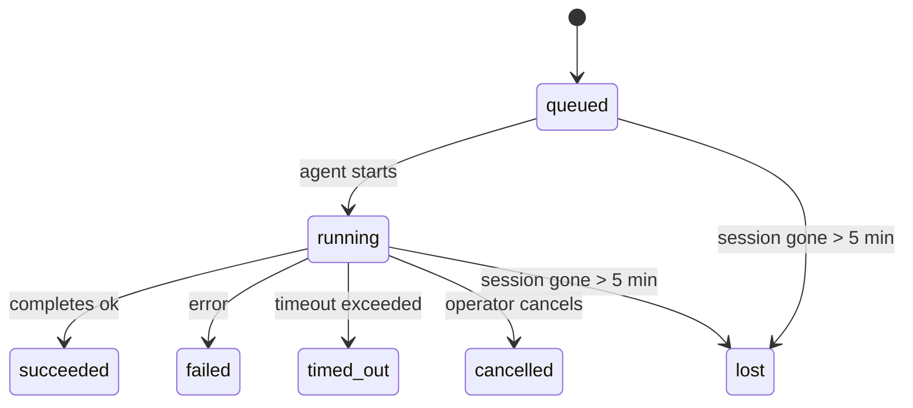

---
read_when:
    - Prüfen von laufenden oder kürzlich abgeschlossenen Hintergrundaufgaben
    - Debuggen von Zustellungsfehlern bei getrennten Agent-Ausführungen
    - Verstehen, wie Hintergrundläufe mit Sitzungen, Cron und Heartbeat zusammenhängen
sidebarTitle: Background tasks
summary: Nachverfolgung von Hintergrundaufgaben für ACP-Läufe, Subagents, isolierte Cron-Jobs und CLI-Vorgänge
title: Hintergrundaufgaben
x-i18n:
    generated_at: "2026-04-26T11:22:58Z"
    model: gpt-5.4
    provider: openai
    source_hash: 46952a378babdee9f43102bfa71dbd35b6ca7ecb142ffce3785eeb479e19d6b6
    source_path: automation/tasks.md
    workflow: 15
---

<Note>
Auf der Suche nach Planung? Siehe [Automation & Tasks](/de/automation), um den richtigen Mechanismus auszuwählen. Diese Seite behandelt die **Nachverfolgung** von Hintergrundaufgaben, nicht deren Planung.
</Note>

Hintergrundaufgaben verfolgen Arbeit, die **außerhalb Ihrer Haupt-Konversationssitzung** ausgeführt wird: ACP-Läufe, Subagent-Starts, isolierte Cron-Job-Ausführungen und durch die CLI initiierte Vorgänge.

Aufgaben ersetzen **nicht** Sitzungen, Cron-Jobs oder Heartbeats — sie sind das **Aktivitätsprotokoll**, das aufzeichnet, welche getrennte Arbeit stattgefunden hat, wann sie stattgefunden hat und ob sie erfolgreich war.

<Note>
Nicht jeder Agent-Lauf erstellt eine Aufgabe. Heartbeat-Durchläufe und normaler interaktiver Chat tun das nicht. Alle Cron-Ausführungen, ACP-Starts, Subagent-Starts und CLI-Agent-Befehle tun es.
</Note>

## Kurzfassung

- Aufgaben sind **Einträge**, keine Planer — Cron und Heartbeat entscheiden, _wann_ Arbeit ausgeführt wird, Aufgaben verfolgen, _was passiert ist_.
- ACP, Subagents, alle Cron-Jobs und CLI-Vorgänge erstellen Aufgaben. Heartbeat-Durchläufe nicht.
- Jede Aufgabe durchläuft `queued → running → terminal` (succeeded, failed, timed_out, cancelled oder lost).
- Cron-Aufgaben bleiben aktiv, solange die Cron-Laufzeitumgebung den Job noch besitzt; wenn der In-Memory-Zustand der Laufzeitumgebung nicht mehr vorhanden ist, prüft die Aufgabenwartung zuerst den dauerhaften Cron-Laufverlauf, bevor eine Aufgabe als lost markiert wird.
- Der Abschluss ist Push-gesteuert: Getrennte Arbeit kann direkt benachrichtigen oder die anfordernde Sitzung/den Heartbeat wecken, wenn sie abgeschlossen ist, daher sind Status-Polling-Schleifen meist die falsche Herangehensweise.
- Isolierte Cron-Läufe und Subagent-Abschlüsse bereinigen nach bestem Bemühen verfolgte Browser-Tabs/Prozesse für ihre untergeordnete Sitzung vor der abschließenden Bereinigungsbuchführung.
- Die Zustellung isolierter Cron-Läufe unterdrückt veraltete vorläufige Antworten der übergeordneten Instanz, solange die Arbeit nachgeordneter Subagents noch ausläuft, und bevorzugt die endgültige Ausgabe nachgeordneter Instanzen, wenn diese vor der Zustellung eintrifft.
- Abschlussbenachrichtigungen werden direkt an einen Kanal zugestellt oder für den nächsten Heartbeat in die Warteschlange gestellt.
- `openclaw tasks list` zeigt alle Aufgaben; `openclaw tasks audit` macht Probleme sichtbar.
- Terminal-Einträge werden 7 Tage aufbewahrt und dann automatisch entfernt.

## Schnellstart

<Tabs>
  <Tab title="Auflisten und filtern">
    ```bash
    # Alle Aufgaben auflisten (neueste zuerst)
    openclaw tasks list

    # Nach Laufzeit oder Status filtern
    openclaw tasks list --runtime acp
    openclaw tasks list --status running
    ```

  </Tab>
  <Tab title="Prüfen">
    ```bash
    # Details für eine bestimmte Aufgabe anzeigen (nach ID, Lauf-ID oder Sitzungsschlüssel)
    openclaw tasks show <lookup>
    ```
  </Tab>
  <Tab title="Abbrechen und benachrichtigen">
    ```bash
    # Eine laufende Aufgabe abbrechen (beendet die untergeordnete Sitzung)
    openclaw tasks cancel <lookup>

    # Benachrichtigungsrichtlinie für eine Aufgabe ändern
    openclaw tasks notify <lookup> state_changes
    ```

  </Tab>
  <Tab title="Audit und Wartung">
    ```bash
    # Einen Integritätsaudit ausführen
    openclaw tasks audit

    # Wartung als Vorschau anzeigen oder anwenden
    openclaw tasks maintenance
    openclaw tasks maintenance --apply
    ```

  </Tab>
  <Tab title="TaskFlow">
    ```bash
    # TaskFlow-Zustand prüfen
    openclaw tasks flow list
    openclaw tasks flow show <lookup>
    openclaw tasks flow cancel <lookup>
    ```
  </Tab>
</Tabs>

## Was eine Aufgabe erstellt

| Quelle                 | Laufzeittyp | Wann ein Aufgabeneintrag erstellt wird                 | Standard-Benachrichtigungsrichtlinie |
| ---------------------- | ----------- | ------------------------------------------------------ | ------------------------------------ |
| ACP-Hintergrundläufe   | `acp`       | Starten einer untergeordneten ACP-Sitzung              | `done_only`                          |
| Subagent-Orchestrierung | `subagent` | Starten eines Subagent über `sessions_spawn`           | `done_only`                          |
| Cron-Jobs (alle Typen) | `cron`      | Jede Cron-Ausführung (Hauptsitzung und isoliert)       | `silent`                             |
| CLI-Vorgänge           | `cli`       | `openclaw agent`-Befehle, die über das Gateway laufen  | `silent`                             |
| Agent-Medienjobs       | `cli`       | Sitzungsgebundene `video_generate`-Läufe               | `silent`                             |

<AccordionGroup>
  <Accordion title="Benachrichtigungsstandards für Cron und Medien">
    Cron-Aufgaben der Hauptsitzung verwenden standardmäßig die Benachrichtigungsrichtlinie `silent` — sie erstellen Einträge zur Nachverfolgung, erzeugen aber keine Benachrichtigungen. Isolierte Cron-Aufgaben verwenden ebenfalls standardmäßig `silent`, sind aber sichtbarer, weil sie in ihrer eigenen Sitzung laufen.

    Sitzungsgebundene `video_generate`-Läufe verwenden ebenfalls standardmäßig die Benachrichtigungsrichtlinie `silent`. Sie erstellen trotzdem Aufgabeneinträge, aber der Abschluss wird als internes Wecksignal an die ursprüngliche Agent-Sitzung zurückgegeben, damit der Agent selbst die Nachfolgenachricht schreiben und das fertige Video anhängen kann. Wenn Sie `tools.media.asyncCompletion.directSend` aktivieren, versuchen asynchrone `music_generate`- und `video_generate`-Abschlüsse zuerst die direkte Kanalzustellung, bevor sie auf den Weckpfad der anfordernden Sitzung zurückfallen.

  </Accordion>
  <Accordion title="Schutzmaßnahme gegen gleichzeitige video_generate-Aufrufe">
    Solange eine sitzungsgebundene `video_generate`-Aufgabe noch aktiv ist, fungiert das Tool auch als Schutzmaßnahme: Wiederholte `video_generate`-Aufrufe in derselben Sitzung geben den Status der aktiven Aufgabe zurück, statt eine zweite gleichzeitige Generierung zu starten. Verwenden Sie `action: "status"`, wenn Sie auf Agent-Seite eine explizite Fortschritts-/Statusabfrage möchten.
  </Accordion>
  <Accordion title="Was keine Aufgaben erstellt">
    - Heartbeat-Durchläufe — Hauptsitzung; siehe [Heartbeat](/de/gateway/heartbeat)
    - Normale interaktive Chat-Durchläufe
    - Direkte `/command`-Antworten

  </Accordion>
</AccordionGroup>

## Aufgabenlebenszyklus



| Status      | Bedeutung                                                                |
| ----------- | ------------------------------------------------------------------------ |
| `queued`    | Erstellt, wartet auf den Start des Agent                                 |
| `running`   | Der Agent-Durchlauf wird aktiv ausgeführt                                |
| `succeeded` | Erfolgreich abgeschlossen                                                |
| `failed`    | Mit einem Fehler abgeschlossen                                           |
| `timed_out` | Das konfigurierte Timeout wurde überschritten                            |
| `cancelled` | Vom Operator über `openclaw tasks cancel` gestoppt                       |
| `lost`      | Die Laufzeitumgebung hat nach einer Karenzzeit von 5 Minuten den maßgeblichen Basiszustand verloren |

Übergänge erfolgen automatisch — wenn der zugehörige Agent-Lauf endet, wird der Aufgabenstatus entsprechend aktualisiert.

Der Abschluss des Agent-Laufs ist für aktive Aufgabeneinträge maßgeblich. Ein erfolgreicher getrennter Lauf wird als `succeeded` abgeschlossen, gewöhnliche Laufzeitfehler als `failed`, und Timeout- oder Abbruchergebnisse als `timed_out`. Wenn ein Operator die Aufgabe bereits abgebrochen hat oder die Laufzeitumgebung bereits einen stärkeren Terminal-Status wie `failed`, `timed_out` oder `lost` aufgezeichnet hat, stuft ein späteres Erfolgssignal diesen Terminal-Status nicht herab.

`lost` ist laufzeitbewusst:

- ACP-Aufgaben: Metadaten der zugrunde liegenden untergeordneten ACP-Sitzung sind verschwunden.
- Subagent-Aufgaben: Die zugrunde liegende untergeordnete Sitzung ist aus dem Zielspeicher des Agent verschwunden.
- Cron-Aufgaben: Die Cron-Laufzeitumgebung verfolgt den Job nicht mehr als aktiv, und der dauerhafte Cron-Laufverlauf zeigt für diesen Lauf kein Terminal-Ergebnis. Ein Offline-CLI-Audit behandelt seinen eigenen leeren In-Process-Cron-Laufzeitstatus nicht als maßgeblich.
- CLI-Aufgaben: Aufgaben mit isolierter untergeordneter Sitzung verwenden die untergeordnete Sitzung; chatgebundene CLI-Aufgaben verwenden stattdessen den aktiven Laufkontext, sodass verbleibende Sitzungszeilen für Kanal/Gruppe/Direktnachricht sie nicht aktiv halten. Gateway-gestützte `openclaw agent`-Läufe werden ebenfalls anhand ihres Laufergebnisses abgeschlossen, sodass abgeschlossene Läufe nicht aktiv bleiben, bis der Sweeper sie als `lost` markiert.

## Zustellung und Benachrichtigungen

Wenn eine Aufgabe einen Terminal-Status erreicht, benachrichtigt OpenClaw Sie. Es gibt zwei Zustellpfade:

**Direkte Zustellung** — wenn die Aufgabe ein Kanalziel hat (den `requesterOrigin`), geht die Abschlussnachricht direkt an diesen Kanal (Telegram, Discord, Slack usw.). Bei Subagent-Abschlüssen bewahrt OpenClaw außerdem gebundene Thread-/Themenweiterleitung, wenn verfügbar, und kann ein fehlendes `to` / Konto aus der gespeicherten Route der anfordernden Sitzung (`lastChannel` / `lastTo` / `lastAccountId`) ergänzen, bevor die direkte Zustellung aufgegeben wird.

**Sitzungsbasierte Warteschlangenzustellung** — wenn die direkte Zustellung fehlschlägt oder kein Ursprung gesetzt ist, wird das Update als Systemereignis in die Warteschlange der anfordernden Sitzung gestellt und beim nächsten Heartbeat sichtbar.

<Tip>
Der Aufgabenabschluss löst ein sofortiges Heartbeat-Wecksignal aus, damit Sie das Ergebnis schnell sehen — Sie müssen nicht auf den nächsten geplanten Heartbeat-Takt warten.
</Tip>

Das bedeutet, dass der übliche Ablauf Push-basiert ist: Starten Sie getrennte Arbeit einmal und lassen Sie sich dann von der Laufzeitumgebung bei Abschluss wecken oder benachrichtigen. Fragen Sie den Aufgabenstatus nur ab, wenn Sie Debugging, Eingriffe oder ein explizites Audit benötigen.

### Benachrichtigungsrichtlinien

Steuern Sie, wie viel Sie über jede Aufgabe erfahren:

| Richtlinie            | Was zugestellt wird                                                      |
| --------------------- | ------------------------------------------------------------------------ |
| `done_only` (Standard) | Nur Terminal-Status (succeeded, failed usw.) — **das ist der Standard** |
| `state_changes`       | Jeder Statusübergang und jedes Fortschrittsupdate                        |
| `silent`              | Gar nichts                                                               |

Ändern Sie die Richtlinie, während eine Aufgabe läuft:

```bash
openclaw tasks notify <lookup> state_changes
```

## CLI-Referenz

<AccordionGroup>
  <Accordion title="tasks list">
    ```bash
    openclaw tasks list [--runtime <acp|subagent|cron|cli>] [--status <status>] [--json]
    ```

    Ausgabespalten: Aufgaben-ID, Art, Status, Zustellung, Lauf-ID, untergeordnete Sitzung, Zusammenfassung.

  </Accordion>
  <Accordion title="tasks show">
    ```bash
    openclaw tasks show <lookup>
    ```

    Das Lookup-Token akzeptiert eine Aufgaben-ID, Lauf-ID oder einen Sitzungsschlüssel. Es zeigt den vollständigen Eintrag einschließlich Zeitangaben, Zustellstatus, Fehler und Terminal-Zusammenfassung.

  </Accordion>
  <Accordion title="tasks cancel">
    ```bash
    openclaw tasks cancel <lookup>
    ```

    Bei ACP- und Subagent-Aufgaben beendet dies die untergeordnete Sitzung. Bei CLI-verfolgten Aufgaben wird der Abbruch im Aufgabenregister aufgezeichnet (es gibt keinen separaten untergeordneten Laufzeit-Handle). Der Status wechselt zu `cancelled`, und falls zutreffend wird eine Zustellbenachrichtigung gesendet.

  </Accordion>
  <Accordion title="tasks notify">
    ```bash
    openclaw tasks notify <lookup> <done_only|state_changes|silent>
    ```
  </Accordion>
  <Accordion title="tasks audit">
    ```bash
    openclaw tasks audit [--json]
    ```

    Macht betriebliche Probleme sichtbar. Erkenntnisse erscheinen auch in `openclaw status`, wenn Probleme erkannt werden.

    | Erkenntnis               | Schweregrad | Auslöser                                                                                                     |
| ------------------------ | ----------- | ------------------------------------------------------------------------------------------------------------ |
| `stale_queued`           | warn        | Mehr als 10 Minuten in der Warteschlange                                                                     |
| `stale_running`          | error       | Mehr als 30 Minuten in Ausführung                                                                            |
| `lost`                   | warn/error  | Laufzeitgestützte Aufgabenverantwortung ist verschwunden; beibehaltene verlorene Aufgaben warnen bis `cleanupAfter`, danach werden sie zu Fehlern |
| `delivery_failed`        | warn        | Zustellung fehlgeschlagen und Benachrichtigungsrichtlinie ist nicht `silent`                                 |
| `missing_cleanup`        | warn        | Terminal-Aufgabe ohne Cleanup-Zeitstempel                                                                    |
| `inconsistent_timestamps` | warn       | Verletzung der Zeitachse (zum Beispiel Ende vor Start)                                                       |

  </Accordion>
  <Accordion title="tasks maintenance">
    ```bash
    openclaw tasks maintenance [--json]
    openclaw tasks maintenance --apply [--json]
    ```

    Verwenden Sie dies, um Abgleich, Cleanup-Zeitstempelung und Bereinigung für Aufgaben- und TaskFlow-Zustand als Vorschau anzuzeigen oder anzuwenden.

    Der Abgleich ist laufzeitbewusst:

    - ACP-/Subagent-Aufgaben prüfen ihre zugrunde liegende untergeordnete Sitzung.
    - Cron-Aufgaben prüfen, ob die Cron-Laufzeitumgebung den Job noch besitzt, und stellen dann den Terminal-Status aus den gespeicherten Cron-Laufprotokollen/Job-Zuständen wieder her, bevor sie auf `lost` zurückfallen. Nur der Gateway-Prozess ist maßgeblich für die In-Memory-Menge aktiver Cron-Jobs; ein Offline-CLI-Audit nutzt den dauerhaften Verlauf, markiert eine Cron-Aufgabe aber nicht allein deshalb als lost, weil diese lokale Set leer ist.
    - Chatgebundene CLI-Aufgaben prüfen den besitzenden aktiven Laufkontext, nicht nur die Chat-Sitzungszeile.

    Auch der Completion-Cleanup ist laufzeitbewusst:

    - Der Abschluss von Subagents schließt nach bestem Bemühen verfolgte Browser-Tabs/Prozesse für die untergeordnete Sitzung, bevor der Cleanup für die Ankündigung fortgesetzt wird.
    - Der Abschluss isolierter Cron-Läufe schließt nach bestem Bemühen verfolgte Browser-Tabs/Prozesse für die Cron-Sitzung, bevor der Lauf vollständig beendet wird.
    - Die Zustellung isolierter Cron-Läufe wartet bei Bedarf nachgelagerte Subagent-Nachverfolgung ab und unterdrückt veralteten Bestätigungstext der übergeordneten Instanz, statt ihn anzukündigen.
    - Die Zustellung beim Abschluss von Subagents bevorzugt den neuesten sichtbaren Assistant-Text; ist dieser leer, fällt sie auf bereinigten neuesten tool-/toolResult-Text zurück, und reine Tool-Call-Läufe mit Timeout können auf eine kurze Zusammenfassung des Teilfortschritts reduziert werden. Terminal fehlgeschlagene Läufe kündigen den Fehlerstatus an, ohne erfassten Antworttext erneut wiederzugeben.
    - Cleanup-Fehler verdecken nicht das tatsächliche Aufgabenergebnis.

  </Accordion>
  <Accordion title="tasks flow list | show | cancel">
    ```bash
    openclaw tasks flow list [--status <status>] [--json]
    openclaw tasks flow show <lookup> [--json]
    openclaw tasks flow cancel <lookup>
    ```

    Verwenden Sie diese Befehle, wenn Sie sich für den orchestrierenden TaskFlow interessieren und nicht für einen einzelnen Hintergrundaufgabeneintrag.

  </Accordion>
</AccordionGroup>

## Chat-Aufgabenboard (`/tasks`)

Verwenden Sie `/tasks` in jeder Chat-Sitzung, um Hintergrundaufgaben anzuzeigen, die mit dieser Sitzung verknüpft sind. Das Board zeigt aktive und kürzlich abgeschlossene Aufgaben mit Laufzeit, Status, Zeitangaben sowie Fortschritts- oder Fehlerdetails.

Wenn die aktuelle Sitzung keine sichtbaren verknüpften Aufgaben hat, greift `/tasks` auf agent-lokale Aufgabenzählungen zurück, sodass Sie weiterhin einen Überblick erhalten, ohne Details anderer Sitzungen preiszugeben.

Für das vollständige Operator-Protokoll verwenden Sie die CLI: `openclaw tasks list`.

## Statusintegration (Aufgabendruck)

`openclaw status` enthält eine Aufgabenübersicht auf einen Blick:

```
Tasks: 3 queued · 2 running · 1 issues
```

Die Zusammenfassung meldet:

- **active** — Anzahl von `queued` + `running`
- **failures** — Anzahl von `failed` + `timed_out` + `lost`
- **byRuntime** — Aufschlüsselung nach `acp`, `subagent`, `cron`, `cli`

Sowohl `/status` als auch das Tool `session_status` verwenden einen Cleanup-bewussten Aufgaben-Snapshot: Aktive Aufgaben werden bevorzugt, veraltete abgeschlossene Zeilen werden ausgeblendet, und aktuelle Fehler werden nur angezeigt, wenn keine aktive Arbeit mehr vorhanden ist. So bleibt die Statuskarte auf das fokussiert, was gerade wichtig ist.

## Speicherung und Wartung

### Wo Aufgaben gespeichert werden

Aufgabeneinträge werden in SQLite gespeichert unter:

```
$OPENCLAW_STATE_DIR/tasks/runs.sqlite
```

Das Register wird beim Start des Gateway in den Speicher geladen und synchronisiert Schreibvorgänge zur SQLite-Datenbank, um Dauerhaftigkeit über Neustarts hinweg sicherzustellen.

### Automatische Wartung

Ein Sweeper läuft alle **60 Sekunden** und übernimmt drei Dinge:

<Steps>
  <Step title="Abgleich">
    Prüft, ob aktive Aufgaben noch einen maßgeblichen Laufzeit-Unterbau haben. ACP-/Subagent-Aufgaben verwenden den Zustand der untergeordneten Sitzung, Cron-Aufgaben die Verantwortlichkeit für aktive Jobs und chatgebundene CLI-Aufgaben den besitzenden Laufkontext. Wenn dieser Basiszustand länger als 5 Minuten nicht mehr vorhanden ist, wird die Aufgabe als `lost` markiert.
  </Step>
  <Step title="Cleanup-Zeitstempelung">
    Setzt einen Zeitstempel `cleanupAfter` auf Terminal-Aufgaben (`endedAt + 7 Tage`). Während der Aufbewahrung erscheinen verlorene Aufgaben im Audit weiterhin als Warnungen; nach Ablauf von `cleanupAfter` oder bei fehlenden Cleanup-Metadaten werden sie zu Fehlern.
  </Step>
  <Step title="Bereinigung">
    Löscht Einträge nach Erreichen ihres Datums `cleanupAfter`.
  </Step>
</Steps>

<Note>
**Aufbewahrung:** Terminal-Aufgabeneinträge werden **7 Tage** lang aufbewahrt und dann automatisch bereinigt. Keine Konfiguration erforderlich.
</Note>

## Wie Aufgaben mit anderen Systemen zusammenhängen

<AccordionGroup>
  <Accordion title="Aufgaben und TaskFlow">
    [TaskFlow](/de/automation/taskflow) ist die Flow-Orchestrierungsebene über Hintergrundaufgaben. Ein einzelner Flow kann im Laufe seiner Lebensdauer mehrere Aufgaben koordinieren, indem er verwaltete oder gespiegelte Synchronisierungsmodi verwendet. Verwenden Sie `openclaw tasks`, um einzelne Aufgabeneinträge zu prüfen, und `openclaw tasks flow`, um den orchestrierenden Flow zu prüfen.

    Siehe [TaskFlow](/de/automation/taskflow) für Details.

  </Accordion>
  <Accordion title="Aufgaben und Cron">
    Eine Cron-Job-**Definition** liegt in `~/.openclaw/cron/jobs.json`; der Laufzeit-Ausführungszustand liegt daneben in `~/.openclaw/cron/jobs-state.json`. **Jede** Cron-Ausführung erstellt einen Aufgabeneintrag — sowohl in der Hauptsitzung als auch isoliert. Cron-Aufgaben der Hauptsitzung verwenden standardmäßig die Benachrichtigungsrichtlinie `silent`, sodass sie nachverfolgt werden, ohne Benachrichtigungen zu erzeugen.

    Siehe [Cron Jobs](/de/automation/cron-jobs).

  </Accordion>
  <Accordion title="Aufgaben und Heartbeat">
    Heartbeat-Läufe sind Durchläufe der Hauptsitzung — sie erstellen keine Aufgabeneinträge. Wenn eine Aufgabe abgeschlossen wird, kann sie ein Heartbeat-Wecksignal auslösen, damit Sie das Ergebnis zeitnah sehen.

    Siehe [Heartbeat](/de/gateway/heartbeat).

  </Accordion>
  <Accordion title="Aufgaben und Sitzungen">
    Eine Aufgabe kann auf einen `childSessionKey` verweisen (wo die Arbeit läuft) und auf einen `requesterSessionKey` (wer sie gestartet hat). Sitzungen sind Konversationskontext; Aufgaben sind die darauf aufbauende Aktivitätsnachverfolgung.
  </Accordion>
  <Accordion title="Aufgaben und Agent-Läufe">
    Die `runId` einer Aufgabe verweist auf den Agent-Lauf, der die Arbeit ausführt. Lebenszyklusereignisse des Agent (Start, Ende, Fehler) aktualisieren den Aufgabenstatus automatisch — Sie müssen den Lebenszyklus nicht manuell verwalten.
  </Accordion>
</AccordionGroup>

## Verwandt

- [Automation & Tasks](/de/automation) — alle Automatisierungsmechanismen auf einen Blick
- [CLI: Tasks](/de/cli/tasks) — CLI-Befehlsreferenz
- [Heartbeat](/de/gateway/heartbeat) — periodische Durchläufe der Hauptsitzung
- [Scheduled Tasks](/de/automation/cron-jobs) — Planung von Hintergrundarbeit
- [Task Flow](/de/automation/taskflow) — Flow-Orchestrierung über Aufgaben
