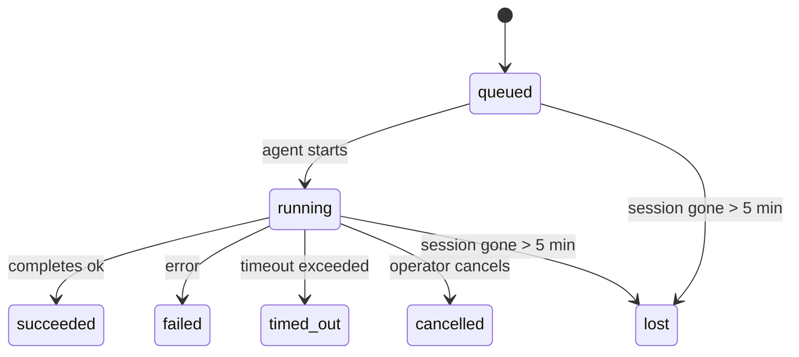

---
read_when:
    - Untersuchen von laufenden oder kürzlich abgeschlossenen Hintergrundaufgaben
    - Debuggen von Zustellungsfehlern bei entkoppelten Agent-Läufen
    - Verstehen, wie Hintergrundläufe mit Sitzungen, Cron und Heartbeat zusammenhängen
summary: Hintergrundaufgabenverfolgung für ACP-Läufe, Subagents, isolierte Cron-Jobs und CLI-Vorgänge
title: Hintergrundaufgaben
x-i18n:
    generated_at: "2026-04-23T06:25:20Z"
    model: gpt-5.4
    provider: openai
    source_hash: 5cd0b0db6c20cc677aa5cc50c42e09043d4354e026ca33c020d804761c331413
    source_path: automation/tasks.md
    workflow: 15
---

# Hintergrundaufgaben

> **Suchen Sie nach Planung?** Unter [Automation & Tasks](/de/automation) finden Sie die passende Mechanismuswahl. Diese Seite behandelt die **Nachverfolgung** von Hintergrundarbeit, nicht deren Planung.

Hintergrundaufgaben verfolgen Arbeit, die **außerhalb Ihrer Haupt-Unterhaltungssitzung** ausgeführt wird:
ACP-Läufe, Subagent-Starts, isolierte Cron-Job-Ausführungen und über die CLI gestartete Vorgänge.

Aufgaben ersetzen **keine** Sitzungen, Cron-Jobs oder Heartbeats — sie sind das **Aktivitätsprotokoll**, das festhält, welche entkoppelte Arbeit stattgefunden hat, wann sie stattgefunden hat und ob sie erfolgreich war.

<Note>
Nicht jeder Agent-Lauf erstellt eine Aufgabe. Heartbeat-Durchläufe und normaler interaktiver Chat tun das nicht. Alle Cron-Ausführungen, ACP-Starts, Subagent-Starts und CLI-Agent-Befehle tun es.
</Note>

## Kurzfassung

- Aufgaben sind **Datensätze**, keine Planer — Cron und Heartbeat entscheiden, _wann_ Arbeit ausgeführt wird, Aufgaben verfolgen, _was passiert ist_.
- ACP, Subagents, alle Cron-Jobs und CLI-Vorgänge erstellen Aufgaben. Heartbeat-Durchläufe nicht.
- Jede Aufgabe durchläuft `queued → running → terminal` (succeeded, failed, timed_out, cancelled oder lost).
- Cron-Aufgaben bleiben aktiv, solange die Cron-Laufzeitumgebung den Job noch besitzt; Chat-gestützte CLI-Aufgaben bleiben nur aktiv, solange ihr besitzender Laufkontext noch aktiv ist.
- Der Abschluss ist push-gesteuert: Entkoppelte Arbeit kann direkt benachrichtigen oder die anfragende Sitzung/den Heartbeat wecken, wenn sie abgeschlossen ist, daher haben Status-Polling-Schleifen normalerweise die falsche Form.
- Isolierte Cron-Läufe und Subagent-Abschlüsse bereinigen nach bestem Bemühen verfolgte Browser-Tabs/Prozesse für ihre untergeordnete Sitzung vor der abschließenden Bereinigungsbuchführung.
- Die Zustellung isolierter Cron-Läufe unterdrückt veraltete vorläufige Antworten der übergeordneten Instanz, während nachgelagerte Subagent-Arbeit noch ausläuft, und bevorzugt die endgültige nachgelagerte Ausgabe, wenn diese vor der Zustellung eintrifft.
- Abschlussbenachrichtigungen werden direkt an einen Kanal zugestellt oder für den nächsten Heartbeat in die Warteschlange gestellt.
- `openclaw tasks list` zeigt alle Aufgaben; `openclaw tasks audit` macht auf Probleme aufmerksam.
- Terminal-Datensätze werden 7 Tage lang aufbewahrt und dann automatisch bereinigt.

## Schnellstart

```bash
# Alle Aufgaben auflisten (neueste zuerst)
openclaw tasks list

# Nach Laufzeitumgebung oder Status filtern
openclaw tasks list --runtime acp
openclaw tasks list --status running

# Details für eine bestimmte Aufgabe anzeigen (nach ID, Run-ID oder Sitzungsschlüssel)
openclaw tasks show <lookup>

# Eine laufende Aufgabe abbrechen (beendet die untergeordnete Sitzung)
openclaw tasks cancel <lookup>

# Benachrichtigungsrichtlinie für eine Aufgabe ändern
openclaw tasks notify <lookup> state_changes

# Integritätsprüfung ausführen
openclaw tasks audit

# Wartung vorschauen oder anwenden
openclaw tasks maintenance
openclaw tasks maintenance --apply

# TaskFlow-Status prüfen
openclaw tasks flow list
openclaw tasks flow show <lookup>
openclaw tasks flow cancel <lookup>
```

## Was eine Aufgabe erstellt

| Quelle                   | Laufzeittyp  | Wann ein Aufgabendatensatz erstellt wird              | Standard-Benachrichtigungsrichtlinie |
| ------------------------ | ------------ | ----------------------------------------------------- | ------------------------------------ |
| ACP-Hintergrundläufe     | `acp`        | Starten einer untergeordneten ACP-Sitzung             | `done_only`                          |
| Subagent-Orchestrierung  | `subagent`   | Starten eines Subagent über `sessions_spawn`          | `done_only`                          |
| Cron-Jobs (alle Typen)   | `cron`       | Jede Cron-Ausführung (Hauptsitzung und isoliert)      | `silent`                             |
| CLI-Vorgänge             | `cli`        | `openclaw agent`-Befehle, die über das Gateway laufen | `silent`                             |
| Agent-Medienjobs         | `cli`        | Sitzungsgestützte `video_generate`-Läufe              | `silent`                             |

Cron-Aufgaben der Hauptsitzung verwenden standardmäßig die Benachrichtigungsrichtlinie `silent` — sie erstellen Datensätze zur Nachverfolgung, erzeugen aber keine Benachrichtigungen. Isolierte Cron-Aufgaben verwenden ebenfalls standardmäßig `silent`, sind jedoch sichtbarer, weil sie in ihrer eigenen Sitzung laufen.

Sitzungsgestützte `video_generate`-Läufe verwenden ebenfalls standardmäßig die Benachrichtigungsrichtlinie `silent`. Sie erstellen weiterhin Aufgabendatensätze, aber der Abschluss wird als internes Wecksignal an die ursprüngliche Agent-Sitzung zurückgegeben, damit der Agent die Folgenachricht schreiben und das fertige Video selbst anhängen kann. Wenn Sie `tools.media.asyncCompletion.directSend` aktivieren, versuchen asynchrone `music_generate`- und `video_generate`-Abschlüsse zuerst die direkte Kanalzustellung, bevor sie auf den Weckpfad der anfragenden Sitzung zurückfallen.

Solange eine sitzungsgestützte `video_generate`-Aufgabe noch aktiv ist, fungiert das Tool auch als Leitplanke: Wiederholte `video_generate`-Aufrufe in derselben Sitzung geben den Status der aktiven Aufgabe zurück, statt eine zweite gleichzeitige Generierung zu starten. Verwenden Sie `action: "status"`, wenn Sie explizit einen Fortschritts-/Statusabruf von Agent-Seite aus möchten.

**Was keine Aufgaben erstellt:**

- Heartbeat-Durchläufe — Hauptsitzung; siehe [Heartbeat](/de/gateway/heartbeat)
- Normale interaktive Chat-Durchläufe
- Direkte `/command`-Antworten

## Aufgabenlebenszyklus



| Status      | Bedeutung                                                                 |
| ----------- | ------------------------------------------------------------------------- |
| `queued`    | Erstellt, wartet darauf, dass der Agent startet                           |
| `running`   | Der Agent-Durchlauf wird aktiv ausgeführt                                 |
| `succeeded` | Erfolgreich abgeschlossen                                                 |
| `failed`    | Mit einem Fehler abgeschlossen                                            |
| `timed_out` | Das konfigurierte Timeout wurde überschritten                             |
| `cancelled` | Vom Bediener über `openclaw tasks cancel` gestoppt                        |
| `lost`      | Die Laufzeitumgebung hat nach einer Kulanzfrist von 5 Minuten den maßgeblichen Trägerstatus verloren |

Übergänge passieren automatisch — wenn der zugehörige Agent-Lauf endet, wird der Aufgabenstatus entsprechend aktualisiert.

`lost` ist laufzeitbewusst:

- ACP-Aufgaben: Metadaten der zugrunde liegenden ACP-Untergeordnetensitzung sind verschwunden.
- Subagent-Aufgaben: Zugrunde liegende untergeordnete Sitzung ist aus dem Ziel-Agent-Speicher verschwunden.
- Cron-Aufgaben: Die Cron-Laufzeitumgebung verfolgt den Job nicht mehr als aktiv.
- CLI-Aufgaben: Isolierte Aufgaben mit untergeordneter Sitzung verwenden die untergeordnete Sitzung; Chat-gestützte CLI-Aufgaben verwenden stattdessen den aktiven Laufkontext, daher halten verbleibende Kanal-/Gruppen-/Direktsitzungszeilen sie nicht aktiv.

## Zustellung und Benachrichtigungen

Wenn eine Aufgabe einen Terminal-Zustand erreicht, benachrichtigt OpenClaw Sie. Es gibt zwei Zustellpfade:

**Direkte Zustellung** — wenn die Aufgabe ein Kanalziel hat (den `requesterOrigin`), geht die Abschlussnachricht direkt an diesen Kanal (Telegram, Discord, Slack usw.). Bei Subagent-Abschlüssen bewahrt OpenClaw außerdem gebundenes Thread-/Topic-Routing, sofern verfügbar, und kann ein fehlendes `to` / Konto aus der gespeicherten Route der anfragenden Sitzung (`lastChannel` / `lastTo` / `lastAccountId`) ergänzen, bevor die direkte Zustellung aufgegeben wird.

**Sitzungswarteschlangen-Zustellung** — wenn die direkte Zustellung fehlschlägt oder kein Ursprung gesetzt ist, wird das Update als Systemereignis in der Sitzung des Anfragenden in die Warteschlange gestellt und beim nächsten Heartbeat angezeigt.

<Tip>
Der Abschluss einer Aufgabe löst sofort ein Heartbeat-Wecksignal aus, damit Sie das Ergebnis schnell sehen — Sie müssen nicht bis zum nächsten geplanten Heartbeat-Takt warten.
</Tip>

Das bedeutet, dass der übliche Ablauf push-basiert ist: Entkoppelte Arbeit einmal starten und dann die Laufzeitumgebung Sie bei Abschluss wecken oder benachrichtigen lassen. Fragen Sie den Aufgabenstatus nur dann ab, wenn Sie Debugging, Eingriffe oder eine explizite Prüfung benötigen.

### Benachrichtigungsrichtlinien

Steuern Sie, wie viel Sie über jede Aufgabe erfahren:

| Richtlinie            | Was zugestellt wird                                                        |
| --------------------- | -------------------------------------------------------------------------- |
| `done_only` (Standard) | Nur der Terminal-Zustand (succeeded, failed usw.) — **dies ist der Standard** |
| `state_changes`       | Jeder Zustandsübergang und jede Fortschrittsaktualisierung                 |
| `silent`              | Überhaupt nichts                                                           |

Ändern Sie die Richtlinie, während eine Aufgabe läuft:

```bash
openclaw tasks notify <lookup> state_changes
```

## CLI-Referenz

### `tasks list`

```bash
openclaw tasks list [--runtime <acp|subagent|cron|cli>] [--status <status>] [--json]
```

Ausgabespalten: Aufgaben-ID, Typ, Status, Zustellung, Run-ID, untergeordnete Sitzung, Zusammenfassung.

### `tasks show`

```bash
openclaw tasks show <lookup>
```

Das Lookup-Token akzeptiert eine Aufgaben-ID, Run-ID oder einen Sitzungsschlüssel. Zeigt den vollständigen Datensatz einschließlich Zeitangaben, Zustellstatus, Fehler und Terminal-Zusammenfassung.

### `tasks cancel`

```bash
openclaw tasks cancel <lookup>
```

Bei ACP- und Subagent-Aufgaben beendet dies die untergeordnete Sitzung. Bei CLI-verfolgten Aufgaben wird die Stornierung im Aufgabenregister erfasst (es gibt keinen separaten untergeordneten Laufzeit-Handle). Der Status wechselt zu `cancelled`, und eine Zustellbenachrichtigung wird gesendet, sofern zutreffend.

### `tasks notify`

```bash
openclaw tasks notify <lookup> <done_only|state_changes|silent>
```

### `tasks audit`

```bash
openclaw tasks audit [--json]
```

Macht auf betriebliche Probleme aufmerksam. Befunde erscheinen auch in `openclaw status`, wenn Probleme erkannt werden.

| Befund                    | Schweregrad | Auslöser                                              |
| ------------------------- | ----------- | ----------------------------------------------------- |
| `stale_queued`            | warn        | Mehr als 10 Minuten in der Warteschlange              |
| `stale_running`           | error       | Läuft seit mehr als 30 Minuten                        |
| `lost`                    | error       | Laufzeitgestützte Aufgabenverantwortung verschwunden  |
| `delivery_failed`         | warn        | Zustellung fehlgeschlagen und Benachrichtigungsrichtlinie ist nicht `silent` |
| `missing_cleanup`         | warn        | Terminal-Aufgabe ohne Bereinigungszeitstempel         |
| `inconsistent_timestamps` | warn        | Verletzung der Zeitleiste (zum Beispiel vor dem Start beendet) |

### `tasks maintenance`

```bash
openclaw tasks maintenance [--json]
openclaw tasks maintenance --apply [--json]
```

Verwenden Sie dies, um Abgleich, Bereinigungsmarkierung und Pruning für Aufgaben und den Task Flow-Status in der Vorschau zu sehen oder anzuwenden.

Der Abgleich ist laufzeitbewusst:

- ACP-/Subagent-Aufgaben prüfen ihre zugrunde liegende untergeordnete Sitzung.
- Cron-Aufgaben prüfen, ob die Cron-Laufzeitumgebung den Job noch besitzt.
- Chat-gestützte CLI-Aufgaben prüfen den besitzenden aktiven Laufkontext, nicht nur die Chat-Sitzungszeile.

Die Abschlussbereinigung ist ebenfalls laufzeitbewusst:

- Der Abschluss von Subagent bereinigt nach bestem Bemühen verfolgte Browser-Tabs/Prozesse für die untergeordnete Sitzung, bevor die weitere Ankündigungsbereinigung fortgesetzt wird.
- Der Abschluss isolierter Cron-Läufe bereinigt nach bestem Bemühen verfolgte Browser-Tabs/Prozesse für die Cron-Sitzung, bevor der Lauf vollständig heruntergefahren wird.
- Die Zustellung isolierter Cron-Läufe wartet bei Bedarf auf nachgelagerte Subagent-Nacharbeit und unterdrückt veralteten Bestätigungstext der übergeordneten Instanz, statt ihn anzukündigen.
- Die Zustellung des Subagent-Abschlusses bevorzugt den neuesten sichtbaren Assistant-Text; wenn dieser leer ist, fällt sie auf bereinigten neuesten `tool`-/`toolResult`-Text zurück, und reine Tool-Aufruf-Läufe mit Timeout können auf eine kurze Zusammenfassung des Teilfortschritts reduziert werden. Terminal fehlgeschlagene Läufe kündigen den Fehlerstatus an, ohne erfassten Antworttext erneut wiederzugeben.
- Bereinigungsfehler verdecken nicht das tatsächliche Aufgabenergebnis.

### `tasks flow list|show|cancel`

```bash
openclaw tasks flow list [--status <status>] [--json]
openclaw tasks flow show <lookup> [--json]
openclaw tasks flow cancel <lookup>
```

Verwenden Sie diese Befehle, wenn der orchestrierende TaskFlow das ist, was Sie interessiert, und nicht ein einzelner Hintergrundaufgabendatensatz.

## Chat-Aufgabenboard (`/tasks`)

Verwenden Sie `/tasks` in jeder Chat-Sitzung, um mit dieser Sitzung verknüpfte Hintergrundaufgaben anzuzeigen. Das Board zeigt aktive und kürzlich abgeschlossene Aufgaben mit Laufzeitumgebung, Status, Zeitangaben sowie Fortschritts- oder Fehlerdetails.

Wenn die aktuelle Sitzung keine sichtbar verknüpften Aufgaben hat, greift `/tasks` auf agent-lokale Aufgabenzahlen zurück,
damit Sie weiterhin einen Überblick erhalten, ohne Details anderer Sitzungen offenzulegen.

Für das vollständige Operator-Protokoll verwenden Sie die CLI: `openclaw tasks list`.

## Statusintegration (Aufgabendruck)

`openclaw status` enthält eine Aufgabenübersicht auf einen Blick:

```
Tasks: 3 queued · 2 running · 1 issues
```

Die Zusammenfassung meldet:

- **active** — Anzahl von `queued` + `running`
- **failures** — Anzahl von `failed` + `timed_out` + `lost`
- **byRuntime** — Aufschlüsselung nach `acp`, `subagent`, `cron`, `cli`

Sowohl `/status` als auch das Tool `session_status` verwenden einen bereinigungsbewussten Aufgaben-Snapshot: Aktive Aufgaben werden
bevorzugt, veraltete abgeschlossene Zeilen werden ausgeblendet, und aktuelle Fehler werden nur angezeigt, wenn keine aktive Arbeit
mehr verbleibt. Dadurch bleibt die Statuskarte auf das fokussiert, was gerade wichtig ist.

## Speicherung und Wartung

### Wo Aufgaben gespeichert werden

Aufgabendatensätze werden in SQLite gespeichert unter:

```
$OPENCLAW_STATE_DIR/tasks/runs.sqlite
```

Das Register wird beim Gateway-Start in den Arbeitsspeicher geladen und synchronisiert Schreibvorgänge mit SQLite, um Persistenz über Neustarts hinweg zu gewährleisten.

### Automatische Wartung

Ein Sweeper läuft alle **60 Sekunden** und übernimmt drei Dinge:

1. **Abgleich** — prüft, ob aktive Aufgaben noch einen maßgeblichen laufzeitgestützten Trägerstatus haben. ACP-/Subagent-Aufgaben verwenden den Status der untergeordneten Sitzung, Cron-Aufgaben verwenden die Eigentümerschaft aktiver Jobs, und Chat-gestützte CLI-Aufgaben verwenden den besitzenden Laufkontext. Wenn dieser Trägerstatus länger als 5 Minuten fehlt, wird die Aufgabe als `lost` markiert.
2. **Bereinigungsmarkierung** — setzt bei Terminal-Aufgaben einen Zeitstempel `cleanupAfter` (endedAt + 7 Tage).
3. **Pruning** — löscht Datensätze nach ihrem `cleanupAfter`-Datum.

**Aufbewahrung**: Terminal-Aufgabendatensätze werden **7 Tage** lang aufbewahrt und dann automatisch bereinigt. Keine Konfiguration erforderlich.

## Wie Aufgaben mit anderen Systemen zusammenhängen

### Aufgaben und Task Flow

[Task Flow](/de/automation/taskflow) ist die Flow-Orchestrierungsebene über den Hintergrundaufgaben. Ein einzelner Flow kann über seine Laufzeit hinweg mehrere Aufgaben koordinieren, indem er verwaltete oder gespiegelte Synchronisierungsmodi verwendet. Verwenden Sie `openclaw tasks`, um einzelne Aufgabendatensätze zu prüfen, und `openclaw tasks flow`, um den orchestrierenden Flow zu prüfen.

Siehe [Task Flow](/de/automation/taskflow) für Details.

### Aufgaben und Cron

Eine Cron-Job-**Definition** liegt in `~/.openclaw/cron/jobs.json`; der Laufzeit-Ausführungsstatus liegt daneben in `~/.openclaw/cron/jobs-state.json`. **Jede** Cron-Ausführung erstellt einen Aufgabendatensatz — sowohl in der Hauptsitzung als auch isoliert. Cron-Aufgaben der Hauptsitzung verwenden standardmäßig die Benachrichtigungsrichtlinie `silent`, sodass sie verfolgt werden, ohne Benachrichtigungen zu erzeugen.

Siehe [Cron Jobs](/de/automation/cron-jobs).

### Aufgaben und Heartbeat

Heartbeat-Läufe sind Durchläufe der Hauptsitzung — sie erstellen keine Aufgabendatensätze. Wenn eine Aufgabe abgeschlossen wird, kann sie ein Heartbeat-Wecksignal auslösen, damit Sie das Ergebnis zeitnah sehen.

Siehe [Heartbeat](/de/gateway/heartbeat).

### Aufgaben und Sitzungen

Eine Aufgabe kann auf einen `childSessionKey` verweisen (wo die Arbeit ausgeführt wird) und auf einen `requesterSessionKey` (wer sie gestartet hat). Sitzungen sind Unterhaltungskontext; Aufgaben sind eine darüberliegende Aktivitätsverfolgung.

### Aufgaben und Agent-Läufe

Die `runId` einer Aufgabe verweist auf den Agent-Lauf, der die Arbeit ausführt. Ereignisse im Agent-Lebenszyklus (Start, Ende, Fehler) aktualisieren den Aufgabenstatus automatisch — Sie müssen den Lebenszyklus nicht manuell verwalten.

## Verwandt

- [Automation & Tasks](/de/automation) — alle Automatisierungsmechanismen auf einen Blick
- [Task Flow](/de/automation/taskflow) — Flow-Orchestrierung über Aufgaben
- [Scheduled Tasks](/de/automation/cron-jobs) — Planung von Hintergrundarbeit
- [Heartbeat](/de/gateway/heartbeat) — periodische Durchläufe der Hauptsitzung
- [CLI: Tasks](/de/cli/tasks) — CLI-Befehlsreferenz
