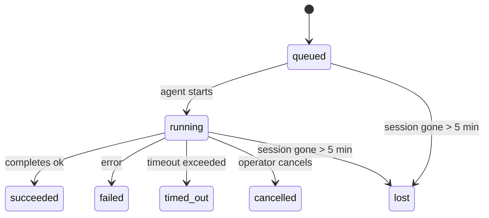

---
read_when:
    - Laufende oder kürzlich abgeschlossene Hintergrundarbeit prüfen
    - Debugging von Zustellfehlern bei abgekoppelten Agent-Ausführungen
    - Verstehen, wie Hintergrundausführungen mit Sitzungen, Cron und Heartbeat zusammenhängen
sidebarTitle: Background tasks
summary: Nachverfolgung von Hintergrundaufgaben für ACP-Ausführungen, Subagenten, isolierte Cron-Jobs und CLI-Operationen
title: Hintergrundaufgaben
x-i18n:
    generated_at: "2026-05-10T19:21:07Z"
    model: gpt-5.5
    provider: openai
    source_hash: 5764a89634f90181d826ff3990ec8dac9538239074934d30fd446c1eb4564869
    source_path: automation/tasks.md
    workflow: 16
---

<Note>
Suchen Sie nach Zeitplanung? Unter [Automatisierung und Aufgaben](/de/automation) finden Sie Hilfe bei der Auswahl des richtigen Mechanismus. Diese Seite ist das Aktivitätsprotokoll für Hintergrundarbeit, nicht der Scheduler.
</Note>

Hintergrundaufgaben verfolgen Arbeit, die **außerhalb Ihrer Haupt-Unterhaltungssitzung** ausgeführt wird: ACP-Ausführungen, Subagent-Starts, isolierte Cron-Job-Ausführungen und über die CLI gestartete Vorgänge.

Aufgaben ersetzen **keine** Sitzungen, Cron-Jobs oder Heartbeats - sie sind das **Aktivitätsprotokoll**, das aufzeichnet, welche entkoppelte Arbeit stattgefunden hat, wann sie passiert ist und ob sie erfolgreich war.

<Note>
Nicht jede Agent-Ausführung erstellt eine Aufgabe. Heartbeat-Runden und normaler interaktiver Chat tun das nicht. Alle Cron-Ausführungen, ACP-Starts, Subagent-Starts und CLI-Agent-Befehle tun es.
</Note>

## Kurzfassung

- Aufgaben sind **Datensätze**, keine Scheduler - Cron und Heartbeat entscheiden, _wann_ Arbeit ausgeführt wird, Aufgaben verfolgen, _was passiert ist_.
- ACP, Subagents, alle Cron-Jobs und CLI-Vorgänge erstellen Aufgaben. Heartbeat-Runden tun das nicht.
- Jede Aufgabe durchläuft `queued → running → terminal` (succeeded, failed, timed_out, cancelled oder lost).
- Cron-Aufgaben bleiben aktiv, solange die Cron-Laufzeit den Job noch besitzt; wenn der
  In-Memory-Laufzeitstatus verschwunden ist, prüft die Aufgabenwartung zuerst den dauerhaften
  Cron-Ausführungsverlauf, bevor eine Aufgabe als lost markiert wird.
- Der Abschluss ist Push-gesteuert: Entkoppelte Arbeit kann direkt benachrichtigen oder die
  anfragende Sitzung/den Heartbeat wecken, wenn sie fertig ist. Status-Polling-Schleifen haben
  daher meist die falsche Form.
- Isolierte Cron-Ausführungen und Subagent-Abschlüsse bereinigen nach bestem Aufwand nachverfolgte Browser-Tabs/Prozesse für ihre untergeordnete Sitzung, bevor die abschließende Bereinigungsbuchführung erfolgt.
- Die Zustellung isolierter Cron-Ausführungen unterdrückt veraltete zwischenzeitliche Antworten des übergeordneten Agents, solange nachgelagerte Subagent-Arbeit noch abläuft, und bevorzugt die endgültige Ausgabe des nachgelagerten Agents, wenn diese vor der Zustellung eintrifft.
- Abschlussbenachrichtigungen werden direkt an einen Kanal zugestellt oder für den nächsten Heartbeat in die Warteschlange gestellt.
- `openclaw tasks list` zeigt alle Aufgaben; `openclaw tasks audit` macht Probleme sichtbar.
- Terminale Datensätze werden 7 Tage lang aufbewahrt und dann automatisch bereinigt.

## Schnellstart

<Tabs>
  <Tab title="Auflisten und filtern">
    ```bash
    # List all tasks (newest first)
    openclaw tasks list

    # Filter by runtime or status
    openclaw tasks list --runtime acp
    openclaw tasks list --status running
    ```

  </Tab>
  <Tab title="Prüfen">
    ```bash
    # Show details for a specific task (by ID, run ID, or session key)
    openclaw tasks show <lookup>
    ```
  </Tab>
  <Tab title="Abbrechen und benachrichtigen">
    ```bash
    # Cancel a running task (kills the child session)
    openclaw tasks cancel <lookup>

    # Change notification policy for a task
    openclaw tasks notify <lookup> state_changes
    ```

  </Tab>
  <Tab title="Audit und Wartung">
    ```bash
    # Run a health audit
    openclaw tasks audit

    # Preview or apply maintenance
    openclaw tasks maintenance
    openclaw tasks maintenance --apply
    ```

  </Tab>
  <Tab title="Aufgabenfluss">
    ```bash
    # Inspect TaskFlow state
    openclaw tasks flow list
    openclaw tasks flow show <lookup>
    openclaw tasks flow cancel <lookup>
    ```
  </Tab>
</Tabs>

## Was eine Aufgabe erstellt

| Quelle                 | Laufzeittyp | Wann ein Aufgabendatensatz erstellt wird               | Standard-Benachrichtigungsrichtlinie |
| ---------------------- | ------------ | ------------------------------------------------------ | ------------------------------------ |
| ACP-Hintergrundausführungen | `acp`        | Starten einer untergeordneten ACP-Sitzung              | `done_only`                          |
| Subagent-Orchestrierung | `subagent`   | Starten eines Subagents über `sessions_spawn`          | `done_only`                          |
| Cron-Jobs (alle Typen) | `cron`       | Jede Cron-Ausführung (Hauptsitzung und isoliert)       | `silent`                             |
| CLI-Vorgänge           | `cli`        | `openclaw agent`-Befehle, die über den Gateway laufen  | `silent`                             |
| Agent-Medienjobs       | `cli`        | Sitzungsgestützte `music_generate`/`video_generate`-Ausführungen | `silent`                    |

<AccordionGroup>
  <Accordion title="Benachrichtigungsstandards für Cron und Medien">
    Cron-Aufgaben in der Hauptsitzung verwenden standardmäßig die Benachrichtigungsrichtlinie `silent` - sie erstellen Datensätze zur Nachverfolgung, erzeugen aber keine Benachrichtigungen. Isolierte Cron-Aufgaben verwenden ebenfalls standardmäßig `silent`, sind aber sichtbarer, weil sie in ihrer eigenen Sitzung ausgeführt werden.

    Sitzungsgestützte `music_generate`- und `video_generate`-Ausführungen verwenden ebenfalls die Benachrichtigungsrichtlinie `silent`. Sie erstellen weiterhin Aufgabendatensätze, aber der Abschluss wird als interner Wake an die ursprüngliche Agent-Sitzung zurückgegeben, damit der Agent die Folgenachricht schreiben und die fertigen Medien selbst anhängen kann. Abschlüsse in Gruppen/Kanälen folgen der normalen Richtlinie für sichtbare Antworten, daher verwendet der Agent das Nachrichten-Tool, wenn die Quellzustellung dies erfordert. Wenn der Abschluss-Agent in einer reinen Tool-Route keinen Zustellnachweis über das Nachrichten-Tool erzeugt, sendet OpenClaw den Abschluss-Fallback direkt an den ursprünglichen Kanal, statt die Medien privat zu lassen.

  </Accordion>
  <Accordion title="Leitplanke für gleichzeitige video_generate-Ausführungen">
    Solange eine sitzungsgestützte `video_generate`-Aufgabe noch aktiv ist, wirkt das Tool auch als Leitplanke: Wiederholte `video_generate`-Aufrufe in derselben Sitzung geben den aktiven Aufgabenstatus zurück, statt eine zweite gleichzeitige Generierung zu starten. Verwenden Sie `action: "status"`, wenn Sie eine explizite Fortschritts-/Statusabfrage von Agent-Seite wünschen.
  </Accordion>
  <Accordion title="Was keine Aufgaben erstellt">
    - Heartbeat-Runden - Hauptsitzung; siehe [Heartbeat](/de/gateway/heartbeat)
    - Normale interaktive Chat-Runden
    - Direkte `/command`-Antworten

  </Accordion>
</AccordionGroup>

## Aufgabenlebenszyklus



| Status      | Bedeutung                                                                  |
| ----------- | -------------------------------------------------------------------------- |
| `queued`    | Erstellt, wartet auf den Start des Agents                                  |
| `running`   | Agent-Runde wird aktiv ausgeführt                                          |
| `succeeded` | Erfolgreich abgeschlossen                                                  |
| `failed`    | Mit einem Fehler abgeschlossen                                             |
| `timed_out` | Konfiguriertes Timeout überschritten                                       |
| `cancelled` | Durch den Operator über `openclaw tasks cancel` gestoppt                   |
| `lost`      | Die Laufzeit hat nach einer Kulanzfrist von 5 Minuten ihren maßgeblichen Hintergrundstatus verloren |

Übergänge erfolgen automatisch - wenn die zugehörige Agent-Ausführung endet, wird der Aufgabenstatus entsprechend aktualisiert.

Der Abschluss der Agent-Ausführung ist für aktive Aufgabendatensätze maßgeblich. Eine erfolgreiche entkoppelte Ausführung wird als `succeeded` finalisiert, gewöhnliche Ausführungsfehler als `failed`, und Timeout- oder Abbruchergebnisse als `timed_out`. Wenn ein Operator die Aufgabe bereits abgebrochen hat oder die Laufzeit bereits einen stärkeren terminalen Status wie `failed`, `timed_out` oder `lost` aufgezeichnet hat, stuft ein späteres Erfolgssignal diesen terminalen Status nicht herab.

`lost` ist laufzeitbewusst:

- ACP-Aufgaben: Metadaten der unterstützenden untergeordneten ACP-Sitzung sind verschwunden.
- Subagent-Aufgaben: Die unterstützende untergeordnete Sitzung ist aus dem Ziel-Agent-Speicher verschwunden.
- Cron-Aufgaben: Die Cron-Laufzeit verfolgt den Job nicht mehr als aktiv, und der dauerhafte
  Cron-Ausführungsverlauf zeigt kein terminales Ergebnis für diese Ausführung. Offline-CLI-
  Audit behandelt den eigenen leeren prozessinternen Cron-Laufzeitstatus nicht als maßgeblich.
- CLI-Aufgaben: Aufgaben mit einer Ausführungs-ID/Quell-ID verwenden den Live-Ausführungskontext, sodass
  verbleibende Zeilen für untergeordnete Sitzungen oder Chat-Sitzungen sie nicht aktiv halten, nachdem die
  vom Gateway besessene Ausführung verschwunden ist. Legacy-CLI-Aufgaben ohne Ausführungsidentität fallen weiterhin
  auf die untergeordnete Sitzung zurück. Gateway-gestützte `openclaw agent`-Ausführungen werden ebenfalls
  aus ihrem Ausführungsergebnis finalisiert, sodass abgeschlossene Ausführungen nicht aktiv bleiben, bis der Sweeper
  sie als `lost` markiert.

## Zustellung und Benachrichtigungen

Wenn eine Aufgabe einen terminalen Status erreicht, benachrichtigt OpenClaw Sie. Es gibt zwei Zustellwege:

**Direkte Zustellung** - wenn die Aufgabe ein Kanalziel hat (den `requesterOrigin`), geht die Abschlussnachricht direkt an diesen Kanal (Telegram, Discord, Slack usw.). Abschlüsse von Gruppen- und Kanalaufgaben werden stattdessen über die anfragende Sitzung geleitet, damit der übergeordnete Agent die sichtbare Antwort schreiben kann. Bei Subagent-Abschlüssen bewahrt OpenClaw außerdem gebundene Thread-/Topic-Routing-Informationen, sofern verfügbar, und kann ein fehlendes `to` / Konto aus der gespeicherten Route der anfragenden Sitzung (`lastChannel` / `lastTo` / `lastAccountId`) ergänzen, bevor die direkte Zustellung aufgegeben wird.

**Sitzungswarteschlangen-Zustellung** - wenn die direkte Zustellung fehlschlägt oder kein Ursprung festgelegt ist, wird die Aktualisierung als Systemereignis in die Sitzung des Anfragenden eingereiht und beim nächsten Heartbeat sichtbar.

<Tip>
Der Aufgabenabschluss löst einen sofortigen Heartbeat-Wake aus, damit Sie das Ergebnis schnell sehen - Sie müssen nicht auf den nächsten geplanten Heartbeat-Tick warten.
</Tip>

Das bedeutet: Der übliche Workflow ist Push-basiert. Starten Sie entkoppelte Arbeit einmal und lassen Sie die Laufzeit Sie beim Abschluss wecken oder benachrichtigen. Fragen Sie den Aufgabenstatus nur ab, wenn Sie Debugging, Eingreifen oder ein explizites Audit benötigen.

### Benachrichtigungsrichtlinien

Steuern Sie, wie viel Sie über jede Aufgabe erfahren:

| Richtlinie            | Was zugestellt wird                                                   |
| --------------------- | --------------------------------------------------------------------- |
| `done_only` (Standard) | Nur terminaler Status (succeeded, failed usw.) - **dies ist der Standard** |
| `state_changes`       | Jeder Statusübergang und jede Fortschrittsaktualisierung              |
| `silent`              | Gar nichts                                                            |

Ändern Sie die Richtlinie, während eine Aufgabe ausgeführt wird:

```bash
openclaw tasks notify <lookup> state_changes
```

## CLI-Referenz

<AccordionGroup>
  <Accordion title="tasks list">
    ```bash
    openclaw tasks list [--runtime <acp|subagent|cron|cli>] [--status <status>] [--json]
    ```

    Ausgabespalten: Aufgaben-ID, Art, Status, Zustellung, Ausführungs-ID, untergeordnete Sitzung, Zusammenfassung.

  </Accordion>
  <Accordion title="tasks show">
    ```bash
    openclaw tasks show <lookup>
    ```

    Das Lookup-Token akzeptiert eine Aufgaben-ID, Ausführungs-ID oder einen Sitzungsschlüssel. Zeigt den vollständigen Datensatz einschließlich Zeitangaben, Zustellstatus, Fehler und terminaler Zusammenfassung.

  </Accordion>
  <Accordion title="tasks cancel">
    ```bash
    openclaw tasks cancel <lookup>
    ```

    Bei ACP- und Subagent-Aufgaben beendet dies die untergeordnete Sitzung. Bei CLI-nachverfolgten Aufgaben wird der Abbruch in der Aufgabenregistrierung aufgezeichnet (es gibt kein separates Handle für eine untergeordnete Laufzeit). Der Status wechselt zu `cancelled`, und gegebenenfalls wird eine Zustellbenachrichtigung gesendet.

  </Accordion>
  <Accordion title="tasks notify">
    ```bash
    openclaw tasks notify <lookup> <done_only|state_changes|silent>
    ```
  </Accordion>
  <Accordion title="tasks audit">
    ```bash
    openclaw tasks audit [--json]
    ```

    Macht betriebliche Probleme sichtbar. Befunde erscheinen auch in `openclaw status`, wenn Probleme erkannt werden.

    | Befund                    | Schweregrad | Auslöser                                                                                                                    |
    | ------------------------- | ----------- | -------------------------------------------------------------------------------------------------------------------------- |
    | `stale_queued`            | warn        | Seit mehr als 10 Minuten in der Warteschlange                                                                               |
    | `stale_running`           | error       | Läuft seit mehr als 30 Minuten                                                                                              |
    | `lost`                    | warn/error  | Runtime-gestützte Aufgabenverantwortung ist verschwunden; beibehaltene verlorene Aufgaben warnen bis `cleanupAfter` und werden dann zu Fehlern |
    | `delivery_failed`         | warn        | Zustellung fehlgeschlagen und Benachrichtigungsrichtlinie ist nicht `silent`                                                |
    | `missing_cleanup`         | warn        | Terminale Aufgabe ohne Cleanup-Zeitstempel                                                                                  |
    | `inconsistent_timestamps` | warn        | Zeitachsenverletzung (zum Beispiel beendet, bevor sie gestartet wurde)                                                       |

  </Accordion>
  <Accordion title="tasks maintenance">
    ```bash
    openclaw tasks maintenance [--json]
    openclaw tasks maintenance --apply [--json]
    ```

    Verwenden Sie dies, um Abgleich, Cleanup-Stempelung und Bereinigung für Aufgaben, Task-Flow-Status und veraltete Registry-Zeilen für Cron-Ausführungssitzungen vorzuschauen oder anzuwenden.

    Der Abgleich ist runtime-bewusst:

    - ACP-/Subagent-Aufgaben prüfen ihre zugrunde liegende untergeordnete Sitzung.
    - Subagent-Aufgaben, deren untergeordnete Sitzung einen Restart-Recovery-Tombstone hat, werden als verloren markiert, statt als wiederherstellbare zugrunde liegende Sitzungen behandelt zu werden.
    - Cron-Aufgaben prüfen, ob die Cron-Runtime den Job noch besitzt, und stellen dann den terminalen Status aus persistierten Cron-Ausführungslogs/Job-Status wieder her, bevor sie auf `lost` zurückfallen. Nur der Gateway-Prozess ist für die In-Memory-Menge aktiver Cron-Jobs autoritativ; die Offline-CLI-Prüfung verwendet dauerhafte Historie, markiert eine Cron-Aufgabe aber nicht allein deshalb als verloren, weil dieses lokale Set leer ist.
    - CLI-Aufgaben mit Ausführungsidentität prüfen den besitzenden Live-Ausführungskontext, nicht nur Zeilen für untergeordnete Sitzungen oder Chat-Sitzungen.

    Completion-Cleanup ist ebenfalls runtime-bewusst:

    - Subagent-Abschluss schließt nach bestem Bemühen nachverfolgte Browser-Tabs/-Prozesse für die untergeordnete Sitzung, bevor das Ankündigungs-Cleanup fortgesetzt wird.
    - Isolierter Cron-Abschluss schließt nach bestem Bemühen nachverfolgte Browser-Tabs/-Prozesse für die Cron-Sitzung, bevor die Ausführung vollständig beendet wird.
    - Isolierte Cron-Zustellung wartet bei Bedarf auf nachgelagerte Subagent-Folgearbeit und unterdrückt veralteten Bestätigungstext des übergeordneten Elements, statt ihn anzukündigen.
    - Subagent-Abschlusszustellung bevorzugt den neuesten sichtbaren Assistant-Text; wenn dieser leer ist, fällt sie auf bereinigten neuesten Tool-/ToolResult-Text zurück, und reine Timeout-Tool-Call-Ausführungen können zu einer kurzen Teilfortschrittszusammenfassung zusammengefasst werden. Terminal fehlgeschlagene Ausführungen kündigen den Fehlerstatus an, ohne erfassten Antworttext erneut wiederzugeben.
    - Cleanup-Fehler verdecken nicht das tatsächliche Aufgabenergebnis.

    Beim Anwenden der Wartung entfernt OpenClaw außerdem veraltete `cron:<jobId>:run:<uuid>`-Sitzungsregistry-Zeilen, die älter als 7 Tage sind, während Zeilen für aktuell laufende Cron-Jobs erhalten bleiben und Nicht-Cron-Sitzungszeilen unverändert bleiben.

  </Accordion>
  <Accordion title="tasks flow list | show | cancel">
    ```bash
    openclaw tasks flow list [--status <status>] [--json]
    openclaw tasks flow show <lookup> [--json]
    openclaw tasks flow cancel <lookup>
    ```

    Verwenden Sie diese Befehle, wenn der orchestrierende Task Flow für Sie relevant ist und nicht ein einzelner Hintergrundaufgabendatensatz.

  </Accordion>
</AccordionGroup>

## Chat-Aufgabenboard (`/tasks`)

Verwenden Sie `/tasks` in jeder Chat-Sitzung, um Hintergrundaufgaben zu sehen, die mit dieser Sitzung verknüpft sind. Das Board zeigt aktive und kürzlich abgeschlossene Aufgaben mit Runtime, Status, Zeitangaben sowie Fortschritts- oder Fehlerdetails.

Wenn die aktuelle Sitzung keine sichtbaren verknüpften Aufgaben hat, fällt `/tasks` auf agent-lokale Aufgabenzahlen zurück, sodass Sie weiterhin einen Überblick erhalten, ohne Details anderer Sitzungen offenzulegen.

Für das vollständige Operator-Ledger verwenden Sie die CLI: `openclaw tasks list`.

## Statusintegration (Aufgabendruck)

`openclaw status` enthält eine Aufgabenübersicht auf einen Blick:

```
Tasks: 3 queued · 2 running · 1 issues
```

Die Zusammenfassung meldet:

- **active** - Anzahl von `queued` + `running`
- **failures** - Anzahl von `failed` + `timed_out` + `lost`
- **byRuntime** - Aufschlüsselung nach `acp`, `subagent`, `cron`, `cli`

Sowohl `/status` als auch das Tool `session_status` verwenden einen cleanup-bewussten Aufgaben-Snapshot: aktive Aufgaben werden bevorzugt, veraltete abgeschlossene Zeilen werden ausgeblendet, und aktuelle Fehler erscheinen nur, wenn keine aktive Arbeit mehr vorhanden ist. Dadurch bleibt die Statuskarte auf das fokussiert, was jetzt wichtig ist.

## Speicherung und Wartung

### Wo Aufgaben gespeichert werden

Aufgabendatensätze werden in SQLite persistiert unter:

```
$OPENCLAW_STATE_DIR/tasks/runs.sqlite
```

Die Registry wird beim Gateway-Start in den Speicher geladen und synchronisiert Schreibvorgänge für Dauerhaftigkeit über Neustarts hinweg mit SQLite.
Der Gateway hält das SQLite-Write-Ahead-Log begrenzt, indem er den standardmäßigen
Autocheckpoint-Schwellenwert von SQLite sowie periodische und Shutdown-`TRUNCATE`-Checkpoints verwendet.

### Automatische Wartung

Ein Sweeper läuft alle **60 Sekunden** und erledigt vier Dinge:

<Steps>
  <Step title="Abgleich">
    Prüft, ob aktive Aufgaben noch autoritative Runtime-Unterstützung haben. ACP-/Subagent-Aufgaben verwenden den Status untergeordneter Sitzungen, Cron-Aufgaben verwenden Active-Job-Besitz, und CLI-Aufgaben mit Ausführungsidentität verwenden den besitzenden Ausführungskontext. Wenn dieser zugrunde liegende Status länger als 5 Minuten verschwunden ist, wird die Aufgabe als `lost` markiert.
  </Step>
  <Step title="ACP-Sitzungsreparatur">
    Schließt terminale oder verwaiste parent-owned One-Shot-ACP-Sitzungen und schließt veraltete terminale oder verwaiste persistente ACP-Sitzungen nur, wenn keine aktive Konversationsbindung verbleibt.
  </Step>
  <Step title="Cleanup-Stempelung">
    Setzt einen `cleanupAfter`-Zeitstempel auf terminale Aufgaben (endedAt + 7 Tage). Während der Aufbewahrungszeit erscheinen verlorene Aufgaben in der Prüfung weiterhin als Warnungen; nach Ablauf von `cleanupAfter` oder wenn Cleanup-Metadaten fehlen, sind sie Fehler.
  </Step>
  <Step title="Bereinigung">
    Löscht Datensätze nach ihrem `cleanupAfter`-Datum.
  </Step>
</Steps>

<Note>
**Aufbewahrung:** Terminale Aufgabendatensätze werden **7 Tage** aufbewahrt und dann automatisch bereinigt. Keine Konfiguration erforderlich.
</Note>

## Wie Aufgaben mit anderen Systemen zusammenhängen

<AccordionGroup>
  <Accordion title="Aufgaben und Task Flow">
    [Task Flow](/de/automation/taskflow) ist die Flow-Orchestrierungsschicht über Hintergrundaufgaben. Ein einzelner Flow kann über seine Lebensdauer hinweg mehrere Aufgaben mit verwalteten oder gespiegelten Synchronisierungsmodi koordinieren. Verwenden Sie `openclaw tasks`, um einzelne Aufgabendatensätze zu prüfen, und `openclaw tasks flow`, um den orchestrierenden Flow zu prüfen.

    Siehe [Task Flow](/de/automation/taskflow) für Details.

  </Accordion>
  <Accordion title="Aufgaben und Cron">
    Eine Cron-Job-**Definition** befindet sich in `~/.openclaw/cron/jobs.json`; der Runtime-Ausführungsstatus befindet sich daneben in `~/.openclaw/cron/jobs-state.json`. **Jede** Cron-Ausführung erstellt einen Aufgabendatensatz - sowohl in der Hauptsitzung als auch isoliert. Cron-Aufgaben in der Hauptsitzung verwenden standardmäßig die Benachrichtigungsrichtlinie `silent`, sodass sie nachverfolgt werden, ohne Benachrichtigungen zu erzeugen.

    Siehe [Cron-Jobs](/de/automation/cron-jobs).

  </Accordion>
  <Accordion title="Aufgaben und Heartbeat">
    Heartbeat-Ausführungen sind Turns der Hauptsitzung - sie erstellen keine Aufgabendatensätze. Wenn eine Aufgabe abgeschlossen ist, kann sie einen Heartbeat-Wake auslösen, damit Sie das Ergebnis zeitnah sehen.

    Siehe [Heartbeat](/de/gateway/heartbeat).

  </Accordion>
  <Accordion title="Aufgaben und Sitzungen">
    Eine Aufgabe kann auf einen `childSessionKey` (wo die Arbeit läuft) und einen `requesterSessionKey` (wer sie gestartet hat) verweisen. Sitzungen sind Konversationskontext; Aufgaben sind darüberliegendes Aktivitäts-Tracking.
  </Accordion>
  <Accordion title="Aufgaben und Agent-Ausführungen">
    Die `runId` einer Aufgabe verweist auf die Agent-Ausführung, die die Arbeit erledigt. Agent-Lebenszyklusereignisse (Start, Ende, Fehler) aktualisieren automatisch den Aufgabenstatus - Sie müssen den Lebenszyklus nicht manuell verwalten.
  </Accordion>
</AccordionGroup>

## Verwandt

- [Automatisierung & Aufgaben](/de/automation) - alle Automatisierungsmechanismen auf einen Blick
- [CLI: Aufgaben](/de/cli/tasks) - CLI-Befehlsreferenz
- [Heartbeat](/de/gateway/heartbeat) - periodische Turns der Hauptsitzung
- [Geplante Aufgaben](/de/automation/cron-jobs) - Hintergrundarbeit planen
- [Task Flow](/de/automation/taskflow) - Flow-Orchestrierung über Aufgaben
