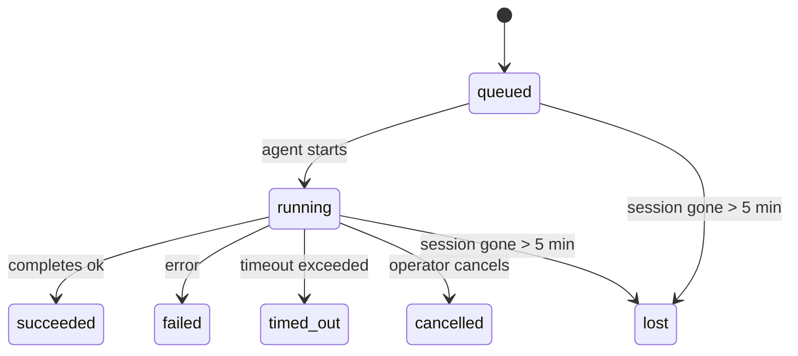

---
read_when:
    - Laufende oder kürzlich abgeschlossene Hintergrundarbeiten prüfen
    - Fehlerbehebung bei Zustellungsfehlern für getrennte Agent-Ausführungen
    - Verstehen, wie Hintergrundausführungen mit Sitzungen, Cron und Heartbeat zusammenhängen
sidebarTitle: Background tasks
summary: Nachverfolgung von Hintergrundaufgaben für ACP-Ausführungen, Subagenten, isolierte Cron-Jobs und CLI-Vorgänge
title: Hintergrundaufgaben
x-i18n:
    generated_at: "2026-05-12T00:56:21Z"
    model: gpt-5.5
    provider: openai
    source_hash: 31cbf09df48bab0686a1350f91aefffffef899c86704bb97b68320fc47e78021
    source_path: automation/tasks.md
    workflow: 16
---

<Note>
Suchen Sie nach Zeitplanung? Siehe [Automatisierung](/de/automation), um den richtigen Mechanismus auszuwählen. Diese Seite ist das Aktivitätsprotokoll für Hintergrundarbeit, nicht der Scheduler.
</Note>

Hintergrundaufgaben verfolgen Arbeit, die **außerhalb Ihrer Haupt-Konversationssitzung** läuft: ACP-Ausführungen, Subagent-Starts, isolierte Cron-Job-Ausführungen und CLI-initiierte Vorgänge.

Aufgaben ersetzen **keine** Sitzungen, Cron-Jobs oder Heartbeats - sie sind das **Aktivitätsprotokoll**, das aufzeichnet, welche losgelöste Arbeit stattgefunden hat, wann sie stattfand und ob sie erfolgreich war.

<Note>
Nicht jeder Agent-Lauf erstellt eine Aufgabe. Heartbeat-Turns und normale interaktive Chats tun dies nicht. Alle Cron-Ausführungen, ACP-Starts, Subagent-Starts und CLI-Agent-Befehle tun dies.
</Note>

## TL;DR

- Aufgaben sind **Einträge**, keine Scheduler - Cron und Heartbeat entscheiden, _wann_ Arbeit ausgeführt wird, Aufgaben verfolgen, _was passiert ist_.
- ACP, Subagents, alle Cron-Jobs und CLI-Vorgänge erstellen Aufgaben. Heartbeat-Turns tun dies nicht.
- Jede Aufgabe durchläuft `queued → running → terminal` (succeeded, failed, timed_out, cancelled oder lost).
- Cron-Aufgaben bleiben aktiv, solange die Cron-Laufzeit den Job noch besitzt; wenn der
  In-Memory-Laufzeitstatus weg ist, prüft die Aufgabenwartung zuerst die persistente Cron-
  Ausführungshistorie, bevor eine Aufgabe als verloren markiert wird.
- Der Abschluss ist push-gesteuert: Losgelöste Arbeit kann direkt benachrichtigen oder die
  anfragende Sitzung/den Heartbeat wecken, wenn sie fertig ist, daher sind Status-Polling-Schleifen
  normalerweise die falsche Form.
- Isolierte Cron-Ausführungen und Subagent-Abschlüsse bereinigen nach bestem Aufwand nachverfolgte Browser-Tabs/Prozesse für ihre untergeordnete Sitzung vor der abschließenden Bereinigungsbuchhaltung.
- Isolierte Cron-Zustellung unterdrückt veraltete Zwischenantworten des übergeordneten Agenten, während nachgelagerte Subagent-Arbeit noch ausläuft, und bevorzugt die finale Ausgabe von Nachkommen, wenn diese vor der Zustellung eintrifft.
- Abschlussbenachrichtigungen werden direkt an einen Kanal zugestellt oder für den nächsten Heartbeat in die Warteschlange gestellt.
- `openclaw tasks list` zeigt alle Aufgaben; `openclaw tasks audit` deckt Probleme auf.
- Terminale Einträge werden 7 Tage lang aufbewahrt und dann automatisch bereinigt.

## Schnellstart

<Tabs>
  <Tab title="Auflisten und filtern">
    ```bash
    # List all tasks (newest first)
    openclaw tasks list

    # Filter by runtime or status
    openclaw tasks list --runtime acp
    openclaw tasks list --status running
    ```

  </Tab>
  <Tab title="Prüfen">
    ```bash
    # Show details for a specific task (by ID, run ID, or session key)
    openclaw tasks show <lookup>
    ```
  </Tab>
  <Tab title="Abbrechen und benachrichtigen">
    ```bash
    # Cancel a running task (kills the child session)
    openclaw tasks cancel <lookup>

    # Change notification policy for a task
    openclaw tasks notify <lookup> state_changes
    ```

  </Tab>
  <Tab title="Audit und Wartung">
    ```bash
    # Run a health audit
    openclaw tasks audit

    # Preview or apply maintenance
    openclaw tasks maintenance
    openclaw tasks maintenance --apply
    ```

  </Tab>
  <Tab title="Aufgabenfluss">
    ```bash
    # Inspect TaskFlow state
    openclaw tasks flow list
    openclaw tasks flow show <lookup>
    openclaw tasks flow cancel <lookup>
    ```
  </Tab>
</Tabs>

## Was eine Aufgabe erstellt

| Quelle                 | Laufzeittyp | Wann ein Aufgabeneintrag erstellt wird                 | Standard-Benachrichtigungsrichtlinie |
| ---------------------- | ------------ | ------------------------------------------------------ | ------------------------------------ |
| ACP-Hintergrundläufe   | `acp`        | Starten einer untergeordneten ACP-Sitzung              | `done_only`                          |
| Subagent-Orchestrierung | `subagent`  | Starten eines Subagents über `sessions_spawn`          | `done_only`                          |
| Cron-Jobs (alle Typen) | `cron`       | Jede Cron-Ausführung (Hauptsitzung und isoliert)       | `silent`                             |
| CLI-Vorgänge           | `cli`        | `openclaw agent`-Befehle, die über den Gateway laufen  | `silent`                             |
| Agent-Medienjobs       | `cli`        | Sitzungsbasierte `music_generate`/`video_generate`-Läufe | `silent`                           |

<AccordionGroup>
  <Accordion title="Benachrichtigungsstandards für Cron und Medien">
    Cron-Aufgaben in der Hauptsitzung verwenden standardmäßig die Benachrichtigungsrichtlinie `silent` - sie erstellen Einträge zur Nachverfolgung, erzeugen aber keine Benachrichtigungen. Isolierte Cron-Aufgaben verwenden ebenfalls standardmäßig `silent`, sind aber sichtbarer, weil sie in ihrer eigenen Sitzung laufen.

    Sitzungsbasierte `music_generate`- und `video_generate`-Läufe verwenden ebenfalls die Benachrichtigungsrichtlinie `silent`. Sie erstellen weiterhin Aufgabeneinträge, aber der Abschluss wird als interner Wake an die ursprüngliche Agent-Sitzung zurückgegeben, damit der Agent die Folgenachricht schreiben und die fertigen Medien selbst anhängen kann. Abschlüsse in Gruppen/Kanälen folgen der normalen Richtlinie für sichtbare Antworten, daher verwendet der Agent das Nachrichten-Tool, wenn die Quellzustellung dies erfordert. Wenn der Abschluss-Agent in einer reinen Tool-Route keinen Zustellnachweis über das Nachrichten-Tool erzeugt, sendet OpenClaw den Abschluss-Fallback direkt an den ursprünglichen Kanal, statt die Medien privat zu lassen.

  </Accordion>
  <Accordion title="Schutzregel für gleichzeitige video_generate-Läufe">
    Während eine sitzungsbasierte `video_generate`-Aufgabe noch aktiv ist, fungiert das Tool auch als Schutzregel: Wiederholte `video_generate`-Aufrufe in derselben Sitzung geben den Status der aktiven Aufgabe zurück, statt eine zweite gleichzeitige Generierung zu starten. Verwenden Sie `action: "status"`, wenn Sie von Agent-Seite eine explizite Fortschritts-/Statusabfrage wünschen.
  </Accordion>
  <Accordion title="Was keine Aufgaben erstellt">
    - Heartbeat-Turns - Hauptsitzung; siehe [Heartbeat](/de/gateway/heartbeat)
    - Normale interaktive Chat-Turns
    - Direkte `/command`-Antworten

  </Accordion>
</AccordionGroup>

## Aufgabenlebenszyklus



| Status      | Bedeutung                                                                  |
| ----------- | -------------------------------------------------------------------------- |
| `queued`    | Erstellt, wartet darauf, dass der Agent startet                            |
| `running`   | Agent-Turn wird aktiv ausgeführt                                           |
| `succeeded` | Erfolgreich abgeschlossen                                                  |
| `failed`    | Mit einem Fehler abgeschlossen                                             |
| `timed_out` | Konfiguriertes Timeout überschritten                                       |
| `cancelled` | Vom Operator über `openclaw tasks cancel` gestoppt                         |
| `lost`      | Die Laufzeit hat nach einer Nachfrist von 5 Minuten den autoritativen Hintergrundstatus verloren |

Übergänge erfolgen automatisch - wenn der zugehörige Agent-Lauf endet, wird der Aufgabenstatus entsprechend aktualisiert.

Der Abschluss des Agent-Laufs ist für aktive Aufgabeneinträge maßgeblich. Ein erfolgreicher losgelöster Lauf wird als `succeeded` finalisiert, gewöhnliche Laufzeitfehler werden als `failed` finalisiert, und Timeout- oder Abbruchergebnisse werden als `timed_out` finalisiert. Wenn ein Operator die Aufgabe bereits abgebrochen hat oder die Laufzeit bereits einen stärkeren terminalen Status wie `failed`, `timed_out` oder `lost` aufgezeichnet hat, stuft ein späteres Erfolgssignal diesen terminalen Status nicht herab.

`lost` ist laufzeitbewusst:

- ACP-Aufgaben: Metadaten der zugrunde liegenden untergeordneten ACP-Sitzung sind verschwunden.
- Subagent-Aufgaben: Die zugrunde liegende untergeordnete Sitzung ist aus dem Ziel-Agent-Speicher verschwunden.
- Cron-Aufgaben: Die Cron-Laufzeit verfolgt den Job nicht mehr als aktiv und die persistente
  Cron-Ausführungshistorie zeigt kein terminales Ergebnis für diesen Lauf. Der Offline-CLI-
  Audit behandelt seinen eigenen leeren prozessinternen Cron-Laufzeitstatus nicht als autoritativ.
- CLI-Aufgaben: Aufgaben mit einer Lauf-ID/Quell-ID verwenden den Live-Laufkontext, sodass
  verbleibende Zeilen für untergeordnete Sitzungen oder Chat-Sitzungen sie nicht aktiv halten, nachdem der
  vom Gateway besessene Lauf verschwunden ist. Legacy-CLI-Aufgaben ohne Laufidentität fallen weiterhin
  auf die untergeordnete Sitzung zurück. Gateway-gestützte `openclaw agent`-Läufe finalisieren
  ebenfalls aus ihrem Laufergebnis, sodass abgeschlossene Läufe nicht aktiv bleiben, bis der Sweeper
  sie als `lost` markiert.

## Zustellung und Benachrichtigungen

Wenn eine Aufgabe einen terminalen Status erreicht, benachrichtigt OpenClaw Sie. Es gibt zwei Zustellwege:

**Direkte Zustellung** - wenn die Aufgabe ein Kanalziel hat (den `requesterOrigin`), geht die Abschlussnachricht direkt an diesen Kanal (Telegram, Discord, Slack usw.). Aufgabenabschlüsse in Gruppen und Kanälen werden stattdessen über die anfragende Sitzung geleitet, damit der übergeordnete Agent die sichtbare Antwort schreiben kann. Bei Subagent-Abschlüssen bewahrt OpenClaw außerdem gebundenes Thread-/Topic-Routing, wenn verfügbar, und kann ein fehlendes `to` / Konto aus der gespeicherten Route der anfragenden Sitzung (`lastChannel` / `lastTo` / `lastAccountId`) ergänzen, bevor die direkte Zustellung aufgegeben wird.

**Sitzungs-Warteschlangenzustellung** - wenn die direkte Zustellung fehlschlägt oder kein Ursprung gesetzt ist, wird die Aktualisierung als Systemereignis in die Sitzung des Anfragenden gestellt und erscheint beim nächsten Heartbeat.

<Tip>
Der Abschluss einer Aufgabe löst sofort einen Heartbeat-Wake aus, sodass Sie das Ergebnis schnell sehen - Sie müssen nicht auf den nächsten geplanten Heartbeat-Tick warten.
</Tip>

Das bedeutet, der übliche Workflow ist push-basiert: Starten Sie losgelöste Arbeit einmal und lassen Sie dann die Laufzeit Sie beim Abschluss wecken oder benachrichtigen. Fragen Sie den Aufgabenstatus nur ab, wenn Sie Debugging, Eingriff oder einen expliziten Audit benötigen.

### Benachrichtigungsrichtlinien

Steuern Sie, wie viel Sie zu jeder Aufgabe hören:

| Richtlinie            | Was zugestellt wird                                                    |
| --------------------- | ---------------------------------------------------------------------- |
| `done_only` (Standard) | Nur terminaler Status (succeeded, failed usw.) - **dies ist der Standard** |
| `state_changes`       | Jeder Statusübergang und jede Fortschrittsaktualisierung               |
| `silent`              | Gar nichts                                                             |

Ändern Sie die Richtlinie, während eine Aufgabe läuft:

```bash
openclaw tasks notify <lookup> state_changes
```

## CLI-Referenz

<AccordionGroup>
  <Accordion title="tasks list">
    ```bash
    openclaw tasks list [--runtime <acp|subagent|cron|cli>] [--status <status>] [--json]
    ```

    Ausgabespalten: Aufgaben-ID, Art, Status, Zustellung, Lauf-ID, untergeordnete Sitzung, Zusammenfassung.

  </Accordion>
  <Accordion title="tasks show">
    ```bash
    openclaw tasks show <lookup>
    ```

    Das Lookup-Token akzeptiert eine Aufgaben-ID, Lauf-ID oder einen Sitzungsschlüssel. Zeigt den vollständigen Eintrag einschließlich Timing, Zustellstatus, Fehler und terminaler Zusammenfassung.

  </Accordion>
  <Accordion title="tasks cancel">
    ```bash
    openclaw tasks cancel <lookup>
    ```

    Bei ACP- und Subagent-Aufgaben beendet dies die untergeordnete Sitzung. Bei CLI-verfolgten Aufgaben wird der Abbruch in der Aufgabenregistrierung aufgezeichnet (es gibt keinen separaten untergeordneten Laufzeit-Handle). Der Status wechselt zu `cancelled` und eine Zustellbenachrichtigung wird gesendet, sofern zutreffend.

  </Accordion>
  <Accordion title="tasks notify">
    ```bash
    openclaw tasks notify <lookup> <done_only|state_changes|silent>
    ```
  </Accordion>
  <Accordion title="tasks audit">
    ```bash
    openclaw tasks audit [--json]
    ```

    Deckt betriebliche Probleme auf. Befunde erscheinen auch in `openclaw status`, wenn Probleme erkannt werden.

    | Ergebnis                  | Schweregrad | Auslöser                                                                                                                              |
    | ------------------------- | ---------- | ------------------------------------------------------------------------------------------------------------------------------------- |
    | `stale_queued`            | warn       | Seit mehr als 10 Minuten in der Warteschlange                                                                                         |
    | `stale_running`           | error      | Läuft seit mehr als 30 Minuten                                                                                                        |
    | `lost`                    | warn/error | Runtime-gestützte Aufgabenverantwortung ist verschwunden; beibehaltene verlorene Aufgaben warnen bis `cleanupAfter` und werden dann zu Fehlern |
    | `delivery_failed`         | warn       | Zustellung fehlgeschlagen und Benachrichtigungsrichtlinie ist nicht `silent`                                                          |
    | `missing_cleanup`         | warn       | Terminale Aufgabe ohne Cleanup-Zeitstempel                                                                                            |
    | `inconsistent_timestamps` | warn       | Zeitachsenverletzung (zum Beispiel vor dem Start beendet)                                                                             |

  </Accordion>
  <Accordion title="tasks maintenance">
    ```bash
    openclaw tasks maintenance [--json]
    openclaw tasks maintenance --apply [--json]
    ```

    Verwenden Sie dies, um Abgleich, Cleanup-Stempelung und Bereinigung für Aufgaben, Task Flow-Status und veraltete Registry-Zeilen für Cron-Ausführungssitzungen vorab anzuzeigen oder anzuwenden.

    Der Abgleich ist runtime-bewusst:

    - ACP-/Subagent-Aufgaben prüfen ihre zugrunde liegende untergeordnete Sitzung.
    - Subagent-Aufgaben, deren untergeordnete Sitzung einen Tombstone für Neustart-Wiederherstellung hat, werden als verloren markiert, statt als wiederherstellbare zugrunde liegende Sitzungen behandelt zu werden.
    - Cron-Aufgaben prüfen, ob die Cron-Runtime den Job weiterhin besitzt, und stellen dann den terminalen Status aus persistierten Cron-Ausführungsprotokollen/dem Job-Status wieder her, bevor sie auf `lost` zurückfallen. Nur der Gateway-Prozess ist für die aktive In-Memory-Job-Menge von Cron maßgeblich; ein Offline-CLI-Audit verwendet dauerhafte Historie, markiert eine Cron-Aufgabe aber nicht allein deshalb als verloren, weil dieses lokale Set leer ist.
    - CLI-Aufgaben mit Ausführungsidentität prüfen den besitzenden Live-Ausführungskontext, nicht nur Zeilen von untergeordneten Sitzungen oder Chat-Sitzungen.

    Auch der Abschluss-Cleanup ist runtime-bewusst:

    - Subagent-Abschluss schließt nach bestem Bemühen nachverfolgte Browser-Tabs/Prozesse für die untergeordnete Sitzung, bevor der Ankündigungs-Cleanup fortgesetzt wird.
    - Isolierter Cron-Abschluss schließt nach bestem Bemühen nachverfolgte Browser-Tabs/Prozesse für die Cron-Sitzung, bevor die Ausführung vollständig heruntergefahren wird.
    - Isolierte Cron-Zustellung wartet bei Bedarf auf nachgelagerte Subagent-Folgeaktionen und unterdrückt veralteten Bestätigungstext des übergeordneten Elements, statt ihn anzukündigen.
    - Die Zustellung bei Subagent-Abschluss bevorzugt den neuesten sichtbaren Assistententext; wenn dieser leer ist, fällt sie auf bereinigten neuesten Tool-/toolResult-Text zurück, und reine Timeout-Tool-Call-Ausführungen können zu einer kurzen Teilfortschrittszusammenfassung zusammengefasst werden. Terminal fehlgeschlagene Ausführungen kündigen den Fehlerstatus an, ohne erfassten Antworttext erneut wiederzugeben.
    - Cleanup-Fehler verdecken nicht das tatsächliche Aufgabenergebnis.

    Beim Anwenden der Wartung entfernt OpenClaw außerdem veraltete Registry-Zeilen für Sitzungen vom Typ `cron:<jobId>:run:<uuid>`, die älter als 7 Tage sind, bewahrt dabei Zeilen für aktuell laufende Cron-Jobs und lässt Nicht-Cron-Sitzungszeilen unverändert.

  </Accordion>
  <Accordion title="tasks flow list | show | cancel">
    ```bash
    openclaw tasks flow list [--status <status>] [--json]
    openclaw tasks flow show <lookup> [--json]
    openclaw tasks flow cancel <lookup>
    ```

    Verwenden Sie diese Befehle, wenn der orchestrierende Task Flow für Sie relevant ist und nicht ein einzelner Hintergrundaufgabeneintrag.

  </Accordion>
</AccordionGroup>

## Chat-Aufgabenboard (`/tasks`)

Verwenden Sie `/tasks` in einer beliebigen Chat-Sitzung, um Hintergrundaufgaben zu sehen, die mit dieser Sitzung verknüpft sind. Das Board zeigt aktive und kürzlich abgeschlossene Aufgaben mit Runtime, Status, Zeitangaben sowie Fortschritts- oder Fehlerdetails.

Wenn die aktuelle Sitzung keine sichtbaren verknüpften Aufgaben hat, fällt `/tasks` auf agent-lokale Aufgabenzählungen zurück, sodass Sie weiterhin einen Überblick erhalten, ohne Details anderer Sitzungen offenzulegen.

Für das vollständige Operator-Ledger verwenden Sie die CLI: `openclaw tasks list`.

## Statusintegration (Aufgabendruck)

`openclaw status` enthält eine Aufgabenübersicht auf einen Blick:

```
Tasks: 3 queued · 2 running · 1 issues
```

Die Zusammenfassung meldet:

- **active** - Anzahl von `queued` + `running`
- **failures** - Anzahl von `failed` + `timed_out` + `lost`
- **byRuntime** - Aufschlüsselung nach `acp`, `subagent`, `cron`, `cli`

Sowohl `/status` als auch das Tool `session_status` verwenden einen Cleanup-bewussten Aufgaben-Snapshot: Aktive Aufgaben werden bevorzugt, veraltete abgeschlossene Zeilen werden ausgeblendet, und aktuelle Fehler werden nur angezeigt, wenn keine aktive Arbeit verbleibt. Dadurch bleibt die Statuskarte auf das fokussiert, was gerade wichtig ist.

## Speicherung und Wartung

### Wo Aufgaben gespeichert werden

Aufgabeneinträge bleiben in SQLite bestehen unter:

```
$OPENCLAW_STATE_DIR/tasks/runs.sqlite
```

Die Registry wird beim Gateway-Start in den Arbeitsspeicher geladen und synchronisiert Schreibvorgänge mit SQLite, um Dauerhaftigkeit über Neustarts hinweg zu gewährleisten.
Der Gateway hält das SQLite-Write-Ahead-Log begrenzt, indem er den standardmäßigen Autocheckpoint-Schwellenwert von SQLite sowie regelmäßige und Shutdown-`TRUNCATE`-Checkpoints verwendet.

### Automatische Wartung

Ein Sweeper läuft alle **60 Sekunden** und erledigt vier Dinge:

<Steps>
  <Step title="Abgleich">
    Prüft, ob aktive Aufgaben weiterhin eine maßgebliche Runtime-Grundlage haben. ACP-/Subagent-Aufgaben verwenden den Status untergeordneter Sitzungen, Cron-Aufgaben verwenden Active-Job-Eigentum, und CLI-Aufgaben mit Ausführungsidentität verwenden den besitzenden Ausführungskontext. Wenn dieser zugrunde liegende Status länger als 5 Minuten verschwunden ist, wird die Aufgabe als `lost` markiert.
  </Step>
  <Step title="ACP-Sitzungsreparatur">
    Schließt terminale oder verwaiste parent-owned One-Shot-ACP-Sitzungen und schließt veraltete terminale oder verwaiste persistente ACP-Sitzungen nur, wenn keine aktive Gesprächsbindung verbleibt.
  </Step>
  <Step title="Cleanup-Stempelung">
    Setzt einen `cleanupAfter`-Zeitstempel auf terminale Aufgaben (endedAt + 7 Tage). Während der Aufbewahrung erscheinen verlorene Aufgaben im Audit weiterhin als Warnungen; nachdem `cleanupAfter` abläuft oder wenn Cleanup-Metadaten fehlen, sind sie Fehler.
  </Step>
  <Step title="Bereinigung">
    Löscht Einträge nach ihrem `cleanupAfter`-Datum.
  </Step>
</Steps>

<Note>
**Aufbewahrung:** Terminale Aufgabeneinträge werden **7 Tage** lang aufbewahrt und dann automatisch bereinigt. Keine Konfiguration erforderlich.
</Note>

## Wie Aufgaben mit anderen Systemen zusammenhängen

<AccordionGroup>
  <Accordion title="Aufgaben und Task Flow">
    [Task Flow](/de/automation/taskflow) ist die Flow-Orchestrierungsschicht oberhalb von Hintergrundaufgaben. Ein einzelner Flow kann über seine Lebensdauer hinweg mehrere Aufgaben mithilfe verwalteter oder gespiegelter Synchronisierungsmodi koordinieren. Verwenden Sie `openclaw tasks`, um einzelne Aufgabeneinträge zu prüfen, und `openclaw tasks flow`, um den orchestrierenden Flow zu prüfen.

    Siehe [Task Flow](/de/automation/taskflow) für Details.

  </Accordion>
  <Accordion title="Aufgaben und Cron">
    Eine Cron-Job-**Definition** befindet sich in `~/.openclaw/cron/jobs.json`; der Runtime-Ausführungsstatus befindet sich daneben in `~/.openclaw/cron/jobs-state.json`. **Jede** Cron-Ausführung erstellt einen Aufgabeneintrag - sowohl Hauptsitzung als auch isoliert. Cron-Aufgaben in Hauptsitzungen verwenden standardmäßig die Benachrichtigungsrichtlinie `silent`, sodass sie nachverfolgen, ohne Benachrichtigungen zu erzeugen.

    Siehe [Cron Jobs](/de/automation/cron-jobs).

  </Accordion>
  <Accordion title="Aufgaben und Heartbeat">
    Heartbeat-Ausführungen sind Hauptsitzungs-Turns - sie erstellen keine Aufgabeneinträge. Wenn eine Aufgabe abgeschlossen wird, kann sie ein Heartbeat-Wecken auslösen, damit Sie das Ergebnis zeitnah sehen.

    Siehe [Heartbeat](/de/gateway/heartbeat).

  </Accordion>
  <Accordion title="Aufgaben und Sitzungen">
    Eine Aufgabe kann auf einen `childSessionKey` (wo die Arbeit läuft) und einen `requesterSessionKey` (wer sie gestartet hat) verweisen. Sitzungen sind Gesprächskontext; Aufgaben sind Aktivitätsnachverfolgung darauf.
  </Accordion>
  <Accordion title="Aufgaben und Agent-Ausführungen">
    Die `runId` einer Aufgabe verweist auf die Agent-Ausführung, die die Arbeit erledigt. Agent-Lebenszyklusereignisse (Start, Ende, Fehler) aktualisieren automatisch den Aufgabenstatus - Sie müssen den Lebenszyklus nicht manuell verwalten.
  </Accordion>
</AccordionGroup>

## Verwandte Themen

- [Automatisierung](/de/automation) - alle Automatisierungsmechanismen auf einen Blick
- [CLI: Aufgaben](/de/cli/tasks) - CLI-Befehlsreferenz
- [Heartbeat](/de/gateway/heartbeat) - regelmäßige Hauptsitzungs-Turns
- [Geplante Aufgaben](/de/automation/cron-jobs) - Hintergrundarbeit planen
- [Task Flow](/de/automation/taskflow) - Flow-Orchestrierung oberhalb von Aufgaben
