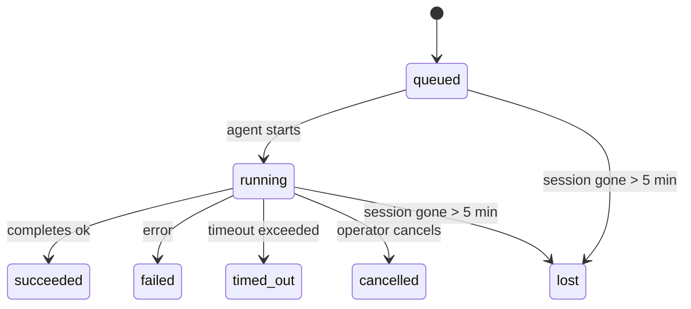

---
read_when:
    - Laufende oder kürzlich abgeschlossene Hintergrundarbeiten prüfen
    - Fehlerbehebung bei Zustellungsfehlern für abgekoppelte Agent-Ausführungen
    - Verstehen, wie Hintergrundläufe mit Sitzungen, Cron und Heartbeat zusammenhängen
sidebarTitle: Background tasks
summary: Nachverfolgung von Hintergrundaufgaben für ACP-Ausführungen, Subagenten, isolierte Cron-Jobs und CLI-Vorgänge
title: Hintergrundaufgaben
x-i18n:
    generated_at: "2026-05-05T06:16:24Z"
    model: gpt-5.5
    provider: openai
    source_hash: bafd959feaf2e220820ec56bf1ef144207d05757418e9971ebf427844cf30c46
    source_path: automation/tasks.md
    workflow: 16
---

<Note>
Suchen Sie nach Zeitplanung? Unter [Automatisierung und Aufgaben](/de/automation) erfahren Sie, wie Sie den richtigen Mechanismus auswählen. Diese Seite ist das Aktivitätsprotokoll für Hintergrundarbeit, nicht der Planer.
</Note>

Hintergrundaufgaben verfolgen Arbeit, die **außerhalb Ihrer Haupt-Unterhaltungssitzung** ausgeführt wird: ACP-Ausführungen, Subagent-Starts, isolierte Cron-Job-Ausführungen und per CLI gestartete Vorgänge.

Aufgaben ersetzen **keine** Sitzungen, Cron-Jobs oder Heartbeats — sie sind das **Aktivitätsprotokoll**, das aufzeichnet, welche losgelöste Arbeit stattgefunden hat, wann sie stattgefunden hat und ob sie erfolgreich war.

<Note>
Nicht jeder Agentenlauf erstellt eine Aufgabe. Heartbeat-Durchläufe und normaler interaktiver Chat tun das nicht. Alle Cron-Ausführungen, ACP-Starts, Subagent-Starts und CLI-Agentenbefehle tun es.
</Note>

## Kurzfassung

- Aufgaben sind **Datensätze**, keine Planer — Cron und Heartbeat entscheiden, _wann_ Arbeit ausgeführt wird, Aufgaben verfolgen, _was passiert ist_.
- ACP, Subagents, alle Cron-Jobs und CLI-Vorgänge erstellen Aufgaben. Heartbeat-Durchläufe tun das nicht.
- Jede Aufgabe durchläuft `queued → running → terminal` (succeeded, failed, timed_out, cancelled oder lost).
- Cron-Aufgaben bleiben aktiv, solange die Cron-Laufzeit noch Eigentümer des Jobs ist; wenn der
  In-Memory-Laufzeitstatus verschwunden ist, prüft die Aufgabenwartung zuerst den dauerhaften
  Cron-Ausführungsverlauf, bevor sie eine Aufgabe als verloren markiert.
- Abschluss ist push-gesteuert: Losgelöste Arbeit kann direkt benachrichtigen oder die
  anfordernde Sitzung/den Heartbeat wecken, wenn sie fertig ist; Status-Polling-Schleifen haben
  daher meist die falsche Form.
- Isolierte Cron-Ausführungen und Subagent-Abschlüsse bereinigen nach bestem Aufwand nachverfolgte Browser-Tabs/Prozesse für ihre untergeordnete Sitzung, bevor die abschließende Bereinigungsbuchhaltung erfolgt.
- Isolierte Cron-Zustellung unterdrückt veraltete vorläufige Elternantworten, während nachgelagerte Subagent-Arbeit noch abläuft, und bevorzugt die endgültige nachgelagerte Ausgabe, wenn sie vor der Zustellung eintrifft.
- Abschlussbenachrichtigungen werden direkt an einen Kanal zugestellt oder für den nächsten Heartbeat in die Warteschlange gestellt.
- `openclaw tasks list` zeigt alle Aufgaben; `openclaw tasks audit` macht Probleme sichtbar.
- Terminale Datensätze werden 7 Tage lang aufbewahrt und danach automatisch bereinigt.

## Schnellstart

<Tabs>
  <Tab title="Auflisten und filtern">
    ```bash
    # List all tasks (newest first)
    openclaw tasks list

    # Filter by runtime or status
    openclaw tasks list --runtime acp
    openclaw tasks list --status running
    ```

  </Tab>
  <Tab title="Prüfen">
    ```bash
    # Show details for a specific task (by ID, run ID, or session key)
    openclaw tasks show <lookup>
    ```
  </Tab>
  <Tab title="Abbrechen und benachrichtigen">
    ```bash
    # Cancel a running task (kills the child session)
    openclaw tasks cancel <lookup>

    # Change notification policy for a task
    openclaw tasks notify <lookup> state_changes
    ```

  </Tab>
  <Tab title="Audit und Wartung">
    ```bash
    # Run a health audit
    openclaw tasks audit

    # Preview or apply maintenance
    openclaw tasks maintenance
    openclaw tasks maintenance --apply
    ```

  </Tab>
  <Tab title="TaskFlow">
    ```bash
    # Inspect TaskFlow state
    openclaw tasks flow list
    openclaw tasks flow show <lookup>
    openclaw tasks flow cancel <lookup>
    ```
  </Tab>
</Tabs>

## Was eine Aufgabe erstellt

| Quelle                 | Laufzeittyp | Wann ein Aufgabendatensatz erstellt wird               | Standard-Benachrichtigungsrichtlinie |
| ---------------------- | ------------ | ------------------------------------------------------ | ------------------------------------ |
| ACP-Hintergrundausführungen | `acp`        | Beim Starten einer untergeordneten ACP-Sitzung         | `done_only`                          |
| Subagent-Orchestrierung | `subagent`   | Beim Starten eines Subagents über `sessions_spawn`     | `done_only`                          |
| Cron-Jobs (alle Typen) | `cron`       | Bei jeder Cron-Ausführung (Hauptsitzung und isoliert)  | `silent`                             |
| CLI-Vorgänge           | `cli`        | `openclaw agent`-Befehle, die über das Gateway laufen  | `silent`                             |
| Agenten-Medienjobs     | `cli`        | Sitzungsbasierte `music_generate`-/`video_generate`-Ausführungen | `silent`                      |

<AccordionGroup>
  <Accordion title="Benachrichtigungsstandards für Cron und Medien">
    Cron-Aufgaben in der Hauptsitzung verwenden standardmäßig die Benachrichtigungsrichtlinie `silent` — sie erstellen Datensätze zur Nachverfolgung, erzeugen aber keine Benachrichtigungen. Isolierte Cron-Aufgaben verwenden ebenfalls standardmäßig `silent`, sind aber sichtbarer, weil sie in ihrer eigenen Sitzung laufen.

    Sitzungsbasierte `music_generate`- und `video_generate`-Ausführungen verwenden ebenfalls die Benachrichtigungsrichtlinie `silent`. Sie erstellen weiterhin Aufgabendatensätze, aber der Abschluss wird als internes Wecken an die ursprüngliche Agentensitzung zurückgegeben, damit der Agent die Folgenachricht schreiben und die fertigen Medien selbst anhängen kann. Abschlüsse in Gruppen/Kanälen folgen der normalen Richtlinie für sichtbare Antworten, sodass der Agent das Nachrichtenwerkzeug verwendet, wenn die Quellzustellung dies erfordert. Wenn der Abschlussagent in einer reinen Werkzeugroute keinen Zustellnachweis für das Nachrichtenwerkzeug erzeugt, sendet OpenClaw den Abschluss-Fallback direkt an den ursprünglichen Kanal, anstatt die Medien privat zu belassen.

  </Accordion>
  <Accordion title="Schutzregel für gleichzeitige video_generate-Aufrufe">
    Während eine sitzungsbasierte `video_generate`-Aufgabe noch aktiv ist, dient das Werkzeug auch als Schutzregel: Wiederholte `video_generate`-Aufrufe in derselben Sitzung geben den aktiven Aufgabenstatus zurück, anstatt eine zweite gleichzeitige Generierung zu starten. Verwenden Sie `action: "status"`, wenn Sie eine explizite Fortschritts-/Statusabfrage von der Agentenseite aus wünschen.
  </Accordion>
  <Accordion title="Was keine Aufgaben erstellt">
    - Heartbeat-Durchläufe — Hauptsitzung; siehe [Heartbeat](/de/gateway/heartbeat)
    - Normale interaktive Chat-Durchläufe
    - Direkte `/command`-Antworten

  </Accordion>
</AccordionGroup>

## Aufgabenlebenszyklus



| Status      | Bedeutung                                                                  |
| ----------- | -------------------------------------------------------------------------- |
| `queued`    | Erstellt, wartet darauf, dass der Agent startet                            |
| `running`   | Agenten-Durchlauf wird aktiv ausgeführt                                    |
| `succeeded` | Erfolgreich abgeschlossen                                                  |
| `failed`    | Mit einem Fehler abgeschlossen                                             |
| `timed_out` | Das konfigurierte Zeitlimit wurde überschritten                            |
| `cancelled` | Vom Operator über `openclaw tasks cancel` gestoppt                         |
| `lost`      | Die Laufzeit hat nach einer Kulanzzeit von 5 Minuten den autoritativen Rückhaltstatus verloren |

Übergänge erfolgen automatisch — wenn der zugehörige Agentenlauf endet, wird der Aufgabenstatus entsprechend aktualisiert.

Der Abschluss des Agentenlaufs ist für aktive Aufgabendatensätze autoritativ. Eine erfolgreiche losgelöste Ausführung wird als `succeeded` finalisiert, normale Ausführungsfehler werden als `failed` finalisiert, und Timeout- oder Abbruchergebnisse werden als `timed_out` finalisiert. Wenn ein Operator die Aufgabe bereits abgebrochen hat oder die Laufzeit bereits einen stärkeren terminalen Status wie `failed`, `timed_out` oder `lost` aufgezeichnet hat, stuft ein späteres Erfolgssignal diesen terminalen Status nicht herab.

`lost` ist laufzeitbewusst:

- ACP-Aufgaben: Rückhaltende Metadaten der untergeordneten ACP-Sitzung sind verschwunden.
- Subagent-Aufgaben: Rückhaltende untergeordnete Sitzung ist aus dem Ziel-Agentenspeicher verschwunden.
- Cron-Aufgaben: Die Cron-Laufzeit verfolgt den Job nicht mehr als aktiv und der dauerhafte
  Cron-Ausführungsverlauf zeigt kein terminales Ergebnis für diese Ausführung. Ein Offline-CLI-
  Audit behandelt seinen eigenen leeren In-Process-Cron-Laufzeitstatus nicht als autoritativ.
- CLI-Aufgaben: Isolierte Aufgaben mit untergeordneter Sitzung verwenden die untergeordnete Sitzung; chatbasierte
  CLI-Aufgaben verwenden stattdessen den Live-Ausführungskontext, sodass verbleibende
  Sitzungszeilen für Kanal/Gruppe/Direktnachricht sie nicht aktiv halten. Gateway-gestützte
  `openclaw agent`-Ausführungen finalisieren ebenfalls anhand ihres Ausführungsergebnisses, sodass abgeschlossene Ausführungen
  nicht aktiv bleiben, bis der Sweeper sie als `lost` markiert.

## Zustellung und Benachrichtigungen

Wenn eine Aufgabe einen terminalen Status erreicht, benachrichtigt OpenClaw Sie. Es gibt zwei Zustellwege:

**Direkte Zustellung** — wenn die Aufgabe ein Kanalziel hat (den `requesterOrigin`), geht die Abschlussnachricht direkt an diesen Kanal (Telegram, Discord, Slack usw.). Für Subagent-Abschlüsse bewahrt OpenClaw außerdem gebundene Thread-/Themenweiterleitung, sofern verfügbar, und kann ein fehlendes `to` / Konto aus der gespeicherten Route der anfordernden Sitzung (`lastChannel` / `lastTo` / `lastAccountId`) ergänzen, bevor die direkte Zustellung aufgegeben wird.

**Sitzungswarteschlangen-Zustellung** — wenn die direkte Zustellung fehlschlägt oder kein Ursprung gesetzt ist, wird die Aktualisierung als Systemereignis in die Sitzung des Anforderers eingereiht und beim nächsten Heartbeat sichtbar.

<Tip>
Der Aufgabenabschluss löst ein sofortiges Heartbeat-Wecken aus, damit Sie das Ergebnis schnell sehen — Sie müssen nicht auf den nächsten geplanten Heartbeat-Tick warten.
</Tip>

Das bedeutet: Der übliche Arbeitsablauf ist push-basiert. Starten Sie losgelöste Arbeit einmal und lassen Sie sich dann von der Laufzeit beim Abschluss wecken oder benachrichtigen. Fragen Sie den Aufgabenstatus nur ab, wenn Sie Debugging, Eingreifen oder einen expliziten Audit benötigen.

### Benachrichtigungsrichtlinien

Steuern Sie, wie viel Sie über jede Aufgabe erfahren:

| Richtlinie            | Was zugestellt wird                                                     |
| --------------------- | ----------------------------------------------------------------------- |
| `done_only` (Standard) | Nur terminaler Status (succeeded, failed usw.) — **das ist der Standard** |
| `state_changes`       | Jeder Statusübergang und jede Fortschrittsaktualisierung                |
| `silent`              | Gar nichts                                                              |

Ändern Sie die Richtlinie, während eine Aufgabe läuft:

```bash
openclaw tasks notify <lookup> state_changes
```

## CLI-Referenz

<AccordionGroup>
  <Accordion title="tasks list">
    ```bash
    openclaw tasks list [--runtime <acp|subagent|cron|cli>] [--status <status>] [--json]
    ```

    Ausgabespalten: Aufgaben-ID, Art, Status, Zustellung, Ausführungs-ID, untergeordnete Sitzung, Zusammenfassung.

  </Accordion>
  <Accordion title="tasks show">
    ```bash
    openclaw tasks show <lookup>
    ```

    Das Such-Token akzeptiert eine Aufgaben-ID, Ausführungs-ID oder einen Sitzungsschlüssel. Zeigt den vollständigen Datensatz einschließlich Zeitangaben, Zustellstatus, Fehler und terminaler Zusammenfassung.

  </Accordion>
  <Accordion title="tasks cancel">
    ```bash
    openclaw tasks cancel <lookup>
    ```

    Bei ACP- und Subagent-Aufgaben beendet dies die untergeordnete Sitzung. Bei von der CLI nachverfolgten Aufgaben wird der Abbruch in der Aufgabenregistry aufgezeichnet (es gibt keinen separaten untergeordneten Laufzeit-Handle). Der Status wechselt zu `cancelled`, und eine Zustellbenachrichtigung wird gesendet, sofern zutreffend.

  </Accordion>
  <Accordion title="tasks notify">
    ```bash
    openclaw tasks notify <lookup> <done_only|state_changes|silent>
    ```
  </Accordion>
  <Accordion title="tasks audit">
    ```bash
    openclaw tasks audit [--json]
    ```

    Macht Betriebsprobleme sichtbar. Befunde erscheinen auch in `openclaw status`, wenn Probleme erkannt werden.

    | Ergebnis                  | Schweregrad | Auslöser                                                                                                                               |
    | ------------------------- | ----------- | -------------------------------------------------------------------------------------------------------------------------------------- |
    | `stale_queued`            | Warnung     | Seit mehr als 10 Minuten in der Warteschlange                                                                                          |
    | `stale_running`           | Fehler      | Läuft seit mehr als 30 Minuten                                                                                                         |
    | `lost`                    | Warnung/Fehler | Laufzeitgestützte Aufgabeninhaberschaft ist verschwunden; zurückbehaltene verlorene Aufgaben warnen bis `cleanupAfter` und werden dann zu Fehlern |
    | `delivery_failed`         | Warnung     | Zustellung fehlgeschlagen und Benachrichtigungsrichtlinie ist nicht `silent`                                                            |
    | `missing_cleanup`         | Warnung     | Terminale Aufgabe ohne Cleanup-Zeitstempel                                                                                             |
    | `inconsistent_timestamps` | Warnung     | Verletzung der Zeitleiste (zum Beispiel beendet, bevor gestartet)                                                                       |

  </Accordion>
  <Accordion title="Aufgabenwartung">
    ```bash
    openclaw tasks maintenance [--json]
    openclaw tasks maintenance --apply [--json]
    ```

    Verwenden Sie dies, um Abgleich, Cleanup-Stempelung und Bereinigung für Aufgaben und den Task-Flow-Status als Vorschau anzuzeigen oder anzuwenden.

    Der Abgleich berücksichtigt die Laufzeit:

    - ACP-/Subagent-Aufgaben prüfen ihre zugrunde liegende Child-Session.
    - Subagent-Aufgaben, deren Child-Session einen Tombstone für Neustartwiederherstellung hat, werden als verloren markiert, statt als wiederherstellbare zugrunde liegende Sessions behandelt zu werden.
    - Cron-Aufgaben prüfen, ob die Cron-Laufzeit den Job noch besitzt, und stellen dann den terminalen Status aus persistierten Cron-Ausführungsprotokollen bzw. dem Job-Status wieder her, bevor sie auf `lost` zurückfallen. Nur der Gateway-Prozess ist maßgeblich für die im Arbeitsspeicher gehaltene aktive Cron-Job-Menge; eine Offline-CLI-Prüfung verwendet dauerhafte Historie, markiert eine Cron-Aufgabe aber nicht allein deshalb als verloren, weil dieses lokale Set leer ist.
    - Chat-gestützte CLI-Aufgaben prüfen den besitzenden Live-Ausführungskontext, nicht nur die Chat-Session-Zeile.

    Abschluss-Cleanup berücksichtigt ebenfalls die Laufzeit:

    - Subagent-Abschluss schließt nach bestem Aufwand nachverfolgte Browser-Tabs/-Prozesse für die Child-Session, bevor das Ankündigungs-Cleanup fortgesetzt wird.
    - Isolierter Cron-Abschluss schließt nach bestem Aufwand nachverfolgte Browser-Tabs/-Prozesse für die Cron-Session, bevor die Ausführung vollständig abgebaut wird.
    - Isolierte Cron-Zustellung wartet bei Bedarf nachgelagerte Subagent-Folgearbeit ab und unterdrückt veralteten Eltern-Bestätigungstext, statt ihn anzukündigen.
    - Subagent-Abschlusszustellung bevorzugt den neuesten sichtbaren Assistententext; ist dieser leer, fällt sie auf bereinigten neuesten Tool-/ToolResult-Text zurück, und reine Timeout-Tool-Call-Ausführungen können zu einer kurzen Teilfortschrittszusammenfassung zusammengefasst werden. Terminal fehlgeschlagene Ausführungen kündigen den Fehlerstatus an, ohne erfassten Antworttext erneut wiederzugeben.
    - Cleanup-Fehler verdecken nicht das tatsächliche Aufgabenergebnis.

  </Accordion>
  <Accordion title="Aufgabenfluss list | show | cancel">
    ```bash
    openclaw tasks flow list [--status <status>] [--json]
    openclaw tasks flow show <lookup> [--json]
    openclaw tasks flow cancel <lookup>
    ```

    Verwenden Sie diese Befehle, wenn der orchestrierende Task Flow das ist, worauf es Ihnen ankommt, statt ein einzelner Hintergrundaufgabendatensatz.

  </Accordion>
</AccordionGroup>

## Chat-Aufgabentafel (`/tasks`)

Verwenden Sie `/tasks` in einer beliebigen Chat-Session, um Hintergrundaufgaben zu sehen, die mit dieser Session verknüpft sind. Die Tafel zeigt aktive und kürzlich abgeschlossene Aufgaben mit Laufzeit, Status, Zeitangaben und Fortschritts- oder Fehlerdetails.

Wenn die aktuelle Session keine sichtbar verknüpften Aufgaben hat, fällt `/tasks` auf agent-lokale Aufgabenzählungen zurück, sodass Sie weiterhin einen Überblick erhalten, ohne Details anderer Sessions offenzulegen.

Für das vollständige Operator-Protokoll verwenden Sie die CLI: `openclaw tasks list`.

## Statusintegration (Aufgabendruck)

`openclaw status` enthält eine Aufgabenübersicht auf einen Blick:

```
Tasks: 3 queued · 2 running · 1 issues
```

Die Zusammenfassung meldet:

- **active** — Anzahl von `queued` + `running`
- **failures** — Anzahl von `failed` + `timed_out` + `lost`
- **byRuntime** — Aufschlüsselung nach `acp`, `subagent`, `cron`, `cli`

Sowohl `/status` als auch das Tool `session_status` verwenden einen Cleanup-bewussten Aufgaben-Snapshot: Aktive Aufgaben werden bevorzugt, veraltete abgeschlossene Zeilen werden ausgeblendet, und aktuelle Fehler erscheinen nur, wenn keine aktive Arbeit mehr übrig ist. Dadurch bleibt die Statuskarte auf das fokussiert, was im Moment zählt.

## Speicherung und Wartung

### Wo Aufgaben gespeichert werden

Aufgabendatensätze werden in SQLite persistiert unter:

```
$OPENCLAW_STATE_DIR/tasks/runs.sqlite
```

Die Registry wird beim Gateway-Start in den Arbeitsspeicher geladen und synchronisiert Schreibvorgänge zur Dauerhaftigkeit über Neustarts hinweg nach SQLite.
Der Gateway hält das SQLite-Write-Ahead-Log begrenzt, indem er den standardmäßigen
Autocheckpoint-Schwellenwert von SQLite sowie periodische und Shutdown-`TRUNCATE`-Checkpoints verwendet.

### Automatische Wartung

Ein Sweeper läuft alle **60 Sekunden** und erledigt vier Dinge:

<Steps>
  <Step title="Abgleich">
    Prüft, ob aktive Aufgaben noch eine maßgebliche Laufzeitgrundlage haben. ACP-/Subagent-Aufgaben verwenden den Child-Session-Status, Cron-Aufgaben verwenden die Active-Job-Inhaberschaft, und Chat-gestützte CLI-Aufgaben verwenden den besitzenden Ausführungskontext. Wenn dieser zugrunde liegende Status länger als 5 Minuten verschwunden ist, wird die Aufgabe als `lost` markiert.
  </Step>
  <Step title="ACP-Session-Reparatur">
    Schließt terminale oder verwaiste, vom Parent besessene One-Shot-ACP-Sessions und schließt veraltete terminale oder verwaiste persistente ACP-Sessions nur, wenn keine aktive Konversationsbindung verbleibt.
  </Step>
  <Step title="Cleanup-Stempelung">
    Setzt einen `cleanupAfter`-Zeitstempel auf terminale Aufgaben (endedAt + 7 Tage). Während der Aufbewahrung erscheinen verlorene Aufgaben in Prüfungen weiterhin als Warnungen; nachdem `cleanupAfter` abläuft oder wenn Cleanup-Metadaten fehlen, sind sie Fehler.
  </Step>
  <Step title="Bereinigung">
    Löscht Datensätze nach ihrem `cleanupAfter`-Datum.
  </Step>
</Steps>

<Note>
**Aufbewahrung:** Terminale Aufgabendatensätze werden **7 Tage** aufbewahrt und dann automatisch bereinigt. Keine Konfiguration erforderlich.
</Note>

## Wie Aufgaben mit anderen Systemen zusammenhängen

<AccordionGroup>
  <Accordion title="Aufgaben und Task Flow">
    [Task Flow](/de/automation/taskflow) ist die Flow-Orchestrierungsebene über Hintergrundaufgaben. Ein einzelner Flow kann über seine Lebensdauer hinweg mehrere Aufgaben koordinieren, indem er verwaltete oder gespiegelte Synchronisationsmodi verwendet. Verwenden Sie `openclaw tasks`, um einzelne Aufgabendatensätze zu prüfen, und `openclaw tasks flow`, um den orchestrierenden Flow zu prüfen.

    Siehe [Task Flow](/de/automation/taskflow) für Details.

  </Accordion>
  <Accordion title="Aufgaben und Cron">
    Eine Cron-Job-**Definition** befindet sich in `~/.openclaw/cron/jobs.json`; der Laufzeitausführungsstatus befindet sich daneben in `~/.openclaw/cron/jobs-state.json`. **Jede** Cron-Ausführung erstellt einen Aufgabendatensatz, sowohl in der Haupt-Session als auch isoliert. Cron-Aufgaben in der Haupt-Session verwenden standardmäßig die Benachrichtigungsrichtlinie `silent`, sodass sie nachverfolgt werden, ohne Benachrichtigungen zu erzeugen.

    Siehe [Cron Jobs](/de/automation/cron-jobs).

  </Accordion>
  <Accordion title="Aufgaben und Heartbeat">
    Heartbeat-Ausführungen sind Turns in der Haupt-Session; sie erstellen keine Aufgabendatensätze. Wenn eine Aufgabe abgeschlossen wird, kann sie ein Heartbeat-Wecken auslösen, damit Sie das Ergebnis zeitnah sehen.

    Siehe [Heartbeat](/de/gateway/heartbeat).

  </Accordion>
  <Accordion title="Aufgaben und Sessions">
    Eine Aufgabe kann auf einen `childSessionKey` (wo die Arbeit läuft) und einen `requesterSessionKey` (wer sie gestartet hat) verweisen. Sessions sind Konversationskontext; Aufgaben sind Aktivitätsverfolgung darüber.
  </Accordion>
  <Accordion title="Aufgaben und Agent-Ausführungen">
    Der `runId` einer Aufgabe verweist auf die Agent-Ausführung, die die Arbeit erledigt. Agent-Lifecycle-Ereignisse (Start, Ende, Fehler) aktualisieren den Aufgabenstatus automatisch; Sie müssen den Lifecycle nicht manuell verwalten.
  </Accordion>
</AccordionGroup>

## Verwandt

- [Automatisierung und Aufgaben](/de/automation) — alle Automatisierungsmechanismen auf einen Blick
- [CLI: Aufgaben](/de/cli/tasks) — CLI-Befehlsreferenz
- [Heartbeat](/de/gateway/heartbeat) — periodische Turns in der Haupt-Session
- [Geplante Aufgaben](/de/automation/cron-jobs) — Hintergrundarbeit planen
- [Task Flow](/de/automation/taskflow) — Flow-Orchestrierung über Aufgaben
