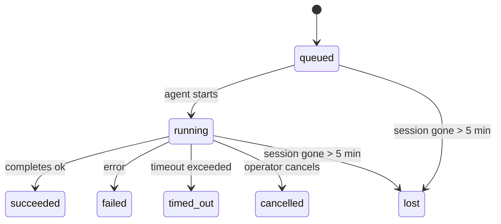

---
read_when:
    - Laufende oder kürzlich abgeschlossene Hintergrundarbeiten prüfen
    - Debugging von Zustellungsfehlern für abgekoppelte Agent-Ausführungen
    - Verstehen, wie Hintergrundläufe mit Sitzungen, Cron und Heartbeat zusammenhängen
sidebarTitle: Background tasks
summary: Nachverfolgung von Hintergrundaufgaben für ACP-Ausführungen, Unteragenten, isolierte Cron-Jobs und CLI-Vorgänge
title: Hintergrundaufgaben
x-i18n:
    generated_at: "2026-05-01T06:41:00Z"
    model: gpt-5.5
    provider: openai
    source_hash: 8782987a79989264ae3bd1ca4b16755bdfb7e295e4f77933bf3a38c136d837f4
    source_path: automation/tasks.md
    workflow: 16
---

<Note>
Suchen Sie nach Planung? Siehe [Automatisierung und Aufgaben](/de/automation), um den richtigen Mechanismus auszuwählen. Diese Seite ist das Aktivitätsprotokoll für Hintergrundarbeit, nicht der Planer.
</Note>

Hintergrundaufgaben verfolgen Arbeit, die **außerhalb Ihrer Hauptunterhaltungssitzung** läuft: ACP-Ausführungen, Subagent-Starts, isolierte Cron-Job-Ausführungen und über die CLI gestartete Vorgänge.

Tasks ersetzen **keine** Sitzungen, Cron-Jobs oder Heartbeats – sie sind das **Aktivitätsprotokoll**, das aufzeichnet, welche entkoppelte Arbeit stattgefunden hat, wann sie ausgeführt wurde und ob sie erfolgreich war.

<Note>
Nicht jeder Agent-Lauf erstellt eine Task. Heartbeat-Turns und normaler interaktiver Chat tun dies nicht. Alle Cron-Ausführungen, ACP-Starts, Subagent-Starts und CLI-Agent-Befehle tun dies.
</Note>

## Kurzfassung

- Tasks sind **Datensätze**, keine Planer – Cron und Heartbeat entscheiden, _wann_ Arbeit läuft, Tasks verfolgen, _was passiert ist_.
- ACP, Subagents, alle Cron-Jobs und CLI-Vorgänge erstellen Tasks. Heartbeat-Turns tun dies nicht.
- Jede Task durchläuft `queued → running → terminal` (succeeded, failed, timed_out, cancelled oder lost).
- Cron-Tasks bleiben aktiv, solange die Cron-Laufzeit den Job noch besitzt; wenn der
  In-Memory-Laufzeitstatus weg ist, prüft die Task-Wartung zuerst den dauerhaften Cron-
  Ausführungsverlauf, bevor sie eine Task als verloren markiert.
- Abschluss ist push-gesteuert: Entkoppelte Arbeit kann direkt benachrichtigen oder die
  anfordernde Sitzung/den Heartbeat wecken, wenn sie fertig ist. Status-Polling-Schleifen
  sind daher normalerweise die falsche Form.
- Isolierte Cron-Läufe und Subagent-Abschlüsse bereinigen nach bestem Aufwand nachverfolgte Browser-Tabs/Prozesse für ihre Kind-Sitzung, bevor die abschließende Bereinigungsbuchhaltung erfolgt.
- Isolierte Cron-Zustellung unterdrückt veraltete vorläufige Parent-Antworten, während nachgelagerte Subagent-Arbeit noch ausläuft, und bevorzugt die endgültige Ausgabe nachgelagerter Tasks, wenn diese vor der Zustellung eintrifft.
- Abschlussbenachrichtigungen werden direkt an einen Kanal zugestellt oder für den nächsten Heartbeat eingereiht.
- `openclaw tasks list` zeigt alle Tasks; `openclaw tasks audit` macht Probleme sichtbar.
- Terminale Datensätze werden 7 Tage lang aufbewahrt und dann automatisch bereinigt.

## Schnellstart

<Tabs>
  <Tab title="List and filter">
    ```bash
    # List all tasks (newest first)
    openclaw tasks list

    # Filter by runtime or status
    openclaw tasks list --runtime acp
    openclaw tasks list --status running
    ```

  </Tab>
  <Tab title="Inspect">
    ```bash
    # Show details for a specific task (by ID, run ID, or session key)
    openclaw tasks show <lookup>
    ```
  </Tab>
  <Tab title="Cancel and notify">
    ```bash
    # Cancel a running task (kills the child session)
    openclaw tasks cancel <lookup>

    # Change notification policy for a task
    openclaw tasks notify <lookup> state_changes
    ```

  </Tab>
  <Tab title="Audit and maintenance">
    ```bash
    # Run a health audit
    openclaw tasks audit

    # Preview or apply maintenance
    openclaw tasks maintenance
    openclaw tasks maintenance --apply
    ```

  </Tab>
  <Tab title="Task flow">
    ```bash
    # Inspect TaskFlow state
    openclaw tasks flow list
    openclaw tasks flow show <lookup>
    openclaw tasks flow cancel <lookup>
    ```
  </Tab>
</Tabs>

## Was eine Task erstellt

| Quelle                 | Laufzeittyp | Wann ein Task-Datensatz erstellt wird                  | Standard-Benachrichtigungsrichtlinie |
| ---------------------- | ------------ | ------------------------------------------------------ | ------------------------------------ |
| ACP-Hintergrundläufe   | `acp`        | Starten einer ACP-Kind-Sitzung                         | `done_only`                          |
| Subagent-Orchestrierung | `subagent`  | Starten eines Subagents über `sessions_spawn`          | `done_only`                          |
| Cron-Jobs (alle Typen) | `cron`       | Jede Cron-Ausführung (Hauptsitzung und isoliert)       | `silent`                             |
| CLI-Vorgänge           | `cli`        | `openclaw agent`-Befehle, die über den Gateway laufen  | `silent`                             |
| Agent-Medienjobs       | `cli`        | Sitzungsbasierte `music_generate`/`video_generate`-Läufe | `silent`                           |

<AccordionGroup>
  <Accordion title="Notify defaults for cron and media">
    Cron-Tasks der Hauptsitzung verwenden standardmäßig die Benachrichtigungsrichtlinie `silent` – sie erstellen Datensätze zur Nachverfolgung, erzeugen aber keine Benachrichtigungen. Isolierte Cron-Tasks verwenden ebenfalls standardmäßig `silent`, sind aber sichtbarer, weil sie in ihrer eigenen Sitzung laufen.

    Sitzungsbasierte `music_generate`- und `video_generate`-Läufe verwenden ebenfalls die Benachrichtigungsrichtlinie `silent`. Sie erstellen weiterhin Task-Datensätze, aber der Abschluss wird als internes Wake an die ursprüngliche Agent-Sitzung zurückgegeben, damit der Agent die Follow-up-Nachricht schreiben und die fertigen Medien selbst anhängen kann. Wenn Sie `tools.media.asyncCompletion.directSend` aktivieren, können asynchrone `video_generate`-Abschlüsse zuerst eine direkte Kanalzustellung versuchen; asynchrone `music_generate`-Abschlüsse bleiben auf dem Wake-Pfad der anfordernden Sitzung.

  </Accordion>
  <Accordion title="Concurrent video_generate guardrail">
    Während eine sitzungsbasierte `video_generate`-Task noch aktiv ist, wirkt das Tool auch als Schutzmechanismus: Wiederholte `video_generate`-Aufrufe in derselben Sitzung geben den Status der aktiven Task zurück, statt eine zweite parallele Generierung zu starten. Verwenden Sie `action: "status"`, wenn Sie von Agent-Seite aus eine explizite Fortschritts-/Statusabfrage wünschen.
  </Accordion>
  <Accordion title="What does not create tasks">
    - Heartbeat-Turns – Hauptsitzung; siehe [Heartbeat](/de/gateway/heartbeat)
    - Normale interaktive Chat-Turns
    - Direkte `/command`-Antworten

  </Accordion>
</AccordionGroup>

## Task-Lebenszyklus



| Status      | Bedeutung                                                                  |
| ----------- | -------------------------------------------------------------------------- |
| `queued`    | Erstellt, wartet darauf, dass der Agent startet                            |
| `running`   | Agent-Turn wird aktiv ausgeführt                                           |
| `succeeded` | Erfolgreich abgeschlossen                                                  |
| `failed`    | Mit einem Fehler abgeschlossen                                             |
| `timed_out` | Konfiguriertes Timeout überschritten                                       |
| `cancelled` | Vom Operator über `openclaw tasks cancel` gestoppt                         |
| `lost`      | Die Laufzeit hat nach einer 5-minütigen Kulanzfrist den autoritativen Stützzustand verloren |

Übergänge passieren automatisch – wenn der zugehörige Agent-Lauf endet, wird der Task-Status entsprechend aktualisiert.

Der Abschluss eines Agent-Laufs ist für aktive Task-Datensätze maßgeblich. Ein erfolgreicher entkoppelter Lauf wird als `succeeded` finalisiert, gewöhnliche Laufzeitfehler als `failed`, und Timeout- oder Abbruchergebnisse als `timed_out`. Wenn ein Operator die Task bereits abgebrochen hat oder die Laufzeit bereits einen stärkeren terminalen Status wie `failed`, `timed_out` oder `lost` aufgezeichnet hat, stuft ein späteres Erfolgssignal diesen terminalen Status nicht herab.

`lost` ist laufzeitbewusst:

- ACP-Tasks: Die Metadaten der stützenden ACP-Kind-Sitzung sind verschwunden.
- Subagent-Tasks: Die stützende Kind-Sitzung ist aus dem Ziel-Agent-Speicher verschwunden.
- Cron-Tasks: Die Cron-Laufzeit verfolgt den Job nicht mehr als aktiv und der dauerhafte
  Cron-Ausführungsverlauf zeigt kein terminales Ergebnis für diesen Lauf. Ein Offline-CLI-
  Audit behandelt seinen eigenen leeren In-Process-Cron-Laufzeitstatus nicht als Autorität.
- CLI-Tasks: Isolierte Kind-Sitzungs-Tasks verwenden die Kind-Sitzung; chat-gestützte
  CLI-Tasks verwenden stattdessen den Live-Laufkontext, sodass verbleibende
  Kanal-/Gruppen-/Direktsitzungszeilen sie nicht aktiv halten. Gateway-gestützte
  `openclaw agent`-Läufe werden ebenfalls aus ihrem Laufergebnis finalisiert, sodass abgeschlossene Läufe
  nicht aktiv bleiben, bis der Sweeper sie als `lost` markiert.

## Zustellung und Benachrichtigungen

Wenn eine Task einen terminalen Status erreicht, benachrichtigt OpenClaw Sie. Es gibt zwei Zustellpfade:

**Direkte Zustellung** – wenn die Task ein Kanalziel hat (`requesterOrigin`), geht die Abschlussnachricht direkt an diesen Kanal (Telegram, Discord, Slack usw.). Bei Subagent-Abschlüssen bewahrt OpenClaw außerdem gebundenes Thread-/Topic-Routing, wenn verfügbar, und kann ein fehlendes `to` / Konto aus der gespeicherten Route der anfordernden Sitzung (`lastChannel` / `lastTo` / `lastAccountId`) ergänzen, bevor die direkte Zustellung aufgegeben wird.

**Sitzungs-eingereihte Zustellung** – wenn die direkte Zustellung fehlschlägt oder kein Ursprung festgelegt ist, wird die Aktualisierung als Systemereignis in der Sitzung des Anforderers eingereiht und beim nächsten Heartbeat sichtbar.

<Tip>
Der Task-Abschluss löst ein sofortiges Heartbeat-Wake aus, sodass Sie das Ergebnis schnell sehen – Sie müssen nicht auf den nächsten geplanten Heartbeat-Tick warten.
</Tip>

Das bedeutet, dass der übliche Workflow push-basiert ist: Starten Sie entkoppelte Arbeit einmal und lassen Sie dann die Laufzeit Sie beim Abschluss wecken oder benachrichtigen. Fragen Sie den Task-Status nur ab, wenn Sie Debugging, Eingriff oder ein explizites Audit benötigen.

### Benachrichtigungsrichtlinien

Steuern Sie, wie viel Sie über jede Task hören:

| Richtlinie            | Was zugestellt wird                                                     |
| --------------------- | ----------------------------------------------------------------------- |
| `done_only` (Standard) | Nur terminaler Status (succeeded, failed usw.) – **dies ist der Standard** |
| `state_changes`       | Jeder Statusübergang und jede Fortschrittsaktualisierung                |
| `silent`              | Gar nichts                                                              |

Ändern Sie die Richtlinie, während eine Task läuft:

```bash
openclaw tasks notify <lookup> state_changes
```

## CLI-Referenz

<AccordionGroup>
  <Accordion title="tasks list">
    ```bash
    openclaw tasks list [--runtime <acp|subagent|cron|cli>] [--status <status>] [--json]
    ```

    Ausgabespalten: Task-ID, Art, Status, Zustellung, Lauf-ID, Kind-Sitzung, Zusammenfassung.

  </Accordion>
  <Accordion title="tasks show">
    ```bash
    openclaw tasks show <lookup>
    ```

    Das Such-Token akzeptiert eine Task-ID, Lauf-ID oder einen Sitzungsschlüssel. Zeigt den vollständigen Datensatz einschließlich Timing, Zustellstatus, Fehler und terminaler Zusammenfassung.

  </Accordion>
  <Accordion title="tasks cancel">
    ```bash
    openclaw tasks cancel <lookup>
    ```

    Bei ACP- und Subagent-Tasks beendet dies die Kind-Sitzung. Bei CLI-verfolgten Tasks wird der Abbruch im Task-Registry aufgezeichnet (es gibt kein separates Handle der Kind-Laufzeit). Der Status wechselt zu `cancelled` und eine Zustellbenachrichtigung wird gesendet, sofern zutreffend.

  </Accordion>
  <Accordion title="tasks notify">
    ```bash
    openclaw tasks notify <lookup> <done_only|state_changes|silent>
    ```
  </Accordion>
  <Accordion title="tasks audit">
    ```bash
    openclaw tasks audit [--json]
    ```

    Macht betriebliche Probleme sichtbar. Befunde erscheinen auch in `openclaw status`, wenn Probleme erkannt werden.

    | Befund                   | Schweregrad | Auslöser                                                                                                                       |
    | ------------------------- | ----------- | ------------------------------------------------------------------------------------------------------------------------------ |
    | `stale_queued`            | warn        | Seit mehr als 10 Minuten in der Warteschlange                                                                                  |
    | `stale_running`           | error       | Seit mehr als 30 Minuten laufend                                                                                               |
    | `lost`                    | warn/error  | Runtime-gestützte Aufgabenverantwortung ist verschwunden; beibehaltene verlorene Aufgaben warnen bis `cleanupAfter` und werden dann zu Fehlern |
    | `delivery_failed`         | warn        | Zustellung fehlgeschlagen und Benachrichtigungsrichtlinie ist nicht `silent`                                                    |
    | `missing_cleanup`         | warn        | Terminale Aufgabe ohne Cleanup-Zeitstempel                                                                                     |
    | `inconsistent_timestamps` | warn        | Timeline-Verstoß (zum Beispiel beendet, bevor gestartet)                                                                       |

  </Accordion>
  <Accordion title="tasks maintenance">
    ```bash
    openclaw tasks maintenance [--json]
    openclaw tasks maintenance --apply [--json]
    ```

    Verwenden Sie dies, um Abgleich, Cleanup-Stempelung und Bereinigung für Aufgaben und Task-Flow-Zustand in der Vorschau anzuzeigen oder anzuwenden.

    Der Abgleich ist runtime-bewusst:

    - ACP-/Subagent-Aufgaben prüfen ihre zugrunde liegende untergeordnete Sitzung.
    - Subagent-Aufgaben, deren untergeordnete Sitzung einen Tombstone für Neustart-Wiederherstellung hat, werden als verloren markiert, anstatt als wiederherstellbare zugrunde liegende Sitzungen behandelt zu werden.
    - Cron-Aufgaben prüfen, ob die Cron-Runtime den Job noch besitzt, und stellen dann den terminalen Status aus persistierten Cron-Ausführungsprotokollen/Job-Zustand wieder her, bevor sie auf `lost` zurückfallen. Nur der Gateway-Prozess ist autoritativ für die aktive In-Memory-Job-Menge von Cron; ein Offline-CLI-Audit verwendet dauerhafte Historie, markiert eine Cron-Aufgabe aber nicht allein deshalb als verloren, weil dieses lokale Set leer ist.
    - Chat-gestützte CLI-Aufgaben prüfen den besitzenden Live-Ausführungskontext, nicht nur die Chat-Sitzungszeile.

    Completion-Cleanup ist ebenfalls runtime-bewusst:

    - Subagent-Completion schließt nach bestem Aufwand verfolgte Browser-Tabs/Prozesse für die untergeordnete Sitzung, bevor das Ankündigungs-Cleanup fortfährt.
    - Completion isolierter Cron-Ausführungen schließt nach bestem Aufwand verfolgte Browser-Tabs/Prozesse für die Cron-Sitzung, bevor die Ausführung vollständig abgebaut wird.
    - Die Zustellung isolierter Cron-Ausführungen wartet bei Bedarf auf nachgelagerte Subagent-Folgearbeiten und unterdrückt veralteten Bestätigungstext des übergeordneten Elements, anstatt ihn anzukündigen.
    - Die Zustellung von Subagent-Completion bevorzugt den neuesten sichtbaren Assistant-Text; wenn dieser leer ist, fällt sie auf bereinigten neuesten Tool-/toolResult-Text zurück, und reine Timeout-Tool-Call-Ausführungen können zu einer kurzen Teilfortschrittszusammenfassung verdichtet werden. Terminal fehlgeschlagene Ausführungen melden den Fehlerstatus, ohne erfassten Antworttext erneut wiederzugeben.
    - Cleanup-Fehler verdecken nicht das tatsächliche Aufgabenergebnis.

  </Accordion>
  <Accordion title="tasks flow list | show | cancel">
    ```bash
    openclaw tasks flow list [--status <status>] [--json]
    openclaw tasks flow show <lookup> [--json]
    openclaw tasks flow cancel <lookup>
    ```

    Verwenden Sie diese Befehle, wenn der orchestrierende Task Flow für Sie relevant ist und nicht ein einzelner Hintergrundaufgabeneintrag.

  </Accordion>
</AccordionGroup>

## Chat-Aufgabenboard (`/tasks`)

Verwenden Sie `/tasks` in jeder Chat-Sitzung, um mit dieser Sitzung verknüpfte Hintergrundaufgaben anzuzeigen. Das Board zeigt aktive und kürzlich abgeschlossene Aufgaben mit Runtime, Status, Zeitangaben sowie Fortschritts- oder Fehlerdetails.

Wenn die aktuelle Sitzung keine sichtbaren verknüpften Aufgaben hat, fällt `/tasks` auf agent-lokale Aufgabenzahlen zurück, sodass Sie weiterhin eine Übersicht erhalten, ohne Details anderer Sitzungen offenzulegen.

Für das vollständige Betreiber-Ledger verwenden Sie die CLI: `openclaw tasks list`.

## Statusintegration (Aufgabendruck)

`openclaw status` enthält eine Aufgabenübersicht auf einen Blick:

```
Tasks: 3 queued · 2 running · 1 issues
```

Die Zusammenfassung meldet:

- **aktiv** — Anzahl von `queued` + `running`
- **Fehler** — Anzahl von `failed` + `timed_out` + `lost`
- **byRuntime** — Aufschlüsselung nach `acp`, `subagent`, `cron`, `cli`

Sowohl `/status` als auch das Tool `session_status` verwenden einen cleanup-bewussten Aufgaben-Snapshot: Aktive Aufgaben werden bevorzugt, veraltete abgeschlossene Zeilen werden ausgeblendet, und aktuelle Fehler werden nur angezeigt, wenn keine aktive Arbeit verbleibt. So bleibt die Statuskarte auf das konzentriert, was jetzt relevant ist.

## Speicherung und Wartung

### Wo Aufgaben gespeichert werden

Aufgabeneinträge werden in SQLite persistiert unter:

```
$OPENCLAW_STATE_DIR/tasks/runs.sqlite
```

Die Registry wird beim Gateway-Start in den Speicher geladen und synchronisiert Schreibvorgänge nach SQLite, um Dauerhaftigkeit über Neustarts hinweg sicherzustellen.
Der Gateway hält das SQLite-Write-Ahead-Log begrenzt, indem er den Standard-Autocheckpoint-Schwellenwert von SQLite sowie periodische und Shutdown-`TRUNCATE`-Checkpoints verwendet.

### Automatische Wartung

Ein Sweeper läuft alle **60 Sekunden** und behandelt vier Dinge:

<Steps>
  <Step title="Abgleich">
    Prüft, ob aktive Aufgaben noch autoritative Runtime-Unterstützung haben. ACP-/Subagent-Aufgaben verwenden den Zustand der untergeordneten Sitzung, Cron-Aufgaben verwenden die aktive Job-Verantwortung, und Chat-gestützte CLI-Aufgaben verwenden den besitzenden Ausführungskontext. Wenn dieser zugrunde liegende Zustand länger als 5 Minuten verschwunden ist, wird die Aufgabe als `lost` markiert.
  </Step>
  <Step title="ACP-Sitzungsreparatur">
    Schließt terminale oder verwaiste, vom übergeordneten Element besessene einmalige ACP-Sitzungen und schließt veraltete terminale oder verwaiste persistente ACP-Sitzungen nur dann, wenn keine aktive Konversationsbindung verbleibt.
  </Step>
  <Step title="Cleanup-Stempelung">
    Setzt einen `cleanupAfter`-Zeitstempel für terminale Aufgaben (endedAt + 7 Tage). Während der Aufbewahrung erscheinen verlorene Aufgaben im Audit weiterhin als Warnungen; nachdem `cleanupAfter` abläuft oder wenn Cleanup-Metadaten fehlen, sind sie Fehler.
  </Step>
  <Step title="Bereinigung">
    Löscht Einträge nach ihrem `cleanupAfter`-Datum.
  </Step>
</Steps>

<Note>
**Aufbewahrung:** Terminale Aufgabeneinträge werden **7 Tage** aufbewahrt und dann automatisch bereinigt. Keine Konfiguration erforderlich.
</Note>

## Wie Aufgaben mit anderen Systemen zusammenhängen

<AccordionGroup>
  <Accordion title="Aufgaben und Task Flow">
    [Task Flow](/de/automation/taskflow) ist die Flow-Orchestrierungsebene über Hintergrundaufgaben. Ein einzelner Flow kann über seine Lebensdauer hinweg mehrere Aufgaben koordinieren, indem verwaltete oder gespiegelte Synchronisierungsmodi verwendet werden. Verwenden Sie `openclaw tasks`, um einzelne Aufgabeneinträge zu prüfen, und `openclaw tasks flow`, um den orchestrierenden Flow zu prüfen.

    Weitere Details finden Sie unter [Task Flow](/de/automation/taskflow).

  </Accordion>
  <Accordion title="Aufgaben und Cron">
    Eine Cron-Job-**Definition** befindet sich in `~/.openclaw/cron/jobs.json`; der Runtime-Ausführungszustand befindet sich daneben in `~/.openclaw/cron/jobs-state.json`. **Jede** Cron-Ausführung erstellt einen Aufgabeneintrag — sowohl Hauptsitzung als auch isolierte Ausführung. Cron-Aufgaben in Hauptsitzungen verwenden standardmäßig die Benachrichtigungsrichtlinie `silent`, sodass sie nachverfolgt werden, ohne Benachrichtigungen zu erzeugen.

    Siehe [Cron-Jobs](/de/automation/cron-jobs).

  </Accordion>
  <Accordion title="Aufgaben und Heartbeat">
    Heartbeat-Ausführungen sind Hauptsitzungs-Turns — sie erstellen keine Aufgabeneinträge. Wenn eine Aufgabe abgeschlossen wird, kann sie ein Heartbeat-Aufwecken auslösen, damit Sie das Ergebnis zeitnah sehen.

    Siehe [Heartbeat](/de/gateway/heartbeat).

  </Accordion>
  <Accordion title="Aufgaben und Sitzungen">
    Eine Aufgabe kann auf einen `childSessionKey` (wo die Arbeit ausgeführt wird) und einen `requesterSessionKey` (wer sie gestartet hat) verweisen. Sitzungen sind Konversationskontext; Aufgaben sind Aktivitätsverfolgung darüber.
  </Accordion>
  <Accordion title="Aufgaben und Agent-Ausführungen">
    Die `runId` einer Aufgabe verweist auf die Agent-Ausführung, die die Arbeit erledigt. Agent-Lebenszyklusereignisse (Start, Ende, Fehler) aktualisieren den Aufgabenstatus automatisch — Sie müssen den Lebenszyklus nicht manuell verwalten.
  </Accordion>
</AccordionGroup>

## Verwandt

- [Automatisierung und Aufgaben](/de/automation) — alle Automatisierungsmechanismen auf einen Blick
- [CLI: Aufgaben](/de/cli/tasks) — CLI-Befehlsreferenz
- [Heartbeat](/de/gateway/heartbeat) — periodische Hauptsitzungs-Turns
- [Geplante Aufgaben](/de/automation/cron-jobs) — Hintergrundarbeit planen
- [Task Flow](/de/automation/taskflow) — Flow-Orchestrierung über Aufgaben
