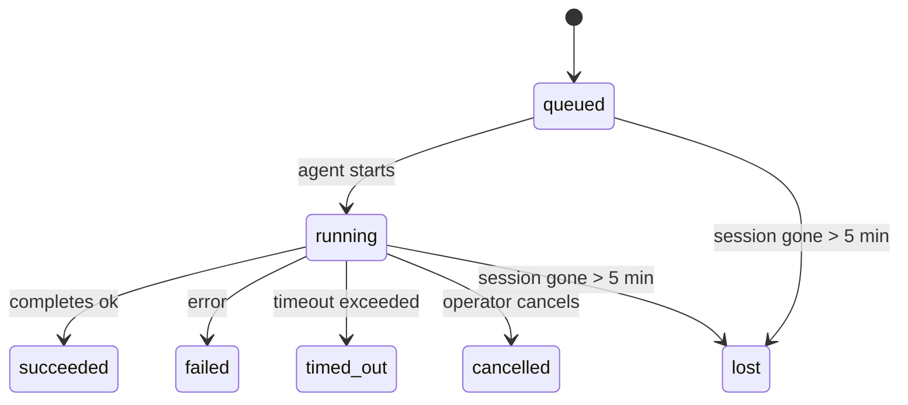

---
read_when:
    - Laufende oder kürzlich abgeschlossene Hintergrundarbeiten überprüfen
    - Debuggen von Zustellungsfehlern bei abgekoppelten Agent-Ausführungen
    - Verstehen, wie Hintergrundläufe mit Sitzungen, Cron und Heartbeat zusammenhängen
sidebarTitle: Background tasks
summary: Nachverfolgung von Hintergrundaufgaben für ACP-Ausführungen, Unteragenten, isolierte Cron-Jobs und CLI-Vorgänge
title: Hintergrundaufgaben
x-i18n:
    generated_at: "2026-05-06T06:39:35Z"
    model: gpt-5.5
    provider: openai
    source_hash: 055e16b4f53dbd089cc72eea7fe80bdaee5451dc56fa6e88a742f98e566bb57a
    source_path: automation/tasks.md
    workflow: 16
---

<Note>
Suchen Sie nach Zeitplanung? Unter [Automatisierung und Aufgaben](/de/automation) erfahren Sie, wie Sie den richtigen Mechanismus auswählen. Diese Seite ist das Aktivitätsprotokoll für Hintergrundarbeit, nicht der Scheduler.
</Note>

Hintergrundaufgaben verfolgen Arbeit, die **außerhalb Ihrer Haupt-Konversationssitzung** ausgeführt wird: ACP-Läufe, Subagent-Erzeugungen, isolierte Cron-Job-Ausführungen und über die CLI gestartete Operationen.

Aufgaben ersetzen **nicht** Sitzungen, Cron-Jobs oder Heartbeats - sie sind das **Aktivitätsprotokoll**, das erfasst, welche losgelöste Arbeit stattgefunden hat, wann sie stattfand und ob sie erfolgreich war.

<Note>
Nicht jeder Agent-Lauf erstellt eine Aufgabe. Heartbeat-Durchläufe und normale interaktive Chats tun dies nicht. Alle Cron-Ausführungen, ACP-Erzeugungen, Subagent-Erzeugungen und CLI-Agent-Befehle tun dies.
</Note>

## Kurzfassung

- Aufgaben sind **Datensätze**, keine Scheduler - Cron und Heartbeat entscheiden, _wann_ Arbeit ausgeführt wird, Aufgaben verfolgen, _was passiert ist_.
- ACP, Subagents, alle Cron-Jobs und CLI-Operationen erstellen Aufgaben. Heartbeat-Durchläufe tun dies nicht.
- Jede Aufgabe durchläuft `queued → running → terminal` (succeeded, failed, timed_out, cancelled oder lost).
- Cron-Aufgaben bleiben aktiv, solange die Cron-Laufzeit den Job noch besitzt; wenn der
  In-Memory-Laufzeitzustand verschwunden ist, prüft die Aufgabenwartung zuerst den dauerhaften Cron-
  Laufverlauf, bevor eine Aufgabe als verloren markiert wird.
- Der Abschluss ist Push-gesteuert: Losgelöste Arbeit kann direkt benachrichtigen oder die
  anfragende Sitzung/den Heartbeat wecken, wenn sie abgeschlossen ist, sodass Status-Polling-Schleifen
  normalerweise die falsche Form sind.
- Isolierte Cron-Läufe und Subagent-Abschlüsse bereinigen nach bestem Aufwand nachverfolgte Browser-Tabs/Prozesse für ihre untergeordnete Sitzung vor der abschließenden Bereinigungsbuchhaltung.
- Die Zustellung isolierter Cron-Läufe unterdrückt veraltete zwischenzeitliche übergeordnete Antworten, während nachgelagerte Subagent-Arbeit noch ausläuft, und bevorzugt finale Ausgabe von Nachkommen, wenn diese vor der Zustellung eintrifft.
- Abschlussbenachrichtigungen werden direkt an einen Kanal zugestellt oder für den nächsten Heartbeat in die Warteschlange gestellt.
- `openclaw tasks list` zeigt alle Aufgaben; `openclaw tasks audit` macht Probleme sichtbar.
- Terminale Datensätze werden 7 Tage aufbewahrt und anschließend automatisch bereinigt.

## Schnellstart

<Tabs>
  <Tab title="List and filter">
    ```bash
    # List all tasks (newest first)
    openclaw tasks list

    # Filter by runtime or status
    openclaw tasks list --runtime acp
    openclaw tasks list --status running
    ```

  </Tab>
  <Tab title="Inspect">
    ```bash
    # Show details for a specific task (by ID, run ID, or session key)
    openclaw tasks show <lookup>
    ```
  </Tab>
  <Tab title="Cancel and notify">
    ```bash
    # Cancel a running task (kills the child session)
    openclaw tasks cancel <lookup>

    # Change notification policy for a task
    openclaw tasks notify <lookup> state_changes
    ```

  </Tab>
  <Tab title="Audit and maintenance">
    ```bash
    # Run a health audit
    openclaw tasks audit

    # Preview or apply maintenance
    openclaw tasks maintenance
    openclaw tasks maintenance --apply
    ```

  </Tab>
  <Tab title="Task flow">
    ```bash
    # Inspect TaskFlow state
    openclaw tasks flow list
    openclaw tasks flow show <lookup>
    openclaw tasks flow cancel <lookup>
    ```
  </Tab>
</Tabs>

## Was eine Aufgabe erstellt

| Quelle                 | Laufzeittyp | Wann ein Aufgabendatensatz erstellt wird                         | Standard-Benachrichtigungsrichtlinie |
| ---------------------- | ------------ | ------------------------------------------------------ | --------------------- |
| ACP-Hintergrundläufe    | `acp`        | Beim Erzeugen einer untergeordneten ACP-Sitzung                           | `done_only`           |
| Subagent-Orchestrierung | `subagent`   | Beim Erzeugen eines Subagents über `sessions_spawn`               | `done_only`           |
| Cron-Jobs (alle Typen)  | `cron`       | Bei jeder Cron-Ausführung (Hauptsitzung und isoliert)       | `silent`              |
| CLI-Operationen         | `cli`        | `openclaw agent`-Befehle, die über den Gateway laufen | `silent`              |
| Agent-Medienjobs       | `cli`        | Sitzungsbasierte `music_generate`/`video_generate`-Läufe  | `silent`              |

<AccordionGroup>
  <Accordion title="Notify defaults for cron and media">
    Cron-Aufgaben in der Hauptsitzung verwenden standardmäßig die Benachrichtigungsrichtlinie `silent` - sie erstellen Datensätze zur Nachverfolgung, erzeugen aber keine Benachrichtigungen. Isolierte Cron-Aufgaben verwenden ebenfalls standardmäßig `silent`, sind aber sichtbarer, weil sie in ihrer eigenen Sitzung laufen.

    Sitzungsbasierte `music_generate`- und `video_generate`-Läufe verwenden ebenfalls die Benachrichtigungsrichtlinie `silent`. Sie erstellen weiterhin Aufgabendatensätze, aber der Abschluss wird als interner Wake an die ursprüngliche Agent-Sitzung zurückgegeben, damit der Agent die Folgenachricht schreiben und die fertigen Medien selbst anhängen kann. Abschlüsse in Gruppen/Kanälen folgen der normalen Richtlinie für sichtbare Antworten, daher verwendet der Agent das Nachrichtenwerkzeug, wenn die Quellzustellung dies erfordert. Wenn der Abschluss-Agent in einer reinen Werkzeugroute keinen Nachweis für die Zustellung per Nachrichtenwerkzeug erzeugt, sendet OpenClaw den Abschluss-Fallback direkt an den ursprünglichen Kanal, anstatt die Medien privat zu belassen.

  </Accordion>
  <Accordion title="Concurrent video_generate guardrail">
    Solange eine sitzungsbasierte `video_generate`-Aufgabe noch aktiv ist, wirkt das Werkzeug auch als Schutzmechanismus: Wiederholte `video_generate`-Aufrufe in derselben Sitzung geben den Status der aktiven Aufgabe zurück, anstatt eine zweite gleichzeitige Generierung zu starten. Verwenden Sie `action: "status"`, wenn Sie eine explizite Fortschritts-/Statusabfrage von der Agent-Seite wünschen.
  </Accordion>
  <Accordion title="What does not create tasks">
    - Heartbeat-Durchläufe - Hauptsitzung; siehe [Heartbeat](/de/gateway/heartbeat)
    - Normale interaktive Chat-Durchläufe
    - Direkte `/command`-Antworten

  </Accordion>
</AccordionGroup>

## Aufgabenlebenszyklus



| Status      | Bedeutung                                                              |
| ----------- | -------------------------------------------------------------------------- |
| `queued`    | Erstellt, wartet darauf, dass der Agent startet                                    |
| `running`   | Agent-Durchlauf wird aktiv ausgeführt                                           |
| `succeeded` | Erfolgreich abgeschlossen                                                     |
| `failed`    | Mit einem Fehler abgeschlossen                                                    |
| `timed_out` | Hat das konfigurierte Timeout überschritten                                            |
| `cancelled` | Vom Operator über `openclaw tasks cancel` gestoppt                        |
| `lost`      | Die Laufzeit hat den maßgeblichen zugrunde liegenden Zustand nach einer Kulanzzeit von 5 Minuten verloren |

Übergänge erfolgen automatisch - wenn der zugehörige Agent-Lauf endet, wird der Aufgabenstatus entsprechend aktualisiert.

Der Abschluss des Agent-Laufs ist für aktive Aufgabendatensätze maßgeblich. Ein erfolgreicher losgelöster Lauf wird als `succeeded` finalisiert, gewöhnliche Laufzeitfehler werden als `failed` finalisiert, und Timeout- oder Abbruchergebnisse werden als `timed_out` finalisiert. Wenn ein Operator die Aufgabe bereits abgebrochen hat oder die Laufzeit bereits einen stärkeren terminalen Zustand wie `failed`, `timed_out` oder `lost` aufgezeichnet hat, stuft ein späteres Erfolgssignal diesen terminalen Status nicht herab.

`lost` ist laufzeitbewusst:

- ACP-Aufgaben: Die Metadaten der zugrunde liegenden untergeordneten ACP-Sitzung sind verschwunden.
- Subagent-Aufgaben: Die zugrunde liegende untergeordnete Sitzung ist aus dem Zielspeicher des Agents verschwunden.
- Cron-Aufgaben: Die Cron-Laufzeit verfolgt den Job nicht mehr als aktiv, und der dauerhafte
  Cron-Laufverlauf zeigt kein terminales Ergebnis für diesen Lauf. Ein Offline-CLI-
  Audit behandelt seinen eigenen leeren In-Process-Cron-Laufzeitstatus nicht als maßgeblich.
- CLI-Aufgaben: Isolierte Aufgaben mit untergeordneter Sitzung verwenden die untergeordnete Sitzung; chatbasierte
  CLI-Aufgaben verwenden stattdessen den Live-Laufkontext, sodass verbleibende
  Sitzungszeilen für Kanal/Gruppe/Direktnachricht sie nicht am Leben halten. Gateway-basierte
  `openclaw agent`-Läufe werden ebenfalls anhand ihres Laufergebnisses finalisiert, sodass abgeschlossene Läufe
  nicht aktiv bleiben, bis der Sweeper sie als `lost` markiert.

## Zustellung und Benachrichtigungen

Wenn eine Aufgabe einen terminalen Zustand erreicht, benachrichtigt OpenClaw Sie. Es gibt zwei Zustellungspfade:

**Direkte Zustellung** - wenn die Aufgabe ein Kanalziel hat (den `requesterOrigin`), geht die Abschlussnachricht direkt an diesen Kanal (Telegram, Discord, Slack usw.). Bei Subagent-Abschlüssen bewahrt OpenClaw außerdem gebundenes Thread-/Themen-Routing, wenn verfügbar, und kann ein fehlendes `to` / Konto aus der gespeicherten Route der anfragenden Sitzung (`lastChannel` / `lastTo` / `lastAccountId`) ergänzen, bevor es die direkte Zustellung aufgibt.

**In die Sitzung eingereihte Zustellung** - wenn die direkte Zustellung fehlschlägt oder kein Ursprung gesetzt ist, wird die Aktualisierung als Systemereignis in die Sitzung des Anfragenden eingereiht und erscheint beim nächsten Heartbeat.

<Tip>
Der Abschluss einer Aufgabe löst einen sofortigen Heartbeat-Wake aus, sodass Sie das Ergebnis schnell sehen - Sie müssen nicht auf den nächsten geplanten Heartbeat-Tick warten.
</Tip>

Das bedeutet: Der übliche Workflow ist Push-basiert. Starten Sie losgelöste Arbeit einmal und lassen Sie die Laufzeit Sie beim Abschluss wecken oder benachrichtigen. Fragen Sie den Aufgabenstatus nur ab, wenn Sie Debugging, Eingriffe oder ein explizites Audit benötigen.

### Benachrichtigungsrichtlinien

Steuern Sie, wie viel Sie über jede Aufgabe erfahren:

| Richtlinie                | Was zugestellt wird                                                       |
| --------------------- | ----------------------------------------------------------------------- |
| `done_only` (Standard) | Nur terminaler Zustand (succeeded, failed usw.) - **dies ist der Standard** |
| `state_changes`       | Jeder Zustandsübergang und jede Fortschrittsaktualisierung                              |
| `silent`              | Gar nichts                                                          |

Ändern Sie die Richtlinie, während eine Aufgabe läuft:

```bash
openclaw tasks notify <lookup> state_changes
```

## CLI-Referenz

<AccordionGroup>
  <Accordion title="tasks list">
    ```bash
    openclaw tasks list [--runtime <acp|subagent|cron|cli>] [--status <status>] [--json]
    ```

    Ausgabespalten: Aufgaben-ID, Art, Status, Zustellung, Lauf-ID, untergeordnete Sitzung, Zusammenfassung.

  </Accordion>
  <Accordion title="tasks show">
    ```bash
    openclaw tasks show <lookup>
    ```

    Das Lookup-Token akzeptiert eine Aufgaben-ID, Lauf-ID oder einen Sitzungsschlüssel. Zeigt den vollständigen Datensatz einschließlich Zeitangaben, Zustellungszustand, Fehler und terminaler Zusammenfassung.

  </Accordion>
  <Accordion title="tasks cancel">
    ```bash
    openclaw tasks cancel <lookup>
    ```

    Bei ACP- und Subagent-Aufgaben beendet dies die untergeordnete Sitzung. Bei über die CLI nachverfolgten Aufgaben wird der Abbruch in der Aufgabenregistrierung aufgezeichnet (es gibt keinen separaten Handle für eine untergeordnete Laufzeit). Der Status wechselt zu `cancelled`, und eine Zustellbenachrichtigung wird gesendet, sofern zutreffend.

  </Accordion>
  <Accordion title="tasks notify">
    ```bash
    openclaw tasks notify <lookup> <done_only|state_changes|silent>
    ```
  </Accordion>
  <Accordion title="tasks audit">
    ```bash
    openclaw tasks audit [--json]
    ```

    Macht operative Probleme sichtbar. Befunde erscheinen auch in `openclaw status`, wenn Probleme erkannt werden.

    | Fund                      | Schweregrad | Auslöser                                                                                                                                                |
    | ------------------------- | ----------- | ------------------------------------------------------------------------------------------------------------------------------------------------------- |
    | `stale_queued`            | Warnung     | Seit mehr als 10 Minuten in der Warteschlange                                                                                                           |
    | `stale_running`           | Fehler      | Läuft seit mehr als 30 Minuten                                                                                                                          |
    | `lost`                    | Warnung/Fehler | Die runtime-gestützte Aufgabenverantwortung ist verschwunden; beibehaltene verlorene Aufgaben warnen bis `cleanupAfter` und werden danach zu Fehlern |
    | `delivery_failed`         | Warnung     | Zustellung fehlgeschlagen und Benachrichtigungsrichtlinie ist nicht `silent`                                                                            |
    | `missing_cleanup`         | Warnung     | Terminale Aufgabe ohne Cleanup-Zeitstempel                                                                                                              |
    | `inconsistent_timestamps` | Warnung     | Zeitachsenverletzung (zum Beispiel beendet, bevor gestartet)                                                                                            |

  </Accordion>
  <Accordion title="tasks maintenance">
    ```bash
    openclaw tasks maintenance [--json]
    openclaw tasks maintenance --apply [--json]
    ```

    Verwenden Sie dies, um Abstimmung, Cleanup-Stempelung und Bereinigung für Aufgaben und Task Flow-Zustand vorab anzuzeigen oder anzuwenden.

    Die Abstimmung ist runtime-bewusst:

    - ACP-/Subagent-Aufgaben prüfen ihre zugrunde liegende Child-Sitzung.
    - Subagent-Aufgaben, deren Child-Sitzung einen Tombstone für Neustartwiederherstellung hat, werden als verloren markiert, statt als wiederherstellbare zugrunde liegende Sitzungen behandelt zu werden.
    - Cron-Aufgaben prüfen, ob die Cron-Runtime den Job noch besitzt, und stellen dann den terminalen Status aus persistierten Cron-Ausführungsprotokollen/Job-Zustand wieder her, bevor sie auf `lost` zurückfallen. Nur der Gateway-Prozess ist autoritativ für die im Arbeitsspeicher gehaltene Cron-Menge aktiver Jobs; ein Offline-CLI-Audit verwendet dauerhafte Historie, markiert eine Cron-Aufgabe aber nicht allein deshalb als verloren, weil dieses lokale Set leer ist.
    - Chat-gestützte CLI-Aufgaben prüfen den besitzenden Live-Ausführungskontext, nicht nur die Chat-Sitzungszeile.

    Abschluss-Cleanup ist ebenfalls runtime-bewusst:

    - Subagent-Abschluss schließt nach bestem Aufwand verfolgte Browser-Tabs/Prozesse für die Child-Sitzung, bevor das Ankündigungs-Cleanup fortgesetzt wird.
    - Isolierter Cron-Abschluss schließt nach bestem Aufwand verfolgte Browser-Tabs/Prozesse für die Cron-Sitzung, bevor die Ausführung vollständig abgebaut wird.
    - Isolierte Cron-Zustellung wartet bei Bedarf auf nachgelagerte Subagent-Nachverfolgung und unterdrückt veralteten übergeordneten Bestätigungstext, statt ihn anzukündigen.
    - Subagent-Abschlusszustellung bevorzugt den neuesten sichtbaren Assistententext; wenn dieser leer ist, fällt sie auf bereinigten neuesten Tool-/toolResult-Text zurück, und Ausführungen mit reinen Timeout-Tool-Aufrufen können zu einer kurzen Teilfortschrittszusammenfassung zusammengefasst werden. Terminal fehlgeschlagene Ausführungen kündigen den Fehlerstatus an, ohne erfassten Antworttext erneut wiederzugeben.
    - Cleanup-Fehler verdecken nicht das tatsächliche Aufgabenergebnis.

  </Accordion>
  <Accordion title="tasks flow list | show | cancel">
    ```bash
    openclaw tasks flow list [--status <status>] [--json]
    openclaw tasks flow show <lookup> [--json]
    openclaw tasks flow cancel <lookup>
    ```

    Verwenden Sie diese Befehle, wenn der orchestrierende Task Flow für Sie relevant ist und nicht ein einzelner Hintergrundaufgabendatensatz.

  </Accordion>
</AccordionGroup>

## Chat-Aufgabenboard (`/tasks`)

Verwenden Sie `/tasks` in jeder Chat-Sitzung, um Hintergrundaufgaben zu sehen, die mit dieser Sitzung verknüpft sind. Das Board zeigt aktive und kürzlich abgeschlossene Aufgaben mit Runtime, Status, Timing sowie Fortschritts- oder Fehlerdetails.

Wenn die aktuelle Sitzung keine sichtbaren verknüpften Aufgaben hat, greift `/tasks` auf agent-lokale Aufgabenanzahlen zurück, sodass Sie weiterhin eine Übersicht erhalten, ohne Details anderer Sitzungen offenzulegen.

Für das vollständige Operator-Ledger verwenden Sie die CLI: `openclaw tasks list`.

## Statusintegration (Aufgabendruck)

`openclaw status` enthält eine Aufgabenübersicht auf einen Blick:

```
Tasks: 3 queued · 2 running · 1 issues
```

Die Übersicht meldet:

- **aktiv** - Anzahl von `queued` + `running`
- **Fehler** - Anzahl von `failed` + `timed_out` + `lost`
- **byRuntime** - Aufschlüsselung nach `acp`, `subagent`, `cron`, `cli`

Sowohl `/status` als auch das Tool `session_status` verwenden einen cleanup-bewussten Aufgaben-Snapshot: aktive Aufgaben werden bevorzugt, veraltete abgeschlossene Zeilen werden ausgeblendet, und aktuelle Fehler erscheinen nur, wenn keine aktive Arbeit mehr verbleibt. Dadurch bleibt die Statuskarte auf das fokussiert, was gerade wichtig ist.

## Speicherung und Wartung

### Wo Aufgaben gespeichert werden

Aufgabendatensätze bleiben in SQLite gespeichert unter:

```
$OPENCLAW_STATE_DIR/tasks/runs.sqlite
```

Die Registry wird beim Gateway-Start in den Arbeitsspeicher geladen und synchronisiert Schreibvorgänge zur Dauerhaftigkeit über Neustarts hinweg nach SQLite.
Der Gateway hält das SQLite-Write-Ahead-Log begrenzt, indem er den SQLite-Standardgrenzwert für Autocheckpoints sowie periodische und Shutdown-`TRUNCATE`-Checkpoints verwendet.

### Automatische Wartung

Ein Sweeper läuft alle **60 Sekunden** und erledigt vier Dinge:

<Steps>
  <Step title="Reconciliation">
    Prüft, ob aktive Aufgaben noch autoritative Runtime-Grundlagen haben. ACP-/Subagent-Aufgaben verwenden den Child-Sitzungszustand, Cron-Aufgaben verwenden den Besitz aktiver Jobs, und chat-gestützte CLI-Aufgaben verwenden den besitzenden Ausführungskontext. Wenn dieser zugrunde liegende Zustand länger als 5 Minuten verschwunden ist, wird die Aufgabe als `lost` markiert.
  </Step>
  <Step title="ACP session repair">
    Schließt terminale oder verwaiste, vom Parent besessene One-Shot-ACP-Sitzungen und schließt veraltete terminale oder verwaiste persistente ACP-Sitzungen nur dann, wenn keine aktive Gesprächsbindung mehr besteht.
  </Step>
  <Step title="Cleanup stamping">
    Setzt einen `cleanupAfter`-Zeitstempel auf terminale Aufgaben (endedAt + 7 Tage). Während der Aufbewahrung erscheinen verlorene Aufgaben im Audit weiterhin als Warnungen; nach Ablauf von `cleanupAfter` oder wenn Cleanup-Metadaten fehlen, sind sie Fehler.
  </Step>
  <Step title="Pruning">
    Löscht Datensätze nach ihrem `cleanupAfter`-Datum.
  </Step>
</Steps>

<Note>
**Aufbewahrung:** Terminale Aufgabendatensätze werden **7 Tage** aufbewahrt und dann automatisch bereinigt. Keine Konfiguration erforderlich.
</Note>

## Wie Aufgaben mit anderen Systemen zusammenhängen

<AccordionGroup>
  <Accordion title="Tasks and Task Flow">
    [Task Flow](/de/automation/taskflow) ist die Flow-Orchestrierungsebene über Hintergrundaufgaben. Ein einzelner Flow kann über seine Lebensdauer hinweg mehrere Aufgaben mit verwalteten oder gespiegelten Synchronisierungsmodi koordinieren. Verwenden Sie `openclaw tasks`, um einzelne Aufgabendatensätze zu prüfen, und `openclaw tasks flow`, um den orchestrierenden Flow zu prüfen.

    Details finden Sie unter [Task Flow](/de/automation/taskflow).

  </Accordion>
  <Accordion title="Tasks and cron">
    Eine Cron-Job-**Definition** liegt in `~/.openclaw/cron/jobs.json`; der Runtime-Ausführungszustand liegt daneben in `~/.openclaw/cron/jobs-state.json`. **Jede** Cron-Ausführung erstellt einen Aufgabendatensatz - sowohl in der Hauptsitzung als auch isoliert. Cron-Aufgaben der Hauptsitzung verwenden standardmäßig die Benachrichtigungsrichtlinie `silent`, sodass sie nachverfolgt werden, ohne Benachrichtigungen zu erzeugen.

    Siehe [Cron-Jobs](/de/automation/cron-jobs).

  </Accordion>
  <Accordion title="Tasks and heartbeat">
    Heartbeat-Ausführungen sind Turns der Hauptsitzung - sie erstellen keine Aufgabendatensätze. Wenn eine Aufgabe abgeschlossen wird, kann sie ein Heartbeat-Wecken auslösen, damit Sie das Ergebnis zeitnah sehen.

    Siehe [Heartbeat](/de/gateway/heartbeat).

  </Accordion>
  <Accordion title="Tasks and sessions">
    Eine Aufgabe kann auf einen `childSessionKey` (wo die Arbeit läuft) und einen `requesterSessionKey` (wer sie gestartet hat) verweisen. Sitzungen sind Gesprächskontext; Aufgaben sind Aktivitätsverfolgung darüber.
  </Accordion>
  <Accordion title="Tasks and agent runs">
    Die `runId` einer Aufgabe verknüpft sie mit der Agent-Ausführung, die die Arbeit erledigt. Agent-Lifecycle-Ereignisse (Start, Ende, Fehler) aktualisieren den Aufgabenstatus automatisch - Sie müssen den Lifecycle nicht manuell verwalten.
  </Accordion>
</AccordionGroup>

## Verwandt

- [Automatisierung und Aufgaben](/de/automation) - alle Automatisierungsmechanismen auf einen Blick
- [CLI: Aufgaben](/de/cli/tasks) - CLI-Befehlsreferenz
- [Heartbeat](/de/gateway/heartbeat) - periodische Turns der Hauptsitzung
- [Geplante Aufgaben](/de/automation/cron-jobs) - Hintergrundarbeit planen
- [Task Flow](/de/automation/taskflow) - Flow-Orchestrierung über Aufgaben
