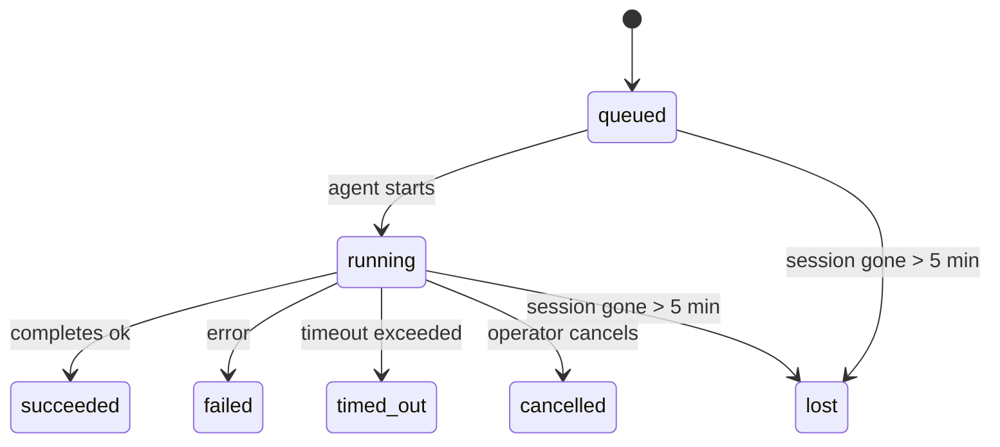

---
read_when:
    - Laufende oder kürzlich abgeschlossene Hintergrundarbeiten prüfen
    - Fehlerbehebung bei Zustellungsfehlern für losgelöste Agentenläufe
    - Verstehen, wie Hintergrundausführungen mit Sitzungen, Cron und Heartbeat zusammenhängen
sidebarTitle: Background tasks
summary: Nachverfolgung von Hintergrundaufgaben für ACP-Ausführungen, Subagenten, isolierte Cron-Jobs und CLI-Vorgänge
title: Hintergrundaufgaben
x-i18n:
    generated_at: "2026-05-05T01:44:24Z"
    model: gpt-5.5
    provider: openai
    source_hash: 60d6ea6178535b19b95d761b8e8b05a665234584ae69852fd21097988aa32991
    source_path: automation/tasks.md
    workflow: 16
---

<Note>
Suchen Sie nach Planung? Unter [Automatisierung und Aufgaben](/de/automation) finden Sie Hilfe bei der Wahl des richtigen Mechanismus. Diese Seite ist das Aktivitätsprotokoll für Hintergrundarbeit, nicht der Scheduler.
</Note>

Hintergrundaufgaben verfolgen Arbeit, die **außerhalb Ihrer Haupt-Konversationssitzung** ausgeführt wird: ACP-Ausführungen, Subagent-Starts, isolierte Cron-Job-Ausführungen und über die CLI gestartete Vorgänge.

Aufgaben ersetzen **nicht** Sitzungen, Cron-Jobs oder Heartbeats — sie sind das **Aktivitätsprotokoll**, das erfasst, welche losgelöste Arbeit wann stattgefunden hat und ob sie erfolgreich war.

<Note>
Nicht jeder Agent-Lauf erstellt eine Aufgabe. Heartbeat-Turns und normaler interaktiver Chat tun dies nicht. Alle Cron-Ausführungen, ACP-Starts, Subagent-Starts und CLI-Agent-Befehle tun dies.
</Note>

## Kurzfassung

- Aufgaben sind **Datensätze**, keine Scheduler — Cron und Heartbeat entscheiden, _wann_ Arbeit ausgeführt wird, Aufgaben verfolgen, _was passiert ist_.
- ACP, Subagents, alle Cron-Jobs und CLI-Vorgänge erstellen Aufgaben. Heartbeat-Turns tun dies nicht.
- Jede Aufgabe durchläuft `queued → running → terminal` (succeeded, failed, timed_out, cancelled oder lost).
- Cron-Aufgaben bleiben aktiv, solange die Cron-Runtime den Job noch besitzt; wenn der
  In-Memory-Runtime-Zustand verschwunden ist, prüft die Aufgabenwartung zuerst den dauerhaften Cron-
  Ausführungsverlauf, bevor eine Aufgabe als lost markiert wird.
- Abschluss ist pushgesteuert: Losgelöste Arbeit kann direkt benachrichtigen oder die
  anfragende Sitzung/den Heartbeat wecken, wenn sie beendet ist, sodass Status-Polling-Schleifen
  in der Regel die falsche Form sind.
- Isolierte Cron-Läufe und Subagent-Abschlüsse bereinigen nach bestem Aufwand verfolgte Browser-Tabs/Prozesse für ihre Child-Session vor der abschließenden Bereinigungsbuchführung.
- Die Auslieferung isolierter Cron-Läufe unterdrückt veraltete vorläufige Parent-Antworten, während nachgelagerte Subagent-Arbeit noch abgearbeitet wird, und bevorzugt die endgültige Ausgabe der Nachfahren, wenn diese vor der Auslieferung eintrifft.
- Abschlussbenachrichtigungen werden direkt an einen Kanal ausgeliefert oder für den nächsten Heartbeat in die Warteschlange gestellt.
- `openclaw tasks list` zeigt alle Aufgaben; `openclaw tasks audit` macht Probleme sichtbar.
- Terminal-Datensätze werden 7 Tage aufbewahrt und dann automatisch bereinigt.

## Schnellstart

<Tabs>
  <Tab title="List and filter">
    ```bash
    # List all tasks (newest first)
    openclaw tasks list

    # Filter by runtime or status
    openclaw tasks list --runtime acp
    openclaw tasks list --status running
    ```

  </Tab>
  <Tab title="Inspect">
    ```bash
    # Show details for a specific task (by ID, run ID, or session key)
    openclaw tasks show <lookup>
    ```
  </Tab>
  <Tab title="Cancel and notify">
    ```bash
    # Cancel a running task (kills the child session)
    openclaw tasks cancel <lookup>

    # Change notification policy for a task
    openclaw tasks notify <lookup> state_changes
    ```

  </Tab>
  <Tab title="Audit and maintenance">
    ```bash
    # Run a health audit
    openclaw tasks audit

    # Preview or apply maintenance
    openclaw tasks maintenance
    openclaw tasks maintenance --apply
    ```

  </Tab>
  <Tab title="Task flow">
    ```bash
    # Inspect TaskFlow state
    openclaw tasks flow list
    openclaw tasks flow show <lookup>
    openclaw tasks flow cancel <lookup>
    ```
  </Tab>
</Tabs>

## Was eine Aufgabe erstellt

| Quelle                 | Runtime-Typ | Wann ein Aufgabendatensatz erstellt wird                          | Standard-Benachrichtigungsrichtlinie |
| ---------------------- | ------------ | ------------------------------------------------------ | --------------------- |
| ACP-Hintergrundläufe    | `acp`        | Beim Starten einer Child-ACP-Sitzung                           | `done_only`           |
| Subagent-Orchestrierung | `subagent`   | Beim Starten eines Subagents über `sessions_spawn`               | `done_only`           |
| Cron-Jobs (alle Typen)  | `cron`       | Bei jeder Cron-Ausführung (Hauptsitzung und isoliert)       | `silent`              |
| CLI-Vorgänge         | `cli`        | `openclaw agent`-Befehle, die über den Gateway laufen | `silent`              |
| Agent-Medienjobs       | `cli`        | Sitzungsbasierte `music_generate`-/`video_generate`-Läufe  | `silent`              |

<AccordionGroup>
  <Accordion title="Notify defaults for cron and media">
    Cron-Aufgaben der Hauptsitzung verwenden standardmäßig die Benachrichtigungsrichtlinie `silent` — sie erstellen Datensätze zur Nachverfolgung, erzeugen aber keine Benachrichtigungen. Isolierte Cron-Aufgaben verwenden ebenfalls standardmäßig `silent`, sind aber sichtbarer, da sie in ihrer eigenen Sitzung laufen.

    Sitzungsbasierte `music_generate`- und `video_generate`-Läufe verwenden ebenfalls die Benachrichtigungsrichtlinie `silent`. Sie erstellen weiterhin Aufgabendatensätze, aber der Abschluss wird als internes Wake an die ursprüngliche Agent-Sitzung zurückgegeben, damit der Agent die Folgenachricht schreiben und das fertige Medium selbst anhängen kann. Abschlüsse in Gruppen/Kanälen folgen der normalen Richtlinie für sichtbare Antworten, sodass der Agent das Nachrichtenwerkzeug verwendet, wenn die Quellzustellung dies erfordert.

  </Accordion>
  <Accordion title="Concurrent video_generate guardrail">
    Während eine sitzungsbasierte `video_generate`-Aufgabe noch aktiv ist, dient das Werkzeug auch als Leitplanke: Wiederholte `video_generate`-Aufrufe in derselben Sitzung geben den aktiven Aufgabenstatus zurück, anstatt eine zweite parallele Generierung zu starten. Verwenden Sie `action: "status"`, wenn Sie eine explizite Fortschritts-/Statusabfrage von der Agent-Seite wünschen.
  </Accordion>
  <Accordion title="What does not create tasks">
    - Heartbeat-Turns — Hauptsitzung; siehe [Heartbeat](/de/gateway/heartbeat)
    - Normale interaktive Chat-Turns
    - Direkte `/command`-Antworten

  </Accordion>
</AccordionGroup>

## Aufgabenlebenszyklus



| Status      | Bedeutung                                                              |
| ----------- | -------------------------------------------------------------------------- |
| `queued`    | Erstellt, wartet auf den Start des Agents                                    |
| `running`   | Agent-Turn wird aktiv ausgeführt                                           |
| `succeeded` | Erfolgreich abgeschlossen                                                     |
| `failed`    | Mit einem Fehler abgeschlossen                                                    |
| `timed_out` | Konfiguriertes Timeout überschritten                                            |
| `cancelled` | Durch den Operator über `openclaw tasks cancel` gestoppt                        |
| `lost`      | Die Runtime hat den autoritativen unterstützenden Zustand nach einer 5-minütigen Kulanzfrist verloren |

Übergänge erfolgen automatisch — wenn der zugehörige Agent-Lauf endet, wird der Aufgabenstatus entsprechend aktualisiert.

Der Abschluss des Agent-Laufs ist für aktive Aufgabendatensätze autoritativ. Ein erfolgreicher losgelöster Lauf wird als `succeeded` finalisiert, gewöhnliche Laufzeitfehler als `failed` und Timeout- oder Abbruchergebnisse als `timed_out`. Wenn ein Operator die Aufgabe bereits abgebrochen hat oder die Runtime bereits einen stärkeren Terminal-Zustand wie `failed`, `timed_out` oder `lost` erfasst hat, stuft ein späteres Erfolgssignal diesen Terminal-Status nicht herunter.

`lost` ist runtimebewusst:

- ACP-Aufgaben: Unterstützende ACP-Child-Session-Metadaten sind verschwunden.
- Subagent-Aufgaben: Unterstützende Child-Session ist aus dem Ziel-Agent-Speicher verschwunden.
- Cron-Aufgaben: Die Cron-Runtime verfolgt den Job nicht mehr als aktiv und der dauerhafte
  Cron-Ausführungsverlauf zeigt kein Terminal-Ergebnis für diesen Lauf. Ein Offline-CLI-
  Audit behandelt seinen eigenen leeren In-Process-Cron-Runtime-Zustand nicht als Autorität.
- CLI-Aufgaben: Isolierte Child-Session-Aufgaben verwenden die Child-Session; chatbasierte
  CLI-Aufgaben verwenden stattdessen den Live-Ausführungskontext, sodass verbleibende
  Kanal-/Gruppen-/Direktsitzungszeilen sie nicht aktiv halten. Gateway-gestützte
  `openclaw agent`-Läufe werden ebenfalls anhand ihres Laufergebnisses finalisiert, sodass abgeschlossene Läufe
  nicht aktiv bleiben, bis der Sweeper sie als `lost` markiert.

## Auslieferung und Benachrichtigungen

Wenn eine Aufgabe einen Terminal-Zustand erreicht, benachrichtigt OpenClaw Sie. Es gibt zwei Auslieferungspfade:

**Direkte Auslieferung** — wenn die Aufgabe ein Kanalziel hat (den `requesterOrigin`), geht die Abschlussnachricht direkt an diesen Kanal (Telegram, Discord, Slack usw.). Für Subagent-Abschlüsse bewahrt OpenClaw außerdem gebundene Thread-/Topic-Routen, wenn verfügbar, und kann ein fehlendes `to` / Konto aus der gespeicherten Route der anfragenden Sitzung (`lastChannel` / `lastTo` / `lastAccountId`) ergänzen, bevor die direkte Auslieferung aufgegeben wird.

**Sitzungswarteschlangen-Auslieferung** — wenn die direkte Auslieferung fehlschlägt oder kein Ursprung gesetzt ist, wird die Aktualisierung als Systemereignis in die Sitzung der anfragenden Person eingereiht und beim nächsten Heartbeat sichtbar.

<Tip>
Der Aufgabenabschluss löst ein sofortiges Heartbeat-Wake aus, sodass Sie das Ergebnis schnell sehen — Sie müssen nicht auf den nächsten geplanten Heartbeat-Tick warten.
</Tip>

Das bedeutet, dass der übliche Workflow pushbasiert ist: Starten Sie losgelöste Arbeit einmal und lassen Sie die Runtime Sie beim Abschluss wecken oder benachrichtigen. Fragen Sie den Aufgabenstatus nur ab, wenn Sie Debugging, Eingriffe oder ein explizites Audit benötigen.

### Benachrichtigungsrichtlinien

Steuern Sie, wie viel Sie zu jeder Aufgabe hören:

| Richtlinie                | Was ausgeliefert wird                                                       |
| --------------------- | ----------------------------------------------------------------------- |
| `done_only` (Standard) | Nur Terminal-Zustand (succeeded, failed usw.) — **dies ist der Standard** |
| `state_changes`       | Jeder Zustandsübergang und jede Fortschrittsaktualisierung                              |
| `silent`              | Gar nichts                                                          |

Ändern Sie die Richtlinie, während eine Aufgabe läuft:

```bash
openclaw tasks notify <lookup> state_changes
```

## CLI-Referenz

<AccordionGroup>
  <Accordion title="tasks list">
    ```bash
    openclaw tasks list [--runtime <acp|subagent|cron|cli>] [--status <status>] [--json]
    ```

    Ausgabespalten: Aufgaben-ID, Art, Status, Auslieferung, Lauf-ID, Child-Session, Zusammenfassung.

  </Accordion>
  <Accordion title="tasks show">
    ```bash
    openclaw tasks show <lookup>
    ```

    Das Lookup-Token akzeptiert eine Aufgaben-ID, Lauf-ID oder einen Sitzungsschlüssel. Zeigt den vollständigen Datensatz einschließlich Timing, Auslieferungszustand, Fehler und Terminal-Zusammenfassung.

  </Accordion>
  <Accordion title="tasks cancel">
    ```bash
    openclaw tasks cancel <lookup>
    ```

    Bei ACP- und Subagent-Aufgaben beendet dies die Child-Session. Bei CLI-verfolgten Aufgaben wird der Abbruch in der Aufgabenregistrierung erfasst (es gibt keinen separaten Child-Runtime-Handle). Der Status wechselt zu `cancelled`, und eine Auslieferungsbenachrichtigung wird gesendet, sofern zutreffend.

  </Accordion>
  <Accordion title="tasks notify">
    ```bash
    openclaw tasks notify <lookup> <done_only|state_changes|silent>
    ```
  </Accordion>
  <Accordion title="tasks audit">
    ```bash
    openclaw tasks audit [--json]
    ```

    Macht betriebliche Probleme sichtbar. Befunde erscheinen auch in `openclaw status`, wenn Probleme erkannt werden.

    | Ergebnis                  | Schweregrad      | Auslöser                                                                                                            |
    | ------------------------- | ---------------- | ------------------------------------------------------------------------------------------------------------------- |
    | `stale_queued`            | Warnung          | Seit mehr als 10 Minuten eingereiht                                                                                 |
    | `stale_running`           | Fehler           | Seit mehr als 30 Minuten laufend                                                                                    |
    | `lost`                    | Warnung/Fehler   | Die durch die Laufzeitumgebung gestützte Aufgabeninhaberschaft ist verschwunden; beibehaltene verlorene Aufgaben werden bis `cleanupAfter` als Warnungen gemeldet und danach zu Fehlern |
    | `delivery_failed`         | Warnung          | Zustellung fehlgeschlagen und Benachrichtigungsrichtlinie ist nicht `silent`                                         |
    | `missing_cleanup`         | Warnung          | Beendete Aufgabe ohne Bereinigungszeitstempel                                                                       |
    | `inconsistent_timestamps` | Warnung          | Zeitachsenverstoß (zum Beispiel beendet, bevor gestartet)                                                           |

  </Accordion>
  <Accordion title="tasks maintenance">
    ```bash
    openclaw tasks maintenance [--json]
    openclaw tasks maintenance --apply [--json]
    ```

    Verwenden Sie dies, um Abgleich, Bereinigungsstempelung und Pruning für Aufgaben und Task-Flow-Zustand in der Vorschau anzuzeigen oder anzuwenden.

    Der Abgleich berücksichtigt die Laufzeitumgebung:

    - ACP-/Subagent-Aufgaben prüfen ihre zugrunde liegende untergeordnete Sitzung.
    - Subagent-Aufgaben, deren untergeordnete Sitzung einen Tombstone für die Neustartwiederherstellung hat, werden als verloren markiert, statt als wiederherstellbare zugrunde liegende Sitzungen behandelt zu werden.
    - Cron-Aufgaben prüfen, ob die Cron-Laufzeitumgebung den Job noch besitzt, und stellen dann den beendeten Status aus persistierten Cron-Ausführungsprotokollen/dem Job-Zustand wieder her, bevor sie auf `lost` zurückfallen. Nur der Gateway-Prozess ist für die speicherinterne Menge aktiver Cron-Jobs autoritativ; der Offline-CLI-Audit verwendet dauerhafte Historie, markiert eine Cron-Aufgabe aber nicht allein deshalb als verloren, weil dieses lokale Set leer ist.
    - Chat-gestützte CLI-Aufgaben prüfen den besitzenden Live-Ausführungskontext, nicht nur die Chat-Sitzungszeile.

    Die Bereinigung nach Abschluss berücksichtigt ebenfalls die Laufzeitumgebung:

    - Beim Subagent-Abschluss werden nach bestem Aufwand nachverfolgte Browser-Tabs/-Prozesse für die untergeordnete Sitzung geschlossen, bevor die Ankündigungsbereinigung fortgesetzt wird.
    - Beim isolierten Cron-Abschluss werden nach bestem Aufwand nachverfolgte Browser-Tabs/-Prozesse für die Cron-Sitzung geschlossen, bevor die Ausführung vollständig beendet wird.
    - Die isolierte Cron-Zustellung wartet bei Bedarf auf Nachläufe nachgeordneter Subagents und unterdrückt veralteten Bestätigungstext des übergeordneten Elements, statt ihn anzukündigen.
    - Die Zustellung des Subagent-Abschlusses bevorzugt den neuesten sichtbaren Assistententext; wenn dieser leer ist, fällt sie auf bereinigten neuesten tool/toolResult-Text zurück, und reine Timeout-Tool-Call-Ausführungen können zu einer kurzen Teilfortschrittszusammenfassung zusammengefasst werden. Beendete fehlgeschlagene Ausführungen kündigen den Fehlerstatus an, ohne erfassten Antworttext erneut wiederzugeben.
    - Bereinigungsfehler verdecken nicht das tatsächliche Aufgabenergebnis.

  </Accordion>
  <Accordion title="tasks flow list | show | cancel">
    ```bash
    openclaw tasks flow list [--status <status>] [--json]
    openclaw tasks flow show <lookup> [--json]
    openclaw tasks flow cancel <lookup>
    ```

    Verwenden Sie diese Befehle, wenn der orchestrierende Task Flow für Sie relevant ist und nicht ein einzelner Hintergrundaufgabendatensatz.

  </Accordion>
</AccordionGroup>

## Chat-Aufgabenübersicht (`/tasks`)

Verwenden Sie `/tasks` in jeder Chat-Sitzung, um Hintergrundaufgaben zu sehen, die mit dieser Sitzung verknüpft sind. Die Übersicht zeigt aktive und kürzlich abgeschlossene Aufgaben mit Laufzeitumgebung, Status, Timing sowie Fortschritts- oder Fehlerdetails.

Wenn die aktuelle Sitzung keine sichtbaren verknüpften Aufgaben hat, fällt `/tasks` auf agentenlokale Aufgabenzählungen zurück, sodass Sie weiterhin einen Überblick erhalten, ohne Details anderer Sitzungen offenzulegen.

Für das vollständige Operator-Protokoll verwenden Sie die CLI: `openclaw tasks list`.

## Statusintegration (Aufgabenbelastung)

`openclaw status` enthält eine Aufgabenübersicht auf einen Blick:

```
Tasks: 3 queued · 2 running · 1 issues
```

Die Zusammenfassung meldet:

- **active** — Anzahl von `queued` + `running`
- **failures** — Anzahl von `failed` + `timed_out` + `lost`
- **byRuntime** — Aufschlüsselung nach `acp`, `subagent`, `cron`, `cli`

Sowohl `/status` als auch das Tool `session_status` verwenden einen bereinigungsbewussten Aufgaben-Snapshot: aktive Aufgaben werden bevorzugt, veraltete abgeschlossene Zeilen werden ausgeblendet, und aktuelle Fehler werden nur angezeigt, wenn keine aktive Arbeit mehr verbleibt. So bleibt die Statuskarte auf das fokussiert, was im Moment wichtig ist.

## Speicherung und Wartung

### Speicherort der Aufgaben

Aufgabendatensätze werden in SQLite persistiert unter:

```
$OPENCLAW_STATE_DIR/tasks/runs.sqlite
```

Die Registry wird beim Start des Gateway in den Speicher geladen und synchronisiert Schreibvorgänge zur Dauerhaftigkeit über Neustarts hinweg nach SQLite.
Der Gateway hält das SQLite-Write-Ahead-Log begrenzt, indem er die standardmäßige Autocheckpoint-Schwelle von SQLite sowie periodische und beim Herunterfahren ausgeführte `TRUNCATE`-Checkpoints verwendet.

### Automatische Wartung

Ein Bereinigungsprozess läuft alle **60 Sekunden** und behandelt vier Dinge:

<Steps>
  <Step title="Abgleich">
    Prüft, ob aktive Aufgaben noch autoritative Laufzeitunterstützung haben. ACP-/Subagent-Aufgaben verwenden den Zustand der untergeordneten Sitzung, Cron-Aufgaben verwenden die Inhaberschaft aktiver Jobs, und chat-gestützte CLI-Aufgaben verwenden den besitzenden Ausführungskontext. Wenn dieser unterstützende Zustand länger als 5 Minuten verschwunden ist, wird die Aufgabe als `lost` markiert.
  </Step>
  <Step title="ACP-Sitzungsreparatur">
    Schließt beendete oder verwaiste, parent-eigene einmalige ACP-Sitzungen und schließt veraltete beendete oder verwaiste persistente ACP-Sitzungen nur dann, wenn keine aktive Konversationsbindung mehr besteht.
  </Step>
  <Step title="Bereinigungsstempelung">
    Setzt einen `cleanupAfter`-Zeitstempel für beendete Aufgaben (endedAt + 7 Tage). Während der Aufbewahrungsfrist erscheinen verlorene Aufgaben im Audit weiterhin als Warnungen; nachdem `cleanupAfter` abgelaufen ist oder wenn Bereinigungsmetadaten fehlen, sind sie Fehler.
  </Step>
  <Step title="Pruning">
    Löscht Datensätze nach ihrem `cleanupAfter`-Datum.
  </Step>
</Steps>

<Note>
**Aufbewahrung:** beendete Aufgabendatensätze werden **7 Tage** lang aufbewahrt und dann automatisch bereinigt. Keine Konfiguration erforderlich.
</Note>

## Wie Aufgaben mit anderen Systemen zusammenhängen

<AccordionGroup>
  <Accordion title="Aufgaben und Task Flow">
    [Task Flow](/de/automation/taskflow) ist die Orchestrierungsschicht für Abläufe oberhalb von Hintergrundaufgaben. Ein einzelner Flow kann über seine Lebensdauer hinweg mehrere Aufgaben mit verwalteten oder gespiegelten Synchronisierungsmodi koordinieren. Verwenden Sie `openclaw tasks`, um einzelne Aufgabendatensätze zu prüfen, und `openclaw tasks flow`, um den orchestrierenden Flow zu prüfen.

    Details finden Sie unter [Task Flow](/de/automation/taskflow).

  </Accordion>
  <Accordion title="Aufgaben und Cron">
    Eine Cron-Job-**Definition** befindet sich in `~/.openclaw/cron/jobs.json`; der Laufzeitausführungszustand liegt daneben in `~/.openclaw/cron/jobs-state.json`. **Jede** Cron-Ausführung erstellt einen Aufgabendatensatz — sowohl in der Hauptsitzung als auch isoliert. Cron-Aufgaben in der Hauptsitzung verwenden standardmäßig die Benachrichtigungsrichtlinie `silent`, sodass sie nachverfolgt werden, ohne Benachrichtigungen zu erzeugen.

    Siehe [Cron-Jobs](/de/automation/cron-jobs).

  </Accordion>
  <Accordion title="Aufgaben und Heartbeat">
    Heartbeat-Ausführungen sind Hauptsitzungs-Turns — sie erstellen keine Aufgabendatensätze. Wenn eine Aufgabe abgeschlossen wird, kann sie ein Heartbeat-Wecken auslösen, damit Sie das Ergebnis umgehend sehen.

    Siehe [Heartbeat](/de/gateway/heartbeat).

  </Accordion>
  <Accordion title="Aufgaben und Sitzungen">
    Eine Aufgabe kann auf einen `childSessionKey` (wo die Arbeit ausgeführt wird) und einen `requesterSessionKey` (wer sie gestartet hat) verweisen. Sitzungen sind Konversationskontext; Aufgaben sind die Aktivitätsverfolgung darüber.
  </Accordion>
  <Accordion title="Aufgaben und Agent-Ausführungen">
    Die `runId` einer Aufgabe verknüpft sie mit der Agent-Ausführung, die die Arbeit erledigt. Agent-Lebenszyklusereignisse (Start, Ende, Fehler) aktualisieren den Aufgabenstatus automatisch — Sie müssen den Lebenszyklus nicht manuell verwalten.
  </Accordion>
</AccordionGroup>

## Verwandte Themen

- [Automatisierung & Aufgaben](/de/automation) — alle Automatisierungsmechanismen auf einen Blick
- [CLI: Aufgaben](/de/cli/tasks) — CLI-Befehlsreferenz
- [Heartbeat](/de/gateway/heartbeat) — periodische Hauptsitzungs-Turns
- [Geplante Aufgaben](/de/automation/cron-jobs) — Hintergrundarbeit planen
- [Task Flow](/de/automation/taskflow) — Flow-Orchestrierung oberhalb von Aufgaben
