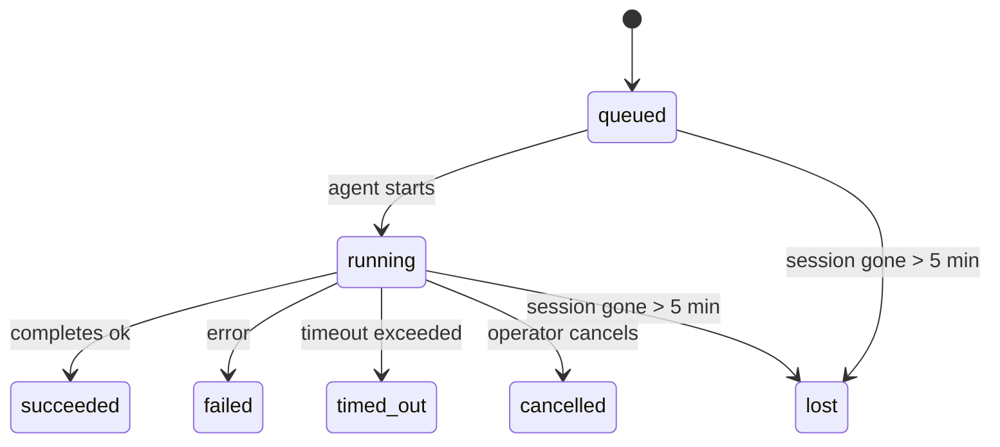

---
read_when:
    - Laufende oder kürzlich abgeschlossene Hintergrundarbeiten prüfen
    - Fehlersuche bei Zustellungsfehlern für losgelöste Agentenläufe
    - Verstehen, wie Hintergrundausführungen mit Sitzungen, Cron und Heartbeat zusammenhängen
sidebarTitle: Background tasks
summary: Nachverfolgung von Hintergrundaufgaben für ACP-Ausführungen, Subagenten, isolierte Cron-Jobs und CLI-Vorgänge
title: Hintergrundaufgaben
x-i18n:
    generated_at: "2026-04-30T16:27:50Z"
    model: gpt-5.5
    provider: openai
    source_hash: 999653c9360323d5135e33193c76458cba8c288227de46a6217f1ccbed2a6d34
    source_path: automation/tasks.md
    workflow: 16
---

<Note>
Suchen Sie nach Terminplanung? Unter [Automatisierung und Aufgaben](/de/automation) erfahren Sie, wie Sie den richtigen Mechanismus auswählen. Diese Seite ist das Aktivitätsprotokoll für Hintergrundarbeit, nicht der Scheduler.
</Note>

Hintergrundaufgaben verfolgen Arbeit, die **außerhalb Ihrer Haupt-Unterhaltungssitzung** ausgeführt wird: ACP-Läufe, Subagent-Starts, isolierte Cron-Job-Ausführungen und über die CLI gestartete Vorgänge.

Aufgaben ersetzen **keine** Sitzungen, Cron-Jobs oder Heartbeats — sie sind das **Aktivitätsprotokoll**, das aufzeichnet, welche entkoppelte Arbeit stattgefunden hat, wann sie stattgefunden hat und ob sie erfolgreich war.

<Note>
Nicht jeder Agent-Lauf erstellt eine Aufgabe. Heartbeat-Durchläufe und normaler interaktiver Chat tun dies nicht. Alle Cron-Ausführungen, ACP-Starts, Subagent-Starts und CLI-Agent-Befehle tun dies.
</Note>

## Kurzfassung

- Aufgaben sind **Datensätze**, keine Scheduler — Cron und Heartbeat entscheiden, _wann_ Arbeit ausgeführt wird; Aufgaben verfolgen, _was passiert ist_.
- ACP, Subagents, alle Cron-Jobs und CLI-Vorgänge erstellen Aufgaben. Heartbeat-Durchläufe tun dies nicht.
- Jede Aufgabe durchläuft `queued → running → terminal` (succeeded, failed, timed_out, cancelled oder lost).
- Cron-Aufgaben bleiben aktiv, solange die Cron-Laufzeit den Job noch besitzt; wenn der
  speicherinterne Laufzeitstatus verschwunden ist, prüft die Aufgabenwartung zuerst den dauerhaften Cron-
  Laufverlauf, bevor eine Aufgabe als lost markiert wird.
- Der Abschluss ist push-gesteuert: Entkoppelte Arbeit kann direkt benachrichtigen oder die
  anfordernde Sitzung/den Heartbeat wecken, wenn sie fertig ist; Status-Polling-Schleifen haben
  daher meist die falsche Form.
- Isolierte Cron-Läufe und Subagent-Abschlüsse bereinigen nach bestem Bemühen nachverfolgte Browser-Tabs/Prozesse für ihre untergeordnete Sitzung, bevor die abschließende Bereinigungsbuchführung erfolgt.
- Die Zustellung isolierter Cron-Läufe unterdrückt veraltete zwischenzeitliche Elternantworten, solange nachgelagerte Subagent-Arbeit noch ausläuft, und bevorzugt die endgültige Ausgabe der Nachkommen, wenn diese vor der Zustellung eintrifft.
- Abschlussbenachrichtigungen werden direkt an einen Kanal zugestellt oder für den nächsten Heartbeat eingereiht.
- `openclaw tasks list` zeigt alle Aufgaben; `openclaw tasks audit` macht Probleme sichtbar.
- Terminale Datensätze werden 7 Tage aufbewahrt und dann automatisch bereinigt.

## Schnellstart

<Tabs>
  <Tab title="Auflisten und filtern">
    ```bash
    # List all tasks (newest first)
    openclaw tasks list

    # Filter by runtime or status
    openclaw tasks list --runtime acp
    openclaw tasks list --status running
    ```

  </Tab>
  <Tab title="Prüfen">
    ```bash
    # Show details for a specific task (by ID, run ID, or session key)
    openclaw tasks show <lookup>
    ```
  </Tab>
  <Tab title="Abbrechen und benachrichtigen">
    ```bash
    # Cancel a running task (kills the child session)
    openclaw tasks cancel <lookup>

    # Change notification policy for a task
    openclaw tasks notify <lookup> state_changes
    ```

  </Tab>
  <Tab title="Audit und Wartung">
    ```bash
    # Run a health audit
    openclaw tasks audit

    # Preview or apply maintenance
    openclaw tasks maintenance
    openclaw tasks maintenance --apply
    ```

  </Tab>
  <Tab title="TaskFlow">
    ```bash
    # Inspect TaskFlow state
    openclaw tasks flow list
    openclaw tasks flow show <lookup>
    openclaw tasks flow cancel <lookup>
    ```
  </Tab>
</Tabs>

## Was eine Aufgabe erstellt

| Quelle                 | Laufzeittyp | Wann ein Aufgabendatensatz erstellt wird               | Standard-Benachrichtigungsrichtlinie |
| ---------------------- | ------------ | ------------------------------------------------------ | --------------------- |
| ACP-Hintergrundläufe   | `acp`        | Beim Starten einer untergeordneten ACP-Sitzung         | `done_only`           |
| Subagent-Orchestrierung | `subagent`   | Beim Starten eines Subagents über `sessions_spawn`     | `done_only`           |
| Cron-Jobs (alle Typen) | `cron`       | Bei jeder Cron-Ausführung (Hauptsitzung und isoliert)  | `silent`              |
| CLI-Vorgänge           | `cli`        | `openclaw agent`-Befehle, die über das Gateway laufen  | `silent`              |
| Agent-Medienjobs       | `cli`        | Sitzungsbasierte `video_generate`-Läufe                | `silent`              |

<AccordionGroup>
  <Accordion title="Benachrichtigungsstandards für Cron und Medien">
    Cron-Aufgaben der Hauptsitzung verwenden standardmäßig die Benachrichtigungsrichtlinie `silent` — sie erstellen Datensätze zur Nachverfolgung, erzeugen aber keine Benachrichtigungen. Isolierte Cron-Aufgaben verwenden ebenfalls standardmäßig `silent`, sind aber sichtbarer, weil sie in ihrer eigenen Sitzung laufen.

    Sitzungsbasierte `video_generate`-Läufe verwenden ebenfalls die Benachrichtigungsrichtlinie `silent`. Sie erstellen weiterhin Aufgabendatensätze, aber der Abschluss wird als internes Wecken an die ursprüngliche Agent-Sitzung zurückgegeben, damit der Agent selbst die Folgenachricht schreiben und das fertige Video anhängen kann. Wenn Sie `tools.media.asyncCompletion.directSend` aktivieren, versuchen asynchrone Abschlüsse von `music_generate` und `video_generate` zuerst die direkte Kanalzustellung, bevor sie auf den Weckpfad der Anforderer-Sitzung zurückfallen.

  </Accordion>
  <Accordion title="Leitplanke für gleichzeitige video_generate-Läufe">
    Während eine sitzungsbasierte `video_generate`-Aufgabe noch aktiv ist, fungiert das Tool auch als Leitplanke: Wiederholte `video_generate`-Aufrufe in derselben Sitzung geben den Status der aktiven Aufgabe zurück, statt eine zweite gleichzeitige Generierung zu starten. Verwenden Sie `action: "status"`, wenn Sie von der Agent-Seite aus eine explizite Fortschritts-/Statusabfrage wünschen.
  </Accordion>
  <Accordion title="Was keine Aufgaben erstellt">
    - Heartbeat-Durchläufe — Hauptsitzung; siehe [Heartbeat](/de/gateway/heartbeat)
    - Normale interaktive Chat-Durchläufe
    - Direkte `/command`-Antworten

  </Accordion>
</AccordionGroup>

## Aufgabenlebenszyklus



| Status      | Bedeutung                                                                  |
| ----------- | -------------------------------------------------------------------------- |
| `queued`    | Erstellt, wartet darauf, dass der Agent startet                            |
| `running`   | Agent-Durchlauf wird aktiv ausgeführt                                      |
| `succeeded` | Erfolgreich abgeschlossen                                                  |
| `failed`    | Mit einem Fehler abgeschlossen                                             |
| `timed_out` | Konfiguriertes Zeitlimit überschritten                                     |
| `cancelled` | Vom Operator über `openclaw tasks cancel` gestoppt                         |
| `lost`      | Die Laufzeit hat den autoritativen Hintergrundstatus nach einer 5-minütigen Kulanzzeit verloren |

Übergänge erfolgen automatisch — wenn der zugehörige Agent-Lauf endet, wird der Aufgabenstatus entsprechend aktualisiert.

Der Abschluss eines Agent-Laufs ist für aktive Aufgabendatensätze autoritativ. Ein erfolgreicher entkoppelter Lauf wird als `succeeded` finalisiert, normale Laufzeitfehler werden als `failed` finalisiert, und Zeitüberschreitungen oder Abbruchergebnisse werden als `timed_out` finalisiert. Wenn ein Operator die Aufgabe bereits abgebrochen hat oder die Laufzeit bereits einen stärkeren terminalen Status wie `failed`, `timed_out` oder `lost` aufgezeichnet hat, stuft ein späteres Erfolgssignal diesen terminalen Status nicht herab.

`lost` ist laufzeitbewusst:

- ACP-Aufgaben: Metadaten der zugrunde liegenden untergeordneten ACP-Sitzung sind verschwunden.
- Subagent-Aufgaben: Die zugrunde liegende untergeordnete Sitzung ist aus dem Ziel-Agent-Speicher verschwunden.
- Cron-Aufgaben: Die Cron-Laufzeit verfolgt den Job nicht mehr als aktiv, und der dauerhafte
  Cron-Laufverlauf zeigt kein terminales Ergebnis für diesen Lauf. Offline-CLI-
  Audits behandeln ihren eigenen leeren prozessinternen Cron-Laufzeitstatus nicht als autoritativ.
- CLI-Aufgaben: Isolierte untergeordnete Sitzungsaufgaben verwenden die untergeordnete Sitzung; chat-gestützte
  CLI-Aufgaben verwenden stattdessen den Live-Laufkontext, sodass verbleibende
  Kanal-/Gruppen-/Direktsitzungszeilen sie nicht aktiv halten. Gateway-gestützte
  `openclaw agent`-Läufe werden ebenfalls anhand ihres Laufergebnisses finalisiert, sodass abgeschlossene Läufe
  nicht aktiv bleiben, bis der Sweeper sie als `lost` markiert.

## Zustellung und Benachrichtigungen

Wenn eine Aufgabe einen terminalen Status erreicht, benachrichtigt OpenClaw Sie. Es gibt zwei Zustellpfade:

**Direkte Zustellung** — wenn die Aufgabe ein Kanalziel hat (den `requesterOrigin`), geht die Abschlussnachricht direkt an diesen Kanal (Telegram, Discord, Slack usw.). Bei Subagent-Abschlüssen bewahrt OpenClaw außerdem gebundenes Thread-/Topic-Routing, wenn verfügbar, und kann ein fehlendes `to` / Konto aus der gespeicherten Route der Anforderer-Sitzung (`lastChannel` / `lastTo` / `lastAccountId`) ergänzen, bevor die direkte Zustellung aufgegeben wird.

**Sitzungswarteschlangen-Zustellung** — wenn die direkte Zustellung fehlschlägt oder kein Ursprung gesetzt ist, wird die Aktualisierung als Systemereignis in die Sitzung des Anforderers eingereiht und beim nächsten Heartbeat sichtbar.

<Tip>
Der Aufgabenabschluss löst ein sofortiges Heartbeat-Wecken aus, damit Sie das Ergebnis schnell sehen — Sie müssen nicht auf den nächsten geplanten Heartbeat-Tick warten.
</Tip>

Das bedeutet, dass der übliche Workflow push-basiert ist: Starten Sie entkoppelte Arbeit einmal und lassen Sie sich dann von der Laufzeit beim Abschluss wecken oder benachrichtigen. Fragen Sie den Aufgabenstatus nur ab, wenn Sie Debugging, Eingreifen oder ein explizites Audit benötigen.

### Benachrichtigungsrichtlinien

Steuern Sie, wie viel Sie über jede Aufgabe erfahren:

| Richtlinie            | Was zugestellt wird                                                     |
| --------------------- | ----------------------------------------------------------------------- |
| `done_only` (Standard) | Nur terminaler Status (succeeded, failed usw.) — **dies ist der Standard** |
| `state_changes`       | Jeder Statusübergang und jede Fortschrittsaktualisierung                |
| `silent`              | Gar nichts                                                              |

Ändern Sie die Richtlinie, während eine Aufgabe läuft:

```bash
openclaw tasks notify <lookup> state_changes
```

## CLI-Referenz

<AccordionGroup>
  <Accordion title="tasks list">
    ```bash
    openclaw tasks list [--runtime <acp|subagent|cron|cli>] [--status <status>] [--json]
    ```

    Ausgabespalten: Aufgaben-ID, Art, Status, Zustellung, Lauf-ID, untergeordnete Sitzung, Zusammenfassung.

  </Accordion>
  <Accordion title="tasks show">
    ```bash
    openclaw tasks show <lookup>
    ```

    Das Such-Token akzeptiert eine Aufgaben-ID, Lauf-ID oder einen Sitzungsschlüssel. Zeigt den vollständigen Datensatz einschließlich Zeitangaben, Zustellstatus, Fehler und terminaler Zusammenfassung.

  </Accordion>
  <Accordion title="tasks cancel">
    ```bash
    openclaw tasks cancel <lookup>
    ```

    Bei ACP- und Subagent-Aufgaben beendet dies die untergeordnete Sitzung. Bei von der CLI nachverfolgten Aufgaben wird der Abbruch im Aufgabenregister aufgezeichnet (es gibt kein separates Handle für die untergeordnete Laufzeit). Der Status wechselt zu `cancelled`, und gegebenenfalls wird eine Zustellbenachrichtigung gesendet.

  </Accordion>
  <Accordion title="tasks notify">
    ```bash
    openclaw tasks notify <lookup> <done_only|state_changes|silent>
    ```
  </Accordion>
  <Accordion title="tasks audit">
    ```bash
    openclaw tasks audit [--json]
    ```

    Macht betriebliche Probleme sichtbar. Feststellungen erscheinen auch in `openclaw status`, wenn Probleme erkannt werden.

    | Befund                   | Schweregrad | Auslöser                                                                                                               |
    | ------------------------- | ----------- | ---------------------------------------------------------------------------------------------------------------------- |
    | `stale_queued`            | warn        | Seit mehr als 10 Minuten in der Warteschlange                                                                          |
    | `stale_running`           | error       | Läuft seit mehr als 30 Minuten                                                                                         |
    | `lost`                    | warn/error  | Laufzeitgestützte Task-Zuständigkeit ist verschwunden; beibehaltene verlorene Tasks warnen bis `cleanupAfter` und werden dann zu Fehlern |
    | `delivery_failed`         | warn        | Zustellung fehlgeschlagen und Benachrichtigungsrichtlinie ist nicht `silent`                                           |
    | `missing_cleanup`         | warn        | Terminaler Task ohne Cleanup-Zeitstempel                                                                               |
    | `inconsistent_timestamps` | warn        | Zeitachsenverletzung (zum Beispiel vor dem Start beendet)                                                              |

  </Accordion>
  <Accordion title="tasks maintenance">
    ```bash
    openclaw tasks maintenance [--json]
    openclaw tasks maintenance --apply [--json]
    ```

    Verwenden Sie dies, um Abgleich, Cleanup-Stempel und Bereinigung für Tasks und den Task-Flow-Zustand in der Vorschau anzuzeigen oder anzuwenden.

    Der Abgleich ist laufzeitbewusst:

    - ACP-/Subagent-Tasks prüfen ihre zugrunde liegende untergeordnete Sitzung.
    - Subagent-Tasks, deren untergeordnete Sitzung einen Tombstone für Neustart-Wiederherstellung hat, werden als verloren markiert, statt als wiederherstellbare zugrunde liegende Sitzungen behandelt zu werden.
    - Cron-Tasks prüfen, ob die Cron-Laufzeit den Job noch besitzt, und stellen dann den terminalen Status aus persistierten Cron-Ausführungsprotokollen bzw. dem Job-Zustand wieder her, bevor sie auf `lost` zurückfallen. Nur der Gateway-Prozess ist autoritativ für die aktive Job-Menge von Cron im Arbeitsspeicher; die Offline-CLI-Prüfung verwendet dauerhafte Historie, markiert einen Cron-Task aber nicht allein deshalb als verloren, weil dieses lokale Set leer ist.
    - Chat-gestützte CLI-Tasks prüfen den besitzenden Live-Ausführungskontext, nicht nur die Chat-Sitzungszeile.

    Der Abschluss-Cleanup ist ebenfalls laufzeitbewusst:

    - Der Subagent-Abschluss schließt nach bestem Aufwand verfolgte Browsertabs/Prozesse für die untergeordnete Sitzung, bevor der Ankündigungs-Cleanup fortfährt.
    - Der Abschluss eines isolierten Cron schließt nach bestem Aufwand verfolgte Browsertabs/Prozesse für die Cron-Sitzung, bevor die Ausführung vollständig beendet wird.
    - Die Zustellung eines isolierten Cron wartet bei Bedarf Folgeaktionen untergeordneter Subagents ab und unterdrückt veralteten Bestätigungstext des Elternteils, statt ihn anzukündigen.
    - Die Zustellung des Subagent-Abschlusses bevorzugt den neuesten sichtbaren Assistant-Text; wenn dieser leer ist, fällt sie auf bereinigten neuesten Tool-/toolResult-Text zurück, und reine Timeout-Tool-Call-Ausführungen können zu einer kurzen Teilfortschrittszusammenfassung zusammengefasst werden. Terminal fehlgeschlagene Ausführungen kündigen den Fehlerstatus an, ohne erfassten Antworttext erneut wiederzugeben.
    - Cleanup-Fehler verdecken nicht das tatsächliche Task-Ergebnis.

  </Accordion>
  <Accordion title="tasks flow list | show | cancel">
    ```bash
    openclaw tasks flow list [--status <status>] [--json]
    openclaw tasks flow show <lookup> [--json]
    openclaw tasks flow cancel <lookup>
    ```

    Verwenden Sie diese Befehle, wenn der orchestrierende Task Flow das ist, worum es Ihnen geht, und nicht ein einzelner Hintergrund-Task-Datensatz.

  </Accordion>
</AccordionGroup>

## Chat-Task-Board (`/tasks`)

Verwenden Sie `/tasks` in jeder Chat-Sitzung, um Hintergrund-Tasks zu sehen, die mit dieser Sitzung verknüpft sind. Das Board zeigt aktive und kürzlich abgeschlossene Tasks mit Laufzeit, Status, Timing sowie Fortschritts- oder Fehlerdetails.

Wenn die aktuelle Sitzung keine sichtbaren verknüpften Tasks hat, fällt `/tasks` auf agent-lokale Task-Zählungen zurück, sodass Sie weiterhin eine Übersicht erhalten, ohne Details anderer Sitzungen offenzulegen.

Für das vollständige Operator-Ledger verwenden Sie die CLI: `openclaw tasks list`.

## Statusintegration (Task-Druck)

`openclaw status` enthält eine Task-Zusammenfassung auf einen Blick:

```
Tasks: 3 queued · 2 running · 1 issues
```

Die Zusammenfassung meldet:

- **active** — Anzahl von `queued` + `running`
- **failures** — Anzahl von `failed` + `timed_out` + `lost`
- **byRuntime** — Aufschlüsselung nach `acp`, `subagent`, `cron`, `cli`

Sowohl `/status` als auch das Tool `session_status` verwenden einen cleanup-bewussten Task-Snapshot: aktive Tasks werden bevorzugt, veraltete abgeschlossene Zeilen werden ausgeblendet, und aktuelle Fehler werden nur angezeigt, wenn keine aktive Arbeit mehr verbleibt. Dadurch bleibt die Statuskarte auf das fokussiert, was gerade wichtig ist.

## Speicherung und Wartung

### Wo Tasks gespeichert werden

Task-Datensätze bleiben in SQLite bestehen unter:

```
$OPENCLAW_STATE_DIR/tasks/runs.sqlite
```

Die Registry wird beim Start des Gateway in den Arbeitsspeicher geladen und synchronisiert Schreibvorgänge nach SQLite, um Dauerhaftigkeit über Neustarts hinweg zu gewährleisten.
Der Gateway begrenzt das SQLite-Write-Ahead-Log mithilfe des Standard-Autocheckpoint-Schwellenwerts von SQLite sowie periodischer und beim Herunterfahren ausgeführter `TRUNCATE`-Checkpoints.

### Automatische Wartung

Ein Sweeper läuft alle **60 Sekunden** und erledigt vier Dinge:

<Steps>
  <Step title="Abgleich">
    Prüft, ob aktive Tasks noch eine autoritative Laufzeitgrundlage haben. ACP-/Subagent-Tasks verwenden den Zustand der untergeordneten Sitzung, Cron-Tasks verwenden die aktive Job-Zuständigkeit, und Chat-gestützte CLI-Tasks verwenden den besitzenden Ausführungskontext. Wenn dieser zugrunde liegende Zustand länger als 5 Minuten verschwunden ist, wird der Task als `lost` markiert.
  </Step>
  <Step title="ACP-Sitzungsreparatur">
    Schließt terminale oder verwaiste, vom Elternteil besessene einmalige ACP-Sitzungen und schließt veraltete terminale oder verwaiste persistente ACP-Sitzungen nur dann, wenn keine aktive Konversationsbindung verbleibt.
  </Step>
  <Step title="Cleanup-Stempel">
    Setzt einen `cleanupAfter`-Zeitstempel für terminale Tasks (endedAt + 7 Tage). Während der Aufbewahrung erscheinen verlorene Tasks in der Prüfung weiterhin als Warnungen; nach Ablauf von `cleanupAfter` oder wenn Cleanup-Metadaten fehlen, sind sie Fehler.
  </Step>
  <Step title="Bereinigung">
    Löscht Datensätze nach ihrem `cleanupAfter`-Datum.
  </Step>
</Steps>

<Note>
**Aufbewahrung:** Terminale Task-Datensätze werden **7 Tage** aufbewahrt und dann automatisch bereinigt. Keine Konfiguration erforderlich.
</Note>

## Wie Tasks mit anderen Systemen zusammenhängen

<AccordionGroup>
  <Accordion title="Tasks und Task Flow">
    [Task Flow](/de/automation/taskflow) ist die Flow-Orchestrierungsebene über Hintergrund-Tasks. Ein einzelner Flow kann während seiner Lebensdauer mehrere Tasks über verwaltete oder gespiegelte Synchronisierungsmodi koordinieren. Verwenden Sie `openclaw tasks`, um einzelne Task-Datensätze zu prüfen, und `openclaw tasks flow`, um den orchestrierenden Flow zu prüfen.

    Details finden Sie unter [Task Flow](/de/automation/taskflow).

  </Accordion>
  <Accordion title="Tasks und Cron">
    Eine Cron-Job-**Definition** befindet sich in `~/.openclaw/cron/jobs.json`; der Laufzeitausführungszustand befindet sich daneben in `~/.openclaw/cron/jobs-state.json`. **Jede** Cron-Ausführung erstellt einen Task-Datensatz — sowohl Hauptsitzungs- als auch isolierte Ausführungen. Cron-Tasks der Hauptsitzung verwenden standardmäßig die Benachrichtigungsrichtlinie `silent`, sodass sie nachverfolgt werden, ohne Benachrichtigungen zu erzeugen.

    Siehe [Cron-Jobs](/de/automation/cron-jobs).

  </Accordion>
  <Accordion title="Tasks und Heartbeat">
    Heartbeat-Ausführungen sind Hauptsitzungs-Turns — sie erstellen keine Task-Datensätze. Wenn ein Task abgeschlossen ist, kann er ein Heartbeat-Aufwecken auslösen, damit Sie das Ergebnis zeitnah sehen.

    Siehe [Heartbeat](/de/gateway/heartbeat).

  </Accordion>
  <Accordion title="Tasks und Sitzungen">
    Ein Task kann auf einen `childSessionKey` (wo die Arbeit ausgeführt wird) und einen `requesterSessionKey` (wer ihn gestartet hat) verweisen. Sitzungen sind Konversationskontext; Tasks sind Aktivitätsverfolgung darüber.
  </Accordion>
  <Accordion title="Tasks und Agent-Ausführungen">
    Die `runId` eines Tasks verweist auf die Agent-Ausführung, die die Arbeit erledigt. Agent-Lebenszyklusereignisse (Start, Ende, Fehler) aktualisieren automatisch den Task-Status — Sie müssen den Lebenszyklus nicht manuell verwalten.
  </Accordion>
</AccordionGroup>

## Verwandt

- [Automatisierung & Tasks](/de/automation) — alle Automatisierungsmechanismen auf einen Blick
- [CLI: Tasks](/de/cli/tasks) — CLI-Befehlsreferenz
- [Heartbeat](/de/gateway/heartbeat) — periodische Hauptsitzungs-Turns
- [Geplante Tasks](/de/automation/cron-jobs) — Hintergrundarbeit planen
- [Task Flow](/de/automation/taskflow) — Flow-Orchestrierung über Tasks
