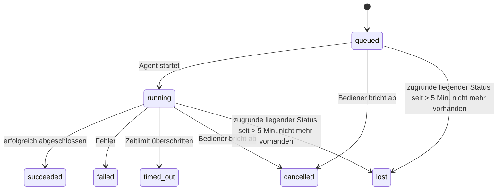

---
read_when:
    - Prüfen laufender oder kürzlich abgeschlossener Hintergrundaufgaben
    - Fehlerbehebung bei Zustellungsfehlern für losgelöste Agentenläufe
    - Verstehen, wie Hintergrundausführungen mit Sitzungen, Cron und Heartbeat zusammenhängen
sidebarTitle: Background tasks
summary: Nachverfolgung von Hintergrundaufgaben für ACP-Läufe, Subagenten, Cron-Ausführungen und CLI-Vorgänge
title: Hintergrundaufgaben
x-i18n:
    generated_at: "2026-07-12T14:59:22Z"
    model: gpt-5.6
    postprocess_version: locale-links-v1
    prompt_version: 15
    provider: openai
    source_hash: 0a945e8103c5df5a64785f326a9d0b08784ac32a2ca6fa3d4c399d75fc54be2b
    source_path: automation/tasks.md
    workflow: 16
---

<Note>
Suchen Sie nach Zeitplanung? Unter [Automatisierung](/de/automation) erfahren Sie, wie Sie den richtigen Mechanismus auswählen. Diese Seite ist das Aktivitätsprotokoll für Hintergrundarbeit, nicht der Scheduler.
</Note>

Hintergrundaufgaben erfassen Arbeit, die **außerhalb Ihrer Hauptkonversationssitzung** ausgeführt wird: ACP-Ausführungen, gestartete Subagenten, Cron-Job-Ausführungen und über die CLI initiierte Vorgänge.

Aufgaben ersetzen **weder** Sitzungen noch Cron-Jobs oder Heartbeats – sie sind das **Aktivitätsprotokoll**, das aufzeichnet, welche losgelöste Arbeit wann ausgeführt wurde und ob sie erfolgreich war.

<Note>
Nicht jede Agentenausführung erstellt eine Aufgabe. Heartbeat-Durchläufe und normale interaktive Chats tun dies nicht. Alle Cron-Ausführungen, gestarteten ACP-Sitzungen und Subagenten sowie vom Gateway weitergeleiteten CLI-Agentenbefehle tun es.
</Note>

## Kurzfassung

- Aufgaben sind **Datensätze**, keine Scheduler – Cron und Heartbeat bestimmen, _wann_ Arbeit ausgeführt wird; Aufgaben erfassen, _was geschehen ist_.
- ACP, Subagenten, alle Cron-Jobs und CLI-Vorgänge erstellen Aufgaben. Heartbeat-Durchläufe tun dies nicht.
- Jede Aufgabe durchläuft `queued → running → terminal` (succeeded, failed, timed_out, cancelled oder lost).
- Cron-Aufgaben bleiben aktiv, solange die Cron-Laufzeitumgebung den Job noch verwaltet. Wenn der Laufzeitstatus im Arbeitsspeicher nicht mehr vorhanden ist, prüft die Aufgabenwartung zunächst den dauerhaften Cron-Ausführungsverlauf, bevor sie eine Aufgabe als verloren markiert.
- Der Abschluss wird ereignisgesteuert übermittelt: Losgelöste Arbeit kann direkt benachrichtigen oder nach Abschluss die anfordernde Sitzung beziehungsweise den Heartbeat aufwecken. Schleifen zur Statusabfrage sind daher normalerweise der falsche Ansatz.
- Isolierte Cron-Ausführungen und abgeschlossene Subagenten versuchen nach Möglichkeit, nachverfolgte Browser-Tabs und Prozesse ihrer untergeordneten Sitzung zu bereinigen, bevor die abschließende Bereinigungsbuchführung erfolgt.
- Bei der Zustellung isolierter Cron-Ausführungen werden veraltete vorläufige Antworten der übergeordneten Sitzung unterdrückt, solange die Arbeit untergeordneter Subagenten noch ausläuft. Geht vor der Zustellung eine endgültige Ausgabe eines untergeordneten Subagenten ein, wird diese bevorzugt.
- Abschlussbenachrichtigungen werden direkt an einen Kanal zugestellt oder für den nächsten Heartbeat in die Warteschlange gestellt.
- `openclaw tasks list` zeigt alle Aufgaben; `openclaw tasks audit` weist auf Probleme hin.
- Abgeschlossene Datensätze werden 7 Tage lang aufbewahrt (`lost`-Datensätze 24 Stunden) und anschließend automatisch bereinigt.

## Schnellstart

<Tabs>
  <Tab title="Auflisten und filtern">
    ```bash
    # Alle Aufgaben auflisten (neueste zuerst)
    openclaw tasks list

    # Nach Laufzeitumgebung oder Status filtern
    openclaw tasks list --runtime acp
    openclaw tasks list --status running
    ```

  </Tab>
  <Tab title="Untersuchen">
    ```bash
    # Details zu einer bestimmten Aufgabe anzeigen (anhand von Aufgaben-ID, Ausführungs-ID oder Sitzungsschlüssel)
    openclaw tasks show <lookup>
    ```
  </Tab>
  <Tab title="Abbrechen und benachrichtigen">
    ```bash
    # Eine laufende Aufgabe abbrechen (beendet die untergeordnete Sitzung)
    openclaw tasks cancel <lookup>

    # Benachrichtigungsrichtlinie für eine Aufgabe ändern
    openclaw tasks notify <lookup> state_changes
    ```

  </Tab>
  <Tab title="Prüfung und Wartung">
    ```bash
    # Integritätsprüfung ausführen
    openclaw tasks audit

    # Wartung in der Vorschau anzeigen oder anwenden
    openclaw tasks maintenance
    openclaw tasks maintenance --apply
    ```

  </Tab>
  <Tab title="TaskFlow">
    ```bash
    # TaskFlow-Status untersuchen
    openclaw tasks flow list
    openclaw tasks flow show <lookup>
    openclaw tasks flow cancel <lookup>
    ```
  </Tab>
</Tabs>

## Was eine Aufgabe erstellt

| Quelle                  | Laufzeittyp | Zeitpunkt der Erstellung eines Aufgabendatensatzes                         | Standard-Benachrichtigungsrichtlinie |
| ----------------------- | ----------- | -------------------------------------------------------------------------- | ------------------------------------ |
| ACP-Hintergrundläufe    | `acp`       | Beim Starten einer untergeordneten ACP-Sitzung                              | `done_only`                          |
| Subagenten-Orchestrierung | `subagent` | Beim Starten eines Subagenten über `sessions_spawn`                         | `done_only`                          |
| Cron-Jobs (alle Typen)  | `cron`      | Bei jeder Cron-Ausführung (Hauptsitzung und isoliert)                       | `silent`                             |
| CLI-Vorgänge            | `cli`       | Bei `openclaw agent`-Befehlen, die über das Gateway ausgeführt werden       | `silent`                             |
| Agenten-Medienjobs      | `cli`       | Sitzungsbasierte `image_generate`-/`music_generate`-/`video_generate`-Läufe | `silent`                             |

<AccordionGroup>
  <Accordion title="Benachrichtigungsstandard für Cron und Medien">
    Cron-Aufgaben (Hauptsitzung und isoliert) verwenden die Benachrichtigungsrichtlinie `silent` – sie erstellen Datensätze zur Nachverfolgung, erzeugen aber keine eigenen Aufgabenbenachrichtigungen; Cron verwaltet den Zustellungsweg.

    Sitzungsbasierte `image_generate`-, `music_generate`- und `video_generate`-Ausführungen verwenden ebenfalls die Benachrichtigungsrichtlinie `silent`. Sie erstellen weiterhin Aufgabendatensätze, der Abschluss wird jedoch als internes Aufwecksignal an die ursprüngliche Agentensitzung zurückgegeben, damit der Agent die Folgenachricht verfassen und die fertigen Medien selbst anhängen kann. Der anfordernde Agent folgt seinem üblichen Vertrag für sichtbare Antworten: eine automatische abschließende Antwort, wenn diese konfiguriert ist, oder `message(action="send")` plus `NO_REPLY`, wenn die Sitzung Antworten über das Nachrichtenwerkzeug erfordert. Wenn die anfordernde Sitzung nicht mehr aktiv ist oder ihr aktives Aufwecken fehlschlägt und der Abschlussagent einige oder alle erzeugten Medien übersieht, sendet OpenClaw eine idempotente direkte Ersatzübermittlung ausschließlich mit den fehlenden Medien an das ursprüngliche Kanalziel.

  </Accordion>
  <Accordion title="Schutzmechanismus für gleichzeitige Mediengenerierung">
    Solange eine sitzungsbasierte Mediengenerierungsaufgabe noch aktiv ist, schützen `image_generate`, `music_generate` und `video_generate` vor versehentlichen Wiederholungsversuchen: Wird der Aufruf für dieselbe Eingabe beziehungsweise Anfrage wiederholt, gibt er den Status der passenden aktiven Aufgabe zurück, anstatt ein Duplikat zu starten. Eine andere Eingabe kann hingegen eine eigene Aufgabe starten. Verwenden Sie `action: "status"`, wenn Sie agentenseitig ausdrücklich den Fortschritt oder Status abfragen möchten.
  </Accordion>
  <Accordion title="Was keine Aufgaben erstellt">
    - Heartbeat-Durchläufe der Hauptsitzung; siehe [Heartbeat](/de/gateway/heartbeat)
    - Normale interaktive Chat-Durchläufe
    - Direkte `/command`-Antworten

  </Accordion>
</AccordionGroup>

## Aufgabenlebenszyklus



| Status      | Bedeutung                                                                                 |
| ----------- | ----------------------------------------------------------------------------------------- |
| `queued`    | Erstellt; wartet auf den Start durch den Agenten                                          |
| `running`   | Agentendurchlauf wird aktiv ausgeführt                                                     |
| `succeeded` | Erfolgreich abgeschlossen                                                                 |
| `failed`    | Mit einem Fehler abgeschlossen                                                            |
| `timed_out` | Konfiguriertes Zeitlimit überschritten                                                     |
| `cancelled` | Vom Bediener über `openclaw tasks cancel` gestoppt oder die Ausführung wurde abgebrochen   |
| `lost`      | Die Laufzeitumgebung hat den maßgeblichen zugrunde liegenden Status nach einer Kulanzfrist von 5 Minuten verloren |

Übergänge erfolgen automatisch – Lebenszyklusereignisse der Agentenausführung (Start, Ende, Fehler) aktualisieren den Aufgabenstatus; Sie verwalten ihn nicht manuell.

Der Abschluss einer Agentenausführung ist für aktive Aufgabendatensätze maßgeblich. Eine erfolgreiche losgelöste Ausführung wird als `succeeded` abgeschlossen, gewöhnliche Ausführungsfehler als `failed`, Zeitüberschreitungen als `timed_out` und Abbruchergebnisse als `cancelled`. Sobald eine Aufgabe einen Endstatus erreicht hat, wird sie durch spätere Lebenszyklussignale nicht zurückgestuft – eine vom Bediener abgebrochene oder bereits als `failed`/`timed_out`/`lost` gekennzeichnete Aufgabe behält diesen Status, selbst wenn danach ein Erfolgssignal eingeht.

`lost` berücksichtigt die Laufzeitumgebung:

- ACP-Aufgaben: Nur ein aktiver prozessinterner ACP-Durchlauf im Gateway belegt, dass die Ausführung noch aktiv ist; dauerhaft gespeicherte Sitzungsmetadaten allein tun dies nicht. Die Offline-CLI-Prüfung bleibt konservativ und gibt ACP-Aufgaben niemals zur Bereinigung frei.
- Subagentenaufgaben: Die zugrunde liegende untergeordnete Sitzung ist aus dem Speicher des Zielagenten verschwunden oder enthält einen Tombstone zur Wiederherstellung nach einem Neustart.
- Cron-Aufgaben: Die Cron-Laufzeitumgebung verfolgt den Job nicht mehr als aktiv und der dauerhafte Cron-Ausführungsverlauf enthält kein Endergebnis für diese Ausführung. Die Offline-CLI-Prüfung betrachtet ihren eigenen leeren prozessinternen Cron-Laufzeitstatus nicht als maßgeblich.
- CLI-Aufgaben: Aufgaben mit einer Ausführungs-ID/Quell-ID verwenden den aktiven Ausführungskontext. Verbleibende Datensätze untergeordneter Sitzungen oder Chatsitzungen halten sie daher nicht aktiv, nachdem die vom Gateway verwaltete Ausführung verschwunden ist. Ältere CLI-Aufgaben ohne Ausführungsidentität greifen weiterhin auf die untergeordnete Sitzung zurück. Gateway-basierte `openclaw agent`-Ausführungen werden außerdem anhand ihres Ausführungsergebnisses abgeschlossen, sodass abgeschlossene Ausführungen nicht aktiv bleiben, bis der Sweeper sie als `lost` markiert.

## Zustellung und Benachrichtigungen

Wenn eine Aufgabe einen Endstatus erreicht, benachrichtigt OpenClaw Sie. Es gibt zwei Zustellungswege:

**Direkte Zustellung** – wenn die Aufgabe ein Kanalziel besitzt (`requesterOrigin`), wird die Abschlussnachricht direkt an diesen Kanal gesendet (Discord, Slack, Telegram usw.). Abschlüsse von Gruppen- und Kanalaufgaben werden stattdessen über die anfordernde Sitzung weitergeleitet, damit der übergeordnete Agent die sichtbare Antwort verfassen kann. Bei Abschlüssen von Subagenten bewahrt OpenClaw außerdem nach Möglichkeit die gebundene Thread-/Themenweiterleitung und kann ein fehlendes `to` beziehungsweise Konto anhand der in der anfordernden Sitzung gespeicherten Route (`lastChannel` / `lastTo` / `lastAccountId`) ergänzen, bevor die direkte Zustellung aufgegeben wird.

**Über die Sitzung in die Warteschlange gestellte Zustellung** – wenn die direkte Zustellung fehlschlägt oder kein Ursprung festgelegt ist, wird die Aktualisierung als Systemereignis in die Sitzung des Anforderers eingereiht und beim nächsten Heartbeat angezeigt.

<Tip>
In die Sitzungswarteschlange gestellte Aufgabenabschlüsse lösen ein sofortiges Heartbeat-Aufwecken aus, sodass Sie das Ergebnis schnell sehen – Sie müssen nicht auf den nächsten geplanten Heartbeat-Durchlauf warten.
</Tip>

Das bedeutet, dass der übliche Arbeitsablauf ereignisgesteuert ist: Starten Sie losgelöste Arbeit einmal und lassen Sie sich anschließend von der Laufzeitumgebung nach Abschluss aufwecken oder benachrichtigen. Fragen Sie den Aufgabenstatus nur ab, wenn Sie Fehler untersuchen, eingreifen oder eine ausdrückliche Prüfung durchführen müssen.

### Benachrichtigungsrichtlinien

Steuern Sie, wie viele Meldungen Sie zu jeder Aufgabe erhalten:

| Richtlinie            | Zugestellte Informationen                                     |
| --------------------- | ------------------------------------------------------------- |
| `done_only` (Standard) | Nur Endstatus (succeeded, failed usw.)                        |
| `state_changes`       | Jeder Statusübergang und jede Fortschrittsaktualisierung      |
| `silent`              | Überhaupt nichts (Standard für Cron-, CLI- und Medienaufgaben) |

Ändern Sie die Richtlinie, während eine Aufgabe ausgeführt wird:

```bash
openclaw tasks notify <lookup> state_changes
```

## CLI-Referenz

<AccordionGroup>
  <Accordion title="tasks list">
    ```bash
    openclaw tasks list [--runtime <acp|subagent|cron|cli>] [--status <status>] [--json]
    ```

    Ausgabespalten: Aufgabe, Art, Status, Zustellung, Ausführung, untergeordnete Sitzung, Zusammenfassung. Ein einfaches `openclaw tasks` verhält sich wie `openclaw tasks list`.

  </Accordion>
  <Accordion title="tasks show">
    ```bash
    openclaw tasks show <lookup> [--json]
    ```

    Das Such-Token akzeptiert eine Aufgaben-ID, Ausführungs-ID oder einen Sitzungsschlüssel. Zeigt den vollständigen Datensatz einschließlich Zeitangaben, Zustellungsstatus, Fehler und abschließender Zusammenfassung an.

  </Accordion>
  <Accordion title="tasks cancel">
    ```bash
    openclaw tasks cancel <lookup>
    ```

    Bei ACP- und Subagentenaufgaben beendet dies die untergeordnete Sitzung; Abbrüche von ACP- und Cron-Aufgaben werden über das laufende Gateway (`tasks.cancel`) geleitet. Bei über die CLI nachverfolgten Aufgaben wird der Abbruch in der Aufgabenregistrierung erfasst (es gibt kein separates Handle für eine untergeordnete Laufzeitumgebung). Der Status wechselt zu `cancelled`, und gegebenenfalls wird eine Zustellungsbenachrichtigung gesendet.

  </Accordion>
  <Accordion title="tasks notify">
    ```bash
    openclaw tasks notify <lookup> <done_only|state_changes|silent>
    ```
  </Accordion>
  <Accordion title="tasks audit">
    ```bash
    openclaw tasks audit [--severity <warn|error>] [--code <name>] [--limit <n>] [--json]
    ```

    Zeigt betriebliche Probleme für Aufgaben **und** TaskFlows in einem einzigen Bericht an. Feststellungen erscheinen außerdem in `openclaw status`, wenn Probleme erkannt werden.

    Aufgabenfeststellungen:

    | Befund                    | Schweregrad | Auslöser                                                                                                                |
    | ------------------------- | ----------- | ----------------------------------------------------------------------------------------------------------------------- |
    | `stale_queued`            | Warnung     | Seit mehr als 10 Minuten in der Warteschlange                                                                           |
    | `stale_running`           | Fehler      | Läuft seit mehr als 30 Minuten                                                                                           |
    | `lost`                    | Warnung/Fehler | Die laufzeitgestützte Aufgabenzuordnung ist verschwunden; beibehaltene verlorene Aufgaben erzeugen bis `cleanupAfter` Warnungen und werden danach zu Fehlern |
    | `delivery_failed`         | Warnung     | Die Zustellung ist fehlgeschlagen und die Benachrichtigungsrichtlinie ist nicht `silent`                                 |
    | `missing_cleanup`         | Warnung     | Beendete Aufgabe ohne Bereinigungszeitstempel                                                                            |
    | `inconsistent_timestamps` | Warnung     | Verletzung der zeitlichen Abfolge (beispielsweise Ende vor Beginn)                                                       |

    TaskFlow-Befunde:

    | Befund                 | Schweregrad | Auslöser                                                                      |
    | ---------------------- | ----------- | ----------------------------------------------------------------------------- |
    | `restore_failed`       | Fehler      | Wiederherstellung der Flow-Registry aus SQLite fehlgeschlagen                  |
    | `stale_running`        | Fehler      | Laufender Flow wurde seit mehr als 30 Minuten nicht fortgesetzt                |
    | `stale_waiting`        | Warnung     | Wartender Flow wurde seit mehr als 30 Minuten nicht fortgesetzt                |
    | `stale_blocked`        | Warnung     | Blockierter Flow wurde seit mehr als 30 Minuten nicht fortgesetzt              |
    | `cancel_stuck`         | Warnung     | Abbruch vor über 5 Minuten angefordert, keine aktiven untergeordneten Aufgaben, weiterhin nicht beendet |
    | `missing_linked_tasks` | Warnung/Fehler | Veralteter verwalteter Flow ohne verknüpfte Aufgaben oder Wartezustand        |
    | `blocked_task_missing` | Warnung     | Blockierter Flow verweist auf eine nicht mehr vorhandene Aufgaben-ID           |

  </Accordion>
  <Accordion title="Aufgabenwartung">
    ```bash
    openclaw tasks maintenance [--json]
    openclaw tasks maintenance --apply [--json]
    ```

    Verwenden Sie dies, um Abgleich, Setzen von Bereinigungszeitstempeln und Bereinigung für Aufgaben, den TaskFlow-Zustand und veraltete Registry-Zeilen von Cron-Ausführungssitzungen in der Vorschau anzuzeigen oder anzuwenden.

    Der Abgleich berücksichtigt die Laufzeit:

    - ACP-Aufgaben erfordern einen aktiven prozessinternen Turn im Gateway; Subagent-Aufgaben prüfen ihre zugrunde liegende untergeordnete Sitzung.
    - Subagent-Aufgaben, deren untergeordnete Sitzung einen Tombstone für die Wiederherstellung nach einem Neustart aufweist, werden als verloren markiert, statt als wiederherstellbare zugrunde liegende Sitzungen behandelt zu werden.
    - Cron-Aufgaben prüfen, ob die Cron-Laufzeit den Job weiterhin besitzt, und stellen anschließend den Beendigungsstatus aus persistenten Cron-Ausführungsprotokollen beziehungsweise dem Jobstatus wieder her, bevor auf `lost` zurückgegriffen wird. Nur der Gateway-Prozess ist für die im Arbeitsspeicher gehaltene Menge aktiver Cron-Jobs maßgeblich; die Offline-CLI-Prüfung verwendet den dauerhaften Verlauf, markiert eine Cron-Aufgabe jedoch nicht allein deshalb als verloren, weil diese lokale Menge leer ist.
    - CLI-Aufgaben mit Ausführungsidentität prüfen den zugehörigen aktiven Ausführungskontext, nicht nur Zeilen untergeordneter Sitzungen oder Chatsitzungen.

    Auch die Bereinigung nach Abschluss berücksichtigt die Laufzeit:

    - Beim Abschluss eines Subagents werden nach bestem Bemühen nachverfolgte Browser-Tabs und Prozesse für die untergeordnete Sitzung geschlossen, bevor die Bereinigung nach der Ankündigung fortgesetzt wird.
    - Beim Abschluss einer isolierten Cron-Ausführung werden nach bestem Bemühen nachverfolgte Browser-Tabs und Prozesse für die Cron-Sitzung geschlossen, bevor die Ausführung vollständig beendet wird.
    - Die Zustellung einer isolierten Cron-Ausführung wartet bei Bedarf auf nachgelagerte Folgevorgänge untergeordneter Subagents und unterdrückt veralteten Bestätigungstext der übergeordneten Sitzung, statt ihn anzukündigen.
    - Die Zustellung beim Abschluss eines Subagents verwendet ausschließlich den neuesten sichtbaren Assistententext des untergeordneten Elements. Ausgaben von Tool/ToolResult werden nicht zum Ergebnistextext des untergeordneten Elements hochgestuft. Fehlgeschlagene beendete Ausführungen melden den Fehlerstatus, ohne erfassten Antworttext erneut wiederzugeben.
    - Bereinigungsfehler verdecken nicht das tatsächliche Aufgabenergebnis.

    Beim Anwenden der Wartung entfernt OpenClaw außerdem veraltete Registry-Zeilen für Sitzungen vom Typ `cron:<jobId>:run:<runId>`, die älter als 7 Tage sind. Zeilen für derzeit laufende Cron-Jobs bleiben dabei erhalten und Zeilen für Nicht-Cron-Sitzungen bleiben unverändert.

  </Accordion>
  <Accordion title="Aufgaben-Flows auflisten | anzeigen | abbrechen">
    ```bash
    openclaw tasks flow list [--status <status>] [--json]
    openclaw tasks flow show <lookup> [--json]
    openclaw tasks flow cancel <lookup>
    ```

    Das Flow-Such-Token akzeptiert eine Flow-ID oder einen Eigentümerschlüssel. Verwenden Sie diese Befehle, wenn Sie sich für den orchestrierenden [Task Flow](/de/automation/taskflow) statt für einen einzelnen Datensatz einer Hintergrundaufgabe interessieren.

  </Accordion>
</AccordionGroup>

## Aufgabenübersicht im Chat (`/tasks`)

Verwenden Sie `/tasks` in einer beliebigen Chatsitzung, um die mit dieser Sitzung verknüpften Hintergrundaufgaben anzuzeigen. Die Übersicht zeigt bis zu fünf aktive und kürzlich abgeschlossene Aufgaben mit Laufzeit, Status, Zeitangaben sowie Fortschritts- oder Fehlerdetails.

Wenn die aktuelle Sitzung keine sichtbaren verknüpften Aufgaben enthält, greift `/tasks` auf agentenlokale Aufgabenzahlen zurück, sodass Sie weiterhin eine Übersicht erhalten, ohne Details aus anderen Sitzungen offenzulegen.

Verwenden Sie für das vollständige Betreiberprotokoll die CLI: `openclaw tasks list`.

### Control UI

Die webbasierte Control UI enthält in der Seitenleiste eine Seite **Aufgaben** mit aktiven und kürzlich abgeschlossenen Hintergrundaufgaben in Echtzeit. Verwenden Sie sie, um den Fortschritt zu prüfen, verknüpfte Sitzungen zu öffnen, das Protokoll zu aktualisieren oder Aufgaben in der Warteschlange und laufende Aufgaben abzubrechen.

Chatbereiche verfügen außerdem über eine einklappbare Leiste **Hintergrundaufgaben**, deren Geltungsbereich auf den Agenten des Bereichs beschränkt ist: laufende Aufgaben und Subagents mit einem Steuerelement zum Anhalten, einem Abschnitt für abgeschlossene Vorgänge und Links zum **Transkript anzeigen**, die zur untergeordneten Sitzung der jeweiligen Aufgabe führen. Öffnen Sie sie über den Aktivitätsschalter in der Kopfzeile des Bereichs oder über die schwebende Aktivitätsschaltfläche in einem Chat mit nur einem Bereich.

## Statusintegration (Aufgabenauslastung)

`openclaw status` enthält eine Aufgabenzeile für den schnellen Überblick:

```
Aufgaben    2 aktiv · 1 in Warteschlange · 1 läuft · 1 Problem · Prüfung sauber · 6 erfasst
```

Die Zusammenfassung zählt aktive Arbeit (`queued` + `running`), Fehlschläge (`failed` + `timed_out` + `lost`), Prüfbefunde und die Gesamtzahl der nachverfolgten Datensätze. Die JSON-Nutzlast schlüsselt die Zahlen außerdem nach Laufzeit auf (`acp`, `subagent`, `cron`, `cli`).

Sowohl `/status` als auch das Tool `session_status` verwenden eine bereinigungsbewusste Aufgabenmomentaufnahme: Aktive Aufgaben werden bevorzugt, abgelaufene Zeilen ausgeblendet und beendete Aufgaben nur für ein kurzes aktuelles Zeitfenster von 5 Minuten angezeigt. Wenn keine aktive Arbeit verbleibt, liegt der Schwerpunkt auf Fehlschlägen. Dadurch konzentriert sich die Statuskarte auf das, was gerade wichtig ist.

## Speicherung und Wartung

### Speicherort der Aufgaben

Aufgabendatensätze und Zustellungsstatus werden in der gemeinsam genutzten SQLite-Zustandsdatenbank von OpenClaw gespeichert:

```
~/.openclaw/state/openclaw.sqlite   (Tabellen: task_runs, task_delivery_state, flow_runs)
```

Setzen Sie `OPENCLAW_STATE_DIR`, um das gesamte Zustandsstammverzeichnis vom Standardpfad `~/.openclaw` an einen anderen Ort zu verschieben. Der Pfad der gemeinsam genutzten Datenbank wird dabei ebenfalls verschoben.

Die Registry wird bei der ersten Verwendung in den Arbeitsspeicher geladen und jede Änderung wird zurück in SQLite geschrieben, sodass die Datensätze Gateway-Neustarts überstehen. Das WAL-Wachstum bleibt durch den standardmäßigen Autocheckpoint-Schwellenwert von SQLite sowie regelmäßige `PASSIVE`-Checkpoints begrenzt. Beim Herunterfahren und bei ausdrücklichen Wartungs-Checkpoints wird `TRUNCATE` verwendet, sodass bei normalen Beendigungen WAL-Speicherplatz freigegeben wird, ohne dass der Hintergrund-Sweeper auf aktive Leser warten muss.

Veraltete Sidecar-Speicher aus älteren Installationen (`tasks/runs.sqlite`, `flows/registry.sqlite`) werden von `openclaw doctor` in die gemeinsam genutzte Datenbank importiert.

### Automatische Wartung

Ein Sweeper wird alle **60 Sekunden** ausgeführt, wobei der erste Durchlauf etwa 5 Sekunden nach dem Start des Gateways erfolgt, und übernimmt vier Aufgaben:

<Steps>
  <Step title="Abgleich">
    Prüft, ob aktive Aufgaben weiterhin über eine maßgebliche Laufzeitgrundlage verfügen. ACP-Aufgaben erfordern einen aktiven prozessinternen Turn, Subagent-Aufgaben verwenden den Zustand der untergeordneten Sitzung, Cron-Aufgaben verwenden die Eigentümerschaft aktiver Jobs zusammen mit dem dauerhaften Ausführungsverlauf und CLI-Aufgaben mit Ausführungsidentität verwenden den zugehörigen Ausführungskontext. Wenn der zugrunde liegende Zustand länger als 5 Minuten nicht vorhanden ist, bei nativen Subagent-Aufgaben ohne untergeordnetes Element länger als 30 Minuten, wird die Aufgabe als `lost` markiert.
  </Step>
  <Step title="Reparatur von ACP-Sitzungen">
    Schließt beendete oder verwaiste einmalige ACP-Sitzungen im Besitz der übergeordneten Sitzung und schließt veraltete beendete oder verwaiste persistente ACP-Sitzungen nur dann, wenn keine aktive Gesprächsbindung mehr besteht.
  </Step>
  <Step title="Setzen des Bereinigungszeitstempels">
    Setzt für beendete Aufgaben einen `cleanupAfter`-Zeitstempel auf den Beendigungszeitpunkt zuzüglich des Aufbewahrungszeitraums. Während der Aufbewahrung erscheinen verlorene Aufgaben in der Prüfung weiterhin als Warnungen. Nach Ablauf von `cleanupAfter` oder bei fehlenden Bereinigungsmetadaten werden sie zu Fehlern.
  </Step>
  <Step title="Bereinigung">
    Löscht Datensätze, deren `cleanupAfter`-Datum überschritten ist.
  </Step>
</Steps>

<Note>
**Aufbewahrung:** Datensätze beendeter Aufgaben werden **7 Tage** lang aufbewahrt, Datensätze mit `lost` **24 Stunden**, und anschließend automatisch bereinigt. Es ist keine Konfiguration erforderlich.
</Note>

## Beziehung von Aufgaben zu anderen Systemen

<AccordionGroup>
  <Accordion title="Aufgaben und Task Flow">
    [Task Flow](/de/automation/taskflow) ist die Flow-Orchestrierungsebene oberhalb von Hintergrundaufgaben. Ein einzelner Flow kann während seiner Lebensdauer mehrere Aufgaben mithilfe verwalteter oder gespiegelter Synchronisierungsmodi koordinieren. Verwenden Sie `openclaw tasks`, um einzelne Aufgabendatensätze zu prüfen, und `openclaw tasks flow`, um den orchestrierenden Flow zu prüfen.

  </Accordion>
  <Accordion title="Aufgaben und Cron">
    Cron-Jobdefinitionen, der Laufzeitausführungsstatus und der Ausführungsverlauf befinden sich in der gemeinsam genutzten SQLite-Zustandsdatenbank von OpenClaw. **Jede** Cron-Ausführung erstellt einen Aufgabendatensatz – sowohl in der Hauptsitzung als auch isoliert – mit der Benachrichtigungsrichtlinie `silent`, sodass Cron-Ausführungen nachverfolgt werden, ohne eigene Aufgabenbenachrichtigungen zu erzeugen.

    Siehe [Cron-Jobs](/de/automation/cron-jobs).

  </Accordion>
  <Accordion title="Aufgaben und Heartbeat">
    Heartbeat-Ausführungen sind Turns der Hauptsitzung – sie erstellen keine Aufgabendatensätze. Wenn eine Aufgabe abgeschlossen wird, kann sie einen Heartbeat-Weckvorgang auslösen, damit Sie das Ergebnis umgehend sehen.

    Siehe [Heartbeat](/de/gateway/heartbeat).

  </Accordion>
  <Accordion title="Aufgaben und Sitzungen">
    Eine Aufgabe kann auf einen `childSessionKey` für die Sitzung, in der die Arbeit ausgeführt wird, und einen `requesterSessionKey` für die Sitzung, die sie gestartet hat, verweisen. Ihre `agentId` identifiziert den Agenten, der die Arbeit ausführt, während die Felder für Anforderer und Eigentümer den Start- und Steuerungskontext bewahren. Sitzungen bilden den Gesprächskontext; Aufgaben dienen der darauf aufbauenden Aktivitätsverfolgung.
  </Accordion>
  <Accordion title="Aufgaben und Agentenausführungen">
    Die `runId` einer Aufgabe verweist auf die Agentenausführung, welche die Arbeit erledigt. Agenten-Lebenszyklusereignisse wie Start, Ende und Fehler aktualisieren den Aufgabenstatus automatisch – Sie müssen den Lebenszyklus nicht manuell verwalten.
  </Accordion>
</AccordionGroup>

## Verwandte Themen

- [Automatisierung](/de/automation) – alle Automatisierungsmechanismen auf einen Blick
- [CLI: Aufgaben](/de/cli/tasks) – Referenz der CLI-Befehle
- [Heartbeat](/de/gateway/heartbeat) – regelmäßige Turns der Hauptsitzung
- [Geplante Aufgaben](/de/automation/cron-jobs) – Planung von Hintergrundarbeit
- [Task Flow](/de/automation/taskflow) – Flow-Orchestrierung oberhalb von Aufgaben
