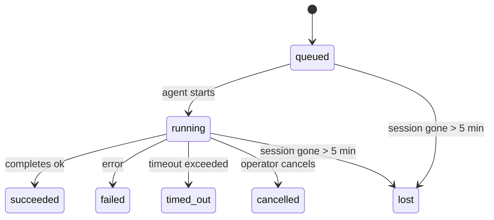

---
read_when:
    - Laufende oder kürzlich abgeschlossene Hintergrundarbeit prüfen
    - Debugging von Zustellungsfehlern bei getrennten Agent-Ausführungen
    - Verstehen, wie Hintergrundausführungen mit Sitzungen, Cron und Heartbeat zusammenhängen
sidebarTitle: Background tasks
summary: Nachverfolgung von Hintergrundaufgaben für ACP-Ausführungen, Subagents, isolierte Cron-Jobs und CLI-Vorgänge
title: Hintergrundaufgaben
x-i18n:
    generated_at: "2026-06-27T17:08:54Z"
    model: gpt-5.5
    postprocess_version: locale-links-v1
    provider: openai
    source_hash: 4a630a52d0d6bfd387a37415dd63fc4bfbce23f99eaa8cb780c3d6f8913675fd
    source_path: automation/tasks.md
    workflow: 16
---

<Note>
Suchen Sie nach Zeitplanung? Unter [Automatisierung](/de/automation) erfahren Sie, wie Sie den richtigen Mechanismus auswählen. Diese Seite ist das Aktivitätsprotokoll für Hintergrundarbeit, nicht der Scheduler.
</Note>

Hintergrundaufgaben verfolgen Arbeit, die **außerhalb Ihrer Haupt-Konversationssitzung** ausgeführt wird: ACP-Läufe, Subagent-Starts, isolierte Cron-Job-Ausführungen und über die CLI gestartete Vorgänge.

Aufgaben ersetzen **keine** Sitzungen, Cron-Jobs oder Heartbeats - sie sind das **Aktivitätsprotokoll**, das erfasst, welche losgelöste Arbeit stattgefunden hat, wann sie ausgeführt wurde und ob sie erfolgreich war.

<Note>
Nicht jeder Agent-Lauf erstellt eine Aufgabe. Heartbeat-Turns und normaler interaktiver Chat tun das nicht. Alle Cron-Ausführungen, ACP-Starts, Subagent-Starts und CLI-Agent-Befehle tun es.
</Note>

## TL;DR

- Aufgaben sind **Datensätze**, keine Scheduler - Cron und Heartbeat entscheiden, _wann_ Arbeit ausgeführt wird, Aufgaben verfolgen, _was passiert ist_.
- ACP, Subagents, alle Cron-Jobs und CLI-Vorgänge erstellen Aufgaben. Heartbeat-Turns tun das nicht.
- Jede Aufgabe durchläuft `queued → running → terminal` (succeeded, failed, timed_out, cancelled oder lost).
- Cron-Aufgaben bleiben aktiv, solange die Cron-Laufzeitumgebung den Job noch besitzt; wenn der
  In-Memory-Laufzeitstatus verschwunden ist, prüft die Aufgabenwartung zuerst die dauerhafte Cron-
  Laufhistorie, bevor sie eine Aufgabe als verloren markiert.
- Der Abschluss ist push-gesteuert: Losgelöste Arbeit kann direkt benachrichtigen oder die
  anfordernde Sitzung/den Heartbeat wecken, wenn sie fertig ist, daher sind Status-Polling-Schleifen
  normalerweise die falsche Form.
- Isolierte Cron-Läufe und Subagent-Abschlüsse bereinigen nach bestem Aufwand nachverfolgte Browser-Tabs/Prozesse für ihre untergeordnete Sitzung vor der finalen Bereinigungsbuchhaltung.
- Die Zustellung isolierter Cron-Läufe unterdrückt veraltete vorläufige Elternantworten, während nachgelagerte Subagent-Arbeit noch ausläuft, und bevorzugt die finale Ausgabe des Nachfahren, wenn diese vor der Zustellung eintrifft.
- Abschlussbenachrichtigungen werden direkt an einen Kanal zugestellt oder für den nächsten Heartbeat in die Warteschlange gestellt.
- `openclaw tasks list` zeigt alle Aufgaben; `openclaw tasks audit` macht Probleme sichtbar.
- Terminale Datensätze werden 7 Tage lang aufbewahrt und danach automatisch bereinigt.

## Schnellstart

<Tabs>
  <Tab title="Auflisten und filtern">
    ```bash
    # List all tasks (newest first)
    openclaw tasks list

    # Filter by runtime or status
    openclaw tasks list --runtime acp
    openclaw tasks list --status running
    ```

  </Tab>
  <Tab title="Prüfen">
    ```bash
    # Show details for a specific task (by ID, run ID, or session key)
    openclaw tasks show <lookup>
    ```
  </Tab>
  <Tab title="Abbrechen und benachrichtigen">
    ```bash
    # Cancel a running task (kills the child session)
    openclaw tasks cancel <lookup>

    # Change notification policy for a task
    openclaw tasks notify <lookup> state_changes
    ```

  </Tab>
  <Tab title="Audit und Wartung">
    ```bash
    # Run a health audit
    openclaw tasks audit

    # Preview or apply maintenance
    openclaw tasks maintenance
    openclaw tasks maintenance --apply
    ```

  </Tab>
  <Tab title="TaskFlow">
    ```bash
    # Inspect TaskFlow state
    openclaw tasks flow list
    openclaw tasks flow show <lookup>
    openclaw tasks flow cancel <lookup>
    ```
  </Tab>
</Tabs>

## Was eine Aufgabe erstellt

| Quelle                 | Laufzeittyp | Wann ein Aufgabendatensatz erstellt wird                               | Standard-Benachrichtigungsrichtlinie |
| ---------------------- | ------------ | ---------------------------------------------------------------------- | ------------------------------------ |
| ACP-Hintergrundläufe   | `acp`        | Starten einer untergeordneten ACP-Sitzung                              | `done_only`                          |
| Subagent-Orchestrierung | `subagent`  | Starten eines Subagents über `sessions_spawn`                          | `done_only`                          |
| Cron-Jobs (alle Typen) | `cron`       | Jede Cron-Ausführung (Hauptsitzung und isoliert)                       | `silent`                             |
| CLI-Vorgänge           | `cli`        | `openclaw agent`-Befehle, die über den Gateway laufen                  | `silent`                             |
| Agent-Medienjobs       | `cli`        | Sitzungsbasierte `image_generate`-/`music_generate`-/`video_generate`-Läufe | `silent`                         |

<AccordionGroup>
  <Accordion title="Benachrichtigungsstandards für Cron und Medien">
    Cron-Aufgaben der Hauptsitzung verwenden standardmäßig die Benachrichtigungsrichtlinie `silent` - sie erstellen Datensätze zur Nachverfolgung, erzeugen aber keine Benachrichtigungen. Isolierte Cron-Aufgaben verwenden ebenfalls standardmäßig `silent`, sind aber sichtbarer, weil sie in ihrer eigenen Sitzung laufen.

    Sitzungsbasierte `image_generate`-, `music_generate`- und `video_generate`-Läufe verwenden ebenfalls die Benachrichtigungsrichtlinie `silent`. Sie erstellen weiterhin Aufgabendatensätze, aber der Abschluss wird als interner Wake an die ursprüngliche Agent-Sitzung zurückgegeben, damit der Agent die Follow-up-Nachricht schreiben und die fertigen Medien selbst anhängen kann. Der anfordernde Agent folgt seinem normalen Vertrag für sichtbare Antworten: automatische finale Antwort, wenn konfiguriert, oder `message(action="send")` plus `NO_REPLY`, wenn die Sitzung Antworten über das Nachrichten-Tool erfordert. Wenn die anfordernde Sitzung nicht mehr aktiv ist oder ihr aktiver Wake fehlschlägt und der Abschluss-Agent einige oder alle generierten Medien verpasst, sendet OpenClaw einen idempotenten direkten Fallback nur mit den fehlenden Medien an das ursprüngliche Kanalziel.

  </Accordion>
  <Accordion title="Leitplanke für parallele Mediengenerierung">
    Solange eine sitzungsbasierte Mediengenerierungsaufgabe noch aktiv ist, fungieren Medien-Tools auch als Leitplanken gegen versehentliche Wiederholungen. Wiederholte `image_generate`-Aufrufe für denselben Prompt geben den Status der passenden aktiven Aufgabe zurück, während ein anderer Bild-Prompt seine eigene Aufgabe starten kann. `music_generate`- und `video_generate`-Aufrufe geben weiterhin den Status der aktiven Aufgabe für diese Sitzung zurück, statt eine zweite parallele Generierung zu starten. Verwenden Sie `action: "status"`, wenn Sie agentenseitig eine explizite Fortschritts-/Statusabfrage möchten.
  </Accordion>
  <Accordion title="Was keine Aufgaben erstellt">
    - Heartbeat-Turns - Hauptsitzung; siehe [Heartbeat](/de/gateway/heartbeat)
    - Normale interaktive Chat-Turns
    - Direkte `/command`-Antworten

  </Accordion>
</AccordionGroup>

## Aufgabenlebenszyklus



| Status      | Bedeutung                                                                  |
| ----------- | -------------------------------------------------------------------------- |
| `queued`    | Erstellt, wartet auf den Start des Agents                                  |
| `running`   | Agent-Turn wird aktiv ausgeführt                                           |
| `succeeded` | Erfolgreich abgeschlossen                                                  |
| `failed`    | Mit einem Fehler abgeschlossen                                             |
| `timed_out` | Hat das konfigurierte Timeout überschritten                                |
| `cancelled` | Vom Operator über `openclaw tasks cancel` gestoppt                         |
| `lost`      | Die Laufzeitumgebung hat nach einer Kulanzzeit von 5 Minuten den autoritativen Hintergrundstatus verloren |

Übergänge erfolgen automatisch - wenn der zugehörige Agent-Lauf endet, wird der Aufgabenstatus entsprechend aktualisiert.

Der Abschluss eines Agent-Laufs ist für aktive Aufgabendatensätze autoritativ. Ein erfolgreicher losgelöster Lauf wird als `succeeded` finalisiert, normale Laufzeitfehler als `failed` und Timeout- oder Abbruchergebnisse als `timed_out`. Wenn ein Operator die Aufgabe bereits abgebrochen hat oder die Laufzeitumgebung bereits einen stärkeren terminalen Status wie `failed`, `timed_out` oder `lost` erfasst hat, stuft ein späteres Erfolgssignal diesen terminalen Status nicht herab.

`lost` ist laufzeitbewusst:

- ACP-Aufgaben: Die Metadaten der unterstützenden untergeordneten ACP-Sitzung sind verschwunden.
- Subagent-Aufgaben: Die unterstützende untergeordnete Sitzung ist aus dem Ziel-Agent-Speicher verschwunden.
- Cron-Aufgaben: Die Cron-Laufzeitumgebung verfolgt den Job nicht mehr als aktiv und die dauerhafte
  Cron-Laufhistorie zeigt kein terminales Ergebnis für diesen Lauf. Ein Offline-CLI-
  Audit behandelt seinen eigenen leeren In-Process-Cron-Laufzeitstatus nicht als autoritativ.
- CLI-Aufgaben: Aufgaben mit Lauf-ID/Quell-ID verwenden den Live-Laufkontext, sodass
  verbleibende Zeilen für untergeordnete Sitzungen oder Chat-Sitzungen sie nicht aktiv halten, nachdem der
  vom Gateway besessene Lauf verschwunden ist. Legacy-CLI-Aufgaben ohne Laufidentität fallen weiterhin
  auf die untergeordnete Sitzung zurück. Gateway-gestützte `openclaw agent`-Läufe werden ebenfalls
  anhand ihres Laufergebnisses finalisiert, sodass abgeschlossene Läufe nicht aktiv bleiben, bis der Sweeper
  sie als `lost` markiert.

## Zustellung und Benachrichtigungen

Wenn eine Aufgabe einen terminalen Status erreicht, benachrichtigt OpenClaw Sie. Es gibt zwei Zustellwege:

**Direkte Zustellung** - wenn die Aufgabe ein Kanalziel hat (den `requesterOrigin`), geht die Abschlussnachricht direkt an diesen Kanal (Telegram, Discord, Slack usw.). Abschlüsse von Gruppen- und Kanalaufgaben werden stattdessen über die anfordernde Sitzung geleitet, damit der Eltern-Agent die sichtbare Antwort schreiben kann. Für Subagent-Abschlüsse bewahrt OpenClaw außerdem gebundene Thread-/Topic-Routen, wenn verfügbar, und kann ein fehlendes `to` / Konto aus der gespeicherten Route der anfordernden Sitzung (`lastChannel` / `lastTo` / `lastAccountId`) ergänzen, bevor es die direkte Zustellung aufgibt.

**Sitzungswarteschlangen-Zustellung** - wenn die direkte Zustellung fehlschlägt oder kein Ursprung gesetzt ist, wird die Aktualisierung als Systemereignis in die Sitzung des Anforderers eingereiht und beim nächsten Heartbeat sichtbar.

<Tip>
Der Aufgabenabschluss löst einen sofortigen Heartbeat-Wake aus, damit Sie das Ergebnis schnell sehen - Sie müssen nicht auf den nächsten geplanten Heartbeat-Tick warten.
</Tip>

Das bedeutet, der übliche Workflow ist push-basiert: Starten Sie losgelöste Arbeit einmal und lassen Sie dann die Laufzeitumgebung Sie bei Abschluss wecken oder benachrichtigen. Fragen Sie den Aufgabenstatus nur ab, wenn Sie Debugging, Eingriffe oder ein explizites Audit benötigen.

### Benachrichtigungsrichtlinien

Steuern Sie, wie viel Sie über jede Aufgabe erfahren:

| Richtlinie            | Was zugestellt wird                                                     |
| --------------------- | ----------------------------------------------------------------------- |
| `done_only` (Standard) | Nur terminaler Status (succeeded, failed usw.) - **dies ist der Standard** |
| `state_changes`       | Jeder Statusübergang und jede Fortschrittsaktualisierung                |
| `silent`              | Gar nichts                                                              |

Ändern Sie die Richtlinie, während eine Aufgabe läuft:

```bash
openclaw tasks notify <lookup> state_changes
```

## CLI-Referenz

<AccordionGroup>
  <Accordion title="tasks list">
    ```bash
    openclaw tasks list [--runtime <acp|subagent|cron|cli>] [--status <status>] [--json]
    ```

    Ausgabespalten: Aufgaben-ID, Art, Status, Zustellung, Lauf-ID, untergeordnete Sitzung, Zusammenfassung.

  </Accordion>
  <Accordion title="tasks show">
    ```bash
    openclaw tasks show <lookup>
    ```

    Das Lookup-Token akzeptiert eine Aufgaben-ID, Lauf-ID oder einen Sitzungsschlüssel. Zeigt den vollständigen Datensatz einschließlich Timing, Zustellstatus, Fehler und terminaler Zusammenfassung.

  </Accordion>
  <Accordion title="tasks cancel">
    ```bash
    openclaw tasks cancel <lookup>
    ```

    Für ACP- und Subagent-Aufgaben beendet dies die untergeordnete Sitzung. Für CLI-verfolgte Aufgaben wird der Abbruch im Aufgabenregister erfasst (es gibt kein separates Handle für die untergeordnete Laufzeitumgebung). Der Status wechselt zu `cancelled` und, sofern zutreffend, wird eine Zustellbenachrichtigung gesendet.

  </Accordion>
  <Accordion title="tasks notify">
    ```bash
    openclaw tasks notify <lookup> <done_only|state_changes|silent>
    ```
  </Accordion>
  <Accordion title="tasks audit">
    ```bash
    openclaw tasks audit [--json]
    ```

    Macht betriebliche Probleme sichtbar. Befunde erscheinen auch in `openclaw status`, wenn Probleme erkannt werden.

    | Befund                   | Schweregrad | Auslöser                                                                                                             |
    | ------------------------- | ---------- | --------------------------------------------------------------------------------------------------------------------- |
    | `stale_queued`            | warn       | Seit mehr als 10 Minuten in der Warteschlange                                                                         |
    | `stale_running`           | error      | Läuft seit mehr als 30 Minuten                                                                                        |
    | `lost`                    | warn/error | Runtime-gestützte Aufgabeninhaberschaft ist verschwunden; beibehaltene verlorene Aufgaben warnen bis `cleanupAfter` und werden dann zu Fehlern |
    | `delivery_failed`         | warn       | Zustellung fehlgeschlagen und Benachrichtigungsrichtlinie ist nicht `silent`                                          |
    | `missing_cleanup`         | warn       | Terminale Aufgabe ohne Cleanup-Zeitstempel                                                                           |
    | `inconsistent_timestamps` | warn       | Zeitachsenverletzung (zum Beispiel beendet vor gestartet)                                                             |

  </Accordion>
  <Accordion title="Aufgabenwartung">
    ```bash
    openclaw tasks maintenance [--json]
    openclaw tasks maintenance --apply [--json]
    ```

    Verwenden Sie dies, um Abgleich, Cleanup-Stempelung und Bereinigung für Aufgaben, Task-Flow-Zustand und veraltete Sitzungsregistrierungszeilen von Cron-Läufen vorab anzuzeigen oder anzuwenden.

    Der Abgleich ist runtime-bewusst:

    - ACP-/Subagent-Aufgaben prüfen ihre zugrunde liegende Kind-Sitzung.
    - Subagent-Aufgaben, deren Kind-Sitzung einen Tombstone für Neustartwiederherstellung hat, werden als verloren markiert, statt als wiederherstellbare zugrunde liegende Sitzungen behandelt zu werden.
    - Cron-Aufgaben prüfen, ob die Cron-Runtime den Job noch besitzt, und stellen dann den terminalen Status aus persistierten Cron-Laufprotokollen/Job-Zustand wieder her, bevor sie auf `lost` zurückfallen. Nur der Gateway-Prozess ist für die im Arbeitsspeicher gehaltene Menge aktiver Cron-Jobs autoritativ; ein Offline-CLI-Audit verwendet dauerhafte Historie, markiert eine Cron-Aufgabe aber nicht allein deshalb als verloren, weil diese lokale Set leer ist.
    - CLI-Aufgaben mit Laufidentität prüfen den besitzenden Live-Laufkontext, nicht nur Kind-Sitzungs- oder Chat-Sitzungszeilen.

    Auch die Abschlussbereinigung ist runtime-bewusst:

    - Der Subagent-Abschluss schließt nach bestem Aufwand nachverfolgte Browser-Tabs/Prozesse für die Kind-Sitzung, bevor die Ankündigungsbereinigung fortgesetzt wird.
    - Der isolierte Cron-Abschluss schließt nach bestem Aufwand nachverfolgte Browser-Tabs/Prozesse für die Cron-Sitzung, bevor der Lauf vollständig abgebaut wird.
    - Die isolierte Cron-Zustellung wartet bei Bedarf auf nachgelagerte Subagent-Follow-ups und unterdrückt veralteten Bestätigungstext des Elternteils, statt ihn anzukündigen.
    - Die Subagent-Abschlusszustellung verwendet nur den neuesten sichtbaren Assistant-Text des Kindes. Tool-/toolResult-Ausgaben werden nicht zum Ergebnistext des Kindes hochgestuft. Terminal fehlgeschlagene Läufe kündigen den Fehlerstatus an, ohne erfassten Antworttext erneut wiederzugeben.
    - Cleanup-Fehler verdecken nicht das tatsächliche Aufgabenergebnis.

    Beim Anwenden der Wartung entfernt OpenClaw außerdem veraltete Sitzungsregistrierungszeilen `cron:<jobId>:run:<uuid>`, die älter als 7 Tage sind, während Zeilen für aktuell laufende Cron-Jobs erhalten bleiben und Nicht-Cron-Sitzungszeilen unverändert bleiben.

  </Accordion>
  <Accordion title="Aufgaben-Flow list | show | cancel">
    ```bash
    openclaw tasks flow list [--status <status>] [--json]
    openclaw tasks flow show <lookup> [--json]
    openclaw tasks flow cancel <lookup>
    ```

    Verwenden Sie diese Befehle, wenn Ihnen der orchestrierende Task Flow wichtig ist und nicht ein einzelner Hintergrundaufgabeneintrag.

  </Accordion>
</AccordionGroup>

## Chat-Aufgabenboard (`/tasks`)

Verwenden Sie `/tasks` in jeder Chat-Sitzung, um Hintergrundaufgaben zu sehen, die mit dieser Sitzung verknüpft sind. Das Board zeigt aktive und kürzlich abgeschlossene Aufgaben mit Runtime, Status, Timing sowie Fortschritts- oder Fehlerdetails.

Wenn die aktuelle Sitzung keine sichtbaren verknüpften Aufgaben hat, fällt `/tasks` auf agent-lokale Aufgabenzählungen zurück, sodass Sie weiterhin eine Übersicht erhalten, ohne Details anderer Sitzungen offenzulegen.

Für das vollständige Operator-Ledger verwenden Sie die CLI: `openclaw tasks list`.

## Statusintegration (Aufgabendruck)

`openclaw status` enthält eine Aufgabenübersicht auf einen Blick:

```
Tasks: 3 queued · 2 running · 1 issues
```

Die Zusammenfassung meldet:

- **active** - Anzahl von `queued` + `running`
- **failures** - Anzahl von `failed` + `timed_out` + `lost`
- **byRuntime** - Aufschlüsselung nach `acp`, `subagent`, `cron`, `cli`

Sowohl `/status` als auch das Tool `session_status` verwenden einen cleanup-bewussten Aufgaben-Snapshot: Aktive Aufgaben werden bevorzugt, veraltete abgeschlossene Zeilen werden ausgeblendet, und jüngste Fehler werden nur angezeigt, wenn keine aktive Arbeit mehr verbleibt. Dadurch bleibt die Statuskarte auf das fokussiert, was im Moment zählt.

## Speicherung und Wartung

### Wo Aufgaben gespeichert werden

Aufgabeneinträge bleiben in SQLite erhalten unter:

```
$OPENCLAW_STATE_DIR/tasks/runs.sqlite
```

Die Registrierung wird beim Gateway-Start in den Arbeitsspeicher geladen und synchronisiert Schreibvorgänge zur Dauerhaftigkeit über Neustarts hinweg nach SQLite.
Der Gateway begrenzt das Write-Ahead-Log von SQLite, indem er den standardmäßigen
Autocheckpoint-Schwellenwert von SQLite plus periodische `PASSIVE`-Checkpoints verwendet. Shutdown- und
explizite Wartungs-Checkpoints verwenden weiterhin `TRUNCATE`, sodass normale Schließvorgänge
WAL-Speicher zurückgewinnen können, ohne den Hintergrund-Sweeper auf aktive Leser warten zu lassen.

### Automatische Wartung

Ein Sweeper läuft alle **60 Sekunden** und erledigt vier Dinge:

<Steps>
  <Step title="Abgleich">
    Prüft, ob aktive Aufgaben noch eine autoritative Runtime-Grundlage haben. ACP-/Subagent-Aufgaben verwenden Kind-Sitzungszustand, Cron-Aufgaben verwenden Active-Job-Inhaberschaft, und CLI-Aufgaben mit Laufidentität verwenden den besitzenden Laufkontext. Wenn dieser zugrunde liegende Zustand länger als 5 Minuten verschwunden ist, wird die Aufgabe als `lost` markiert.
  </Step>
  <Step title="ACP-Sitzungsreparatur">
    Schließt terminale oder verwaiste, vom Elternteil besessene One-Shot-ACP-Sitzungen und schließt veraltete terminale oder verwaiste persistente ACP-Sitzungen nur, wenn keine aktive Konversationsbindung verbleibt.
  </Step>
  <Step title="Cleanup-Stempelung">
    Setzt einen `cleanupAfter`-Zeitstempel auf terminale Aufgaben (endedAt + 7 Tage). Während der Aufbewahrung erscheinen verlorene Aufgaben im Audit weiterhin als Warnungen; nachdem `cleanupAfter` abläuft oder wenn Cleanup-Metadaten fehlen, sind sie Fehler.
  </Step>
  <Step title="Bereinigung">
    Löscht Einträge nach ihrem `cleanupAfter`-Datum.
  </Step>
</Steps>

<Note>
**Aufbewahrung:** Terminale Aufgabeneinträge werden **7 Tage** aufbewahrt und dann automatisch bereinigt. Keine Konfiguration erforderlich.
</Note>

## Wie Aufgaben mit anderen Systemen zusammenhängen

<AccordionGroup>
  <Accordion title="Aufgaben und Task Flow">
    [Task Flow](/de/automation/taskflow) ist die Flow-Orchestrierungsschicht über Hintergrundaufgaben. Ein einzelner Flow kann über seine Lebensdauer mehrere Aufgaben koordinieren, indem er verwaltete oder gespiegelte Synchronisationsmodi verwendet. Verwenden Sie `openclaw tasks`, um einzelne Aufgabeneinträge zu prüfen, und `openclaw tasks flow`, um den orchestrierenden Flow zu prüfen.

    Weitere Details finden Sie unter [Task Flow](/de/automation/taskflow).

  </Accordion>
  <Accordion title="Aufgaben und Cron">
    Cron-Job-Definitionen, Runtime-Ausführungszustand und Laufhistorie liegen in OpenClaws gemeinsam genutzter SQLite-Zustandsdatenbank. **Jede** Cron-Ausführung erstellt einen Aufgabeneintrag - sowohl Hauptsitzungs- als auch isolierte Ausführungen. Cron-Aufgaben der Hauptsitzung verwenden standardmäßig die Benachrichtigungsrichtlinie `silent`, sodass sie nachverfolgt werden, ohne Benachrichtigungen zu erzeugen.

    Siehe [Cron-Jobs](/de/automation/cron-jobs).

  </Accordion>
  <Accordion title="Aufgaben und Heartbeat">
    Heartbeat-Läufe sind Hauptsitzungs-Turns - sie erstellen keine Aufgabeneinträge. Wenn eine Aufgabe abgeschlossen wird, kann sie ein Heartbeat-Wecken auslösen, damit Sie das Ergebnis zeitnah sehen.

    Siehe [Heartbeat](/de/gateway/heartbeat).

  </Accordion>
  <Accordion title="Aufgaben und Sitzungen">
    Eine Aufgabe kann auf einen `childSessionKey` (wo die Arbeit läuft) und einen `requesterSessionKey` (wer sie gestartet hat) verweisen. Ihre `agentId` identifiziert den Agenten, der die Arbeit ausführt, während die Felder für Anfragenden und Besitzer Start- und Steuerungskontext erhalten. Sitzungen sind Konversationskontext; Aufgaben sind Aktivitätsverfolgung darüber.
  </Accordion>
  <Accordion title="Aufgaben und Agentenläufe">
    Die `runId` einer Aufgabe verweist auf den Agentenlauf, der die Arbeit ausführt. Agent-Lebenszyklusereignisse (Start, Ende, Fehler) aktualisieren automatisch den Aufgabenstatus - Sie müssen den Lebenszyklus nicht manuell verwalten.
  </Accordion>
</AccordionGroup>

## Verwandt

- [Automatisierung](/de/automation) - alle Automatisierungsmechanismen auf einen Blick
- [CLI: Aufgaben](/de/cli/tasks) - CLI-Befehlsreferenz
- [Heartbeat](/de/gateway/heartbeat) - periodische Hauptsitzungs-Turns
- [Geplante Aufgaben](/de/automation/cron-jobs) - Hintergrundarbeit planen
- [Task Flow](/de/automation/taskflow) - Flow-Orchestrierung über Aufgaben
