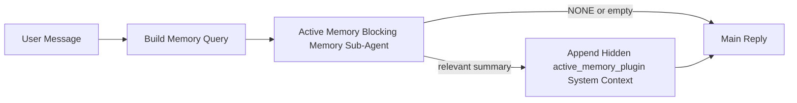

---
read_when:
    - Sie möchten verstehen, wofür aktiver Speicher da ist
    - Sie möchten aktiven Speicher für einen dialogorientierten Agenten aktivieren
    - Sie möchten das Verhalten des aktiven Speichers anpassen, ohne ihn überall zu aktivieren
summary: Ein plugin-eigener blockierender Speicher-Sub-Agent, der relevanten Speicher in interaktive Chatsitzungen einspeist
title: Aktiver Speicher
x-i18n:
    generated_at: "2026-04-12T06:16:43Z"
    model: gpt-5.4
    provider: openai
    source_hash: 59456805c28daaab394ba2a7f87e1104a1334a5cf32dbb961d5d232d9c471d84
    source_path: concepts/active-memory.md
    workflow: 15
---

# Aktiver Speicher

Aktiver Speicher ist ein optionaler plugin-eigener blockierender Speicher-Sub-Agent, der
vor der Hauptantwort für berechtigte dialogorientierte Sitzungen ausgeführt wird.

Er existiert, weil die meisten Speichersysteme leistungsfähig, aber reaktiv sind. Sie verlassen sich darauf,
dass der Haupt-Agent entscheidet, wann der Speicher durchsucht werden soll, oder darauf, dass der Benutzer Dinge
sagt wie „Merke dir das“ oder „Durchsuche den Speicher“. Zu diesem Zeitpunkt ist der Moment, in dem der Speicher
die Antwort natürlich wirken lassen hätte, bereits vorbei.

Aktiver Speicher gibt dem System eine begrenzte Gelegenheit, relevanten Speicher anzuzeigen,
bevor die Hauptantwort erzeugt wird.

## Fügen Sie dies in Ihren Agenten ein

Fügen Sie dies in Ihren Agenten ein, wenn Sie Aktiven Speicher mit einer
eigenständigen Konfiguration mit sicheren Standardwerten aktivieren möchten:

```json5
{
  plugins: {
    entries: {
      "active-memory": {
        enabled: true,
        config: {
          enabled: true,
          agents: ["main"],
          allowedChatTypes: ["direct"],
          modelFallback: "google/gemini-3-flash",
          queryMode: "recent",
          promptStyle: "balanced",
          timeoutMs: 15000,
          maxSummaryChars: 220,
          persistTranscripts: false,
          logging: true,
        },
      },
    },
  },
}
```

Dies schaltet das Plugin für den Agenten `main` ein, beschränkt es standardmäßig auf Sitzungen
im Stil von Direktnachrichten, lässt es zunächst das aktuelle Sitzungsmodell erben und verwendet
das konfigurierte Fallback-Modell nur dann, wenn kein explizites oder geerbtes Modell verfügbar ist.

Starten Sie danach das Gateway neu:

```bash
openclaw gateway
```

So prüfen Sie es live in einer Unterhaltung:

```text
/verbose on
```

## Aktiven Speicher aktivieren

Die sicherste Konfiguration ist:

1. das Plugin aktivieren
2. einen dialogorientierten Agenten auswählen
3. Protokollierung nur während der Feinabstimmung eingeschaltet lassen

Beginnen Sie mit Folgendem in `openclaw.json`:

```json5
{
  plugins: {
    entries: {
      "active-memory": {
        enabled: true,
        config: {
          agents: ["main"],
          allowedChatTypes: ["direct"],
          modelFallback: "google/gemini-3-flash",
          queryMode: "recent",
          promptStyle: "balanced",
          timeoutMs: 15000,
          maxSummaryChars: 220,
          persistTranscripts: false,
          logging: true,
        },
      },
    },
  },
}
```

Starten Sie dann das Gateway neu:

```bash
openclaw gateway
```

Das bedeutet:

- `plugins.entries.active-memory.enabled: true` schaltet das Plugin ein
- `config.agents: ["main"]` aktiviert aktiven Speicher nur für den Agenten `main`
- `config.allowedChatTypes: ["direct"]` hält aktiven Speicher standardmäßig nur für Sitzungen im Stil von Direktnachrichten aktiviert
- wenn `config.model` nicht gesetzt ist, erbt aktiver Speicher zunächst das aktuelle Sitzungsmodell
- `config.modelFallback` stellt optional Ihr eigenes Fallback-Provider-/Modell für den Abruf bereit
- `config.promptStyle: "balanced"` verwendet den standardmäßigen allgemeinen Prompt-Stil für den Modus `recent`
- aktiver Speicher wird weiterhin nur in berechtigten interaktiven persistenten Chatsitzungen ausgeführt

## So sehen Sie es

Aktiver Speicher fügt verborgenen Systemkontext für das Modell ein. Er legt
keine rohen Tags `<active_memory_plugin>...</active_memory_plugin>` gegenüber dem Client offen.

## Sitzungsumschaltung

Verwenden Sie den Plugin-Befehl, wenn Sie aktiven Speicher für die
aktuelle Chatsitzung pausieren oder fortsetzen möchten, ohne die Konfiguration zu bearbeiten:

```text
/active-memory status
/active-memory off
/active-memory on
```

Dies gilt auf Sitzungsebene. Es ändert nicht
`plugins.entries.active-memory.enabled`, die Agentenauswahl oder andere globale
Konfigurationen.

Wenn Sie möchten, dass der Befehl in die Konfiguration schreibt und aktiven Speicher für
alle Sitzungen pausiert oder fortsetzt, verwenden Sie die explizite globale Form:

```text
/active-memory status --global
/active-memory off --global
/active-memory on --global
```

Die globale Form schreibt `plugins.entries.active-memory.config.enabled`. Sie lässt
`plugins.entries.active-memory.enabled` aktiviert, damit der Befehl weiterhin verfügbar bleibt, um
aktiven Speicher später wieder einzuschalten.

Wenn Sie sehen möchten, was aktiver Speicher in einer Live-Sitzung macht, schalten Sie
den Verbose-Modus für diese Sitzung ein:

```text
/verbose on
```

Bei aktiviertem Verbose-Modus kann OpenClaw Folgendes anzeigen:

- eine Statuszeile für aktiven Speicher wie `Active Memory: ok 842ms recent 34 chars`
- eine lesbare Debug-Zusammenfassung wie `Active Memory Debug: Lemon pepper wings with blue cheese.`

Diese Zeilen werden aus demselben Durchlauf des aktiven Speichers abgeleitet, der den verborgenen
Systemkontext speist, sind aber für Menschen formatiert, anstatt rohe Prompt-Markup offenzulegen.

Standardmäßig ist das Transkript des blockierenden Speicher-Sub-Agenten temporär und wird
gelöscht, nachdem der Durchlauf abgeschlossen ist.

Beispielablauf:

```text
/verbose on
welche wings sollte ich bestellen?
```

Erwartete sichtbare Antwortform:

```text
...normale Assistentenantwort...

🧩 Active Memory: ok 842ms recent 34 chars
🔎 Active Memory Debug: Lemon pepper wings with blue cheese.
```

## Wann es ausgeführt wird

Aktiver Speicher verwendet zwei Schranken:

1. **Konfigurations-Opt-in**
   Das Plugin muss aktiviert sein, und die aktuelle Agenten-ID muss in
   `plugins.entries.active-memory.config.agents` enthalten sein.
2. **Strikte Laufzeitberechtigung**
   Selbst wenn es aktiviert und ausgewählt ist, wird aktiver Speicher nur für berechtigte
   interaktive persistente Chatsitzungen ausgeführt.

Die tatsächliche Regel ist:

```text
plugin enabled
+
agent id targeted
+
allowed chat type
+
eligible interactive persistent chat session
=
active memory runs
```

Wenn eine dieser Bedingungen fehlschlägt, wird aktiver Speicher nicht ausgeführt.

## Sitzungstypen

`config.allowedChatTypes` steuert, in welchen Arten von Unterhaltungen Aktiver
Speicher überhaupt ausgeführt werden darf.

Der Standard ist:

```json5
allowedChatTypes: ["direct"]
```

Das bedeutet, dass Aktiver Speicher standardmäßig in Sitzungen im Stil von Direktnachrichten ausgeführt wird, aber
nicht in Gruppen- oder Kanalsitzungen, es sei denn, Sie aktivieren diese ausdrücklich.

Beispiele:

```json5
allowedChatTypes: ["direct"]
```

```json5
allowedChatTypes: ["direct", "group"]
```

```json5
allowedChatTypes: ["direct", "group", "channel"]
```

## Wo es ausgeführt wird

Aktiver Speicher ist eine Funktion zur Anreicherung von Unterhaltungen, keine plattformweite
Inferenzfunktion.

| Oberfläche                                                          | Führt aktiven Speicher aus?                             |
| ------------------------------------------------------------------- | ------------------------------------------------------- |
| Control UI / persistente Webchat-Sitzungen                          | Ja, wenn das Plugin aktiviert ist und der Agent ausgewählt ist |
| Andere interaktive Kanalsitzungen auf demselben persistenten Chatpfad | Ja, wenn das Plugin aktiviert ist und der Agent ausgewählt ist |
| Headless-Einmalausführungen                                         | Nein                                                    |
| Heartbeat-/Hintergrundausführungen                                  | Nein                                                    |
| Allgemeine interne `agent-command`-Pfade                            | Nein                                                    |
| Sub-Agent-/interne Hilfsausführung                                  | Nein                                                    |

## Warum es verwenden

Verwenden Sie aktiven Speicher, wenn:

- die Sitzung persistent und benutzergerichtet ist
- der Agent über sinnvollen Langzeitspeicher verfügt, der durchsucht werden kann
- Kontinuität und Personalisierung wichtiger sind als rohe Prompt-Deterministik

Er funktioniert besonders gut für:

- stabile Präferenzen
- wiederkehrende Gewohnheiten
- langfristigen Benutzerkontext, der natürlich auftauchen sollte

Er ist ungeeignet für:

- Automatisierung
- interne Worker
- einmalige API-Aufgaben
- Orte, an denen verborgene Personalisierung überraschend wäre

## Wie es funktioniert

Die Laufzeitform ist:



Der blockierende Speicher-Sub-Agent kann nur Folgendes verwenden:

- `memory_search`
- `memory_get`

Wenn die Verbindung schwach ist, sollte er `NONE` zurückgeben.

## Abfragemodi

`config.queryMode` steuert, wie viel Unterhaltung der blockierende Speicher-Sub-Agent sieht.

## Prompt-Stile

`config.promptStyle` steuert, wie eifrig oder streng der blockierende Speicher-Sub-Agent ist,
wenn er entscheidet, ob Speicher zurückgegeben werden soll.

Verfügbare Stile:

- `balanced`: allgemeiner Standard für den Modus `recent`
- `strict`: am wenigsten eifrig; am besten, wenn Sie sehr wenig Übertragung aus nahem Kontext möchten
- `contextual`: am freundlichsten für Kontinuität; am besten, wenn der Unterhaltungsverlauf stärker zählen soll
- `recall-heavy`: eher bereit, Speicher auch bei schwächeren, aber noch plausiblen Übereinstimmungen anzuzeigen
- `precision-heavy`: bevorzugt aggressiv `NONE`, sofern die Übereinstimmung nicht offensichtlich ist
- `preference-only`: optimiert für Favoriten, Gewohnheiten, Routinen, Geschmack und wiederkehrende persönliche Fakten

Standardzuordnung, wenn `config.promptStyle` nicht gesetzt ist:

```text
message -> strict
recent -> balanced
full -> contextual
```

Wenn Sie `config.promptStyle` explizit setzen, hat diese Überschreibung Vorrang.

Beispiel:

```json5
promptStyle: "preference-only"
```

## Richtlinie für Modell-Fallback

Wenn `config.model` nicht gesetzt ist, versucht Aktiver Speicher, ein Modell in dieser Reihenfolge aufzulösen:

```text
explicit plugin model
-> current session model
-> agent primary model
-> optional configured fallback model
```

`config.modelFallback` steuert den konfigurierten Fallback-Schritt.

Optionales benutzerdefiniertes Fallback:

```json5
modelFallback: "google/gemini-3-flash"
```

Wenn kein explizites, geerbtes oder konfiguriertes Fallback-Modell aufgelöst wird, überspringt Aktiver Speicher
den Abruf in diesem Zug.

`config.modelFallbackPolicy` bleibt nur als veraltetes Kompatibilitätsfeld
für ältere Konfigurationen erhalten. Es ändert das Laufzeitverhalten nicht mehr.

## Erweiterte Ausweichmöglichkeiten

Diese Optionen sind bewusst nicht Teil der empfohlenen Konfiguration.

`config.thinking` kann die Denkstufe des blockierenden Speicher-Sub-Agenten überschreiben:

```json5
thinking: "medium"
```

Standard:

```json5
thinking: "off"
```

Aktivieren Sie dies nicht standardmäßig. Aktiver Speicher läuft im Antwortpfad, daher
erhöht zusätzliche Denkzeit direkt die für Benutzer sichtbare Latenz.

`config.promptAppend` fügt nach dem standardmäßigen Prompt für Aktiven Speicher und vor dem
Unterhaltungskontext zusätzliche Operator-Anweisungen hinzu:

```json5
promptAppend: "Prefer stable long-term preferences over one-off events."
```

`config.promptOverride` ersetzt den standardmäßigen Prompt für Aktiven Speicher. OpenClaw
fügt den Unterhaltungskontext danach weiterhin an:

```json5
promptOverride: "You are a memory search agent. Return NONE or one compact user fact."
```

Eine Prompt-Anpassung wird nicht empfohlen, es sei denn, Sie testen bewusst einen
anderen Abrufvertrag. Der Standard-Prompt ist darauf abgestimmt, entweder `NONE`
oder kompakten Benutzerfakt-Kontext für das Hauptmodell zurückzugeben.

### `message`

Es wird nur die neueste Benutzernachricht gesendet.

```text
Nur die neueste Benutzernachricht
```

Verwenden Sie dies, wenn:

- Sie das schnellste Verhalten möchten
- Sie die stärkste Ausrichtung auf den Abruf stabiler Präferenzen möchten
- Folgezüge keinen Unterhaltungskontext benötigen

Empfohlener Timeout:

- beginnen Sie bei etwa `3000` bis `5000` ms

### `recent`

Die neueste Benutzernachricht plus ein kleiner aktueller Unterhaltungsverlauf wird gesendet.

```text
Jüngster Unterhaltungsausschnitt:
user: ...
assistant: ...
user: ...

Neueste Benutzernachricht:
...
```

Verwenden Sie dies, wenn:

- Sie ein besseres Gleichgewicht zwischen Geschwindigkeit und Verankerung in der Unterhaltung möchten
- Rückfragen oft von den letzten wenigen Zügen abhängen

Empfohlener Timeout:

- beginnen Sie bei etwa `15000` ms

### `full`

Die vollständige Unterhaltung wird an den blockierenden Speicher-Sub-Agenten gesendet.

```text
Vollständiger Unterhaltungskontext:
user: ...
assistant: ...
user: ...
...
```

Verwenden Sie dies, wenn:

- die bestmögliche Abrufqualität wichtiger ist als Latenz
- die Unterhaltung wichtige Einrichtung weit hinten im Thread enthält

Empfohlener Timeout:

- erhöhen Sie ihn deutlich im Vergleich zu `message` oder `recent`
- beginnen Sie bei etwa `15000` ms oder höher, abhängig von der Thread-Größe

Im Allgemeinen sollte der Timeout mit der Kontextgröße steigen:

```text
message < recent < full
```

## Transkriptpersistenz

Läufe des blockierenden Speicher-Sub-Agenten für aktiven Speicher erzeugen während des Aufrufs des blockierenden Speicher-Sub-Agenten ein echtes `session.jsonl`-Transkript.

Standardmäßig ist dieses Transkript temporär:

- es wird in ein temporäres Verzeichnis geschrieben
- es wird nur für den Lauf des blockierenden Speicher-Sub-Agenten verwendet
- es wird sofort gelöscht, nachdem der Lauf abgeschlossen ist

Wenn Sie diese Transkripte des blockierenden Speicher-Sub-Agenten zur Fehlersuche oder
Inspektion auf der Festplatte behalten möchten, aktivieren Sie die Persistenz explizit:

```json5
{
  plugins: {
    entries: {
      "active-memory": {
        enabled: true,
        config: {
          agents: ["main"],
          persistTranscripts: true,
          transcriptDir: "active-memory",
        },
      },
    },
  },
}
```

Wenn aktiviert, speichert aktiver Speicher Transkripte in einem separaten Verzeichnis unter dem
Sitzungsordner des Ziel-Agenten, nicht im Hauptpfad für Benutzer-Unterhaltungstranskripte.

Das Standardlayout ist konzeptionell:

```text
agents/<agent>/sessions/active-memory/<blocking-memory-sub-agent-session-id>.jsonl
```

Sie können das relative Unterverzeichnis mit `config.transcriptDir` ändern.

Gehen Sie damit vorsichtig um:

- Transkripte des blockierenden Speicher-Sub-Agenten können sich in ausgelasteten Sitzungen schnell ansammeln
- der Abfragemodus `full` kann viel Unterhaltungskontext duplizieren
- diese Transkripte enthalten verborgenen Prompt-Kontext und abgerufene Erinnerungen

## Konfiguration

Die gesamte Konfiguration für aktiven Speicher befindet sich unter:

```text
plugins.entries.active-memory
```

Die wichtigsten Felder sind:

| Schlüssel                   | Typ                                                                                                  | Bedeutung                                                                                                   |
| --------------------------- | ---------------------------------------------------------------------------------------------------- | ----------------------------------------------------------------------------------------------------------- |
| `enabled`                   | `boolean`                                                                                            | Aktiviert das Plugin selbst                                                                                 |
| `config.agents`             | `string[]`                                                                                           | Agenten-IDs, die aktiven Speicher verwenden dürfen                                                          |
| `config.model`              | `string`                                                                                             | Optionale Modell-Referenz für den blockierenden Speicher-Sub-Agenten; wenn nicht gesetzt, verwendet aktiver Speicher das aktuelle Sitzungsmodell |
| `config.queryMode`          | `"message" \| "recent" \| "full"`                                                                    | Steuert, wie viel Unterhaltung der blockierende Speicher-Sub-Agent sieht                                    |
| `config.promptStyle`        | `"balanced" \| "strict" \| "contextual" \| "recall-heavy" \| "precision-heavy" \| "preference-only"` | Steuert, wie eifrig oder streng der blockierende Speicher-Sub-Agent ist, wenn er entscheidet, ob Speicher zurückgegeben werden soll |
| `config.thinking`           | `"off" \| "minimal" \| "low" \| "medium" \| "high" \| "xhigh" \| "adaptive"`                         | Erweiterte Überschreibung der Denkstufe für den blockierenden Speicher-Sub-Agenten; Standard ist `off` für Geschwindigkeit |
| `config.promptOverride`     | `string`                                                                                             | Erweiterter vollständiger Prompt-Ersatz; für den normalen Einsatz nicht empfohlen                           |
| `config.promptAppend`       | `string`                                                                                             | Erweiterte zusätzliche Anweisungen, die an den Standard- oder überschriebenen Prompt angehängt werden      |
| `config.timeoutMs`          | `number`                                                                                             | Hartes Timeout für den blockierenden Speicher-Sub-Agenten                                                   |
| `config.maxSummaryChars`    | `number`                                                                                             | Maximal zulässige Gesamtanzahl an Zeichen in der Active-Memory-Zusammenfassung                              |
| `config.logging`            | `boolean`                                                                                            | Gibt Active-Memory-Logs während der Feinabstimmung aus                                                      |
| `config.persistTranscripts` | `boolean`                                                                                            | Behält Transkripte des blockierenden Speicher-Sub-Agenten auf der Festplatte, statt temporäre Dateien zu löschen |
| `config.transcriptDir`      | `string`                                                                                             | Relatives Transkriptverzeichnis des blockierenden Speicher-Sub-Agenten unter dem Sitzungsordner des Agenten |

Nützliche Felder zur Feinabstimmung:

| Schlüssel                     | Typ      | Bedeutung                                                      |
| ----------------------------- | -------- | -------------------------------------------------------------- |
| `config.maxSummaryChars`      | `number` | Maximal zulässige Gesamtanzahl an Zeichen in der Active-Memory-Zusammenfassung |
| `config.recentUserTurns`      | `number` | Vorherige Benutzerzüge, die einbezogen werden, wenn `queryMode` `recent` ist |
| `config.recentAssistantTurns` | `number` | Vorherige Assistentenzüge, die einbezogen werden, wenn `queryMode` `recent` ist |
| `config.recentUserChars`      | `number` | Maximale Zeichen pro aktuellem Benutzerzug                     |
| `config.recentAssistantChars` | `number` | Maximale Zeichen pro aktuellem Assistentenzug                  |
| `config.cacheTtlMs`           | `number` | Cache-Wiederverwendung für wiederholte identische Abfragen     |

## Empfohlene Konfiguration

Beginnen Sie mit `recent`.

```json5
{
  plugins: {
    entries: {
      "active-memory": {
        enabled: true,
        config: {
          agents: ["main"],
          queryMode: "recent",
          promptStyle: "balanced",
          timeoutMs: 15000,
          maxSummaryChars: 220,
          logging: true,
        },
      },
    },
  },
}
```

Wenn Sie das Live-Verhalten während der Feinabstimmung prüfen möchten, verwenden Sie `/verbose on` in der
Sitzung, anstatt nach einem separaten Active-Memory-Debug-Befehl zu suchen.

Wechseln Sie dann zu:

- `message`, wenn Sie eine geringere Latenz möchten
- `full`, wenn Sie entscheiden, dass zusätzlicher Kontext den langsameren blockierenden Speicher-Sub-Agenten wert ist

## Fehlersuche

Wenn aktiver Speicher nicht dort erscheint, wo Sie ihn erwarten:

1. Bestätigen Sie, dass das Plugin unter `plugins.entries.active-memory.enabled` aktiviert ist.
2. Bestätigen Sie, dass die aktuelle Agenten-ID in `config.agents` aufgeführt ist.
3. Bestätigen Sie, dass Sie über eine interaktive persistente Chatsitzung testen.
4. Aktivieren Sie `config.logging: true` und beobachten Sie die Gateway-Logs.
5. Vergewissern Sie sich mit `openclaw memory status --deep`, dass die Speichersuche selbst funktioniert.

Wenn Speicher-Treffer verrauscht sind, verschärfen Sie:

- `maxSummaryChars`

Wenn aktiver Speicher zu langsam ist:

- `queryMode` reduzieren
- `timeoutMs` reduzieren
- die Anzahl aktueller Züge reduzieren
- Zeichenobergrenzen pro Zug reduzieren

## Zugehörige Seiten

- [Speichersuche](/de/concepts/memory-search)
- [Referenz zur Speicherkonfiguration](/de/reference/memory-config)
- [Plugin SDK setup](/de/plugins/sdk-setup)
