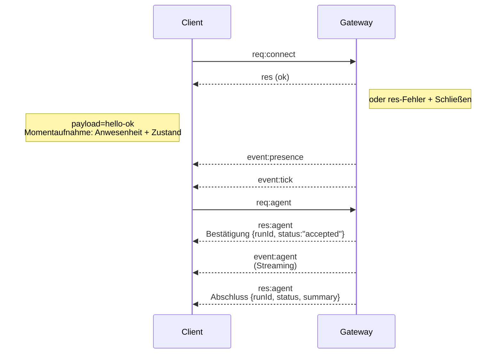

---
read_when:
    - Arbeiten am Gateway-Protokoll, an Clients oder Transporten
summary: WebSocket-Gateway-Architektur, Komponenten und Client-Abläufe
title: Gateway-Architektur
x-i18n:
    generated_at: "2026-07-12T01:31:34Z"
    model: gpt-5.6
    postprocess_version: locale-links-v1
    provider: openai
    source_hash: f8054bd87f738b957c24f8d6965d55365de2293d44902530a9ba778afa597cc7
    source_path: concepts/architecture.md
    workflow: 16
---

## Übersicht

- Ein einzelner langlebiger **Gateway** verwaltet alle Messaging-Schnittstellen (WhatsApp über
  Baileys, Telegram über grammY, Slack, Discord, Signal, iMessage, WebChat).
- Clients der Steuerungsebene (macOS-App, CLI, Weboberfläche, Automatisierungen) verbinden sich über
  **WebSocket** mit dem Gateway am konfigurierten Bind-Host (Standard:
  `127.0.0.1:18789`).
- **Nodes** (macOS/iOS/Android/headless) verbinden sich ebenfalls über **WebSocket**,
  deklarieren jedoch `role: node` mit expliziten Fähigkeiten/Befehlen.
- Ein Gateway pro Host; nur dort wird eine WhatsApp-Sitzung geöffnet.
- Der **Canvas-Host** wird vom HTTP-Server des Gateways unter folgenden Pfaden bereitgestellt:
  - `/__openclaw__/canvas/` (vom Agenten bearbeitbares HTML/CSS/JS)
  - `/__openclaw__/a2ui/` (A2UI-Host)

  Er verwendet denselben Port wie der Gateway (Standard: `18789`).

## Komponenten und Abläufe

### Gateway (Daemon)

- Verwaltet Provider-Verbindungen.
- Stellt eine typisierte WS-API bereit (Anfragen, Antworten, serverseitig übertragene Ereignisse).
- Validiert eingehende Frames anhand eines JSON-Schemas.
- Gibt Ereignisse wie `agent`, `chat`, `presence`, `health`, `heartbeat`, `cron` aus.

### Clients (Mac-App / CLI / Webadministration)

- Eine WS-Verbindung pro Client.
- Senden Anfragen (`health`, `status`, `send`, `agent`, `system-presence`).
- Abonnieren Ereignisse (`tick`, `agent`, `presence`, `shutdown`).

### Nodes (macOS / iOS / Android / headless)

- Stellen mit `role: node` eine Verbindung zum **gleichen WS-Server** her.
- Stellen in `connect` eine Geräteidentität bereit; die Kopplung ist **gerätebasiert** (Rolle `node`) und
  die Genehmigung wird im Speicher für Gerätekopplungen verwaltet.
- Stellen Befehle wie `canvas.*`, `camera.*`, `screen.record`, `location.get` bereit.

Protokolldetails: [Gateway-Protokoll](/de/gateway/protocol)

### WebChat

- Statische Benutzeroberfläche, die die WS-API des Gateways für den Chatverlauf und zum Senden verwendet.
- In Remote-Konfigurationen erfolgt die Verbindung über denselben SSH-/Tailscale-Tunnel wie bei anderen
  Clients.

## Verbindungslebenszyklus (einzelner Client)



## Übertragungsprotokoll (Zusammenfassung)

- Transport: WebSocket, Text-Frames mit JSON-Nutzdaten.
- Der erste Frame **muss** `connect` sein.
- Nach dem Handshake:
  - Anfragen: `{type:"req", id, method, params}` → `{type:"res", id, ok, payload|error}`
  - Ereignisse: `{type:"event", event, payload, seq?, stateVersion?}`
- `hello-ok.features.methods` / `events` sind Metadaten zur Erkennung und keine
  generierte Auflistung sämtlicher aufrufbarer Hilfsrouten.
- Die Authentifizierung mit einem gemeinsamen Geheimnis verwendet je nach konfiguriertem Gateway-Authentifizierungsmodus
  `connect.params.auth.token` oder `connect.params.auth.password`.
- Identitätstragende Modi wie Tailscale Serve
  (`gateway.auth.allowTailscale: true`) oder bei einer Nicht-Loopback-Verbindung
  `gateway.auth.mode: "trusted-proxy"` erfüllen die Authentifizierungsanforderungen anhand von Anfrage-Headern
  statt über `connect.params.auth.*`.
- Für privaten Eingang deaktiviert `gateway.auth.mode: "none"` die Authentifizierung mit gemeinsamem Geheimnis
  vollständig; verwenden Sie diesen Modus nicht für öffentliche/nicht vertrauenswürdige Eingänge.
- Idempotenzschlüssel sind für Methoden mit Nebenwirkungen (`send`, `agent`) erforderlich, damit
  Wiederholungsversuche sicher möglich sind; der Server verwaltet einen kurzlebigen Deduplizierungs-Cache.
- Nodes müssen in `connect` `role: "node"` sowie Fähigkeiten/Befehle/Berechtigungen angeben.

## Kopplung und lokales Vertrauen

- Alle WS-Clients (Bediener + Nodes) geben bei `connect` eine **Geräteidentität** an.
- Neue Geräte-IDs erfordern eine Kopplungsgenehmigung; der Gateway stellt ein **Geräte-Token**
  für nachfolgende Verbindungen aus.
- Direkte Verbindungen über local loopback können automatisch genehmigt werden, damit die Benutzererfahrung
  auf demselben Host reibungslos bleibt.
- OpenClaw verfügt außerdem über einen eng begrenzten lokalen Selbstverbindungspfad für Backend/Container
  für vertrauenswürdige Hilfsabläufe mit gemeinsamem Geheimnis.
- Verbindungen über Tailnet und LAN, einschließlich Tailnet-Bindings auf demselben Host, erfordern weiterhin
  eine ausdrückliche Kopplungsgenehmigung.
- Alle Verbindungen müssen die Nonce `connect.challenge` signieren. Die Signaturnutzdaten `v3`
  binden außerdem `platform` und `deviceFamily`; der Gateway fixiert gekoppelte Metadaten bei
  erneuten Verbindungen und erfordert bei Änderungen der Metadaten eine Reparaturkopplung.
- **Nicht lokale** Verbindungen erfordern weiterhin eine ausdrückliche Genehmigung.
- Die Gateway-Authentifizierung (`gateway.auth.*`) gilt weiterhin für **alle** Verbindungen, ob lokal oder
  remote.

Details: [Gateway-Protokoll](/de/gateway/protocol), [Kopplung](/de/channels/pairing),
[Sicherheit](/de/gateway/security).

## Protokolltypisierung und Codegenerierung

- TypeBox-Schemas definieren das Protokoll.
- Aus diesen Schemas wird ein JSON-Schema generiert.
- Swift-Modelle werden aus dem JSON-Schema generiert.

## Remote-Zugriff

- Bevorzugt: Tailscale oder VPN.
- Alternative: SSH-Tunnel

  ```bash
  ssh -N -L 18789:127.0.0.1:18789 user@gateway-host
  ```

- Über den Tunnel gelten derselbe Handshake und dasselbe Authentifizierungs-Token.
- Für WS kann in Remote-Konfigurationen TLS mit optionaler Zertifikatsfixierung aktiviert werden.

## Betriebsübersicht

- Start: `openclaw gateway` (im Vordergrund, Protokollierung nach stdout).
- Zustand: `health` über WS (auch in `hello-ok` enthalten).
- Überwachung: launchd/systemd für automatische Neustarts.

## Invarianten

- Genau ein Gateway steuert pro Host eine einzelne Baileys-Sitzung.
- Der Handshake ist obligatorisch; jeder erste Frame, der kein JSON enthält oder nicht `connect` ist, führt zur sofortigen Schließung.
- Ereignisse werden nicht erneut wiedergegeben; Clients müssen bei Lücken ihren Zustand aktualisieren.

## Verwandte Themen

- [Agentenschleife](/de/concepts/agent-loop) — detaillierter Ausführungszyklus des Agenten
- [Gateway-Protokoll](/de/gateway/protocol) — WebSocket-Protokollvertrag
- [Warteschlange](/de/concepts/queue) — Befehlswarteschlange und Nebenläufigkeit
- [Sicherheit](/de/gateway/security) — Vertrauensmodell und Absicherung
