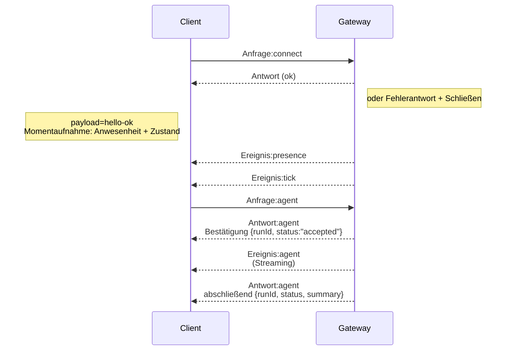

---
read_when:
    - Arbeiten am Gateway-Protokoll, an Clients oder Transporten
summary: WebSocket-Gateway-Architektur, Komponenten und Client-Abläufe
title: Gateway-Architektur
x-i18n:
    generated_at: "2026-07-12T15:10:54Z"
    model: gpt-5.6
    postprocess_version: locale-links-v1
    prompt_version: 15
    provider: openai
    source_hash: f8054bd87f738b957c24f8d6965d55365de2293d44902530a9ba778afa597cc7
    source_path: concepts/architecture.md
    workflow: 16
---

## Überblick

- Ein einzelner langlebiger **Gateway** verwaltet alle Messaging-Oberflächen (WhatsApp über
  Baileys, Telegram über grammY, Slack, Discord, Signal, iMessage, WebChat).
- Clients der Steuerungsebene (macOS-App, CLI, Web-UI, Automatisierungen) stellen über
  **WebSocket** auf dem konfigurierten Bind-Host eine Verbindung zum
  Gateway her (Standard: `127.0.0.1:18789`).
- **Nodes** (macOS/iOS/Android/headless) stellen ebenfalls über **WebSocket** eine Verbindung her,
  deklarieren jedoch `role: node` mit expliziten Funktionen/Befehlen.
- Ein Gateway pro Host; nur dort wird eine WhatsApp-Sitzung geöffnet.
- Der **Canvas-Host** wird vom HTTP-Server des Gateway unter folgenden Pfaden bereitgestellt:
  - `/__openclaw__/canvas/` (vom Agenten bearbeitbares HTML/CSS/JS)
  - `/__openclaw__/a2ui/` (A2UI-Host)

  Er verwendet denselben Port wie der Gateway (Standard: `18789`).

## Komponenten und Abläufe

### Gateway (Daemon)

- Verwaltet Provider-Verbindungen.
- Stellt eine typisierte WS-API bereit (Anfragen, Antworten, serverseitig übertragene Ereignisse).
- Validiert eingehende Frames anhand eines JSON-Schemas.
- Gibt Ereignisse wie `agent`, `chat`, `presence`, `health`, `heartbeat`, `cron` aus.

### Clients (Mac-App / CLI / Web-Administration)

- Eine WS-Verbindung pro Client.
- Senden Anfragen (`health`, `status`, `send`, `agent`, `system-presence`).
- Abonnieren Ereignisse (`tick`, `agent`, `presence`, `shutdown`).

### Nodes (macOS / iOS / Android / headless)

- Stellen mit `role: node` eine Verbindung zum **selben WS-Server** her.
- Geben in `connect` eine Geräteidentität an; die Kopplung ist **gerätebasiert** (Rolle `node`) und
  die Genehmigung wird im Speicher für Gerätekopplungen verwaltet.
- Stellen Befehle wie `canvas.*`, `camera.*`, `screen.record`, `location.get` bereit.

Protokolldetails: [Gateway-Protokoll](/de/gateway/protocol)

### WebChat

- Statische UI, die die Gateway-WS-API für den Chatverlauf und zum Senden verwendet.
- Stellt in Remote-Konfigurationen über denselben SSH-/Tailscale-Tunnel wie andere
  Clients eine Verbindung her.

## Verbindungslebenszyklus (einzelner Client)



## Übertragungsprotokoll (Zusammenfassung)

- Transport: WebSocket, Text-Frames mit JSON-Nutzdaten.
- Der erste Frame **muss** `connect` sein.
- Nach dem Handshake:
  - Anfragen: `{type:"req", id, method, params}` → `{type:"res", id, ok, payload|error}`
  - Ereignisse: `{type:"event", event, payload, seq?, stateVersion?}`
- `hello-ok.features.methods` / `events` sind Metadaten zur Ermittlung verfügbarer Funktionen und keine
  generierte Auflistung sämtlicher aufrufbarer Hilfsrouten.
- Die Authentifizierung mit einem gemeinsamen Geheimnis verwendet je nach konfiguriertem Gateway-Authentifizierungsmodus `connect.params.auth.token` oder
  `connect.params.auth.password`.
- Identitätstragende Modi wie Tailscale Serve
  (`gateway.auth.allowTailscale: true`) oder `gateway.auth.mode: "trusted-proxy"`
  außerhalb des Loopbacks erfüllen die Authentifizierungsanforderung über Anfrage-Header
  anstelle von `connect.params.auth.*`.
- `gateway.auth.mode: "none"` für privaten Ingress deaktiviert die Authentifizierung mit einem gemeinsamen Geheimnis
  vollständig; verwenden Sie diesen Modus nicht für öffentlichen/nicht vertrauenswürdigen Ingress.
- Idempotenzschlüssel sind für Methoden mit Nebenwirkungen (`send`, `agent`) erforderlich, um
  Wiederholungsversuche sicher durchzuführen; der Server verwaltet einen kurzlebigen Deduplizierungs-Cache.
- Nodes müssen in `connect` zusätzlich zu Fähigkeiten/Befehlen/Berechtigungen `role: "node"` enthalten.

## Kopplung und lokales Vertrauen

- Alle WS-Clients (Operatoren + Nodes) übermitteln bei `connect` eine **Geräteidentität**.
- Neue Geräte-IDs erfordern eine Kopplungsgenehmigung; das Gateway stellt ein **Geräte-Token**
  für nachfolgende Verbindungen aus.
- Direkte lokale Loopback-Verbindungen können automatisch genehmigt werden, um eine reibungslose Benutzererfahrung
  auf demselben Host zu gewährleisten.
- OpenClaw verfügt außerdem über einen eng begrenzten, Backend-/Container-lokalen Selbstverbindungspfad für
  vertrauenswürdige Hilfsabläufe mit gemeinsamem Geheimnis.
- Tailnet- und LAN-Verbindungen, einschließlich Tailnet-Bindungen auf demselben Host, erfordern weiterhin
  eine ausdrückliche Kopplungsgenehmigung.
- Alle Verbindungen müssen die Nonce `connect.challenge` signieren. Die Signaturnutzdaten `v3`
  binden außerdem `platform` und `deviceFamily`; das Gateway fixiert gekoppelte Metadaten bei der
  Wiederverbindung und erfordert bei Metadatenänderungen eine Reparaturkopplung.
- **Nicht lokale** Verbindungen erfordern weiterhin eine ausdrückliche Genehmigung.
- Die Gateway-Authentifizierung (`gateway.auth.*`) gilt weiterhin für **alle** lokalen und
  entfernten Verbindungen.

Details: [Gateway-Protokoll](/de/gateway/protocol), [Kopplung](/de/channels/pairing),
[Sicherheit](/de/gateway/security).

## Protokolltypisierung und Codegenerierung

- TypeBox-Schemas definieren das Protokoll.
- Aus diesen Schemas wird JSON Schema generiert.
- Swift-Modelle werden aus dem JSON Schema generiert.

## Fernzugriff

- Bevorzugt: Tailscale oder VPN.
- Alternative: SSH-Tunnel

  ```bash
  ssh -N -L 18789:127.0.0.1:18789 user@gateway-host
  ```

- Über den Tunnel gelten derselbe Handshake und dasselbe Authentifizierungstoken.
- TLS und optionales Pinning können für WS in Remote-Konfigurationen aktiviert werden.

## Betriebsübersicht

- Start: `openclaw gateway` (im Vordergrund, Protokollierung nach stdout).
- Status: `health` über WS (auch in `hello-ok` enthalten).
- Prozessüberwachung: launchd/systemd für automatische Neustarts.

## Invarianten

- Genau ein Gateway steuert pro Host eine einzelne Baileys-Sitzung.
- Der Handshake ist obligatorisch; ein erster Frame, der kein JSON oder keine Verbindungsanfrage ist, führt zum sofortigen Schließen der Verbindung.
- Ereignisse werden nicht erneut übertragen; Clients müssen bei Lücken ihre Daten aktualisieren.

## Verwandte Themen

- [Agentenschleife](/de/concepts/agent-loop) — detaillierter Ausführungszyklus des Agenten
- [Gateway-Protokoll](/de/gateway/protocol) — WebSocket-Protokollvertrag
- [Warteschlange](/de/concepts/queue) — Befehlswarteschlange und Nebenläufigkeit
- [Sicherheit](/de/gateway/security) — Vertrauensmodell und Absicherung
