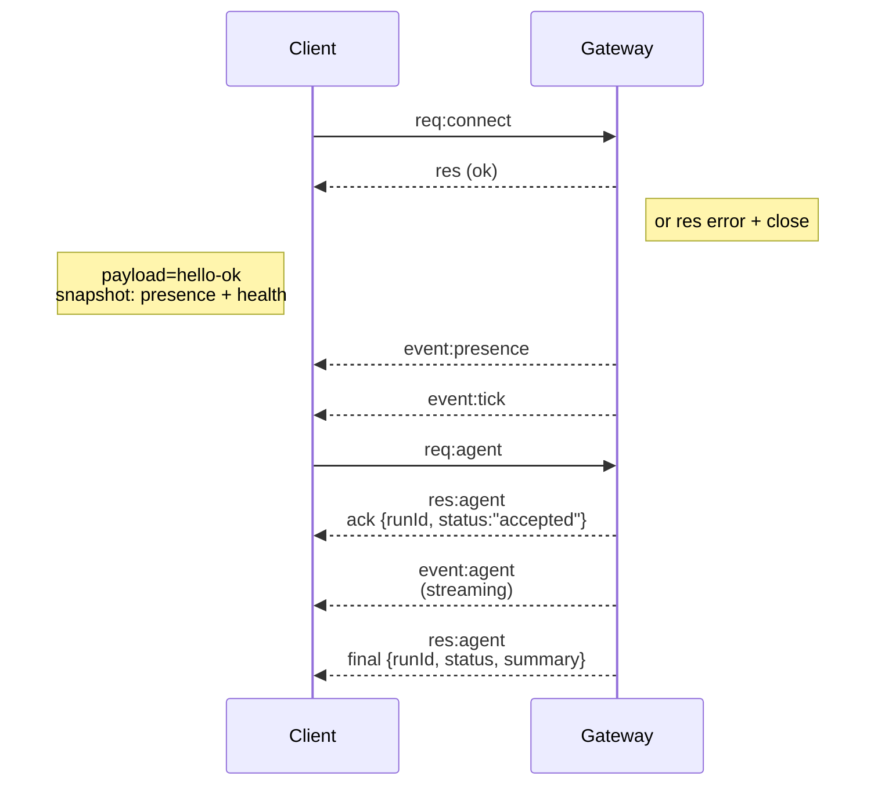

---
read_when:
    - Arbeiten am Gateway-Protokoll, an Clients oder an Transporten
summary: WebSocket-Gateway-Architektur, Komponenten und Client-Abläufe
title: Gateway-Architektur
x-i18n:
    generated_at: "2026-05-06T06:42:48Z"
    model: gpt-5.5
    provider: openai
    source_hash: 433489081bfe07691b211f5076ec45ce0ed3fd043eb86128f73121f2cab71cd3
    source_path: concepts/architecture.md
    workflow: 16
---

## Überblick

- Ein einzelner langlebiger **Gateway** besitzt alle Messaging-Oberflächen (WhatsApp über
  Baileys, Telegram über grammY, Slack, Discord, Signal, iMessage, WebChat).
- Control-Plane-Clients (macOS-App, CLI, Web-UI, Automatisierungen) verbinden sich mit dem
  Gateway über **WebSocket** auf dem konfigurierten Bind-Host (Standard
  `127.0.0.1:18789`).
- **Nodes** (macOS/iOS/Android/headless) verbinden sich ebenfalls über **WebSocket**, geben aber
  `role: node` mit expliziten Funktionen/Befehlen an.
- Ein Gateway pro Host; er ist die einzige Stelle, die eine WhatsApp-Sitzung öffnet.
- Der **Canvas-Host** wird vom Gateway-HTTP-Server bereitgestellt unter:
  - `/__openclaw__/canvas/` (durch Agenten bearbeitbares HTML/CSS/JS)
  - `/__openclaw__/a2ui/` (A2UI-Host)
    Er verwendet denselben Port wie der Gateway (Standard `18789`).

## Komponenten und Abläufe

### Gateway (Daemon)

- Verwaltet Provider-Verbindungen.
- Stellt eine typisierte WS-API bereit (Anfragen, Antworten, Server-Push-Ereignisse).
- Validiert eingehende Frames gegen JSON Schema.
- Gibt Ereignisse wie `agent`, `chat`, `presence`, `health`, `heartbeat`, `cron` aus.

### Clients (Mac-App / CLI / Web-Admin)

- Eine WS-Verbindung pro Client.
- Senden Anfragen (`health`, `status`, `send`, `agent`, `system-presence`).
- Abonnieren Ereignisse (`tick`, `agent`, `presence`, `shutdown`).

### Nodes (macOS / iOS / Android / headless)

- Verbinden sich mit demselben **WS-Server** mit `role: node`.
- Stellen eine Geräteidentität in `connect` bereit; Pairing ist **gerätebasiert** (Rolle `node`) und
  die Freigabe liegt im Geräte-Pairing-Speicher.
- Stellen Befehle wie `canvas.*`, `camera.*`, `screen.record`, `location.get` bereit.

Protokolldetails:

- [Gateway-Protokoll](/de/gateway/protocol)

### WebChat

- Statische UI, die die Gateway-WS-API für Chatverlauf und Senden verwendet.
- In Remote-Setups verbindet sie sich über denselben SSH-/Tailscale-Tunnel wie andere
  Clients.

## Verbindungslebenszyklus (einzelner Client)



## Wire-Protokoll (Zusammenfassung)

- Transport: WebSocket, Text-Frames mit JSON-Payloads.
- Der erste Frame **muss** `connect` sein.
- Nach dem Handshake:
  - Anfragen: `{type:"req", id, method, params}` → `{type:"res", id, ok, payload|error}`
  - Ereignisse: `{type:"event", event, payload, seq?, stateVersion?}`
- `hello-ok.features.methods` / `events` sind Discovery-Metadaten, kein
  generierter Dump jeder aufrufbaren Hilfsroute.
- Shared-Secret-Authentifizierung verwendet `connect.params.auth.token` oder
  `connect.params.auth.password`, abhängig vom konfigurierten Gateway-Authentifizierungsmodus.
- Modi mit Identität wie Tailscale Serve
  (`gateway.auth.allowTailscale: true`) oder nicht-loopback
  `gateway.auth.mode: "trusted-proxy"` erfüllen die Authentifizierung über Anfrage-Header
  statt über `connect.params.auth.*`.
- Private-Ingress `gateway.auth.mode: "none"` deaktiviert Shared-Secret-Authentifizierung
  vollständig; lassen Sie diesen Modus für öffentlichen/nicht vertrauenswürdigen Ingress deaktiviert.
- Idempotenzschlüssel sind für Methoden mit Seiteneffekten (`send`, `agent`) erforderlich, um
  Wiederholungen sicher auszuführen; der Server hält einen kurzlebigen Deduplizierungs-Cache.
- Nodes müssen `role: "node"` sowie Funktionen/Befehle/Berechtigungen in `connect` enthalten.

## Pairing + lokales Vertrauen

- Alle WS-Clients (Operatoren + Nodes) enthalten bei `connect` eine **Geräteidentität**.
- Neue Geräte-IDs erfordern eine Pairing-Freigabe; der Gateway stellt ein **Gerätetoken**
  für nachfolgende Verbindungen aus.
- Direkte local loopback-Verbindungen können automatisch freigegeben werden, damit die UX auf demselben Host
  reibungslos bleibt.
- OpenClaw hat außerdem einen engen backend-/containerlokalen Self-Connect-Pfad für
  vertrauenswürdige Shared-Secret-Hilfsabläufe.
- Tailnet- und LAN-Verbindungen, einschließlich Tailnet-Bindings auf demselben Host, erfordern weiterhin
  eine explizite Pairing-Freigabe.
- Alle Verbindungen müssen die `connect.challenge`-Nonce signieren.
- Signatur-Payload `v3` bindet außerdem `platform` + `deviceFamily`; der Gateway
  pinnt gepairte Metadaten beim erneuten Verbinden und verlangt Reparatur-Pairing bei Metadatenänderungen.
- **Nicht lokale** Verbindungen erfordern weiterhin explizite Freigabe.
- Gateway-Authentifizierung (`gateway.auth.*`) gilt weiterhin für **alle** Verbindungen, lokal oder
  remote.

Details: [Gateway-Protokoll](/de/gateway/protocol), [Pairing](/de/channels/pairing),
[Sicherheit](/de/gateway/security).

## Protokolltypisierung und Codegenerierung

- TypeBox-Schemas definieren das Protokoll.
- JSON Schema wird aus diesen Schemas generiert.
- Swift-Modelle werden aus dem JSON Schema generiert.

## Remote-Zugriff

- Bevorzugt: Tailscale oder VPN.
- Alternative: SSH-Tunnel

  ```bash
  ssh -N -L 18789:127.0.0.1:18789 user@host
  ```

- Derselbe Handshake + Authentifizierungstoken gelten über den Tunnel.
- TLS + optionales Pinning können für WS in Remote-Setups aktiviert werden.

## Betriebsübersicht

- Start: `openclaw gateway` (Vordergrund, Logs nach stdout).
- Integrität: `health` über WS (auch in `hello-ok` enthalten).
- Überwachung: launchd/systemd für automatischen Neustart.

## Invarianten

- Genau ein Gateway kontrolliert eine einzelne Baileys-Sitzung pro Host.
- Handshake ist verpflichtend; jeder nicht-JSON- oder nicht-connect erste Frame führt zu einem harten Schließen.
- Ereignisse werden nicht erneut abgespielt; Clients müssen bei Lücken aktualisieren.

## Verwandte Themen

- [Agent Loop](/de/concepts/agent-loop) — detaillierter Agent-Ausführungszyklus
- [Gateway-Protokoll](/de/gateway/protocol) — WebSocket-Protokollvertrag
- [Queue](/de/concepts/queue) — Befehlswarteschlange und Nebenläufigkeit
- [Sicherheit](/de/gateway/security) — Vertrauensmodell und Härtung
