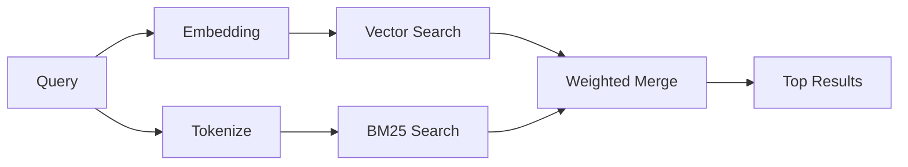

---
read_when:
    - Sie möchten verstehen, wie `memory_search` funktioniert.
    - Sie möchten einen Embedding-Provider auswählen.
    - Sie möchten die Suchqualität optimieren.
summary: Wie die Memory-Suche mit Embeddings und hybrider Suche relevante Notizen findet
title: Memory-Suche
x-i18n:
    generated_at: "2026-04-25T13:44:55Z"
    model: gpt-5.4
    provider: openai
    source_hash: 5cc6bbaf7b0a755bbe44d3b1b06eed7f437ebdc41a81c48cca64bd08bbc546b7
    source_path: concepts/memory-search.md
    workflow: 15
---

`memory_search` findet relevante Notizen aus Ihren Memory-Dateien, auch wenn die
Formulierung vom ursprünglichen Text abweicht. Es funktioniert, indem Memory in kleine
Chunks indexiert und diese mit Embeddings, Schlüsselwörtern oder beidem durchsucht werden.

## Schnellstart

Wenn Sie ein GitHub-Copilot-Abonnement oder einen konfigurierten API-Schlüssel für OpenAI, Gemini, Voyage oder Mistral
haben, funktioniert die Memory-Suche automatisch. Um einen Provider
explizit festzulegen:

```json5
{
  agents: {
    defaults: {
      memorySearch: {
        provider: "openai", // oder "gemini", "local", "ollama" usw.
      },
    },
  },
}
```

Für lokale Embeddings ohne API-Schlüssel installieren Sie das optionale Laufzeitpaket `node-llama-cpp`
neben OpenClaw und verwenden `provider: "local"`.

## Unterstützte Provider

| Provider       | ID               | Benötigt API-Schlüssel | Hinweise                                             |
| -------------- | ---------------- | ---------------------- | ---------------------------------------------------- |
| Bedrock        | `bedrock`        | Nein                   | Wird automatisch erkannt, wenn die AWS-Anmeldedatenkette aufgelöst wird |
| Gemini         | `gemini`         | Ja                     | Unterstützt Bild-/Audio-Indexierung                  |
| GitHub Copilot | `github-copilot` | Nein                   | Wird automatisch erkannt, verwendet Copilot-Abonnement |
| Local          | `local`          | Nein                   | GGUF-Modell, Download ca. 0,6 GB                     |
| Mistral        | `mistral`        | Ja                     | Wird automatisch erkannt                             |
| Ollama         | `ollama`         | Nein                   | Lokal, muss explizit gesetzt werden                  |
| OpenAI         | `openai`         | Ja                     | Wird automatisch erkannt, schnell                    |
| Voyage         | `voyage`         | Ja                     | Wird automatisch erkannt                             |

## So funktioniert die Suche

OpenClaw führt zwei Abrufpfade parallel aus und führt die Ergebnisse zusammen:



- **Vektorsuche** findet Notizen mit ähnlicher Bedeutung („Gateway-Host“ passt zu
  „die Maschine, auf der OpenClaw läuft“).
- **BM25-Schlüsselwortsuche** findet exakte Übereinstimmungen (IDs, Fehlerstrings, Konfigurations-
  schlüssel).

Wenn nur ein Pfad verfügbar ist (keine Embeddings oder kein FTS), läuft der andere allein.

Wenn Embeddings nicht verfügbar sind, verwendet OpenClaw weiterhin lexikales Ranking über FTS-Ergebnisse, statt nur auf rohe Exaktvergleichsreihenfolge zurückzufallen. Dieser degradierte Modus verstärkt Chunks mit stärkerer Abdeckung von Query-Begriffen und relevanten Dateipfaden, wodurch der Recall auch ohne `sqlite-vec` oder einen Embedding-Provider nützlich bleibt.

## Suchqualität verbessern

Zwei optionale Funktionen helfen, wenn Sie einen großen Notizverlauf haben:

### Zeitlicher Zerfall

Alte Notizen verlieren schrittweise Ranking-Gewicht, sodass aktuelle Informationen zuerst erscheinen.
Mit der Standard-Halbwertszeit von 30 Tagen erreicht eine Notiz vom letzten Monat 50 % ihres
ursprünglichen Gewichts. Evergreen-Dateien wie `MEMORY.md` unterliegen nie einem Zerfall.

<Tip>
Aktivieren Sie zeitlichen Zerfall, wenn Ihr Agent tägliche Notizen über mehrere Monate hat und veraltete
Informationen weiterhin aktuellerem Kontext im Ranking vorausgehen.
</Tip>

### MMR (Diversität)

Reduziert redundante Ergebnisse. Wenn fünf Notizen alle dieselbe Router-Konfiguration erwähnen, sorgt MMR
dafür, dass die obersten Ergebnisse unterschiedliche Themen abdecken, statt Wiederholungen zu liefern.

<Tip>
Aktivieren Sie MMR, wenn `memory_search` weiterhin nahezu doppelte Snippets aus
verschiedenen täglichen Notizen zurückgibt.
</Tip>

### Beides aktivieren

```json5
{
  agents: {
    defaults: {
      memorySearch: {
        query: {
          hybrid: {
            mmr: { enabled: true },
            temporalDecay: { enabled: true },
          },
        },
      },
    },
  },
}
```

## Multimodales Memory

Mit Gemini Embedding 2 können Sie Bilder und Audiodateien zusammen mit
Markdown indexieren. Suchanfragen bleiben Text, stimmen aber mit visuellen und Audio-
Inhalten überein. Informationen zur Einrichtung finden Sie in der [Memory-Konfigurationsreferenz](/de/reference/memory-config).

## Sitzungs-Memory-Suche

Sie können optional Sitzungstranskripte indexieren, sodass `memory_search` sich an
frühere Konversationen erinnern kann. Dies ist über
`memorySearch.experimental.sessionMemory` optional aktivierbar. Details finden Sie in der
[Konfigurationsreferenz](/de/reference/memory-config).

## Fehlerbehebung

**Keine Ergebnisse?** Führen Sie `openclaw memory status` aus, um den Index zu prüfen. Wenn er leer ist, führen
Sie `openclaw memory index --force` aus.

**Nur Schlüsselworttreffer?** Ihr Embedding-Provider ist möglicherweise nicht konfiguriert. Prüfen Sie
`openclaw memory status --deep`.

**CJK-Text nicht gefunden?** Erstellen Sie den FTS-Index neu mit
`openclaw memory index --force`.

## Weiterführende Informationen

- [Active Memory](/de/concepts/active-memory) -- Subagent-Memory für interaktive Chat-Sitzungen
- [Memory](/de/concepts/memory) -- Dateilayout, Backends, Tools
- [Memory-Konfigurationsreferenz](/de/reference/memory-config) -- alle Konfigurationsoptionen

## Verwandt

- [Memory-Überblick](/de/concepts/memory)
- [Active Memory](/de/concepts/active-memory)
- [Integrierte Memory-Engine](/de/concepts/memory-builtin)
