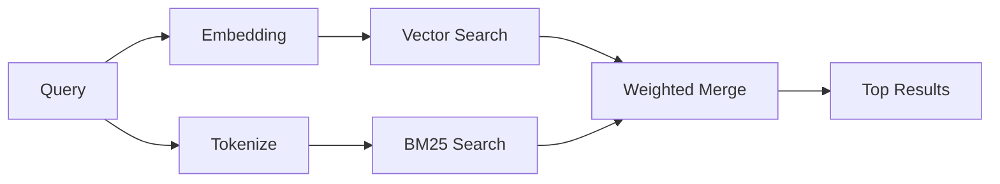

---
read_when:
    - Sie möchten verstehen, wie memory_search funktioniert
    - Sie möchten einen Embedding-Provider auswählen
    - Sie möchten die Suchqualität optimieren
summary: Wie die Speichersuche relevante Notizen mithilfe von Embeddings und hybrider Abfrage findet
title: Speichersuche
x-i18n:
    generated_at: "2026-06-27T17:23:58Z"
    model: gpt-5.5
    postprocess_version: locale-links-v1
    provider: openai
    source_hash: b0bcb8cf400100ba8b6ddbb46bdf8b2a89a8bc32a550ee6df47c874e7e9e0879
    source_path: concepts/memory-search.md
    workflow: 16
---

`memory_search` findet relevante Notizen aus Ihren Memory-Dateien, auch wenn die
Formulierung vom ursprünglichen Text abweicht. Dies funktioniert, indem Memory
in kleine Abschnitte indexiert und diese mit Embeddings, Schlüsselwörtern oder
beidem durchsucht werden.

## Schnellstart

Die Memory-Suche verwendet standardmäßig OpenAI-Embeddings. Um ein anderes
Embedding-Backend zu verwenden, legen Sie explizit einen Provider fest:

```json5
{
  agents: {
    defaults: {
      memorySearch: {
        provider: "openai", // or "gemini", "local", "ollama", "openai-compatible", etc.
      },
    },
  },
}
```

Bei Multi-Endpoint-Setups mit Memory-spezifischen Providern kann `provider` auch
ein benutzerdefinierter `models.providers.<id>`-Eintrag sein, zum Beispiel
`ollama-5080`, wenn dieser Provider `api: "ollama"` oder einen anderen Owner
eines Memory-Embedding-Adapters festlegt.

Für lokale Embeddings ohne API-Schlüssel installieren Sie
`@openclaw/llama-cpp-provider` und setzen `provider: "local"`. Source-Checkouts
können weiterhin eine Genehmigung für native Builds erfordern:
`pnpm approve-builds` und danach `pnpm rebuild node-llama-cpp`.

Einige OpenAI-kompatible Embedding-Endpoints erfordern asymmetrische Labels wie
`input_type: "query"` für Suchen und `input_type: "document"` oder `"passage"`
für indexierte Abschnitte. Konfigurieren Sie diese mit
`memorySearch.queryInputType` und `memorySearch.documentInputType`; siehe die
[Memory-Konfigurationsreferenz](/de/reference/memory-config#provider-specific-config).

## Unterstützte Provider

| Provider          | ID                  | Benötigt API-Schlüssel | Hinweise                           |
| ----------------- | ------------------- | ---------------------- | ---------------------------------- |
| Bedrock           | `bedrock`           | Nein                   | Verwendet die AWS-Credential-Chain |
| DeepInfra         | `deepinfra`         | Ja                     | Standard: `BAAI/bge-m3`            |
| Gemini            | `gemini`            | Ja                     | Unterstützt Bild-/Audioindexierung |
| GitHub Copilot    | `github-copilot`    | Nein                   | Verwendet ein Copilot-Abonnement   |
| Local             | `local`             | Nein                   | GGUF-Modell, ca. 0,6 GB Download   |
| Mistral           | `mistral`           | Ja                     |                                    |
| Ollama            | `ollama`            | Nein                   | Lokal/selbst gehostet              |
| OpenAI            | `openai`            | Ja                     | Standard                           |
| OpenAI-compatible | `openai-compatible` | Üblicherweise          | Generisch: `/v1/embeddings`        |
| Voyage            | `voyage`            | Ja                     |                                    |

## Funktionsweise der Suche

OpenClaw führt zwei Retrieval-Pfade parallel aus und führt die Ergebnisse
zusammen:



- **Vektorsuche** findet Notizen mit ähnlicher Bedeutung ("gateway host" passt
  zu "the machine running OpenClaw").
- **BM25-Schlüsselwortsuche** findet exakte Übereinstimmungen (IDs,
  Fehlerzeichenfolgen, Konfigurationsschlüssel).

Wenn nur ein Pfad verfügbar ist, läuft der andere allein. Der absichtliche
Nur-FTS-Modus (`provider: "none"`) und die automatische/standardmäßige
Provider-Auswahl können weiterhin lexikalisches Ranking verwenden, wenn
Embeddings nicht verfügbar sind.

Explizite nicht-lokale Embedding-Provider verhalten sich anders. Wenn Sie
`memorySearch.provider` auf einen konkreten remote-gestützten Provider setzen
und dieser Provider zur Laufzeit nicht verfügbar ist, meldet `memory_search`
Memory als nicht verfügbar, statt stillschweigend nur FTS-Ergebnisse zu
verwenden. Dadurch bleibt ein defekter konfigurierter semantischer Provider
sichtbar. Setzen Sie `provider: "none"` für bewusstes Nur-FTS-Recall, oder
beheben Sie die Provider-/Authentifizierungskonfiguration, um semantisches
Ranking wiederherzustellen.

## Suchqualität verbessern

Zwei optionale Funktionen helfen, wenn Sie einen großen Notizverlauf haben:

### Zeitlicher Zerfall

Alte Notizen verlieren schrittweise Ranking-Gewicht, damit aktuelle
Informationen zuerst erscheinen. Mit der standardmäßigen Halbwertszeit von 30
Tagen erreicht eine Notiz aus dem letzten Monat 50 % ihres ursprünglichen
Gewichts. Evergreen-Dateien wie `MEMORY.md` werden niemals abgeschwächt.

<Tip>
Aktivieren Sie zeitlichen Zerfall, wenn Ihr Agent über Monate täglicher Notizen
verfügt und veraltete Informationen aktuellen Kontext weiterhin überranken.
</Tip>

### MMR (Diversität)

Reduziert redundante Ergebnisse. Wenn fünf Notizen alle dieselbe
Router-Konfiguration erwähnen, stellt MMR sicher, dass die Top-Ergebnisse
verschiedene Themen abdecken, statt sich zu wiederholen.

<Tip>
Aktivieren Sie MMR, wenn `memory_search` weiterhin nahezu doppelte Ausschnitte
aus verschiedenen täglichen Notizen zurückgibt.
</Tip>

### Beides aktivieren

```json5
{
  agents: {
    defaults: {
      memorySearch: {
        query: {
          hybrid: {
            mmr: { enabled: true },
            temporalDecay: { enabled: true },
          },
        },
      },
    },
  },
}
```

## Multimodales Memory

Mit Gemini Embedding 2 können Sie Bild- und Audiodateien zusammen mit Markdown
indexieren. Suchanfragen bleiben Text, werden aber mit visuellen und
Audioinhalten abgeglichen. Informationen zur Einrichtung finden Sie in der
[Memory-Konfigurationsreferenz](/de/reference/memory-config).

## Sitzungs-Memory-Suche

Sie können optional Sitzungstranskripte indexieren, damit `memory_search`
frühere Unterhaltungen abrufen kann. Dies ist Opt-in über
`memorySearch.experimental.sessionMemory`. Details finden Sie in der
[Konfigurationsreferenz](/de/reference/memory-config).

## Fehlerbehebung

**Keine Ergebnisse?** Führen Sie `openclaw memory status` aus, um den Index zu
prüfen. Wenn er leer ist, führen Sie `openclaw memory index --force` aus.

**Nur Schlüsselworttreffer?** Ihr Embedding-Provider ist möglicherweise nicht
konfiguriert. Prüfen Sie `openclaw memory status --deep`.

**Lokale Embeddings laufen in ein Timeout?** `ollama`, `lmstudio` und `local`
verwenden standardmäßig ein längeres Inline-Batch-Timeout. Wenn der Host einfach
langsam ist, setzen Sie
`agents.defaults.memorySearch.sync.embeddingBatchTimeoutSeconds` und führen
`openclaw memory index --force` erneut aus.

**CJK-Text wird nicht gefunden?** Erstellen Sie den FTS-Index mit
`openclaw memory index --force` neu.

## Weiterführende Informationen

- [Active Memory](/de/concepts/active-memory) -- Sub-Agenten-Memory für interaktive Chatsitzungen
- [Memory](/de/concepts/memory) -- Dateilayout, Backends, Tools
- [Memory-Konfigurationsreferenz](/de/reference/memory-config) -- alle Konfigurationsoptionen

## Verwandt

- [Memory-Übersicht](/de/concepts/memory)
- [Active Memory](/de/concepts/active-memory)
- [Integrierte Memory-Engine](/de/concepts/memory-builtin)
