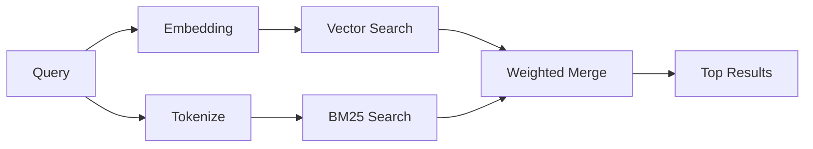

---
read_when:
    - Sie möchten verstehen, wie `memory_search` funktioniert
    - Sie möchten einen Embedding-Anbieter auswählen
    - Sie möchten die Suchqualität optimieren
summary: Wie die Erinnerungssuche relevante Notizen mithilfe von Embeddings und hybrider Suche findet
title: Erinnerungssuche
x-i18n:
    generated_at: "2026-04-06T03:06:35Z"
    model: gpt-5.4
    provider: openai
    source_hash: b6541cd702bff41f9a468dad75ea438b70c44db7c65a4b793cbacaf9e583c7e9
    source_path: concepts/memory-search.md
    workflow: 15
---

# Erinnerungssuche

`memory_search` findet relevante Notizen aus Ihren Erinnerungsdateien, auch wenn
die Formulierung vom ursprünglichen Text abweicht. Dazu wird der Speicher in kleine
Abschnitte indexiert und diese mithilfe von Embeddings, Schlüsselwörtern oder beidem durchsucht.

## Schnellstart

Wenn Sie einen konfigurierten API-Schlüssel für OpenAI, Gemini, Voyage oder Mistral haben, funktioniert die Erinnerungssuche automatisch. Um einen Anbieter explizit festzulegen:

```json5
{
  agents: {
    defaults: {
      memorySearch: {
        provider: "openai", // oder "gemini", "local", "ollama" usw.
      },
    },
  },
}
```

Für lokale Embeddings ohne API-Schlüssel verwenden Sie `provider: "local"` (erfordert
`node-llama-cpp`).

## Unterstützte Anbieter

| Anbieter | ID        | API-Schlüssel erforderlich | Hinweise                                             |
| -------- | --------- | ------------------------- | ---------------------------------------------------- |
| OpenAI   | `openai`  | Ja                        | Automatisch erkannt, schnell                         |
| Gemini   | `gemini`  | Ja                        | Unterstützt Bild-/Audio-Indexierung                  |
| Voyage   | `voyage`  | Ja                        | Automatisch erkannt                                  |
| Mistral  | `mistral` | Ja                        | Automatisch erkannt                                  |
| Bedrock  | `bedrock` | Nein                      | Automatisch erkannt, wenn die AWS-Credential-Kette aufgelöst wird |
| Ollama   | `ollama`  | Nein                      | Lokal, muss explizit festgelegt werden               |
| Local    | `local`   | Nein                      | GGUF-Modell, Download von ca. 0,6 GB                 |

## So funktioniert die Suche

OpenClaw führt zwei Abrufpfade parallel aus und führt die Ergebnisse zusammen:



- **Vektorsuche** findet Notizen mit ähnlicher Bedeutung („gateway host“ passt zu
  „the machine running OpenClaw“).
- **BM25-Schlüsselwortsuche** findet exakte Treffer (IDs, Fehlerzeichenfolgen, Konfigurations-
  schlüssel).

Wenn nur ein Pfad verfügbar ist (keine Embeddings oder keine FTS), wird der andere allein ausgeführt.

## Verbesserung der Suchqualität

Zwei optionale Funktionen helfen, wenn Sie einen großen Notizverlauf haben:

### Zeitlicher Verfall

Alte Notizen verlieren schrittweise an Ranking-Gewicht, sodass neuere Informationen zuerst erscheinen.
Mit der standardmäßigen Halbwertszeit von 30 Tagen erzielt eine Notiz vom letzten Monat 50 % ihres
ursprünglichen Gewichts. Dauerhafte Dateien wie `MEMORY.md` unterliegen nie dem Verfall.

<Tip>
Aktivieren Sie den zeitlichen Verfall, wenn Ihr Agent über Monate hinweg tägliche Notizen hat und veraltete
Informationen immer wieder vor aktuellem Kontext eingestuft werden.
</Tip>

### MMR (Diversität)

Reduziert redundante Ergebnisse. Wenn fünf Notizen alle dieselbe Router-Konfiguration erwähnen, sorgt MMR
dafür, dass die obersten Ergebnisse unterschiedliche Themen abdecken, statt sich zu wiederholen.

<Tip>
Aktivieren Sie MMR, wenn `memory_search` weiterhin nahezu doppelte Snippets aus
verschiedenen täglichen Notizen zurückgibt.
</Tip>

### Beides aktivieren

```json5
{
  agents: {
    defaults: {
      memorySearch: {
        query: {
          hybrid: {
            mmr: { enabled: true },
            temporalDecay: { enabled: true },
          },
        },
      },
    },
  },
}
```

## Multimodale Erinnerungen

Mit Gemini Embedding 2 können Sie Bilder und Audiodateien zusammen mit
Markdown indexieren. Suchanfragen bleiben textbasiert, gleichen aber auch mit visuellen und Audioinhalten ab. Informationen zur Einrichtung finden Sie in der [Referenz zur Erinnerungskonfiguration](/de/reference/memory-config).

## Suche in Sitzungserinnerungen

Sie können optional Sitzungsprotokolle indexieren, damit `memory_search`
frühere Unterhaltungen wiederfinden kann. Dies ist über
`memorySearch.experimental.sessionMemory` optional aktivierbar. Details finden Sie in der
[Konfigurationsreferenz](/de/reference/memory-config).

## Fehlerbehebung

**Keine Ergebnisse?** Führen Sie `openclaw memory status` aus, um den Index zu prüfen. Wenn er leer ist, führen Sie
`openclaw memory index --force` aus.

**Nur Schlüsselworttreffer?** Ihr Embedding-Anbieter ist möglicherweise nicht konfiguriert. Prüfen Sie
`openclaw memory status --deep`.

**CJK-Text wird nicht gefunden?** Erstellen Sie den FTS-Index mit
`openclaw memory index --force` neu.

## Weiterführende Informationen

- [Erinnerungen](/de/concepts/memory) -- Dateilayout, Backends, Tools
- [Referenz zur Erinnerungskonfiguration](/de/reference/memory-config) -- alle Konfigurationsoptionen
