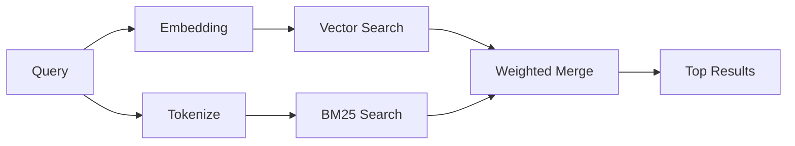

---
read_when:
    - Sie möchten verstehen, wie memory_search funktioniert
    - Sie möchten einen Provider für Embeddings auswählen
    - Sie möchten die Suchqualität optimieren
summary: Wie die Speichersuche relevante Notizen mit Embeddings und hybrider Suche findet
title: Speichersuche
x-i18n:
    generated_at: "2026-04-30T16:27:51Z"
    model: gpt-5.5
    provider: openai
    source_hash: 7f40bbe32453a28070ffc67f19a4c06e2fe59a24237a2aef353f4b9b8260bcf2
    source_path: concepts/memory-search.md
    workflow: 16
---

`memory_search` findet relevante Notizen aus Ihren Memory-Dateien, auch wenn die
Formulierung vom ursprünglichen Text abweicht. Dies funktioniert, indem Memory in
kleine Chunks indexiert wird und diese mit Embeddings, Schlüsselwörtern oder
beidem durchsucht werden.

## Schnellstart

Wenn Sie ein GitHub Copilot-Abonnement oder einen konfigurierten OpenAI-,
Gemini-, Voyage- oder Mistral-API-Schlüssel haben, funktioniert die Memory-Suche
automatisch. So legen Sie einen Provider explizit fest:

```json5
{
  agents: {
    defaults: {
      memorySearch: {
        provider: "openai", // or "gemini", "local", "ollama", etc.
      },
    },
  },
}
```

Für Setups mit mehreren Endpunkten kann `provider` auch ein benutzerdefinierter
`models.providers.<id>`-Eintrag sein, z. B. `ollama-5080`, wenn dieser Provider
`api: "ollama"` oder einen anderen Besitzer eines Embedding-Adapters festlegt.

Für lokale Embeddings ohne API-Schlüssel legen Sie `provider: "local"` fest.
Paketierte Installationen behalten die native `node-llama-cpp`-Runtime im von
OpenClaw verwalteten Plugin-Baum für Runtime-Abhängigkeiten bei; führen Sie
`openclaw doctor --fix` aus, wenn dieser Baum repariert werden muss.

Einige OpenAI-kompatible Embedding-Endpunkte erfordern asymmetrische Labels wie
`input_type: "query"` für Suchen und `input_type: "document"` oder `"passage"`
für indexierte Chunks. Konfigurieren Sie diese mit
`memorySearch.queryInputType` und `memorySearch.documentInputType`; siehe die
[Referenz zur Memory-Konfiguration](/de/reference/memory-config#provider-specific-config).

## Unterstützte Provider

| Provider       | ID               | Benötigt API-Schlüssel | Hinweise                                               |
| -------------- | ---------------- | ---------------------- | ------------------------------------------------------ |
| Bedrock        | `bedrock`        | Nein                   | Automatisch erkannt, wenn die AWS-Anmeldekette auflöst |
| Gemini         | `gemini`         | Ja                     | Unterstützt Bild-/Audioindexierung                     |
| GitHub Copilot | `github-copilot` | Nein                   | Automatisch erkannt, nutzt Copilot-Abonnement          |
| Local          | `local`          | Nein                   | GGUF-Modell, ca. 0,6 GB Download                       |
| Mistral        | `mistral`        | Ja                     | Automatisch erkannt                                    |
| Ollama         | `ollama`         | Nein                   | Lokal, muss explizit festgelegt werden                 |
| OpenAI         | `openai`         | Ja                     | Automatisch erkannt, schnell                           |
| Voyage         | `voyage`         | Ja                     | Automatisch erkannt                                    |

## So funktioniert die Suche

OpenClaw führt zwei Retrieval-Pfade parallel aus und führt die Ergebnisse zusammen:



- **Vektorsuche** findet Notizen mit ähnlicher Bedeutung ("gateway host" passt
  zu "the machine running OpenClaw").
- **BM25-Schlüsselwortsuche** findet exakte Treffer (IDs, Fehlerzeichenfolgen,
  Konfigurationsschlüssel).

Wenn nur ein Pfad verfügbar ist (keine Embeddings oder kein FTS), läuft der
andere allein.

Wenn Embeddings nicht verfügbar sind, verwendet OpenClaw weiterhin lexikalisches
Ranking über FTS-Ergebnisse, statt nur auf rohe Exakt-Treffer-Sortierung
zurückzufallen. Dieser eingeschränkte Modus gewichtet Chunks mit stärkerer
Abdeckung der Suchbegriffe und relevanten Dateipfaden höher, wodurch die
Trefferquote auch ohne `sqlite-vec` oder Embedding-Provider nützlich bleibt.

## Suchqualität verbessern

Zwei optionale Funktionen helfen, wenn Sie eine große Notizhistorie haben:

### Zeitlicher Verfall

Alte Notizen verlieren schrittweise Ranking-Gewicht, damit aktuelle Informationen
zuerst erscheinen. Mit der Standard-Halbwertszeit von 30 Tagen erreicht eine
Notiz aus dem letzten Monat 50 % ihres ursprünglichen Gewichts. Evergreen-Dateien
wie `MEMORY.md` unterliegen nie dem Verfall.

<Tip>
Aktivieren Sie zeitlichen Verfall, wenn Ihr Agent monatelange tägliche Notizen
hat und veraltete Informationen aktuellen Kontext weiterhin überranken.
</Tip>

### MMR (Diversität)

Reduziert redundante Ergebnisse. Wenn fünf Notizen alle dieselbe
Router-Konfiguration erwähnen, stellt MMR sicher, dass die Top-Ergebnisse
verschiedene Themen abdecken, statt sich zu wiederholen.

<Tip>
Aktivieren Sie MMR, wenn `memory_search` weiterhin nahezu doppelte Snippets aus
verschiedenen täglichen Notizen zurückgibt.
</Tip>

### Beides aktivieren

```json5
{
  agents: {
    defaults: {
      memorySearch: {
        query: {
          hybrid: {
            mmr: { enabled: true },
            temporalDecay: { enabled: true },
          },
        },
      },
    },
  },
}
```

## Multimodale Memory

Mit Gemini Embedding 2 können Sie Bilder und Audiodateien zusammen mit Markdown
indexieren. Suchanfragen bleiben Text, werden aber mit visuellen und
Audioinhalten abgeglichen. Einrichtungshinweise finden Sie in der
[Referenz zur Memory-Konfiguration](/de/reference/memory-config).

## Session-Memory-Suche

Sie können optional Sitzungs-Transkripte indexieren, damit `memory_search`
frühere Gespräche abrufen kann. Dies ist Opt-in über
`memorySearch.experimental.sessionMemory`. Details finden Sie in der
[Konfigurationsreferenz](/de/reference/memory-config).

## Fehlerbehebung

**Keine Ergebnisse?** Führen Sie `openclaw memory status` aus, um den Index zu
prüfen. Wenn er leer ist, führen Sie `openclaw memory index --force` aus.

**Nur Schlüsselworttreffer?** Ihr Embedding-Provider ist möglicherweise nicht
konfiguriert. Prüfen Sie `openclaw memory status --deep`.

**Zeitüberschreitung bei lokalen Embeddings?** `ollama`, `lmstudio` und `local`
verwenden standardmäßig ein längeres Inline-Batch-Timeout. Wenn der Host einfach
langsam ist, legen Sie
`agents.defaults.memorySearch.sync.embeddingBatchTimeoutSeconds` fest und führen
Sie `openclaw memory index --force` erneut aus.

**CJK-Text nicht gefunden?** Erstellen Sie den FTS-Index mit
`openclaw memory index --force` neu.

## Weiterführende Lektüre

- [Active Memory](/de/concepts/active-memory) -- Sub-Agent-Memory für interaktive Chat-Sitzungen
- [Memory](/de/concepts/memory) -- Dateilayout, Backends, Tools
- [Referenz zur Memory-Konfiguration](/de/reference/memory-config) -- alle Konfigurationsoptionen

## Verwandt

- [Memory-Übersicht](/de/concepts/memory)
- [Active Memory](/de/concepts/active-memory)
- [Integrierte Memory-Engine](/de/concepts/memory-builtin)
