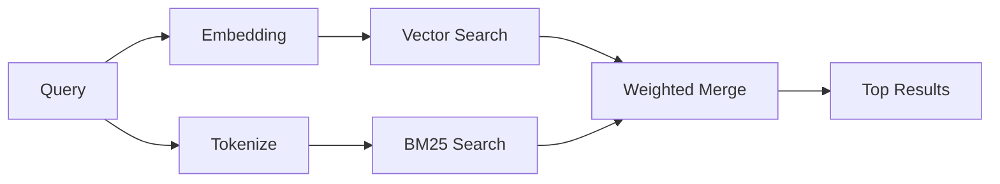

---
read_when:
    - Sie möchten verstehen, wie memory_search funktioniert
    - Sie möchten einen Embedding-Provider auswählen
    - Sie möchten die Suchqualität optimieren
summary: Wie die Speichersuche mithilfe von Einbettungen und hybridem Informationsabruf relevante Notizen findet
title: Speichersuche
x-i18n:
    generated_at: "2026-04-30T06:49:08Z"
    model: gpt-5.5
    provider: openai
    source_hash: 3e6c44d90f49a797bda01b9a575928c128a334f89ae14fc3620e65562a866aa9
    source_path: concepts/memory-search.md
    workflow: 16
---

`memory_search` findet relevante Notizen aus Ihren Memory-Dateien, auch wenn die
Formulierung vom ursprünglichen Text abweicht. Es funktioniert, indem Memory in
kleine Chunks indexiert und diese mit Embeddings, Schlüsselwörtern oder beidem
durchsucht werden.

## Schnellstart

Wenn Sie ein GitHub Copilot-Abonnement, OpenAI, Gemini, Voyage oder einen
konfigurierten Mistral-API-Schlüssel haben, funktioniert die Memory-Suche
automatisch. Um einen Provider explizit festzulegen:

```json5
{
  agents: {
    defaults: {
      memorySearch: {
        provider: "openai", // or "gemini", "local", "ollama", etc.
      },
    },
  },
}
```

Für Multi-Endpunkt-Setups kann `provider` auch ein benutzerdefinierter
`models.providers.<id>`-Eintrag sein, etwa `ollama-5080`, wenn dieser Provider
`api: "ollama"` oder einen anderen Besitzer eines Embedding-Adapters festlegt.

Für lokale Embeddings ohne API-Schlüssel installieren Sie das optionale
`node-llama-cpp`-Runtime-Paket neben OpenClaw und verwenden `provider: "local"`.

Einige OpenAI-kompatible Embedding-Endpunkte erfordern asymmetrische Labels wie
`input_type: "query"` für Suchen und `input_type: "document"` oder `"passage"`
für indexierte Chunks. Konfigurieren Sie diese mit
`memorySearch.queryInputType` und `memorySearch.documentInputType`; siehe die
[Memory-Konfigurationsreferenz](/de/reference/memory-config#provider-specific-config).

## Unterstützte Provider

| Provider       | ID               | Benötigt API-Schlüssel | Hinweise                                                     |
| -------------- | ---------------- | ---------------------- | ------------------------------------------------------------ |
| Bedrock        | `bedrock`        | Nein                   | Automatisch erkannt, wenn die AWS-Anmeldeinformationskette aufgelöst wird |
| Gemini         | `gemini`         | Ja                     | Unterstützt die Indexierung von Bildern/Audio                |
| GitHub Copilot | `github-copilot` | Nein                   | Automatisch erkannt, nutzt das Copilot-Abonnement            |
| Local          | `local`          | Nein                   | GGUF-Modell, ca. 0,6 GB Download                             |
| Mistral        | `mistral`        | Ja                     | Automatisch erkannt                                          |
| Ollama         | `ollama`         | Nein                   | Lokal, muss explizit festgelegt werden                       |
| OpenAI         | `openai`         | Ja                     | Automatisch erkannt, schnell                                 |
| Voyage         | `voyage`         | Ja                     | Automatisch erkannt                                          |

## Funktionsweise der Suche

OpenClaw führt zwei Retrieval-Pfade parallel aus und führt die Ergebnisse zusammen:



- **Vektorsuche** findet Notizen mit ähnlicher Bedeutung ("Gateway-Host" passt zu
  "die Maschine, auf der OpenClaw läuft").
- **BM25-Schlüsselwortsuche** findet exakte Treffer (IDs, Fehlerstrings,
  Konfigurationsschlüssel).

Wenn nur ein Pfad verfügbar ist (keine Embeddings oder kein FTS), läuft der andere allein.

Wenn Embeddings nicht verfügbar sind, verwendet OpenClaw weiterhin lexikalisches Ranking über FTS-Ergebnisse, statt nur auf rohe Reihenfolge nach exakten Treffern zurückzufallen. Dieser degradierte Modus bevorzugt Chunks mit stärkerer Abdeckung der Suchbegriffe und relevanten Dateipfaden, wodurch der Recall auch ohne `sqlite-vec` oder einen Embedding-Provider nützlich bleibt.

## Suchqualität verbessern

Zwei optionale Funktionen helfen, wenn Sie eine große Notizhistorie haben:

### Zeitliche Abschwächung

Alte Notizen verlieren nach und nach Ranking-Gewicht, damit aktuelle Informationen zuerst erscheinen.
Mit der standardmäßigen Halbwertszeit von 30 Tagen erzielt eine Notiz vom letzten Monat 50 % ihres ursprünglichen Gewichts. Evergreen-Dateien wie `MEMORY.md` werden nie abgeschwächt.

<Tip>
Aktivieren Sie zeitliche Abschwächung, wenn Ihr Agent monatelange tägliche Notizen hat und veraltete Informationen aktuellen Kontext weiterhin überranken.
</Tip>

### MMR (Diversität)

Reduziert redundante Ergebnisse. Wenn fünf Notizen alle dieselbe Router-Konfiguration erwähnen, stellt MMR sicher, dass die Top-Ergebnisse unterschiedliche Themen abdecken, statt sich zu wiederholen.

<Tip>
Aktivieren Sie MMR, wenn `memory_search` weiterhin nahezu doppelte Ausschnitte aus verschiedenen täglichen Notizen zurückgibt.
</Tip>

### Beides aktivieren

```json5
{
  agents: {
    defaults: {
      memorySearch: {
        query: {
          hybrid: {
            mmr: { enabled: true },
            temporalDecay: { enabled: true },
          },
        },
      },
    },
  },
}
```

## Multimodale Memory

Mit Gemini Embedding 2 können Sie Bilder und Audiodateien zusammen mit Markdown indexieren. Suchanfragen bleiben Text, stimmen aber mit visuellen und Audioinhalten überein. Informationen zur Einrichtung finden Sie in der [Memory-Konfigurationsreferenz](/de/reference/memory-config).

## Sitzungs-Memory-Suche

Sie können optional Sitzungs-Transkripte indexieren, damit `memory_search` frühere Gespräche abrufen kann. Dies ist per Opt-in über `memorySearch.experimental.sessionMemory` möglich. Details finden Sie in der [Konfigurationsreferenz](/de/reference/memory-config).

## Fehlerbehebung

**Keine Ergebnisse?** Führen Sie `openclaw memory status` aus, um den Index zu prüfen. Wenn er leer ist, führen Sie `openclaw memory index --force` aus.

**Nur Schlüsselworttreffer?** Ihr Embedding-Provider ist möglicherweise nicht konfiguriert. Prüfen Sie `openclaw memory status --deep`.

**Lokale Embeddings laufen in ein Timeout?** `ollama`, `lmstudio` und `local` verwenden standardmäßig ein längeres Inline-Batch-Timeout. Wenn der Host einfach langsam ist, setzen Sie `agents.defaults.memorySearch.sync.embeddingBatchTimeoutSeconds` und führen Sie `openclaw memory index --force` erneut aus.

**CJK-Text nicht gefunden?** Erstellen Sie den FTS-Index mit `openclaw memory index --force` neu.

## Weitere Informationen

- [Active Memory](/de/concepts/active-memory) -- Sub-Agent-Memory für interaktive Chat-Sitzungen
- [Memory](/de/concepts/memory) -- Dateilayout, Backends, Tools
- [Memory-Konfigurationsreferenz](/de/reference/memory-config) -- alle Konfigurationsoptionen

## Verwandt

- [Memory-Überblick](/de/concepts/memory)
- [Active Memory](/de/concepts/active-memory)
- [Integrierte Memory-Engine](/de/concepts/memory-builtin)
