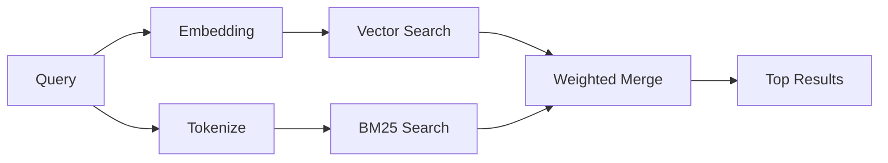

---
read_when:
    - Sie möchten verstehen, wie memory_search funktioniert
    - Sie möchten einen Embedding-Provider auswählen
    - Sie möchten die Suchqualität optimieren
summary: Wie die Memory-Suche relevante Notizen mithilfe von Embeddings und hybrider Retrieval findet
title: Speichersuche
x-i18n:
    generated_at: "2026-06-28T22:33:42Z"
    model: gpt-5.5
    postprocess_version: locale-links-v1
    provider: openai
    source_hash: 32ffb9d996851566eb92b7812c5425f545ecbb5387a0a445686df35a6c8ae143
    source_path: concepts/memory-search.md
    workflow: 16
---

`memory_search` findet relevante Notizen aus Ihren Speicherdateien, auch wenn die
Formulierung vom ursprünglichen Text abweicht. Es funktioniert, indem Speicher in kleine
Abschnitte indexiert und diese mit Embeddings, Schlüsselwörtern oder beidem durchsucht werden.

## Schnellstart

Die Speichersuche verwendet standardmäßig OpenAI-Embeddings. Um ein anderes Embedding-
Backend zu verwenden, legen Sie explizit einen Provider fest:

```json5
{
  agents: {
    defaults: {
      memorySearch: {
        provider: "openai", // or "gemini", "local", "ollama", "openai-compatible", etc.
      },
    },
  },
}
```

Für Setups mit mehreren Endpunkten und speicherspezifischen Providern kann `provider` auch
ein benutzerdefinierter `models.providers.<id>`-Eintrag sein, etwa `ollama-5080`, wenn dieser
Provider `api: "ollama"` oder einen anderen Eigentümer eines Speicher-Embedding-Adapters festlegt.

Für lokale Embeddings ohne API-Schlüssel installieren Sie
`@openclaw/llama-cpp-provider` und setzen `provider: "local"`. Source-Checkouts
können weiterhin eine native Build-Genehmigung erfordern: `pnpm approve-builds`, danach
`pnpm rebuild node-llama-cpp`.

Einige OpenAI-kompatible Embedding-Endpunkte erfordern asymmetrische Labels wie
`input_type: "query"` für Suchen und `input_type: "document"` oder `"passage"`
für indexierte Abschnitte. Konfigurieren Sie diese mit `memorySearch.queryInputType` und
`memorySearch.documentInputType`; siehe die [Referenz zur Speicherkonfiguration](/de/reference/memory-config#provider-specific-config).

## Unterstützte Provider

| Provider          | ID                  | Benötigt API-Schlüssel | Hinweise                      |
| ----------------- | ------------------- | ---------------------- | ----------------------------- |
| Bedrock           | `bedrock`           | Nein                   | Verwendet AWS-Anmeldeinformationskette |
| DeepInfra         | `deepinfra`         | Ja                     | Standard: `BAAI/bge-m3`       |
| Gemini            | `gemini`            | Ja                     | Unterstützt Bild-/Audioindexierung |
| GitHub Copilot    | `github-copilot`    | Nein                   | Verwendet Copilot-Abonnement  |
| Local             | `local`             | Nein                   | GGUF-Modell, ~0,6 GB Download |
| Mistral           | `mistral`           | Ja                     |                               |
| Ollama            | `ollama`            | Nein                   | Lokal/selbst gehostet         |
| OpenAI            | `openai`            | Ja                     | Standard                      |
| OpenAI-compatible | `openai-compatible` | In der Regel           | Generisches `/v1/embeddings`  |
| Voyage            | `voyage`            | Ja                     |                               |

## Funktionsweise der Suche

OpenClaw führt zwei Abrufpfade parallel aus und führt die Ergebnisse zusammen:



- **Vektorsuche** findet Notizen mit ähnlicher Bedeutung ("gateway host" passt zu
  "the machine running OpenClaw").
- **BM25-Schlüsselwortsuche** findet exakte Treffer (IDs, Fehlerzeichenfolgen, Konfigurations-
  schlüssel).

Wenn nur ein Pfad verfügbar ist, wird der andere allein ausgeführt. Der absichtliche Nur-FTS-Modus
(`provider: "none"`) und die automatische/standardmäßige Provider-Auswahl können weiterhin
lexikalisches Ranking verwenden, wenn Embeddings nicht verfügbar sind.

Explizite nicht lokale Embedding-Provider verhalten sich anders. Wenn Sie
`memorySearch.provider` auf einen konkreten remote-gestützten Provider setzen und dieser Provider
zur Laufzeit nicht verfügbar ist, meldet `memory_search` den Speicher als nicht verfügbar, statt
stillschweigend nur FTS-Ergebnisse zu verwenden. Dadurch bleibt ein fehlerhaft konfigurierter semantischer
Provider sichtbar. Setzen Sie `provider: "none"` für bewusstes Nur-FTS-Recall, oder beheben Sie
die Provider-/Auth-Konfiguration, um semantisches Ranking wiederherzustellen.

## Suchqualität verbessern

Zwei optionale Funktionen helfen bei einer großen Notizhistorie:

### Zeitlicher Verfall

Alte Notizen verlieren schrittweise Ranking-Gewicht, damit neuere Informationen zuerst erscheinen.
Mit der standardmäßigen Halbwertszeit von 30 Tagen erreicht eine Notiz aus dem letzten Monat 50 %
ihres ursprünglichen Gewichts. Dauerhaft relevante Dateien wie `MEMORY.md` verfallen nie.

<Tip>
Aktivieren Sie zeitlichen Verfall, wenn Ihr Agent monatelange tägliche Notizen hat und veraltete
Informationen aktuellen Kontext weiterhin übertreffen.
</Tip>

### MMR (Diversität)

Reduziert redundante Ergebnisse. Wenn fünf Notizen dieselbe Router-Konfiguration erwähnen, stellt MMR
sicher, dass die Top-Ergebnisse unterschiedliche Themen abdecken, statt sich zu wiederholen.

<Tip>
Aktivieren Sie MMR, wenn `memory_search` weiterhin nahezu doppelte Ausschnitte aus
verschiedenen täglichen Notizen zurückgibt.
</Tip>

### Beides aktivieren

```json5
{
  agents: {
    defaults: {
      memorySearch: {
        query: {
          hybrid: {
            mmr: { enabled: true },
            temporalDecay: { enabled: true },
          },
        },
      },
    },
  },
}
```

## Multimodaler Speicher

Mit Gemini Embedding 2 können Sie Bilder und Audiodateien zusammen mit
Markdown indexieren. Suchanfragen bleiben Text, passen aber zu visuellen und Audio-
Inhalten. Informationen zur Einrichtung finden Sie in der [Referenz zur Speicherkonfiguration](/de/reference/memory-config).

## Sitzungsspeichersuche

Sie können optional Sitzungsprotokolle indexieren, damit `memory_search` frühere
Konversationen abrufen kann. Dies ist Opt-in über
`memorySearch.experimental.sessionMemory` und `sources: ["sessions"]`; die Standard-
Quellenliste enthält nur Speicher. Das experimentelle Flag aktiviert die Indexierung von Sitzungsprotokollen,
während `sources` steuert, ob Sitzungsabschnitte durchsucht werden.

Sitzungstreffer beachten `tools.sessions.visibility`: Die Standardeinstellung `tree`
gibt nur die aktuelle Sitzung und von ihr gestartete Sitzungen frei. Um eine nicht verwandte,
vom Gateway ausgelöste Sitzung desselben Agents aus einer separaten DM-Sitzung abzurufen, erweitern Sie
die Sichtbarkeit bewusst auf `agent`.

Wenn Sie QMD verwenden, setzen Sie außerdem `memory.qmd.sessions.enabled: true`, damit Protokolle in
eine QMD-Sammlung exportiert werden. Details finden Sie in der
[Konfigurationsreferenz](/de/reference/memory-config).

## Fehlerbehebung

**Keine Ergebnisse?** Führen Sie `openclaw memory status` aus, um den Index zu prüfen. Wenn er leer ist, führen Sie
`openclaw memory index --force` aus.

**Nur Schlüsselworttreffer?** Ihr Embedding-Provider ist möglicherweise nicht konfiguriert. Prüfen Sie
`openclaw memory status --deep`.

**Lokale Embeddings laufen in ein Timeout?** `ollama`, `lmstudio` und `local` verwenden standardmäßig ein längeres
Inline-Batch-Timeout. Wenn der Host einfach langsam ist, setzen Sie
`agents.defaults.memorySearch.sync.embeddingBatchTimeoutSeconds` und führen Sie erneut
`openclaw memory index --force` aus.

**CJK-Text nicht gefunden?** Erstellen Sie den FTS-Index neu mit
`openclaw memory index --force`.

## Weiterführende Informationen

- [Active Memory](/de/concepts/active-memory) -- Sub-Agent-Speicher für interaktive Chat-Sitzungen
- [Speicher](/de/concepts/memory) -- Dateilayout, Backends, Tools
- [Referenz zur Speicherkonfiguration](/de/reference/memory-config) -- alle Konfigurationsoptionen

## Verwandt

- [Speicherübersicht](/de/concepts/memory)
- [Active Memory](/de/concepts/active-memory)
- [Integrierte Speicher-Engine](/de/concepts/memory-builtin)
