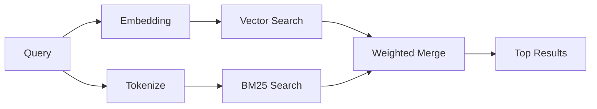

---
read_when:
    - Sie möchten verstehen, wie memory_search funktioniert
    - Sie möchten einen Embedding-Provider auswählen
    - Sie möchten die Suchqualität optimieren
summary: Wie die Speichersuche mithilfe von Embeddings und hybridem Retrieval relevante Notizen findet
title: Speichersuche
x-i18n:
    generated_at: "2026-05-02T06:31:25Z"
    model: gpt-5.5
    provider: openai
    source_hash: 2a71fb0809d5c70689e8046f854e4b4b4e79f45769ac2964e40a762ebb4e91a8
    source_path: concepts/memory-search.md
    workflow: 16
---

`memory_search` findet relevante Notizen aus Ihren Speicherdateien, auch wenn die
Formulierung vom Originaltext abweicht. Es funktioniert, indem Speicher in kleine
Abschnitte indexiert und diese mithilfe von Embeddings, Schlüsselwörtern oder
beidem durchsucht werden.

## Schnellstart

Wenn Sie ein GitHub Copilot-Abonnement, OpenAI, Gemini, Voyage oder einen
Mistral-API-Schlüssel konfiguriert haben, funktioniert die Speichersuche
automatisch. So legen Sie einen Provider explizit fest:

```json5
{
  agents: {
    defaults: {
      memorySearch: {
        provider: "openai", // or "gemini", "local", "ollama", etc.
      },
    },
  },
}
```

Für Setups mit mehreren Endpunkten kann `provider` auch ein benutzerdefinierter
`models.providers.<id>`-Eintrag sein, z. B. `ollama-5080`, wenn dieser Provider
`api: "ollama"` oder einen anderen Eigentümer eines Embedding-Adapters festlegt.

Für lokale Embeddings ohne API-Schlüssel setzen Sie `provider: "local"`.
Source-Checkouts können weiterhin eine Freigabe für native Builds erfordern:
`pnpm approve-builds` und dann `pnpm rebuild node-llama-cpp`.

Einige OpenAI-kompatible Embedding-Endpunkte erfordern asymmetrische Labels wie
`input_type: "query"` für Suchen und `input_type: "document"` oder `"passage"`
für indexierte Abschnitte. Konfigurieren Sie diese mit
`memorySearch.queryInputType` und `memorySearch.documentInputType`; siehe die
[Referenz zur Speicherkonfiguration](/de/reference/memory-config#provider-specific-config).

## Unterstützte Provider

| Provider       | ID               | API-Schlüssel erforderlich | Hinweise                                             |
| -------------- | ---------------- | -------------------------- | ---------------------------------------------------- |
| Bedrock        | `bedrock`        | Nein                       | Automatisch erkannt, wenn die AWS-Anmeldekette aufgelöst wird |
| Gemini         | `gemini`         | Ja                         | Unterstützt Bild-/Audioindexierung                   |
| GitHub Copilot | `github-copilot` | Nein                       | Automatisch erkannt, verwendet das Copilot-Abonnement |
| Local          | `local`          | Nein                       | GGUF-Modell, Download mit ~0,6 GB                    |
| Mistral        | `mistral`        | Ja                         | Automatisch erkannt                                  |
| Ollama         | `ollama`         | Nein                       | Lokal, muss explizit festgelegt werden               |
| OpenAI         | `openai`         | Ja                         | Automatisch erkannt, schnell                         |
| Voyage         | `voyage`         | Ja                         | Automatisch erkannt                                  |

## Funktionsweise der Suche

OpenClaw führt zwei Abrufpfade parallel aus und führt die Ergebnisse zusammen:



- **Vektorsuche** findet Notizen mit ähnlicher Bedeutung ("gateway host" passt zu
  "the machine running OpenClaw").
- **BM25-Schlüsselwortsuche** findet exakte Übereinstimmungen (IDs, Fehlerstrings,
  Konfigurationsschlüssel).

Wenn nur ein Pfad verfügbar ist (keine Embeddings oder kein FTS), wird der andere
allein ausgeführt.

Wenn Embeddings nicht verfügbar sind, verwendet OpenClaw weiterhin lexikalisches
Ranking über FTS-Ergebnisse, anstatt nur auf rohe Reihenfolge nach exakter
Übereinstimmung zurückzufallen. Dieser eingeschränkte Modus wertet Abschnitte mit
stärkerer Abdeckung der Suchbegriffe und relevanten Dateipfaden höher, wodurch
der Abruf auch ohne `sqlite-vec` oder einen Embedding-Provider nützlich bleibt.

## Suchqualität verbessern

Zwei optionale Funktionen helfen, wenn Sie einen großen Notizverlauf haben:

### Zeitlicher Verfall

Alte Notizen verlieren nach und nach Ranking-Gewicht, damit aktuelle Informationen
zuerst erscheinen. Mit der standardmäßigen Halbwertszeit von 30 Tagen erzielt
eine Notiz vom letzten Monat 50 % ihres ursprünglichen Gewichts. Dauerhaft
relevante Dateien wie `MEMORY.md` verfallen nie.

<Tip>
Aktivieren Sie zeitlichen Verfall, wenn Ihr Agent monatelange tägliche Notizen
hat und veraltete Informationen aktuellen Kontext weiterhin überranken.
</Tip>

### MMR (Diversität)

Reduziert redundante Ergebnisse. Wenn fünf Notizen alle dieselbe Router-Konfiguration
erwähnen, stellt MMR sicher, dass die Top-Ergebnisse verschiedene Themen abdecken,
anstatt Wiederholungen zu liefern.

<Tip>
Aktivieren Sie MMR, wenn `memory_search` immer wieder nahezu doppelte Ausschnitte
aus verschiedenen täglichen Notizen zurückgibt.
</Tip>

### Beides aktivieren

```json5
{
  agents: {
    defaults: {
      memorySearch: {
        query: {
          hybrid: {
            mmr: { enabled: true },
            temporalDecay: { enabled: true },
          },
        },
      },
    },
  },
}
```

## Multimodaler Speicher

Mit Gemini Embedding 2 können Sie Bilder und Audiodateien zusammen mit Markdown
indexieren. Suchanfragen bleiben textbasiert, stimmen aber mit visuellen und
Audioinhalten überein. Informationen zur Einrichtung finden Sie in der
[Referenz zur Speicherkonfiguration](/de/reference/memory-config).

## Speichersuche für Sitzungen

Sie können optional Sitzungstranskripte indexieren, damit `memory_search` sich an
frühere Unterhaltungen erinnern kann. Dies ist per Opt-in über
`memorySearch.experimental.sessionMemory` möglich. Details finden Sie in der
[Konfigurationsreferenz](/de/reference/memory-config).

## Fehlerbehebung

**Keine Ergebnisse?** Führen Sie `openclaw memory status` aus, um den Index zu
prüfen. Wenn er leer ist, führen Sie `openclaw memory index --force` aus.

**Nur Schlüsselworttreffer?** Ihr Embedding-Provider ist möglicherweise nicht
konfiguriert. Prüfen Sie `openclaw memory status --deep`.

**Lokale Embeddings laufen in ein Timeout?** `ollama`, `lmstudio` und `local`
verwenden standardmäßig ein längeres Inline-Batch-Timeout. Wenn der Host einfach
langsam ist, setzen Sie
`agents.defaults.memorySearch.sync.embeddingBatchTimeoutSeconds` und führen Sie
`openclaw memory index --force` erneut aus.

**CJK-Text nicht gefunden?** Erstellen Sie den FTS-Index mit
`openclaw memory index --force` neu.

## Weiterführende Informationen

- [Active Memory](/de/concepts/active-memory) -- Speicher von Sub-Agents für interaktive Chatsitzungen
- [Speicher](/de/concepts/memory) -- Dateilayout, Backends, Tools
- [Referenz zur Speicherkonfiguration](/de/reference/memory-config) -- alle Konfigurationsoptionen

## Verwandt

- [Speicherübersicht](/de/concepts/memory)
- [Active Memory](/de/concepts/active-memory)
- [Integrierte Speicher-Engine](/de/concepts/memory-builtin)
