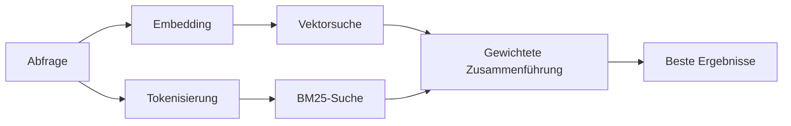

---
read_when:
    - Sie möchten verstehen, wie memory_search funktioniert
    - Sie möchten einen Embedding-Provider auswählen
    - Sie möchten die Suchqualität optimieren
summary: Wie die Speichersuche mithilfe von Embeddings und hybrider Suche relevante Notizen findet
title: Speichersuche
x-i18n:
    generated_at: "2026-07-24T04:31:21Z"
    model: gpt-5.6
    postprocess_version: locale-links-v1
    prompt_version: 32
    provider: openai
    source_hash: b2bd28b63ac55a2a890ed70a3015f76f1c7fbaa792b17a6ead51f4c8712fbd2d
    source_path: concepts/memory-search.md
    workflow: 16
---

`memory_search` findet relevante Notizen in Ihren Speicherdateien, selbst wenn die
Formulierung vom Originaltext abweicht. Es unterteilt den Speicher in kleine Abschnitte und
durchsucht sie mithilfe von Embeddings, Schlüsselwörtern oder beidem.

## Schnellstart

OpenClaw verwendet standardmäßig OpenAI-Embeddings. Um einen anderen Provider zu verwenden,
legen Sie ihn ausdrücklich fest:

```json5
{
  memory: {
    search: {
      provider: "openai", // or "gemini", "voyage", "mistral", "bedrock", "local", "ollama", "lmstudio", "github-copilot", "openai-compatible"
    },
  },
}
```

`provider` kann auch auf einen benutzerdefinierten `models.providers.<id>`-Eintrag verweisen (zum
Beispiel `ollama-5080`), sofern dieser Eintrag `api` auf `"ollama"` oder
eine andere Provider-ID mit einem Adapter für Speicher-Embeddings setzt.

Für lokale Embeddings ohne API-Schlüssel installieren Sie das offizielle llama.cpp-Provider-
Plugin und setzen `provider: "local"`:

```bash
openclaw plugins install @openclaw/llama-cpp-provider
```

Quellcode-Checkouts benötigen weiterhin eine Genehmigung für den nativen Build: `pnpm approve-builds`, anschließend
`pnpm rebuild node-llama-cpp`.

Einige OpenAI-kompatible Embedding-Endpunkte erfordern asymmetrische `input_type`-
Bezeichnungen, etwa `"query"` für Suchvorgänge und `"document"`/`"passage"` für indizierte
Abschnitte. Legen Sie diese mit `queryInputType` und `documentInputType` fest; siehe
[Referenz zur Speicherkonfiguration](/de/reference/memory-config#provider-specific-config).

## Unterstützte Provider

| Provider          | ID                  | API-Schlüssel erforderlich | Hinweise                             |
| ----------------- | ------------------- | -------------------------- | ------------------------------------ |
| Bedrock           | `bedrock`           | Nein                       | Verwendet die AWS-Anmeldedatenkette  |
| DeepInfra         | `deepinfra`         | Ja                         | Standardmodell `BAAI/bge-m3`          |
| Gemini            | `gemini`            | Ja                         | Unterstützt die Bild-/Audioindizierung |
| GitHub Copilot    | `github-copilot`    | Nein                       | Verwendet Ihr Copilot-Abonnement     |
| Lokal             | `local`             | Nein                       | GGUF-Modell, automatischer Download von ~0.6 GB |
| LM Studio         | `lmstudio`          | Nein                       | Lokaler/selbst gehosteter Server     |
| Mistral           | `mistral`           | Ja                         |                                      |
| Ollama            | `ollama`            | Nein                       | Lokaler/selbst gehosteter Server     |
| OpenAI            | `openai`            | Ja                         | Standard                             |
| OpenAI-kompatibel | `openai-compatible` | Normalerweise              | Generischer `/v1/embeddings`-Endpunkt |
| Voyage            | `voyage`            | Ja                         |                                      |

## Funktionsweise der Suche

OpenClaw führt zwei Abrufpfade parallel aus und führt die Ergebnisse zusammen:



- **Vektorsuche** findet ähnliche Bedeutungen („Gateway-Host“ entspricht „der
  Maschine, auf der OpenClaw ausgeführt wird“).
- **BM25-Schlüsselwortsuche** findet exakte Begriffe (IDs, Fehlermeldungen, Konfigurations-
  schlüssel).
- **Dateinamensuche** indiziert Pfade getrennt vom Inhalt der Notizen. Exakte vollständige
  Pfade, Basisdateinamen und Dateinamenstämme werden höher eingestuft als teilweise Pfadübereinstimmungen,
  während die Bewertungen von Ausschnitten und Schlüsselwörtern im Inhalt weiterhin aus dem Notizinhalt stammen.

Wenn nur ein Pfad verfügbar ist, wird dieser allein ausgeführt.

**Nur-FTS-Modus.** Setzen Sie `provider: "none"`, um Embeddings absichtlich zu deaktivieren
und ausschließlich mit Schlüsselwörtern zu suchen. Wenn `provider` nicht gesetzt oder auf `"auto"`
gesetzt ist, wird ohne konfigurierte Embedding-Authentifizierung ebenfalls ohne
Fehler auf eine reine Schlüsselwortbewertung zurückgegriffen. Dasselbe gilt für `provider: "local"` (den GGUF/llama.cpp-
Provider), wenn dieser fehlschlägt.

**Expliziter Provider nicht verfügbar.** Wenn Sie ausdrücklich einen anderen Provider angeben
(zum Beispiel `openai`, `ollama`, `gemini`) und dieser zum
Zeitpunkt der Anfrage nicht verfügbar ist (fehlerhafte Authentifizierung, Netzwerkfehler), meldet `memory_search` den Speicher als
nicht verfügbar, statt stillschweigend auf reine FTS-Ergebnisse zurückzufallen. Dadurch bleibt ein
fehlerhaft konfigurierter Provider sichtbar. Setzen Sie `provider: "none"` für einen beabsichtigten
reinen FTS-Abruf oder korrigieren Sie die Provider-/Authentifizierungskonfiguration, um die semantische
Bewertung wiederherzustellen.

## Verbesserung der Suchqualität

Zwei optionale Funktionen helfen bei einem umfangreichen Notizverlauf.

### Zeitlicher Verfall

Alte Notizen verlieren allmählich an Bewertungsgewicht, sodass aktuelle Informationen zuerst erscheinen.
Bei der standardmäßigen Halbwertszeit von 30 Tagen erhält eine Notiz vom letzten Monat 50 % ihres
ursprünglichen Gewichts. `MEMORY.md` und andere undatierte Dateien unter `memory/` sind
dauerhaft relevant und unterliegen keinem Verfall; nur datierte `memory/YYYY-MM-DD.md`-Dateien verfallen.

<Tip>
Aktivieren Sie dies, wenn Ihr Agent über monatelange tägliche Notizen verfügt und veraltete Informationen
regelmäßig höher als aktueller Kontext eingestuft werden.
</Tip>

### MMR (Diversität)

Reduziert redundante Ergebnisse. Wenn fünf Notizen dieselbe Router-Konfiguration erwähnen,
stellt MMR sicher, dass die besten Ergebnisse unterschiedliche Themen abdecken, statt sich zu wiederholen.

<Tip>
Aktivieren Sie dies, wenn `memory_search` wiederholt nahezu identische Ausschnitte aus
verschiedenen täglichen Notizen zurückgibt.
</Tip>

### Beide aktivieren

```json5
{
  memory: {
    search: {
      query: {
        hybrid: {
          mmr: { enabled: true },
          temporalDecay: { enabled: true },
        },
      },
    },
  },
}
```

## Multimodaler Speicher

Mit `gemini-embedding-2-preview` können Sie Bilder und Audio zusammen mit
Markdown indizieren. Dies gilt nur für Dateien unter `memory.search.extraPaths`; die standardmäßigen
Speicherstammverzeichnisse (`MEMORY.md`, `memory/*.md`) unterstützen weiterhin ausschließlich Markdown. Suchanfragen
bleiben textbasiert, werden jedoch mit visuellen und akustischen Inhalten abgeglichen. Informationen zur Einrichtung finden Sie in der
[Referenz zur Speicherkonfiguration](/de/reference/memory-config#multimodal-memory-gemini).

## Speichersuche in Sitzungen

Für einen exakten Volltextabruf aus Sitzungstranskripten verwenden Sie [`sessions_search`](/de/concepts/session-search)
und öffnen anschließend ein Ergebnis mit `sessions_history`. Die Sitzungsspeichersuche bleibt die semantische,
experimentelle Ergänzung.

Optional können Sie Sitzungstranskripte indizieren, damit `memory_search` frühere
Unterhaltungen abrufen kann. Dies erfordert eine ausdrückliche Aktivierung: Setzen Sie `experimental.sessionMemory: true` und fügen Sie
`"sessions"` zu `sources` hinzu (der Standardwert `sources` ist `["memory"]`).

Sitzungstreffer unterliegen `tools.sessions.visibility`: Der Standardwert `"tree"` macht die
aktuelle Sitzung, von ihr gestartete Sitzungen und Sitzungen von Gruppen desselben Agenten zugänglich, die
über die umgebungsbezogene Gruppenwahrnehmung beobachtet werden. Bei `session.dmScope: "main"` verwendet eine Mehrbenutzer-
DM-Konfiguration diese Hauptsitzung gemeinsam, sodass dorthin weitergeleitete Benutzer Inhalte
aus den beobachteten Gruppen abrufen können. Verwenden Sie für die DM-Isolation einen Peer-spezifischen `dmScope` oder setzen Sie
die Sichtbarkeit auf `"self"`, um das Lesen umgebungsbezogen beobachteter Sitzungen zu deaktivieren. Andere
nicht zugehörige Sitzungen desselben Agenten erfordern weiterhin die Sichtbarkeit `"agent"`.

Wenn Sie das QMD-Backend verwenden, setzen Sie außerdem `memory.qmd.sessions.enabled: true`, damit
Transkripte in die QMD-Sammlung exportiert werden; `experimental.sessionMemory`
und `sources` allein exportieren keine Transkripte nach QMD. Siehe
[Konfigurationsreferenz](/de/reference/memory-config#session-memory-search-experimental).

## Fehlerbehebung

**Keine Ergebnisse?** Führen Sie `openclaw memory status` aus, um den Index zu prüfen. Wenn er leer ist, führen Sie
`openclaw memory index --force` aus.

**Nur Schlüsselworttreffer?** Ihr Embedding-Provider ist möglicherweise nicht konfiguriert. Prüfen Sie
`openclaw memory status --deep`.

**Zeitüberschreitung bei lokalen Embeddings?** `ollama`, `lmstudio` und `local` verwenden längere
vom Provider festgelegte Zeitlimits für Batches. Prüfen Sie den Zustand des Providers und führen Sie
`openclaw memory index --force` erneut aus.

**CJK-Text nicht gefunden?** Erstellen Sie den FTS-Index neu mit
`openclaw memory index --force`.

## Verwandte Themen

- [Speicherübersicht](/de/concepts/memory)
- [Active Memory](/de/concepts/active-memory)
- [Integrierte Speicher-Engine](/de/concepts/memory-builtin)
- [Referenz zur Speicherkonfiguration](/de/reference/memory-config)
