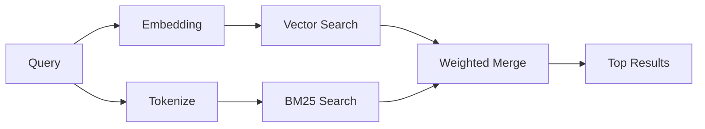

---
read_when:
    - Sie möchten verstehen, wie `memory_search` funktioniert.
    - Sie möchten einen Embedding-Anbieter auswählen.
    - Sie möchten die Suchqualität optimieren.
summary: Wie die Speichersuche relevante Notizen mithilfe von Embeddings und hybrider Suche findet
title: Speichersuche
x-i18n:
    generated_at: "2026-04-26T11:27:00Z"
    model: gpt-5.4
    provider: openai
    source_hash: 95d86fb3efe79aae92f5e3590f1c15fb0d8f3bb3301f8fe9a41f891e290d7a14
    source_path: concepts/memory-search.md
    workflow: 15
---

`memory_search` findet relevante Notizen in Ihren Speicherdateien, auch wenn die
Formulierung vom ursprünglichen Text abweicht. Es funktioniert, indem der Speicher in kleine
Chunks indexiert und diese mithilfe von Embeddings, Schlüsselwörtern oder beidem durchsucht werden.

## Schnellstart

Wenn Sie ein GitHub-Copilot-Abonnement oder einen konfigurierten API-Schlüssel für OpenAI, Gemini, Voyage oder Mistral haben,
funktioniert die Speichersuche automatisch. Um einen Anbieter
explizit festzulegen:

```json5
{
  agents: {
    defaults: {
      memorySearch: {
        provider: "openai", // oder "gemini", "local", "ollama" usw.
      },
    },
  },
}
```

Für lokale Embeddings ohne API-Schlüssel installieren Sie das optionale Runtime-Paket `node-llama-cpp`
neben OpenClaw und verwenden `provider: "local"`.

## Unterstützte Anbieter

| Anbieter       | ID               | Benötigt API-Schlüssel | Hinweise                                             |
| -------------- | ---------------- | ---------------------- | ---------------------------------------------------- |
| Bedrock        | `bedrock`        | Nein                   | Automatisch erkannt, wenn die AWS-Credential-Chain aufgelöst wird |
| Gemini         | `gemini`         | Ja                     | Unterstützt Bild-/Audio-Indexierung                  |
| GitHub Copilot | `github-copilot` | Nein                   | Automatisch erkannt, verwendet GitHub-Copilot-Abonnement |
| Local          | `local`          | Nein                   | GGUF-Modell, Download ca. 0,6 GB                     |
| Mistral        | `mistral`        | Ja                     | Automatisch erkannt                                  |
| Ollama         | `ollama`         | Nein                   | Lokal, muss explizit festgelegt werden               |
| OpenAI         | `openai`         | Ja                     | Automatisch erkannt, schnell                         |
| Voyage         | `voyage`         | Ja                     | Automatisch erkannt                                  |

## So funktioniert die Suche

OpenClaw führt zwei Retrieval-Pfade parallel aus und führt die Ergebnisse zusammen:



- **Vektorsuche** findet Notizen mit ähnlicher Bedeutung („Gateway-Host“ passt
  zu „die Maschine, auf der OpenClaw läuft“).
- **BM25-Schlüsselwortsuche** findet exakte Treffer (IDs, Fehlerzeichenfolgen, Konfigurations-
  schlüssel).

Wenn nur ein Pfad verfügbar ist (keine Embeddings oder kein FTS), läuft der andere allein.

Wenn keine Embeddings verfügbar sind, verwendet OpenClaw weiterhin lexikalisches Ranking über FTS-Ergebnisse, statt nur auf rohe Reihenfolge nach exakter Übereinstimmung zurückzufallen. Dieser degradierte Modus priorisiert Chunks mit stärkerer Abdeckung der Abfragebegriffe und relevanten Dateipfaden, was die Recall-Qualität auch ohne `sqlite-vec` oder einen Embedding-Anbieter nützlich hält.

## Suchqualität verbessern

Zwei optionale Funktionen helfen bei einem großen Notizverlauf:

### Zeitlicher Verfall

Alte Notizen verlieren schrittweise an Ranking-Gewicht, sodass neuere Informationen zuerst erscheinen.
Mit der Standard-Halbwertszeit von 30 Tagen erreicht eine Notiz vom letzten Monat 50 % ihres
ursprünglichen Gewichts. Dauerhafte Dateien wie `MEMORY.md` unterliegen nie dem Verfall.

<Tip>
Aktivieren Sie zeitlichen Verfall, wenn Ihr Agent monatelange tägliche Notizen hat und veraltete
Informationen weiterhin vor aktuellem Kontext erscheinen.
</Tip>

### MMR (Diversität)

Reduziert redundante Ergebnisse. Wenn fünf Notizen alle dieselbe Router-Konfiguration erwähnen, sorgt MMR
dafür, dass die Top-Ergebnisse unterschiedliche Themen abdecken, statt sich zu wiederholen.

<Tip>
Aktivieren Sie MMR, wenn `memory_search` weiterhin nahezu doppelte Ausschnitte aus
verschiedenen täglichen Notizen zurückgibt.
</Tip>

### Beides aktivieren

```json5
{
  agents: {
    defaults: {
      memorySearch: {
        query: {
          hybrid: {
            mmr: { enabled: true },
            temporalDecay: { enabled: true },
          },
        },
      },
    },
  },
}
```

## Multimodaler Speicher

Mit Gemini Embedding 2 können Sie Bilder und Audiodateien zusammen mit
Markdown indexieren. Suchanfragen bleiben Text, gleichen aber mit visuellen und Audioinhalten ab. Siehe die [Konfigurationsreferenz für Speicher](/de/reference/memory-config) für
die Einrichtung.

## Sitzungsspeichersuche

Sie können optional Sitzungsprotokolle indexieren, damit `memory_search` sich an
frühere Unterhaltungen erinnern kann. Dies erfolgt per Opt-in über
`memorySearch.experimental.sessionMemory`. Siehe die
[Konfigurationsreferenz](/de/reference/memory-config) für Details.

## Fehlerbehebung

**Keine Ergebnisse?** Führen Sie `openclaw memory status` aus, um den Index zu prüfen. Wenn er leer ist, führen
Sie `openclaw memory index --force` aus.

**Nur Schlüsselworttreffer?** Ihr Embedding-Anbieter ist möglicherweise nicht konfiguriert. Prüfen
Sie `openclaw memory status --deep`.

**Timeouts bei lokalen Embeddings?** `ollama`, `lmstudio` und `local` verwenden standardmäßig einen längeren
Inline-Batch-Timeout. Wenn der Host einfach langsam ist, setzen Sie
`agents.defaults.memorySearch.sync.embeddingBatchTimeoutSeconds` und führen Sie
`openclaw memory index --force` erneut aus.

**CJK-Text wird nicht gefunden?** Erstellen Sie den FTS-Index neu mit
`openclaw memory index --force`.

## Weiterführende Informationen

- [Active Memory](/de/concepts/active-memory) -- Speicher für Unteragenten für interaktive Chat-Sitzungen
- [Memory](/de/concepts/memory) -- Dateilayout, Backends, Tools
- [Konfigurationsreferenz für Speicher](/de/reference/memory-config) -- alle Konfigurationsoptionen

## Verwandt

- [Memory-Überblick](/de/concepts/memory)
- [Active Memory](/de/concepts/active-memory)
- [Integrierte Memory-Engine](/de/concepts/memory-builtin)
