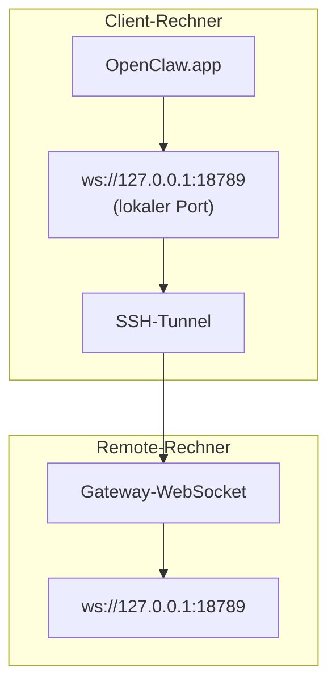

<Note>
Dieser Inhalt befindet sich jetzt unter [Remote-Zugriff](/de/gateway/remote#macos-persistent-ssh-tunnel-via-launchagent). Verwenden Sie diese Seite für die aktuelle Anleitung; diese Seite bleibt als Weiterleitungsziel bestehen.
</Note>

# OpenClaw.app mit einem Remote-Gateway ausführen

OpenClaw.app erreicht einen Remote-Gateway über einen SSH-Tunnel: Ein SSH-`LocalForward` bildet einen lokalen Port auf den Gateway-WebSocket-Port des Remote-Hosts ab.

## Einrichtung

1. Fügen Sie einen SSH-Konfigurationseintrag mit `LocalForward 18789 127.0.0.1:18789` hinzu (den vollständigen Konfigurationsblock finden Sie unter [Remote-Zugriff](/de/gateway/remote#macos-persistent-ssh-tunnel-via-launchagent)).
2. Kopieren Sie Ihren SSH-Schlüssel mit `ssh-copy-id` auf den Remote-Host.
3. Legen Sie `gateway.remote.token` (oder `gateway.remote.password`) über `openclaw config set gateway.remote.token "<your-token>"` fest.
4. Starten Sie den Tunnel: `ssh -N remote-gateway &`.
5. Beenden und öffnen Sie OpenClaw.app erneut.

Für einen Tunnel, der Neustarts übersteht und Verbindungen automatisch wiederherstellt, verwenden Sie anstelle eines manuellen `ssh -N` die LaunchAgent-Einrichtung auf der Seite [Remote-Zugriff](/de/gateway/remote#macos-persistent-ssh-tunnel-via-launchagent).

## Funktionsweise

| Komponente                            | Funktion                                                      |
| ------------------------------------- | ------------------------------------------------------------- |
| `LocalForward 18789 127.0.0.1:18789` | Leitet den lokalen Port 18789 an den Remote-Port 18789 weiter |
| `ssh -N`                             | SSH ohne Ausführung von Remote-Befehlen (nur Portweiterleitung) |
| `KeepAlive`                          | Startet den Tunnel nach einem Absturz automatisch neu (LaunchAgent) |
| `RunAtLoad`                          | Startet den Tunnel beim Laden des LaunchAgent (LaunchAgent)    |

OpenClaw.app stellt auf dem Client eine Verbindung zu `ws://127.0.0.1:18789` her. Der Tunnel leitet diese Verbindung an Port 18789 auf dem Remote-Host weiter, auf dem der Gateway ausgeführt wird.

## Verwandte Themen

- [Remote-Zugriff](/de/gateway/remote)
- [Tailscale](/de/gateway/tailscale)
