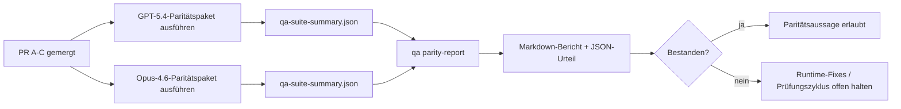

---
read_when:
    - Prüfung der PR-Serie zur GPT-5.4-/Codex-Parität
    - Wartung der agentischen Architektur mit sechs Contracts hinter dem Paritätsprogramm
summary: So prüfen Sie das GPT-5.4-/Codex-Paritätsprogramm als vier Merge-Einheiten
title: Maintainer-Hinweise zur GPT-5.4-/Codex-Parität
x-i18n:
    generated_at: "2026-04-22T04:22:39Z"
    model: gpt-5.4
    provider: openai
    source_hash: b872d6a33b269c01b44537bfa8646329063298fdfcd3671a17d0eadbc9da5427
    source_path: help/gpt54-codex-agentic-parity-maintainers.md
    workflow: 15
---

# Maintainer-Hinweise zur GPT-5.4-/Codex-Parität

Dieser Hinweis erklärt, wie das GPT-5.4-/Codex-Paritätsprogramm als vier Merge-Einheiten geprüft werden kann, ohne die ursprüngliche agentische Architektur mit sechs Contracts zu verlieren.

## Merge-Einheiten

### PR A: strikt-agentische Ausführung

Verantwortet:

- `executionContract`
- GPT-5-first-Follow-through im selben Zug
- `update_plan` als nicht-terminales Fortschrittstracking
- explizite Blocked-States statt stiller Stopps nur mit Plan

Verantwortet nicht:

- Klassifizierung von Auth-/Runtime-Fehlern
- Wahrhaftigkeit bei Berechtigungen
- Neugestaltung von Replay/Fortsetzung
- Paritäts-Benchmarking

### PR B: Wahrhaftigkeit der Runtime

Verantwortet:

- Korrektheit der Codex-OAuth-Scopes
- typisierte Klassifizierung von Provider-/Runtime-Fehlern
- wahrheitsgemäße Verfügbarkeit von `/elevated full` und Blocked-Gründe

Verantwortet nicht:

- Normalisierung von Tool-Schemas
- Replay-/Liveness-State
- Benchmark-Gating

### PR C: Korrektheit der Ausführung

Verantwortet:

- Provider-eigene OpenAI-/Codex-Tool-Kompatibilität
- parameterfreie strikte Schema-Behandlung
- Sichtbarmachung von Replay-Invalid
- Sichtbarkeit von `paused`, `blocked` und `abandoned` bei Long-Task-Status

Verantwortet nicht:

- selbstgewählte Fortsetzung
- generisches Codex-Dialektverhalten außerhalb von Provider-Hooks
- Benchmark-Gating

### PR D: Paritäts-Harness

Verantwortet:

- First-Wave-Szenariopaket für GPT-5.4 vs Opus 4.6
- Paritätsdokumentation
- Paritätsbericht und Mechanik des Release-Gates

Verantwortet nicht:

- Änderungen am Runtime-Verhalten außerhalb von QA-lab
- Auth-/Proxy-/DNS-Simulation innerhalb des Harness

## Rückabbildung auf die ursprünglichen sechs Contracts

| Ursprünglicher Contract                  | Merge-Einheit |
| ---------------------------------------- | ------------- |
| Korrektheit von Provider-Transport/Auth  | PR B          |
| Kompatibilität von Tool-Contract/Schema  | PR C          |
| Ausführung im selben Zug                 | PR A          |
| Wahrhaftigkeit bei Berechtigungen        | PR B          |
| Korrektheit von Replay/Fortsetzung/Liveness | PR C       |
| Benchmark-/Release-Gate                  | PR D          |

## Prüfungsreihenfolge

1. PR A
2. PR B
3. PR C
4. PR D

PR D ist die Proof-Schicht. Sie sollte nicht der Grund sein, warum PRs zur Runtime-Korrektheit verzögert werden.

## Worauf zu achten ist

### PR A

- GPT-5-Läufe handeln oder schlagen geschlossen fehl, statt bei Commentary zu stoppen
- `update_plan` wirkt nicht mehr für sich allein wie Fortschritt
- Verhalten bleibt auf GPT-5-first und Embedded-Pi begrenzt

### PR B

- Auth-/Proxy-/Runtime-Fehler kollabieren nicht mehr in generische Behandlung vom Typ „Modell fehlgeschlagen“
- `/elevated full` wird nur dann als verfügbar beschrieben, wenn es tatsächlich verfügbar ist
- Blocked-Gründe sind sowohl für das Modell als auch für die benutzerseitige Runtime sichtbar

### PR C

- strikte OpenAI-/Codex-Tool-Registrierung verhält sich vorhersehbar
- parameterfreie Tools scheitern nicht an strikten Schema-Prüfungen
- Replay- und Compaction-Ergebnisse bewahren einen wahrheitsgemäßen Liveness-State

### PR D

- das Szenariopaket ist verständlich und reproduzierbar
- das Paket enthält eine mutierende Replay-Safety-Lane, nicht nur Read-only-Flows
- Berichte sind für Menschen und Automatisierung lesbar
- Paritätsaussagen sind evidenzbasiert, nicht anekdotisch

Erwartete Artefakte aus PR D:

- `qa-suite-report.md` / `qa-suite-summary.json` für jeden Modelllauf
- `qa-agentic-parity-report.md` mit Vergleich auf Aggregat- und Szenarioebene
- `qa-agentic-parity-summary.json` mit maschinenlesbarem Urteil

## Release-Gate

Behaupten Sie keine GPT-5.4-Parität oder Überlegenheit gegenüber Opus 4.6, bevor nicht:

- PR A, PR B und PR C gemergt sind
- PR D das First-Wave-Paritätspaket sauber ausführt
- Regressions-Suites für Runtime-Wahrhaftigkeit grün bleiben
- der Paritätsbericht keine Fake-Success-Fälle und keine Regression im Stoppverhalten zeigt

Das Paritäts-Harness ist nicht die einzige Evidenzquelle. Halten Sie diese Trennung bei der Prüfung ausdrücklich fest:

- PR D verantwortet den szenariobasierten Vergleich GPT-5.4 vs Opus 4.6
- die deterministischen Suites aus PR B verantworten weiterhin die Evidenz für Auth/Proxy/DNS und Wahrhaftigkeit bei vollem Zugriff

## Zuordnung Ziel zu Evidenz

| Element des Completion-Gates              | Hauptverantwortlicher | Prüfungsartefakt                                                    |
| ----------------------------------------- | --------------------- | ------------------------------------------------------------------- |
| Keine Stopps nur mit Plan                 | PR A                  | strikt-agentische Runtime-Tests und `approval-turn-tool-followthrough` |
| Kein Fake-Fortschritt und kein Fake-Tool-Abschluss | PR A + PR D   | Anzahl der Fake-Success-Fälle bei Parität plus Berichtdetails auf Szenarioebene |
| Keine falsche `/elevated full`-Anleitung  | PR B                  | deterministische Suites zur Runtime-Wahrhaftigkeit                  |
| Replay-/Liveness-Fehler bleiben explizit  | PR C + PR D           | Lifecycle-/Replay-Suites plus `compaction-retry-mutating-tool`      |
| GPT-5.4 entspricht Opus 4.6 oder übertrifft es | PR D             | `qa-agentic-parity-report.md` und `qa-agentic-parity-summary.json`  |

## Kurzform für Reviewer: vorher vs. nachher

| Vorher sichtbares Benutzerproblem                            | Prüfungssignal nachher                                                                     |
| ------------------------------------------------------------ | ------------------------------------------------------------------------------------------ |
| GPT-5.4 stoppte nach der Planung                             | PR A zeigt Act-or-Block-Verhalten statt Abschluss nur mit Commentary                      |
| Tool-Nutzung wirkte bei strikten OpenAI-/Codex-Schemas fragil | PR C hält Tool-Registrierung und parameterfreie Aufrufe vorhersehbar                      |
| Hinweise zu `/elevated full` waren manchmal irreführend      | PR B koppelt Hinweise an tatsächliche Runtime-Fähigkeit und Blocked-Gründe                |
| Long-Tasks konnten in Replay-/Compaction-Mehrdeutigkeit verschwinden | PR C emittiert expliziten `paused`-, `blocked`-, `abandoned`- und `replay-invalid`-State |
| Paritätsaussagen waren anekdotisch                           | PR D erzeugt einen Bericht plus JSON-Urteil mit derselben Szenarioabdeckung für beide Modelle |
