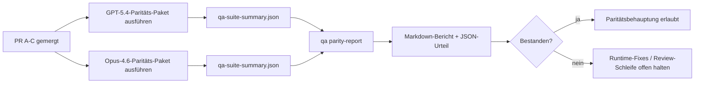

---
read_when:
    - Überprüfung der PR-Serie zur GPT-5.4-/Codex-Parität
    - Pflege der agentischen Sechs-Vertrags-Architektur hinter dem Paritätsprogramm
summary: So überprüfen Sie das GPT-5.4-/Codex-Paritätsprogramm als vier Merge-Einheiten
title: Maintainer-Hinweise zur GPT-5.4-/Codex-Parität
x-i18n:
    generated_at: "2026-04-25T13:48:46Z"
    model: gpt-5.4
    provider: openai
    source_hash: 162ea68476880d4dbf9b8c3b9397a51a2732c3eb10ac52e421a9c9d90e04eec2
    source_path: help/gpt54-codex-agentic-parity-maintainers.md
    workflow: 15
---

Diese Notiz erklärt, wie das GPT-5.4-/Codex-Paritätsprogramm als vier Merge-Einheiten geprüft werden kann, ohne die ursprüngliche agentische Sechs-Vertrags-Architektur aus dem Blick zu verlieren.

## Merge-Einheiten

### PR A: strikte agentische Ausführung

Verantwortet:

- `executionContract`
- GPT-5-first-Follow-through im selben Zug
- `update_plan` als nicht terminales Fortschrittstracking
- explizite Blocked-States statt stiller Stopps nur mit Plan

Verantwortet nicht:

- Klassifizierung von Auth-/Runtime-Fehlern
- Wahrhaftigkeit bei Berechtigungen
- Neugestaltung von Replay/Fortsetzung
- Paritäts-Benchmarking

### PR B: Wahrhaftigkeit der Runtime

Verantwortet:

- Korrektheit des Codex-OAuth-Scopes
- typisierte Klassifizierung von Provider-/Runtime-Fehlern
- wahrheitsgetreue Verfügbarkeit und Blocked-Gründe für `/elevated full`

Verantwortet nicht:

- Normalisierung des Tool-Schemas
- Replay-/Liveness-State
- Benchmark-Gating

### PR C: Korrektheit der Ausführung

Verantwortet:

- providerverwaltete OpenAI-/Codex-Tool-Kompatibilität
- strikte Behandlung von Schemas ohne Parameter
- Sichtbarmachung von replay-invalid
- Sichtbarkeit von pausierten, blockierten und aufgegebenen Long-Task-States

Verantwortet nicht:

- selbstgewählte Fortsetzung
- generisches Codex-Dialektverhalten außerhalb von Provider-Hooks
- Benchmark-Gating

### PR D: Parity Harness

Verantwortet:

- erstes Szenario-Paket GPT-5.4 vs. Opus 4.6
- Paritätsdokumentation
- Paritätsbericht und Release-Gate-Mechanik

Verantwortet nicht:

- Änderungen am Runtime-Verhalten außerhalb von qa-lab
- Simulation von Auth/Proxy/DNS innerhalb der Harness

## Rückzuordnung zu den ursprünglichen sechs Verträgen

| Ursprünglicher Vertrag                   | Merge-Einheit |
| ---------------------------------------- | ------------- |
| Korrektheit von Provider-Transport/Auth  | PR B          |
| Tool-Vertrag/Schemakompatibilität        | PR C          |
| Ausführung im selben Zug                 | PR A          |
| Wahrhaftigkeit bei Berechtigungen        | PR B          |
| Korrektheit von Replay/Fortsetzung/Liveness | PR C       |
| Benchmark/Release-Gate                   | PR D          |

## Reihenfolge der Prüfung

1. PR A
2. PR B
3. PR C
4. PR D

PR D ist die Nachweisschicht. Sie sollte nicht der Grund sein, warum PRs zur Runtime-Korrektheit verzögert werden.

## Worauf zu achten ist

### PR A

- GPT-5-Läufe handeln oder schlagen fail-closed fehl, statt bei Kommentaren stehenzubleiben
- `update_plan` wirkt nicht mehr für sich allein wie Fortschritt
- das Verhalten bleibt GPT-5-first und auf eingebettetes Pi begrenzt

### PR B

- Fehler bei Auth/Proxy/Runtime kollabieren nicht mehr in generische Behandlung vom Typ „model failed“
- `/elevated full` wird nur dann als verfügbar beschrieben, wenn es tatsächlich verfügbar ist
- Blocked-Gründe sind sowohl für das Modell als auch für die benutzerseitige Runtime sichtbar

### PR C

- strikte OpenAI-/Codex-Tool-Registrierung verhält sich vorhersehbar
- parameterfreie Tools scheitern nicht an strikten Schema-Prüfungen
- Replay- und Compaction-Ergebnisse bewahren einen wahrheitsgetreuen Liveness-State

### PR D

- das Szenario-Paket ist verständlich und reproduzierbar
- das Paket enthält eine mutierende Replay-Safety-Lane, nicht nur read-only Flows
- Berichte sind für Menschen und Automatisierung lesbar
- Paritätsbehauptungen sind evidenzgestützt, nicht anekdotisch

Erwartete Artefakte aus PR D:

- `qa-suite-report.md` / `qa-suite-summary.json` für jeden Modelllauf
- `qa-agentic-parity-report.md` mit aggregiertem und szenariobezogenem Vergleich
- `qa-agentic-parity-summary.json` mit einem maschinenlesbaren Urteil

## Release-Gate

Behaupten Sie keine GPT-5.4-Parität oder -Überlegenheit gegenüber Opus 4.6, bevor nicht:

- PR A, PR B und PR C gemergt sind
- PR D das erste Paritäts-Paket sauber ausführt
- Regression-Suites zur Runtime-Wahrhaftigkeit grün bleiben
- der Paritätsbericht keine Fake-Success-Fälle und keine Regression im Stoppverhalten zeigt

Die Parity Harness ist nicht die einzige Evidenzquelle. Halten Sie diese Trennung in der Prüfung explizit:

- PR D verantwortet den szenariobasierten Vergleich GPT-5.4 vs. Opus 4.6
- die deterministischen Suites aus PR B verantworten weiterhin die Evidenz für Auth/Proxy/DNS und Wahrhaftigkeit bei vollem Zugriff

## Schneller Maintainer-Merge-Workflow

Verwenden Sie dies, wenn Sie bereit sind, eine Paritäts-PR zu landen, und eine wiederholbare, risikoarme Abfolge wollen.

1. Vor dem Merge prüfen, ob die Evidenzschwelle erfüllt ist:
   - reproduzierbares Symptom oder fehlschlagender Test
   - verifizierte Root Cause im betroffenen Code
   - Fix im betroffenen Pfad
   - Regressionstest oder explizite Notiz zur manuellen Verifizierung
2. Vor dem Merge triagieren/labeln:
   - alle `r:*`-Auto-Close-Labels anwenden, wenn die PR nicht landen soll
   - Merge-Kandidaten frei von ungelösten Blocker-Threads halten
3. Lokal auf der betroffenen Oberfläche validieren:
   - `pnpm check:changed`
   - `pnpm test:changed`, wenn Tests geändert wurden oder das Vertrauen in den Bugfix von Testabdeckung abhängt
4. Mit dem Standard-Maintainer-Flow landen (Prozess `/landpr`), dann verifizieren:
   - Verhalten beim automatischen Schließen verlinkter Issues
   - CI- und Post-Merge-Status auf `main`
5. Nach dem Landing nach Duplikaten unter verwandten offenen PRs/Issues suchen und nur mit einem kanonischen Verweis schließen.

Wenn auch nur eines der Kriterien der Evidenzschwelle fehlt, fordern Sie Änderungen an, statt zu mergen.

## Zuordnung von Ziel zu Evidenz

| Element des Abschluss-Gates              | Primärer Owner | Review-Artefakt                                                    |
| ---------------------------------------- | -------------- | ------------------------------------------------------------------ |
| Keine Stopps nur mit Plan                | PR A           | strict-agentic-Runtime-Tests und `approval-turn-tool-followthrough` |
| Kein Fake-Fortschritt oder Fake-Tool-Abschluss | PR A + PR D | Anzahl der Fake-Success-Fälle in der Parität plus Details im Szenariobericht |
| Keine falschen Hinweise zu `/elevated full` | PR B        | deterministische Suites zur Runtime-Wahrhaftigkeit                 |
| Replay-/Liveness-Fehler bleiben explizit | PR C + PR D   | Lifecycle-/Replay-Suites plus `compaction-retry-mutating-tool`     |
| GPT-5.4 entspricht Opus 4.6 oder übertrifft es | PR D     | `qa-agentic-parity-report.md` und `qa-agentic-parity-summary.json` |

## Kurzform für Reviewer: vorher vs. nachher

| Benutzerseitiges Problem vorher                              | Review-Signal nachher                                                                   |
| ------------------------------------------------------------ | --------------------------------------------------------------------------------------- |
| GPT-5.4 stoppte nach der Planung                             | PR A zeigt Act-or-Block-Verhalten statt Abschluss nur mit Kommentar                    |
| Tool-Nutzung wirkte mit strikten OpenAI-/Codex-Schemas fragil | PR C hält Tool-Registrierung und parameterfreie Aufrufe vorhersehbar                  |
| Hinweise zu `/elevated full` waren manchmal irreführend      | PR B koppelt Hinweise an tatsächliche Runtime-Fähigkeiten und Blocked-Gründe           |
| Long Tasks konnten in Replay-/Compaction-Mehrdeutigkeit verschwinden | PR C gibt explizite States für pausiert, blockiert, aufgegeben und replay-invalid aus |
| Paritätsbehauptungen waren anekdotisch                       | PR D erzeugt einen Bericht plus JSON-Urteil mit derselben Szenarioabdeckung für beide Modelle |

## Verwandt

- [GPT-5.4 / Codex agentic parity](/de/help/gpt54-codex-agentic-parity)
