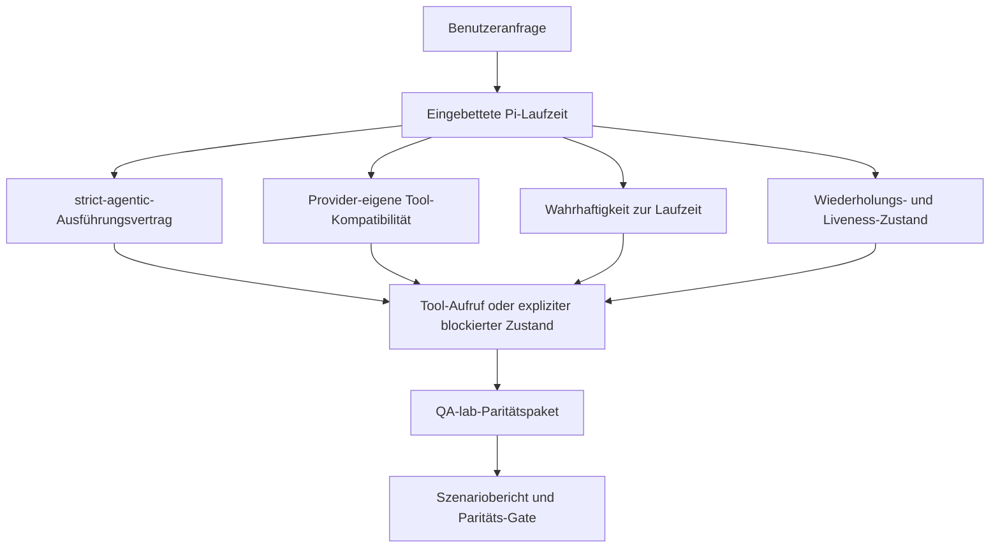
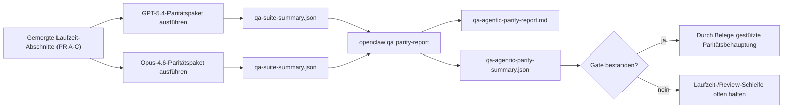

---
read_when:
    - Debuggen des Agent-Verhaltens von GPT-5.4 oder Codex
    - Vergleich des agentischen Verhaltens von OpenClaw über Frontier-Modelle hinweg
    - Prüfen der Korrekturen für strict-agentic, Tool-Schema, Rechteerhöhung und Wiederholung
summary: Wie OpenClaw Lücken in der agentischen Ausführung für GPT-5.4- und Codex-ähnliche Modelle schließt
title: GPT-5.4 / Codex agentische Parität
x-i18n:
    generated_at: "2026-04-22T04:22:42Z"
    model: gpt-5.4
    provider: openai
    source_hash: 77bc9b8fab289bd35185fa246113503b3f5c94a22bd44739be07d39ae6779056
    source_path: help/gpt54-codex-agentic-parity.md
    workflow: 15
---

# GPT-5.4 / Codex agentische Parität in OpenClaw

OpenClaw funktionierte bereits gut mit Tool-nutzenden Frontier-Modellen, aber GPT-5.4- und Codex-ähnliche Modelle lieferten in einigen praktischen Punkten noch zu schwache Ergebnisse:

- sie konnten nach der Planung aufhören, statt die Arbeit auszuführen
- sie konnten strikte OpenAI-/Codex-Tool-Schemata falsch verwenden
- sie konnten nach `/elevated full` fragen, selbst wenn voller Zugriff unmöglich war
- sie konnten den Status lang laufender Aufgaben während Wiederholung oder Compaction verlieren
- Paritätsbehauptungen gegenüber Claude Opus 4.6 basierten auf Anekdoten statt auf wiederholbaren Szenarien

Dieses Paritätsprogramm schließt diese Lücken in vier überprüfbaren Abschnitten.

## Was sich geändert hat

### PR A: strict-agentic-Ausführung

Dieser Abschnitt fügt einen optionalen `strict-agentic`-Ausführungsvertrag für eingebettete Pi GPT-5-Läufe hinzu.

Wenn aktiviert, akzeptiert OpenClaw reine Planungs-Turns nicht mehr als „gut genug“ abgeschlossenen Zustand. Wenn das Modell nur sagt, was es tun will, aber tatsächlich keine Tools verwendet oder keinen Fortschritt macht, versucht OpenClaw es mit einer „jetzt handeln“-Steuerung erneut und schlägt dann kontrolliert mit einem expliziten blockierten Zustand fehl, statt die Aufgabe stillschweigend zu beenden.

Das verbessert die GPT-5.4-Erfahrung besonders bei:

- kurzen „ok mach es“-Folgenachrichten
- Code-Aufgaben, bei denen der erste Schritt offensichtlich ist
- Abläufen, bei denen `update_plan` Fortschrittsverfolgung statt Fülltext sein sollte

### PR B: Wahrhaftigkeit zur Laufzeit

Dieser Abschnitt sorgt dafür, dass OpenClaw bei zwei Dingen die Wahrheit sagt:

- warum der Provider-/Laufzeitaufruf fehlgeschlagen ist
- ob `/elevated full` tatsächlich verfügbar ist

Das bedeutet, dass GPT-5.4 bessere Laufzeitsignale für fehlenden Scope, Fehler bei der Auth-Aktualisierung, HTML-403-Authentifizierungsfehler, Proxy-Probleme, DNS- oder Timeout-Fehler und blockierte Full-Access-Modi erhält. Das Modell halluziniert dadurch seltener die falsche Abhilfe oder fordert weiterhin einen Berechtigungsmodus an, den die Laufzeit nicht bereitstellen kann.

### PR C: Korrektheit der Ausführung

Dieser Abschnitt verbessert zwei Arten von Korrektheit:

- Provider-eigene OpenAI-/Codex-Tool-Schema-Kompatibilität
- Sichtbarkeit von Wiederholung und Liveness bei lang laufenden Aufgaben

Die Arbeit an der Tool-Kompatibilität reduziert Schema-Reibung bei strikter OpenAI-/Codex-Tool-Registrierung, insbesondere bei parameterfreien Tools und strikten Erwartungen an ein Objekt als Root. Die Arbeit an Wiederholung/Liveness macht lang laufende Aufgaben besser beobachtbar, sodass pausierte, blockierte und aufgegebene Zustände sichtbar sind, statt in generischen Fehlermeldungen zu verschwinden.

### PR D: Paritäts-Harness

Dieser Abschnitt fügt das erste QA-lab-Paritätspaket hinzu, damit GPT-5.4 und Opus 4.6 durch dieselben Szenarien ausgeführt und anhand gemeinsamer Belege verglichen werden können.

Das Paritätspaket ist die Beweis-Schicht. Es verändert das Laufzeitverhalten nicht selbst.

Sobald du zwei `qa-suite-summary.json`-Artefakte hast, erstelle den Vergleich für das Release-Gate mit:

```bash
pnpm openclaw qa parity-report \
  --repo-root . \
  --candidate-summary .artifacts/qa-e2e/gpt54/qa-suite-summary.json \
  --baseline-summary .artifacts/qa-e2e/opus46/qa-suite-summary.json \
  --output-dir .artifacts/qa-e2e/parity
```

Dieser Befehl schreibt:

- einen menschenlesbaren Markdown-Bericht
- ein maschinenlesbares JSON-Urteil
- ein explizites `pass`-/`fail`-Gate-Ergebnis

## Warum das GPT-5.4 in der Praxis verbessert

Vor dieser Arbeit konnte sich GPT-5.4 auf OpenClaw in realen Coding-Sitzungen weniger agentisch anfühlen als Opus, weil die Laufzeit Verhaltensweisen tolerierte, die für GPT-5-ähnliche Modelle besonders schädlich sind:

- reine Kommentar-Turns
- Schema-Reibung bei Tools
- vages Berechtigungs-Feedback
- stillschweigende Brüche bei Wiederholung oder Compaction

Das Ziel ist nicht, GPT-5.4 dazu zu bringen, Opus zu imitieren. Das Ziel ist, GPT-5.4 einen Laufzeitvertrag zu geben, der echten Fortschritt belohnt, klarere Tool- und Berechtigungssemantik liefert und Fehlermodi in explizite maschinen- und menschenlesbare Zustände verwandelt.

Das verändert die Benutzererfahrung von:

- „das Modell hatte einen guten Plan, hat aber aufgehört“

zu:

- „das Modell hat entweder gehandelt, oder OpenClaw hat den genauen Grund angezeigt, warum es nicht konnte“

## Vorher vs. nachher für GPT-5.4-Benutzer

| Vor diesem Programm                                                                           | Nach PR A-D                                                                              |
| --------------------------------------------------------------------------------------------- | ---------------------------------------------------------------------------------------- |
| GPT-5.4 konnte nach einem sinnvollen Plan aufhören, ohne den nächsten Tool-Schritt auszuführen | PR A macht aus „nur planen“ „jetzt handeln oder einen blockierten Zustand anzeigen“     |
| Strikte Tool-Schemata konnten parameterfreie oder OpenAI-/Codex-geformte Tools auf verwirrende Weise ablehnen | PR C macht Provider-eigene Tool-Registrierung und -Aufruf vorhersehbarer      |
| Hinweise zu `/elevated full` konnten in blockierten Laufzeiten vage oder falsch sein         | PR B gibt GPT-5.4 und dem Benutzer wahrheitsgemäße Laufzeit- und Berechtigungshinweise |
| Fehler bei Wiederholung oder Compaction konnten sich anfühlen, als wäre die Aufgabe stillschweigend verschwunden | PR C macht pausierte, blockierte, aufgegebene und wiederholungsungültige Ergebnisse explizit sichtbar |
| „GPT-5.4 fühlt sich schlechter an als Opus“ war größtenteils anekdotisch                     | PR D macht daraus dasselbe Szenariopaket, dieselben Metriken und ein hartes Pass/Fail-Gate |

## Architektur



## Release-Ablauf



## Szenariopaket

Das Paritätspaket der ersten Welle deckt derzeit fünf Szenarien ab:

### `approval-turn-tool-followthrough`

Prüft, dass das Modell nach einer kurzen Freigabe nicht bei „Ich mache das“ stehen bleibt. Es sollte im selben Turn die erste konkrete Aktion ausführen.

### `model-switch-tool-continuity`

Prüft, dass Tool-nutzende Arbeit über Modell-/Laufzeit-Wechsel hinweg kohärent bleibt, statt in Kommentare zurückzufallen oder den Ausführungskontext zu verlieren.

### `source-docs-discovery-report`

Prüft, dass das Modell Quellcode und Docs lesen, Erkenntnisse synthetisieren und die Aufgabe agentisch fortsetzen kann, statt eine dünne Zusammenfassung zu liefern und früh aufzuhören.

### `image-understanding-attachment`

Prüft, dass gemischte Aufgaben mit Anhängen handlungsfähig bleiben und nicht in vage Erzählung zusammenbrechen.

### `compaction-retry-mutating-tool`

Prüft, dass eine Aufgabe mit einer echten mutierenden Schreiboperation Wiederholungs-Unsicherheit explizit hält, statt stillschweigend wiederholungssicher zu wirken, wenn der Lauf kompakt wird, wiederholt wird oder unter Druck den Antwortstatus verliert.

## Szenariomatrix

| Szenario                           | Was es prüft                              | Gutes GPT-5.4-Verhalten                                                       | Fehlersignal                                                                    |
| ---------------------------------- | ----------------------------------------- | ----------------------------------------------------------------------------- | ------------------------------------------------------------------------------- |
| `approval-turn-tool-followthrough` | Kurze Freigabe-Turns nach einem Plan      | Startet sofort die erste konkrete Tool-Aktion, statt die Absicht zu wiederholen | nur planender Follow-up, keine Tool-Aktivität oder blockierter Turn ohne echten Blocker |
| `model-switch-tool-continuity`     | Laufzeit-/Modellwechsel bei Tool-Nutzung  | Behält den Aufgabenkontext bei und handelt kohärent weiter                    | fällt in Kommentare zurück, verliert Tool-Kontext oder stoppt nach dem Wechsel |
| `source-docs-discovery-report`     | Quellcode lesen + synthetisieren + handeln | Findet Quellen, nutzt Tools und erstellt einen nützlichen Bericht ohne zu stocken | dünne Zusammenfassung, fehlende Tool-Arbeit oder unvollständiger Turn-Stopp    |
| `image-understanding-attachment`   | Agentische Arbeit mit anhanggetriebenen Aufgaben | Interpretiert den Anhang, verknüpft ihn mit Tools und setzt die Aufgabe fort | vage Erzählung, Anhang ignoriert oder keine konkrete nächste Aktion            |
| `compaction-retry-mutating-tool`   | Mutierende Arbeit unter Compaction-Druck  | Führt eine echte Schreiboperation aus und hält Wiederholungs-Unsicherheit nach dem Seiteneffekt explizit | mutierende Schreiboperation passiert, aber Wiederholungssicherheit wird impliziert, fehlt oder ist widersprüchlich |

## Release-Gate

GPT-5.4 kann nur dann als gleichwertig oder besser betrachtet werden, wenn die gemergte Laufzeit gleichzeitig das Paritätspaket und die Regressionen zur Wahrhaftigkeit der Laufzeit besteht.

Erforderliche Ergebnisse:

- kein Stillstand nach bloßer Planung, wenn die nächste Tool-Aktion klar ist
- kein vorgetäuschter Abschluss ohne echte Ausführung
- keine falschen Hinweise zu `/elevated full`
- kein stillschweigendes Aufgeben bei Wiederholung oder Compaction
- Metriken des Paritätspakets, die mindestens so stark sind wie die vereinbarte Opus-4.6-Basislinie

Für das Harness der ersten Welle vergleicht das Gate:

- Abschlussrate
- Rate unbeabsichtigter Stopps
- Rate gültiger Tool-Aufrufe
- Anzahl vorgetäuschter Erfolge

Paritätsbelege sind absichtlich auf zwei Schichten aufgeteilt:

- PR D belegt mit QA-lab das Verhalten von GPT-5.4 vs. Opus 4.6 in denselben Szenarien
- deterministische Suites aus PR B belegen Auth-, Proxy-, DNS- und `/elevated full`-Wahrhaftigkeit außerhalb des Harness

## Matrix Ziel-zu-Beleg

| Element des Completion-Gates                              | Zuständige PR | Belegquelle                                                         | Pass-Signal                                                                             |
| --------------------------------------------------------- | ------------- | ------------------------------------------------------------------- | --------------------------------------------------------------------------------------- |
| GPT-5.4 bleibt nach der Planung nicht mehr stehen         | PR A          | `approval-turn-tool-followthrough` plus Laufzeit-Suites aus PR A    | Freigabe-Turns lösen echte Arbeit oder einen expliziten blockierten Zustand aus        |
| GPT-5.4 täuscht keinen Fortschritt oder Tool-Abschluss mehr vor | PR A + PR D | Ergebnisse der Paritätsbericht-Szenarien und Anzahl vorgetäuschter Erfolge | keine verdächtigen Pass-Ergebnisse und kein Abschluss nur mit Kommentaren              |
| GPT-5.4 gibt keine falschen Hinweise zu `/elevated full` mehr | PR B       | deterministische Suites zur Wahrhaftigkeit                          | Blockierungsgründe und Full-Access-Hinweise bleiben zur Laufzeit korrekt               |
| Fehler bei Wiederholung/Liveness bleiben explizit         | PR C + PR D   | Lifecycle-/Replay-Suites aus PR C plus `compaction-retry-mutating-tool` | mutierende Arbeit hält Wiederholungs-Unsicherheit explizit, statt stillschweigend zu verschwinden |
| GPT-5.4 erreicht oder übertrifft Opus 4.6 bei den vereinbarten Metriken | PR D | `qa-agentic-parity-report.md` und `qa-agentic-parity-summary.json` | gleiche Szenarioabdeckung und keine Regression bei Abschluss, Stoppverhalten oder gültiger Tool-Nutzung |

## So liest du das Paritätsurteil

Verwende das Urteil in `qa-agentic-parity-summary.json` als endgültige maschinenlesbare Entscheidung für das Paritätspaket der ersten Welle.

- `pass` bedeutet, dass GPT-5.4 dieselben Szenarien wie Opus 4.6 abgedeckt hat und bei den vereinbarten aggregierten Metriken keine Regression gezeigt hat.
- `fail` bedeutet, dass mindestens ein hartes Gate ausgelöst wurde: schwächerer Abschluss, schlechtere unbeabsichtigte Stopps, schwächere gültige Tool-Nutzung, ein beliebiger Fall von vorgetäuschtem Erfolg oder nicht übereinstimmende Szenarioabdeckung.
- „shared/base CI issue“ ist selbst kein Paritätsergebnis. Wenn CI-Rauschen außerhalb von PR D einen Lauf blockiert, sollte das Urteil auf eine saubere Ausführung der gemergten Laufzeit warten, statt aus Logs aus der Branch-Phase abgeleitet zu werden.
- Auth-, Proxy-, DNS- und `/elevated full`-Wahrhaftigkeit stammen weiterhin aus den deterministischen Suites von PR B, daher braucht die endgültige Release-Behauptung beides: ein bestandenes Paritätsurteil aus PR D und grüne Wahrhaftigkeitsabdeckung aus PR B.

## Wer `strict-agentic` aktivieren sollte

Verwende `strict-agentic`, wenn:

- vom Agent erwartet wird, sofort zu handeln, wenn ein nächster Schritt offensichtlich ist
- GPT-5.4- oder Modelle aus der Codex-Familie die primäre Laufzeit sind
- du explizite blockierte Zustände gegenüber „hilfreichen“ Antworten bevorzugst, die nur zusammenfassen

Behalte den Standardvertrag bei, wenn:

- du das bestehende lockerere Verhalten möchtest
- du keine Modelle aus der GPT-5-Familie verwendest
- du Prompts statt Laufzeitdurchsetzung testest
