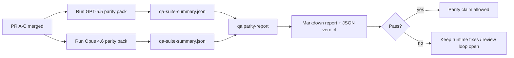

---
read_when:
    - Überprüfung der PR-Reihe zur GPT-5.5-/Codex-Parität
    - Pflege der agentischen Sechs-Verträge-Architektur, die dem Paritätsprogramm zugrunde liegt
summary: So überprüfen Sie das GPT-5.5-/Codex-Paritätsprogramm in vier Merge-Einheiten
title: Maintainer-Hinweise zur GPT-5.5-/Codex-Parität
x-i18n:
    generated_at: "2026-05-06T06:50:46Z"
    model: gpt-5.5
    provider: openai
    source_hash: 5752b4610f8b0d70b80d880ea10df75478b5f85ca431cdb73d3b61d745b23356
    source_path: help/gpt55-codex-agentic-parity-maintainers.md
    workflow: 16
---

Dieser Hinweis erklärt, wie das GPT-5.5-/Codex-Paritätsprogramm als vier Merge-Einheiten geprüft wird, ohne die ursprüngliche Architektur mit sechs Verträgen zu verlieren.

## Merge-Einheiten

### PR A: strikte agentische Ausführung

Verantwortlich für:

- `executionContract`
- GPT-5-first-Fortsetzung im selben Turn
- `update_plan` als nicht terminale Fortschrittsverfolgung
- explizite blockierte Zustände statt stiller Stopps nur mit Plan

Nicht verantwortlich für:

- Klassifizierung von Auth-/Runtime-Fehlern
- Wahrhaftigkeit von Berechtigungen
- Neugestaltung von Replay/Fortsetzung
- Paritäts-Benchmarking

### PR B: Runtime-Wahrhaftigkeit

Verantwortlich für:

- Korrektheit des Codex-OAuth-Scopes
- typisierte Klassifizierung von Provider-/Runtime-Fehlern
- wahrheitsgemäße Verfügbarkeit von `/elevated full` und blockierte Gründe

Nicht verantwortlich für:

- Normalisierung von Tool-Schemata
- Replay-/Liveness-Zustand
- Benchmark-Gating

### PR C: Ausführungskorrektheit

Verantwortlich für:

- Provider-eigene OpenAI-/Codex-Tool-Kompatibilität
- strikte Schema-Verarbeitung ohne Parameter
- Offenlegung ungültiger Replays
- Sichtbarkeit von pausierten, blockierten und aufgegebenen Zuständen bei langen Aufgaben

Nicht verantwortlich für:

- selbstgewählte Fortsetzung
- generisches Codex-Dialektverhalten außerhalb von Provider-Hooks
- Benchmark-Gating

### PR D: Paritäts-Harness

Verantwortlich für:

- erstes Wellenpaket mit GPT-5.5-gegen-Opus-4.6-Szenarien
- Paritätsdokumentation
- Paritätsbericht und Mechanik des Release-Gates

Nicht verantwortlich für:

- Runtime-Verhaltensänderungen außerhalb von QA-Lab
- Auth-/Proxy-/DNS-Simulation innerhalb des Harness

## Zuordnung zurück zu den ursprünglichen sechs Verträgen

| Ursprünglicher Vertrag                 | Merge-Einheit |
| -------------------------------------- | ------------- |
| Korrektheit von Provider-Transport/Auth | PR B          |
| Tool-Vertrag-/Schema-Kompatibilität    | PR C          |
| Ausführung im selben Turn              | PR A          |
| Wahrhaftigkeit von Berechtigungen      | PR B          |
| Korrektheit von Replay/Fortsetzung/Liveness | PR C    |
| Benchmark-/Release-Gate                | PR D          |

## Review-Reihenfolge

1. PR A
2. PR B
3. PR C
4. PR D

PR D ist die Nachweisschicht. Er sollte nicht der Grund sein, warum PRs zur Runtime-Korrektheit verzögert werden.

## Worauf zu achten ist

### PR A

- GPT-5-Läufe handeln oder schlagen geschlossen fehl, statt bei Kommentaren stehen zu bleiben
- `update_plan` sieht nicht mehr für sich allein wie Fortschritt aus
- das Verhalten bleibt GPT-5-first und auf eingebetteten Pi beschränkt

### PR B

- Auth-/Proxy-/Runtime-Fehler fallen nicht mehr in generische „Modell fehlgeschlagen“-Behandlung zurück
- `/elevated full` wird nur als verfügbar beschrieben, wenn es tatsächlich verfügbar ist
- blockierte Gründe sind sowohl für das Modell als auch für die nutzerseitige Runtime sichtbar

### PR C

- strikte OpenAI-/Codex-Tool-Registrierung verhält sich vorhersehbar
- Tools ohne Parameter schlagen bei strikten Schema-Prüfungen nicht fehl
- Replay- und Compaction-Ergebnisse bewahren wahrheitsgemäßen Liveness-Zustand

### PR D

- das Szenariopaket ist verständlich und reproduzierbar
- das Paket enthält eine mutierende Spur für Replay-Sicherheit, nicht nur schreibgeschützte Abläufe
- Berichte sind für Menschen und Automatisierung lesbar
- Paritätsbehauptungen sind evidenzbasiert, nicht anekdotisch

Erwartete Artefakte aus PR D:

- `qa-suite-report.md` / `qa-suite-summary.json` für jeden Modelllauf
- `qa-agentic-parity-report.md` mit aggregiertem Vergleich und Vergleich auf Szenarioebene
- `qa-agentic-parity-summary.json` mit maschinenlesbarem Urteil

## Release-Gate

Beanspruchen Sie keine Parität oder Überlegenheit von GPT-5.5 gegenüber Opus 4.6, bevor:

- PR A, PR B und PR C gemergt sind
- PR D das erste Paritätspaket sauber ausführt
- Runtime-Wahrhaftigkeits-Regressionssuiten grün bleiben
- der Paritätsbericht keine Scheinerfolgsfälle und keine Regression im Stoppverhalten zeigt

Der Paritäts-Harness ist nicht die einzige Evidenzquelle. Halten Sie diese Aufteilung im Review explizit:

- PR D ist für den szenariobasierten Vergleich GPT-5.5 gegen Opus 4.6 verantwortlich
- deterministische Suiten aus PR B bleiben für Evidenz zu Auth/Proxy/DNS und Wahrhaftigkeit von Vollzugriff verantwortlich

## Schneller Merge-Workflow für Maintainer

Verwenden Sie dies, wenn Sie bereit sind, einen Paritäts-PR zu landen, und eine wiederholbare, risikoarme Abfolge wünschen.

1. Bestätigen Sie vor dem Merge, dass die Evidenzanforderung erfüllt ist:
   - reproduzierbares Symptom oder fehlschlagender Test
   - verifizierte Ursache im berührten Code
   - Fix im betroffenen Pfad
   - Regressionstest oder expliziter Hinweis zur manuellen Verifizierung
2. Vor dem Merge triagieren/labeln:
   - alle `r:*`-Auto-Close-Labels anwenden, wenn der PR nicht landen soll
   - Merge-Kandidaten frei von ungelösten Blocker-Threads halten
3. Lokal auf der berührten Oberfläche validieren:
   - `pnpm check:changed`
   - `pnpm test:changed`, wenn Tests geändert wurden oder das Vertrauen in den Bugfix von Testabdeckung abhängt
4. Mit dem standardmäßigen Maintainer-Flow landen (`/landpr`-Prozess), dann verifizieren:
   - Auto-Close-Verhalten verknüpfter Issues
   - CI und Post-Merge-Status auf `main`
5. Nach dem Landen nach Duplikaten für verwandte offene PRs/Issues suchen und nur mit kanonischer Referenz schließen.

Wenn auch nur ein Element der Evidenzanforderung fehlt, Änderungen anfordern statt zu mergen.

## Ziel-zu-Evidenz-Zuordnung

| Completion-Gate-Element                  | Primärer Owner | Review-Artefakt                                                      |
| ---------------------------------------- | -------------- | -------------------------------------------------------------------- |
| Keine Stopps nur mit Plan                | PR A           | strikte agentische Runtime-Tests und `approval-turn-tool-followthrough` |
| Kein falscher Fortschritt oder falscher Tool-Abschluss | PR A + PR D | Paritätszählung von Scheinerfolgen plus Berichtdetails auf Szenarioebene |
| Keine falsche Anleitung zu `/elevated full` | PR B        | deterministische Runtime-Wahrhaftigkeits-Suiten                      |
| Replay-/Liveness-Fehler bleiben explizit | PR C + PR D    | Lifecycle-/Replay-Suiten plus `compaction-retry-mutating-tool`       |
| GPT-5.5 erreicht oder übertrifft Opus 4.6 | PR D          | `qa-agentic-parity-report.md` und `qa-agentic-parity-summary.json`   |

## Reviewer-Kurzform: vorher vs. nachher

| Nutzerseitiges Problem vorher                              | Review-Signal nachher                                                                  |
| ---------------------------------------------------------- | -------------------------------------------------------------------------------------- |
| GPT-5.5 stoppte nach der Planung                           | PR A zeigt Handeln-oder-Blockieren-Verhalten statt Abschluss nur mit Kommentar         |
| Tool-Nutzung wirkte mit strikten OpenAI-/Codex-Schemata fragil | PR C hält Tool-Registrierung und parameterfreien Aufruf vorhersehbar               |
| Hinweise zu `/elevated full` waren manchmal irreführend    | PR B bindet Anleitung an tatsächliche Runtime-Fähigkeit und blockierte Gründe         |
| Lange Aufgaben konnten in Replay-/Compaction-Mehrdeutigkeit verschwinden | PR C gibt explizite pausierte, blockierte, aufgegebene und replay-ungültige Zustände aus |
| Paritätsbehauptungen waren anekdotisch                     | PR D erzeugt einen Bericht plus JSON-Urteil mit derselben Szenarioabdeckung auf beiden Modellen |

## Verwandt

- [GPT-5.5-/Codex-agentische Parität](/de/help/gpt55-codex-agentic-parity)
