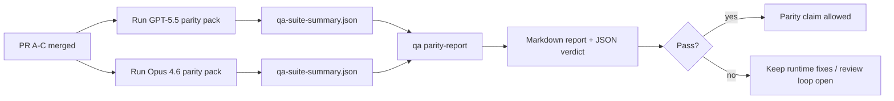

---
read_when:
    - Überprüfung der PR-Serie zur GPT-5.5-/Codex-Parität
    - Wartung der agentischen Architektur mit sechs Verträgen hinter dem Paritätsprogramm
summary: So überprüfen Sie das GPT-5.5-/Codex-Paritätsprogramm als vier Merge-Einheiten
title: Hinweise für Maintainer zur GPT-5.5-/Codex-Parität
x-i18n:
    generated_at: "2026-04-25T18:19:47Z"
    model: gpt-5.4
    provider: openai
    source_hash: 8de69081f5985954b88583880c36388dc47116c3351c15d135b8ab3a660058e3
    source_path: help/gpt55-codex-agentic-parity-maintainers.md
    workflow: 15
---

Diese Notiz erklärt, wie das GPT-5.5-/Codex-Paritätsprogramm als vier Merge-Einheiten überprüft werden kann, ohne die ursprüngliche agentische Architektur mit sechs Verträgen zu verlieren.

## Merge-Einheiten

### PR A: strikt agentische Ausführung

Zuständig für:

- `executionContract`
- GPT-5-First Follow-through im selben Zug
- `update_plan` als nicht terminale Fortschrittsverfolgung
- explizite Blockiert-Zustände statt stiller Stopps nur mit Plan

Nicht zuständig für:

- Klassifizierung von Auth-/Laufzeitfehlern
- Wahrhaftigkeit bei Berechtigungen
- Neugestaltung von Replay/Fortsetzung
- Paritäts-Benchmarking

### PR B: Wahrhaftigkeit der Laufzeit

Zuständig für:

- Korrektheit der Codex-OAuth-Scopes
- typisierte Klassifizierung von Provider-/Laufzeitfehlern
- wahrheitsgemäße Verfügbarkeit von `/elevated full` und Gründe für Blockierungen

Nicht zuständig für:

- Normalisierung von Tool-Schemas
- Replay-/Liveness-Zustand
- Benchmark-Gating

### PR C: Korrektheit der Ausführung

Zuständig für:

- provider-eigene OpenAI-/Codex-Tool-Kompatibilität
- parameterfreie Strict-Schema-Behandlung
- Sichtbarmachung von Replay-invalid
- Sichtbarkeit von Zuständen für pausierte, blockierte und abgebrochene Langzeitaufgaben

Nicht zuständig für:

- selbstgewählte Fortsetzung
- generisches Codex-Dialektverhalten außerhalb von Provider-Hooks
- Benchmark-Gating

### PR D: Paritätsharness

Zuständig für:

- erstes Szenariopaket für GPT-5.5 vs. Opus 4.6
- Paritätsdokumentation
- Paritätsbericht und Release-Gate-Mechanik

Nicht zuständig für:

- Änderungen des Laufzeitverhaltens außerhalb von QA-Lab
- Auth-/Proxy-/DNS-Simulation innerhalb des Harness

## Rückzuordnung zu den ursprünglichen sechs Verträgen

| Ursprünglicher Vertrag                   | Merge-Einheit |
| ---------------------------------------- | ------------- |
| Korrektheit von Provider-Transport/Auth  | PR B          |
| Kompatibilität von Tool-Vertrag/Schema   | PR C          |
| Ausführung im selben Zug                 | PR A          |
| Wahrhaftigkeit bei Berechtigungen        | PR B          |
| Korrektheit von Replay/Fortsetzung/Liveness | PR C       |
| Benchmark-/Release-Gate                  | PR D          |

## Reihenfolge der Überprüfung

1. PR A
2. PR B
3. PR C
4. PR D

PR D ist die Nachweisschicht. Sie sollte nicht der Grund sein, warum PRs zur Laufzeitkorrektheit verzögert werden.

## Worauf zu achten ist

### PR A

- GPT-5-Ausführungen handeln oder schlagen geschlossen fehl, statt bei Kommentartext stehenzubleiben
- `update_plan` wirkt nicht länger für sich allein wie Fortschritt
- das Verhalten bleibt GPT-5-first und auf eingebettete Pi beschränkt

### PR B

- Auth-/Proxy-/Laufzeitfehler fallen nicht weiter in generische „Modell fehlgeschlagen“-Behandlung zurück
- `/elevated full` wird nur dann als verfügbar beschrieben, wenn es tatsächlich verfügbar ist
- Gründe für Blockierungen sind sowohl für das Modell als auch für die benutzerseitige Laufzeit sichtbar

### PR C

- strikte OpenAI-/Codex-Tool-Registrierung verhält sich vorhersehbar
- parameterfreie Tools scheitern nicht an strikten Schema-Prüfungen
- Replay- und Compaction-Ergebnisse erhalten den wahrheitsgemäßen Liveness-Zustand

### PR D

- das Szenariopaket ist verständlich und reproduzierbar
- das Paket enthält eine mutierende Replay-Sicherheits-Strecke, nicht nur schreibgeschützte Abläufe
- Berichte sind für Menschen und Automatisierung lesbar
- Paritätsaussagen sind beleggestützt, nicht anekdotisch

Erwartete Artefakte aus PR D:

- `qa-suite-report.md` / `qa-suite-summary.json` für jeden Modelldurchlauf
- `qa-agentic-parity-report.md` mit aggregiertem und szenariobezogenem Vergleich
- `qa-agentic-parity-summary.json` mit maschinenlesbarem Urteil

## Release-Gate

Beanspruchen Sie keine GPT-5.5-Parität oder Überlegenheit gegenüber Opus 4.6, bevor nicht:

- PR A, PR B und PR C gemergt sind
- PR D das Paritätspaket der ersten Welle fehlerfrei ausführt
- Regressionssuiten zur Laufzeit-Wahrhaftigkeit grün bleiben
- der Paritätsbericht keine Fake-Success-Fälle und keine Regression beim Stoppverhalten zeigt

Das Paritätsharness ist nicht die einzige Nachweisquelle. Halten Sie diese Trennung in der Überprüfung explizit aufrecht:

- PR D ist zuständig für den szenariobasierten Vergleich GPT-5.5 vs. Opus 4.6
- deterministische Suiten aus PR B bleiben zuständig für Nachweise zu Auth/Proxy/DNS und Wahrhaftigkeit bei Vollzugriff

## Schneller Maintainer-Merge-Workflow

Verwenden Sie dies, wenn Sie bereit sind, eine Paritäts-PR zu landen, und eine wiederholbare, risikoarme Abfolge möchten.

1. Vor dem Merge prüfen, ob die Nachweisschwelle erfüllt ist:
   - reproduzierbares Symptom oder fehlschlagender Test
   - verifizierte Grundursache im betroffenen Code
   - Fix im betroffenen Pfad
   - Regressionstest oder expliziter Hinweis auf manuelle Verifikation
2. Vor dem Merge triagieren/labeln:
   - alle `r:*`-Auto-Close-Labels anwenden, wenn die PR nicht landen soll
   - Merge-Kandidaten frei von ungelösten blockierenden Threads halten
3. Lokal auf der betroffenen Oberfläche validieren:
   - `pnpm check:changed`
   - `pnpm test:changed`, wenn Tests geändert wurden oder das Vertrauen in den Bugfix von der Testabdeckung abhängt
4. Mit dem Standard-Maintainer-Ablauf landen (Prozess `/landpr`) und dann verifizieren:
   - Auto-Close-Verhalten verknüpfter Issues
   - CI- und Post-Merge-Status auf `main`
5. Nach dem Landen nach verwandten offenen PRs/Issues mit Duplikatsuche suchen und nur mit einem kanonischen Verweis schließen.

Wenn auch nur eines der Nachweisschwellen-Elemente fehlt, fordern Sie Änderungen an, statt zu mergen.

## Zuordnung von Ziel zu Nachweis

| Element des Abschluss-Gates              | Primärer Besitzer | Review-Artefakt                                                     |
| ---------------------------------------- | ----------------- | ------------------------------------------------------------------- |
| Keine Stalls nur mit Plan                | PR A              | Strict-Agentic-Laufzeittests und `approval-turn-tool-followthrough` |
| Kein Fake-Fortschritt oder Fake-Tool-Abschluss | PR A + PR D | Anzahl an Fake-Success-Fällen in der Parität plus szenariobezogene Berichtsdetails |
| Keine falschen `/elevated full`-Hinweise | PR B              | deterministische Suiten zur Laufzeit-Wahrhaftigkeit                 |
| Replay-/Liveness-Fehler bleiben explizit | PR C + PR D       | Lifecycle-/Replay-Suiten plus `compaction-retry-mutating-tool`      |
| GPT-5.5 entspricht Opus 4.6 oder übertrifft es | PR D         | `qa-agentic-parity-report.md` und `qa-agentic-parity-summary.json`  |

## Reviewer-Kurzfassung: vorher vs. nachher

| Vorher sichtbares Benutzerproblem                             | Review-Signal nachher                                                                      |
| ------------------------------------------------------------- | ------------------------------------------------------------------------------------------ |
| GPT-5.5 stoppte nach der Planung                              | PR A zeigt Act-or-Block-Verhalten statt Abschluss nur mit Kommentartext                    |
| Tool-Nutzung wirkte mit strikten OpenAI-/Codex-Schemas fragil | PR C hält Tool-Registrierung und parameterfreien Aufruf vorhersehbar                       |
| Hinweise zu `/elevated full` waren manchmal irreführend       | PR B koppelt Hinweise an tatsächliche Laufzeitfähigkeit und Gründe für Blockierungen       |
| Lange Aufgaben konnten in Replay-/Compaction-Mehrdeutigkeit verschwinden | PR C gibt explizite Zustände für pausiert, blockiert, abgebrochen und replay-invalid aus |
| Paritätsaussagen waren anekdotisch                            | PR D erzeugt einen Bericht plus JSON-Urteil mit derselben Szenarioabdeckung für beide Modelle |

## Verwandt

- [Agentische GPT-5.5-/Codex-Parität](/de/help/gpt55-codex-agentic-parity)
