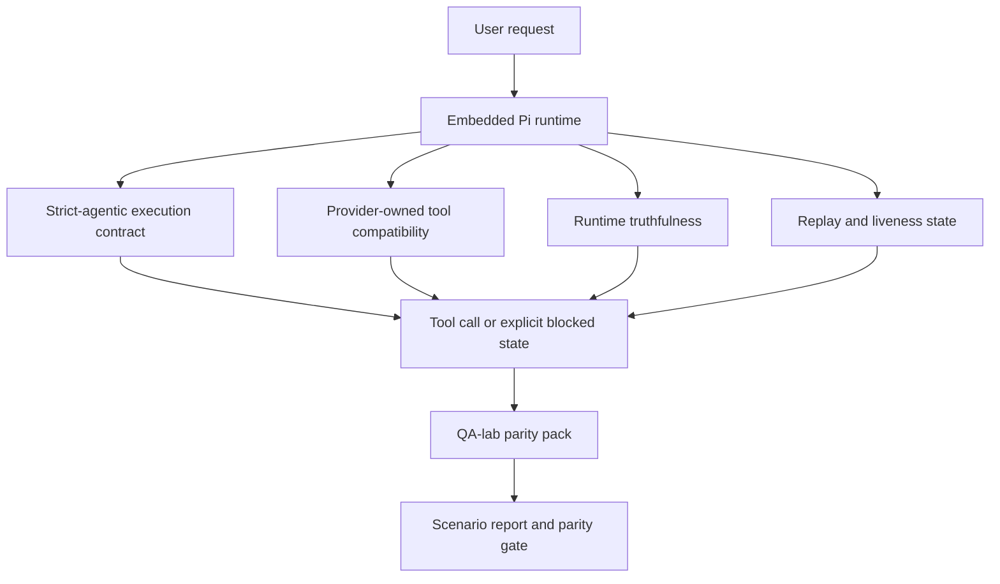
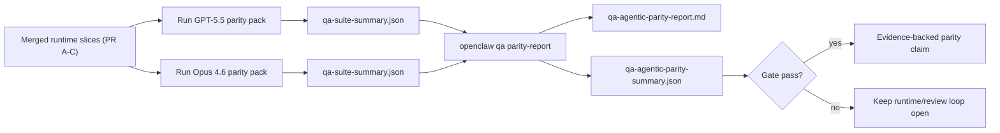

---
read_when:
    - Fehlersuche beim Verhalten von GPT-5.5- oder Codex-Agenten
    - Vergleich des agentischen Verhaltens von OpenClaw über Frontier-Modelle hinweg
    - Überprüfung der Strict-Agentic-, Tool-Schema-, Elevation- und Replay-Fixes
summary: Wie OpenClaw agentische Ausführungslücken für GPT-5.5 und Modelle im Codex-Stil schließt
title: GPT-5.5 / Codex agentische Parität
x-i18n:
    generated_at: "2026-05-06T06:50:58Z"
    model: gpt-5.5
    provider: openai
    source_hash: bbc32f418dfffe2786093fa6b42b19f92a2d382c9408dfc55dd0154d67959390
    source_path: help/gpt55-codex-agentic-parity.md
    workflow: 16
---

OpenClaw funktionierte bereits gut mit werkzeugnutzenden Frontier-Modellen, aber GPT-5.5 und Modelle im Codex-Stil blieben in einigen praktischen Bereichen noch hinter den Erwartungen zurück:

- sie konnten nach der Planung stoppen, statt die Arbeit auszuführen
- sie konnten strikte OpenAI-/Codex-Tool-Schemas falsch verwenden
- sie konnten nach `/elevated full` fragen, selbst wenn Vollzugriff unmöglich war
- sie konnten bei Replay oder Compaction den Zustand lang laufender Aufgaben verlieren
- Paritätsaussagen gegenüber Claude Opus 4.6 basierten auf Anekdoten statt auf wiederholbaren Szenarien

Dieses Paritätsprogramm schließt diese Lücken in vier prüfbaren Abschnitten.

## Was sich geändert hat

### PR A: strikt agentische Ausführung

Dieser Abschnitt ergänzt einen optionalen `strict-agentic`-Ausführungsvertrag für eingebettete Pi-GPT-5-Läufe.

Wenn er aktiviert ist, akzeptiert OpenClaw reine Planungsturns nicht mehr als "gut genug" abgeschlossene Ausführung. Wenn das Modell nur sagt, was es zu tun beabsichtigt, aber keine Tools verwendet oder keinen Fortschritt macht, versucht OpenClaw es mit einer Sofort-handeln-Anweisung erneut und schlägt dann geschlossen mit einem expliziten blockierten Zustand fehl, statt die Aufgabe stillschweigend zu beenden.

Dies verbessert die GPT-5.5-Erfahrung am stärksten bei:

- kurzen Folgeanweisungen wie "ok, mach es"
- Codeaufgaben, bei denen der erste Schritt offensichtlich ist
- Abläufen, in denen `update_plan` Fortschrittsverfolgung statt Fülltext sein sollte

### PR B: Runtime-Wahrhaftigkeit

Dieser Abschnitt sorgt dafür, dass OpenClaw bei zwei Dingen die Wahrheit sagt:

- warum der Provider-/Runtime-Aufruf fehlgeschlagen ist
- ob `/elevated full` tatsächlich verfügbar ist

Das bedeutet, dass GPT-5.5 bessere Runtime-Signale für fehlenden Scope, fehlgeschlagene Auth-Aktualisierungen, HTML-403-Auth-Fehler, Proxy-Probleme, DNS- oder Timeout-Fehler und blockierte Vollzugriffsmodi erhält. Das Modell halluziniert dadurch seltener die falsche Abhilfe oder fragt weiter nach einem Berechtigungsmodus, den die Runtime nicht bereitstellen kann.

### PR C: Ausführungskorrektheit

Dieser Abschnitt verbessert zwei Arten von Korrektheit:

- Provider-eigene OpenAI-/Codex-Tool-Schema-Kompatibilität
- Sichtbarkeit von Replay und Liveness bei langen Aufgaben

Die Tool-Kompatibilitätsarbeit reduziert Schema-Reibung bei strikter OpenAI-/Codex-Tool-Registrierung, insbesondere bei parameterfreien Tools und strikten Erwartungen an ein Objekt auf Root-Ebene. Die Replay-/Liveness-Arbeit macht lang laufende Aufgaben besser beobachtbar, sodass pausierte, blockierte und aufgegebene Zustände sichtbar sind, statt in generischem Fehlertext zu verschwinden.

### PR D: Paritäts-Harness

Dieser Abschnitt ergänzt das erste QA-lab-Paritätspaket, damit GPT-5.5 und Opus 4.6 mit denselben Szenarien ausgeführt und anhand gemeinsamer Evidenz verglichen werden können.

Das Paritätspaket ist die Nachweisebene. Es ändert für sich genommen kein Runtime-Verhalten.

Nachdem Sie zwei `qa-suite-summary.json`-Artefakte haben, erzeugen Sie den Release-Gate-Vergleich mit:

```bash
pnpm openclaw qa parity-report \
  --repo-root . \
  --candidate-summary .artifacts/qa-e2e/gpt55/qa-suite-summary.json \
  --baseline-summary .artifacts/qa-e2e/opus46/qa-suite-summary.json \
  --output-dir .artifacts/qa-e2e/parity
```

Dieser Befehl schreibt:

- einen menschenlesbaren Markdown-Bericht
- ein maschinenlesbares JSON-Urteil
- ein explizites `pass`- / `fail`-Gate-Ergebnis

## Warum dies GPT-5.5 in der Praxis verbessert

Vor dieser Arbeit konnte sich GPT-5.5 auf OpenClaw in echten Codingsitzungen weniger agentisch anfühlen als Opus, weil die Runtime Verhaltensweisen tolerierte, die für Modelle im GPT-5-Stil besonders schädlich sind:

- Turns nur mit Kommentaren
- Schema-Reibung bei Tools
- ungenaues Berechtigungsfeedback
- unbemerkte Schäden durch Replay oder Compaction

Das Ziel ist nicht, GPT-5.5 Opus nachahmen zu lassen. Das Ziel ist, GPT-5.5 einen Runtime-Vertrag zu geben, der echten Fortschritt belohnt, klarere Tool- und Berechtigungssemantik liefert und Fehlermodi in explizite maschinen- und menschenlesbare Zustände überführt.

Das verändert die Benutzererfahrung von:

- "das Modell hatte einen guten Plan, stoppte aber"

zu:

- "das Modell hat entweder gehandelt, oder OpenClaw hat den genauen Grund angezeigt, warum es nicht konnte"

## Vorher und nachher für GPT-5.5-Nutzer

| Vor diesem Programm                                                                        | Nach PR A-D                                                                                 |
| ------------------------------------------------------------------------------------------ | ------------------------------------------------------------------------------------------- |
| GPT-5.5 konnte nach einem plausiblen Plan stoppen, ohne den nächsten Tool-Schritt auszuführen | PR A macht aus "nur planen" ein "jetzt handeln oder einen blockierten Zustand anzeigen"      |
| Strikte Tool-Schemas konnten parameterfreie oder OpenAI-/Codex-förmige Tools auf verwirrende Weise ablehnen | PR C macht Provider-eigene Tool-Registrierung und -Ausführung vorhersehbarer                 |
| `/elevated full`-Hinweise konnten in blockierten Runtimes vage oder falsch sein             | PR B gibt GPT-5.5 und dem Nutzer wahrheitsgetreue Runtime- und Berechtigungshinweise         |
| Replay- oder Compaction-Fehler konnten wirken, als wäre die Aufgabe stillschweigend verschwunden | PR C zeigt pausierte, blockierte, aufgegebene und Replay-ungültige Ergebnisse explizit an    |
| "GPT-5.5 fühlt sich schlechter an als Opus" war größtenteils anekdotisch                   | PR D überführt dies in dasselbe Szenariopaket, dieselben Metriken und ein hartes Pass/Fail-Gate |

## Architektur



## Release-Ablauf



## Szenariopaket

Das erste Paritätspaket deckt derzeit fünf Szenarien ab:

### `approval-turn-tool-followthrough`

Prüft, dass das Modell nach einer kurzen Zustimmung nicht bei "Ich mache das" stoppt. Es sollte im selben Turn die erste konkrete Aktion ausführen.

### `model-switch-tool-continuity`

Prüft, dass werkzeugnutzende Arbeit über Modell-/Runtime-Wechselgrenzen hinweg kohärent bleibt, statt in Kommentare zurückzufallen oder Ausführungskontext zu verlieren.

### `source-docs-discovery-report`

Prüft, dass das Modell Quellcode und Dokumentation lesen, Erkenntnisse synthetisieren und die Aufgabe agentisch fortsetzen kann, statt eine dünne Zusammenfassung zu erzeugen und früh zu stoppen.

### `image-understanding-attachment`

Prüft, dass gemischte Aufgaben mit Anhängen handlungsfähig bleiben und nicht in vage Erzählung zusammenfallen.

### `compaction-retry-mutating-tool`

Prüft, dass eine Aufgabe mit einem echten mutierenden Schreibvorgang Replay-Unsicherheit explizit hält, statt stillschweigend Replay-sicher zu wirken, wenn der Lauf kompaktiert wird, erneut versucht wird oder unter Druck Antwortzustand verliert.

## Szenariomatrix

| Szenario                           | Was es testet                         | Gutes GPT-5.5-Verhalten                                                       | Fehlersignal                                                                   |
| ---------------------------------- | ------------------------------------- | ----------------------------------------------------------------------------- | ------------------------------------------------------------------------------ |
| `approval-turn-tool-followthrough` | Kurze Zustimmungsturns nach einem Plan | Startet sofort die erste konkrete Tool-Aktion, statt die Absicht erneut zu formulieren | Folgeantwort nur mit Plan, keine Tool-Aktivität oder blockierter Turn ohne echten Blocker |
| `model-switch-tool-continuity`     | Runtime-/Modellwechsel unter Tool-Nutzung | Bewahrt den Aufgabenkontext und handelt kohärent weiter                       | fällt in Kommentare zurück, verliert Tool-Kontext oder stoppt nach dem Wechsel |
| `source-docs-discovery-report`     | Quellen lesen + Synthese + Aktion     | Findet Quellen, nutzt Tools und erstellt einen nützlichen Bericht ohne Stillstand | dünne Zusammenfassung, fehlende Tool-Arbeit oder Stop eines unvollständigen Turns |
| `image-understanding-attachment`   | Anhanggesteuerte agentische Arbeit    | Interpretiert den Anhang, verbindet ihn mit Tools und setzt die Aufgabe fort  | vage Erzählung, ignorierter Anhang oder keine konkrete nächste Aktion          |
| `compaction-retry-mutating-tool`   | Mutierende Arbeit unter Compaction-Druck | Führt einen echten Schreibvorgang aus und hält Replay-Unsicherheit nach dem Seiteneffekt explizit | mutierender Schreibvorgang findet statt, aber Replay-Sicherheit wird impliziert, fehlt oder ist widersprüchlich |

## Release-Gate

GPT-5.5 kann nur dann als auf Parität oder besser betrachtet werden, wenn die gemergte Runtime gleichzeitig das Paritätspaket und die Runtime-Wahrhaftigkeitsregressionen besteht.

Erforderliche Ergebnisse:

- kein reiner Planungsstillstand, wenn die nächste Tool-Aktion klar ist
- kein vorgetäuschter Abschluss ohne echte Ausführung
- keine falschen `/elevated full`-Hinweise
- kein stillschweigendes Aufgeben bei Replay oder Compaction
- Paritätspaket-Metriken, die mindestens so stark sind wie die vereinbarte Opus-4.6-Baseline

Für den ersten Harness vergleicht das Gate:

- Abschlussrate
- Rate unbeabsichtigter Stopps
- Rate gültiger Tool-Aufrufe
- Anzahl vorgetäuschter Erfolge

Paritätsevidenz ist absichtlich auf zwei Ebenen aufgeteilt:

- PR D belegt GPT-5.5-vs.-Opus-4.6-Verhalten in denselben Szenarien mit QA-lab
- PR B belegt mit deterministischen Suiten Wahrhaftigkeit bei Auth, Proxy, DNS und `/elevated full` außerhalb des Harness

## Ziel-zu-Evidenz-Matrix

| Completion-Gate-Element                                  | Zuständiger PR | Evidenzquelle                                                     | Pass-Signal                                                                              |
| -------------------------------------------------------- | -------------- | ----------------------------------------------------------------- | ---------------------------------------------------------------------------------------- |
| GPT-5.5 bleibt nicht mehr nach der Planung stehen         | PR A           | `approval-turn-tool-followthrough` plus PR-A-Runtime-Suiten       | Zustimmungsturns lösen echte Arbeit oder einen expliziten blockierten Zustand aus        |
| GPT-5.5 täuscht keinen Fortschritt und keinen Tool-Abschluss mehr vor | PR A + PR D    | Szenarioergebnisse des Paritätsberichts und Anzahl vorgetäuschter Erfolge | keine verdächtigen Pass-Ergebnisse und kein Abschluss nur mit Kommentaren                |
| GPT-5.5 gibt keine falschen `/elevated full`-Hinweise mehr | PR B           | deterministische Wahrhaftigkeits-Suiten                           | blockierte Gründe und Vollzugriffshinweise bleiben Runtime-korrekt                       |
| Replay-/Liveness-Fehler bleiben explizit                 | PR C + PR D    | PR-C-Lifecycle-/Replay-Suiten plus `compaction-retry-mutating-tool` | mutierende Arbeit hält Replay-Unsicherheit explizit, statt stillschweigend zu verschwinden |
| GPT-5.5 erreicht oder übertrifft Opus 4.6 bei den vereinbarten Metriken | PR D           | `qa-agentic-parity-report.md` und `qa-agentic-parity-summary.json` | dieselbe Szenarioabdeckung und keine Regression bei Abschluss, Stoppverhalten oder gültiger Tool-Nutzung |

## So lesen Sie das Paritätsurteil

Verwenden Sie das Urteil in `qa-agentic-parity-summary.json` als finale maschinenlesbare Entscheidung für das erste Paritätspaket.

- `pass` bedeutet, dass GPT-5.5 dieselben Szenarien wie Opus 4.6 abgedeckt hat und sich bei den vereinbarten aggregierten Metriken nicht verschlechtert hat.
- `fail` bedeutet, dass mindestens ein harter Gate ausgelöst wurde: schwächere Completion, schlechtere unbeabsichtigte Stopps, schwächere gültige Tool-Nutzung, ein Fake-Success-Fall oder abweichende Szenarioabdeckung.
- Ein „gemeinsames/Basis-CI-Problem“ ist für sich genommen kein Paritätsergebnis. Wenn CI-Störungen außerhalb von PR D einen Lauf blockieren, sollte das Urteil auf eine saubere Ausführung der gemergten Runtime warten, statt aus Logs aus der Branch-Phase abgeleitet zu werden.
- Auth, Proxy, DNS und die Wahrhaftigkeit von `/elevated full` stammen weiterhin aus den deterministischen Testsuiten von PR B, daher benötigt die abschließende Release-Aussage beides: ein bestandenes PR-D-Paritätsurteil und grüne PR-B-Wahrhaftigkeitsabdeckung.

## Wer `strict-agentic` aktivieren sollte

Verwenden Sie `strict-agentic`, wenn:

- vom Agent erwartet wird, sofort zu handeln, wenn ein nächster Schritt offensichtlich ist
- GPT-5.5- oder Codex-Familienmodelle die primäre Runtime sind
- Sie explizite blockierte Zustände gegenüber „hilfreichen“ reinen Zusammenfassungsantworten bevorzugen

Behalten Sie den Standardvertrag bei, wenn:

- Sie das bestehende lockerere Verhalten wünschen
- Sie keine GPT-5-Familienmodelle verwenden
- Sie Prompts statt Runtime-Erzwingung testen

## Verwandte Themen

- [GPT-5.5-/Codex-Parität: Maintainer-Notizen](/de/help/gpt55-codex-agentic-parity-maintainers)
