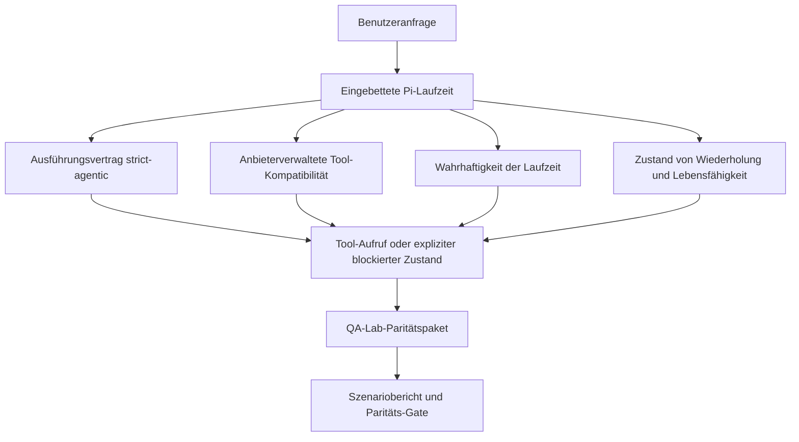
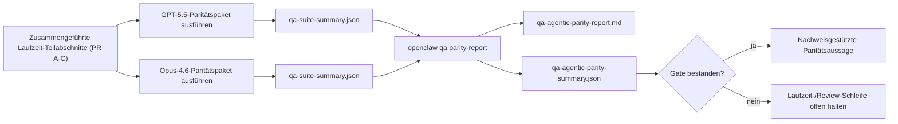

---
read_when:
    - Debugging des Agentenverhaltens von GPT-5.5 oder Codex
    - Vergleich des agentischen Verhaltens von OpenClaw über Frontier-Modelle hinweg
    - Überprüfung der Korrekturen für strikte Agentik, Tool-Schema, Rechteerweiterung und Wiederholung
summary: Wie OpenClaw Lücken bei der agentischen Ausführung für GPT-5.5 und Codex-ähnliche Modelle schließt
title: Agentische Parität für GPT-5.5 / Codex
x-i18n:
    generated_at: "2026-04-25T18:19:51Z"
    model: gpt-5.4
    provider: openai
    source_hash: 8a3b9375cd9e9d95855c4a1135953e00fd7a939e52fb7b75342da3bde2d83fe1
    source_path: help/gpt55-codex-agentic-parity.md
    workflow: 15
---

# Agentische Parität für GPT-5.5 / Codex in OpenClaw

OpenClaw funktionierte bereits gut mit Frontier-Modellen, die Tools verwenden, aber GPT-5.5 und Codex-ähnliche Modelle blieben in einigen praktischen Punkten noch hinter den Erwartungen zurück:

- sie konnten nach der Planung aufhören, statt die Arbeit auszuführen
- sie konnten strikte OpenAI-/Codex-Tool-Schemata falsch verwenden
- sie konnten nach `/elevated full` fragen, selbst wenn vollständiger Zugriff unmöglich war
- sie konnten den Zustand lang laufender Aufgaben während Wiederholung oder Compaction verlieren
- Paritätsaussagen gegenüber Claude Opus 4.6 basierten auf Anekdoten statt auf wiederholbaren Szenarien

Dieses Paritätsprogramm schließt diese Lücken in vier überprüfbaren Teilabschnitten.

## Was sich geändert hat

### PR A: strikt-agentische Ausführung

Dieser Teilabschnitt fügt einen optionalen Ausführungsvertrag `strict-agentic` für eingebettete Pi-GPT-5-Läufe hinzu.

Wenn aktiviert, akzeptiert OpenClaw planungsbasierte Züge nicht mehr als „gut genug“ abgeschlossene Ausführung. Wenn das Modell nur sagt, was es vorhat, aber tatsächlich keine Tools verwendet oder keinen Fortschritt macht, versucht OpenClaw es mit einer Jetzt-handeln-Steuerung erneut und schlägt dann kontrolliert mit einem expliziten blockierten Zustand fehl, statt die Aufgabe stillschweigend zu beenden.

Dies verbessert die GPT-5.5-Erfahrung insbesondere bei:

- kurzen „ok, mach es“-Anschlussnachrichten
- Code-Aufgaben, bei denen der erste Schritt offensichtlich ist
- Abläufen, bei denen `update_plan` Fortschrittsverfolgung statt Fülltext sein sollte

### PR B: Wahrhaftigkeit der Laufzeit

Dieser Teilabschnitt sorgt dafür, dass OpenClaw bei zwei Dingen die Wahrheit sagt:

- warum der Anbieter-/Laufzeitaufruf fehlgeschlagen ist
- ob `/elevated full` tatsächlich verfügbar ist

Das bedeutet, dass GPT-5.5 bessere Laufzeitsignale für fehlenden Scope, Fehler beim Aktualisieren der Authentifizierung, HTML-403-Authentifizierungsfehler, Proxy-Probleme, DNS- oder Timeout-Fehler und blockierte Vollzugriffsmodi erhält. Das Modell wird seltener die falsche Behebung halluzinieren oder weiter nach einem Berechtigungsmodus fragen, den die Laufzeit nicht bereitstellen kann.

### PR C: Korrektheit der Ausführung

Dieser Teilabschnitt verbessert zwei Arten von Korrektheit:

- anbieterverwaltete Kompatibilität von OpenAI-/Codex-Tool-Schemata
- Sichtbarkeit von Wiederholung und Lebensfähigkeit lang laufender Aufgaben

Die Tool-Kompatibilitätsarbeit verringert Schema-Reibung bei strikter OpenAI-/Codex-Tool-Registrierung, insbesondere bei parameterlosen Tools und strikten Erwartungen an Objektwurzeln. Die Arbeit an Wiederholung/Lebensfähigkeit macht lang laufende Aufgaben besser beobachtbar, sodass pausierte, blockierte und aufgegebene Zustände sichtbar werden, statt in generischem Fehlertest zu verschwinden.

### PR D: Paritäts-Harness

Dieser Teilabschnitt fügt das Paritätspaket der ersten Welle für QA-Lab hinzu, sodass GPT-5.5 und Opus 4.6 durch dieselben Szenarien ausgeführt und mit gemeinsam genutzten Nachweisen verglichen werden können.

Das Paritätspaket ist die Beweisschicht. Es ändert das Laufzeitverhalten nicht selbst.

Sobald Sie zwei Artefakte `qa-suite-summary.json` haben, erzeugen Sie den Vergleich für das Release-Gate mit:

```bash
pnpm openclaw qa parity-report \
  --repo-root . \
  --candidate-summary .artifacts/qa-e2e/gpt55/qa-suite-summary.json \
  --baseline-summary .artifacts/qa-e2e/opus46/qa-suite-summary.json \
  --output-dir .artifacts/qa-e2e/parity
```

Dieser Befehl schreibt:

- einen menschenlesbaren Markdown-Bericht
- ein maschinenlesbares JSON-Urteil
- ein explizites Gate-Ergebnis `pass` / `fail`

## Warum dies GPT-5.5 in der Praxis verbessert

Vor dieser Arbeit konnte sich GPT-5.5 in OpenClaw in echten Coding-Sitzungen weniger agentisch anfühlen als Opus, weil die Laufzeit Verhaltensweisen tolerierte, die für Modelle im Stil von GPT-5 besonders schädlich sind:

- rein kommentierende Züge
- Schema-Reibung rund um Tools
- vages Berechtigungsfeedback
- stilles Versagen bei Wiederholung oder Compaction

Das Ziel ist nicht, GPT-5.5 dazu zu bringen, Opus zu imitieren. Das Ziel ist, GPT-5.5 einen Laufzeitvertrag zu geben, der echten Fortschritt belohnt, klarere Tool- und Berechtigungssemantik liefert und Fehlermodi in explizite maschinen- und menschenlesbare Zustände umwandelt.

Dadurch ändert sich die Benutzererfahrung von:

- „das Modell hatte einen guten Plan, hat aber aufgehört“

zu:

- „das Modell hat entweder gehandelt, oder OpenClaw hat genau den Grund angezeigt, warum es nicht konnte“

## Vorher vs. nachher für GPT-5.5-Benutzer

| Vor diesem Programm                                                                            | Nach PR A-D                                                                              |
| ---------------------------------------------------------------------------------------------- | ---------------------------------------------------------------------------------------- |
| GPT-5.5 konnte nach einem vernünftigen Plan aufhören, ohne den nächsten Tool-Schritt auszuführen | PR A macht aus „nur Plan“ „jetzt handeln oder einen blockierten Zustand anzeigen“       |
| Strikte Tool-Schemata konnten parameterlose oder OpenAI-/Codex-geformte Tools auf verwirrende Weise ablehnen | PR C macht anbieterverwaltete Tool-Registrierung und -Aufrufe vorhersehbarer            |
| Hinweise zu `/elevated full` konnten vage oder in blockierten Laufzeiten falsch sein          | PR B gibt GPT-5.5 und dem Benutzer wahrheitsgemäße Laufzeit- und Berechtigungshinweise   |
| Fehler bei Wiederholung oder Compaction konnten so wirken, als sei die Aufgabe still verschwunden | PR C macht pausierte, blockierte, aufgegebene und durch Wiederholung ungültige Ergebnisse explizit sichtbar |
| „GPT-5.5 fühlt sich schlechter an als Opus“ war größtenteils anekdotisch                      | PR D macht daraus dasselbe Szenariopaket, dieselben Metriken und ein hartes Pass/Fail-Gate |

## Architektur



## Release-Ablauf



## Szenariopaket

Das Paritätspaket der ersten Welle deckt derzeit fünf Szenarien ab:

### `approval-turn-tool-followthrough`

Prüft, dass das Modell nach einer kurzen Zustimmung nicht bei „Ich werde das tun“ stehen bleibt. Es sollte im selben Zug die erste konkrete Aktion ausführen.

### `model-switch-tool-continuity`

Prüft, dass arbeit mit Tool-Verwendung über Modell-/Laufzeitwechsel hinweg kohärent bleibt, statt in Kommentartext zurückzufallen oder den Ausführungskontext zu verlieren.

### `source-docs-discovery-report`

Prüft, dass das Modell Quellcode und Dokumentation lesen, Erkenntnisse synthetisieren und die Aufgabe weiter agentisch bearbeiten kann, statt eine dünne Zusammenfassung zu erzeugen und frühzeitig aufzuhören.

### `image-understanding-attachment`

Prüft, dass Aufgaben mit gemischten Modi und Anhängen handlungsfähig bleiben und nicht in vage Erzählung zusammenbrechen.

### `compaction-retry-mutating-tool`

Prüft, dass eine Aufgabe mit einer echten mutierenden Schreiboperation die Unsicherheit bei Wiederholung explizit hält, statt stillschweigend so zu wirken, als sei die Wiederholung sicher, wenn der Lauf kompaktiert, wiederholt oder unter Druck den Antwortzustand verliert.

## Szenariomatrix

| Szenario                           | Was es testet                            | Gutes GPT-5.5-Verhalten                                                        | Fehlersignal                                                                    |
| ---------------------------------- | ---------------------------------------- | ------------------------------------------------------------------------------ | ------------------------------------------------------------------------------- |
| `approval-turn-tool-followthrough` | Kurze Zustimmungszüge nach einem Plan    | Startet sofort die erste konkrete Tool-Aktion, statt nur die Absicht zu wiederholen | nur-Plan-Anschlusszug, keine Tool-Aktivität oder blockierter Zug ohne echten Blocker |
| `model-switch-tool-continuity`     | Laufzeit-/Modellwechsel unter Tool-Nutzung | Bewahrt den Aufgabenkontext und handelt kohärent weiter                        | fällt in Kommentartext zurück, verliert Tool-Kontext oder stoppt nach dem Wechsel |
| `source-docs-discovery-report`     | Quellcode lesen + Synthese + Aktion      | Findet Quellen, nutzt Tools und erstellt einen nützlichen Bericht ohne ins Stocken zu geraten | dünne Zusammenfassung, fehlende Tool-Arbeit oder Stopp bei unvollständigem Zug |
| `image-understanding-attachment`   | Agentische Arbeit mit anhanggesteuerten Aufgaben | Interpretiert den Anhang, verbindet ihn mit Tools und setzt die Aufgabe fort | vage Erzählung, Anhang ignoriert oder keine konkrete nächste Aktion             |
| `compaction-retry-mutating-tool`   | Mutierende Arbeit unter Compaction-Druck | Führt eine echte Schreiboperation aus und hält die Unsicherheit bei Wiederholung nach dem Nebeneffekt explizit | mutierende Schreiboperation erfolgt, aber Wiederholungssicherheit wird impliziert, fehlt oder ist widersprüchlich |

## Release-Gate

GPT-5.5 kann nur dann als gleichwertig oder besser betrachtet werden, wenn die zusammengeführte Laufzeit gleichzeitig das Paritätspaket und die Regressionen der Laufzeit-Wahrhaftigkeit besteht.

Erforderliche Ergebnisse:

- kein Stocken bei nur Planung, wenn die nächste Tool-Aktion klar ist
- kein vorgetäuschter Abschluss ohne echte Ausführung
- keine falschen Hinweise zu `/elevated full`
- kein stilles Aufgeben bei Wiederholung oder Compaction
- Metriken des Paritätspakets, die mindestens so stark sind wie die vereinbarte Opus-4.6-Basislinie

Für das Harness der ersten Welle vergleicht das Gate:

- Abschlussrate
- Rate unbeabsichtigter Stopps
- Rate gültiger Tool-Aufrufe
- Anzahl vorgetäuschter Erfolge

Die Paritätsnachweise sind absichtlich auf zwei Ebenen aufgeteilt:

- PR D belegt mit QA-Lab das Verhalten von GPT-5.5 vs. Opus 4.6 in denselben Szenarien
- die deterministischen Suiten aus PR B belegen Authentifizierung, Proxy, DNS und die Wahrhaftigkeit von `/elevated full` außerhalb des Harness

## Matrix von Ziel zu Nachweis

| Element des Abschluss-Gates                              | Zuständige PR | Nachweisquelle                                                     | Pass-Signal                                                                               |
| -------------------------------------------------------- | ------------- | ------------------------------------------------------------------ | ----------------------------------------------------------------------------------------- |
| GPT-5.5 stockt nach der Planung nicht mehr               | PR A          | `approval-turn-tool-followthrough` plus Laufzeit-Suiten aus PR A   | Zustimmungszüge lösen echte Arbeit oder einen expliziten blockierten Zustand aus         |
| GPT-5.5 täuscht keinen Fortschritt oder Tool-Abschluss mehr vor | PR A + PR D   | Szenarioergebnisse des Paritätsberichts und Anzahl vorgetäuschter Erfolge | keine verdächtigen Pass-Ergebnisse und kein rein kommentierender Abschluss               |
| GPT-5.5 gibt keine falschen Hinweise zu `/elevated full` mehr | PR B          | deterministische Wahrhaftigkeits-Suiten                            | blockierte Gründe und Hinweise zu Vollzugriff bleiben laufzeitgenau                      |
| Fehler bei Wiederholung/Lebensfähigkeit bleiben explizit | PR C + PR D   | Lebenszyklus-/Wiederholungs-Suiten aus PR C plus `compaction-retry-mutating-tool` | mutierende Arbeit hält die Unsicherheit bei Wiederholung explizit, statt still zu verschwinden |
| GPT-5.5 erreicht oder übertrifft Opus 4.6 bei den vereinbarten Metriken | PR D          | `qa-agentic-parity-report.md` und `qa-agentic-parity-summary.json` | dieselbe Szenarioabdeckung und keine Regression bei Abschluss, Stoppverhalten oder gültiger Tool-Nutzung |

## So lesen Sie das Paritätsurteil

Verwenden Sie das Urteil in `qa-agentic-parity-summary.json` als endgültige maschinenlesbare Entscheidung für das Paritätspaket der ersten Welle.

- `pass` bedeutet, dass GPT-5.5 dieselben Szenarien wie Opus 4.6 abgedeckt hat und bei den vereinbarten aggregierten Metriken keine Regression gezeigt hat.
- `fail` bedeutet, dass mindestens ein hartes Gate ausgelöst wurde: schwächerer Abschluss, schlechtere unbeabsichtigte Stopps, schwächere gültige Tool-Nutzung, irgendein Fall von vorgetäuschtem Erfolg oder nicht übereinstimmende Szenarioabdeckung.
- „shared/base CI issue“ ist selbst kein Paritätsergebnis. Wenn CI-Rauschen außerhalb von PR D einen Lauf blockiert, sollte das Urteil auf eine saubere Ausführung der zusammengeführten Laufzeit warten, statt aus branchbezogenen Logs abgeleitet zu werden.
- Die Wahrhaftigkeit von Authentifizierung, Proxy, DNS und `/elevated full` stammt weiterhin aus den deterministischen Suiten von PR B, daher benötigt die endgültige Release-Aussage beides: ein bestehendes PR-D-Paritätsurteil und grüne Wahrhaftigkeitsabdeckung aus PR B.

## Wer sollte `strict-agentic` aktivieren

Verwenden Sie `strict-agentic`, wenn:

- erwartet wird, dass der Agent sofort handelt, wenn der nächste Schritt offensichtlich ist
- GPT-5.5- oder Modelle der Codex-Familie die primäre Laufzeit sind
- Sie explizite blockierte Zustände gegenüber „hilfreichen“ Antworten bevorzugen, die nur zusammenfassen

Behalten Sie den Standardvertrag bei, wenn:

- Sie das bestehende lockerere Verhalten möchten
- Sie keine Modelle der GPT-5-Familie verwenden
- Sie Prompts statt Laufzeitdurchsetzung testen

## Verwandt

- [GPT-5.5 / Codex parity maintainer notes](/de/help/gpt55-codex-agentic-parity-maintainers)
